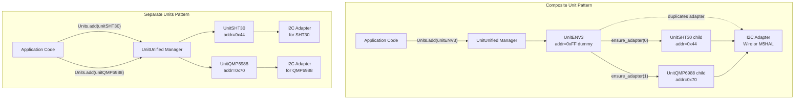
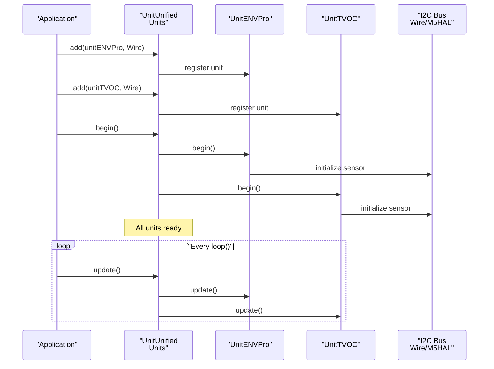
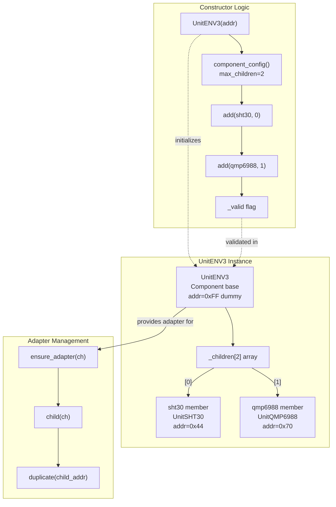
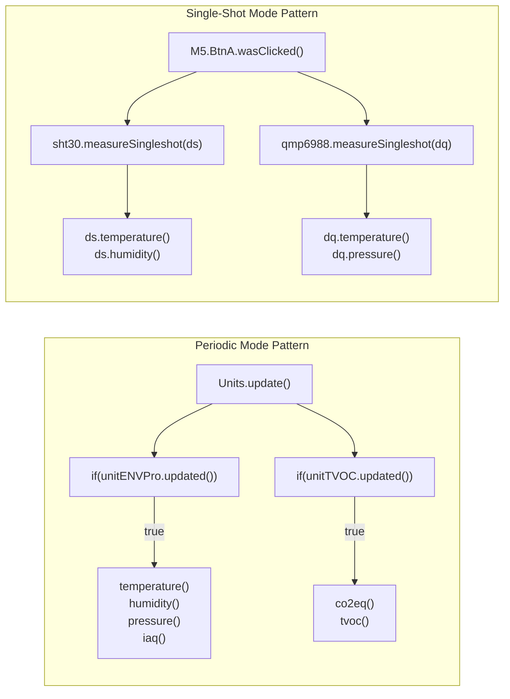
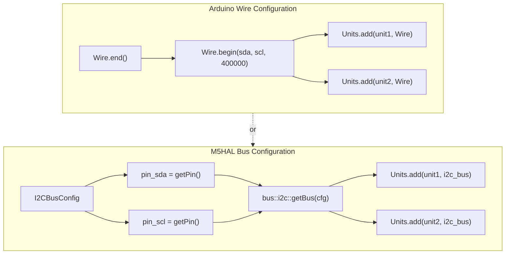

M5Unit-ENV Multi-Sensor Applications

# Multi-Sensor Applications

<details>
<summary>Relevant source files</summary>

The following files were used as context for generating this wiki page:

- [examples/UnitUnified/UnitENVIII/PlotToSerial/PlotToSerial.ino](examples/UnitUnified/UnitENVIII/PlotToSerial/PlotToSerial.ino)
- [examples/UnitUnified/UnitENVIII/PlotToSerial/main/PlotToSerial.cpp](examples/UnitUnified/UnitENVIII/PlotToSerial/main/PlotToSerial.cpp)
- [examples/UnitUnified/UnitENVPro/PlotToSerial/PlotToSerial.ino](examples/UnitUnified/UnitENVPro/PlotToSerial/PlotToSerial.ino)
- [examples/UnitUnified/UnitENVPro/PlotToSerial/main/PlotToSerial.cpp](examples/UnitUnified/UnitENVPro/PlotToSerial/main/PlotToSerial.cpp)
- [examples/UnitUnified/UnitTVOC/PlotToSerial/main/PlotToSerial.cpp](examples/UnitUnified/UnitTVOC/PlotToSerial/main/PlotToSerial.cpp)
- [src/unit/unit_ENV3.cpp](src/unit/unit_ENV3.cpp)
- [src/unit/unit_ENV3.hpp](src/unit/unit_ENV3.hpp)

</details>


This document explains how to manage multiple environmental sensor units simultaneously within a single application. It covers two primary architectural patterns: using composite units (ENV3/ENV4) that bundle multiple sensors versus managing individual sensor units separately. The document demonstrates coordination through the `UnitUnified` manager, handling different update intervals, and aggregating data from various sources.

For basic single-sensor patterns and measurement modes, see [Usage Patterns and Examples](#5). For specific composite unit implementations, see [ENV3](#4.8) and [ENV4](#4.9).

---

## Composite vs Separate Unit Patterns

The library provides two approaches for working with multiple sensors that are physically packaged together (like ENV3's SHT30+QMP6988 combination):

| Approach | Units Added | Component Count | Adapter Management | Use Case |
|----------|-------------|-----------------|-------------------|----------|
| **Composite** | 1 (UnitENV3) | Parent + 2 children | Automatic via parent | Simplified code, logical grouping |
| **Separate** | 2 (UnitSHT30, UnitQMP6988) | 2 independent | Manual per unit | Fine-grained control, flexibility |

### Architecture Comparison



**Sources:** [examples/UnitUnified/UnitENVIII/PlotToSerial/main/PlotToSerial.cpp:18-41](), [src/unit/unit_ENV3.hpp:20-49]()

---

## UnitUnified Manager Setup

The `UnitUnified` manager coordinates multiple sensor units, handling initialization, periodic updates, and lifecycle management. Units are added before calling `begin()`, which initializes all registered units.

### Adding Units to the Manager



### Code Pattern: Multiple Unit Registration

The composite unit pattern from the ENVIII example demonstrates conditional compilation for choosing between approaches:

[examples/UnitUnified/UnitENVIII/PlotToSerial/main/PlotToSerial.cpp:18-41]()
```cpp
#if defined(USING_ENV3)
    m5::unit::UnitENV3 unitENV3;
    auto& sht30   = unitENV3.sht30;
    auto& qmp6988 = unitENV3.qmp6988;
#else
    m5::unit::UnitSHT30 unitSHT30;
    m5::unit::UnitQMP6988 unitQMP6988;
    auto& sht30   = unitSHT30;
    auto& qmp6988 = unitQMP6988;
#endif
```

The registration in `setup()` differs based on the pattern:

[examples/UnitUnified/UnitENVIII/PlotToSerial/main/PlotToSerial.cpp:64-119]()
```cpp
// Composite: Single add() call
if (!Units.add(unitENV3, Wire) || !Units.begin()) {
    // error handling
}

// Separate: Multiple add() calls
if (!Units.add(unitSHT30, Wire) || 
    !Units.add(unitQMP6988, Wire) || 
    !Units.begin()) {
    // error handling
}
```

**Sources:** [examples/UnitUnified/UnitENVIII/PlotToSerial/main/PlotToSerial.cpp:43-127](), [examples/UnitUnified/UnitENVPro/PlotToSerial/main/PlotToSerial.cpp:19-39](), [examples/UnitUnified/UnitTVOC/PlotToSerial/main/PlotToSerial.cpp:14-43]()

---

## Parent-Child Architecture in Composite Units

Composite units like `UnitENV3` implement a parent-child relationship where the parent acts as a logical container with no I2C address, and children represent the actual physical sensors.

### ENV3 Internal Structure



### Adapter Duplication Mechanism

The parent unit duplicates the I2C adapter for each child with the child's specific address. This is handled by `ensure_adapter()`:

[src/unit/unit_ENV3.cpp:32-45]()
```cpp
std::shared_ptr<Adapter> UnitENV3::ensure_adapter(const uint8_t ch)
{
    // Validate channel number
    if (ch > 2) {
        M5_LIB_LOGE("Invalid channel %u", ch);
        return std::make_shared<Adapter>();  // Empty adapter
    }
    auto unit = child(ch);
    if (!unit) {
        M5_LIB_LOGE("Not exists unit %u", ch);
        return std::make_shared<Adapter>();
    }
    // Duplicate parent's adapter with child's address
    auto ad = asAdapter<AdapterI2C>(Adapter::Type::I2C);
    return ad ? std::shared_ptr<Adapter>(ad->duplicate(unit->address())) 
              : std::make_shared<Adapter>();
}
```

The constructor establishes the parent-child relationship:

[src/unit/unit_ENV3.cpp:23-30]()
```cpp
UnitENV3::UnitENV3(const uint8_t addr) : Component(addr)
{
    auto cfg         = component_config();
    cfg.max_children = 2;
    component_config(cfg);
    _valid = add(sht30, 0) && add(qmp6988, 1);
}
```

**Sources:** [src/unit/unit_ENV3.hpp:20-49](), [src/unit/unit_ENV3.cpp:23-45]()

---

## Update Coordination and Measurement Timing

The `UnitUnified` manager's `update()` method cascades to all registered units, triggering their individual update logic. Each sensor may operate on different timing characteristics.

### Update Flow for Multiple Sensors

```mermaid
sequenceDiagram
    participant Loop as "loop()"
    participant Manager as "Units.update()"
    participant ENVPro as "UnitENVPro"
    participant TVOC as "UnitTVOC"
    participant SHT30 as "UnitSHT30"
    participant QMP as "UnitQMP6988"
    
    Loop->>Manager: update()
    
    Note over Manager: Iterate all units
    
    Manager->>ENVPro: update()
    Note over ENVPro: Check measurement timer<br/>Read if ready
    ENVPro-->>Manager: updated flag set
    
    Manager->>TVOC: update()
    Note over TVOC: 15s warmup check<br/>1s measurement interval
    TVOC-->>Manager: updated flag set
    
    Manager->>SHT30: update()
    Note over SHT30: Periodic mode check<br/>Read buffer data
    SHT30-->>Manager: updated flag set
    
    Manager->>QMP: update()
    Note over QMP: Periodic mode check<br/>Read buffer data
    QMP-->>Manager: updated flag set
    
    Note over Loop: Check individual updated() flags
```

### Periodic vs Single-Shot Coordination

The ENVIII example demonstrates handling both measurement modes for multiple sensors:

[examples/UnitUnified/UnitENVIII/PlotToSerial/main/PlotToSerial.cpp:51-62]()
```cpp
#if defined(USING_SINGLE_SHOT)
    {
        auto cfg           = sht30.config();
        cfg.start_periodic = false;
        sht30.config(cfg);
    }
    {
        auto cfg           = qmp6988.config();
        cfg.start_periodic = false;
        qmp6988.config(cfg);
    }
#endif
```

**Sources:** [examples/UnitUnified/UnitENVIII/PlotToSerial/main/PlotToSerial.cpp:43-127](), [examples/UnitUnified/UnitENVPro/PlotToSerial/main/PlotToSerial.cpp:42-56]()

---

## Data Aggregation and Access Patterns

Applications access sensor data through direct member access on units or composite unit children. The `updated()` flag indicates when new data is available.

### Multi-Sensor Data Collection



### Periodic Mode Data Access

The periodic mode relies on the `updated()` flag to know when fresh data is available:

[examples/UnitUnified/UnitENVIII/PlotToSerial/main/PlotToSerial.cpp:146-152]()
```cpp
if (sht30.updated()) {
    M5.Log.printf(">SHT30Temp:%2.2f\n>Humidity:%2.2f\n", 
                  sht30.temperature(), sht30.humidity());
}
if (qmp6988.updated()) {
    M5.Log.printf(">QMP6988Temp:%2.2f\n>Pressure:%.2f\n", 
                  qmp6988.temperature(), qmp6988.pressure() * 0.01f);
}
```

### Single-Shot Mode Data Access

Single-shot mode requires explicit measurement calls with data structure arguments:

[examples/UnitUnified/UnitENVIII/PlotToSerial/main/PlotToSerial.cpp:134-144]()
```cpp
if (M5.BtnA.wasClicked()) {
    m5::unit::sht30::Data ds{};
    if (sht30.measureSingleshot(ds)) {
        M5.Log.printf(">SHT30Temp:%2.2f\n>Humidity:%2.2f\n", 
                      ds.temperature(), ds.humidity());
    }
    m5::unit::qmp6988::Data dq{};
    if (qmp6988.measureSingleshot(dq)) {
        M5.Log.printf(">QMP6988Temp:%2.2f\n>Pressure:%.2f\n", 
                      dq.temperature(), dq.pressure() * 0.01f);
    }
}
```

**Sources:** [examples/UnitUnified/UnitENVIII/PlotToSerial/main/PlotToSerial.cpp:129-153]()

---

## Handling Different Sensor Characteristics

Different sensors have varying initialization requirements and update intervals that must be coordinated in multi-sensor applications.

### Sensor Timing Characteristics

| Sensor | Warmup Period | Measurement Interval | Single-Shot Support | Notes |
|--------|---------------|---------------------|---------------------|-------|
| **SHT30** | Immediate | Configurable (0.5-10 Hz) | Yes | No warmup required |
| **QMP6988** | Immediate | Configurable | Yes | Standby time configurable |
| **BME688** | 5 min (BSEC2 stabilization) | 3s (default) | Yes | IAQ requires stabilization |
| **SCD40** | None | 5s fixed | No | Always periodic |
| **SCD41** | None | 5s or 30s | Yes | Enhanced power control |
| **SGP30** | **15 seconds** | 1s | No | Critical: must wait before valid data |
| **BMP280** | Immediate | Configurable | Yes | Multiple use case presets |

### SGP30 Special Handling

The TVOC unit (SGP30) requires a 15-second warmup before measurements are valid. Applications must account for this:

[examples/UnitUnified/UnitTVOC/PlotToSerial/main/PlotToSerial.cpp:41-56]()
```cpp
M5_LOGW("SGP30 measurement starts 15 seconds after begin");

void loop() {
    M5.update();
    Units.update();
    
    // SGP30 measurement starts 15 seconds after begin.
    if (unit.updated()) {
        M5.Log.printf("\n>CO2eq:%u\n>TVOC:%u", unit.co2eq(), unit.tvoc());
    }
}
```

The `updated()` flag only returns true after the warmup period completes, preventing premature data access.

**Sources:** [examples/UnitUnified/UnitTVOC/PlotToSerial/main/PlotToSerial.cpp:41-56]()

---

## I2C Bus Configuration for Multiple Units

All units on the same physical I2C bus share the bus configuration. The library supports both Arduino `Wire` and M5HAL bus abstraction.

### Bus Configuration Options



### Wire Configuration Example

[examples/UnitUnified/UnitENVIII/PlotToSerial/main/PlotToSerial.cpp:79-90]()
```cpp
Wire.end();
Wire.begin(pin_num_sda, pin_num_scl, 400000U);

if (!Units.add(unitENV3, Wire) || !Units.begin()) {
    M5_LOGE("Failed to begin");
    // error handling
}
```

### M5HAL Configuration Example

[examples/UnitUnified/UnitENVIII/PlotToSerial/main/PlotToSerial.cpp:66-77]()
```cpp
m5::hal::bus::I2CBusConfig i2c_cfg;
i2c_cfg.pin_sda = m5::hal::gpio::getPin(pin_num_sda);
i2c_cfg.pin_scl = m5::hal::gpio::getPin(pin_num_scl);
auto i2c_bus    = m5::hal::bus::i2c::getBus(i2c_cfg);

if (!Units.add(unitENV3, i2c_bus ? i2c_bus.value() : nullptr) || 
    !Units.begin()) {
    M5_LOGE("Failed to begin");
    // error handling
}
```

**Sources:** [examples/UnitUnified/UnitENVIII/PlotToSerial/main/PlotToSerial.cpp:64-119]()

---

## Best Practices for Multi-Sensor Applications

1. **Use Composite Units When Appropriate**: For physically bundled sensors like ENV3, the composite unit pattern simplifies code and ensures proper adapter management.

2. **Configure Before begin()**: Set measurement modes (`start_periodic` flag) before calling `Units.begin()` to avoid unnecessary initialization delays.

3. **Respect Sensor Warmup Periods**: Critical for SGP30 (15s) and BME688 (5min for IAQ). Check `updated()` flags before accessing data.

4. **Single I2C Bus Configuration**: Configure the I2C bus once and pass the same bus reference to all `Units.add()` calls.

5. **Handle Timing Differences**: Use the `updated()` flag to determine when each sensor has new data, avoiding assumptions about synchronization.

6. **Error Checking**: Always verify `Units.add()` and `Units.begin()` return values, especially with multiple units where initialization order matters.

7. **Debug Information**: Use `Units.debugInfo()` to verify all units registered correctly and have the expected addresses.

**Sources:** [examples/UnitUnified/UnitENVIII/PlotToSerial/main/PlotToSerial.cpp:43-153](), [examples/UnitUnified/UnitTVOC/PlotToSerial/main/PlotToSerial.cpp:20-56]()