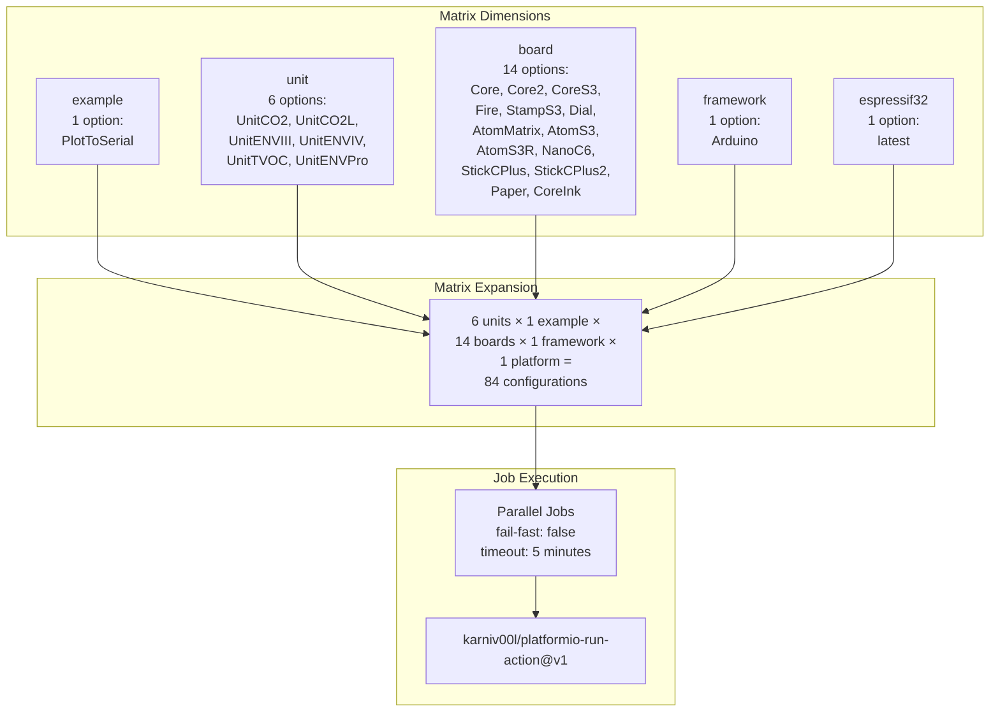
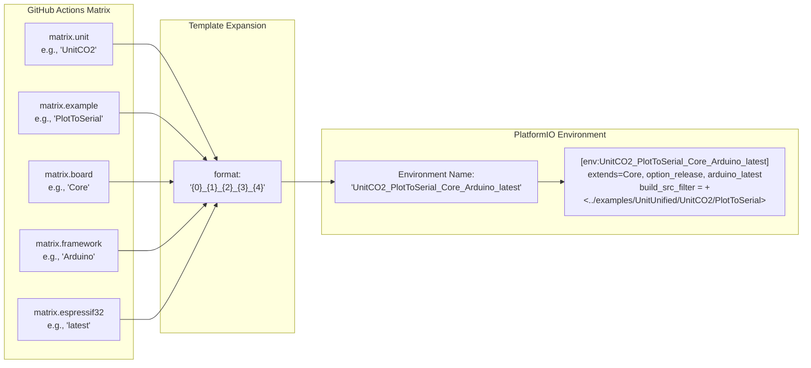
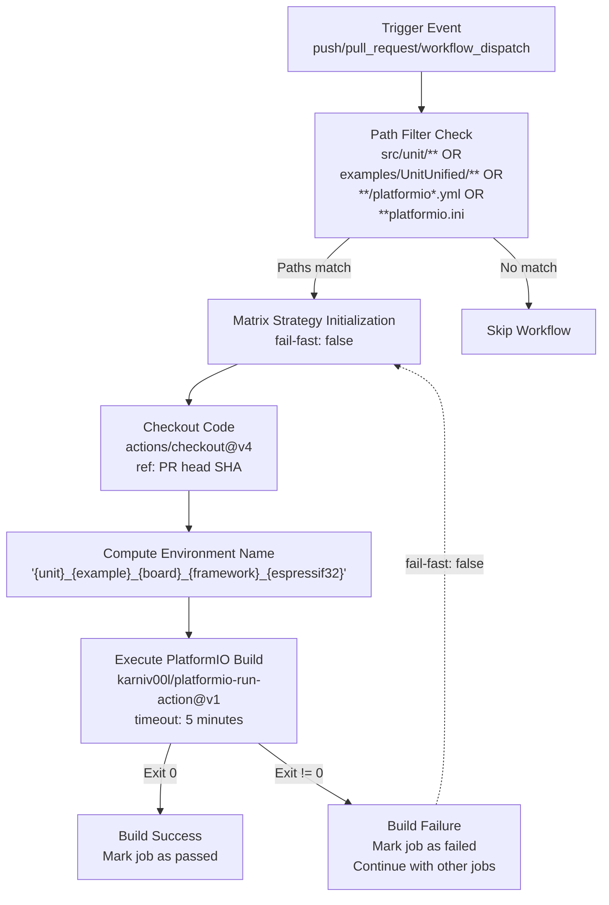

M5Unit-ENV PlatformIO Build Verification

# PlatformIO Build Verification

<details>
<summary>Relevant source files</summary>

The following files were used as context for generating this wiki page:

- [.github/workflows/platformio-build-check.yml](.github/workflows/platformio-build-check.yml)
- [examples/UnitUnified/UnitCO2L/PlotToSerial/PlotToSerial.ino](examples/UnitUnified/UnitCO2L/PlotToSerial/PlotToSerial.ino)
- [platformio.ini](platformio.ini)
- [src/M5UnitUnifiedENV.hpp](src/M5UnitUnifiedENV.hpp)
- [unit_co2_env.ini](unit_co2_env.ini)

</details>


This page documents the PlatformIO-based continuous integration workflow, which validates the library against a comprehensive matrix of hardware boards and environmental sensor units. The workflow compiles example sketches using PlatformIO's build system to ensure code compatibility across the M5Stack ecosystem.

For Arduino-based CI validation, see [Arduino Build Matrix](#7.1). For documentation generation and code quality checks, see [Code Quality and Documentation](#7.3).

## Workflow Overview

The PlatformIO build verification workflow executes on every push and pull request, using path-based filtering to trigger only when relevant source files or configurations change. The workflow runs on GitHub Actions using `ubuntu-latest` runners with a 5-minute timeout per job.

**Trigger Conditions:**

The workflow activates when changes affect:
- Sensor driver source: `src/unit/**.(cpp|hpp|h|c)`
- Example code: `examples/UnitUnified/**.(ino|cpp|hpp|h|c)`
- CI configuration: `platformio-build-check.yml`
- Build configuration: `platformio.ini` and unit-specific `.ini` files

The workflow excludes tagged releases (lines 5-7 in workflow file prevent execution on version tags).

Sources: [.github/workflows/platformio-build-check.yml:1-44]()

## Build Matrix Configuration

The workflow uses GitHub Actions matrix strategy to expand a multi-dimensional build space, creating 84 distinct build configurations from combinations of unit types, target boards, and platform versions.



**Matrix Dimensions Table:**

| Dimension | Active Values | Commented Values | Total Configs |
|-----------|--------------|------------------|---------------|
| `example` | `PlotToSerial` | None | 1 |
| `unit` | `UnitCO2`, `UnitCO2L`, `UnitENVIII`, `UnitENVIV`, `UnitTVOC`, `UnitENVPro` | None | 6 |
| `board` | Core, Core2, CoreS3, Fire, StampS3, Dial, AtomMatrix, AtomS3, AtomS3R, NanoC6, StickCPlus, StickCPlus2, Paper, CoreInk | None | 14 |
| `framework` | `Arduino` | None | 1 |
| `espressif32` | `latest` | `5_4_0`, `4_4_0` | 1 |
| **Total** | | | **84** |

The workflow includes extensive commented-out exclusion rules (lines 91-119) that previously handled platform version incompatibilities for S3-based boards. These are currently inactive but show the framework's flexibility for handling platform-specific constraints.

Sources: [.github/workflows/platformio-build-check.yml:51-120]()

## Environment Naming Convention

The workflow constructs PlatformIO environment names by concatenating matrix variables using a specific pattern. This naming scheme maps GitHub Actions matrix parameters to pre-defined PlatformIO environments in the configuration files.



**Naming Pattern:**

The workflow uses a format string to construct environment names:
```
{unit}_{example}_{board}_{framework}_{espressif32}
```

Example expansions:
- `UnitCO2_PlotToSerial_Core_Arduino_latest`
- `UnitENVPro_PlotToSerial_AtomS3_Arduino_latest`
- `UnitTVOC_PlotToSerial_NanoC6_Arduino_latest`

The format logic is defined in the workflow's `with.environments` parameter using conditional formatting (line 130).

Sources: [.github/workflows/platformio-build-check.yml:127-134](), [unit_co2_env.ini:178-256]()

## Configuration File Hierarchy

The PlatformIO build system uses a modular configuration structure with a main `platformio.ini` file that includes unit-specific configuration files via the `extra_configs` directive.

```mermaid
graph TB
    subgraph "Main Configuration"
        MAIN["platformio.ini"]
        EXTRA_CONFIGS["extra_configs directive:<br/>unit_co2_env.ini<br/>unit_env3_env.ini<br/>unit_env4_env.ini<br/>unit_envpro_env.ini<br/>unit_tvoc_env.ini"]
    end
    
    subgraph "Base Sections"
        ENV["[env]<br/>Common build_flags<br/>lib_ldf_mode = deep<br/>test_framework = googletest"]
        BSEC2["[bsec2]<br/>lib_deps for BSEC2"]
        M5BASE["[m5base]<br/>monitor_speed<br/>upload_speed<br/>test configuration"]
    end
    
    subgraph "Board Sections"
        CORE["[Core]<br/>extends = m5base<br/>board = m5stack-grey<br/>lib_deps + bsec2"]
        CORE2["[Core2]<br/>extends = m5base<br/>board = m5stack-core2<br/>lib_deps + bsec2"]
        NANOC6["[NanoC6]<br/>extends = m5base<br/>board = m5stack-nanoc6<br/>lib_deps (NO bsec2)"]
    end
    
    subgraph "Framework Versions"
        LATEST["[arduino_latest]<br/>platform = espressif32 @ 6.8.1"]
        V6_6_0["[arduino_6_6_0]<br/>platform = espressif32 @ 6.6.0"]
        V5_4_0["[arduino_5_4_0]<br/>platform = espressif32 @ 5.4.0"]
    end
    
    subgraph "Build Options"
        RELEASE["[option_release]<br/>build_type=release<br/>CORE_DEBUG_LEVEL=3"]
        LOG["[option_log]<br/>build_type=release<br/>CORE_DEBUG_LEVEL=5"]
        DEBUG["[option_debug]<br/>build_type=debug<br/>DEBUG defined"]
    end
    
    subgraph "Unit Configurations"
        UNIT_CO2["unit_co2_env.ini<br/>[env:test_SCD40_Core]<br/>[env:UnitCO2_PlotToSerial_Core_Arduino_latest]"]
        UNIT_ENV3["unit_env3_env.ini<br/>ENV3 test/example environments"]
        UNIT_ENV4["unit_env4_env.ini<br/>ENV4 test/example environments"]
        UNIT_ENVPRO["unit_envpro_env.ini<br/>ENVPro test/example environments"]
        UNIT_TVOC["unit_tvoc_env.ini<br/>TVOC test/example environments"]
    end
    
    MAIN --> EXTRA_CONFIGS
    MAIN --> ENV
    MAIN --> BSEC2
    MAIN --> M5BASE
    MAIN --> CORE
    MAIN --> CORE2
    MAIN --> NANOC6
    MAIN --> LATEST
    MAIN --> V6_6_0
    MAIN --> V5_4_0
    MAIN --> RELEASE
    MAIN --> LOG
    MAIN --> DEBUG
    
    EXTRA_CONFIGS --> UNIT_CO2
    EXTRA_CONFIGS --> UNIT_ENV3
    EXTRA_CONFIGS --> UNIT_ENV4
    EXTRA_CONFIGS --> UNIT_ENVPRO
    EXTRA_CONFIGS --> UNIT_TVOC
    
    UNIT_CO2 -.->|extends| CORE
    UNIT_CO2 -.->|extends| RELEASE
    UNIT_CO2 -.->|extends| LATEST
```



**Configuration Inheritance Pattern:**

Each environment definition in the unit-specific `.ini` files uses PlatformIO's `extends` feature to compose configurations:

```ini
[env:UnitCO2_PlotToSerial_Core_Arduino_latest]
extends=Core, option_release, arduino_latest
build_src_filter = +<*> -<.git/> -<.svn/> +<../examples/UnitUnified/UnitCO2/PlotToSerial>
```

This inherits from three base sections:
- `Core`: Board configuration (m5stack-grey, library dependencies)
- `option_release`: Build type and debug levels
- `arduino_latest`: Platform version (espressif32 @ 6.8.1)

Sources: [platformio.ini:1-204](), [unit_co2_env.ini:1-338]()

## Example Environment Definitions

Unit-specific configuration files define two types of environments: test environments for GoogleTest-based unit tests and example environments for sketch compilation.

**Test Environment Pattern:**

Test environments filter to specific test directories and include GoogleTest dependencies:

```ini
[env:test_SCD40_Core]
extends=Core, option_release, arduino_latest
lib_deps = ${Core.lib_deps} 
  ${test_fw.lib_deps}
test_filter= embedded/test_scd40
```

**Example Environment Pattern:**

Example environments use `build_src_filter` to include specific sketch directories:

```ini
[env:UnitCO2_PlotToSerial_Core_Arduino_latest]
extends=Core, option_release, arduino_latest
build_src_filter = +<*> -<.git/> -<.svn/> +<../examples/UnitUnified/UnitCO2/PlotToSerial>
```

**Environment Multiplication:**

For each unit/example combination, the configuration files define environments across:
- 14 different boards (Core, Core2, CoreS3, Fire, etc.)
- Multiple platform versions (latest, 5_4_0, 4_4_0 for select boards)

Example: UnitCO2 PlotToSerial example has 17 environment definitions spanning different boards and platform versions (lines 178-256 in unit_co2_env.ini).

Sources: [unit_co2_env.ini:5-88](), [unit_co2_env.ini:178-256]()

## Platform-Specific Considerations

### BSEC2 Exclusion for NanoC6

The NanoC6 board configuration explicitly excludes the BSEC2 library dependency, unlike other boards that include `${bsec2.lib_deps}`. This exclusion is necessary due to resource constraints on the ESP32-C6 platform.

**Board Configuration Comparison:**

| Board | BSEC2 Included | Platform | Notes |
|-------|----------------|----------|-------|
| Core | ✓ | espressif32 @ 6.8.1 | Standard |
| Core2 | ✓ | espressif32 @ 6.8.1 | Standard |
| NanoC6 | ✗ | Custom (IDF 5.1) | Uses custom platform packages |
| AtomS3 | ✓ | espressif32 @ 6.8.1 | Standard |

The NanoC6 environment also uses custom platform packages referencing specific git commits for Arduino framework and libraries, ensuring compatibility with ESP32-C6 architecture.

Sources: [platformio.ini:88-98](), [platformio.ini:34-54]()

### Custom Board Definitions

Some boards use custom board definition JSON files located in the `./boards/` directory:
- `m5stack-atoms3r.json` for AtomS3R
- `m5stack-nanoc6.json` for NanoC6
- `m5stick-cplus2.json` for StickCPlus2

These custom definitions allow the library to support boards not yet included in the standard PlatformIO board database.

Sources: [platformio.ini:82-111]()

## Build Action Configuration

The workflow uses the `karniv00l/platformio-run-action@v1` GitHub Action to execute PlatformIO builds. The action receives:

**Input Parameters:**

| Parameter | Value | Description |
|-----------|-------|-------------|
| `environments` | Matrix-derived environment name | Specifies which PlatformIO environment to build |
| `project-dir` | `"./"` | Root directory of the project |
| `project-conf` | `"./platformio.ini"` | Path to configuration file |

**Optional Parameters (Commented):**

The workflow includes commented-out optional parameters that can be enabled for debugging:
- `targets`: Specific build targets (e.g., upload, test)
- `jobs`: Parallel build job count (default: 6)
- `silent`: Suppress build output (default: false)
- `verbose`: Enable verbose logging (default: true)
- `disable-auto-clean`: Prevent automatic cleanup (default: false)

Sources: [.github/workflows/platformio-build-check.yml:127-137]()

## Workflow Execution Flow



**Concurrency Control:**

The workflow implements concurrency management to cancel redundant builds:
```yaml
concurrency:
  group: ${{ github.workflow }}-${{ github.ref }}
  cancel-in-progress: true
```

This ensures that when new commits are pushed to a branch, previous in-progress builds for that branch are cancelled, reducing CI resource consumption.

Sources: [.github/workflows/platformio-build-check.yml:41-49](), [.github/workflows/platformio-build-check.yml:121-137]()

## Comparison with Arduino CI

The PlatformIO build verification differs from the Arduino build matrix (see [Arduino Build Matrix](#7.1)) in several key aspects:

| Aspect | PlatformIO CI | Arduino CI |
|--------|---------------|------------|
| **Build Tool** | PlatformIO Core | Arduino CLI |
| **Environment Management** | Pre-defined in .ini files | Dynamic matrix expansion |
| **Configuration Count** | 84 (6 units × 14 boards) | 100+ (6 units × varying boards × 3 platforms) |
| **Platform Versions** | Single version (latest) | Three variants (ESP32 v3, v2, M5Stack) |
| **Build Action** | karniv00l/platformio-run-action | arduino/compile-sketches |
| **Example Coverage** | PlotToSerial only | All examples in each unit directory |
| **Configuration Complexity** | High (requires .ini definition) | Low (matrix auto-generates) |
| **Dependency Management** | lib_deps in platformio.ini | Arduino library manager |

The PlatformIO approach provides more precise control over build environments at the cost of configuration verbosity, while Arduino CI offers broader example coverage with simpler configuration.

Sources: [.github/workflows/platformio-build-check.yml:1-138]()

## Build Matrix Expansion Example

For a single unit (e.g., UnitCO2), the workflow generates environment names for all 14 boards:

```
UnitCO2_PlotToSerial_Core_Arduino_latest
UnitCO2_PlotToSerial_Core2_Arduino_latest
UnitCO2_PlotToSerial_CoreS3_Arduino_latest
UnitCO2_PlotToSerial_Fire_Arduino_latest
UnitCO2_PlotToSerial_StampS3_Arduino_latest
UnitCO2_PlotToSerial_Dial_Arduino_latest
UnitCO2_PlotToSerial_AtomMatrix_Arduino_latest
UnitCO2_PlotToSerial_AtomS3_Arduino_latest
UnitCO2_PlotToSerial_AtomS3R_Arduino_latest
UnitCO2_PlotToSerial_NanoC6_Arduino_latest
UnitCO2_PlotToSerial_StickCPlus_Arduino_latest
UnitCO2_PlotToSerial_StickCPlus2_Arduino_latest
UnitCO2_PlotToSerial_Paper_Arduino_latest
UnitCO2_PlotToSerial_CoreInk_Arduino_latest
```

Each environment name must have a corresponding `[env:...]` section defined in the unit-specific `.ini` file for the build to succeed.

Sources: [unit_co2_env.ini:178-248]()

## Job Naming Convention

Each parallel job receives a descriptive name constructed from the matrix variables:

```
${{ matrix.unit }}:${{ matrix.example }}@${{ matrix.board }}:${{ matrix.framework }}:${{ matrix.espressif32 }}
```

Example job names:
- `UnitCO2:PlotToSerial@Core:Arduino:latest`
- `UnitENVPro:PlotToSerial@AtomS3:Arduino:latest`
- `UnitTVOC:PlotToSerial@NanoC6:Arduino:latest`

This naming scheme provides clear identification in the GitHub Actions UI, making it easy to identify failing builds at a glance.

Sources: [.github/workflows/platformio-build-check.yml:47]()