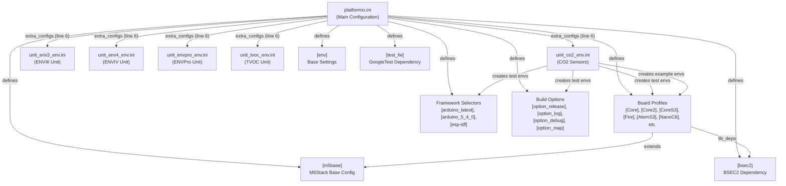
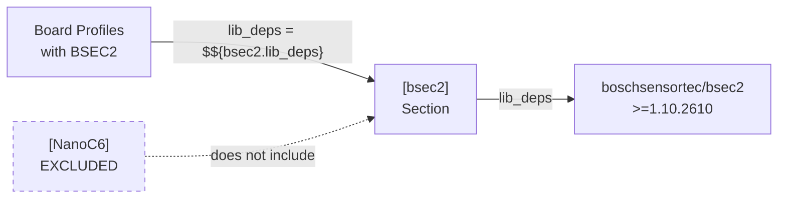
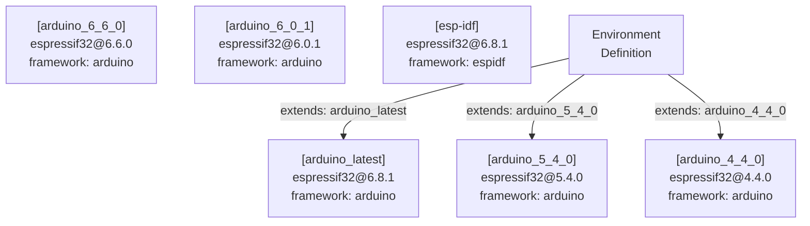
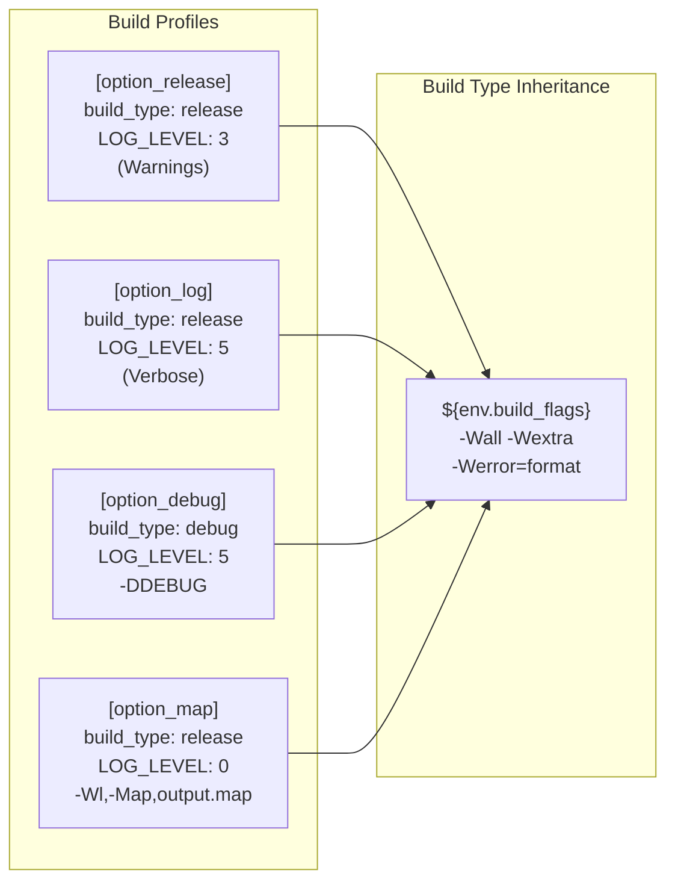
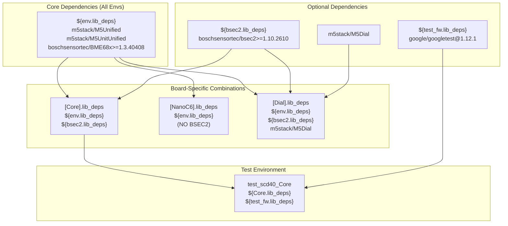
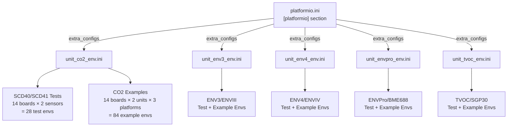
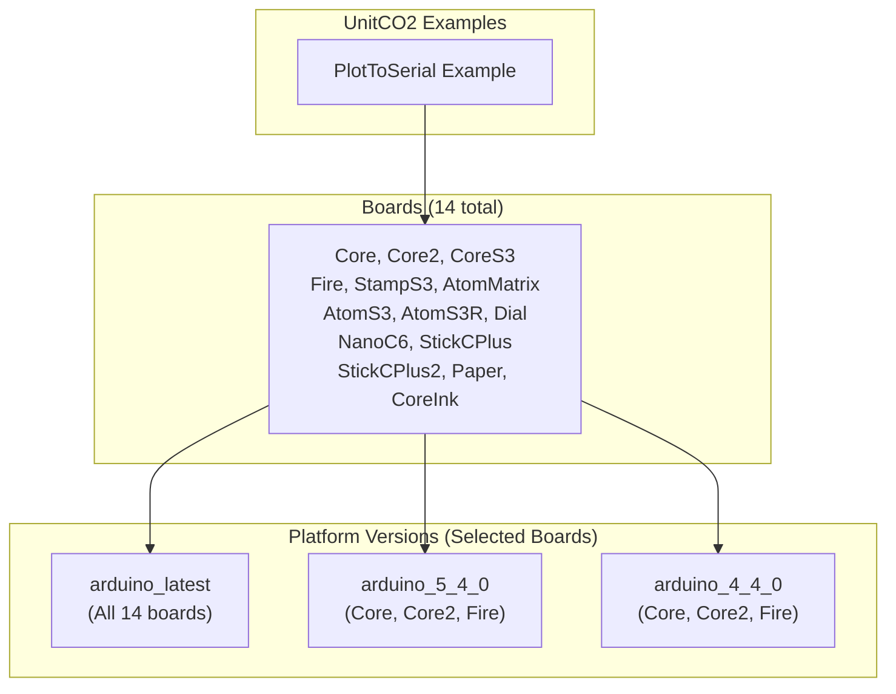
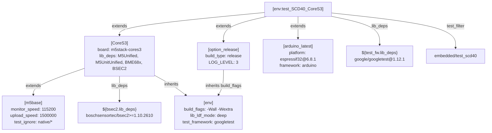

M5Unit-ENV PlatformIO Configuration

# PlatformIO Configuration

<details>
<summary>Relevant source files</summary>

The following files were used as context for generating this wiki page:

- [platformio.ini](platformio.ini)
- [src/M5UnitUnifiedENV.hpp](src/M5UnitUnifiedENV.hpp)
- [unit_co2_env.ini](unit_co2_env.ini)

</details>


This document provides a detailed technical reference for the PlatformIO build system configuration used in the M5Unit-ENV library. It covers the structure of `platformio.ini`, board-specific configurations, framework selection, build options, dependency management, and the organization of unit-specific configuration files. This configuration enables building and testing the library across 14+ M5Stack boards, multiple Arduino framework versions, and various build profiles.

For information about Arduino IDE integration and Arduino-specific build configurations, see [Arduino IDE Integration](#6.3). For details on the testing infrastructure and GoogleTest integration, see [Testing Infrastructure](#6.4). For the complete list of supported boards and platform-specific considerations, see [Supported Boards and Platforms](#6.2).

## Configuration File Organization

The PlatformIO configuration is split across multiple files using an inheritance-based structure to manage complexity and reduce duplication.



**Sources:** [platformio.ini:1-204]()

The main `platformio.ini` file defines reusable configuration sections (base settings, board profiles, framework versions, build options) which are then extended by specific environment definitions in the unit-specific `.ini` files. This pattern enables creating 100+ build configurations with minimal duplication.

## Base Configuration Sections

### Global Environment Settings [env]

The `[env]` section defines settings inherited by all environments unless explicitly overridden.

| Setting | Value | Purpose |
|---------|-------|---------|
| `build_flags` | `-Wall -Wextra -Wreturn-local-addr -Werror=format -Werror=return-local-addr` | Strict compiler warnings to catch common errors |
| `lib_ldf_mode` | `deep` | Deep library dependency finder mode for recursive dependencies |
| `test_framework` | `googletest` | Use GoogleTest for embedded unit tests |
| `test_build_src` | `true` | Include source files when building tests |
| `lib_deps` | `m5stack/M5Unified`, `m5stack/M5UnitUnified`, `boschsensortec/BME68x Sensor library@>=1.3.40408` | Core library dependencies required by all builds |

**Sources:** [platformio.ini:8-15]()

The compiler flags enforce strict error checking, particularly for format strings and returning addresses of local variables, which are common sources of bugs in embedded systems.

### BSEC2 Dependency Section [bsec2]



**Sources:** [platformio.ini:18-19](), [platformio.ini:89-97]()

The `[bsec2]` section centralizes the BSEC2 library dependency so it can be easily included or excluded. The NanoC6 board configuration notably excludes BSEC2 due to resource constraints on the ESP32-C6 chip.

### M5Stack Base Configuration [m5base]

The `[m5base]` section provides common settings for all M5Stack hardware boards:

| Setting | Value | Purpose |
|---------|-------|---------|
| `monitor_speed` | `115200` | Serial monitor baud rate |
| `monitor_filters` | `esp32_exception_decoder, time` | Enable exception decoding and timestamps |
| `upload_speed` | `1500000` | Fast upload speed for development |
| `test_speed` | `115200` | Serial speed for test output |
| `test_ignore` | `native/*` | Exclude native tests from embedded builds |

**Sources:** [platformio.ini:21-26]()

## Board Configuration Profiles

Each M5Stack board has a dedicated configuration section that extends `[m5base]` and specifies the board type and library dependencies.

```mermaid
graph TB
    subgraph "Standard M5Stack Boards"
        CORE["[Core]<br/>m5stack-grey<br/>+ BSEC2"]
        CORE2["[Core2]<br/>m5stack-core2<br/>+ BSEC2"]
        CORES3["[CoreS3]<br/>m5stack-cores3<br/>+ BSEC2"]
        FIRE["[Fire]<br/>m5stack-fire<br/>+ BSEC2"]
    end
    
    subgraph "Compact Form Factors"
        STAMPS3["[StampS3]<br/>m5stack-stamps3<br/>+ BSEC2"]
        DIAL["[Dial]<br/>m5stack-stamps3<br/>+ BSEC2 + M5Dial"]
        ATOM["[AtomMatrix]<br/>m5stack-atom<br/>+ BSEC2"]
        ATOMS3["[AtomS3]<br/>m5stack-atoms3<br/>+ BSEC2"]
        ATOMS3R["[AtomS3R]<br/>m5stack-atoms3r<br/>+ BSEC2"]
    end
    
    subgraph "Stick Series"
        STICKCP["[StickCPlus]<br/>m5stick-c<br/>+ BSEC2"]
        STICKCP2["[StickCPlus2]<br/>m5stick-cplus2<br/>+ BSEC2"]
    end
    
    subgraph "E-Paper Displays"
        PAPER["[Paper]<br/>m5stack-fire<br/>+ BSEC2"]
        COREINK["[CoreInk]<br/>m5stack-coreink<br/>+ BSEC2"]
    end
    
    subgraph "Special Configurations"
        NANOC6["[NanoC6]<br/>m5stack-nanoc6<br/>NO BSEC2<br/>Custom Platform"]
        SDL["[sdl]<br/>native platform<br/>SDL2 for simulation"]
    end
    
    M5BASE["[m5base]"]
    
    CORE --> M5BASE
    CORE2 --> M5BASE
    CORES3 --> M5BASE
    FIRE --> M5BASE
    STAMPS3 --> M5BASE
    DIAL --> M5BASE
    ATOM --> M5BASE
    ATOMS3 --> M5BASE
    ATOMS3R --> M5BASE
    STICKCP --> M5BASE
    STICKCP2 --> M5BASE
    PAPER --> M5BASE
    COREINK --> M5BASE
    NANOC6 --> M5BASE
```



**Sources:** [platformio.ini:28-123]()

### Standard Board Profiles

Most board profiles follow a simple pattern, extending `[m5base]` and including BSEC2:

```
[Core]
extends = m5base
board = m5stack-grey
lib_deps = ${env.lib_deps}
  ${bsec2.lib_deps}
```

**Sources:** [platformio.ini:28-35]()

### Special Case: NanoC6

The NanoC6 configuration is unique, requiring custom platform packages and excluding BSEC2:

| Configuration | Value | Reason |
|---------------|-------|--------|
| `board` | `m5stack-nanoc6` | Custom board definition in `./boards/` |
| `platform` | Git URL for latest ESP32 platform | ESP32-C6 requires bleeding-edge platform support |
| `platform_packages` | Specific Arduino framework and libs from Git | Pin to compatible versions for C6 chip |
| `lib_deps` | Excludes `${bsec2.lib_deps}` | BSEC2 library not compatible with ESP32-C6 architecture |

**Sources:** [platformio.ini:89-97]()

### Special Case: Dial

The Dial configuration extends StampS3 hardware but adds the M5Dial library:

```
[Dial]
extends = m5base
board = m5stack-stamps3
lib_deps = ${env.lib_deps}
  ${bsec2.lib_deps}
  m5stack/M5Dial
```

**Sources:** [platformio.ini:62-67]()

### Special Case: SDL (Native Simulation)

The SDL configuration enables native (host machine) builds for simulation and development without hardware:

**Sources:** [platformio.ini:124-134]()

- Platform: `native` (not ESP32)
- Build flags include SDL2 paths for both Intel and ARM macOS
- Test filter: `native/*` (only run native tests)
- Test ignore: `embedded/*` (skip embedded-only tests)

## Framework and Platform Selection

The configuration supports multiple versions of the Espressif32 platform to ensure compatibility across different Arduino-ESP32 releases.



**Sources:** [platformio.ini:138-164]()

### Platform Version Strategy

The library supports five Arduino framework versions and one ESP-IDF option:

| Section | Platform Version | Framework | Purpose |
|---------|-----------------|-----------|---------|
| `[arduino_latest]` | `espressif32@6.8.1` | `arduino` | Latest features and bug fixes |
| `[arduino_6_6_0]` | `espressif32@6.6.0` | `arduino` | Stable recent version |
| `[arduino_6_0_1]` | `espressif32@6.0.1` | `arduino` | First Arduino 3.x release |
| `[arduino_5_4_0]` | `espressif32@5.4.0` | `arduino` | Last Arduino 2.x stable |
| `[arduino_4_4_0]` | `espressif32@4.4.0` | `arduino` | Legacy support |
| `[esp-idf]` | `espressif32@6.8.1` | `espidf` | Native ESP-IDF framework |

**Sources:** [platformio.ini:138-164]()

The commented-out `[arduino_3_5_0]` section (lines 158-160) suggests that version 3.5.0 had compatibility issues and was removed from the test matrix.

## Build Options and Compiler Flags

Four build option profiles control logging verbosity and debug symbols:



**Sources:** [platformio.ini:168-198]()

### Build Option Details

| Profile | Build Type | Log Levels | Special Flags | Use Case |
|---------|-----------|------------|---------------|----------|
| `[option_release]` | `release` | All levels = 3 (Info) | None | Production builds |
| `[option_log]` | `release` | All levels = 5 (Verbose) | None | Development with detailed logging |
| `[option_debug]` | `debug` | All levels = 5 (Verbose) | `-DDEBUG` | Debugging with symbols |
| `[option_map]` | `release` | All levels = 0/3 | `-Wl,-Map,output.map` | Binary size analysis |

**Sources:** [platformio.ini:168-198]()

The log levels control multiple logging systems:
- `CORE_DEBUG_LEVEL`: Arduino core logging
- `LOG_LOCAL_LEVEL`: ESP-IDF logging
- `APP_LOG_LEVEL`: Application-level logging
- `M5_LOG_LEVEL`: M5Stack library logging (only in some profiles)

## Library Dependencies

Dependencies are organized hierarchically using variable substitution to avoid duplication.



**Sources:** [platformio.ini:13-15](), [platformio.ini:18-19](), [platformio.ini:34-35](), [platformio.ini:97](), [platformio.ini:201-202]()

### Core Dependencies (Required)

These dependencies are included in all builds:

- `m5stack/M5Unified` - Core M5Stack framework
- `m5stack/M5UnitUnified` - Unit management framework (version `>=0.1.0` implied)
- `boschsensortec/BME68x Sensor library@>=1.3.40408` - Low-level BME688 driver

**Sources:** [platformio.ini:13-15]()

### Optional Dependencies

- **BSEC2**: `boschsensortec/bsec2@>=1.10.2610` - Air quality algorithm for BME688, excluded from NanoC6
- **GoogleTest**: `google/googletest@1.12.1` - Testing framework, version pinned to 1.12.1 for C++14 compatibility
- **M5Dial**: `m5stack/M5Dial` - Additional library for Dial-specific features

**Sources:** [platformio.ini:18-19](), [platformio.ini:67](), [platformio.ini:201-202]()

Note on line 200: The comment "Require at least C++14 after 1.13.0" indicates that GoogleTest 1.13.0+ requires C++14, hence the library pins to 1.12.1.

## Unit-Specific Configuration Files

The main `platformio.ini` file includes five unit-specific configuration files via the `extra_configs` directive:



**Sources:** [platformio.ini:6]()

### Unit-Specific File Structure

Each unit-specific `.ini` file follows the same pattern:
1. **Test Environments**: One test environment per board, using the GoogleTest framework
2. **Example Environments**: Multiple example sketches × multiple boards × multiple platform versions

**Sources:** [unit_co2_env.ini:1-338]()

## Test Environment Matrix

Test environments use a systematic naming convention: `test_{SENSOR}_{BOARD}`.

### CO2 Sensor Test Environments

The CO2 configuration defines test environments for both SCD40 and SCD41 sensors across 14 boards:

| Environment Name Pattern | Board | Framework | Test Filter | Dependencies |
|-------------------------|-------|-----------|-------------|--------------|
| `test_SCD40_{Board}` | Core, Core2, CoreS3, Fire, StampS3, Dial, AtomMatrix, AtomS3, AtomS3R, NanoC6, StickCPlus, StickCPlus2, Paper, CoreInk | `arduino_latest` | `embedded/test_scd40` | Board deps + GoogleTest |
| `test_SCD41_{Board}` | (same 14 boards) | `arduino_latest` | `embedded/test_scd41` | Board deps + GoogleTest |

**Sources:** [unit_co2_env.ini:5-88](), [unit_co2_env.ini:91-174]()

### Test Configuration Pattern

Each test environment follows this structure:

```
[env:test_SCD40_Core]
extends=Core, option_release, arduino_latest
lib_deps = ${Core.lib_deps} 
  ${test_fw.lib_deps}
test_filter= embedded/test_scd40
```

**Sources:** [unit_co2_env.ini:5-9]()

Key aspects:
- **Multiple inheritance**: Extends board profile, build option, and framework version
- **Dependency addition**: Adds GoogleTest to board's existing dependencies
- **Test isolation**: `test_filter` runs only specific sensor tests
- **Build mode**: Uses `option_release` for optimized test binaries

## Example Build Environments

Example environments follow the naming pattern: `{Unit}_{Example}_{Board}_{Framework}`.

### CO2 Example Environment Matrix



**Sources:** [unit_co2_env.ini:178-257]()

### Example Environment Details

A typical example environment:

```
[env:UnitCO2_PlotToSerial_Core_Arduino_latest]
extends=Core, option_release, arduino_latest
build_src_filter = +<*> -<.git/> -<.svn/> +<../examples/UnitUnified/UnitCO2/PlotToSerial>
```

**Sources:** [unit_co2_env.ini:178-180]()

Key configuration elements:
- **build_src_filter**: Includes only the specific example directory from `examples/UnitUnified/`
- **Multiple versions**: Some boards (Core, Core2, Fire) are tested with `arduino_latest`, `arduino_5_4_0`, and `arduino_4_4_0`
- **Consistent naming**: Pattern allows CI automation to easily generate build matrices

### CO2L (SCD41) Example Environments

The UnitCO2L examples mirror the UnitCO2 structure with identical board and platform coverage:

```
[env:UnitCO2L_PlotToSerial_Core_Arduino_latest]
extends=Core, option_release, arduino_latest
build_src_filter = +<*> -<.git/> -<.svn/> +<../examples/UnitUnified/UnitCO2L/PlotToSerial>
```

**Sources:** [unit_co2_env.ini:259-338]()

## Environment Naming Convention

The environment naming follows a strict hierarchical pattern that encodes configuration information:

| Pattern | Example | Components |
|---------|---------|------------|
| **Test Environments** | `test_SCD40_CoreS3` | `test_{SENSOR}_{BOARD}` |
| **Example Environments (Latest)** | `UnitCO2_PlotToSerial_AtomS3_Arduino_latest` | `{UNIT}_{EXAMPLE}_{BOARD}_Arduino_latest` |
| **Example Environments (Versioned)** | `UnitCO2_PlotToSerial_Fire_Arduino_5_4_0` | `{UNIT}_{EXAMPLE}_{BOARD}_Arduino_{VERSION}` |

**Sources:** [unit_co2_env.ini:5-338]()

This naming convention enables:
- Automated CI job generation by parsing environment names
- Quick identification of configuration from build logs
- Systematic coverage validation across boards and platforms

## Configuration Composition Example

To illustrate how the configuration inheritance works, consider the environment `test_SCD40_CoreS3`:



**Sources:** [unit_co2_env.ini:17-21](), [platformio.ini:44-47](), [platformio.ini:21-26](), [platformio.ini:168-174](), [platformio.ini:138-140](), [platformio.ini:8-15]()

The final resolved configuration combines:
1. Base environment settings (compiler flags, test framework)
2. M5Stack base settings (serial speeds, monitor filters)
3. CoreS3 board selection and dependencies
4. Release build options (log levels)
5. Latest Arduino framework version
6. GoogleTest dependency addition
7. SCD40-specific test filter

## Summary of Configuration Scale

The PlatformIO configuration manages a complex matrix of build permutations:

| Configuration Category | Count | Notes |
|-----------------------|-------|-------|
| **Board Profiles** | 14 embedded + 1 native | Excludes commented boards |
| **Framework Versions** | 5 Arduino + 1 ESP-IDF | Actively tested versions |
| **Build Options** | 4 | release, log, debug, map |
| **Unit-Specific Files** | 5 | CO2, ENV3, ENV4, ENVPro, TVOC |
| **Test Environments** | 28 (CO2 only) | 2 sensors × 14 boards |
| **Example Environments** | 84+ (CO2 only) | Multiple boards × platforms × units |

**Sources:** [platformio.ini:1-204](), [unit_co2_env.ini:1-338]()

This configuration structure enables comprehensive validation across hardware platforms and software versions while maintaining readable, maintainable build definitions through inheritance and composition.