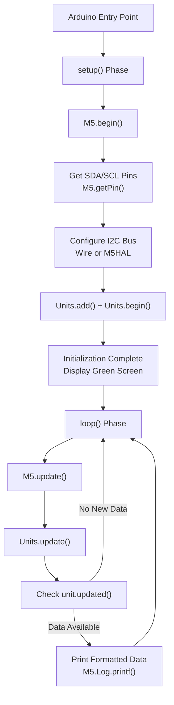
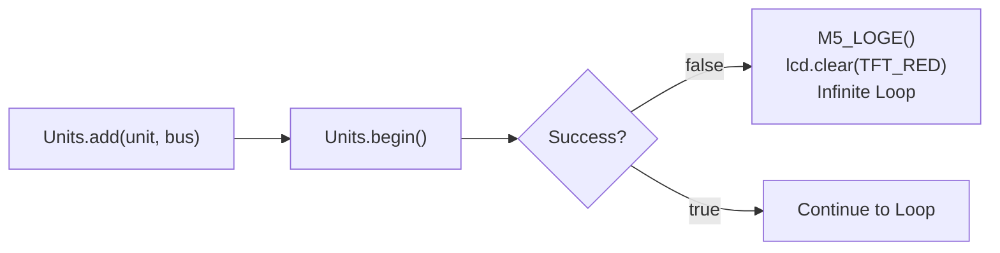
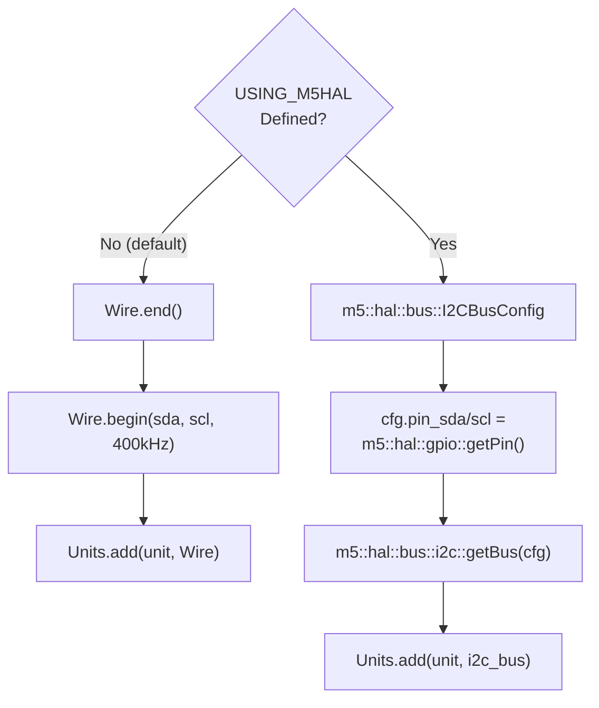
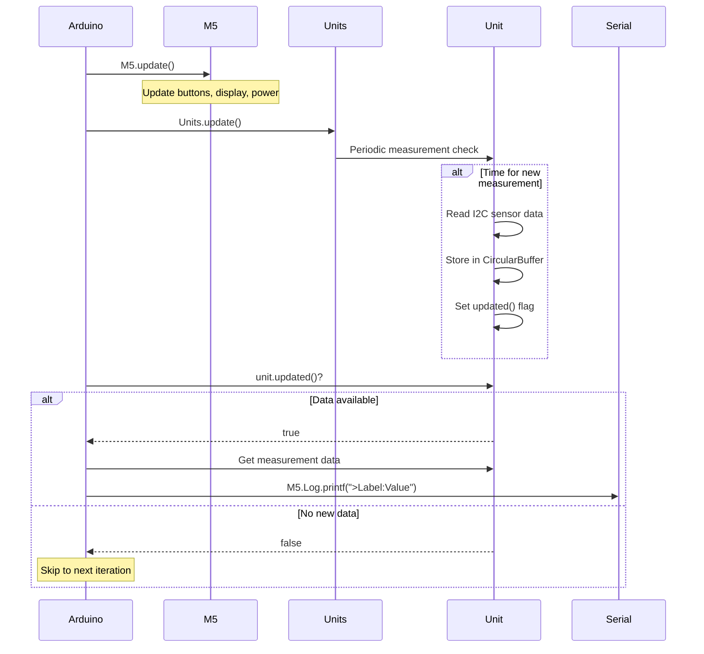
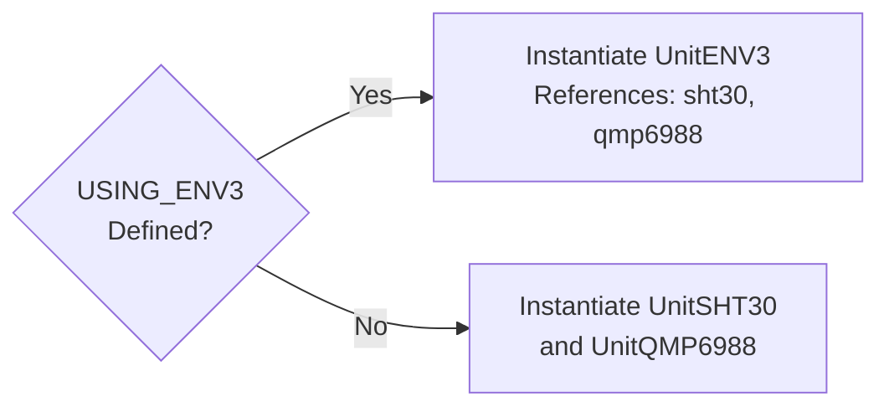
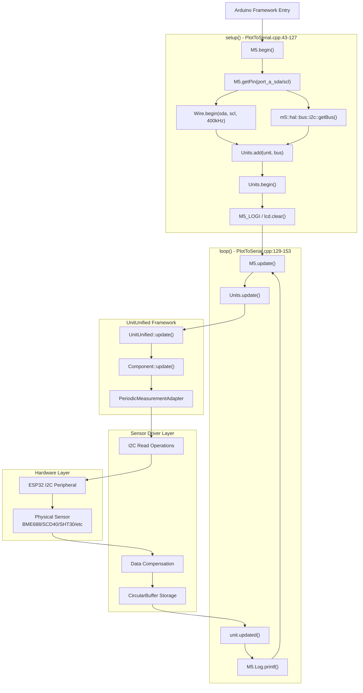

M5Unit-ENV PlotToSerial Pattern

# PlotToSerial Pattern

<details>
<summary>Relevant source files</summary>

The following files were used as context for generating this wiki page:

- [examples/UnitUnified/UnitENVIII/PlotToSerial/PlotToSerial.ino](examples/UnitUnified/UnitENVIII/PlotToSerial/PlotToSerial.ino)
- [examples/UnitUnified/UnitENVIII/PlotToSerial/main/PlotToSerial.cpp](examples/UnitUnified/UnitENVIII/PlotToSerial/main/PlotToSerial.cpp)
- [examples/UnitUnified/UnitENVPro/PlotToSerial/PlotToSerial.ino](examples/UnitUnified/UnitENVPro/PlotToSerial/PlotToSerial.ino)
- [examples/UnitUnified/UnitENVPro/PlotToSerial/main/PlotToSerial.cpp](examples/UnitUnified/UnitENVPro/PlotToSerial/main/PlotToSerial.cpp)
- [examples/UnitUnified/UnitTVOC/PlotToSerial/PlotToSerial.ino](examples/UnitUnified/UnitTVOC/PlotToSerial/PlotToSerial.ino)
- [examples/UnitUnified/UnitTVOC/PlotToSerial/main/PlotToSerial.cpp](examples/UnitUnified/UnitTVOC/PlotToSerial/main/PlotToSerial.cpp)
- [src/unit/unit_SGP30.hpp](src/unit/unit_SGP30.hpp)

</details>


## Purpose and Scope

The PlotToSerial pattern demonstrates the standard workflow for reading sensor data from M5Unit-ENV sensors and outputting it in a format compatible with Arduino Serial Plotter. This pattern establishes the foundational structure for unified interface examples, covering initialization, I2C bus configuration, periodic measurement updates, and formatted serial output.

This page focuses on the example structure and execution flow. For details on specific sensor APIs, see section [4]() (Sensor Units Reference). For multi-sensor coordination strategies, see [5.2]() (Multi-Sensor Applications). For calibration workflows, see [5.3]() (Calibration and Configuration).

---

## Pattern Overview

The PlotToSerial pattern follows the standard Arduino sketch structure with two phases: `setup()` for initialization and `loop()` for continuous operation. The pattern uses the M5UnitUnified framework to manage sensor lifecycle and measurement updates.



**Sources:** [examples/UnitUnified/UnitENVIII/PlotToSerial/main/PlotToSerial.cpp:43-153](), [examples/UnitUnified/UnitENVPro/PlotToSerial/main/PlotToSerial.cpp:19-56](), [examples/UnitUnified/UnitTVOC/PlotToSerial/main/PlotToSerial.cpp:21-56]()

---

## Setup Phase Components

The `setup()` function orchestrates sensor initialization through a sequence of configuration steps, each critical to establishing proper communication with the sensor units.

### M5 System Initialization

All PlotToSerial examples begin with `M5.begin()` at [examples/UnitUnified/UnitENVIII/PlotToSerial/main/PlotToSerial.cpp:45](), which initializes the M5Stack hardware platform including display, buttons, power management, and logging systems.

### Pin Configuration Retrieval

Pin numbers for I2C communication are retrieved using `M5.getPin()` with `m5::pin_name_t` enumerations:

```cpp
auto pin_num_sda = M5.getPin(m5::pin_name_t::port_a_sda);
auto pin_num_scl = M5.getPin(m5::pin_name_t::port_a_scl);
```

This abstraction allows the same code to run across different M5Stack boards with varying pin assignments. The retrieved values are logged via `M5_LOGI` macro for debugging purposes.

**Sources:** [examples/UnitUnified/UnitENVIII/PlotToSerial/main/PlotToSerial.cpp:47-49](), [examples/UnitUnified/UnitENVPro/PlotToSerial/main/PlotToSerial.cpp:23-25]()

### Unit Instance Declaration

Sensor unit instances are declared in anonymous namespace scope:

- `m5::unit::UnitUnified Units` - The unified manager instance
- Unit-specific objects: `m5::unit::UnitENV3`, `m5::unit::UnitENVPro`, `m5::unit::UnitTVOC`, etc.

For composite units like ENV3, references to child components are established:
```cpp
auto& sht30   = unitENV3.sht30;
auto& qmp6988 = unitENV3.qmp6988;
```

**Sources:** [examples/UnitUnified/UnitENVIII/PlotToSerial/main/PlotToSerial.cpp:21-40](), [examples/UnitUnified/UnitENVPro/PlotToSerial/main/PlotToSerial.cpp:13-17]()

### Error Handling Pattern

The pattern uses a consistent error handling structure at [examples/UnitUnified/UnitENVIII/PlotToSerial/main/PlotToSerial.cpp:83-89]():



If initialization fails, the LCD displays red and execution halts in an infinite delay loop, preventing undefined behavior from operating with uninitialized sensors.

**Sources:** [examples/UnitUnified/UnitENVIII/PlotToSerial/main/PlotToSerial.cpp:83-89](), [examples/UnitUnified/UnitENVPro/PlotToSerial/main/PlotToSerial.cpp:29-35]()

---

## I2C Bus Configuration

The pattern supports two I2C bus configuration approaches: Arduino Wire library and M5HAL bus abstraction. The choice is controlled by the `USING_M5HAL` preprocessor definition.



### Wire Library Approach

The default configuration uses Arduino's `Wire` library at [examples/UnitUnified/UnitENVIII/PlotToSerial/main/PlotToSerial.cpp:80-81]():

```cpp
Wire.end();
Wire.begin(pin_num_sda, pin_num_scl, 400000U);
```

The `Wire.end()` call ensures clean re-initialization if the bus was previously configured. The third parameter sets the I2C clock to 400kHz (Fast Mode).

### M5HAL Approach

When `USING_M5HAL` is defined, the pattern uses M5HAL's bus abstraction at [examples/UnitUnified/UnitENVIII/PlotToSerial/main/PlotToSerial.cpp:67-71]():

```cpp
m5::hal::bus::I2CBusConfig i2c_cfg;
i2c_cfg.pin_sda = m5::hal::gpio::getPin(pin_num_sda);
i2c_cfg.pin_scl = m5::hal::gpio::getPin(pin_num_scl);
auto i2c_bus    = m5::hal::bus::i2c::getBus(i2c_cfg);
```

The `m5::hal::gpio::getPin()` function converts numeric pin IDs to HAL pin objects. The `getBus()` function returns an `std::optional` containing the bus handle, which is then passed to `Units.add()`.

**Sources:** [examples/UnitUnified/UnitENVIII/PlotToSerial/main/PlotToSerial.cpp:65-90](), [examples/UnitUnified/UnitENVIII/PlotToSerial/main/PlotToSerial.cpp:94-118]()

---

## Loop Phase Execution

The `loop()` function implements a continuous measurement and output cycle with minimal latency. The execution flow follows a fixed sequence optimized for real-time data streaming.



### Update Cascade

The call to `Units.update()` at [examples/UnitUnified/UnitENVPro/PlotToSerial/main/PlotToSerial.cpp:45]() triggers the unified framework's measurement coordination:

1. The `UnitUnified` manager iterates through all registered units
2. Each unit checks if its measurement interval has elapsed
3. If elapsed, the unit executes I2C read operations
4. New data is stored in the unit's `CircularBuffer`
5. The unit's internal `updated()` flag is set

### Conditional Data Access

The `unit.updated()` method at [examples/UnitUnified/UnitENVPro/PlotToSerial/main/PlotToSerial.cpp:46]() returns true only when new data has been acquired since the last check. This flag-based approach prevents redundant serial output of unchanged data.

For composite units like ENV3, each child component has independent `updated()` flags, checked separately at [examples/UnitUnified/UnitENVIII/PlotToSerial/main/PlotToSerial.cpp:146-151]():

```cpp
if (sht30.updated()) {
    M5.Log.printf(">SHT30Temp:%2.2f\n>Humidity:%2.2f\n", 
                  sht30.temperature(), sht30.humidity());
}
if (qmp6988.updated()) {
    M5.Log.printf(">QMP6988Temp:%2.2f\n>Pressure:%.2f\n", 
                  qmp6988.temperature(), qmp6988.pressure() * 0.01f);
}
```

**Sources:** [examples/UnitUnified/UnitENVIII/PlotToSerial/main/PlotToSerial.cpp:129-153](), [examples/UnitUnified/UnitENVPro/PlotToSerial/main/PlotToSerial.cpp:42-56]()

---

## Serial Plotter Output Format

The pattern formats output specifically for Arduino Serial Plotter, which expects data in the format `>Label:Value\n`. The `>` prefix indicates a plottable data series, the label identifies the series, and the newline terminates each data point.

### Format Specification

| Component | Purpose | Example |
|-----------|---------|---------|
| `>` | Series prefix (required by Arduino plotter) | `>` |
| Label | Series identifier (no spaces) | `SHT30Temp` |
| `:` | Separator | `:` |
| Value | Numeric data with format specifier | `25.30` |
| `\n` | Line terminator | newline |

### Multi-Series Output

Multiple series can be output simultaneously by concatenating formatted strings in a single `M5.Log.printf()` call at [examples/UnitUnified/UnitENVPro/PlotToSerial/main/PlotToSerial.cpp:48-49]():

```cpp
M5.Log.printf(">IAQ:%.2f\n>Temperature:%.2f\n>Pressure:%.2f\n>Humidity:%.2f\n>GAS:%.2f\n", 
              unit.iaq(), unit.temperature(), unit.pressure(), unit.humidity(), unit.gas());
```

This outputs five simultaneous data series, each appearing as a separate line in the serial plotter.

### Unit Conversion

Pressure values are commonly converted from Pascals to hectopascals (hPa) by multiplying by `0.01f` at [examples/UnitUnified/UnitENVIII/PlotToSerial/main/PlotToSerial.cpp:150](). This makes values more readable in the plotter (e.g., 1013.25 hPa instead of 101325 Pa).

**Sources:** [examples/UnitUnified/UnitENVPro/PlotToSerial/main/PlotToSerial.cpp:47-54](), [examples/UnitUnified/UnitTVOC/PlotToSerial/main/PlotToSerial.cpp:52-55]()

---

## Conditional Compilation Variants

The ENV3/ENVIII example demonstrates conditional compilation patterns for flexible configuration without modifying core code logic.

### Configuration Macros

Three preprocessor definitions control behavior at [examples/UnitUnified/UnitENVIII/PlotToSerial/main/PlotToSerial.cpp:13-19]():

| Macro | Effect | Default |
|-------|--------|---------|
| `USING_M5HAL` | Use M5HAL instead of Wire for I2C | Undefined (Wire) |
| `USING_SINGLE_SHOT` | Use single-shot measurements instead of periodic | Undefined (Periodic) |
| `USING_ENV3` | Use composite ENV3 unit instead of separate units | Defined |

### Single-Shot Measurement Mode

When `USING_SINGLE_SHOT` is defined, the pattern configures sensors for manual triggering at [examples/UnitUnified/UnitENVIII/PlotToSerial/main/PlotToSerial.cpp:51-62]():

```cpp
auto cfg           = sht30.config();
cfg.start_periodic = false;
sht30.config(cfg);
```

In this mode, the loop phase triggers measurements on button press at [examples/UnitUnified/UnitENVIII/PlotToSerial/main/PlotToSerial.cpp:135-144]():

```cpp
if (M5.BtnA.wasClicked()) {
    m5::unit::sht30::Data ds{};
    if (sht30.measureSingleshot(ds)) {
        M5.Log.printf(">SHT30Temp:%2.2f\n>Humidity:%2.2f\n", 
                      ds.temperature(), ds.humidity());
    }
}
```

### Unit Selection Logic

The `USING_ENV3` macro controls whether to instantiate the composite `UnitENV3` or separate `UnitSHT30` and `UnitQMP6988` instances at [examples/UnitUnified/UnitENVIII/PlotToSerial/main/PlotToSerial.cpp:25-40]():



References to `sht30` and `qmp6988` are established using different source objects depending on the macro, ensuring the rest of the code remains unchanged.

**Sources:** [examples/UnitUnified/UnitENVIII/PlotToSerial/main/PlotToSerial.cpp:13-40](), [examples/UnitUnified/UnitENVIII/PlotToSerial/main/PlotToSerial.cpp:51-62](), [examples/UnitUnified/UnitENVIII/PlotToSerial/main/PlotToSerial.cpp:134-152]()

---

## Unit-Specific Variations

While the pattern structure remains consistent across sensor types, each unit example demonstrates sensor-specific features and output formats.

### ENVPro (BME688) with BSEC2

The ENVPro example at [examples/UnitUnified/UnitENVPro/PlotToSerial/main/PlotToSerial.cpp:47-54]() conditionally includes IAQ data based on BSEC2 availability:

```cpp
#if defined(UNIT_BME688_USING_BSEC2)
    M5.Log.printf(">IAQ:%.2f\n>Temperature:%.2f\n>Pressure:%.2f\n>Humidity:%.2f\n>GAS:%.2f\n", 
                  unit.iaq(), unit.temperature(), unit.pressure(), unit.humidity(), unit.gas());
#else
    M5.Log.printf(">Temperature:%.2f\n>Pressure:%.2f\n>Humidity:%.2f\n>GAS:%.2f\n", 
                  unit.temperature(), unit.pressure(), unit.humidity(), unit.gas());
    m5::utility::delay(1000);
#endif
```

Without BSEC2, a 1-second delay is added to reduce update frequency since raw gas resistance values change more slowly than processed IAQ.

### TVOC (SGP30) Warmup Period

The TVOC example includes a warning about SGP30's initialization requirements at [examples/UnitUnified/UnitTVOC/PlotToSerial/main/PlotToSerial.cpp:41]():

```cpp
M5_LOGW("SGP30 measurement starts 15 seconds after begin");
```

The unit's `canMeasurePeriodic()` method (referenced in [src/unit/unit_SGP30.hpp:153-156]()) returns false during the mandatory 15-second warmup period. The `updated()` flag only becomes true after warmup completes, automatically handling this timing constraint.

### ENV3/ENVIII Dual Temperature Sources

The ENV3 example outputs temperature from both the SHT30 and QMP6988 sensors at [examples/UnitUnified/UnitENVIII/PlotToSerial/main/PlotToSerial.cpp:147-151]():

```
>SHT30Temp:25.30
>QMP6988Temp:25.25
```

This allows comparison of temperature readings from different sensor technologies, useful for understanding sensor characteristics and environmental gradients.

**Sources:** [examples/UnitUnified/UnitENVPro/PlotToSerial/main/PlotToSerial.cpp:47-54](), [examples/UnitUnified/UnitTVOC/PlotToSerial/main/PlotToSerial.cpp:39-55](), [examples/UnitUnified/UnitENVIII/PlotToSerial/main/PlotToSerial.cpp:146-151]()

---

## Complete Execution Flow Mapping

The following diagram maps the complete execution flow from Arduino entry point through code entities to hardware communication:



**Sources:** [examples/UnitUnified/UnitENVIII/PlotToSerial/main/PlotToSerial.cpp:43-153](), [examples/UnitUnified/UnitENVPro/PlotToSerial/main/PlotToSerial.cpp:19-56](), [examples/UnitUnified/UnitTVOC/PlotToSerial/main/PlotToSerial.cpp:21-56]()

---

## File Structure and Organization

PlotToSerial examples follow a consistent directory structure across all sensor types:

```
examples/UnitUnified/Unit{NAME}/PlotToSerial/
├── PlotToSerial.ino          # Arduino IDE entry point
└── main/
    └── PlotToSerial.cpp      # Actual implementation
```

The `.ino` file at [examples/UnitUnified/UnitENVPro/PlotToSerial/PlotToSerial.ino:1-11]() contains only an include directive:

```cpp
#include "main/PlotToSerial.cpp"
```

This structure allows the same implementation file to be compiled by both Arduino IDE (which requires `.ino` files) and PlatformIO (which prefers `.cpp` files). The main implementation remains in the `main/` subdirectory for consistency with PlatformIO conventions.

**Sources:** [examples/UnitUnified/UnitENVPro/PlotToSerial/PlotToSerial.ino:1-11](), [examples/UnitUnified/UnitENVIII/PlotToSerial/PlotToSerial.ino:1-11](), [examples/UnitUnified/UnitTVOC/PlotToSerial/PlotToSerial.ino:1-9]()