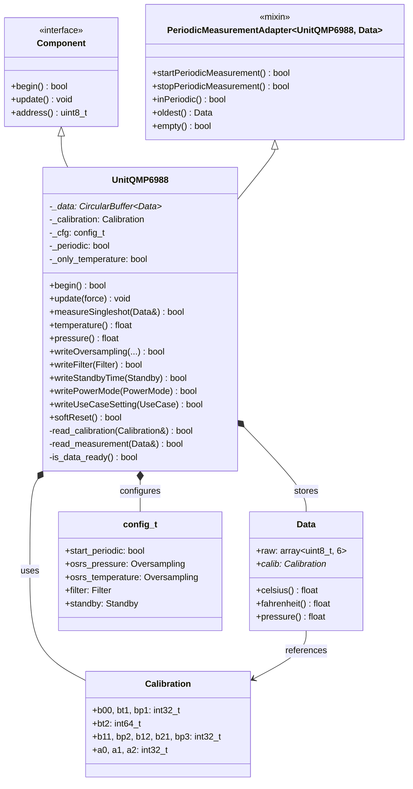
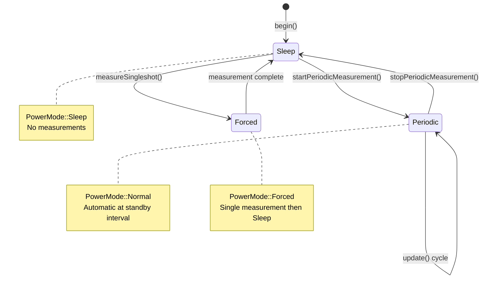
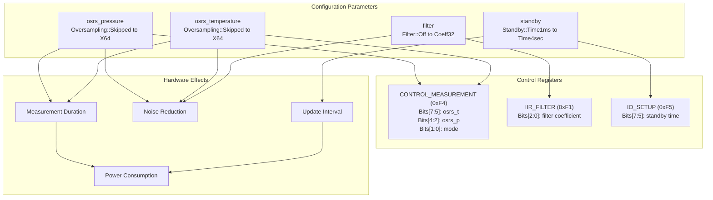
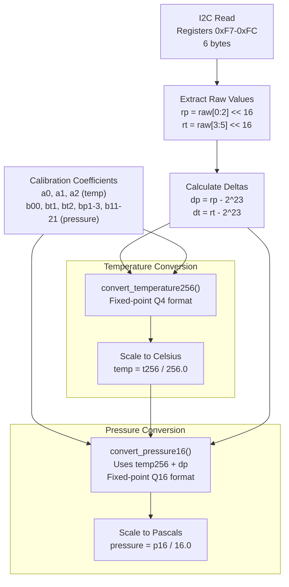
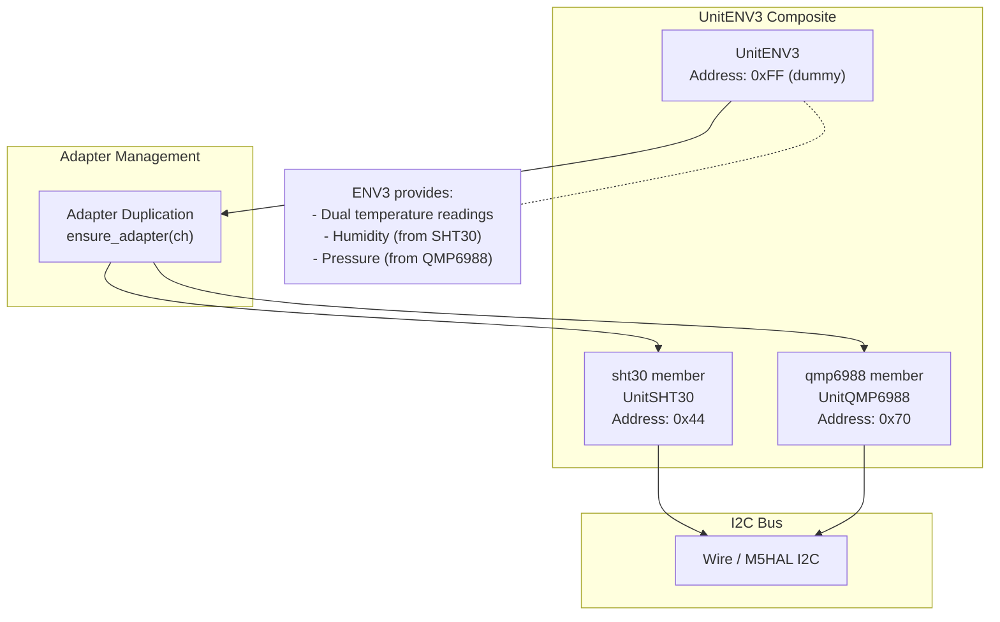

M5Unit-ENV QMP6988 (Barometric Pressure)

# QMP6988 (Barometric Pressure)

<details>
<summary>Relevant source files</summary>

The following files were used as context for generating this wiki page:

- [src/unit/unit_ENV3.cpp](src/unit/unit_ENV3.cpp)
- [src/unit/unit_ENV3.hpp](src/unit/unit_ENV3.hpp)
- [src/unit/unit_QMP6988.cpp](src/unit/unit_QMP6988.cpp)
- [src/unit/unit_QMP6988.hpp](src/unit/unit_QMP6988.hpp)
- [src/unit/unit_SHT30.hpp](src/unit/unit_SHT30.hpp)

</details>


## Purpose and Scope

This page documents the QMP6988 barometric pressure sensor driver implementation in the M5Unit-ENV library. The QMP6988 measures atmospheric pressure and temperature, enabling altitude estimation and weather monitoring applications. This page covers the `UnitQMP6988` class architecture, measurement modes (periodic and single-shot), configuration options including oversampling and filtering, use case presets, and the raw data conversion pipeline with calibration compensation algorithms.

For information about the ENV3 composite unit that integrates QMP6988 with SHT30, see [ENV3 (ENVIII - Composite Unit)](#4.8). For general measurement patterns and data buffering, see [Usage Patterns and Examples](#5).

**Sources:** [src/unit/unit_QMP6988.hpp:1-393](), [src/unit/unit_QMP6988.cpp:1-595]()

## Class Architecture

The `UnitQMP6988` class inherits from `Component` for I2C communication and `PeriodicMeasurementAdapter<UnitQMP6988, qmp6988::Data>` for measurement lifecycle management. The class maintains a `CircularBuffer` for historical data storage and handles calibration coefficients internally.



**Sources:** [src/unit/unit_QMP6988.hpp:131-367](), [src/unit/unit_QMP6988.cpp:235-266]()

## Core Data Structures

### qmp6988::Data

The `qmp6988::Data` struct encapsulates raw measurement data and provides conversion methods to physical units. Raw data consists of 6 bytes: 3 bytes for pressure (registers 0xF7-0xF9) and 3 bytes for temperature (registers 0xFA-0xFC).

| Member | Type | Description |
|--------|------|-------------|
| `raw` | `std::array<uint8_t, 6>` | Raw 24-bit values for pressure and temperature |
| `calib` | `const Calibration*` | Pointer to calibration coefficients for conversion |
| `celsius()` | `float` | Converts raw temperature to Celsius |
| `fahrenheit()` | `float` | Converts raw temperature to Fahrenheit |
| `pressure()` | `float` | Converts raw pressure to Pascals (Pa) |

**Sources:** [src/unit/unit_QMP6988.hpp:112-123](), [src/unit/unit_QMP6988.cpp:178-207]()

### qmp6988::Calibration

The `Calibration` struct stores factory-programmed trimming parameters read from registers 0xA0-0xB8 (25 bytes). These coefficients are used in fixed-point compensation algorithms to convert raw ADC values to physical units.

**Sources:** [src/unit/unit_QMP6988.hpp:101-105](), [src/unit/unit_QMP6988.cpp:549-592]()

## Measurement Modes



**Sources:** [src/unit/unit_QMP6988.cpp:287-327](), [src/unit/unit_QMP6988.cpp:329-366]()

### Periodic Measurement

Periodic measurement mode (`PowerMode::Normal`) continuously acquires data at intervals determined by the `Standby` setting. The `update()` method checks elapsed time and reads new data when available.

**Key Methods:**
- `startPeriodicMeasurement(osrsPressure, osrsTemperature, filter, standby)` - Configures and starts periodic mode
- `stopPeriodicMeasurement()` - Returns sensor to sleep mode
- `update(force)` - Called in application loop to poll for new data
- `temperature()`, `pressure()` - Access latest buffered measurements

**Interval Calculation:** The actual measurement interval is calculated as:
```
interval = standby_time + temp_oversampling_time + pressure_oversampling_time + filter_time
```

The `calculatInterval()` function at [src/unit/unit_QMP6988.cpp:215-233]() computes this based on lookup tables for each parameter.

**Sources:** [src/unit/unit_QMP6988.cpp:287-327](), [src/unit/unit_QMP6988.cpp:268-285](), [src/unit/unit_QMP6988.cpp:215-233]()

### Single-Shot Measurement

Single-shot mode (`PowerMode::Forced`) performs one measurement cycle then returns to sleep mode. This is useful for low-power applications or when measurements are needed infrequently.

**Key Method:**
```cpp
bool measureSingleshot(qmp6988::Data& d, 
                       const qmp6988::Oversampling osrsPressure,
                       const qmp6988::Oversampling osrsTemperature, 
                       const qmp6988::Filter f);
```

The method writes configuration registers, triggers forced mode, polls `is_data_ready()` until measurement completes (with 1-second timeout), then reads the result.

**Constraint:** Temperature measurement cannot be skipped (`Oversampling::Skipped`) because pressure calculation requires temperature data. Pressure-only skipping is permitted for temperature-only measurements.

**Sources:** [src/unit/unit_QMP6988.cpp:329-366](), [src/unit/unit_QMP6988.hpp:239-254]()

## Configuration Options



**Sources:** [src/unit/unit_QMP6988.hpp:26-98](), [src/unit/unit_QMP6988.cpp:368-511]()

### Oversampling Settings

Oversampling reduces measurement noise by averaging multiple ADC samples. The `Oversampling` enum defines factors from `X1` to `X64`, plus `Skipped` for disabling a measurement.

| Enum Value | Factor | Temperature Time (ms) | Pressure Time (ms) |
|------------|--------|----------------------|-------------------|
| `Skipped` | 0 | 0 | 0 |
| `X1` | 1 | 4.5 | 0.5 |
| `X2` | 2 | 9.0 | 1.0 |
| `X4` | 4 | 18.0 | 2.0 |
| `X8` | 8 | 36.0 | 4.0 |
| `X16` | 16 | 72.0 | 8.0 |
| `X32` | 32 | 143.9 | 16.0 |
| `X64` | 64 | 287.9 | 32.0 |

The `OversamplingSetting` enum provides preset combinations optimized for different scenarios:

| Preset | Pressure Oversampling | Temperature Oversampling |
|--------|----------------------|-------------------------|
| `HighSpeed` | `X2` | `X1` |
| `LowPower` | `X4` | `X1` |
| `Standard` | `X8` | `X1` |
| `HighAccuracy` | `X16` | `X2` |
| `UltraHightAccuracy` | `X32` | `X4` |

**API Methods:**
- `writeOversampling(osrsPressure, osrsTemperature)` - Set individual factors
- `writeOversampling(OversamplingSetting)` - Apply preset combination
- `writeOversamplingPressure(osrsPressure)` - Set pressure only
- `writeOversamplingTemperature(osrsTemperature)` - Set temperature only
- `readOversampling(osrsPressure&, osrsTemperature&)` - Read current settings

**Sources:** [src/unit/unit_QMP6988.hpp:33-58](), [src/unit/unit_QMP6988.cpp:26-30](), [src/unit/unit_QMP6988.cpp:368-430]()

### IIR Filter Configuration

The infinite impulse response (IIR) filter smooths measurements by applying a low-pass filter. Higher coefficients provide more smoothing but introduce latency.

| Filter Enum | Coefficient | Filter Time (ms) |
|-------------|-------------|------------------|
| `Off` | 0 | 0 |
| `Coeff2` | 2 | 0.3 |
| `Coeff4` | 4 | 0.6 |
| `Coeff8` | 8 | 1.2 |
| `Coeff16` | 16 | 2.4 |
| `Coeff32` | 32 | 4.8 |

**API Methods:**
- `writeFilter(Filter)` - Set IIR filter coefficient
- `readFilter(Filter&)` - Read current filter setting

**Sources:** [src/unit/unit_QMP6988.hpp:64-71](), [src/unit/unit_QMP6988.cpp:39-44](), [src/unit/unit_QMP6988.cpp:463-480]()

### Standby Time

Standby time controls the delay between measurements in periodic mode, directly affecting power consumption and update frequency.

| Standby Enum | Duration (ms) |
|--------------|---------------|
| `Time1ms` | 1 |
| `Time5ms` | 5 |
| `Time50ms` | 50 |
| `Time250ms` | 250 |
| `Time500ms` | 500 |
| `Time1sec` | 1000 |
| `Time2sec` | 2000 |
| `Time4sec` | 4000 |

**API Methods:**
- `writeStandbyTime(Standby)` - Set standby duration
- `readStandbyTime(Standby&)` - Read current standby setting

**Sources:** [src/unit/unit_QMP6988.hpp:74-86](), [src/unit/unit_QMP6988.cpp:58-60](), [src/unit/unit_QMP6988.cpp:482-505]()

### Power Modes

The `PowerMode` enum controls the sensor's operational state:

| Mode | Description | Register Value |
|------|-------------|----------------|
| `Sleep` | No measurements performed, lowest power | 0x00 |
| `Forced` | Single measurement then return to sleep | 0x01 |
| `Normal` | Continuous periodic measurements | 0x03 |

**Implementation Detail:** The sensor uses only bits [1:0] of the control register for mode, with values mapping through `mode_table` at [src/unit/unit_QMP6988.cpp:32-37](). The library abstracts this with `writePowerMode()` which includes a wait-for-ready loop to avoid erratic data during mode transitions.

**Sources:** [src/unit/unit_QMP6988.hpp:26-30](), [src/unit/unit_QMP6988.cpp:432-461]()

### Use Case Presets

The `UseCase` enum provides application-specific preset configurations that combine oversampling and filter settings:

| Use Case | OversamplingSetting | Filter | Application |
|----------|-------------------|--------|-------------|
| `Weather` | `HighSpeed` | `Off` | Weather monitoring |
| `Drop` | `LowPower` | `Off` | Drop detection |
| `Elevator` | `Standard` | `Coeff4` | Elevator/floor change detection |
| `Stair` | `HighAccuracy` | `Coeff8` | Stair detection |
| `Indoor` | `UltraHightAccuracy` | `Coeff32` | Indoor navigation |

**API Method:**
```cpp
bool writeUseCaseSetting(const qmp6988::UseCase uc);
```

This method applies both oversampling and filter settings in a single call using the lookup table at [src/unit/unit_QMP6988.cpp:49-55]().

**Sources:** [src/unit/unit_QMP6988.hpp:89-98](), [src/unit/unit_QMP6988.cpp:49-55](), [src/unit/unit_QMP6988.cpp:507-511]()

## Raw Data Conversion Pipeline

The QMP6988 employs a complex fixed-point compensation algorithm to convert 24-bit raw ADC values into calibrated physical measurements. This pipeline involves multiple stages of mathematical operations using factory-calibrated coefficients.



**Sources:** [src/unit/unit_QMP6988.cpp:178-207](), [src/unit/unit_QMP6988.cpp:79-130](), [src/unit/unit_QMP6988.cpp:92-130]()

### Temperature Conversion Algorithm

The `convert_temperature256()` function at [src/unit/unit_QMP6988.cpp:79-90]() implements a second-order polynomial compensation using fixed-point arithmetic with Q-format (Q4, Q23, Q33, etc. denoting fractional bit positions):

**Algorithm:**
1. Linear term: `wk1 = a1 * dt` (54Q23)
2. Quadratic term: `wk2 = ((a2 * dt) >> 14 * dt) >> 10` (52Q23)
3. Sum and shift: `temp256 = (a0 + (wk1 + wk2) / 32767) >> 4` (17Q0, units of 1/256°C)

The output `temp256` is in units of 1/256°C, which `Data::celsius()` divides by 256.0 to obtain Celsius.

**Sources:** [src/unit/unit_QMP6988.cpp:79-90](), [src/unit/unit_QMP6988.cpp:178-187]()

### Pressure Conversion Algorithm

The `convert_pressure16()` function at [src/unit/unit_QMP6988.cpp:92-130]() implements a complex multi-term polynomial that depends on both pressure delta `dp` and temperature `tx` (the temp256 value):

**Algorithm stages:**
1. **First-order terms** (48Q16 format):
   - `wk1 = bt1 * tx + (bp1 * dp) >> 5`
2. **Second-order temperature terms** (62Q29 format):
   - `wk3 = ((bt2 * tx) >> 1 * tx) >> 8`
   - `wk3 += ((b11 * tx) >> 4 * dp) >> 1`
   - `wk3 += ((bp2 * dp) >> 13 * dp) >> 1`
3. **Third-order cross terms** (63Q30 format):
   - `wk3_extra = ((b12 * tx) * tx) >> 22 * dp) >> 1`
   - `wk3_extra += ((b21 * tx) >> 6 * dp) >> 23 * dp) >> 1`
   - `wk3_extra += ((bp3 * dp) >> 12 * dp) >> 23 * dp)`
4. **Combine and offset**:
   - `wk1 += wk3 >> 14 + wk3_extra >> 15`
   - `p16 = (wk1 / 32767) >> 11 + b00`

The output `p16` is in units of 1/16 Pa, which `Data::pressure()` divides by 16.0 to obtain Pascals.

**Sources:** [src/unit/unit_QMP6988.cpp:92-130](), [src/unit/unit_QMP6988.cpp:194-207]()

### Calibration Data Loading

Calibration coefficients are read from 25 bytes at registers 0xA0-0xB8 during `begin()`. The `read_calibration()` method at [src/unit/unit_QMP6988.cpp:549-592]() performs the following transformations:

1. **Read raw bytes** from registers
2. **Combine bytes** into 16-bit or 20-bit values using big-endian format
3. **Convert unsigned to signed** using `unsigned_to_signed<bits>()` template
4. **Apply scaling factors** (e.g., `bt1 = 2982L * raw_value + 107370906L`)

The scaling factors convert raw calibration values into the Q-format coefficients needed by the compensation algorithms.

**Sources:** [src/unit/unit_QMP6988.cpp:549-592](), [src/unit/unit_QMP6988.cpp:258-261]()

## Integration with Composite Units

The `UnitENV3` composite unit combines QMP6988 with SHT30 for comprehensive environmental monitoring. The composite unit manages both child components through a parent-child architecture.



**Implementation:** The `UnitENV3` constructor at [src/unit/unit_ENV3.cpp:23-30]() establishes parent-child relationships using `add(child, channel)`. The `ensure_adapter()` method at [src/unit/unit_ENV3.cpp:32-45]() duplicates the parent's I2C adapter for each child, allowing independent access to their respective I2C addresses (0x44 for SHT30, 0x70 for QMP6988).

**Dual Temperature Sources:** ENV3 applications can read temperature from either sensor:
- `env3.sht30.temperature()` - Humidity sensor temperature
- `env3.qmp6988.temperature()` - Pressure sensor temperature

These may differ slightly due to sensor characteristics and self-heating effects.

**Sources:** [src/unit/unit_ENV3.hpp:20-53](), [src/unit/unit_ENV3.cpp:23-45]()

## API Summary

### Lifecycle Methods

| Method | Description |
|--------|-------------|
| `UnitQMP6988(addr)` | Constructor with I2C address (default 0x70) |
| `begin()` | Initialize sensor, read calibration, optionally start periodic mode |
| `update(force)` | Poll for new measurements in periodic mode |
| `config(config_t)` | Set configuration for `begin()` |

**Sources:** [src/unit/unit_QMP6988.hpp:152-177](), [src/unit/unit_QMP6988.cpp:235-266]()

### Data Access Methods

| Method | Return Type | Description |
|--------|-------------|-------------|
| `temperature()` | `float` | Latest temperature in Celsius (NaN if no data) |
| `celsius()` | `float` | Same as `temperature()` |
| `fahrenheit()` | `float` | Latest temperature in Fahrenheit |
| `pressure()` | `float` | Latest pressure in Pascals |
| `oldest()` | `const Data&` | Oldest buffered measurement |
| `empty()` | `bool` | Check if buffer is empty |

**Sources:** [src/unit/unit_QMP6988.hpp:180-202]()

### Measurement Control

| Method | Return Type | Description |
|--------|-------------|-------------|
| `startPeriodicMeasurement(osrsP, osrsT, filter, standby)` | `bool` | Configure and start periodic mode |
| `startPeriodicMeasurement()` | `bool` | Start with current settings |
| `stopPeriodicMeasurement()` | `bool` | Stop periodic mode, return to sleep |
| `measureSingleshot(Data&, osrsP, osrsT, filter)` | `bool` | Single measurement with settings |
| `measureSingleshot(Data&)` | `bool` | Single measurement with current settings |

**Sources:** [src/unit/unit_QMP6988.hpp:204-254]()

### Configuration Methods

| Method | Parameters | Description |
|--------|------------|-------------|
| `readOversampling()` | `osrsP&, osrsT&` | Read current oversampling settings |
| `writeOversampling()` | `osrsP, osrsT` | Set oversampling for both channels |
| `writeOversampling()` | `OversamplingSetting` | Apply preset combination |
| `writeOversamplingPressure()` | `osrsPressure` | Set pressure oversampling only |
| `writeOversamplingTemperature()` | `osrsTemperature` | Set temperature oversampling only |
| `readFilter()` | `Filter&` | Read IIR filter coefficient |
| `writeFilter()` | `Filter` | Set IIR filter coefficient |
| `readStandbyTime()` | `Standby&` | Read standby duration |
| `writeStandbyTime()` | `Standby` | Set standby duration |
| `readPowerMode()` | `PowerMode&` | Read current power mode |
| `writePowerMode()` | `PowerMode` | Set power mode (use with caution) |
| `writeUseCaseSetting()` | `UseCase` | Apply use-case preset |
| `softReset()` | - | Soft reset sensor |

**Notes:**
- Most write methods return `false` if periodic measurement is active
- `writePowerMode()` should generally be avoided; use measurement control methods instead

**Sources:** [src/unit/unit_QMP6988.hpp:256-347]()

### Register Addresses (command namespace)

| Constant | Address | Description |
|----------|---------|-------------|
| `CHIP_ID` | 0xD1 | Chip identification (should read 0x5C) |
| `READ_PRESSURE` | 0xF7 | Start of 3-byte pressure data |
| `READ_TEMPERATURE` | 0xFA | Start of 3-byte temperature data |
| `CONTROL_MEASUREMENT` | 0xF4 | Oversampling and power mode control |
| `IO_SETUP` | 0xF5 | Standby time configuration |
| `IIR_FILTER` | 0xF1 | IIR filter coefficient |
| `GET_STATUS` | 0xF3 | Measurement status register |
| `SOFT_RESET` | 0xE0 | Software reset command (write 0xE6) |
| `READ_COMPENSATION_COEFFICIENT` | 0xA0 | Start of 25-byte calibration data |

**Sources:** [src/unit/unit_QMP6988.hpp:370-388]()