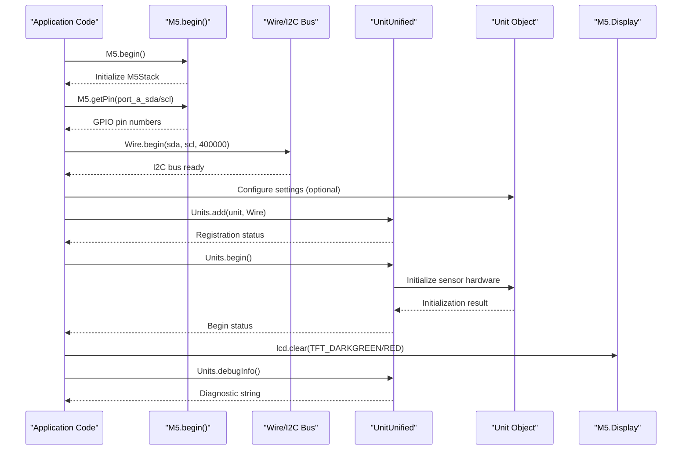
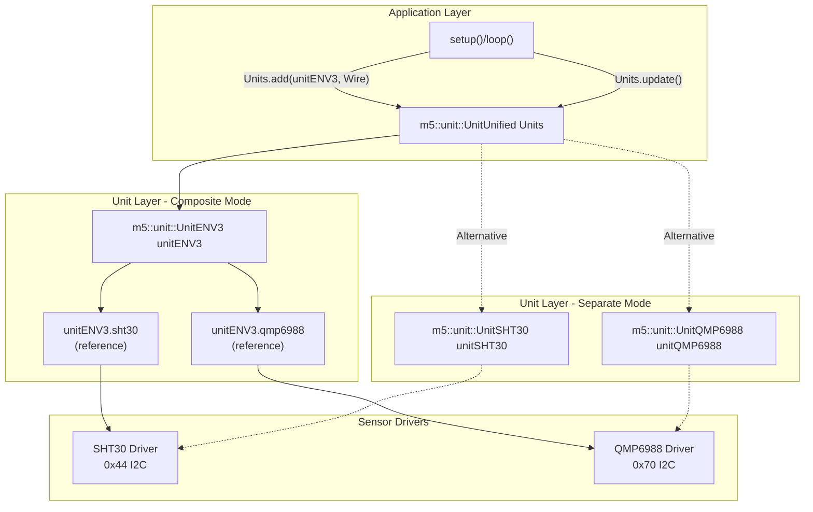
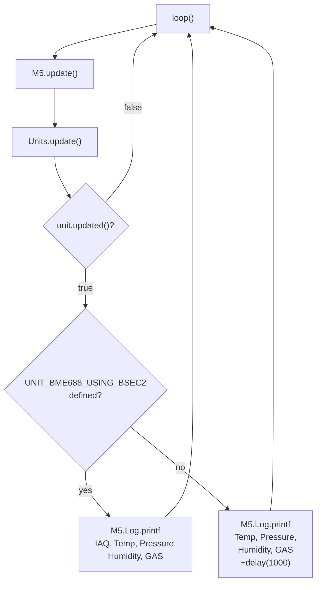
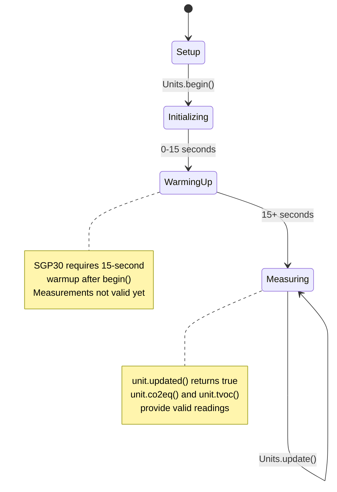
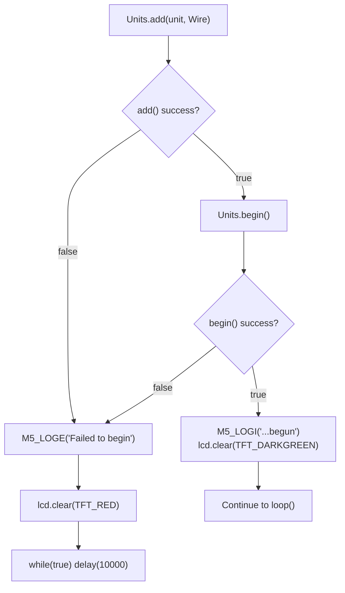

M5Unit-ENV Quick Start Examples

# Quick Start Examples

<details>
<summary>Relevant source files</summary>

The following files were used as context for generating this wiki page:

- [examples/UnitUnified/UnitENVIII/PlotToSerial/PlotToSerial.ino](examples/UnitUnified/UnitENVIII/PlotToSerial/PlotToSerial.ino)
- [examples/UnitUnified/UnitENVIII/PlotToSerial/main/PlotToSerial.cpp](examples/UnitUnified/UnitENVIII/PlotToSerial/main/PlotToSerial.cpp)
- [examples/UnitUnified/UnitENVPro/PlotToSerial/PlotToSerial.ino](examples/UnitUnified/UnitENVPro/PlotToSerial/PlotToSerial.ino)
- [examples/UnitUnified/UnitENVPro/PlotToSerial/main/PlotToSerial.cpp](examples/UnitUnified/UnitENVPro/PlotToSerial/main/PlotToSerial.cpp)
- [examples/UnitUnified/UnitTVOC/PlotToSerial/main/PlotToSerial.cpp](examples/UnitUnified/UnitTVOC/PlotToSerial/main/PlotToSerial.cpp)

</details>


This page provides minimal working examples demonstrating common use cases with the M5Unit-ENV library. All examples use the unified interface (`M5UnitUnifiedENV.h`) with the M5UnitUnified framework for consistent sensor management. For detailed API documentation, see [8](#8). For more complex multi-sensor applications, see [5.2](#5.2). For calibration workflows, see [5.3](#5.3).

---

## Basic Initialization and Update Pattern

All unified interface examples follow a consistent three-phase workflow: initialization in `setup()`, sensor registration with `UnitUnified`, and periodic updates in `loop()`.

### Initialization Sequence



**Sources:** [examples/UnitUnified/UnitENVIII/PlotToSerial/main/PlotToSerial.cpp:43-127](), [examples/UnitUnified/UnitENVPro/PlotToSerial/main/PlotToSerial.cpp:19-40]()

### Core Components Mapping

| Component | Class/Object | Purpose | Key Methods |
|-----------|--------------|---------|-------------|
| Application entry | `M5` | M5Stack framework initialization | `M5.begin()`, `M5.getPin()`, `M5.update()` |
| Sensor registry | `m5::unit::UnitUnified` | Multi-sensor lifecycle management | `add()`, `begin()`, `update()` |
| I2C communication | `Wire` / `m5::hal::bus::I2CBus` | Physical bus interface | `Wire.begin()`, `Wire.end()` |
| ENV3 composite | `m5::unit::UnitENV3` | SHT30 + QMP6988 aggregation | `sht30`, `qmp6988` accessors |
| ENV4 composite | `m5::unit::UnitENV4` | SHT40 + BMP280 aggregation | `sht40`, `bmp280` accessors |
| ENVPro sensor | `m5::unit::UnitENVPro` | BME688 wrapper | `temperature()`, `iaq()`, `updated()` |
| TVOC sensor | `m5::unit::UnitTVOC` | SGP30 wrapper | `co2eq()`, `tvoc()`, `updated()` |

**Sources:** [examples/UnitUnified/UnitENVIII/PlotToSerial/main/PlotToSerial.cpp:22-40](), [examples/UnitUnified/UnitENVPro/PlotToSerial/main/PlotToSerial.cpp:14-16](), [examples/UnitUnified/UnitTVOC/PlotToSerial/main/PlotToSerial.cpp:15-18]()

---

## Example 1: Environmental Monitoring with ENV3 Composite Unit

The ENV3 (ENVIII) unit combines SHT30 temperature/humidity and QMP6988 pressure sensors into a single logical unit. This example demonstrates both composite unit mode and separate sensor mode.

### Component Architecture



**Sources:** [examples/UnitUnified/UnitENVIII/PlotToSerial/main/PlotToSerial.cpp:25-40]()

### Setup Configuration

The example supports three configuration modes via preprocessor directives:

| Directive | Effect | Code Reference |
|-----------|--------|----------------|
| `USING_ENV3` | Use composite ENV3 unit vs separate sensors | [PlotToSerial.cpp:19]() |
| `USING_SINGLE_SHOT` | Single-shot measurement mode vs periodic | [PlotToSerial.cpp:16]() |
| `USING_M5HAL` | M5HAL I2C bus vs Arduino Wire | [PlotToSerial.cpp:13]() |

**I2C Bus Initialization (Wire Mode):**
```
Wire.end();
Wire.begin(pin_num_sda, pin_num_scl, 400000U);
```
[examples/UnitUnified/UnitENVIII/PlotToSerial/main/PlotToSerial.cpp:80-81]()

**I2C Bus Initialization (M5HAL Mode):**
```
m5::hal::bus::I2CBusConfig i2c_cfg;
i2c_cfg.pin_sda = m5::hal::gpio::getPin(pin_num_sda);
i2c_cfg.pin_scl = m5::hal::gpio::getPin(pin_num_scl);
auto i2c_bus = m5::hal::bus::i2c::getBus(i2c_cfg);
```
[examples/UnitUnified/UnitENVIII/PlotToSerial/main/PlotToSerial.cpp:67-70]()

**Composite Unit Registration:**
```
if (!Units.add(unitENV3, Wire) || !Units.begin())
```
[examples/UnitUnified/UnitENVIII/PlotToSerial/main/PlotToSerial.cpp:83]()

**Separate Units Registration:**
```
if (!Units.add(unitSHT30, Wire) || !Units.add(unitQMP6988, Wire) || !Units.begin())
```
[examples/UnitUnified/UnitENVIII/PlotToSerial/main/PlotToSerial.cpp:111]()

**Sources:** [examples/UnitUnified/UnitENVIII/PlotToSerial/main/PlotToSerial.cpp:43-127]()

### Measurement Loop Patterns

**Periodic Mode (default):**
```
void loop() {
    M5.update();
    Units.update();
    
    if (sht30.updated()) {
        M5.Log.printf(">SHT30Temp:%2.2f\n>Humidity:%2.2f\n", 
                      sht30.temperature(), sht30.humidity());
    }
    if (qmp6988.updated()) {
        M5.Log.printf(">QMP6988Temp:%2.2f\n>Pressure:%.2f\n", 
                      qmp6988.temperature(), qmp6988.pressure() * 0.01f);
    }
}
```
[examples/UnitUnified/UnitENVIII/PlotToSerial/main/PlotToSerial.cpp:129-152]()

**Single-Shot Mode:**
```
if (M5.BtnA.wasClicked()) {
    m5::unit::sht30::Data ds{};
    if (sht30.measureSingleshot(ds)) {
        M5.Log.printf(">SHT30Temp:%2.2f\n>Humidity:%2.2f\n", 
                      ds.temperature(), ds.humidity());
    }
    m5::unit::qmp6988::Data dq{};
    if (qmp6988.measureSingleshot(dq)) {
        M5.Log.printf(">QMP6988Temp:%2.2f\n>Pressure:%.2f\n", 
                      dq.temperature(), dq.pressure() * 0.01f);
    }
}
```
[examples/UnitUnified/UnitENVIII/PlotToSerial/main/PlotToSerial.cpp:135-144]()

**Sources:** [examples/UnitUnified/UnitENVIII/PlotToSerial/main/PlotToSerial.cpp:129-153]()

---

## Example 2: Air Quality with ENVPro (BME688)

The ENVPro unit uses the BME688 sensor, which provides temperature, pressure, humidity, and gas resistance. With BSEC2 integration, it calculates IAQ (Indoor Air Quality) metrics.

### Update Flow with BSEC2



**Sources:** [examples/UnitUnified/UnitENVPro/PlotToSerial/main/PlotToSerial.cpp:42-56]()

### Setup Implementation

**Unit Declaration:**
```
m5::unit::UnitUnified Units;
m5::unit::UnitENVPro unit;
```
[examples/UnitUnified/UnitENVPro/PlotToSerial/main/PlotToSerial.cpp:15-16]()

**Initialization:**
```
Wire.end();
Wire.begin(pin_num_sda, pin_num_scl, 400 * 1000U);

if (!Units.add(unit, Wire) || !Units.begin()) {
    M5_LOGE("Failed to begin");
    lcd.clear(TFT_RED);
    while (true) {
        m5::utility::delay(10000);
    }
}
```
[examples/UnitUnified/UnitENVPro/PlotToSerial/main/PlotToSerial.cpp:26-35]()

### Data Access Methods

| Method | Return Type | Description | BSEC2 Required |
|--------|-------------|-------------|----------------|
| `unit.temperature()` | `float` | Temperature in °C | No |
| `unit.pressure()` | `float` | Pressure in Pa | No |
| `unit.humidity()` | `float` | Relative humidity % | No |
| `unit.gas()` | `float` | Gas resistance in Ω | No |
| `unit.iaq()` | `float` | Indoor Air Quality index (0-500) | Yes |
| `unit.updated()` | `bool` | Check if new data available | No |

**With BSEC2:**
```
M5.Log.printf(">IAQ:%.2f\n>Temperature:%.2f\n>Pressure:%.2f\n>Humidity:%.2f\n>GAS:%.2f\n", 
              unit.iaq(), unit.temperature(), unit.pressure(), unit.humidity(), unit.gas());
```
[examples/UnitUnified/UnitENVPro/PlotToSerial/main/PlotToSerial.cpp:48-49]()

**Without BSEC2:**
```
M5.Log.printf(">Temperature:%.2f\n>Pressure:%.2f\n>Humidity:%.2f\n>GAS:%.2f\n", 
              unit.temperature(), unit.pressure(), unit.humidity(), unit.gas());
m5::utility::delay(1000);
```
[examples/UnitUnified/UnitENVPro/PlotToSerial/main/PlotToSerial.cpp:51-53]()

**Sources:** [examples/UnitUnified/UnitENVPro/PlotToSerial/main/PlotToSerial.cpp:42-56]()

---

## Example 3: Air Quality with TVOC (SGP30)

The TVOC unit uses the SGP30 sensor for measuring Total Volatile Organic Compounds (TVOC) and equivalent CO2 (eCO2). It requires a 15-second initialization period before measurements are valid.

### Timing and Lifecycle



**Sources:** [examples/UnitUnified/UnitTVOC/PlotToSerial/main/PlotToSerial.cpp:41-56]()

### Setup Implementation

**Unit Declaration:**
```
m5::unit::UnitUnified Units;
m5::unit::UnitTVOC unit;
```
[examples/UnitUnified/UnitTVOC/PlotToSerial/main/PlotToSerial.cpp:17-18]()

**Initialization with Warning:**
```
Wire.end();
Wire.begin(pin_num_sda, pin_num_scl, 400 * 1000U);

if (!Units.add(unit, Wire) || !Units.begin()) {
    M5_LOGE("Failed to begin");
    lcd.clear(TFT_RED);
    while (true) {
        m5::utility::delay(10000);
    }
}

M5_LOGI("M5UnitUnified has been begun");
M5_LOGI("%s", Units.debugInfo().c_str());
M5_LOGW("SGP30 measurement starts 15 seconds after begin");
```
[examples/UnitUnified/UnitTVOC/PlotToSerial/main/PlotToSerial.cpp:28-42]()

### Measurement Loop

**Reading TVOC and eCO2:**
```
void loop() {
    M5.update();
    Units.update();
    
    // SGP30 measurement starts 15 seconds after begin.
    if (unit.updated()) {
        // Can be checked on serial plotters
        M5.Log.printf("\n>CO2eq:%u\n>TVOC:%u", unit.co2eq(), unit.tvoc());
    }
}
```
[examples/UnitUnified/UnitTVOC/PlotToSerial/main/PlotToSerial.cpp:46-56]()

| Method | Return Type | Description | Units |
|--------|-------------|-------------|-------|
| `unit.co2eq()` | `uint16_t` | Equivalent CO2 concentration | ppm |
| `unit.tvoc()` | `uint16_t` | Total Volatile Organic Compounds | ppb |
| `unit.updated()` | `bool` | New measurement available | - |

**Sources:** [examples/UnitUnified/UnitTVOC/PlotToSerial/main/PlotToSerial.cpp:46-56]()

---

## Common Patterns Across Examples

### Error Handling Strategy

All examples use the same error handling pattern for initialization failures:



**Implementation:**
```
if (!Units.add(unit, Wire) || !Units.begin()) {
    M5_LOGE("Failed to begin");
    lcd.clear(TFT_RED);
    while (true) {
        m5::utility::delay(10000);
    }
}
M5_LOGI("M5UnitUnified has been begun");
M5_LOGI("%s", Units.debugInfo().c_str());
lcd.clear(TFT_DARKGREEN);
```

**Sources:** [examples/UnitUnified/UnitENVIII/PlotToSerial/main/PlotToSerial.cpp:83-90](), [examples/UnitUnified/UnitENVPro/PlotToSerial/main/PlotToSerial.cpp:29-39](), [examples/UnitUnified/UnitTVOC/PlotToSerial/main/PlotToSerial.cpp:31-43]()

### Serial Plotter Output Format

All examples use the `>Label:Value` format for Arduino Serial Plotter compatibility:

| Example | Output Format | Purpose |
|---------|---------------|---------|
| ENV3 | `>SHT30Temp:25.50\n>Humidity:45.20\n` | Dual temperature + humidity + pressure |
| ENV3 | `>QMP6988Temp:25.30\n>Pressure:1013.25\n` | Pressure in hPa (Pa × 0.01) |
| ENVPro | `>IAQ:50.00\n>Temperature:25.00\n>Pressure:101325.0\n>Humidity:45.0\n>GAS:150000.0\n` | Full environmental + IAQ |
| TVOC | `>CO2eq:450\n>TVOC:125\n` | Air quality metrics |

The `>` prefix tells the Arduino Serial Plotter to treat the data as a named series for graphing.

**Sources:** [examples/UnitUnified/UnitENVIII/PlotToSerial/main/PlotToSerial.cpp:138-151](), [examples/UnitUnified/UnitENVPro/PlotToSerial/main/PlotToSerial.cpp:48-53](), [examples/UnitUnified/UnitTVOC/PlotToSerial/main/PlotToSerial.cpp:54]()

### Pin Configuration Pattern

All examples retrieve pin numbers dynamically from M5Stack configuration:

```
auto pin_num_sda = M5.getPin(m5::pin_name_t::port_a_sda);
auto pin_num_scl = M5.getPin(m5::pin_name_t::port_a_scl);
M5_LOGI("getPin: SDA:%u SCL:%u", pin_num_sda, pin_num_scl);
```

This allows the same code to work across different M5Stack boards (Core, Core2, CoreS3, Atom, Stick) without modification, as each board's pin configuration is defined in the M5Unified library.

**Sources:** [examples/UnitUnified/UnitENVIII/PlotToSerial/main/PlotToSerial.cpp:47-49](), [examples/UnitUnified/UnitENVPro/PlotToSerial/main/PlotToSerial.cpp:23-25](), [examples/UnitUnified/UnitTVOC/PlotToSerial/main/PlotToSerial.cpp:25-27]()

---

## Example File Locations

| Example Type | .ino File | main.cpp File |
|--------------|-----------|---------------|
| ENV3 (ENVIII) | [examples/UnitUnified/UnitENVIII/PlotToSerial/PlotToSerial.ino]() | [examples/UnitUnified/UnitENVIII/PlotToSerial/main/PlotToSerial.cpp]() |
| ENVPro (BME688) | [examples/UnitUnified/UnitENVPro/PlotToSerial/PlotToSerial.ino]() | [examples/UnitUnified/UnitENVPro/PlotToSerial/main/PlotToSerial.cpp]() |
| TVOC (SGP30) | [examples/UnitUnified/UnitTVOC/PlotToSerial/PlotToSerial.ino]() | [examples/UnitUnified/UnitTVOC/PlotToSerial/main/PlotToSerial.cpp]() |

The `.ino` files simply include the corresponding `main/PlotToSerial.cpp` file, allowing the same code to work in both Arduino IDE (which requires `.ino` files) and PlatformIO (which prefers `.cpp` files).

**Sources:** [examples/UnitUnified/UnitENVIII/PlotToSerial/PlotToSerial.ino:11](), [examples/UnitUnified/UnitENVPro/PlotToSerial/PlotToSerial.ino:11]()