M5Unit-ENV SCD40 and SCD41 (CO2 Sensors)

# SCD40 and SCD41 (CO2 Sensors)

<details>
<summary>Relevant source files</summary>

The following files were used as context for generating this wiki page:

- [src/unit/unit_SCD40.cpp](src/unit/unit_SCD40.cpp)
- [src/unit/unit_SCD41.cpp](src/unit/unit_SCD41.cpp)

</details>


This document covers the `UnitSCD40` and `UnitSCD41` sensor driver classes for Sensirion SCD4x CO2 sensors. These sensors measure CO2 concentration, temperature, and humidity using NDIR (Non-Dispersive Infrared) technology.

For composite environmental units that may include these sensors, see [ENV3 (ENVIII - Composite Unit)](#4.8) and [ENV4 (ENVIV - Composite Unit)](#4.9). For general usage patterns with these sensors, see [Usage Patterns and Examples](#5).

---

## Sensor Overview

The SCD40 and SCD41 are CO2 sensors with integrated temperature and humidity measurement capabilities. Both share a common I2C interface and similar command sets, but the SCD41 offers additional features.

### SCD40 vs SCD41 Feature Comparison

| Feature | SCD40 | SCD41 |
|---------|-------|-------|
| **I2C Address** | 0x62 (fixed) | 0x62 (fixed) |
| **CO2 Range** | 400-2000 ppm | 400-5000 ppm |
| **Periodic Measurement** | ✓ (5s, 30s) | ✓ (5s, 30s) |
| **Single-Shot Measurement** | ✗ | ✓ |
| **Power Down Mode** | ✗ | ✓ |
| **Temperature/Humidity Only** | ✗ | ✓ (single-shot) |
| **Enhanced ASC Control** | ✗ | ✓ (initial/standard periods) |
| **Chip Variant ID** | 0x04 0x40 | 0x14 0x40 |
| **Class Name** | `UnitSCD40` | `UnitSCD41` |

**Sources:** [src/unit/unit_SCD40.cpp:43](), [src/unit/unit_SCD41.cpp:25](), [src/unit/unit_SCD40.cpp:111-119](), [src/unit/unit_SCD41.cpp:36-44]()

### Chip Identification

Both sensors verify their chip variant during initialization by reading the `GET_SENSOR_VARIANT` register and comparing against expected values.

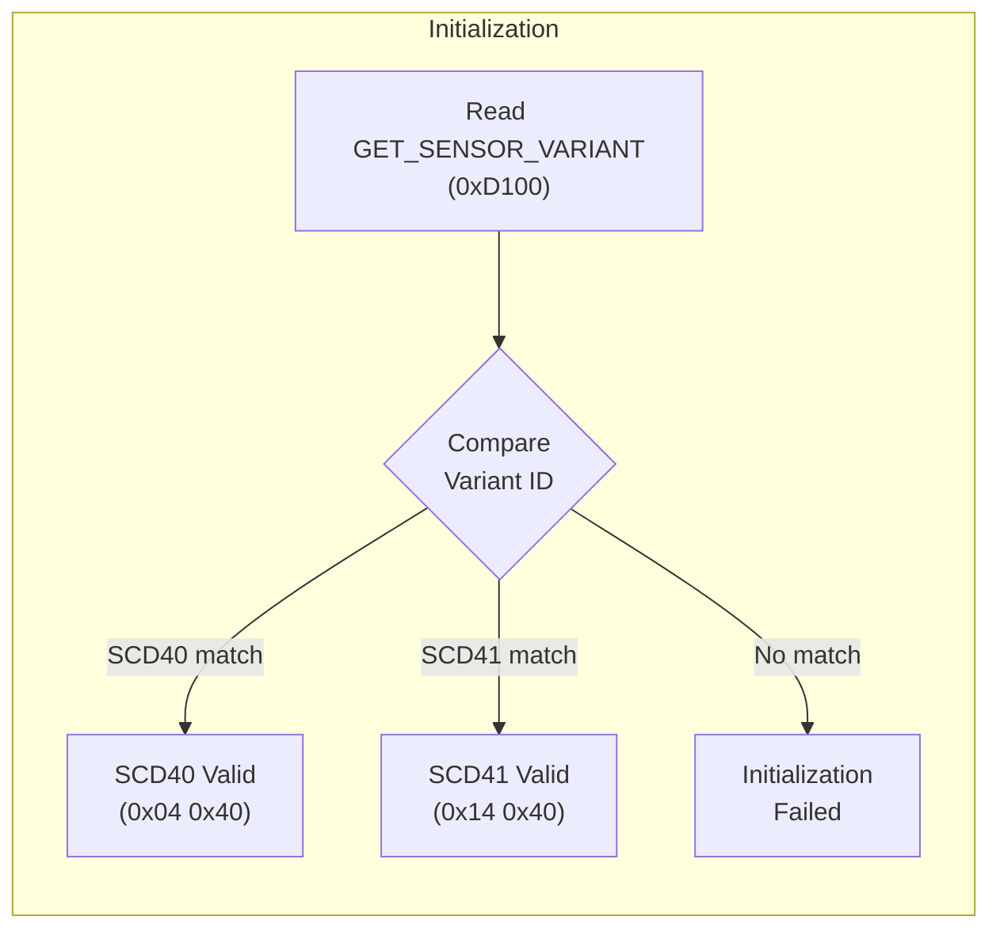

**Sources:** [src/unit/unit_SCD40.cpp:111-119](), [src/unit/unit_SCD41.cpp:36-44]()

---

## Data Structure and Access

### Data Class

The `scd4x::Data` structure stores raw sensor readings and provides conversion methods:

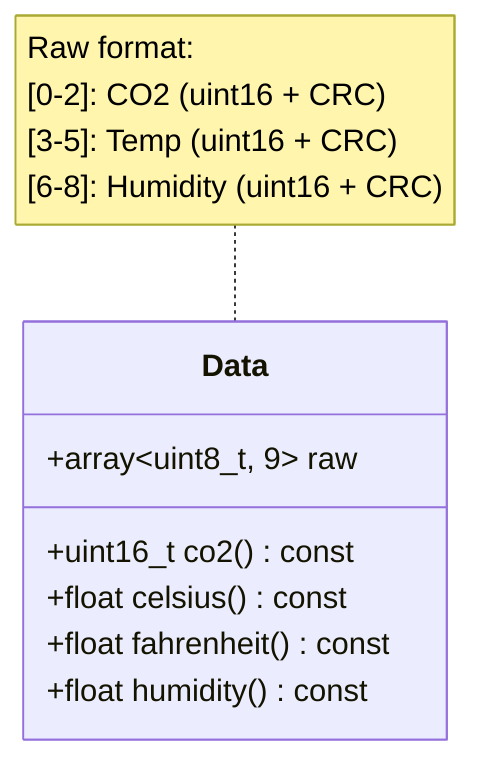

| Method | Return Type | Description | Formula |
|--------|-------------|-------------|---------|
| `co2()` | `uint16_t` | CO2 concentration in ppm | Direct big-endian conversion |
| `celsius()` | `float` | Temperature in °C | `-45 + (raw * 175 / 65536)` |
| `fahrenheit()` | `float` | Temperature in °F | `celsius * 9/5 + 32` |
| `humidity()` | `float` | Relative humidity (%) | `raw * 100 / 65536` |

**Sources:** [src/unit/unit_SCD40.cpp:51-69]()

### Data Storage

Measurements are automatically stored in a `CircularBuffer<Data>` during periodic mode:

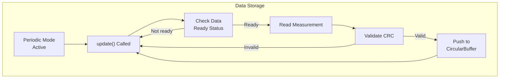

The buffer size is configured via `stored_size()` and allocated in `begin()`.

**Sources:** [src/unit/unit_SCD40.cpp:78-88](), [src/unit/unit_SCD40.cpp:121-135]()

---

## Measurement Modes

### Periodic Measurement Modes

Both SCD40 and SCD41 support two periodic measurement modes:

| Mode | Enum Value | Interval | Command Register | Power Consumption |
|------|-----------|----------|------------------|-------------------|
| **Normal** | `Mode::Normal` | 5 seconds | `START_PERIODIC_MEASUREMENT` (0x21B1) | Normal |
| **Low Power** | `Mode::LowPower` | 30 seconds | `START_LOW_POWER_PERIODIC_MEASUREMENT` (0x21AC) | Reduced |

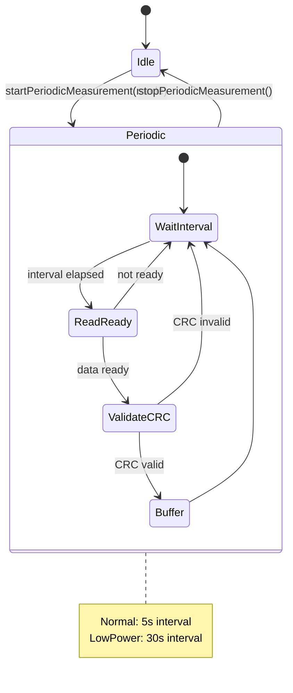

**Sources:** [src/unit/unit_SCD40.cpp:33-41](), [src/unit/unit_SCD40.cpp:137-150]()

#### Starting Periodic Measurement

```cpp
// Example: Start normal periodic measurement (5s interval)
bool start_periodic_measurement(const Mode mode = Mode::Normal);
```

The method sets internal state (`_periodic`, `_interval`, `_latest`) and issues the appropriate start command.

**Sources:** [src/unit/unit_SCD40.cpp:137-150]()

#### Stopping Periodic Measurement

```cpp
bool stop_periodic_measurement(const uint32_t duration = STOP_PERIODIC_MEASUREMENT_DURATION);
```

Must be called before configuration changes. Default duration is 500ms as specified by datasheet.

**Sources:** [src/unit/unit_SCD40.cpp:152-162]()

### Single-Shot Measurement (SCD41 Only)

The SCD41 provides two single-shot measurement methods:

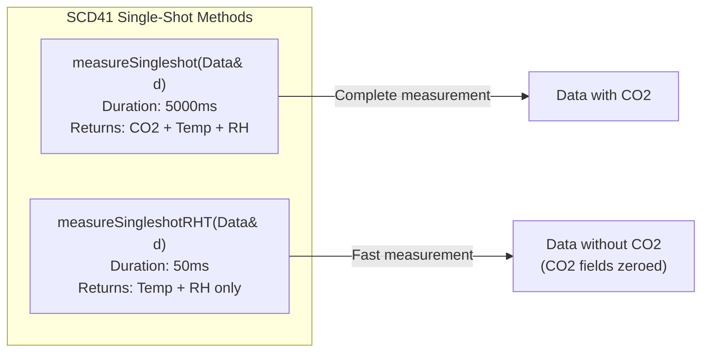

| Method | Duration | CO2 | Temperature | Humidity | Use Case |
|--------|----------|-----|-------------|----------|----------|
| `measureSingleshot()` | 5000 ms | ✓ | ✓ | ✓ | One-time full measurement |
| `measureSingleshotRHT()` | 50 ms | ✗ | ✓ | ✓ | Fast temp/humidity only |

**Sources:** [src/unit/unit_SCD41.cpp:46-76](), [src/unit/unit_SCD41.cpp:22-23]()

---

## Calibration

### Automatic Self-Calibration (ASC)

ASC continuously calibrates the sensor assuming periodic exposure to fresh air (400 ppm CO2). It is enabled/disabled via:

```cpp
bool writeAutomaticSelfCalibrationEnabled(const bool enabled, 
                                          const uint32_t duration = SET_AUTOMATIC_SELF_CALIBRATION_ENABLED_DURATION);
bool readAutomaticSelfCalibrationEnabled(bool& enabled);
```

**Configuration Flow:**

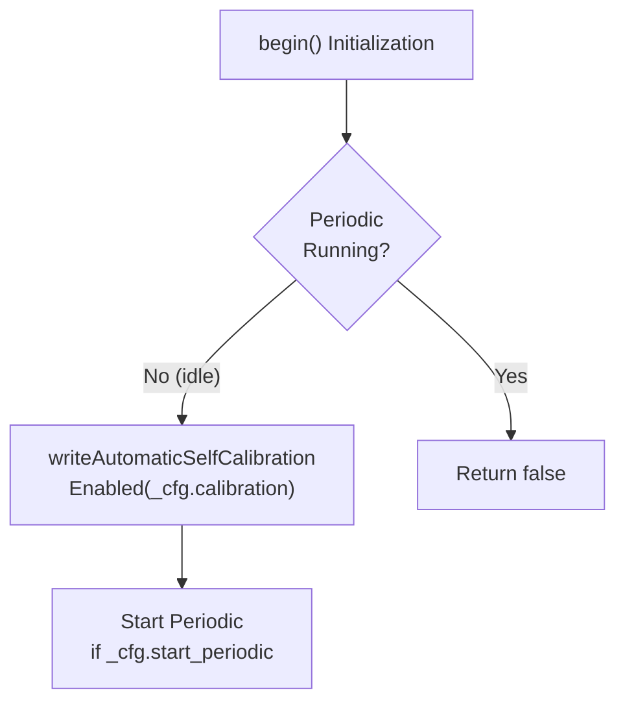

ASC is typically configured during `begin()` using the `_cfg.calibration` setting.

**Sources:** [src/unit/unit_SCD40.cpp:311-335](), [src/unit/unit_SCD40.cpp:101-104]()

#### ASC Target Value

The target CO2 concentration for ASC (default 400 ppm) can be customized:

```cpp
bool writeAutomaticSelfCalibrationTarget(const uint16_t ppm, const uint32_t duration);
bool readAutomaticSelfCalibrationTarget(uint16_t& ppm);
```

**Sources:** [src/unit/unit_SCD40.cpp:337-361]()

### Enhanced ASC Control (SCD41)

The SCD41 provides additional ASC timing controls:

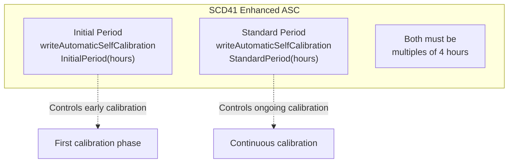

| Method | Parameter | Constraint |
|--------|-----------|------------|
| `writeAutomaticSelfCalibrationInitialPeriod()` | `uint16_t hours` | Must be multiple of 4 |
| `writeAutomaticSelfCalibrationStandardPeriod()` | `uint16_t hours` | Must be multiple of 4 |

**Sources:** [src/unit/unit_SCD41.cpp:115-175]()

### Forced Recalibration (FRC)

FRC manually calibrates the sensor to a known CO2 concentration:

```cpp
bool performForcedRecalibration(const uint16_t concentration, int16_t& correction);
```

**Procedure:**

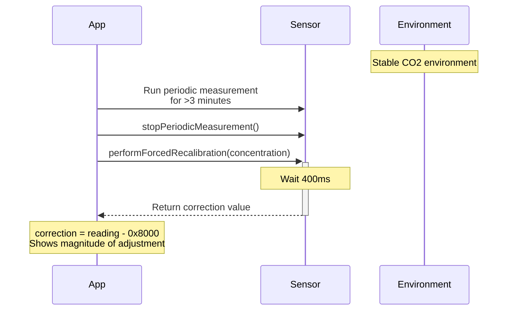

The `correction` output indicates the magnitude of the calibration adjustment. A value of `0xFFFF` indicates failure.

**Sources:** [src/unit/unit_SCD40.cpp:261-309]()

---

## Environmental Compensation

### Temperature Offset

Compensates for self-heating or external heat sources:

```cpp
bool writeTemperatureOffset(const float offset, const uint32_t duration = SET_TEMPERATURE_OFFSET_DURATION);
bool readTemperatureOffset(float& offset);
```

| Parameter | Range | Formula |
|-----------|-------|---------|
| `offset` | 0.0°C to 175.0°C | `uint16 = offset * 65536 / 175` |

**Conversion Details:**

The offset is stored as a uint16 value using the same encoding as temperature readings.

**Sources:** [src/unit/unit_SCD40.cpp:164-196](), [src/unit/unit_SCD40.cpp:20-31]()

### Altitude Compensation

Adjusts CO2 calculation based on sensor altitude above sea level:

```cpp
bool writeSensorAltitude(const uint16_t altitude, const uint32_t duration = SET_SENSOR_ALTITUDE_DURATION);
bool readSensorAltitude(uint16_t& altitude);
```

Altitude is specified in meters and affects the pressure compensation algorithm internally.

**Sources:** [src/unit/unit_SCD40.cpp:198-223]()

### Ambient Pressure

Sets current ambient pressure for real-time compensation:

```cpp
bool writeAmbientPressure(const uint16_t pressure, const uint32_t duration = AMBIENT_PRESSURE_DURATION);
bool readAmbientPressure(uint16_t& pressure);
```

| Parameter | Range | Unit | Notes |
|-----------|-------|------|-------|
| `pressure` | 700-1200 | hPa (mbar) | Can be called during periodic mode |

**Unique Behavior:** This is the only configuration command that can be issued while periodic measurement is running (see commented-out periodic checks in implementation).

**Sources:** [src/unit/unit_SCD40.cpp:225-259]()

---

## Configuration Persistence

### Persist Settings

Configuration changes can be saved to non-volatile memory:

```cpp
bool writePersistSettings(const uint32_t duration = PERSIST_SETTINGS_DURATION);
```

**Persistence Workflow:**

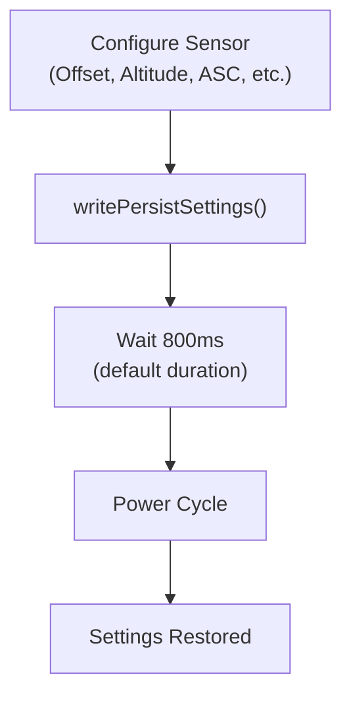

**Note:** Must not be called during periodic measurement.

**Sources:** [src/unit/unit_SCD40.cpp:363-375]()

---

## Power Management (SCD41 Only)

The SCD41 supports low-power modes for battery-operated applications:

### Power Down

```cpp
bool powerDown(const uint32_t duration = POWER_DOWN_DURATION);
```

Puts sensor into lowest power state. All sensor functionality is disabled except wakeup.

### Wake Up

```cpp
bool wakeup();
```

**Wake-Up Verification:**

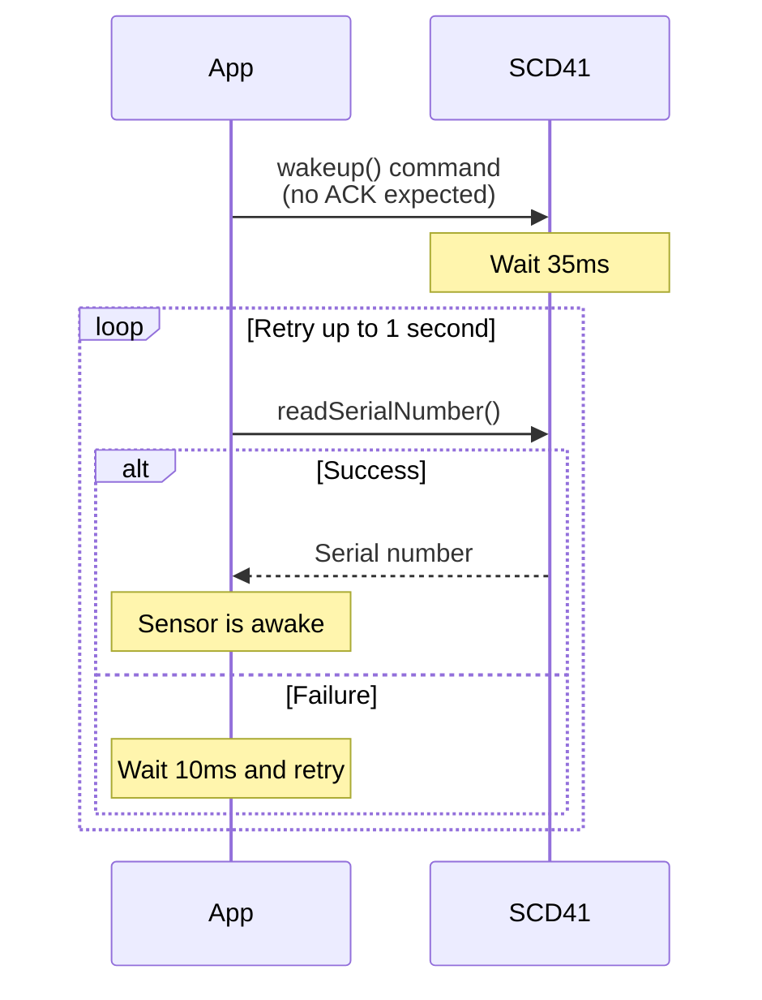

The sensor does not acknowledge the wakeup command, so verification is performed by attempting to read the serial number.

**Sources:** [src/unit/unit_SCD41.cpp:78-113]()

---

## Diagnostics and Maintenance

### Serial Number

Each sensor has a unique 48-bit serial number:

```cpp
bool readSerialNumber(char* serialNumber);  // 12-char hex string + null terminator
bool readSerialNumber(uint64_t& serialNumber);  // Raw 64-bit value
```

**Serial Number Encoding:**

The 48-bit serial is read as three 16-bit words, each with CRC-8 validation, then combined into a 64-bit value.

**Sources:** [src/unit/unit_SCD40.cpp:377-415]()

### Self-Test

Performs on-chip diagnostic:

```cpp
bool performSelfTest(bool& malfunction);
```

| Return | `malfunction` | Interpretation |
|--------|---------------|----------------|
| `true` | `false` | Test passed (0x0000) |
| `true` | `true` | Test failed (non-zero) |
| `false` | N/A | Communication error |

Duration: ~10 seconds (default `PERFORM_SELF_TEST_DURATION`).

**Sources:** [src/unit/unit_SCD40.cpp:417-432]()

### Factory Reset

Restores all settings to factory defaults:

```cpp
bool performFactoryReset(const uint32_t duration = PERFORM_FACTORY_RESET_DURATION);
```

**Warning:** Erases all configuration including calibration data. Must not be called during periodic measurement.

**Sources:** [src/unit/unit_SCD40.cpp:434-445]()

### Re-Initialization

Reloads settings from non-volatile memory without factory reset:

```cpp
bool reInit(const uint32_t duration = REINIT_DURATION);
```

Useful for reverting to previously persisted settings without fully resetting.

**Sources:** [src/unit/unit_SCD40.cpp:447-459]()

---

## Implementation Details

### CRC-8 Validation

All I2C transactions use CRC-8 validation with polynomial 0x31:

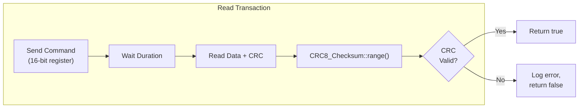

The `read_register()` helper method automatically validates CRC for all read operations.

**Sources:** [src/unit/unit_SCD40.cpp:493-508](), [src/unit/unit_SCD40.cpp:484-489]()

### Write with CRC

Write operations append CRC-8 to data:

```cpp
bool write_register(const uint16_t reg, uint8_t* wbuf, const uint32_t wlen);
```

The method creates a buffer with data + CRC, then issues the write command.

**Sources:** [src/unit/unit_SCD40.cpp:510-521]()

### Data Ready Status

Before reading measurements, the driver checks readiness:

```cpp
bool read_data_ready_status();
```

Returns true if bits 0-10 of the `GET_DATA_READY_STATUS` register are non-zero.

**Sources:** [src/unit/unit_SCD40.cpp:461-465]()

---

## API Reference Summary

### UnitSCD40 Key Methods

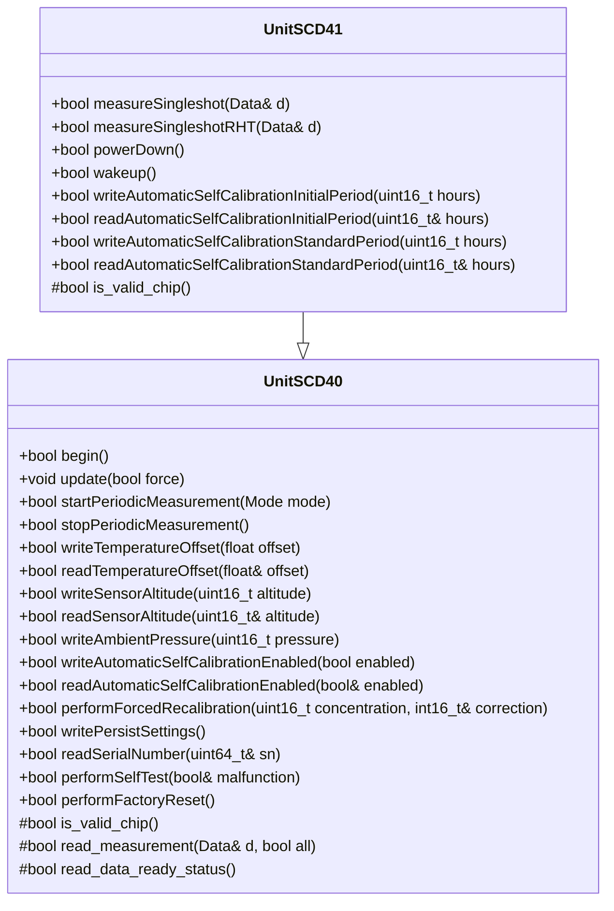

### State Constraints

Most configuration methods require the sensor to be idle (not in periodic measurement mode):

| Method Category | Periodic Mode Allowed? | Comment |
|----------------|------------------------|---------|
| Measurement start/stop | — | Changes mode |
| Single-shot (SCD41) | ✗ | Must be idle |
| Temperature offset | ✗ | Must be idle |
| Altitude | ✗ | Must be idle |
| Ambient pressure | ✓ | **Exception: Can update during periodic** |
| ASC configuration | ✗ | Must be idle |
| Forced recalibration | ✗ | Must be idle |
| Persist settings | ✗ | Must be idle |
| Serial number | ✗ | Must be idle |
| Self-test | ✗ | Must be idle |
| Factory reset | ✗ | Must be idle |
| Re-init | ✗ | Must be idle |
| Power down (SCD41) | ✗ | Must be idle |
| Wake up (SCD41) | ✗ | Must be idle |

**Sources:** [src/unit/unit_SCD40.cpp:166-168](), [src/unit/unit_SCD40.cpp:200-202](), [src/unit/unit_SCD40.cpp:230-235]()

---

## Usage Example

### Basic Periodic Measurement

```cpp
#include "unit_SCD40.hpp"

m5::unit::UnitSCD40 scd40;

// Configure and initialize
scd40.config() = {
    .mode = m5::unit::scd4x::Mode::Normal,  // 5-second interval
    .start_periodic = true,
    .calibration = true  // Enable ASC
};
scd40.begin();

// In loop
scd40.update();
if (scd40.updated()) {
    auto& data = scd40.oldest();
    uint16_t co2 = data.co2();
    float temp = data.celsius();
    float rh = data.humidity();
    // Process measurements...
}
```

### SCD41 Single-Shot Measurement

```cpp
#include "unit_SCD41.hpp"

m5::unit::UnitSCD41 scd41;

scd41.begin();

// Perform single measurement
m5::unit::scd4x::Data data;
if (scd41.measureSingleshot(data)) {
    // 5-second measurement complete
}

// Or fast temp/humidity only
if (scd41.measureSingleshotRHT(data)) {
    // 50ms measurement complete (no CO2)
}
```

**Sources:** [src/unit/unit_SCD40.cpp:78-109](), [src/unit/unit_SCD41.cpp:46-76]()