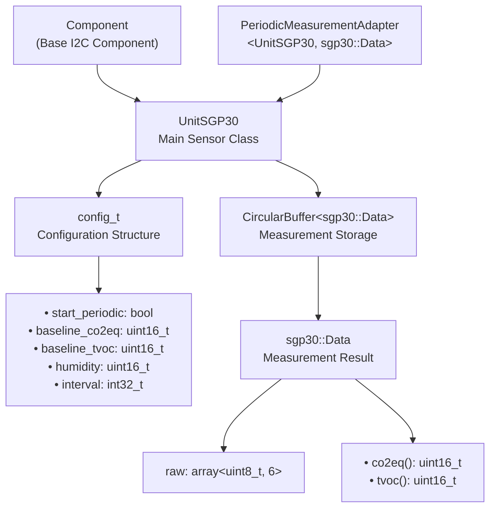
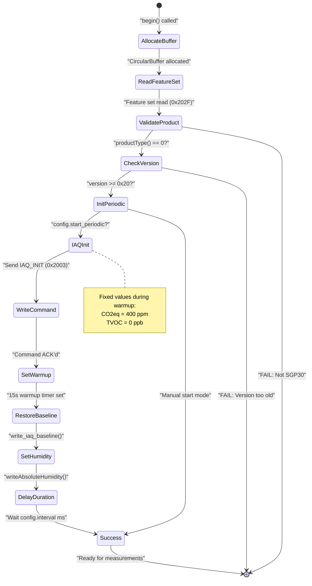
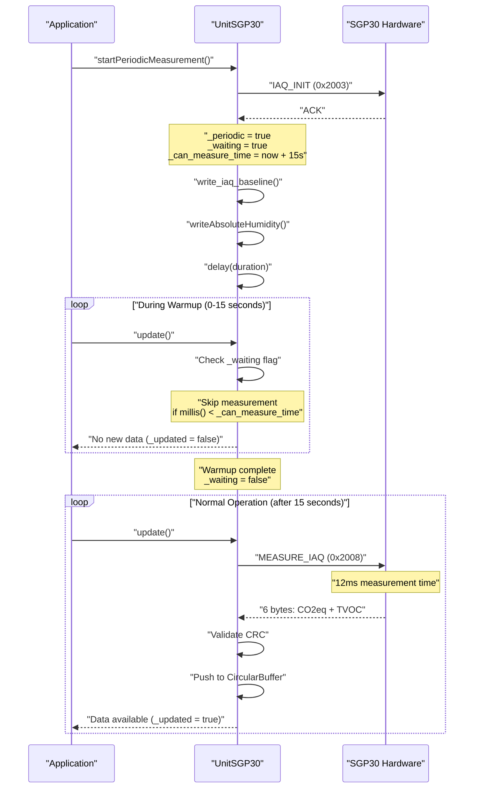
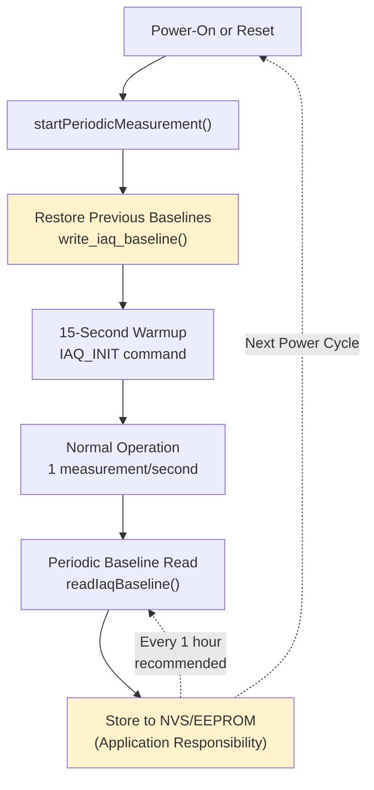
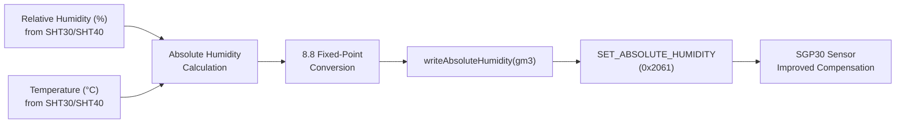

M5Unit-ENV SGP30 (TVOC and eCO2)

# SGP30 (TVOC and eCO2)

<details>
<summary>Relevant source files</summary>

The following files were used as context for generating this wiki page:

- [examples/UnitUnified/UnitTVOC/PlotToSerial/PlotToSerial.ino](examples/UnitUnified/UnitTVOC/PlotToSerial/PlotToSerial.ino)
- [src/unit/unit_ENV4.cpp](src/unit/unit_ENV4.cpp)
- [src/unit/unit_ENV4.hpp](src/unit/unit_ENV4.hpp)
- [src/unit/unit_SGP30.cpp](src/unit/unit_SGP30.cpp)
- [src/unit/unit_SGP30.hpp](src/unit/unit_SGP30.hpp)
- [src/unit/unit_SHT40.cpp](src/unit/unit_SHT40.cpp)

</details>


This document describes the SGP30 air quality sensor driver implementation in the M5Unit-ENV library. The SGP30 measures Total Volatile Organic Compounds (TVOC) and equivalent CO₂ (eCO₂) using a multi-pixel metal oxide gas sensor with on-chip humidity compensation and baseline management capabilities.

For general air quality measurements with BME688 including IAQ calculations, see [BME688 (ENVPro Unit)](#4.1). For CO₂-specific sensors with higher accuracy, see [SCD40 and SCD41 (CO2 Sensors)](#4.4). For multi-sensor environmental monitoring examples, see [Multi-Sensor Applications](#5.2).

---

## Overview and Purpose

The SGP30 sensor provides indoor air quality monitoring through two primary measurements: TVOC (Total Volatile Organic Compounds) in parts per billion (ppb) and eCO₂ (equivalent CO₂) in parts per million (ppm). Unlike true NDIR-based CO₂ sensors, the SGP30 estimates CO₂ equivalence from VOC measurements using proprietary algorithms.

**Key Characteristics:**
- **I2C Address**: `0x58` (fixed, not configurable)
- **Clock Speed**: 400 kHz
- **Warmup Time**: 15 seconds after initialization before valid measurements
- **Measurement Interval**: Minimum 1 second (recommended: 1 second for optimal baseline tracking)
- **Baseline Persistence**: Requires periodic baseline storage for calibration continuity
- **Humidity Compensation**: Optional absolute humidity input improves accuracy

The driver is implemented in the `UnitSGP30` class ([src/unit/unit_SGP30.hpp:82]()) with support for the M5UnitUnified framework's periodic measurement pattern.

**Sources:** [src/unit/unit_SGP30.hpp:1-360](), [src/unit/unit_SGP30.cpp:1-359]()

---

## Architecture and Data Structures

### UnitSGP30 Class Hierarchy



**Sources:** [src/unit/unit_SGP30.hpp:82-338](), [src/unit/unit_SGP30.hpp:66-74]()

### Core Data Structures

#### sgp30::Data Structure
The measurement result container with raw data and accessor methods:

| Field/Method | Type | Description |
|-------------|------|-------------|
| `raw` | `std::array<uint8_t, 6>` | Raw I2C response bytes |
| `co2eq()` | `uint16_t` | CO₂ equivalent in ppm (400-60000) |
| `tvoc()` | `uint16_t` | Total VOC in ppb (0-60000) |

The raw data layout is: `[CO2_MSB, CO2_LSB, CRC, TVOC_MSB, TVOC_LSB, CRC]`

**Sources:** [src/unit/unit_SGP30.hpp:70-74](), [src/unit/unit_SGP30.cpp:37-46]()

#### sgp30::Feature Structure
Feature set identification for hardware validation:

| Field/Method | Type | Description |
|-------------|------|-------------|
| `value` | `uint16_t` | Raw feature set register value |
| `productType()` | `uint8_t` | Product type (0 for SGP30, 1 for SGPC3) |
| `productVersion()` | `uint8_t` | Chip version (minimum 0x20 required) |

**Sources:** [src/unit/unit_SGP30.hpp:46-64](), [src/unit/unit_SGP30.cpp:281-292]()

#### config_t Configuration
Settings applied during `begin()`:

```cpp
struct config_t {
    bool start_periodic{true};        // Auto-start periodic measurement
    uint16_t baseline_co2eq{};        // Restored CO2eq baseline
    uint16_t baseline_tvoc{};         // Restored TVOC baseline
    uint16_t humidity{};              // Absolute humidity (8.8 fixed-point)
    uint16_t inceptive_tvoc{};        // First-startup baseline (reserved)
    int32_t interval{1000};           // Measurement interval in ms
};
```

**Sources:** [src/unit/unit_SGP30.hpp:90-107]()

---

## Initialization and Begin Sequence

### Initialization State Machine



**Sources:** [src/unit/unit_SGP30.cpp:55-88]()

### Begin Process Details

The `begin()` method performs hardware validation and optional auto-start:

1. **Buffer Allocation** ([src/unit/unit_SGP30.cpp:57-65]()):
   - Allocates `CircularBuffer<sgp30::Data>` with capacity from `stored_size()`
   - Default capacity is 1 (only latest measurement retained)

2. **Hardware Validation** ([src/unit/unit_SGP30.cpp:69-83]()):
   - Reads feature set register via `GET_FEATURE_SET` (0x202F)
   - Validates `productType() == 0` (SGP30, not SGPC3)
   - Requires `productVersion() >= 0x20` (minimum supported version)

3. **Conditional Auto-Start** ([src/unit/unit_SGP30.cpp:85-87]()):
   - If `config.start_periodic == true`, calls `startPeriodicMeasurement()` with stored baselines
   - Passes baseline values and humidity from configuration

**Sources:** [src/unit/unit_SGP30.cpp:55-88]()

---

## Periodic Measurement Workflow

### The 15-Second Warmup Period

The SGP30 requires a mandatory 15-second initialization period after the `IAQ_INIT` command. During this time, measurements return fixed placeholder values:

- **CO₂eq**: 400 ppm (constant)
- **TVOC**: 0 ppb (constant)



**Sources:** [src/unit/unit_SGP30.cpp:110-148](), [src/unit/unit_SGP30.cpp:90-108]()

### Update Cycle Implementation

The `update()` method manages the measurement state machine ([src/unit/unit_SGP30.cpp:90-108]()):

```cpp
void UnitSGP30::update(const bool force)
{
    _updated = false;
    if (_periodic) {
        elapsed_time_t at{m5::utility::millis()};
        
        // Handle warmup wait
        if (_waiting) {
            _waiting = (at < _can_measure_time);  // Clear flag after 15s
            return;
        }
        
        // Interval-based measurement
        if (force || !_latest || at >= _latest + _interval) {
            Data d{};
            _updated = read_measurement(d);
            if (_updated) {
                _latest = at;
                _data->push_back(d);
            }
        }
    }
}
```

**Key Behaviors:**
- `_waiting` flag blocks measurements during warmup
- `_can_measure_time` stores the timestamp when valid measurements begin
- After warmup, measurements occur at `_interval` frequency (default 1000ms)
- The `force` parameter bypasses interval timing for immediate reads

**Sources:** [src/unit/unit_SGP30.cpp:90-108]()

### Measurement Read Process

The `read_measurement()` method executes the actual I2C transaction ([src/unit/unit_SGP30.cpp:349-356]()):

1. **Command**: Sends `MEASURE_IAQ` (0x2008) register address
2. **Delay**: Waits 12ms for measurement completion (`MEASURE_IAQ_DURATION`)
3. **Read**: Receives 6 bytes: `[CO2_MSB, CO2_LSB, CRC, TVOC_MSB, TVOC_LSB, CRC]`
4. **Validation**: Verifies CRC-8 checksum for both value pairs
5. **Storage**: Returns data in `sgp30::Data` structure

**Sources:** [src/unit/unit_SGP30.cpp:349-356]()

---

## Baseline Management and Calibration

### Baseline Persistence Workflow

The SGP30 maintains internal calibration baselines that track sensor drift and environmental conditions. These baselines must be stored and restored across power cycles to maintain calibration accuracy.



**Sources:** [src/unit/unit_SGP30.cpp:110-117](), [src/unit/unit_SGP30.cpp:183-196](), [src/unit/unit_SGP30.cpp:333-347]()

### Baseline API Methods

#### Reading Current Baselines

```cpp
bool readIaqBaseline(uint16_t& co2eq, uint16_t& tvoc)
```

Retrieves the current baseline values from the sensor ([src/unit/unit_SGP30.cpp:183-196]()):

- **Command**: `GET_IAQ_BASELINE` (0x2015)
- **Duration**: 10ms maximum
- **Returns**: Two 16-bit baseline values with CRC validation
- **Usage**: Call periodically (every 1 hour recommended) during operation to capture baseline state

#### Writing Baseline Values

The `write_iaq_baseline()` method restores previously saved baselines ([src/unit/unit_SGP30.cpp:333-347]()):

- **Command**: `SET_IAQ_BASELINE` (0x201E)
- **Format**: Two 16-bit values with CRC checksums
- **Timing**: Must occur during 15-second warmup period after `IAQ_INIT`
- **Byte Order**: TVOC value sent first, then CO2eq (reversed from read order)

**Important**: Baseline restoration is only effective if:
1. Called within 15 seconds after `IAQ_INIT`
2. Baselines were saved from the same sensor (serial number matching)
3. Sensor hasn't been powered off for more than 7 days

**Sources:** [src/unit/unit_SGP30.cpp:183-196](), [src/unit/unit_SGP30.cpp:333-347]()

### Baseline Storage Strategy

The M5Unit-ENV library **does not** automatically persist baselines. Application code must:

1. **Read** baselines periodically (hourly recommended) via `readIaqBaseline()`
2. **Store** values to non-volatile storage (SPIFFS, EEPROM, Preferences API)
3. **Restore** on startup via `config.baseline_co2eq` and `config.baseline_tvoc`

Example pattern:
```cpp
// On startup
UnitSGP30::config_t cfg;
cfg.baseline_co2eq = loadFromNVS("sgp30_co2_baseline");
cfg.baseline_tvoc = loadFromNVS("sgp30_tvoc_baseline");
sgp30.config(cfg);
sgp30.begin();

// During operation (every hour)
uint16_t co2_base, tvoc_base;
if (sgp30.readIaqBaseline(co2_base, tvoc_base)) {
    saveToNVS("sgp30_co2_baseline", co2_base);
    saveToNVS("sgp30_tvoc_baseline", tvoc_base);
}
```

**Sources:** [src/unit/unit_SGP30.hpp:90-107]()

---

## Humidity Compensation

### Absolute Humidity Calculation

The SGP30's accuracy improves with absolute humidity compensation. The sensor expects absolute humidity in **g/m³** expressed as an 8.8 fixed-point number.



**Sources:** [src/unit/unit_SGP30.cpp:198-216]()

### Humidity Compensation API

#### writeAbsoluteHumidity (Float)

```cpp
bool writeAbsoluteHumidity(const float gm3, const uint32_t duration = 10)
```

Accepts absolute humidity in **g/m³** and converts to fixed-point ([src/unit/unit_SGP30.cpp:208-216]()):

- **Range Check**: Validates value fits in 16-bit signed integer after scaling
- **Conversion**: `raw_value = round(gm3 * 256)`
- **Overflow Protection**: Returns false if value exceeds [-32768, 32767] range

#### writeAbsoluteHumidity (Raw)

```cpp
bool writeAbsoluteHumidity(const uint16_t raw, const uint32_t duration = 10)
```

Directly writes 8.8 fixed-point value ([src/unit/unit_SGP30.cpp:198-206]()):

- **Format**: Upper 8 bits = integer part, lower 8 bits = fractional part
- **CRC**: Automatically calculated and appended
- **Timing**: Can be called during warmup or operation

**Note**: Setting humidity to zero (0x0000) disables compensation.

**Sources:** [src/unit/unit_SGP30.cpp:198-216]()

### Integration with ENV Units

For systems using composite units (ENV3, ENV4), humidity compensation follows this pattern:

```cpp
// After ENV4 measurement update
float humidity_rh = env4.sht40.humidity();
float temp_c = env4.sht40.celsius();

// Calculate absolute humidity (simplified formula)
float abs_humidity = calculateAbsoluteHumidity(humidity_rh, temp_c);

// Update SGP30 compensation
sgp30.writeAbsoluteHumidity(abs_humidity);
```

**Sources:** For ENV4 integration see [ENV4 (ENVIV - Composite Unit)](#4.9)

---

## Commands and Register Operations

### Command Reference Table

| Command | Code | Duration (ms) | Description |
|---------|------|---------------|-------------|
| `IAQ_INIT` | 0x2003 | 10 | Initialize IAQ algorithm, required before measurements |
| `MEASURE_IAQ` | 0x2008 | 12 | Trigger IAQ measurement (periodic call) |
| `GET_IAQ_BASELINE` | 0x2015 | 10 | Read current baseline values |
| `SET_IAQ_BASELINE` | 0x201E | 10 | Write restored baseline values |
| `SET_ABSOLUTE_HUMIDITY` | 0x2061 | 10 | Set humidity compensation value |
| `MEASURE_TEST` | 0x2032 | 220 | On-chip self-test (result: 0xD400 = pass) |
| `GET_FEATURE_SET` | 0x202F | 10 | Read chip version and product type |
| `MEASURE_RAW` | 0x2050 | 25 | Read raw H2 and Ethanol signals |
| `GET_SERIAL_ID` | 0x3682 | 10 | Read 48-bit serial number |

**Sources:** [src/unit/unit_SGP30.hpp:341-354](), [src/unit/unit_SGP30.hpp:29-40]()

### Raw Signal Reading

The SGP30 provides access to underlying raw sensor signals for advanced applications.

#### readRaw (Integer)

```cpp
bool readRaw(uint16_t& h2, uint16_t& ethanol)
```

Returns raw ADC values ([src/unit/unit_SGP30.cpp:156-169]()):

- **H2 Signal**: Raw hydrogen concentration (unitless)
- **Ethanol Signal**: Raw ethanol concentration (unitless)
- **Use Case**: Signal debugging, custom algorithms, correlation analysis

#### readRaw (Concentration)

```cpp
bool readRaw(float& h2, float& ethanol)
```

Converts raw values to estimated concentrations ([src/unit/unit_SGP30.cpp:171-181]()):

- **H2 Formula**: `h2_ppm = 0.5 * exp((13119 - raw_h2) / 512.0)`
- **Ethanol Formula**: `ethanol_ppm = 0.4 * exp((18472 - raw_ethanol) / 512.0)`
- **Note**: These are approximations; actual gas concentrations depend on environmental factors

**Sources:** [src/unit/unit_SGP30.cpp:156-181]()

### Self-Test Operation

```cpp
bool measureTest(uint16_t& result)
```

Executes on-chip built-in self-test ([src/unit/unit_SGP30.cpp:218-234]()):

- **Duration**: 220ms (longest command)
- **Success Value**: 0xD400
- **Restrictions**: Must NOT be called during periodic measurements
- **Purpose**: Factory testing, initial hardware validation

**Sources:** [src/unit/unit_SGP30.cpp:218-234]()

### Serial Number Retrieval

Two overloads for serial number access:

```cpp
bool readSerialNumber(uint64_t& number)         // Numeric
bool readSerialNumber(char* number)              // Hex string (13 bytes)
```

- **Format**: 48-bit unique identifier
- **String Output**: 12 hex characters + null terminator
- **Use Case**: Baseline matching across power cycles, device tracking

**Sources:** [src/unit/unit_SGP30.cpp:294-330]()

---

## Usage Patterns and Code Examples

### Basic Periodic Measurement

Standard pattern for continuous air quality monitoring:

```cpp
#include <M5Unified.h>
#include <M5UnitUnified.h>
#include <M5UnitUnifiedENV.h>

m5::unit::UnitSGP30 sgp30;

void setup() {
    M5.begin();
    
    // Configure auto-start with defaults
    auto cfg = sgp30.config();
    cfg.start_periodic = true;
    cfg.interval = 1000;  // 1 measurement/second
    sgp30.config(cfg);
    
    // Initialize and start
    if (!sgp30.begin()) {
        M5.Log.println("SGP30 initialization failed");
        while (1) delay(100);
    }
    
    // Wait for warmup
    M5.Log.println("Warming up for 15 seconds...");
    while (!sgp30.canMeasurePeriodic()) {
        sgp30.update();
        delay(100);
    }
    M5.Log.println("Ready for measurements");
}

void loop() {
    sgp30.update();
    
    if (sgp30.updated()) {
        M5.Log.printf("CO2eq: %u ppm, TVOC: %u ppb\n",
                      sgp30.co2eq(), sgp30.tvoc());
    }
    
    delay(100);
}
```

**Sources:** [examples/UnitUnified/UnitTVOC/PlotToSerial/PlotToSerial.ino:1-10]() (references main implementation)

### Manual Baseline Persistence

Implementing hourly baseline storage:

```cpp
#include <Preferences.h>

Preferences prefs;
unsigned long lastBaselineSave = 0;
const unsigned long BASELINE_INTERVAL = 3600000;  // 1 hour

void setup() {
    prefs.begin("sgp30", false);
    
    // Restore baselines from NVS
    auto cfg = sgp30.config();
    cfg.baseline_co2eq = prefs.getUShort("co2_base", 0);
    cfg.baseline_tvoc = prefs.getUShort("tvoc_base", 0);
    cfg.start_periodic = true;
    sgp30.config(cfg);
    
    sgp30.begin();
}

void loop() {
    sgp30.update();
    
    // Periodic baseline saving
    if (millis() - lastBaselineSave >= BASELINE_INTERVAL) {
        if (sgp30.canMeasurePeriodic()) {
            uint16_t co2_base, tvoc_base;
            if (sgp30.readIaqBaseline(co2_base, tvoc_base)) {
                prefs.putUShort("co2_base", co2_base);
                prefs.putUShort("tvoc_base", tvoc_base);
                lastBaselineSave = millis();
                M5.Log.println("Baselines saved");
            }
        }
    }
    
    delay(100);
}
```

**Sources:** [src/unit/unit_SGP30.hpp:90-107](), [src/unit/unit_SGP30.cpp:183-196]()

### Humidity Compensation Integration

Combined with SHT40 for improved accuracy:

```cpp
m5::unit::UnitSHT40 sht40;
m5::unit::UnitSGP30 sgp30;

void setup() {
    sht40.begin();
    sgp30.begin();
}

void loop() {
    // Update both sensors
    sht40.update();
    sgp30.update();
    
    // Apply humidity compensation every 10 seconds
    static unsigned long lastHumidity = 0;
    if (millis() - lastHumidity >= 10000) {
        if (sht40.updated()) {
            float rh = sht40.humidity();
            float temp = sht40.celsius();
            
            // Calculate absolute humidity (g/m³)
            float abs_hum = calculateAbsoluteHumidity(rh, temp);
            sgp30.writeAbsoluteHumidity(abs_hum);
            
            lastHumidity = millis();
        }
    }
}

// Simplified absolute humidity calculation
float calculateAbsoluteHumidity(float rh, float temp_c) {
    // Saturation vapor pressure (Magnus formula)
    float es = 6.112 * exp((17.62 * temp_c) / (243.12 + temp_c));
    // Actual vapor pressure
    float ea = (rh / 100.0) * es;
    // Absolute humidity in g/m³
    return (ea * 2.1674) / (273.15 + temp_c);
}
```

**Sources:** [src/unit/unit_SGP30.cpp:208-216](), [src/unit/unit_SHT40.cpp:1-297]()

---

## Data Access and Interpretation

### Measurement Value Ranges

| Metric | Unit | Range | Initial Value (Warmup) | Notes |
|--------|------|-------|----------------------|-------|
| CO₂eq | ppm | 400 - 60000 | 400 (fixed) | Estimated from VOC signals |
| TVOC | ppb | 0 - 60000 | 0 (fixed) | Total volatile organic compounds |

### Data Accessor Methods

The `UnitSGP30` class provides convenience accessors that automatically retrieve the oldest buffered value:

```cpp
uint16_t co2eq()  // Returns oldest CO2eq value or 0xFFFF if buffer empty
uint16_t tvoc()   // Returns oldest TVOC value or 0xFFFF if buffer empty
```

Direct access to structured data via `oldest()` and `newest()`:

```cpp
if (!sgp30.empty()) {
    const auto& data = sgp30.oldest();
    uint16_t co2 = data.co2eq();    // Accessor method
    uint16_t voc = data.tvoc();     // Accessor method
    
    // Or access raw bytes
    uint8_t co2_msb = data.raw[0];
    uint8_t co2_lsb = data.raw[1];
}
```

**Sources:** [src/unit/unit_SGP30.hpp:162-170](), [src/unit/unit_SGP30.cpp:37-46]()

### CRC Validation

All measurements include CRC-8 checksum validation ([src/unit/unit_SGP30.cpp:349-356]()):

```cpp
bool read_measurement(Data& d) {
    if (readRegister(MEASURE_IAQ, d.raw.data(), d.raw.size(), 
                     MEASURE_IAQ_DURATION)) {
        m5::utility::CRC8_Checksum crc{};
        return crc.range(d.raw.data(), 2) == d.raw[2] &&
               crc.range(d.raw.data() + 3, 2) == d.raw[5];
    }
    return false;
}
```

Failed CRC validation causes the measurement to be discarded and `updated()` returns false.

**Sources:** [src/unit/unit_SGP30.cpp:349-356]()

---

## Reset and Recovery Operations

### General Reset

```cpp
bool generalReset()
```

Issues I2C General Call reset command (0x06) ([src/unit/unit_SGP30.cpp:270-279]()):

- **Scope**: Affects ALL I2C devices on the bus (not SGP30-specific)
- **Side Effects**: Resets periodic measurement state, clears `_periodic` flag
- **Recovery Time**: 10ms delay after command
- **Use Case**: Factory reset, catastrophic error recovery

**Warning**: This command is broadcast to all I2C devices. Use with caution in multi-device systems.

**Sources:** [src/unit/unit_SGP30.cpp:270-279]()

### State Management

The driver maintains several internal state flags:

| Flag | Type | Purpose |
|------|------|---------|
| `_periodic` | `bool` | Indicates if periodic measurements are active |
| `_waiting` | `bool` | True during 15-second warmup period |
| `_can_measure_time` | `elapsed_time_t` | Timestamp when warmup completes |
| `_latest` | `elapsed_time_t` | Timestamp of last successful measurement |
| `_interval` | `elapsed_time_t` | Measurement interval in milliseconds |

**Sources:** [src/unit/unit_SGP30.hpp:330-337]()

---

## Integration with M5UnitUnified Framework

### Component Registration

The SGP30 registers with the M5UnitUnified framework using standard metadata:

```cpp
const char UnitSGP30::name[] = "UnitSGP30";
const types::uid_t UnitSGP30::uid{"UnitSGP30"_mmh3};
const types::attr_t UnitSGP30::attr{attribute::AccessI2C};
```

- **Name**: Human-readable identifier "UnitSGP30"
- **UID**: MurmurHash3-generated unique identifier from name string
- **Attributes**: Declares I2C access requirement

**Sources:** [src/unit/unit_SGP30.cpp:51-53]()

### I2C Configuration

Default I2C settings ([src/unit/unit_SGP30.hpp:109-115]()):

```cpp
explicit UnitSGP30(const uint8_t addr = DEFAULT_ADDRESS)
    : Component(addr), _data{...}
{
    auto ccfg  = component_config();
    ccfg.clock = 400 * 1000U;  // 400 kHz
    component_config(ccfg);
}
```

The 400 kHz clock speed is required for reliable SGP30 communication (specification minimum).

**Sources:** [src/unit/unit_SGP30.hpp:109-115]()

### PeriodicMeasurementAdapter

The SGP30 inherits from `PeriodicMeasurementAdapter` ([src/unit/unit_SGP30.hpp:82]()), providing standardized methods:

- `inPeriodic()`: Check if periodic mode active
- `empty()`: Check if data buffer is empty
- `oldest()`: Access oldest buffered measurement
- `newest()`: Access newest buffered measurement
- `updated()`: Check if new data available from last `update()`

**Sources:** [src/unit/unit_SGP30.hpp:82-338]()

---

## Summary and Key Takeaways

### Critical Requirements

1. **15-Second Warmup**: Mandatory initialization period after `IAQ_INIT` command
2. **1-Second Interval**: Measurements must occur every 1 second for optimal baseline tracking
3. **Baseline Persistence**: Application must store and restore baselines for calibration continuity
4. **Fixed I2C Address**: 0x58 (not configurable, potential bus conflict)

### Best Practices

1. **Always wait for `canMeasurePeriodic()` before trusting measurements**
2. **Save baselines hourly** to non-volatile storage during operation
3. **Apply humidity compensation** when temperature/humidity sensors available
4. **Avoid `generalReset()`** in multi-device systems (affects all I2C devices)
5. **Check CRC validation** failures in noisy environments

### Comparison with Other Air Quality Sensors

| Feature | SGP30 | BME688 (BSEC2) | SCD40 |
|---------|-------|----------------|-------|
| CO₂ Type | Estimated (eCO₂) | Estimated | NDIR (True) |
| TVOC | ✓ Native | ✓ via BSEC2 | ✗ |
| Warmup | 15 seconds | 5 minutes (stabilization) | 5 seconds |
| Baseline Storage | Manual | Automatic (BSEC2) | Automatic (FRC) |
| Humidity Comp | Manual input | Automatic (on-chip) | Automatic |
| Measurement Rate | 1/second | 3-second intervals | 5-second intervals |

**Sources:** For BME688 comparison see [BME688 (ENVPro Unit)](#4.1), for SCD40 see [SCD40 and SCD41 (CO2 Sensors)](#4.4)

---

**Sources:** [src/unit/unit_SGP30.hpp:1-360](), [src/unit/unit_SGP30.cpp:1-359](), [examples/UnitUnified/UnitTVOC/PlotToSerial/PlotToSerial.ino:1-10]()