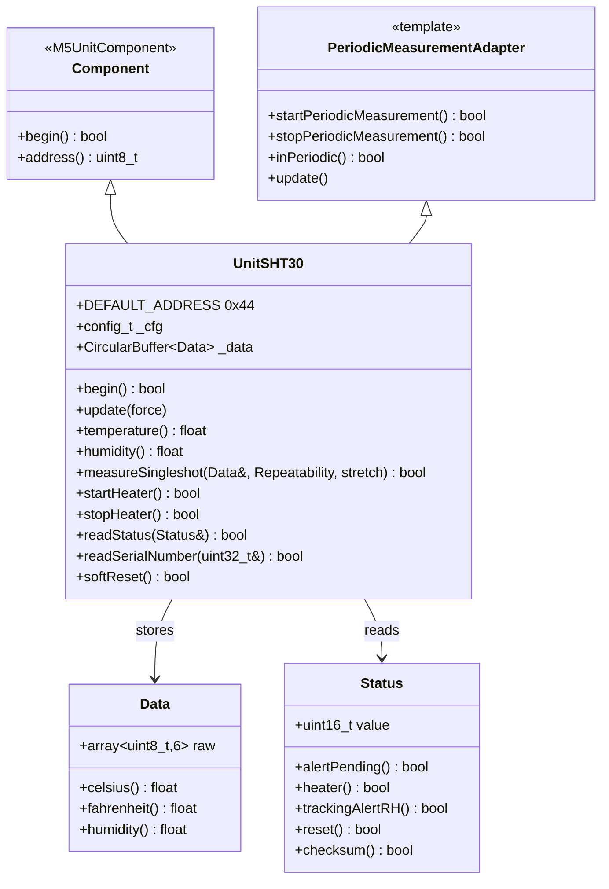
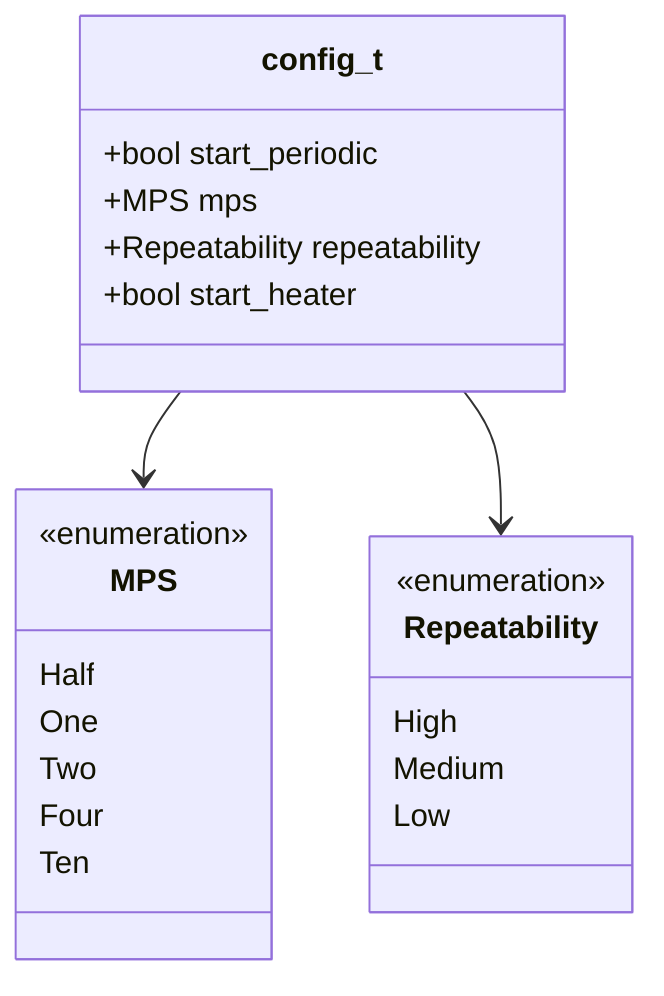
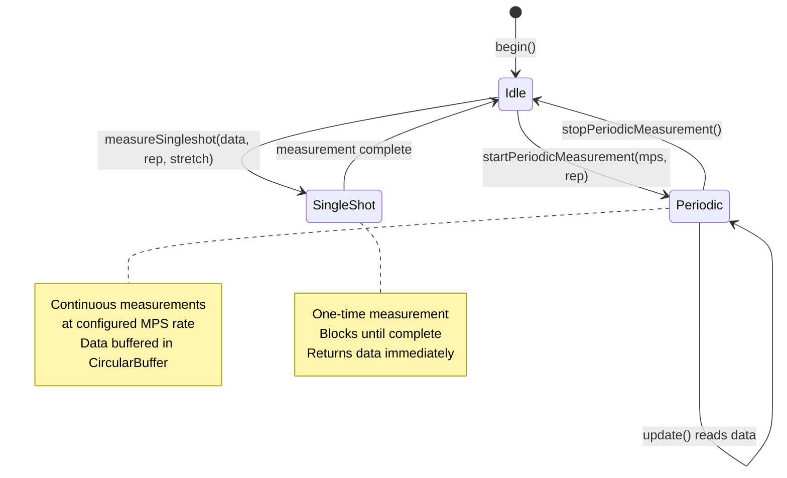
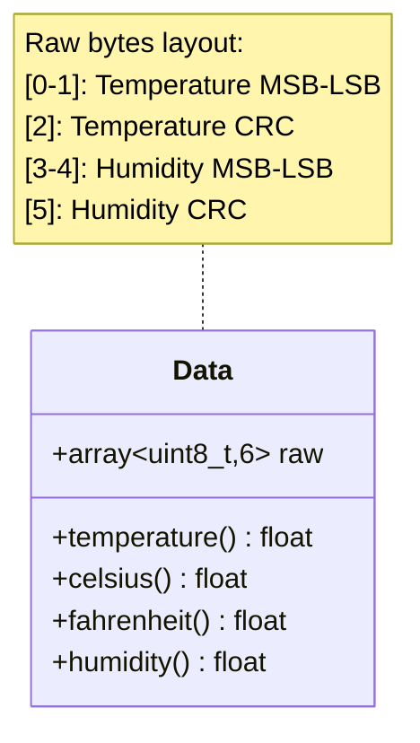
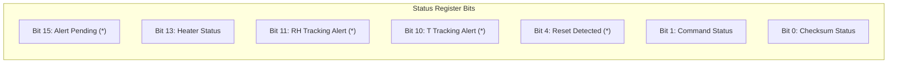
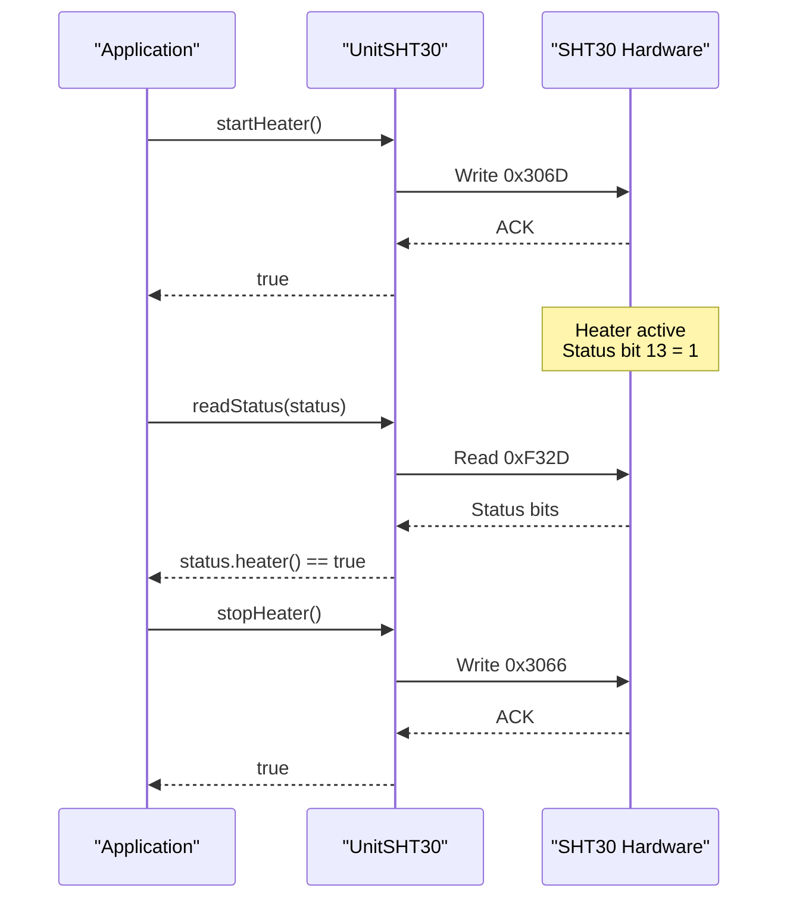
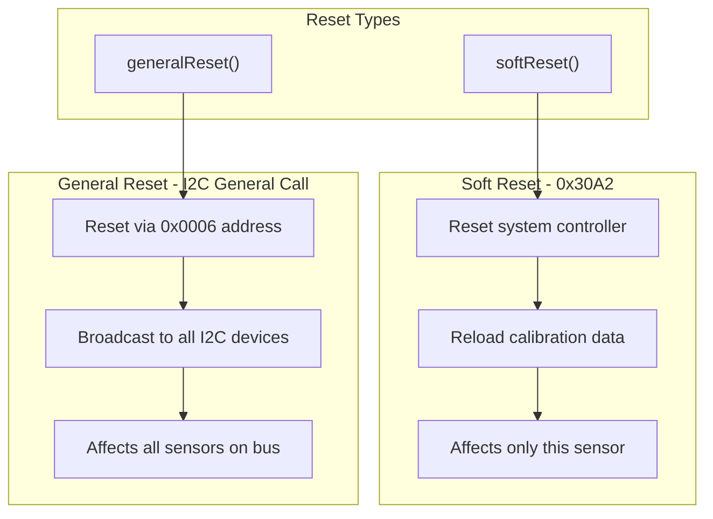
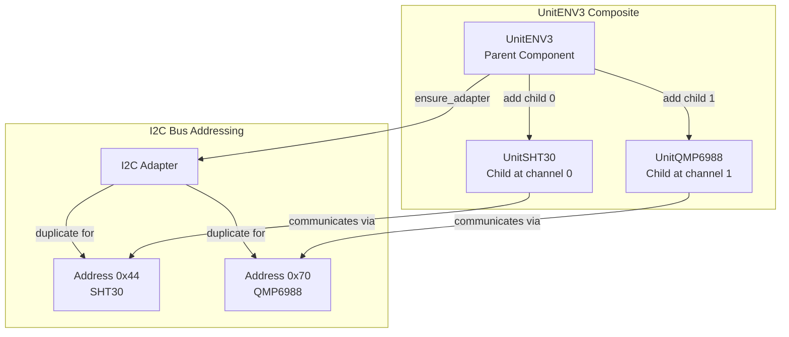
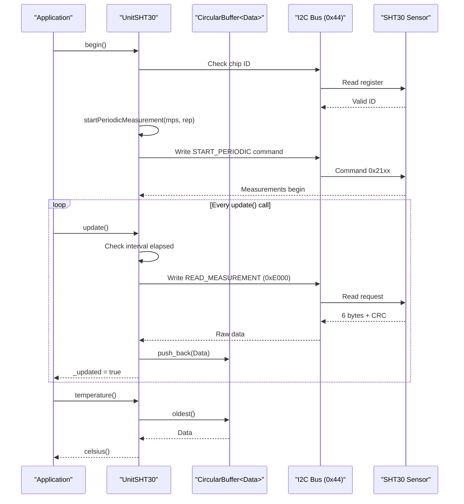

M5Unit-ENV SHT30 (Temperature and Humidity)

# SHT30 (Temperature and Humidity)

<details>
<summary>Relevant source files</summary>

The following files were used as context for generating this wiki page:

- [src/unit/unit_ENV3.cpp](src/unit/unit_ENV3.cpp)
- [src/unit/unit_ENV3.hpp](src/unit/unit_ENV3.hpp)
- [src/unit/unit_QMP6988.cpp](src/unit/unit_QMP6988.cpp)
- [src/unit/unit_QMP6988.hpp](src/unit/unit_QMP6988.hpp)
- [src/unit/unit_SHT30.hpp](src/unit/unit_SHT30.hpp)

</details>


## Purpose and Scope

This page documents the **UnitSHT30** sensor driver, which provides temperature and humidity measurement capabilities using the Sensirion SHT30 digital sensor. The driver supports both periodic and single-shot measurement modes, heater control, status monitoring, and serial number access.

For information about the composite ENV3 unit that integrates SHT30 with QMP6988, see [ENV3 (ENVIII - Composite Unit)](#4.8). For general usage patterns across all sensor units, see [Usage Patterns and Examples](#5).

**Sources:** [src/unit/unit_SHT30.hpp:1-361]()

---

## Class Architecture

The `UnitSHT30` class inherits from `Component` and `PeriodicMeasurementAdapter`, providing both standalone operation and integration with the M5UnitUnified framework.



**Sources:** [src/unit/unit_SHT30.hpp:111-112](), [src/unit/unit_SHT30.hpp:130-139]()

---

## Configuration Structure

The `config_t` structure controls initialization behavior through the `begin()` method. Configuration must be set before calling `begin()`.



| Field | Type | Default | Description |
|-------|------|---------|-------------|
| `start_periodic` | `bool` | `true` | Automatically start periodic measurements in `begin()` |
| `mps` | `sht30::MPS` | `One` | Measurement frequency (0.5, 1, 2, 4, or 10 Hz) |
| `repeatability` | `sht30::Repeatability` | `High` | Accuracy level (High, Medium, Low) |
| `start_heater` | `bool` | `false` | Enable heater on initialization |

**Sources:** [src/unit/unit_SHT30.hpp:119-128](), [src/unit/unit_SHT30.hpp:146-155]()

---

## Measurement Modes

The SHT30 supports two distinct measurement modes that are mutually exclusive. The mode is managed through the `PeriodicMeasurementAdapter` base class.



### Periodic Measurement

Periodic mode continuously acquires measurements at the configured frequency. The `update()` method must be called regularly to poll and buffer new data.

**Key Methods:**

| Method | Parameters | Returns | Description |
|--------|------------|---------|-------------|
| `startPeriodicMeasurement()` | `mps`, `repeatability` | `bool` | Start periodic mode with specified settings |
| `stopPeriodicMeasurement()` | none | `bool` | Stop periodic measurements |
| `update()` | `force=false` | `void` | Poll sensor and buffer new data |
| `temperature()` | none | `float` | Get oldest buffered temperature (°C) |
| `humidity()` | none | `float` | Get oldest buffered humidity (RH%) |

**Sources:** [src/unit/unit_SHT30.hpp:183-202](), [src/unit/unit_SHT30.hpp:158-180]()

### Single-Shot Measurement

Single-shot mode performs one measurement on demand. This mode blocks until the measurement completes and returns data immediately. It cannot be used while periodic measurements are running.

**Key Method:**

```cpp
bool measureSingleshot(sht30::Data& d, 
                       const sht30::Repeatability rep = sht30::Repeatability::High,
                       const bool stretch = true);
```

**Parameters:**
- `d` - Output buffer for measurement data
- `rep` - Repeatability accuracy level (High/Medium/Low)
- `stretch` - Enable I2C clock stretching if `true`

**Important Notes:**
- Returns error if periodic measurements are active
- Requires 1ms minimum wait time between commands
- Clock stretching allows sensor to hold SCL line during conversion

**Sources:** [src/unit/unit_SHT30.hpp:205-218]()

---

## Data Structures

### sht30::Data

The `Data` structure holds raw sensor readings and provides conversion methods to physical units.



**Conversion Methods:**

| Method | Returns | Formula/Range |
|--------|---------|---------------|
| `celsius()` | `float` | Temperature in degrees Celsius |
| `fahrenheit()` | `float` | `celsius() * 9/5 + 32` |
| `humidity()` | `float` | Relative humidity 0-100% RH |
| `temperature()` | `float` | Alias for `celsius()` |

**Sources:** [src/unit/unit_SHT30.hpp:89-103]()

### sht30::Status

The `Status` structure provides bitwise access to the sensor's 16-bit status register. Items marked with (*) are cleared by `clearStatus()`.



**Accessor Methods:**

| Method | Bit | Description | Clearable |
|--------|-----|-------------|-----------|
| `alertPending()` | 15 | Alert pending status | Yes (*) |
| `heater()` | 13 | Heater on/off status | No |
| `trackingAlertRH()` | 11 | Humidity alert triggered | Yes (*) |
| `trackingAlert()` | 10 | Temperature alert triggered | Yes (*) |
| `reset()` | 4 | System reset detected | Yes (*) |
| `command()` | 1 | Last command status | No |
| `checksum()` | 0 | Write data checksum failed | No |

**Sources:** [src/unit/unit_SHT30.hpp:44-87](), [src/unit/unit_SHT30.hpp:262-274]()

---

## Measurement Frequency and Repeatability

### MPS (Measurements Per Second)

The `MPS` enum defines the periodic measurement frequency:

| Enum Value | Frequency | Interval | Use Case |
|------------|-----------|----------|----------|
| `Half` | 0.5 Hz | 2000 ms | Low-power applications |
| `One` | 1 Hz | 1000 ms | General monitoring |
| `Two` | 2 Hz | 500 ms | Responsive monitoring |
| `Four` | 4 Hz | 250 ms | High-frequency logging |
| `Ten` | 10 Hz | 100 ms | Fast response applications |

### Repeatability

The `Repeatability` enum controls measurement accuracy and conversion time:

| Enum Value | Accuracy | Conversion Time | Power Consumption |
|------------|----------|-----------------|-------------------|
| `High` | Best | Longest | Highest |
| `Medium` | Moderate | Moderate | Moderate |
| `Low` | Lowest | Shortest | Lowest |

**Trade-off:** Higher repeatability provides better accuracy at the cost of longer conversion time and higher power consumption.

**Sources:** [src/unit/unit_SHT30.hpp:20-41]()

---

## Heater Control

The SHT30 includes an integrated heater for removing condensation from the sensor surface. The heater can be controlled independently of measurement mode.



**Key Methods:**

| Method | Command | Description |
|--------|---------|-------------|
| `startHeater()` | `0x306D` | Enable integrated heater |
| `stopHeater()` | `0x3066` | Disable integrated heater |

**Use Cases:**
- Remove condensation after exposure to high humidity
- Diagnose sensor operation (temperature should increase)
- Prevent measurement drift in humid environments

**Sources:** [src/unit/unit_SHT30.hpp:247-259](), [src/unit/unit_SHT30.hpp:345-347]()

---

## Status and Diagnostics

### Reading Status

The status register provides real-time sensor diagnostics and alert information.

**Method:**
```cpp
bool readStatus(sht30::Status& s);
```

**Example Status Check:**
```cpp
sht30::Status status;
if (sht30.readStatus(status)) {
    if (status.reset()) {
        // System reset detected - reconfigure if needed
    }
    if (status.heater()) {
        // Heater is currently active
    }
    if (status.checksum()) {
        // CRC error detected in last write
    }
}
```

### Clearing Status

Use `clearStatus()` to reset alert and error flags marked with (*) in the status structure.

**Sources:** [src/unit/unit_SHT30.hpp:261-274](), [src/unit/unit_SHT30.hpp:348-350]()

---

## Serial Number Access

Each SHT30 sensor has a unique 32-bit serial number stored in non-volatile memory. The serial number can be read as a numeric value or formatted string.

**Methods:**

| Method | Output | Description |
|--------|--------|-------------|
| `readSerialNumber(uint32_t&)` | 32-bit value | Read numeric serial number |
| `readSerialNumber(char*)` | String (9 bytes) | Read formatted serial number string |

**Constraints:**
- Cannot be called during periodic measurements
- String buffer must be at least 9 bytes
- Uses clock stretching commands (`0x3780` or `0x3682`)

**Sources:** [src/unit/unit_SHT30.hpp:277-295](), [src/unit/unit_SHT30.hpp:351-353]()

---

## Reset Operations

The SHT30 provides two reset mechanisms with different scopes.



### Soft Reset

**Method:** `bool softReset()`

- Sends command `0x30A2` to the sensor
- Resets system controller and reloads calibration
- Only affects the addressed SHT30 device
- Cannot be used during periodic measurements

### General Reset

**Method:** `bool generalReset()`

- Uses I2C general call mechanism
- Broadcasts reset to all devices on the I2C bus
- **Warning:** Affects all I2C devices that respond to general call

**Sources:** [src/unit/unit_SHT30.hpp:228-245](), [src/unit/unit_SHT30.hpp:343-344]()

---

## Accelerated Response Time (ART) Mode

The ART mode provides faster sensor response at the cost of increased power consumption.

**Method:** `bool writeModeAccelerateResponseTime()`

**Characteristics:**
- Command: `0x2B32`
- Acquisition frequency: 4 Hz (fixed)
- Only available during periodic measurements
- Overrides the configured MPS setting

**Use Case:** Applications requiring faster response to environmental changes while maintaining periodic measurement mode.

**Sources:** [src/unit/unit_SHT30.hpp:220-226](), [src/unit/unit_SHT30.hpp:341]()

---

## I2C Command Reference

The SHT30 uses 16-bit I2C commands. Commands are defined in the `sht30::command` namespace.

### Single-Shot Commands

| Command | Value | Description |
|---------|-------|-------------|
| `SINGLE_SHOT_ENABLE_STRETCH_HIGH` | `0x2C06` | Single-shot, clock stretch, high repeatability |
| `SINGLE_SHOT_ENABLE_STRETCH_MEDIUM` | `0x2C0D` | Single-shot, clock stretch, medium repeatability |
| `SINGLE_SHOT_ENABLE_STRETCH_LOW` | `0x2C10` | Single-shot, clock stretch, low repeatability |
| `SINGLE_SHOT_DISABLE_STRETCH_HIGH` | `0x2400` | Single-shot, no stretch, high repeatability |
| `SINGLE_SHOT_DISABLE_STRETCH_MEDIUM` | `0x240B` | Single-shot, no stretch, medium repeatability |
| `SINGLE_SHOT_DISABLE_STRETCH_LOW` | `0x2416` | Single-shot, no stretch, low repeatability |

### Periodic Measurement Commands

| MPS Rate | High Rep | Medium Rep | Low Rep |
|----------|----------|------------|---------|
| 0.5 Hz | `0x2032` | `0x2024` | `0x202F` |
| 1 Hz | `0x2130` | `0x2126` | `0x212D` |
| 2 Hz | `0x2236` | `0x2220` | `0x222B` |
| 4 Hz | `0x2334` | `0x2322` | `0x2329` |
| 10 Hz | `0x2737` | `0x2721` | `0x272A` |

### Control Commands

| Command | Value | Description |
|---------|-------|-------------|
| `STOP_PERIODIC_MEASUREMENT` | `0x3093` | Stop periodic acquisition |
| `ACCELERATED_RESPONSE_TIME` | `0x2B32` | Enable ART mode (4 Hz) |
| `READ_MEASUREMENT` | `0xE000` | Fetch data in periodic mode |
| `SOFT_RESET` | `0x30A2` | Soft reset command |
| `START_HEATER` | `0x306D` | Enable heater |
| `STOP_HEATER` | `0x3066` | Disable heater |
| `READ_STATUS` | `0xF32D` | Read status register |
| `CLEAR_STATUS` | `0x3041` | Clear status flags |
| `GET_SERIAL_NUMBER_ENABLE_STRETCH` | `0x3780` | Read serial with stretch |
| `GET_SERIAL_NUMBER_DISABLE_STRETCH` | `0x3682` | Read serial without stretch |

**Sources:** [src/unit/unit_SHT30.hpp:309-354]()

---

## Integration with ENV3 Composite Unit

The `UnitSHT30` can be used standalone or as part of the `UnitENV3` composite unit, which combines SHT30 with QMP6988 for comprehensive environmental monitoring.



### Parent-Child Relationship

In the ENV3 composite:
- `UnitENV3` acts as a parent container with no direct I2C communication
- `UnitSHT30` is registered as child component at channel 0
- The parent's `ensure_adapter()` method duplicates the I2C adapter for each child's address
- Each child maintains its own independent operation

**Constructor Implementation:**
```cpp
UnitENV3::UnitENV3(const uint8_t addr) : Component(addr) {
    auto cfg = component_config();
    cfg.max_children = 2;
    component_config(cfg);
    _valid = add(sht30, 0) && add(qmp6988, 1);
}
```

**Sources:** [src/unit/unit_ENV3.hpp:20-49](), [src/unit/unit_ENV3.cpp:23-45]()

---

## Data Flow and Timing



### Update Cycle Timing

- Periodic measurements produce data at the configured MPS rate
- `update()` should be called frequently (faster than MPS interval)
- Data is buffered in `CircularBuffer` (default capacity: 1)
- `temperature()` and `humidity()` return oldest buffered data
- Buffer size can be configured via `stored_size()` before `begin()`

**Sources:** [src/unit/unit_SHT30.hpp:141-142](), [src/unit/unit_SHT30.hpp:130-136]()

---

## I2C Communication Parameters

The `UnitSHT30` configures specific I2C parameters during construction:

| Parameter | Value | Location |
|-----------|-------|----------|
| Default Address | `0x44` | `DEFAULT_ADDRESS` constant |
| Clock Speed | 400 kHz | Set in constructor via `component_config()` |
| Alternative Address | `0x45` | Available if ADDR pin is high |

**Constructor Configuration:**
```cpp
explicit UnitSHT30(const uint8_t addr = DEFAULT_ADDRESS)
    : Component(addr), _data{new m5::container::CircularBuffer<sht30::Data>(1)}
{
    auto ccfg = component_config();
    ccfg.clock = 400 * 1000U;  // 400 kHz
    component_config(ccfg);
}
```

**Sources:** [src/unit/unit_SHT30.hpp:112](), [src/unit/unit_SHT30.hpp:130-136]()