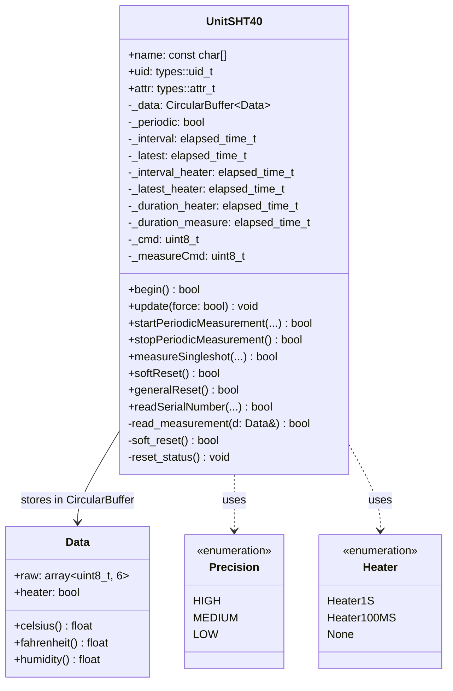
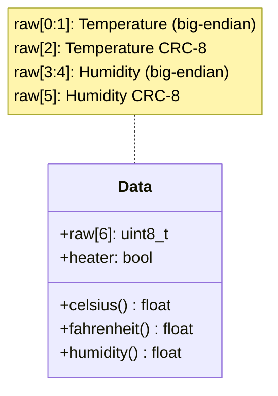
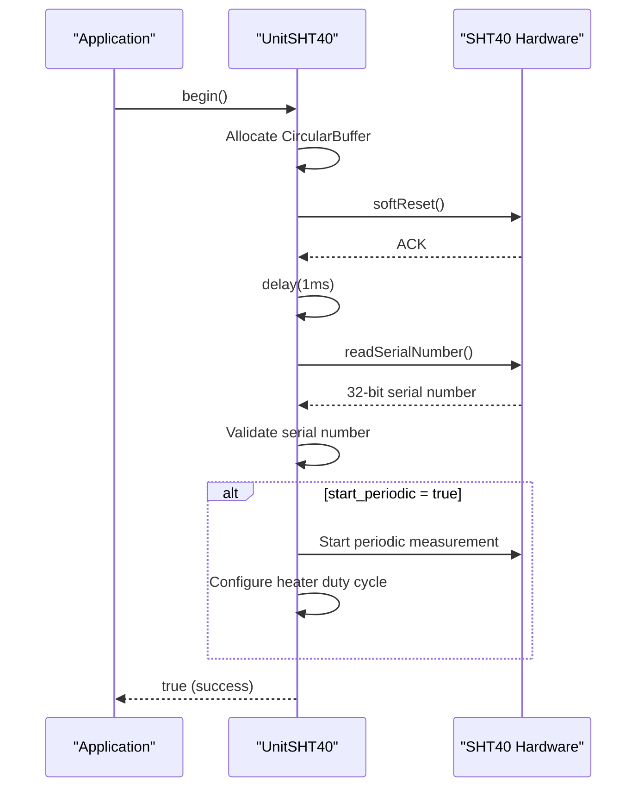
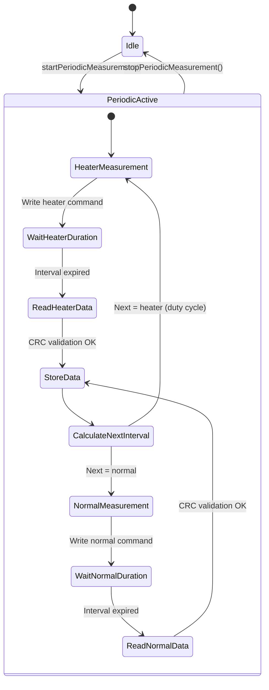
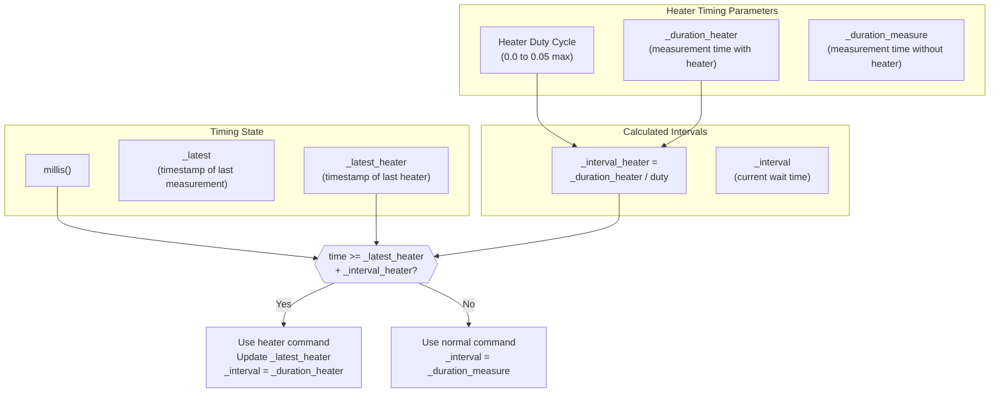
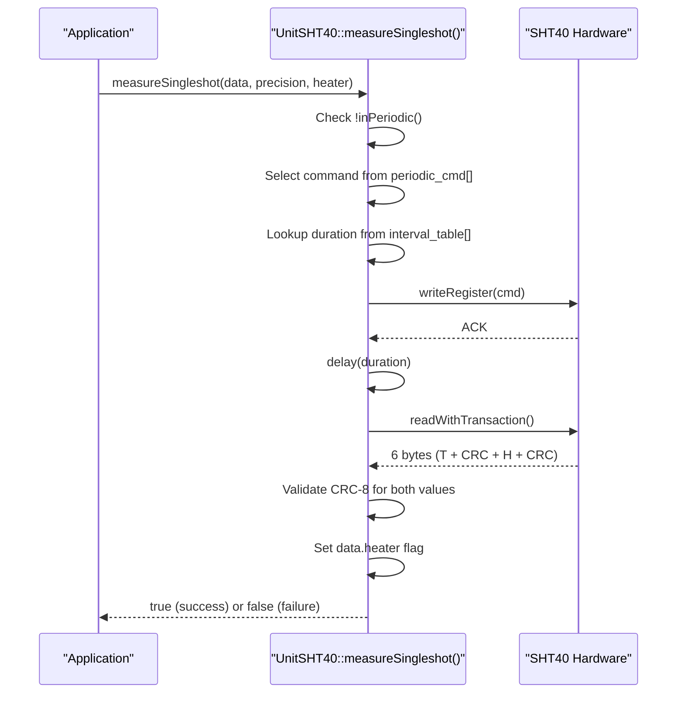
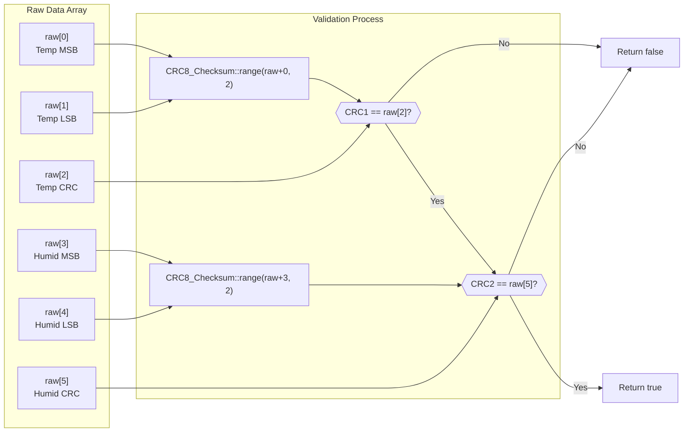
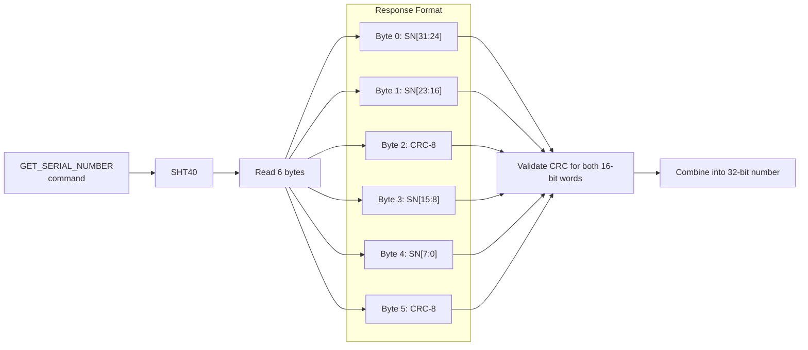
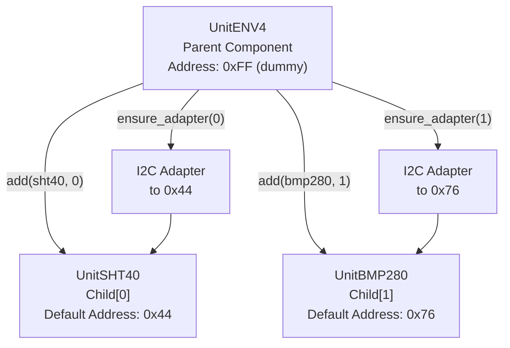

M5Unit-ENV SHT40 (Advanced Temperature/Humidity)

# SHT40 (Advanced Temperature/Humidity)

<details>
<summary>Relevant source files</summary>

The following files were used as context for generating this wiki page:

- [src/unit/unit_ENV4.cpp](src/unit/unit_ENV4.cpp)
- [src/unit/unit_ENV4.hpp](src/unit/unit_ENV4.hpp)
- [src/unit/unit_SGP30.cpp](src/unit/unit_SGP30.cpp)
- [src/unit/unit_SHT40.cpp](src/unit/unit_SHT40.cpp)

</details>


This document describes the `UnitSHT40` driver implementation for the Sensirion SHT40 digital temperature and humidity sensor. The SHT40 provides high-accuracy environmental measurements with integrated heater functionality for condensation removal.

For the composite ENV4 unit that integrates SHT40 with BMP280, see [ENV4 (ENVIV - Composite Unit)](#4.9). For the older SHT30 sensor, see [SHT30 (Temperature and Humidity)](#4.2).

## Hardware Overview

The SHT40 is a digital I2C temperature and humidity sensor offering:
- Temperature measurement range: -40°C to +125°C (±0.2°C accuracy)
- Humidity measurement range: 0% to 100% RH (±1.8% RH accuracy)
- Three precision levels: HIGH, MEDIUM, LOW
- Integrated heater with two pulse durations: 1 second and 100 milliseconds
- CRC-8 checksum validation for data integrity
- 32-bit unique serial number

The driver is implemented in the `m5::unit` namespace with sensor-specific types in `m5::unit::sht40`.

**Sources:** [src/unit/unit_SHT40.cpp:1-297]()

## Class Architecture



**Sources:** [src/unit/unit_SHT40.cpp:72-296](), [src/unit/unit_SHT40.cpp:55-70]()

## Measurement Command Matrix

The SHT40 supports nine measurement command combinations, organized by precision and heater mode:

```mermaid
graph TB
    subgraph "Precision Levels"
        HIGH["HIGH Precision"]
        MEDIUM["MEDIUM Precision"]
        LOW["LOW Precision"]
    end
    
    subgraph "Heater Modes"
        H1S["Heater 1S"]
        H100MS["Heater 100MS"]
        NONE["No Heater"]
    end
    
    subgraph "Command Array periodic_cmd"
        CMD0["MEASURE_HIGH_HEATER_1S<br/>1100ms"]
        CMD1["MEASURE_HIGH_HEATER_100MS<br/>110ms"]
        CMD2["MEASURE_HIGH<br/>9ms"]
        CMD3["MEASURE_MEDIUM_HEATER_1S<br/>1100ms"]
        CMD4["MEASURE_MEDIUM_HEATER_100MS<br/>110ms"]
        CMD5["MEASURE_MEDIUM<br/>5ms"]
        CMD6["MEASURE_LOW_HEATER_1S<br/>1100ms"]
        CMD7["MEASURE_LOW_HEATER_100MS<br/>110ms"]
        CMD8["MEASURE_LOW<br/>2ms"]
    end
    
    HIGH --> CMD0
    HIGH --> CMD1
    HIGH --> CMD2
    MEDIUM --> CMD3
    MEDIUM --> CMD4
    MEDIUM --> CMD5
    LOW --> CMD6
    LOW --> CMD7
    LOW --> CMD8
    
    H1S -.-> CMD0
    H1S -.-> CMD3
    H1S -.-> CMD6
    H100MS -.-> CMD1
    H100MS -.-> CMD4
    H100MS -.-> CMD7
    NONE -.-> CMD2
    NONE -.-> CMD5
    NONE -.-> CMD8
```



The command index is calculated as: `precision_index * 3 + heater_index`. Corresponding measurement durations are stored in the `interval_table[]` array.

**Sources:** [src/unit/unit_SHT40.cpp:21-46](), [src/unit/unit_SHT40.cpp:146-153]()

| Precision | Heater Mode | Command Index | Duration (ms) | Use Case |
|-----------|-------------|---------------|---------------|----------|
| HIGH | 1S | 0 | 1100 | Maximum accuracy + condensation removal |
| HIGH | 100MS | 1 | 110 | High accuracy + quick heater pulse |
| HIGH | None | 2 | 9 | Maximum accuracy, normal operation |
| MEDIUM | 1S | 3 | 1100 | Balanced + condensation removal |
| MEDIUM | 100MS | 4 | 110 | Balanced + quick heater pulse |
| MEDIUM | None | 5 | 5 | Balanced accuracy, normal operation |
| LOW | 1S | 6 | 1100 | Fast measurement + condensation removal |
| LOW | 100MS | 7 | 110 | Fast + quick heater pulse |
| LOW | None | 8 | 2 | Fastest measurement |

**Sources:** [src/unit/unit_SHT40.cpp:21-46]()

## Data Structures and Conversion

### sht40::Data Structure

The `Data` class encapsulates raw sensor readings and provides conversion methods:



**Conversion Algorithms:**

- **Temperature (Celsius):** `celsius = -45 + 175 * raw_temp / 65535`
- **Temperature (Fahrenheit):** `fahrenheit = -49 + 315 * raw_temp / 65535`
- **Humidity (%):** `humidity = -6 + 125 * raw_humidity / 65535`

The `heater` boolean flag indicates whether the measurement was taken with heater activation.

**Sources:** [src/unit/unit_SHT40.cpp:55-70]()

## Initialization Sequence



The `begin()` method performs the following steps:

1. **Buffer Allocation**: Creates `CircularBuffer<Data>` sized to `stored_size()` configuration
2. **Soft Reset**: Issues `SOFT_RESET` command and waits 1ms for sensor to enter idle state
3. **Serial Number Validation**: Reads and validates 32-bit unique serial number
4. **Optional Auto-start**: If `_cfg.start_periodic` is true, initiates periodic measurement with configured precision, heater mode, and duty cycle

**Sources:** [src/unit/unit_SHT40.cpp:76-100]()

## Periodic Measurement State Machine

The periodic measurement mode implements a sophisticated state machine with heater duty cycle management:



### Update Cycle Logic

The `update()` method is called repeatedly in the application loop:

1. **Timing Check**: Compares current time against `_latest + _interval`
2. **Data Read**: If interval expired, calls `read_measurement()`
3. **CRC Validation**: Validates both temperature and humidity checksums
4. **Data Storage**: Pushes validated `Data` object to `CircularBuffer`
5. **Next Command Selection**:
   - If heater interval expired: Use `_cmd` (heater command), set `_interval = _duration_heater`
   - Otherwise: Use `_measureCmd` (normal command), set `_interval = _duration_measure`
6. **Command Write**: Sends selected command to sensor to trigger next measurement

**Sources:** [src/unit/unit_SHT40.cpp:102-132](), [src/unit/unit_SHT40.cpp:116-128]()

## Heater Duty Cycle Management

The heater duty cycle controls how frequently heater measurements occur relative to normal measurements:



**Key Constraints:**

- **Maximum Duty Cycle**: 5% (`MAX_HEATER_DUTY = 0.05`)
- **Duty Cycle Formula**: `heater_interval = heater_duration / duty`
- **Example**: With 5% duty and 1100ms heater duration: heater activates every 22 seconds

The heater is used to remove condensation from the sensor surface, improving accuracy in high-humidity environments.

**Sources:** [src/unit/unit_SHT40.cpp:48-49](), [src/unit/unit_SHT40.cpp:134-163](), [src/unit/unit_SHT40.cpp:113-128]()

## Single-shot Measurement

For applications that don't require continuous monitoring, single-shot measurement provides on-demand readings:



**Important**: Single-shot measurements cannot be performed while periodic mode is active. The function returns `false` if `inPeriodic()` returns `true`.

**Sources:** [src/unit/unit_SHT40.cpp:182-199]()

## CRC-8 Validation

All sensor readings are protected with CRC-8 checksums:



The `read_measurement()` function validates both checksums before accepting data. Failed CRC checks result in the measurement being discarded.

**Sources:** [src/unit/unit_SHT40.cpp:201-213]()

## Reset Operations

### Soft Reset

Resets the sensor without power cycling:

```cpp
bool softReset()  // Public API - checks periodic mode
bool soft_reset() // Internal - always executes
```

- Issues `SOFT_RESET` command
- Waits 1ms for sensor to enter idle state
- Calls `reset_status()` to clear internal state
- **Restriction**: Cannot be called while in periodic mode (public API)

### General Reset

Performs I2C general call reset affecting all devices on the bus:

- Sends general call command `0x06`
- Does not return ACK (this is expected behavior)
- Waits 1ms and calls `reset_status()`

**Sources:** [src/unit/unit_SHT40.cpp:215-246]()

## Serial Number Reading

The SHT40 provides a unique 32-bit serial number for device identification:



Two overloads are provided:
- `readSerialNumber(uint32_t& serialNumber)`: Returns numeric value
- `readSerialNumber(char* serialNumber)`: Returns 8-character hex string

**Sources:** [src/unit/unit_SHT40.cpp:248-285]()

## Integration with ENV4 Composite Unit

The SHT40 is used as a child component in the ENV4 composite unit:



The ENV4 unit forms a parent-child relationship, setting `max_children = 2` and adding both SHT40 and BMP280 instances during construction. Each child receives its own I2C adapter through the `ensure_adapter()` mechanism.

**Sources:** [src/unit/unit_ENV4.cpp:23-30](), [src/unit/unit_ENV4.hpp:21-50]()

## Configuration Structure

While the configuration structure isn't shown in the provided files, based on the `begin()` implementation, the `_cfg` structure includes:

- `start_periodic`: Boolean to auto-start periodic measurement
- `precision`: Default precision level (HIGH/MEDIUM/LOW)
- `heater`: Default heater mode (1S/100MS/None)
- `heater_duty`: Heater duty cycle (0.0 to 0.05)

These values are used when `begin()` automatically starts periodic measurement.

**Sources:** [src/unit/unit_SHT40.cpp:99]()

## Common Usage Patterns

### Pattern 1: Continuous Monitoring with Heater

```cpp
// In setup()
sht40.startPeriodicMeasurement(
    sht40::Precision::HIGH,      // Maximum accuracy
    sht40::Heater::Heater100MS,  // Short heater pulse
    0.02f                         // 2% duty cycle
);

// In loop()
sht40.update();
if (sht40.updated()) {
    auto data = sht40.oldest();
    float temp = data.celsius();
    float humid = data.humidity();
    bool was_heated = data.heater;
}
```

### Pattern 2: On-Demand Measurements

```cpp
sht40::Data measurement;
if (sht40.measureSingleshot(
        measurement,
        sht40::Precision::MEDIUM,
        sht40::Heater::None)) {
    float temp = measurement.fahrenheit();
    float humid = measurement.humidity();
}
```

### Pattern 3: Periodic Measurement Control

```cpp
// Start
sht40.startPeriodicMeasurement(
    sht40::Precision::LOW,
    sht40::Heater::None,
    0.05f  // Not used when heater is None
);

// Stop when needed
sht40.stopPeriodicMeasurement();

// Can now do single-shot or reconfigure
```

**Sources:** [src/unit/unit_SHT40.cpp:134-199]()