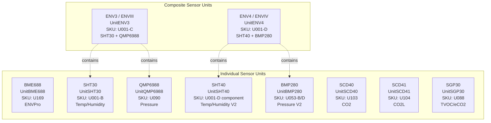
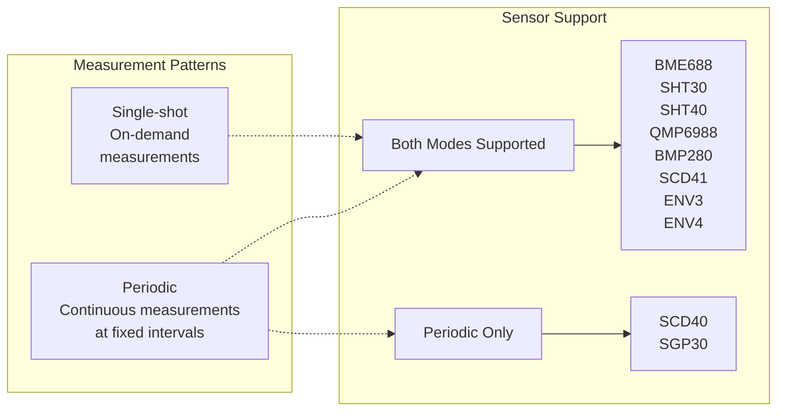
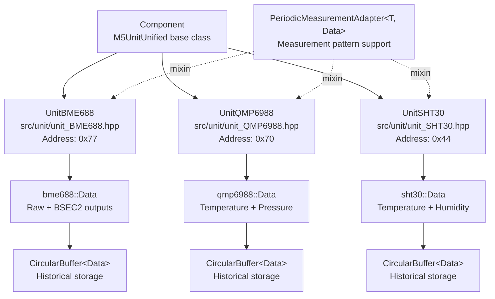
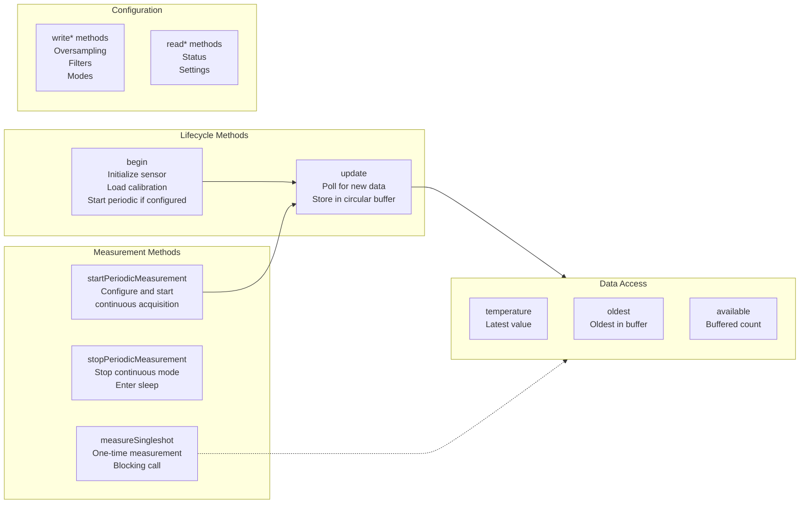
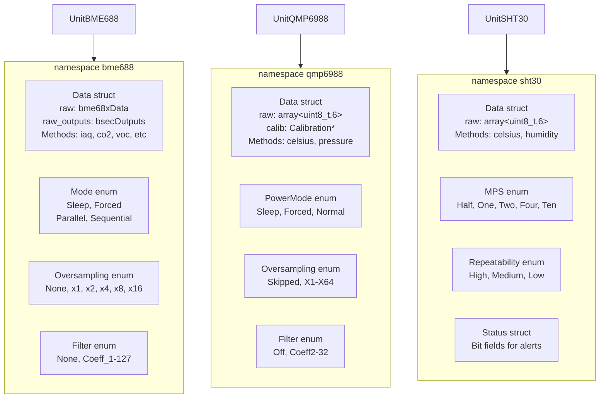
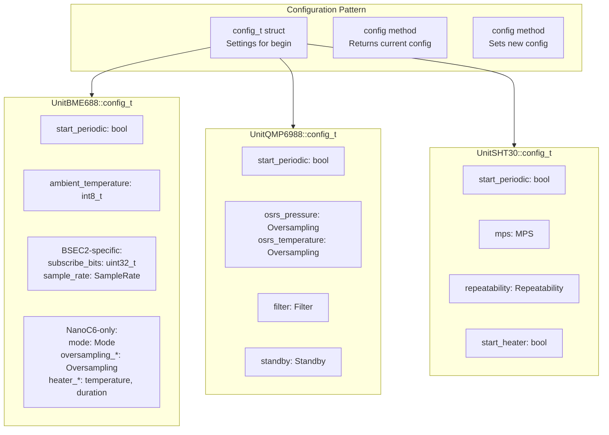
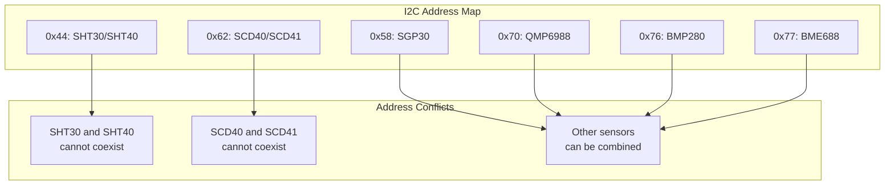

M5Unit-ENV Sensor Units Reference

# Sensor Units Reference

Relevant source files

The following files were used as context for generating this wiki page:

- [README.md](README.md)
- [library.json](library.json)
- [library.properties](library.properties)
- [src/unit/unit_BME688.cpp](src/unit/unit_BME688.cpp)
- [src/unit/unit_BME688.hpp](src/unit/unit_BME688.hpp)
- [src/unit/unit_QMP6988.cpp](src/unit/unit_QMP6988.cpp)
- [src/unit/unit_QMP6988.hpp](src/unit/unit_QMP6988.hpp)
- [src/unit/unit_SHT30.hpp](src/unit/unit_SHT30.hpp)

This page provides an overview of all environmental sensor units supported by the M5Unit-ENV library. It categorizes sensors by function, documents SKU-to-unit mappings, and presents capability matrices to help users select appropriate sensors for their applications. For detailed API documentation and usage patterns for specific sensors, see the individual sensor pages ([4.1](#4.1)-[4.10](#4.10)).

## Sensor Categories and SKU Mappings

The M5Unit-ENV library supports three categories of sensor units: individual environmental sensors, composite units that combine multiple sensors, and specialized air quality sensors. Each physical M5Stack unit has an associated SKU identifier.

**Sources:** [README.md:5-27](), [README.md:47-68]()

### Individual Sensor Units

| Unit Name | Class Name | SKU | I2C Address | Measurements |
|-----------|-----------|-----|-------------|--------------|
| ENVPro | `UnitBME688` | U169 | 0x77 | Temperature, Pressure, Humidity, Gas Resistance, IAQ (with BSEC2) |
| Temp/Humidity | `UnitSHT30` | U001-B | 0x44 | Temperature, Humidity |
| Temp/Humidity V2 | `UnitSHT40` | U001-D (component) | 0x44 | Temperature, Humidity, Heater |
| Pressure | `UnitQMP6988` | U090 | 0x70 | Temperature, Pressure |
| Pressure V2 | `UnitBMP280` | U053-B, U053-D | 0x76 | Temperature, Pressure |
| CO2 | `UnitSCD40` | U103 | 0x62 | CO2, Temperature, Humidity |
| CO2L | `UnitSCD41` | U104 | 0x62 | CO2, Temperature, Humidity, Single-shot |
| TVOC/eCO2 | `UnitSGP30` | U088 | 0x58 | TVOC, eCO2, Baseline Management |

**Sources:** [README.md:5-28](), [README.md:47-63](), [src/unit/unit_BME688.hpp:378](), [src/unit/unit_QMP6988.hpp:132](), [src/unit/unit_SHT30.hpp:112]()

### Composite Sensor Units

| Unit Name | Class Name | SKU | Components | Measurements |
|-----------|-----------|-----|------------|--------------|
| ENV3 (ENVIII) | `UnitENV3` | U001-C | SHT30 + QMP6988 | Temperature (dual), Humidity, Pressure |
| ENV4 (ENVIV) | `UnitENV4` | U001-D | SHT40 + BMP280 | Temperature (dual), Humidity, Pressure, Heater |

Composite units provide a unified interface to multiple physical sensors, managing their lifecycles and I2C communication internally.

**Sources:** [README.md:9-13](), [README.md:19-20]()

## Sensor Capability Matrix

The following table summarizes the measurement capabilities and key features of each sensor unit:

| Unit | Temp | Humidity | Pressure | CO2 | Gas/VOC | IAQ | Single-shot | Periodic | Heater | Special Features |
|------|------|----------|----------|-----|---------|-----|-------------|----------|--------|------------------|
| **BME688** | ✓ | ✓ | ✓ | via BSEC2 | ✓ | ✓ | ✓ | ✓ | ✓ | BSEC2 integration, 4 measurement modes |
| **SHT30** | ✓ | ✓ | - | - | - | - | ✓ | ✓ | ✓ | 5 MPS settings, 3 repeatability levels |
| **SHT40** | ✓ | ✓ | - | - | - | - | ✓ | ✓ | ✓ | Heater duty cycles, ART mode |
| **QMP6988** | ✓ | - | ✓ | - | - | - | ✓ | ✓ | - | 5 use case presets, IIR filter |
| **BMP280** | ✓ | - | ✓ | - | - | - | ✓ | ✓ | - | 6 use case presets, 3 power modes |
| **SCD40** | ✓ | ✓ | - | ✓ | - | - | - | ✓ | - | Auto self-calibration, altitude compensation |
| **SCD41** | ✓ | ✓ | - | ✓ | - | - | ✓ | ✓ | - | Power management, low power mode |
| **SGP30** | - | - | - | eCO2 | ✓ | - | - | ✓ | - | Baseline persistence, 15s warmup |
| **ENV3** | ✓✓ | ✓ | ✓ | - | - | - | ✓ | ✓ | ✓ | Dual temperature sources |
| **ENV4** | ✓✓ | ✓ | ✓ | - | - | - | ✓ | ✓ | ✓ | Dual temperature sources, improved accuracy |

**Legend:**
- ✓ = Feature available
- ✓✓ = Dual sources (composite units provide temperature from both component sensors)
- \- = Not available
- "via BSEC2" = Feature requires BSEC2 library (not available on NanoC6)

**Sources:** Diagram 3 from High-Level System Architecture, [src/unit/unit_BME688.hpp:377-428](), [src/unit/unit_QMP6988.hpp:131-150](), [src/unit/unit_SHT30.hpp:111-128]()

## Measurement Mode Support

Different sensors support different measurement patterns. Understanding these patterns is crucial for application design:

**Key Distinctions:**
- **SCD40**: Continuous measurement only, no single-shot capability
- **SCD41**: Enhanced version with single-shot and power-down modes
- **SGP30**: Requires 15-second initialization, continuous operation only
- **BME688**: Supports 4 modes (Sleep, Forced, Parallel, Sequential) with BSEC2 integration

**Sources:** [src/unit/unit_BME688.hpp:46-52](), Diagram 3 from High-Level System Architecture

## Class Hierarchy and Interfaces

The sensor units follow a consistent class hierarchy pattern using the M5UnitUnified framework:

**Sources:** [src/unit/unit_BME688.hpp:377](), [src/unit/unit_QMP6988.hpp:131](), [src/unit/unit_SHT30.hpp:111]()

### Common Interface Pattern

All sensor unit classes implement a consistent interface pattern:

**Common Methods Across All Sensors:**
- `begin()`: Initialize hardware, read calibration, optionally start periodic measurement
- `update(force)`: Poll sensor and update internal buffer (called in `loop()`)
- `startPeriodicMeasurement(...)`: Begin continuous acquisition with specified parameters
- `stopPeriodicMeasurement()`: Stop periodic mode and enter low-power state
- `measureSingleshot(data)`: Blocking single measurement (if supported)
- `temperature()`, `pressure()`, `humidity()`, etc.: Access latest measurements
- `oldest()`, `available()`, `empty()`: Buffer management methods

**Sources:** [src/unit/unit_BME688.hpp:449-450](), [src/unit/unit_QMP6988.hpp:163-164](), [src/unit/unit_SHT30.hpp:141-142]()

## Data Structure Organization

Each sensor unit defines a namespace containing its specific data types and enumerations:

**Data Structure Patterns:**
- Each sensor has a `Data` struct in its namespace (e.g., `bme688::Data`, `qmp6988::Data`)
- Raw sensor readings are stored in `raw` member variables
- Convenience methods convert raw data to physical units
- Sensor-specific enums for configuration (Oversampling, Filter, Mode, etc.)
- Calibration data is either embedded or referenced by pointer

**Sources:** [src/unit/unit_BME688.hpp:256-367](), [src/unit/unit_QMP6988.hpp:20-124](), [src/unit/unit_SHT30.hpp:20-104]()

## Configuration Structures

All sensor units provide a `config_t` structure for initialization settings:

**Common Configuration Pattern:**
1. Create unit instance: `UnitBME688 unit;`
2. Obtain config: `auto cfg = unit.config();`
3. Modify settings: `cfg.start_periodic = false;`
4. Apply config: `unit.config(cfg);`
5. Initialize: `unit.begin();`

**Sources:** [src/unit/unit_BME688.hpp:385-428](), [src/unit/unit_QMP6988.hpp:139-150](), [src/unit/unit_SHT30.hpp:119-128]()

## Sensor-Specific Considerations

### Platform-Specific Features

The BME688 sensor has platform-dependent functionality:

| Feature | ESP32/S3/C3 | NanoC6 |
|---------|-------------|--------|
| BSEC2 Library | ✓ Available | ✗ Excluded |
| IAQ Calculation | ✓ Via BSEC2 | ✗ Not available |
| CO2eq/VOC Estimation | ✓ Via BSEC2 | ✗ Not available |
| Raw Measurements | ✓ Always | ✓ Always |
| Configuration Sets | BSEC2 config | Manual TPH/heater config |

The conditional compilation is controlled by `UNIT_BME688_USING_BSEC2` macro.

**Sources:** [src/unit/unit_BME688.hpp:22-31](), [src/unit/unit_BME688.cpp:11-16](), [library.json:16]()

### I2C Address Constraints

Sensor units have fixed I2C addresses that affect multi-sensor configurations:

Composite units (ENV3, ENV4) internally manage their component sensors' I2C addresses.

**Sources:** [src/unit/unit_BME688.hpp:378](), [src/unit/unit_QMP6988.hpp:132](), [src/unit/unit_SHT30.hpp:112]()

## Related Documentation

For detailed information about specific sensors:
- BME688 (ENVPro Unit): See [4.1](#4.1)
- SHT30 (Temperature and Humidity): See [4.2](#4.2)
- QMP6988 (Barometric Pressure): See [4.3](#4.3)
- SCD40 and SCD41 (CO2 Sensors): See [4.4](#4.4)
- BMP280 (Pressure and Temperature): See [4.5](#4.5)
- SHT40 (Advanced Temperature/Humidity): See [4.6](#4.6)
- SGP30 (TVOC and eCO2): See [4.7](#4.7)
- ENV3 (ENVIII - Composite Unit): See [4.8](#4.8)
- ENV4 (ENVIV - Composite Unit): See [4.9](#4.9)
- Legacy Sensor Interfaces: See [4.10](#4.10)

For architectural context:
- Architecture Overview: See [3](#3)
- Usage Patterns and Examples: See [5](#5)

**Sources:** Table of contents JSON structure