M5Unit-ENV Supported Boards and Platforms

# Supported Boards and Platforms

Relevant source files

The following files were used as context for generating this wiki page:

- [.github/workflows/arduino-esp-v2-build-check.yml](.github/workflows/arduino-esp-v2-build-check.yml)
- [.github/workflows/arduino-esp-v3-build-check.yml](.github/workflows/arduino-esp-v3-build-check.yml)
- [.github/workflows/arduino-m5-build-check.yml](.github/workflows/arduino-m5-build-check.yml)
- [platformio.ini](platformio.ini)
- [src/M5UnitUnifiedENV.hpp](src/M5UnitUnifiedENV.hpp)
- [unit_co2_env.ini](unit_co2_env.ini)

This page documents the comprehensive list of M5Stack boards and ESP32 platform versions supported by the M5Unit-ENV library. It covers board configurations in both PlatformIO and Arduino ecosystems, platform version compatibility, and platform-specific limitations (particularly BSEC2 exclusion from NanoC6).

For detailed PlatformIO environment configuration, see [PlatformIO Configuration](#6.1). For Arduino-specific setup, see [Arduino IDE Integration](#6.3).

## Overview

The library supports **14 distinct M5Stack board configurations** across multiple product lines (Core, Atom, Stick, Stamp series) and validates builds against **three major platform variants**:

- **ESP32 v3** (arduino-esp32:esp32@3.0.4): 18 boards
- **ESP32 v2** (arduino-esp32:esp32@2.0.17): 7 boards  
- **M5Stack** (m5stack:esp32@3.2.1): 19 boards (includes AtomS3R, DinMeter)

The library also supports PlatformIO with ESP32 platform versions ranging from 4.4.0 to 6.8.1, providing broad compatibility across hardware generations and framework versions.

## Board Categories and Configurations

### Core Series Boards

The flagship M5Stack devices with full-featured ESP32 modules and integrated displays.

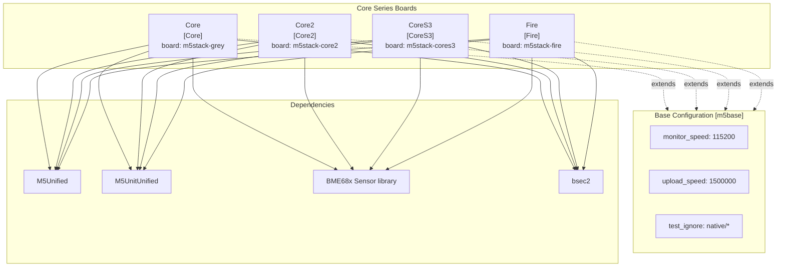

**Board Configurations:**

| Board Name | PlatformIO Section | Board ID | BSEC2 Support |
|------------|-------------------|----------|---------------|
| Core | `[Core]` | `m5stack-grey` | ✓ |
| Core2 | `[Core2]` | `m5stack-core2` | ✓ |
| CoreS3 | `[CoreS3]` | `m5stack-cores3` | ✓ |
| Fire | `[Fire]` | `m5stack-fire` | ✓ |

**Sources:** [platformio.ini:28-53]()

### Atom Series Boards

Compact ESP32 modules designed for space-constrained applications.

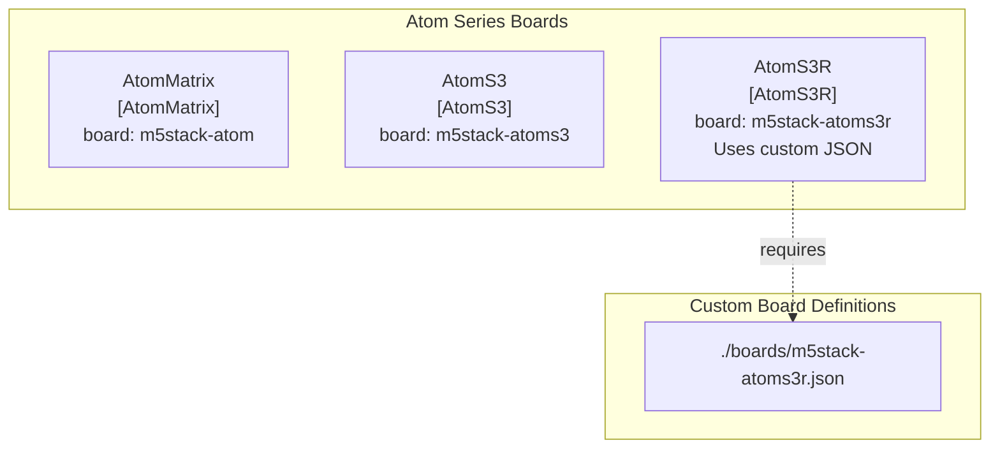

**Board Configurations:**

| Board Name | PlatformIO Section | Board ID | BSEC2 Support | Notes |
|------------|-------------------|----------|---------------|-------|
| AtomMatrix | `[AtomMatrix]` | `m5stack-atom` | ✓ | |
| AtomS3 | `[AtomS3]` | `m5stack-atoms3` | ✓ | |
| AtomS3R | `[AtomS3R]` | `m5stack-atoms3r` | ✓ | Custom board JSON |

**Sources:** [platformio.ini:69-86]()

### Stick Series Boards

Portable handheld devices with integrated batteries.

| Board Name | PlatformIO Section | Board ID | BSEC2 Support |
|------------|-------------------|----------|---------------|
| StickCPlus | `[StickCPlus]` | `m5stick-c` | ✓ |
| StickCPlus2 | `[StickCPlus2]` | `m5stick-cplus2` | ✓ |

**Sources:** [platformio.ini:99-110]()

### Stamp Series Boards

Low-profile ESP32 modules for embedded integration, including specialized display variants.

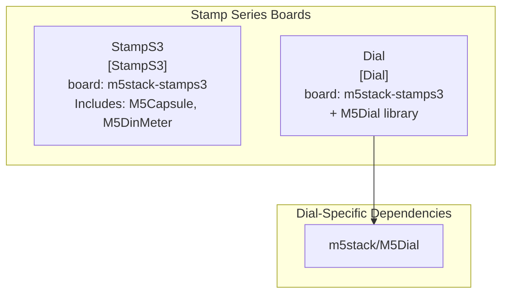

**Board Configurations:**

| Board Name | PlatformIO Section | Board ID | BSEC2 Support | Additional Dependencies |
|------------|-------------------|----------|---------------|------------------------|
| StampS3 | `[StampS3]` | `m5stack-stamps3` | ✓ | Includes Capsule, DinMeter |
| Dial | `[Dial]` | `m5stack-stamps3` | ✓ | `m5stack/M5Dial` |

**Sources:** [platformio.ini:55-67]()

### E-Paper Display Boards

Specialized boards with e-paper displays for low-power applications.

| Board Name | PlatformIO Section | Board ID | BSEC2 Support |
|------------|-------------------|----------|---------------|
| Paper | `[Paper]` | `m5stack-fire` | ✓ |
| CoreInk | `[CoreInk]` | `m5stack-coreink` | ✓ |

**Sources:** [platformio.ini:112-122]()

### ESP32-C6 Board (NanoC6)

The NanoC6 represents a special case with platform-specific limitations.

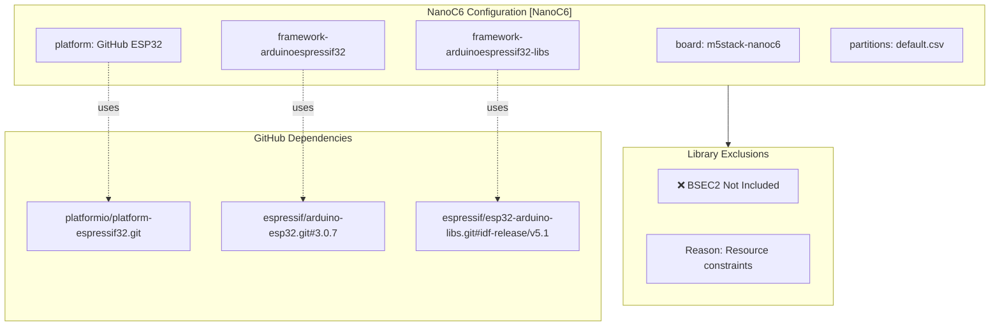

**NanoC6 Configuration:**

| Property | Value |
|----------|-------|
| PlatformIO Section | `[NanoC6]` |
| Board ID | `m5stack-nanoc6` |
| Platform Source | GitHub: `platformio/platform-espressif32.git` |
| Framework | GitHub: `espressif/arduino-esp32.git#3.0.7` |
| Framework Libs | GitHub: `espressif/esp32-arduino-libs.git#idf-release/v5.1` |
| Partitions | `default.csv` |
| BSEC2 Support | ❌ **Not Supported** |
| Base Dependencies | M5Unified, M5UnitUnified, BME68x Sensor library |

**Important:** NanoC6 explicitly excludes the BSEC2 library due to resource constraints on the ESP32-C6 chip. This means **UnitENVPro (BME688) IAQ features are not available** on this platform. Basic sensor readings (temperature, humidity, pressure, raw gas resistance) remain functional.

**Sources:** [platformio.ini:88-97]()

## Platform Version Matrix

### PlatformIO Platform Versions

The library defines multiple platform version configurations for testing and compatibility validation.

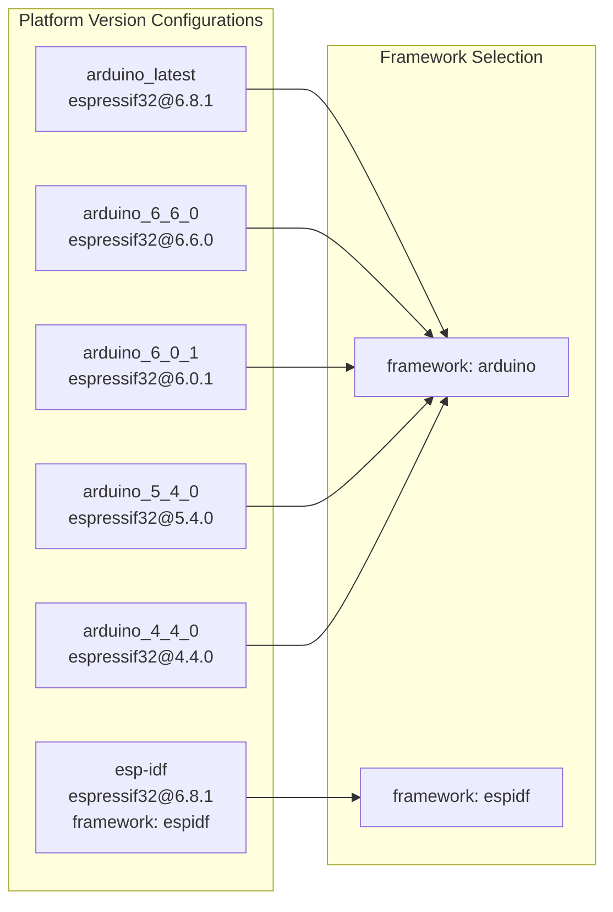

**Platform Version Reference:**

| Configuration Name | Platform Version | Framework | Usage |
|-------------------|------------------|-----------|-------|
| `[arduino_latest]` | `espressif32@6.8.1` | arduino | Latest stable release |
| `[arduino_6_6_0]` | `espressif32@6.6.0` | arduino | Specific version testing |
| `[arduino_6_0_1]` | `espressif32@6.0.1` | arduino | Compatibility testing |
| `[arduino_5_4_0]` | `espressif32@5.4.0` | arduino | Legacy support |
| `[arduino_4_4_0]` | `espressif32@4.4.0` | arduino | Minimum version |
| `[esp-idf]` | `espressif32@6.8.1` | espidf | ESP-IDF native framework |

**Sources:** [platformio.ini:137-164]()

### Arduino CI Platform Matrix

The CI/CD pipeline validates builds across three Arduino platform variants with different board sets.

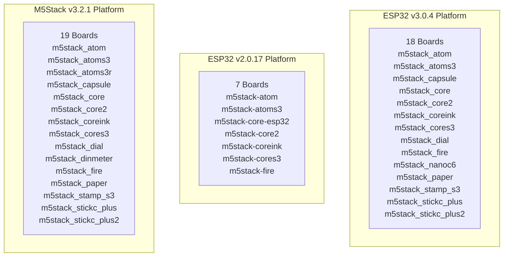

**Arduino Platform Comparison:**

| Platform Variant | Version | Board Count | Unique Boards | Board ID Format |
|-----------------|---------|-------------|---------------|-----------------|
| ESP32 v3 | 3.0.4 | 18 | nanoc6 | `m5stack_*` (underscore) |
| ESP32 v2 | 2.0.17 | 7 | Legacy naming | `m5stack-*` (hyphen) |
| M5Stack | 3.2.1 | 19 | atoms3r, dinmeter | `m5stack_*` (underscore) |

**Note:** Board ID naming conventions differ between platforms:
- **ESP32 v3 and M5Stack:** Use underscores (`m5stack_atom`)
- **ESP32 v2:** Use hyphens (`m5stack-atom`)

**Sources:** [.github/workflows/arduino-esp-v3-build-check.yml:71-95](), [.github/workflows/arduino-esp-v2-build-check.yml:71-78](), [.github/workflows/arduino-m5-build-check.yml:71-96]()

## Board Configuration Details

### Base Configuration Inheritance

All boards inherit from the `[m5base]` configuration, which defines common serial and upload parameters.

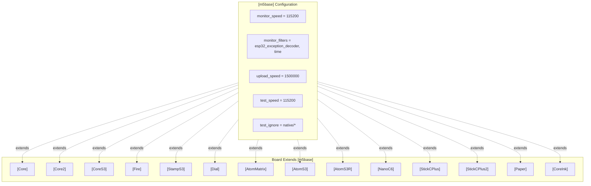

**Sources:** [platformio.ini:21-26]()

### Library Dependencies by Board

Most boards share identical library dependencies, with NanoC6 as the notable exception.

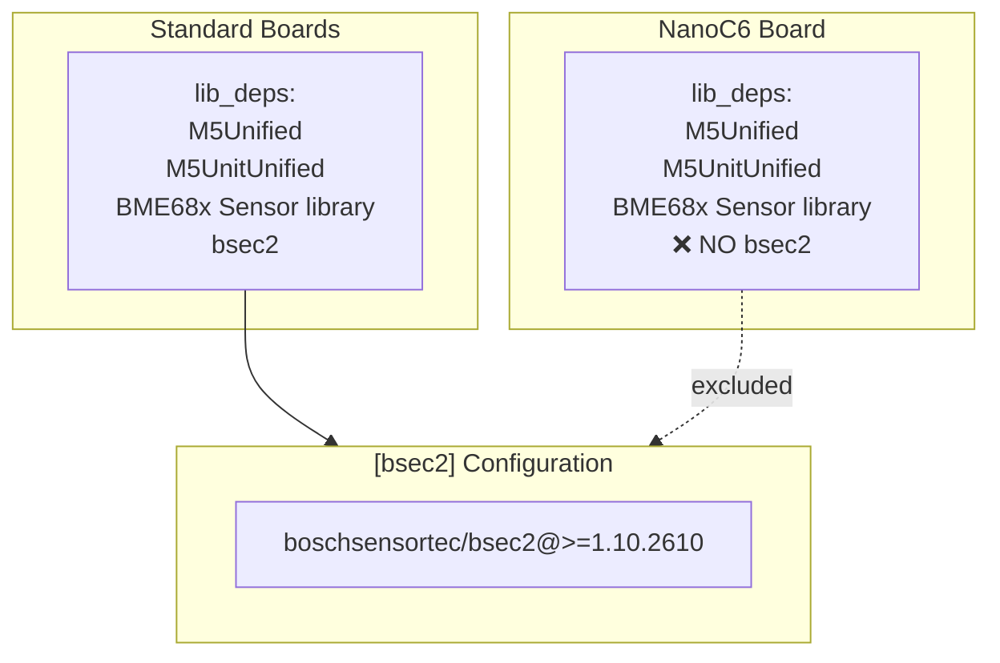

**Sources:** [platformio.ini:8-19](), [platformio.ini:97]()

## Build Options and Test Configuration

### Build Type Options

The library provides three build option configurations for different development needs.

| Option Name | Build Type | Debug Levels | Defines | Use Case |
|-------------|-----------|--------------|---------|----------|
| `[option_release]` | release | 3 | `CORE_DEBUG_LEVEL=3` `LOG_LOCAL_LEVEL=3` `APP_LOG_LEVEL=3` `M5_LOG_LEVEL=3` | Production builds |
| `[option_log]` | release | 5 | `CORE_DEBUG_LEVEL=5` `LOG_LOCAL_LEVEL=5` `APP_LOG_LEVEL=5` | Debugging with optimizations |
| `[option_debug]` | debug | 5 | `CORE_DEBUG_LEVEL=5` `LOG_LOCAL_LEVEL=5` `APP_LOG_LEVEL=5` `DEBUG` | Full debugging |

**Sources:** [platformio.ini:167-189]()

### Test Framework Configuration

Embedded tests use GoogleTest framework with specific version requirements.

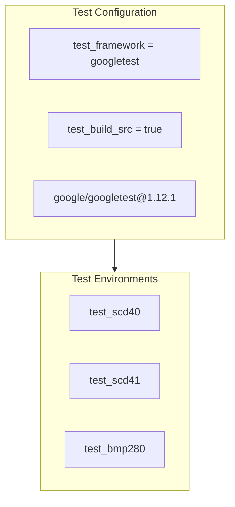

**Test Environment Pattern:**
- Environment name format: `test_{SENSOR}_{BOARD}`
- Example: `[env:test_SCD40_Core]`
- All 14 boards tested for SCD40 and SCD41 sensors
- Uses `arduino_latest` platform (espressif32@6.8.1)

**Sources:** [platformio.ini:11-12](), [platformio.ini:201-202](), [unit_co2_env.ini:5-88]()

## Platform-Specific Considerations

### BSEC2 Library Exclusion

The Bosch BSEC2 library for advanced air quality metrics (IAQ, CO2eq, VOC) is excluded from the NanoC6 platform due to resource constraints of the ESP32-C6 chip.

**Impact:**
- **UnitENVPro (BME688)** functionality limited to basic readings on NanoC6
- Temperature, humidity, pressure, and raw gas resistance remain available
- IAQ algorithm, CO2 equivalent, and VOC index calculations unavailable

**Configuration Mapping:**

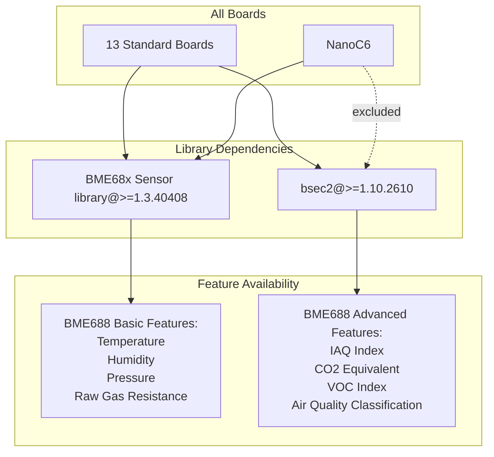

**Sources:** [platformio.ini:89-97](), [platformio.ini:18-19]()

### Custom Board JSON Definitions

Some boards require custom JSON definitions stored in the `./boards/` directory.

| Board | Custom JSON File | Reason |
|-------|-----------------|--------|
| AtomS3R | `./boards/m5stack-atoms3r.json` | Board variant not in standard platform |
| NanoC6 | `./boards/m5stack-nanoc6.json` | ESP32-C6 support, custom configuration |
| StickCPlus2 | `./boards/m5stick-cplus2.json` | New board variant |

**Sources:** [platformio.ini:82-86](), [platformio.ini:88-97](), [platformio.ini:106-110]()

## Board Selection Guide

### By Sensor Unit Support

All boards support all sensor units **except** NanoC6's limitation with BME688 advanced features.

| Sensor Unit | All Boards | NanoC6 Special Case |
|-------------|-----------|---------------------|
| UnitCO2 (SCD40) | ✓ Full support | ✓ Full support |
| UnitCO2L (SCD41) | ✓ Full support | ✓ Full support |
| UnitENVIII (ENV3) | ✓ Full support | ✓ Full support |
| UnitENVIV (ENV4) | ✓ Full support | ✓ Full support |
| UnitTVOC (SGP30) | ✓ Full support | ✓ Full support |
| UnitENVPro (BME688) | ✓ Full support | ⚠️ Basic only (no IAQ) |

### By CI Validation Coverage

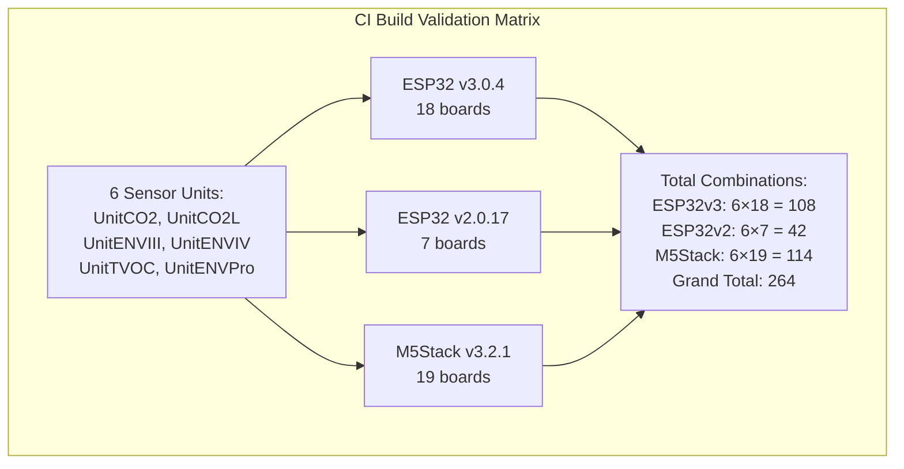

**Highest Coverage Boards (validated across all 3 platforms):**
- m5stack_atom / m5stack-atom
- m5stack_atoms3 / m5stack-atoms3
- m5stack_core / m5stack-core-esp32
- m5stack_core2
- m5stack_coreink
- m5stack_cores3
- m5stack_fire

**Platform-Exclusive Boards:**
- **AtomS3R, DinMeter:** Only on M5Stack platform
- **NanoC6:** Only on ESP32 v3 platform

**Sources:** [.github/workflows/arduino-esp-v3-build-check.yml:63-69](), [.github/workflows/arduino-esp-v2-build-check.yml:63-69](), [.github/workflows/arduino-m5-build-check.yml:63-69]()