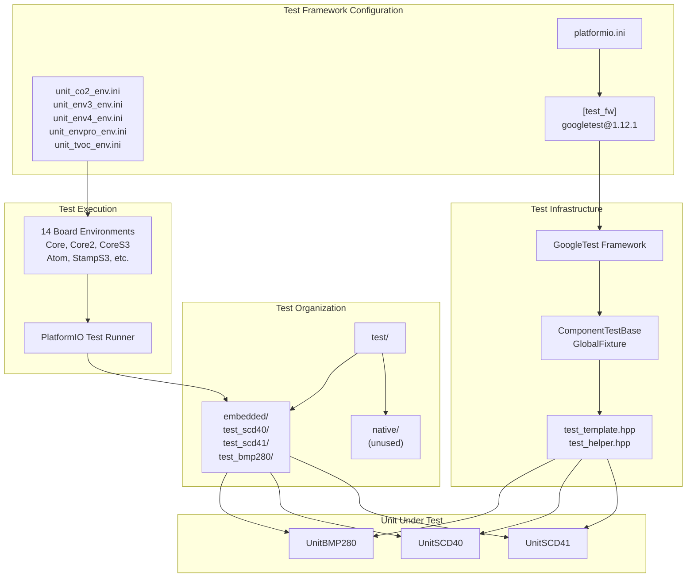
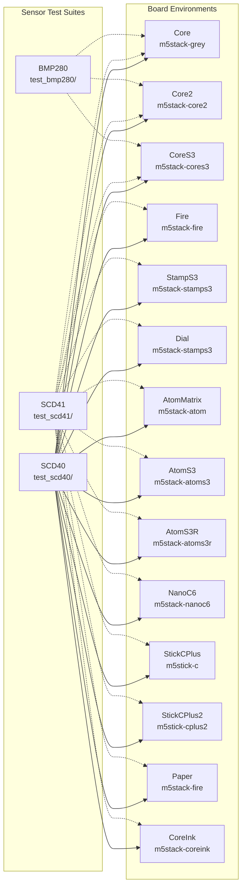
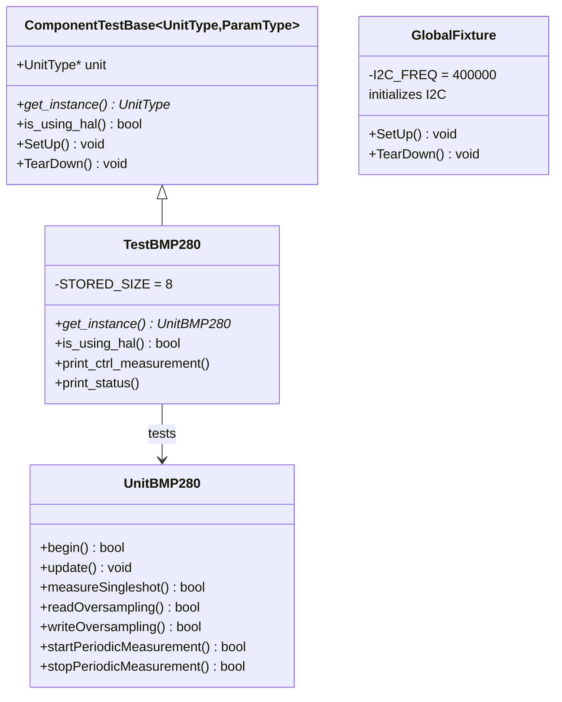
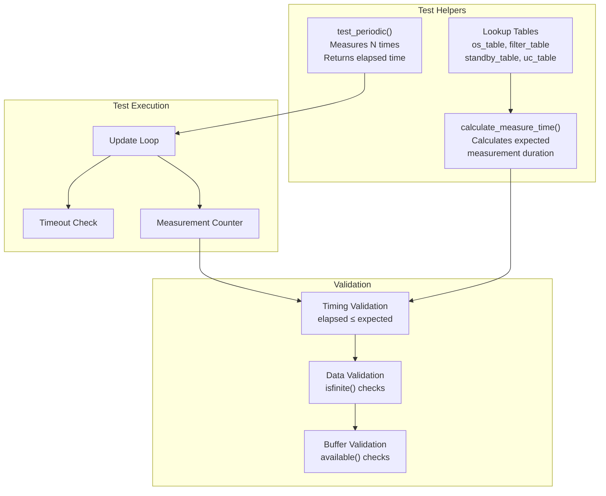
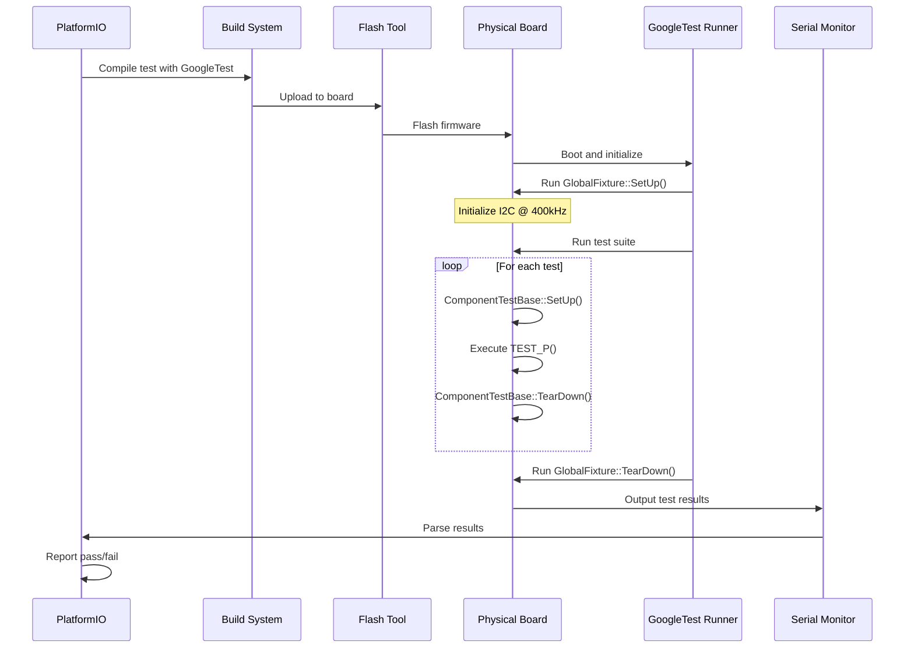

M5Unit-ENV Testing Infrastructure

# Testing Infrastructure

<details>
<summary>Relevant source files</summary>

The following files were used as context for generating this wiki page:

- [platformio.ini](platformio.ini)
- [src/M5UnitUnifiedENV.hpp](src/M5UnitUnifiedENV.hpp)
- [src/unit/unit_BMP280.cpp](src/unit/unit_BMP280.cpp)
- [src/unit/unit_BMP280.hpp](src/unit/unit_BMP280.hpp)
- [test/embedded/test_bmp280/bmp280_test.cpp](test/embedded/test_bmp280/bmp280_test.cpp)
- [unit_co2_env.ini](unit_co2_env.ini)

</details>


This document describes the embedded testing framework for the M5Unit-ENV library, including GoogleTest integration, test organization, environment configuration, and test execution. For information about CI/CD pipeline integration, see [Continuous Integration](#7). For build system configuration details, see [PlatformIO Configuration](#6.1).

## Overview

The M5Unit-ENV library implements a comprehensive embedded testing infrastructure using GoogleTest framework version 1.12.1. Tests run directly on physical hardware across a matrix of M5Stack boards, validating sensor functionality with real I2C communication. The testing infrastructure is organized around individual sensor units, with dedicated test suites for sensors with complex state machines (SCD40, SCD41, BMP280).

**Sources:** [platformio.ini:11](), [platformio.ini:201-202]()

## Test Framework Architecture

The testing system is built on PlatformIO's native test framework with GoogleTest as the testing library. Tests are organized into `embedded` and `native` categories, with the library focusing on embedded hardware tests.



**Sources:** [platformio.ini:11-12](), [platformio.ini:201-202](), [test/embedded/test_bmp280/bmp280_test.cpp:1-28](), [unit_co2_env.ini:1-89]()

## Test Environment Configuration

### Base Test Configuration

The base test configuration is defined in the `[env]` section of `platformio.ini` with GoogleTest as the test framework:

| Configuration Key | Value | Purpose |
|------------------|-------|---------|
| `test_framework` | `googletest` | Specifies GoogleTest as the testing library |
| `test_build_src` | `true` | Includes source files in test builds |
| `test_speed` | `115200` | Serial baud rate for test output |
| `test_ignore` | `native/*` | Excludes native tests from embedded builds |

**Sources:** [platformio.ini:11-12](), [platformio.ini:25-26]()

### Test Environment Matrix

Tests are executed across multiple M5Stack board environments. Each sensor has dedicated test environments for every supported board. The environment naming convention follows the pattern: `test_{SENSOR}_{BOARD}`.



Each test environment extends a base board configuration and includes the GoogleTest library dependency. Example configuration for SCD40 on Core board:

```ini
[env:test_SCD40_Core]
extends=Core, option_release, arduino_latest
lib_deps = ${Core.lib_deps} 
  ${test_fw.lib_deps}
test_filter= embedded/test_scd40
```

**Sources:** [unit_co2_env.ini:5-15](), [unit_co2_env.ini:91-101](), [platformio.ini:28-36]()

## Test Implementation Patterns

### Test Class Hierarchy

Tests use a templated fixture base class `ComponentTestBase<T, P>` that provides common setup/teardown and parameterization support. Tests are parameterized to run with different I2C implementations (HAL vs Wire).



**Sources:** [test/embedded/test_bmp280/bmp280_test.cpp:30-57](), [test/embedded/test_bmp280/bmp280_test.cpp:28]()

### Test Instantiation and Parameterization

Tests are instantiated with parameter values to run with different I2C backends:

```cpp
// Run tests with both Wire (false) and M5HAL (true)
INSTANTIATE_TEST_SUITE_P(ParamValues, TestBMP280, ::testing::Values(false, true));

// Or run with only one backend
INSTANTIATE_TEST_SUITE_P(ParamValues, TestBMP280, ::testing::Values(false));
```

**Sources:** [test/embedded/test_bmp280/bmp280_test.cpp:59-62]()

### Common Test Structure

Tests follow a consistent pattern for testing sensor functionality:

1. **Settings Tests** - Validate configuration read/write operations
2. **Use Case Tests** - Verify preset configuration modes
3. **Reset Tests** - Confirm soft reset behavior
4. **Single Shot Tests** - Test single measurement mode
5. **Periodic Tests** - Validate continuous measurement mode

#### Example: BMP280 Settings Test

The Settings test validates that configuration changes are rejected during periodic measurement and succeed when stopped:

```cpp
TEST_P(TestBMP280, Settings)
{
    // Verify fails during periodic measurement
    EXPECT_TRUE(unit->inPeriodic());
    EXPECT_FALSE(unit->writeOversampling(po, to));
    
    // Stop periodic and verify success
    EXPECT_TRUE(unit->stopPeriodicMeasurement());
    EXPECT_TRUE(unit->writeOversampling(po, to));
    EXPECT_TRUE(unit->readOversampling(p, t));
    EXPECT_EQ(p, po);
    EXPECT_EQ(t, to);
}
```

**Sources:** [test/embedded/test_bmp280/bmp280_test.cpp:176-223]()

#### Example: BMP280 Periodic Measurement Test

The Periodic test validates timing and data availability for continuous measurement:

```cpp
TEST_P(TestBMP280, Periodic)
{
    // Test each use case preset
    for (auto&& uc : uc_table) {
        // Configure and start
        EXPECT_TRUE(unit->writeUseCaseSetting(uc));
        EXPECT_TRUE(unit->startPeriodicMeasurement());
        
        // Measure multiple times
        auto elapsed = test_periodic(unit.get(), STORED_SIZE, tm);
        
        // Validate timing
        EXPECT_NE(elapsed, 0);
        EXPECT_LE(elapsed, STORED_SIZE * tm);
        
        // Validate data buffer
        EXPECT_EQ(unit->available(), STORED_SIZE);
        EXPECT_TRUE(std::isfinite(unit->temperature()));
        EXPECT_TRUE(std::isfinite(unit->pressure()));
    }
}
```

**Sources:** [test/embedded/test_bmp280/bmp280_test.cpp:464-526]()

### Test Helper Functions

Helper functions provide common test utilities for periodic measurement validation:



The `test_periodic()` helper function executes periodic measurements and validates timing:

**Sources:** [test/embedded/test_bmp280/bmp280_test.cpp:118-154](), [test/embedded/test_bmp280/bmp280_test.cpp:156-172]()

## Test Execution

### Running Tests Locally

To execute tests for a specific sensor and board:

```bash
# Run BMP280 tests on M5Stack Core
pio test -e test_BMP280_Core

# Run SCD40 tests on all boards
pio test -f "embedded/test_scd40"

# Run all tests on CoreS3
pio test -e test_SCD40_CoreS3 -e test_SCD41_CoreS3
```

### Test Execution Flow



**Sources:** [platformio.ini:11-12](), [test/embedded/test_bmp280/bmp280_test.cpp:28]()

### Test Output and Monitoring

Tests output results via serial port at 115200 baud. The output includes:
- Test suite names and individual test names
- Assertion results (EXPECT_TRUE, EXPECT_EQ, etc.)
- Debug logging via M5_LOGI/M5_LOGW macros
- GoogleTest summary statistics

Test monitor settings are configured per board environment:

**Sources:** [platformio.ini:22-23](), [platformio.ini:25]()

## Test Coverage by Sensor

### BMP280 Test Suite

The BMP280 test suite validates all sensor functionality including power modes, oversampling, filtering, and measurement modes:

| Test Case | Purpose | Key Validations |
|-----------|---------|-----------------|
| `Settings` | Configuration read/write | Oversampling, filter, standby time |
| `UseCase` | Preset configurations | 6 use case settings |
| `Reset` | Soft reset functionality | Register reset to defaults |
| `SingleShot` | Single measurement mode | All oversampling × filter combinations |
| `Periodic` | Continuous measurement | Timing accuracy, data buffering |

**Sources:** [test/embedded/test_bmp280/bmp280_test.cpp:176-526]()

### SCD40/SCD41 Test Suites

Test environments are defined for both SCD40 and SCD41 sensors across 14 board variants. Tests validate:
- Periodic CO2 measurement
- Temperature and humidity readings
- Automatic self-calibration (ASC)
- Forced recalibration
- Altitude compensation
- SCD41-specific: single-shot mode, low-power mode

**Sources:** [unit_co2_env.ini:5-88](), [unit_co2_env.ini:91-174]()

## Test Configuration Matrix

### Platform and Framework Combinations

Tests run with multiple Arduino platform versions to ensure compatibility:

| Platform Version | ESP32 Platform | Boards Tested |
|-----------------|----------------|---------------|
| arduino_latest | espressif32 @ 6.8.1 | All 14 boards |
| arduino_5_4_0 | espressif32 @ 5.4.0 | Core, Core2, Fire |
| arduino_4_4_0 | espressif32 @ 4.4.0 | Core, Core2, Fire |

**Sources:** [unit_co2_env.ini:178-256](), [platformio.ini:138-156]()

### Build Options for Tests

Test environments use the `option_release` build configuration:

| Option | Value | Purpose |
|--------|-------|---------|
| `build_type` | `release` | Optimized builds |
| `CORE_DEBUG_LEVEL` | 3 | Moderate debug output |
| `LOG_LOCAL_LEVEL` | 3 | Moderate logging |
| `M5_LOG_LEVEL` | 3 | M5Stack library logging |

**Sources:** [platformio.ini:168-174]()

## Test Dependencies

Test executables require these library dependencies:

- `google/googletest@1.12.1` - Testing framework
- `m5stack/M5Unified` - M5Stack core functionality
- `m5stack/M5UnitUnified` - Unit management framework
- Sensor-specific libraries (BME68x, BSEC2, etc.)

For NanoC6 board, BSEC2 is excluded due to resource constraints.

**Sources:** [platformio.ini:13-19](), [platformio.ini:89-97](), [platformio.ini:201-202]()