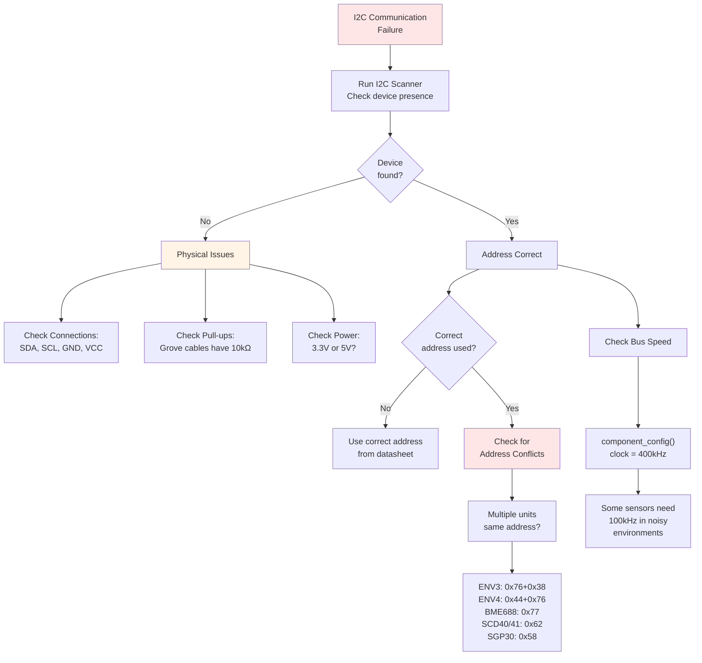
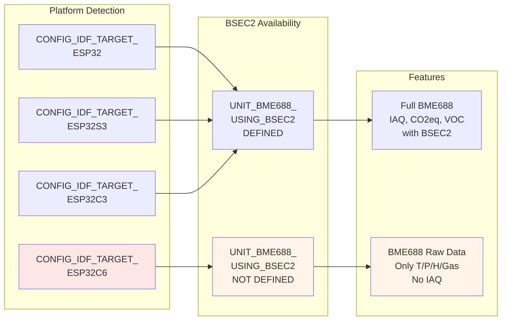
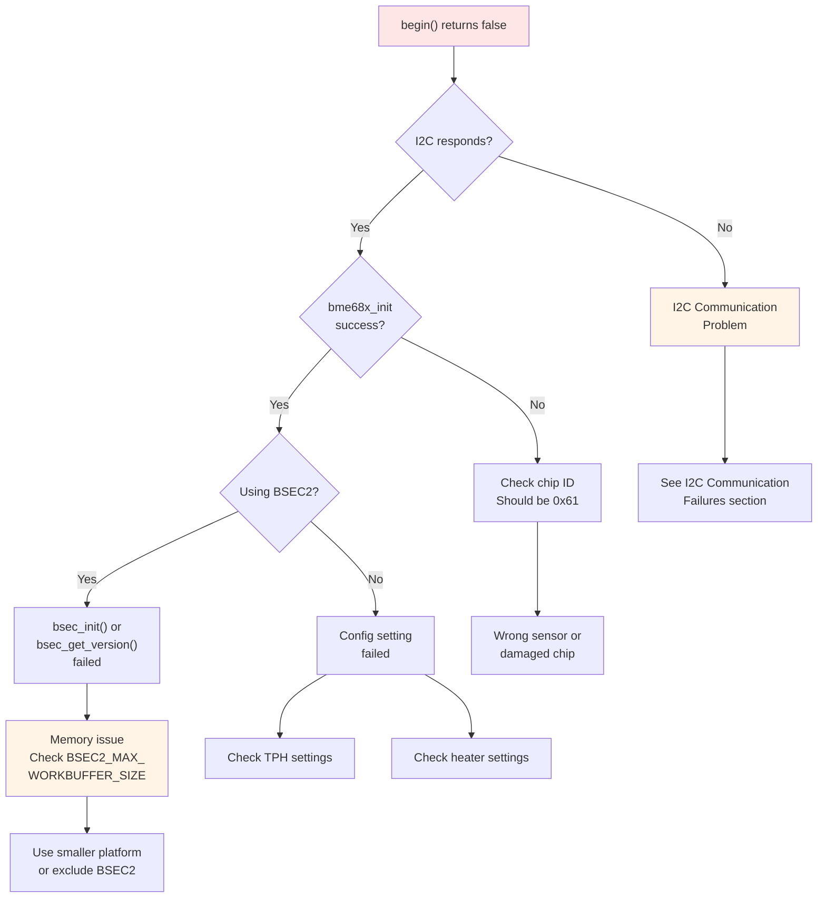
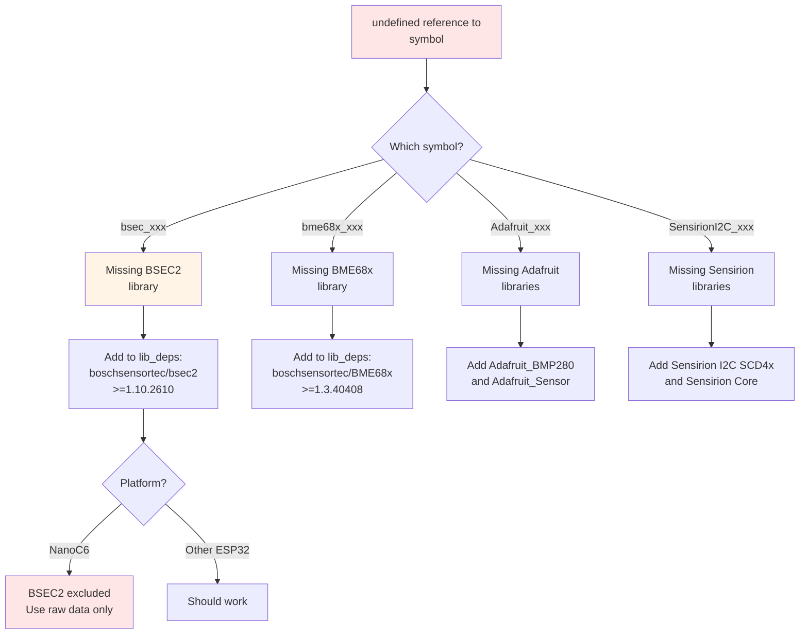
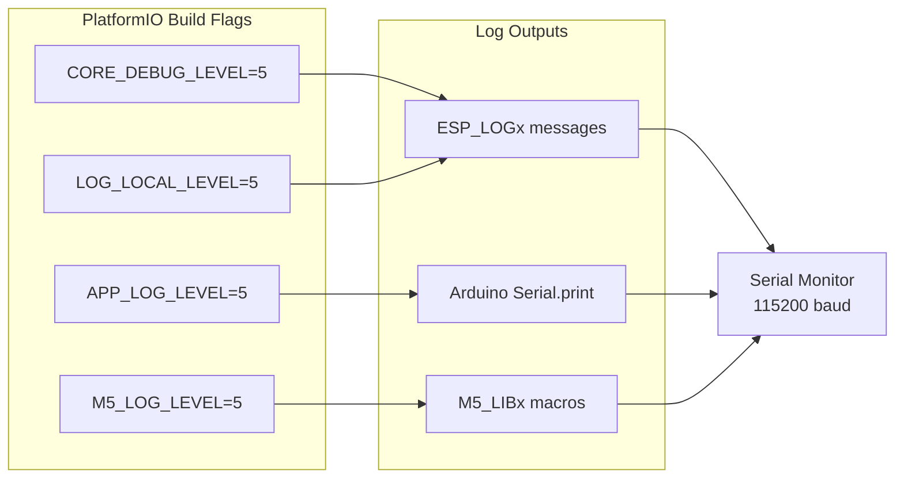

M5Unit-ENV Troubleshooting and FAQ

# Troubleshooting and FAQ

<details>
<summary>Relevant source files</summary>

The following files were used as context for generating this wiki page:

- [README.md](README.md)
- [library.json](library.json)
- [library.properties](library.properties)
- [platformio.ini](platformio.ini)
- [src/M5UnitUnifiedENV.hpp](src/M5UnitUnifiedENV.hpp)
- [src/unit/unit_BME688.cpp](src/unit/unit_BME688.cpp)
- [src/unit/unit_BME688.hpp](src/unit/unit_BME688.hpp)
- [unit_co2_env.ini](unit_co2_env.ini)

</details>


This page provides solutions to common issues encountered when using the M5Unit-ENV library, organized by symptom and root cause. It covers I2C communication failures, platform compatibility problems, sensor initialization issues, build errors, and debugging techniques.

For general usage patterns, see [Usage Patterns and Examples](#5). For specific sensor configuration, consult the individual sensor documentation in [Sensor Units Reference](#4).

---

## Common Issues Decision Tree

```mermaid
flowchart TD
    START["Problem Occurred"] --> TYPE{What type<br/>of issue?}
    
    TYPE -->|"Won't compile"| BUILD["Build/Compilation<br/>Errors"]
    TYPE -->|"begin() fails"| INIT["Initialization<br/>Failures"]
    TYPE -->|"No data"| DATA["Measurement<br/>Issues"]
    TYPE -->|"Wrong values"| CAL["Calibration<br/>Problems"]
    
    BUILD --> B1{Error message<br/>contains?}
    B1 -->|"M5_UNIT_ENV_H_"| MUTEX["Mutually Exclusive<br/>Headers"]
    B1 -->|"BSEC"| BSEC_BUILD["BSEC2 Platform<br/>Issue"]
    B1 -->|"undefined reference"| DEP["Missing<br/>Dependencies"]
    
    INIT --> I1{I2C<br/>communication?}
    I1 -->|"Fails"| I2C_ISSUE["I2C Bus<br/>Problems"]
    I1 -->|"Works"| CONFIG["Configuration<br/>Error"]
    
    DATA --> D1{update()<br/>called?}
    D1 -->|"No"| UPDATE_LOOP["Add update() to<br/>loop()"]
    D1 -->|"Yes"| D2{inPeriodic()?}
    D2 -->|"No"| START_MEAS["Call start<br/>PeriodicMeasurement"]
    D2 -->|"Yes"| TIMING["Check timing/<br/>waiting period"]
    
    CAL --> C1{Sensor type?}
    C1 -->|"SCD40/41"| CO2_CAL["CO2 Calibration<br/>See 4.4"]
    C1 -->|"SGP30"| SGP_BASE["Baseline<br/>Persistence"]
    C1 -->|"BME688"| BME_TEMP["Temperature<br/>Offset"]
    
    style START fill:#f9f9f9
    style BUILD fill:#ffe6e6
    style INIT fill:#fff4e6
    style DATA fill:#e6f3ff
    style CAL fill:#f0e6ff
```

**Sources:** [M5UnitUnifiedENV.hpp:13-14](), [unit_BME688.hpp:22-30](), [platformio.ini:88-97]()

---

## I2C Communication Failures

### Symptoms
- `begin()` returns `false`
- Sensor reads as 0xFF or 0x00
- "Failed to initialize" log messages
- Communication timeouts

### Diagnosis Flow



### Common Address Conflicts

| Unit | I2C Addresses | Notes |
|------|---------------|-------|
| ENV3 (ENVIII) | 0x38 (SHT30)<br/>0x70 (QMP6988) | QMP6988 default is 0x70, may conflict with some displays |
| ENV4 (ENVIV) | 0x44 (SHT40)<br/>0x76 (BMP280) | BMP280 at 0x76 or 0x77 depending on SDO pin |
| BME688 (ENVPro) | 0x77 (default)<br/>0x76 (alternate) | Constructor parameter changes address |
| SCD40/SCD41 | 0x62 | Fixed address, cannot change |
| SGP30 | 0x58 | Fixed address, cannot change |

### Solution: Verify I2C Address

```cpp
// For BME688 - specify address in constructor
UnitBME688 envpro(0x76);  // If using alternate address

// Check component configuration
auto cfg = envpro.component_config();
M5_LOGI("I2C clock: %u Hz", cfg.clock);  // Should be 400000

// Reduce speed if needed
cfg.clock = 100000;  // 100 kHz for noisy environments
envpro.component_config(cfg);
```

### Solution: I2C Bus Configuration

For M5UnitUnified framework, ensure proper I2C adapter is used:

```cpp
// In setup()
auto pin_num_sda = M5.getPin(m5::pin_name_t::port_a_sda);
auto pin_num_scl = M5.getPin(m5::pin_name_t::port_a_scl);
M5_LOGI("getPin: SDA:%u SCL:%u", pin_num_sda, pin_num_scl);

Wire.begin(pin_num_sda, pin_num_scl, 400000U);
// Or for M5HAL:
// auto bus_cfg = bus_a.config();
// M5_LOGI("BusA: SDA:%u SCL:%u Clock:%u", ...);
```

**Sources:** [unit_BME688.cpp:164-166](), [unit_BME688.hpp:378]()

---

## BSEC2 Platform Compatibility

### The NanoC6 Exclusion Problem



### Symptoms
- Compilation error: `'BSEC_OUTPUT_IAQ' was not declared`
- Linker error: `undefined reference to bsec_xxx`
- BME688 returns only raw temperature/pressure/humidity

### Root Cause

BSEC2 library is excluded from NanoC6 platform due to memory constraints. This is controlled by conditional compilation:

[unit_BME688.hpp:22-31]():
```cpp
#if defined(CONFIG_IDF_TARGET_ESP32) || defined(CONFIG_IDF_TARGET_ESP32S3) || defined(CONFIG_IDF_TARGET_ESP32C3)
#define UNIT_BME688_USING_BSEC2
```

[platformio.ini:88-97]() shows NanoC6 explicitly excludes `bsec2` dependency:
```ini
[NanoC6]
extends = m5base
board = m5stack-nanoc6
lib_deps = ${env.lib_deps}  # No ${bsec2.lib_deps}
```

### Solutions

**Option 1: Use supported platform**
Use ESP32, ESP32-S3, or ESP32-C3 for full IAQ features.

**Option 2: Accept raw data only on NanoC6**
```cpp
#if defined(UNIT_BME688_USING_BSEC2)
    // Full IAQ functionality
    unit.startPeriodicMeasurement(
        1U << BSEC_OUTPUT_IAQ | 1U << BSEC_OUTPUT_CO2_EQUIVALENT,
        bme688::bsec2::SampleRate::LowPower
    );
    float iaq = unit.iaq();
#else
    // Raw data only
    unit.startPeriodicMeasurement(bme688::Mode::Forced);
    float temp = unit.temperature();      // Uses raw_temperature()
    float pressure = unit.pressure();     // Uses raw_pressure()
    float humidity = unit.humidity();     // Uses raw_humidity()
    float gas = unit.gas();               // Uses raw_gas()
    // No IAQ, CO2eq, or VOC available
#endif
```

**Option 3: Check at runtime**
```cpp
void setup() {
#if !defined(UNIT_BME688_USING_BSEC2)
    M5_LOGW("BSEC2 not available on this platform");
    M5_LOGW("Only raw sensor data will be available");
#endif
}
```

**Sources:** [unit_BME688.hpp:22-31](), [unit_BME688.cpp:11-16](), [platformio.ini:88-97](), [README.md:83-85]()

---

## Mutually Exclusive Headers Error

### Symptoms
```
error: #error "DO NOT USE it at the same time as conventional libraries"
```

### Root Cause

The library provides two mutually exclusive interfaces:
- **Conventional:** `M5UnitENV.h` - standalone usage with Adafruit/Sensirion libraries
- **Unified:** `M5UnitUnifiedENV.h` - M5UnitUnified framework integration

[M5UnitUnifiedENV.hpp:13-15]():
```cpp
#if defined(_M5_UNIT_ENV_H_)
#error "DO NOT USE it at the same time as conventional libraries"
#endif
```

### Solution

**Choose ONE interface per project:**

```cpp
// Option A: Unified Interface (recommended for new projects)
#include <M5Unified.h>
#include <M5UnitUnifiedENV.h>
using namespace m5::unit;
UnitCO2 co2;

// Option B: Conventional Interface (for legacy projects)
#include <M5UnitENV.h>
SCD40_I2C scd40;
```

**Never mix:**
```cpp
// WRONG - will cause compilation error
#include <M5UnitENV.h>
#include <M5UnitUnifiedENV.h>  // ERROR!
```

**Sources:** [M5UnitUnifiedENV.hpp:13-15](), [library.properties:10]()

---

## Sensor Initialization Failures

### BME688 Initialization Issues



**Debug steps:**

1. **Check initialization sequence** [unit_BME688.cpp:169-225]()
   - `bme68x_init()` must succeed
   - `bsec_init()` must succeed (if using BSEC2)
   - Configuration must be set before starting measurements

2. **Enable verbose logging:**
```cpp
// In platformio.ini
build_flags = 
    -DCORE_DEBUG_LEVEL=5
    -DLOG_LOCAL_LEVEL=5
    -DM5_LOG_LEVEL=5
```

3. **Verify configuration structure:**
```cpp
UnitBME688::config_t cfg;
cfg.start_periodic = false;  // Don't auto-start
cfg.ambient_temperature = 25;

envpro.config(cfg);
if (!envpro.begin()) {
    M5_LOGE("Failed to initialize BME688");
    // Check I2C, power, connections
}
```

### SCD40/SCD41 Initialization Issues

**Common problem:** Sensor in wrong state

[test/embedded/test_scd40]() shows proper initialization:
```cpp
// Must stop any ongoing measurement first
if (!unit.stopPeriodicMeasurement()) {
    M5_LOGW("Failed to stop");
}

// Then reconfigure
if (!unit.begin()) {
    M5_LOGE("begin failed");
}

// Start measurements
if (!unit.startPeriodicMeasurement()) {
    M5_LOGE("start failed");
}
```

**Sources:** [unit_BME688.cpp:169-225](), [platformio.ini:169-189]()

---

## Measurement Data Issues

### No Data Available (empty() returns true)

```mermaid
flowchart TD
    START["oldest()/empty()<br/>no data"] --> CHECK1{inPeriodic()?}
    
    CHECK1 -->|"false"| NOT_STARTED["Periodic measurement<br/>not started"]
    CHECK1 -->|"true"| CHECK2{update() called<br/>in loop()?}
    
    CHECK2 -->|"No"| NO_UPDATE["Must call update()<br/>in loop()"]
    CHECK2 -->|"Yes"| CHECK3{_waiting flag?}
    
    CHECK3 -->|"true"| WAIT["Initial waiting period<br/>not elapsed"]
    CHECK3 -->|"false"| CHECK4{_updated flag?}
    
    CHECK4 -->|"false"| TIMING["Timing issue or<br/>sensor not ready"]
    CHECK4 -->|"true"| BUFFER["CircularBuffer<br/>issue"]
    
    NOT_STARTED --> FIX1["Call startPeriodicMeasurement()"]
    NO_UPDATE --> FIX2["Add unit.update()<br/>to loop()"]
    WAIT --> FIX3["Wait for _interval<br/>milliseconds"]
    TIMING --> FIX4["Check mode and<br/>interval calculation"]
    BUFFER --> FIX5["Check stored_size()<br/>configuration"]
    
    style START fill:#ffe6e6
    style NOT_STARTED fill:#fff4e6
    style NO_UPDATE fill:#fff4e6
```

### Solution Pattern

**Correct measurement flow:**

```cpp
void setup() {
    M5.begin();
    
    // Initialize sensor
    if (!unit.begin()) {
        M5_LOGE("begin failed");
        return;
    }
    
    // Start periodic measurement
    if (!unit.startPeriodicMeasurement()) {
        M5_LOGE("start failed");
        return;
    }
    
    M5_LOGI("Started, waiting for first measurement...");
}

void loop() {
    M5.update();
    unit.update();  // CRITICAL - must be called
    
    if (unit.updated()) {
        M5_LOGI("Temperature: %.2f C", unit.temperature());
        M5_LOGI("Humidity: %.2f %%", unit.humidity());
        M5_LOGI("Pressure: %.2f Pa", unit.pressure());
    }
    
    delay(100);
}
```

### Understanding the Waiting Period

[unit_BME688.cpp:756-759]():
```cpp
// Always wait for an interval to obtain the correct value for the first measurement
_can_measure_time = m5::utility::millis() + _interval;
_waiting          = true;
_latest           = 0;
```

**Why waiting is necessary:**
- Sensors need time for first stable measurement
- BME688 Forced mode: measurement duration + heater duration
- BME688 Parallel mode: sum of all profile durations
- SCD40: ~5 seconds minimum interval

**Check waiting status:**
```cpp
if (unit.inPeriodic()) {
    if (unit.empty()) {
        M5_LOGI("Waiting for first measurement...");
    } else {
        M5_LOGI("Data available!");
    }
}
```

**Sources:** [unit_BME688.cpp:264-278](), [unit_BME688.cpp:354-408](), [unit_BME688.cpp:726-763]()

---

## Calibration and Persistence Issues

### CO2 Sensor Calibration Not Persisting

**Problem:** SCD40/SCD41 calibration resets on power cycle

**Cause:** Calibration settings are stored in volatile RAM by default

**Solutions:**

**1. Forced recalibration at known CO2 level:**
```cpp
// Expose sensor to 400 ppm CO2 (fresh outdoor air)
// Wait 3 minutes for stable readings
uint16_t frcCorrection = 400;  // ppm
if (!unit.performForcedRecalibration(frcCorrection)) {
    M5_LOGE("Forced recalibration failed");
}
// This persists in sensor's EEPROM
```

**2. Enable Automatic Self-Calibration (ASC):**
```cpp
// ASC assumes sensor is exposed to 400 ppm for at least 1 hour per day
if (!unit.setAutomaticSelfCalibration(true)) {
    M5_LOGE("Failed to enable ASC");
}
// ASC parameters persist in sensor's EEPROM
```

**3. Set temperature offset:**
```cpp
// Compensate for self-heating
float offset = 4.0f;  // Celsius
if (!unit.setTemperatureOffset(offset)) {
    M5_LOGE("Failed to set offset");
}
// Offset persists in sensor's EEPROM
```

### SGP30 Baseline Management

**Problem:** TVOC readings reset after power cycle

**Cause:** SGP30 requires 15-second initialization and baseline restoration

**Solution pattern:**

```cpp
// On first boot
void setup() {
    unit.begin();
    
    // Wait 15 seconds for sensor stabilization
    M5_LOGI("Waiting 15 seconds for SGP30 init...");
    for (int i = 15; i > 0; i--) {
        M5_LOGI("%d...", i);
        delay(1000);
    }
    
    // Start measurements
    unit.startPeriodicMeasurement();
}

// After 12 hours of operation
void saveBaseline() {
    uint16_t eco2_base, tvoc_base;
    if (unit.getBaseline(eco2_base, tvoc_base)) {
        // Save to EEPROM/Flash/SD card
        preferences.putUShort("eco2_base", eco2_base);
        preferences.putUShort("tvoc_base", tvoc_base);
        M5_LOGI("Baseline saved: eCO2=%u TVOC=%u", eco2_base, tvoc_base);
    }
}

// On subsequent boots
void restoreBaseline() {
    uint16_t eco2_base = preferences.getUShort("eco2_base", 0);
    uint16_t tvoc_base = preferences.getUShort("tvoc_base", 0);
    
    if (eco2_base != 0 && tvoc_base != 0) {
        unit.setBaseline(eco2_base, tvoc_base);
        M5_LOGI("Baseline restored: eCO2=%u TVOC=%u", eco2_base, tvoc_base);
    }
}
```

**Baseline save frequency:** Every 1 hour during operation

### BME688 BSEC2 State Persistence

**Problem:** IAQ accuracy resets after restart

**Solution:** Save/restore BSEC2 state

```cpp
void saveBSEC2State() {
    uint8_t state[BSEC_MAX_STATE_BLOB_SIZE];
    uint32_t actualSize;
    
    if (envpro.bsec2GetState(state, actualSize)) {
        // Save to Flash/SD
        File file = SD.open("/bsec2_state.bin", FILE_WRITE);
        file.write(state, actualSize);
        file.close();
        M5_LOGI("BSEC2 state saved (%u bytes)", actualSize);
    }
}

void restoreBSEC2State() {
    if (SD.exists("/bsec2_state.bin")) {
        File file = SD.open("/bsec2_state.bin", FILE_READ);
        uint8_t state[BSEC_MAX_STATE_BLOB_SIZE];
        size_t len = file.read(state, BSEC_MAX_STATE_BLOB_SIZE);
        file.close();
        
        if (envpro.bsec2SetState(state)) {
            M5_LOGI("BSEC2 state restored");
        }
    }
}
```

**State save frequency:** Every 4 hours during operation

**Sources:** [README.md:63](), [unit_BME688.hpp:809-819]()

---

## Build and Dependency Issues

### Missing Dependencies



### Solution: Verify Dependencies

**For PlatformIO** [library.json:13-16]():
```ini
lib_deps = 
    m5stack/M5UnitUnified >= 0.1.0
    boschsensortec/BME68x Sensor library >= 1.3.40408
    boschsensortec/bsec2 >= 1.10.2610  ; Exclude for NanoC6
```

**For Arduino IDE** [README.md:29-35]():
Install via Library Manager:
- Adafruit BMP280 Library
- Adafruit Unified Sensor
- Sensirion I2C SCD4x
- Sensirion I2C SHT4x
- Sensirion Core

### Version Conflicts

**Symptom:** Compilation errors after updating M5Stack libraries

**Solution:** Match platform versions across ecosystem

[platformio.ini:138-164]() defines version compatibility:

```ini
[arduino_latest]
platform = espressif32 @ 6.8.1

[arduino_5_4_0]
platform = espressif32 @ 5.4.0

[arduino_4_4_0]
platform = espressif32 @ 4.4.0
```

**Check library versions:**
```bash
# PlatformIO
pio pkg list

# Arduino CLI
arduino-cli lib list
```

**Sources:** [library.json:13-16](), [README.md:29-35](), [platformio.ini:13-15]()

---

## Performance and Timing Issues

### Slow Loop Execution

**Symptom:** `loop()` takes too long, display updates lag

**Cause:** Blocking calls in measurement functions

### Measurement Duration by Sensor

| Sensor | Mode | Duration | Notes |
|--------|------|----------|-------|
| BME688 | Forced | ~193ms + heater time | [unit_BME688.cpp:706-708]() |
| BME688 | Parallel | Variable | Depends on profile count |
| SCD40 | Periodic | 5000ms | Fixed interval, non-blocking with `update()` |
| SCD41 | Single-shot | ~5000ms | Blocking call |
| BMP280 | Forced | ~10-100ms | Depends on oversampling |
| SHT30/40 | Single-shot | ~15-50ms | Depends on repeatability |

### Solution: Use Periodic Measurements

**Bad (blocking):**
```cpp
void loop() {
    bme688::bme68xData data;
    envpro.measureSingleShot(data);  // Blocks for 200+ ms!
    display.print(data.temperature);
    delay(1000);
}
```

**Good (non-blocking):**
```cpp
void setup() {
    envpro.startPeriodicMeasurement(bme688::Mode::Forced);
}

void loop() {
    envpro.update();  // Non-blocking check
    
    if (envpro.updated()) {
        display.print(envpro.temperature());
    }
    
    // Rest of loop continues immediately
    updateButtons();
    updateDisplay();
}
```

### Reducing Update Frequency

```cpp
// For lower power consumption
unsigned long lastUpdate = 0;
const unsigned long UPDATE_INTERVAL = 10000;  // 10 seconds

void loop() {
    unsigned long now = millis();
    if (now - lastUpdate >= UPDATE_INTERVAL) {
        unit.update(true);  // Force update
        lastUpdate = now;
    }
    
    // Other tasks run every loop
}
```

**Sources:** [unit_BME688.cpp:696-724]()

---

## Debugging Techniques

### Enable Comprehensive Logging



**Configuration** [platformio.ini:176-181]():
```ini
[option_log]
build_type = release
build_flags = 
    -DCORE_DEBUG_LEVEL=5
    -DLOG_LOCAL_LEVEL=5
    -DAPP_LOG_LEVEL=5
    -DM5_LOG_LEVEL=5
```

### I2C Bus Scanning

**Generic I2C scanner for Arduino:**
```cpp
void scanI2C() {
    M5_LOGI("Scanning I2C bus...");
    for (uint8_t addr = 1; addr < 127; addr++) {
        Wire.beginTransmission(addr);
        uint8_t error = Wire.endTransmission();
        
        if (error == 0) {
            M5_LOGI("Device found at 0x%02X", addr);
        }
    }
}
```

**Expected addresses:**
- 0x38: SHT30
- 0x44: SHT40
- 0x58: SGP30
- 0x62: SCD40/SCD41
- 0x70 or 0x56: QMP6988
- 0x76 or 0x77: BMP280, BME688

### Register Dump for Advanced Debugging

```cpp
void dumpBME688Registers(UnitBME688& unit) {
    bme688::bme68xConf tph;
    bme688::bme68xHeatrConf heater;
    
    if (unit.readTPHSetting(tph)) {
        M5_LOGI("TPH: T_os=%u P_os=%u H_os=%u filter=%u",
                tph.os_temp, tph.os_pres, tph.os_hum, tph.filter);
    }
    
    if (unit.readHeaterSetting(heater)) {
        M5_LOGI("Heater: enabled=%u temp=%u dur=%u",
                heater.enable, heater.heatr_temp, heater.heatr_dur);
    }
    
    bme688::Mode mode;
    if (unit.readMode(mode)) {
        M5_LOGI("Mode: %u", static_cast<uint8_t>(mode));
    }
}
```

### Memory Diagnostics

```cpp
void printMemoryInfo() {
    M5_LOGI("Free heap: %u bytes", ESP.getFreeHeap());
    M5_LOGI("Largest free block: %u bytes", ESP.getMaxAllocHeap());
    M5_LOGI("Min free heap: %u bytes", ESP.getMinFreeHeap());
    
    // BSEC2 requires significant memory
    M5_LOGI("BSEC_MAX_WORKBUFFER_SIZE: %u bytes", BSEC_MAX_WORKBUFFER_SIZE);
    M5_LOGI("BSEC_MAX_PROPERTY_BLOB_SIZE: %u bytes", BSEC_MAX_PROPERTY_BLOB_SIZE);
}
```

### Minimal Test Case Template

```cpp
#include <M5Unified.h>
#include <M5UnitUnifiedENV.h>

m5::unit::UnitBME688 unit;

void setup() {
    M5.begin();
    
    M5_LOGI("=== BME688 Diagnostic ===");
    
    // 1. Check I2C
    Wire.begin();
    Wire.beginTransmission(0x77);
    if (Wire.endTransmission() == 0) {
        M5_LOGI("✓ Device responds at 0x77");
    } else {
        M5_LOGE("✗ No device at 0x77");
    }
    
    // 2. Check initialization
    if (unit.begin()) {
        M5_LOGI("✓ begin() successful");
    } else {
        M5_LOGE("✗ begin() failed");
        while (1) delay(1000);
    }
    
    // 3. Check unique ID
    uint32_t id;
    if (unit.readUniqueID(id)) {
        M5_LOGI("✓ Unique ID: 0x%08X", id);
    }
    
    // 4. Start measurement
    if (unit.startPeriodicMeasurement(bme688::Mode::Forced)) {
        M5_LOGI("✓ Periodic measurement started");
    } else {
        M5_LOGE("✗ Failed to start measurement");
    }
}

void loop() {
    unit.update();
    
    if (unit.updated()) {
        M5_LOGI("T:%.2f P:%.2f H:%.2f G:%.2f",
                unit.temperature(), unit.pressure(),
                unit.humidity(), unit.gas());
    }
    
    delay(100);
}
```

**Sources:** [platformio.ini:176-189](), [unit_BME688.cpp:410-422]()

---

## Common Error Messages Reference

| Error Message | Likely Cause | Solution |
|--------------|--------------|----------|
| `Failed to initialize` | I2C communication failure | Check connections, address, pull-ups |
| `Failed to bsec_init` | BSEC2 platform incompatibility | Use supported platform or exclude BSEC2 |
| `Periodic measurements are running` | Attempted config change during operation | Call `stopPeriodicMeasurement()` first |
| `undefined reference to 'bsec_xxx'` | BSEC2 library missing | Add dependency or check platform exclusion |
| `DO NOT USE it at the same time` | Mixed conventional/unified headers | Choose one interface only |
| `Failed to subscribe` | Invalid BSEC2 subscription | Check subscription bits and sample rate |
| `ret:%u cnt:%u` in measureSingleShot | Sensor not ready | Increase retry count or wait longer |

**Sources:** [unit_BME688.cpp:176-184](), [unit_BME688.cpp:188-199](), [M5UnitUnifiedENV.hpp:13-14]()

---

## Platform-Specific Issues

### NanoC6 Limitations

1. **No BSEC2 support** - only raw BME688 data available
2. **Memory constraints** - use smaller buffer sizes
3. **IDF target** - requires specific platform configuration

[platformio.ini:88-97]():
```ini
[NanoC6]
board = m5stack-nanoc6
platform = https://github.com/platformio/platform-espressif32.git
platform_packages = 
    platformio/framework-arduinoespressif32 @ https://github.com/espressif/arduino-esp32.git#3.0.7
lib_deps = ${env.lib_deps}  # Note: No ${bsec2.lib_deps}
```

### M5Stack Core vs Core2 vs CoreS3

**I2C Pin Differences:**
- Core: GPIO 21 (SDA), GPIO 22 (SCL)
- Core2: GPIO 32 (SDA), GPIO 33 (SCL)
- CoreS3: GPIO 12 (SDA), GPIO 11 (SCL)

**Always use dynamic pin detection:**
```cpp
auto pin_sda = M5.getPin(m5::pin_name_t::port_a_sda);
auto pin_scl = M5.getPin(m5::pin_name_t::port_a_scl);
Wire.begin(pin_sda, pin_scl);
```

**Sources:** [platformio.ini:28-47](), [platformio.ini:88-97]()

---

## FAQ Quick Reference

**Q: Why does `begin()` return false?**  
A: Check I2C communication, sensor connections, and address conflicts. Run I2C scanner.

**Q: Why is my data always empty?**  
A: Ensure `update()` is called in `loop()` and `startPeriodicMeasurement()` was called successfully.

**Q: Can I use BME688 IAQ on NanoC6?**  
A: No, BSEC2 is excluded from NanoC6. Only raw temperature/pressure/humidity/gas data available.

**Q: How do I save CO2 calibration?**  
A: Use `performForcedRecalibration()` or enable `setAutomaticSelfCalibration()`. Settings persist in sensor EEPROM.

**Q: Why does compilation fail with "DO NOT USE at the same time"?**  
A: You're mixing `M5UnitENV.h` and `M5UnitUnifiedENV.h`. Choose one interface only.

**Q: How long does first measurement take?**  
A: Depends on sensor: BME688 (~200ms), SCD40 (5000ms), BMP280 (~10-100ms). Wait for `updated()` flag.

**Q: How do I reduce power consumption?**  
A: Use periodic measurements with longer intervals, or single-shot with sleep between measurements.

**Q: Can I use multiple ENV3 units simultaneously?**  
A: No, both units would have the same I2C addresses (0x38 + 0x70). ENV3/ENV4 don't support address changes.

**Q: Why are my TVOC readings wrong after restart?**  
A: SGP30 requires 15-second initialization and baseline restoration. Save/restore baseline values.

**Q: What's the fastest measurement rate?**  
A: BME688 Forced: ~200ms, SCD40: 5000ms, BMP280 Normal: continuous. Check sensor specifications.

**Sources:** Overall troubleshooting patterns from [unit_BME688.cpp](), [unit_BME688.hpp](), [platformio.ini](), [M5UnitUnifiedENV.hpp]()