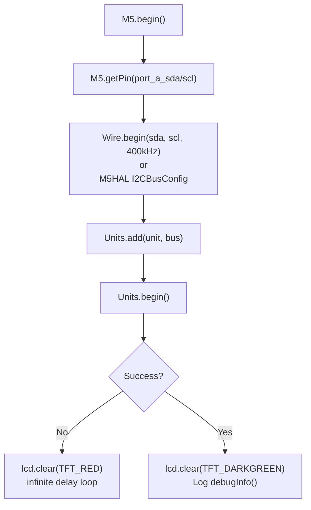
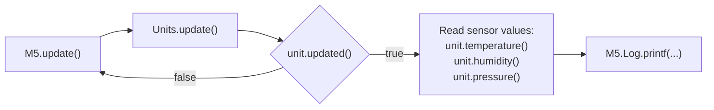
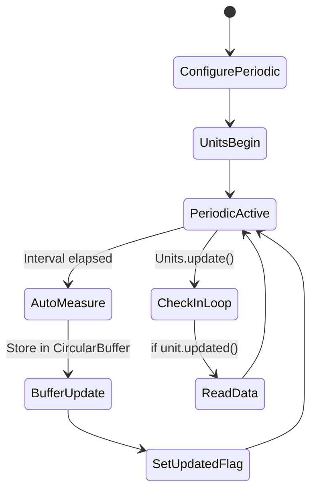
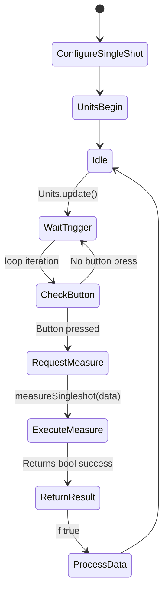
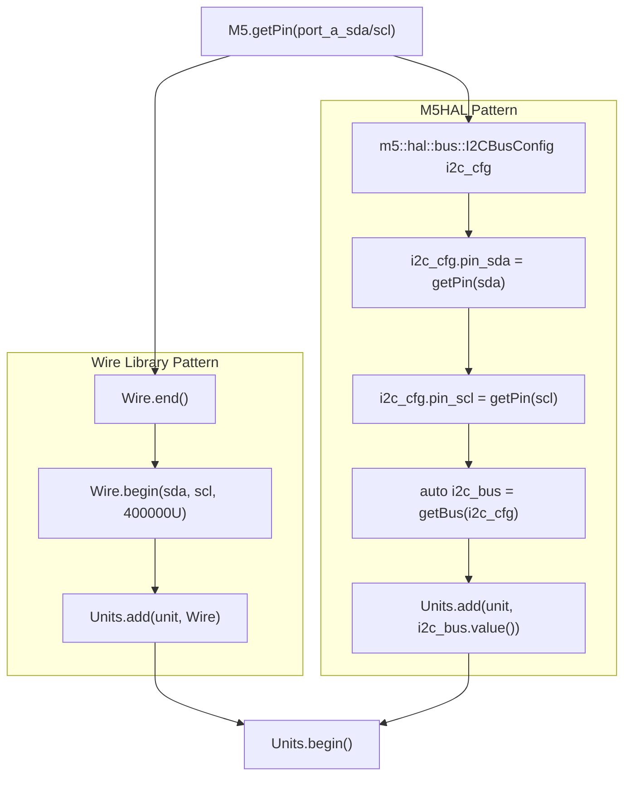
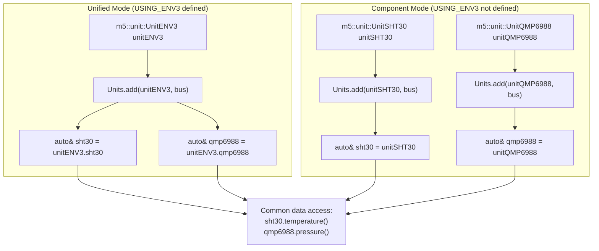
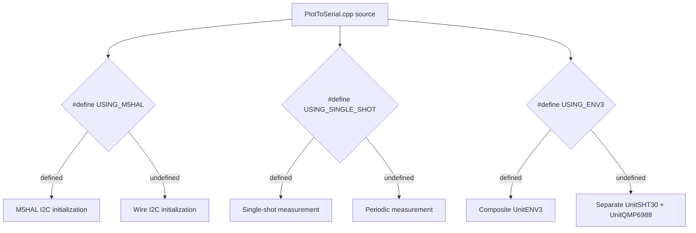

M5Unit-ENV Usage Patterns and Examples

# Usage Patterns and Examples

<details>
<summary>Relevant source files</summary>

The following files were used as context for generating this wiki page:

- [examples/UnitUnified/UnitENVIII/PlotToSerial/PlotToSerial.ino](examples/UnitUnified/UnitENVIII/PlotToSerial/PlotToSerial.ino)
- [examples/UnitUnified/UnitENVIII/PlotToSerial/main/PlotToSerial.cpp](examples/UnitUnified/UnitENVIII/PlotToSerial/main/PlotToSerial.cpp)
- [examples/UnitUnified/UnitENVPro/PlotToSerial/PlotToSerial.ino](examples/UnitUnified/UnitENVPro/PlotToSerial/PlotToSerial.ino)
- [examples/UnitUnified/UnitENVPro/PlotToSerial/main/PlotToSerial.cpp](examples/UnitUnified/UnitENVPro/PlotToSerial/main/PlotToSerial.cpp)
- [examples/UnitUnified/UnitTVOC/PlotToSerial/main/PlotToSerial.cpp](examples/UnitUnified/UnitTVOC/PlotToSerial/main/PlotToSerial.cpp)

</details>


This page demonstrates common usage patterns and workflows for the M5Unit-ENV library. It covers the fundamental patterns that apply across all sensor units: periodic versus single-shot measurements, setup/loop structure, I2C bus configuration options, and data access methods. The examples use the unified interface (`M5UnitUnifiedENV.h`) with the `M5UnitUnified` framework.

For detailed explanation of the PlotToSerial example pattern, see [PlotToSerial Pattern](#5.1). For managing multiple sensors simultaneously, see [Multi-Sensor Applications](#5.2). For sensor calibration workflows, see [Calibration and Configuration](#5.3).

---

## Fundamental Setup/Loop Pattern

All unified interface examples follow the standard Arduino `setup()` and `loop()` structure with a consistent initialization and update cycle. The pattern involves creating a `UnitUnified` manager instance, adding sensor units to it, and calling `Units.update()` in the loop to propagate updates through all registered units.

### Initialization Flow



**Initialization Flow Diagram**: Standard setup sequence showing M5Unified initialization, pin retrieval, I2C bus configuration, unit registration, and error handling.

Sources: [examples/UnitUnified/UnitENVIII/PlotToSerial/main/PlotToSerial.cpp:43-127](), [examples/UnitUnified/UnitENVPro/PlotToSerial/main/PlotToSerial.cpp:19-40]()

### Update Cycle



**Update Cycle Diagram**: Standard loop sequence showing the cascading update mechanism and conditional data reading based on `unit.updated()`.

Sources: [examples/UnitUnified/UnitENVIII/PlotToSerial/main/PlotToSerial.cpp:129-153](), [examples/UnitUnified/UnitENVPro/PlotToSerial/main/PlotToSerial.cpp:42-56]()

### Code Example Structure

The typical example structure declares units and the manager in a namespace, then follows the setup/loop pattern:

```cpp
namespace {
    m5::unit::UnitUnified Units;
    m5::unit::UnitENVPro unit;  // Or UnitENV3, UnitSHT30, etc.
}

void setup() {
    M5.begin();
    // Pin configuration and bus initialization
    // Units.add() and Units.begin()
}

void loop() {
    M5.update();
    Units.update();
    if (unit.updated()) {
        // Access sensor data
    }
}
```

Sources: [examples/UnitUnified/UnitENVPro/PlotToSerial/main/PlotToSerial.cpp:13-17](), [examples/UnitUnified/UnitTVOC/PlotToSerial/main/PlotToSerial.cpp:14-19]()

---

## Measurement Mode Patterns

The library supports two fundamental measurement patterns: **periodic measurement** (continuous automatic updates) and **single-shot measurement** (on-demand readings). The choice between these patterns is typically configured before calling `Units.begin()`.

### Periodic Measurement Pattern

In periodic mode (default), sensors automatically measure at their configured intervals. The unit stores the latest measurement in an internal buffer, and users check `unit.updated()` to determine when new data is available.



**Periodic Measurement State Machine**: Automatic measurement cycle with internal buffering and update flag management.

| Aspect | Behavior |
|--------|----------|
| Configuration | Default mode, or explicitly set `cfg.start_periodic = true` |
| Trigger | Automatic at configured interval |
| Data Access | `unit.temperature()`, `unit.humidity()`, etc. |
| Update Detection | `unit.updated()` returns `true` when new data available |
| Buffer | `CircularBuffer` stores historical measurements |

Sources: [examples/UnitUnified/UnitENVIII/PlotToSerial/main/PlotToSerial.cpp:146-152]()

### Single-Shot Measurement Pattern

In single-shot mode, measurements occur only when explicitly requested via `unit.measureSingleshot()`. This is useful for power-sensitive applications or when precise timing control is needed.



**Single-Shot Measurement State Machine**: On-demand measurement triggered by application logic, typically user input.

Configuration example from [examples/UnitUnified/UnitENVIII/PlotToSerial/main/PlotToSerial.cpp:51-62]():

```cpp
#if defined(USING_SINGLE_SHOT)
    {
        auto cfg           = sht30.config();
        cfg.start_periodic = false;
        sht30.config(cfg);
    }
    {
        auto cfg           = qmp6988.config();
        cfg.start_periodic = false;
        qmp6988.config(cfg);
    }
#endif
```

Usage example from [examples/UnitUnified/UnitENVIII/PlotToSerial/main/PlotToSerial.cpp:134-144]():

```cpp
#if defined(USING_SINGLE_SHOT)
    if (M5.BtnA.wasClicked()) {
        m5::unit::sht30::Data ds{};
        if (sht30.measureSingleshot(ds)) {
            M5.Log.printf(">SHT30Temp:%2.2f\n>Humidity:%2.2f\n", 
                          ds.temperature(), ds.humidity());
        }
        m5::unit::qmp6988::Data dq{};
        if (qmp6988.measureSingleshot(dq)) {
            M5.Log.printf(">QMP6988Temp:%2.2f\n>Pressure:%.2f\n", 
                          dq.temperature(), dq.pressure() * 0.01f);
        }
    }
#endif
```

| Aspect | Behavior |
|--------|----------|
| Configuration | Set `cfg.start_periodic = false` before `Units.begin()` |
| Trigger | Manual via `measureSingleshot(data)` |
| Data Access | Via data structure passed to `measureSingleshot()` |
| Update Detection | Function returns `bool` indicating success |
| Buffer | Not used; data returned directly |

Sources: [examples/UnitUnified/UnitENVIII/PlotToSerial/main/PlotToSerial.cpp:51-62](), [examples/UnitUnified/UnitENVIII/PlotToSerial/main/PlotToSerial.cpp:134-144]()

---

## I2C Bus Configuration Patterns

The library supports two I2C bus initialization approaches: Arduino's standard `Wire` library and M5Stack's `M5HAL` hardware abstraction layer. The choice is controlled by preprocessor defines.

### Bus Configuration Comparison



**I2C Bus Configuration Alternatives**: Two mutually exclusive approaches for initializing the I2C communication layer.

### Wire Library Pattern

The standard Arduino approach using `TwoWire`:

[examples/UnitUnified/UnitENVIII/PlotToSerial/main/PlotToSerial.cpp:79-89]()
```cpp
#pragma message "Using Wire"
Wire.end();
Wire.begin(pin_num_sda, pin_num_scl, 400000U);

if (!Units.add(unitENV3, Wire) || !Units.begin()) {
    M5_LOGE("Failed to begin");
    lcd.clear(TFT_RED);
    while (true) {
        m5::utility::delay(10000);
    }
}
```

### M5HAL Pattern

The M5Stack hardware abstraction approach:

[examples/UnitUnified/UnitENVIII/PlotToSerial/main/PlotToSerial.cpp:66-77]()
```cpp
#pragma message "Using M5HAL"
m5::hal::bus::I2CBusConfig i2c_cfg;
i2c_cfg.pin_sda = m5::hal::gpio::getPin(pin_num_sda);
i2c_cfg.pin_scl = m5::hal::gpio::getPin(pin_num_scl);
auto i2c_bus    = m5::hal::bus::i2c::getBus(i2c_cfg);
if (!Units.add(unitENV3, i2c_bus ? i2c_bus.value() : nullptr) || !Units.begin()) {
    M5_LOGE("Failed to begin");
    lcd.clear(TFT_RED);
    while (true) {
        m5::utility::delay(10000);
    }
}
```

| Feature | Wire Library | M5HAL |
|---------|--------------|-------|
| Include | `#include <Wire.h>` | M5HAL included via M5UnitUnified |
| Pin Type | `int` | `m5::hal::gpio::Pin` |
| Bus Object | `TwoWire Wire` | `std::optional<m5::hal::bus::I2CBus>` |
| Error Handling | Boolean return | Optional return value |
| Control | Define `USING_M5HAL` to switch | Undefined for Wire |

Sources: [examples/UnitUnified/UnitENVIII/PlotToSerial/main/PlotToSerial.cpp:13](), [examples/UnitUnified/UnitENVIII/PlotToSerial/main/PlotToSerial.cpp:65-90]()

---

## Composite Unit Patterns

Composite units like `UnitENV3` and `UnitENV4` aggregate multiple sensors into a single logical unit. The library provides two usage patterns: accessing the composite as a unified unit or accessing individual components separately.

### Unified vs Component Access



**Composite Unit Access Patterns**: Two approaches for working with multi-sensor units, controlled by preprocessor defines.

Example from [examples/UnitUnified/UnitENVIII/PlotToSerial/main/PlotToSerial.cpp:15-41]():

```cpp
// Using combined unit if defined
#define USING_ENV3

#if defined(USING_ENV3)
#pragma message "Using combined unit(ENV3)"
m5::unit::UnitENV3 unitENV3;
#else
#pragma message "Using each unit"
m5::unit::UnitSHT30 unitSHT30;
m5::unit::UnitQMP6988 unitQMP6988;
#endif

// Reference aliasing for uniform access
#if defined(USING_ENV3)
auto& sht30   = unitENV3.sht30;
auto& qmp6988 = unitENV3.qmp6988;
#else
auto& sht30   = unitSHT30;
auto& qmp6988 = unitQMP6988;
#endif
```

This pattern allows the same data access code to work with either approach, enabling easy switching between unified and component modes via a single preprocessor define.

Sources: [examples/UnitUnified/UnitENVIII/PlotToSerial/main/PlotToSerial.cpp:15-41]()

---

## Data Access and Serial Output Pattern

The PlotToSerial examples demonstrate a standard pattern for reading sensor data and formatting it for Arduino's Serial Plotter. The pattern uses the `>VariableName:value` format which the Serial Plotter interprets as separate plot traces.

### Serial Plotter Format

The output format uses the prefix `>` followed by a variable name and colon:

[examples/UnitUnified/UnitENVIII/PlotToSerial/main/PlotToSerial.cpp:146-152]()
```cpp
if (sht30.updated()) {
    M5.Log.printf(">SHT30Temp:%2.2f\n>Humidity:%2.2f\n", 
                  sht30.temperature(), sht30.humidity());
}
if (qmp6988.updated()) {
    M5.Log.printf(">QMP6988Temp:%2.2f\n>Pressure:%.2f\n", 
                  qmp6988.temperature(), qmp6988.pressure() * 0.01f);
}
```

For sensors with advanced metrics like the BME688 with BSEC2:

[examples/UnitUnified/UnitENVPro/PlotToSerial/main/PlotToSerial.cpp:47-54]()
```cpp
if (unit.updated()) {
#if defined(UNIT_BME688_USING_BSEC2)
    M5.Log.printf(">IAQ:%.2f\n>Temperature:%.2f\n>Pressure:%.2f\n>Humidity:%.2f\n>GAS:%.2f\n", 
                  unit.iaq(), unit.temperature(), unit.pressure(), 
                  unit.humidity(), unit.gas());
#else
    M5.Log.printf(">Temperature:%.2f\n>Pressure:%.2f\n>Humidity:%.2f\n>GAS:%.2f\n", 
                  unit.temperature(), unit.pressure(), 
                  unit.humidity(), unit.gas());
    m5::utility::delay(1000);
#endif
}
```

| Output Format | Purpose |
|---------------|---------|
| `>VariableName:value\n` | Single trace in Serial Plotter |
| Multiple `>Name:value` lines | Multiple simultaneous traces |
| Newline separation | Required for parser |
| Consistent names | Maintains trace identity across updates |

Sources: [examples/UnitUnified/UnitENVIII/PlotToSerial/main/PlotToSerial.cpp:146-152](), [examples/UnitUnified/UnitENVPro/PlotToSerial/main/PlotToSerial.cpp:47-54]()

---

## Special Sensor Initialization Patterns

Some sensors require special initialization sequences or have timing constraints that affect usage patterns.

### SGP30 Warmup Period

The SGP30 (UnitTVOC) requires a 15-second warmup period after `Units.begin()` before measurements are valid:

[examples/UnitUnified/UnitTVOC/PlotToSerial/main/PlotToSerial.cpp:38-44]()
```cpp
M5_LOGI("M5UnitUnified has been begun");
M5_LOGI("%s", Units.debugInfo().c_str());
M5_LOGW("SGP30 measurement starts 15 seconds after begin");

lcd.clear(TFT_DARKGREEN);
```

[examples/UnitUnified/UnitTVOC/PlotToSerial/main/PlotToSerial.cpp:51-56]()
```cpp
// SGP30 measurement starts 15 seconds after begin.
if (unit.updated()) {
    // Can be checked on serial plotters
    M5.Log.printf("\n>CO2eq:%u\n>TVOC:%u", unit.co2eq(), unit.tvoc());
}
```

Applications should account for this delay when expecting valid data from the SGP30. The first 15 seconds after initialization will not produce meaningful measurements.

Sources: [examples/UnitUnified/UnitTVOC/PlotToSerial/main/PlotToSerial.cpp:38-56]()

---

## Conditional Compilation for Feature Selection

The examples use preprocessor defines to enable different configurations, allowing a single codebase to demonstrate multiple usage patterns:



**Conditional Compilation Pattern**: Preprocessor defines control feature selection at compile time.

| Define | Effect |
|--------|--------|
| `USING_M5HAL` | Use M5HAL bus instead of Wire |
| `USING_SINGLE_SHOT` | Use single-shot instead of periodic |
| `USING_ENV3` | Use composite UnitENV3 instead of separate units |

This pattern allows developers to easily experiment with different configurations by commenting/uncommenting define statements at the top of the file.

Sources: [examples/UnitUnified/UnitENVIII/PlotToSerial/main/PlotToSerial.cpp:13-19](), [examples/UnitUnified/UnitENVIII/PlotToSerial/main/PlotToSerial.cpp:51-62]()

---

## Common Usage Pattern Summary

| Pattern | Key Code Entities | When to Use |
|---------|-------------------|-------------|
| Periodic Measurement | `cfg.start_periodic = true` (default), `unit.updated()`, `unit.temperature()` | Continuous monitoring applications |
| Single-Shot Measurement | `cfg.start_periodic = false`, `unit.measureSingleshot(data)` | Power-sensitive or event-driven applications |
| Wire Bus | `Wire.begin()`, `Units.add(unit, Wire)` | Standard Arduino compatibility |
| M5HAL Bus | `I2CBusConfig`, `getBus()`, `Units.add(unit, bus.value())` | M5Stack ecosystem integration |
| Composite Unit | `UnitENV3`, `unitENV3.sht30`, `unitENV3.qmp6988` | Simplified multi-sensor management |
| Component Access | `UnitSHT30`, `UnitQMP6988` separately | Independent sensor control |
| Serial Plotting | `M5.Log.printf(">Name:value\n")` | Real-time data visualization |

Sources: [examples/UnitUnified/UnitENVIII/PlotToSerial/main/PlotToSerial.cpp](), [examples/UnitUnified/UnitENVPro/PlotToSerial/main/PlotToSerial.cpp](), [examples/UnitUnified/UnitTVOC/PlotToSerial/main/PlotToSerial.cpp]()