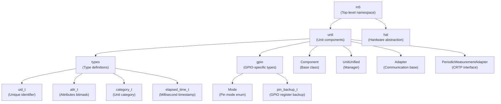
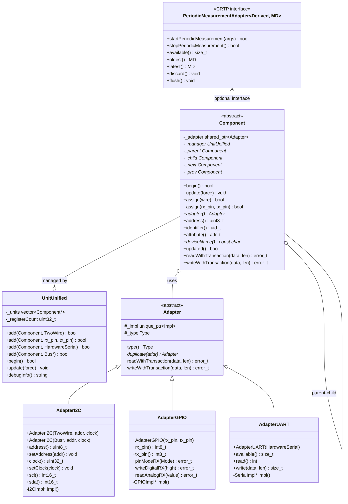
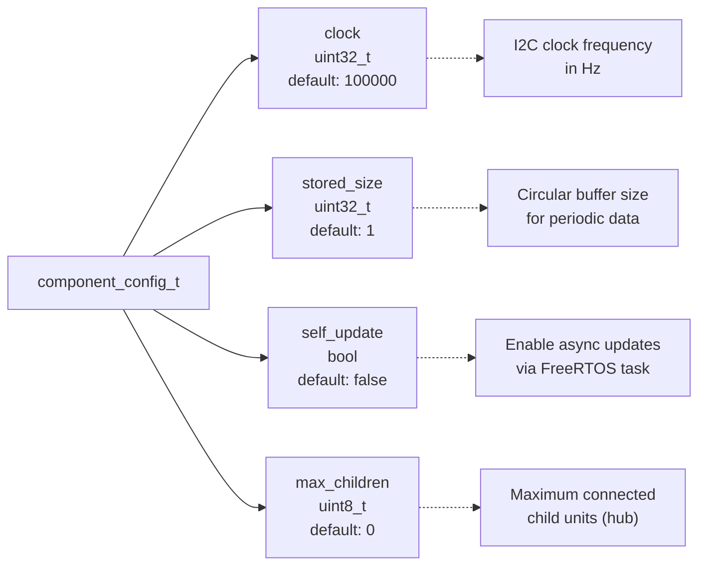
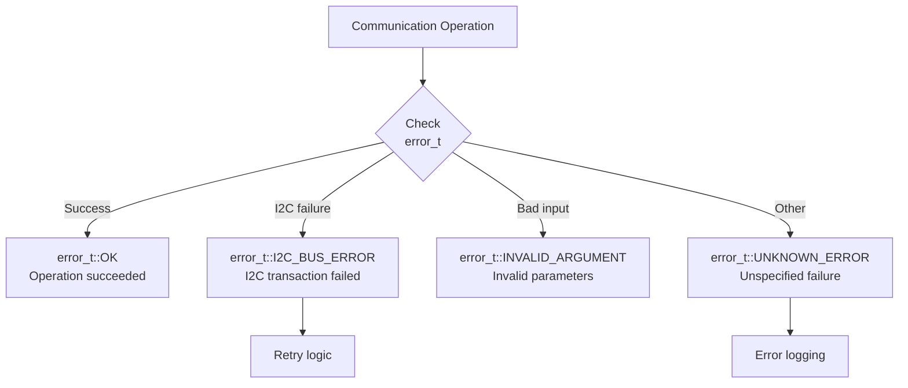
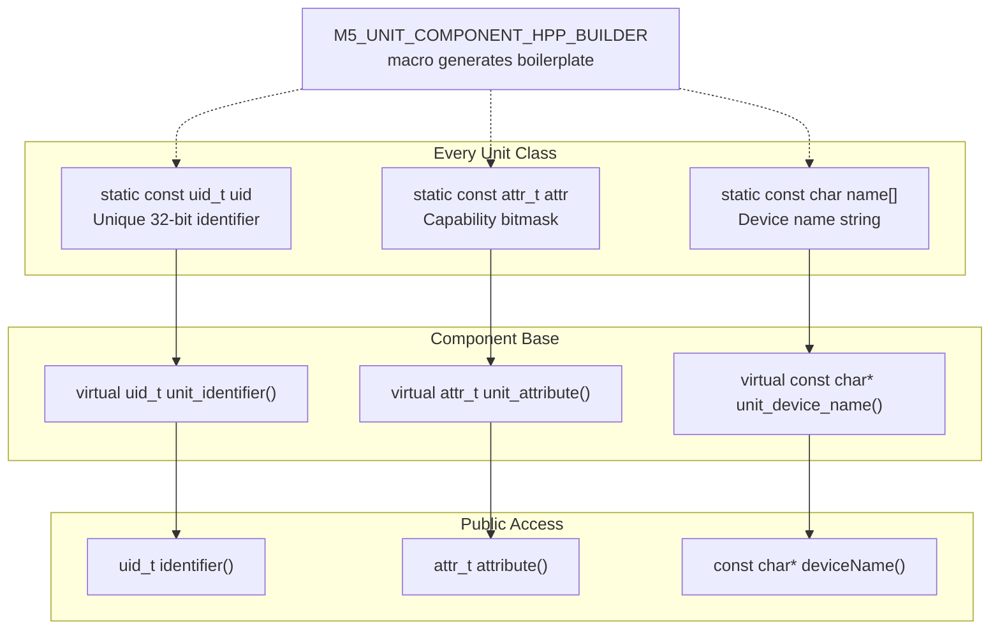
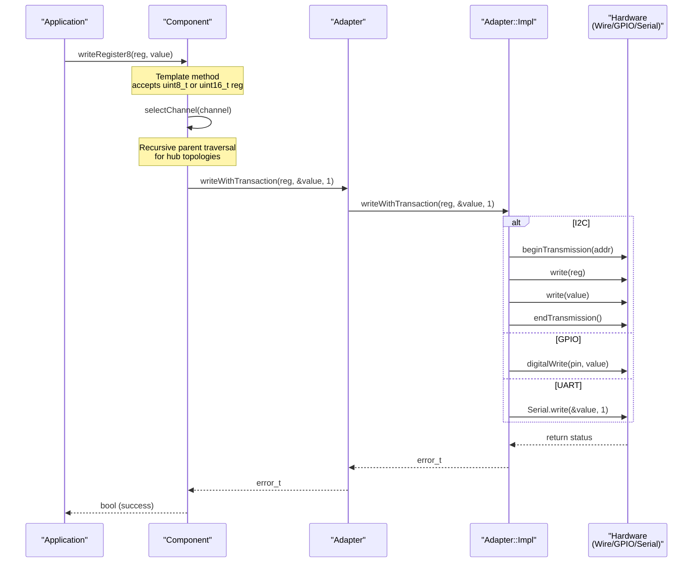
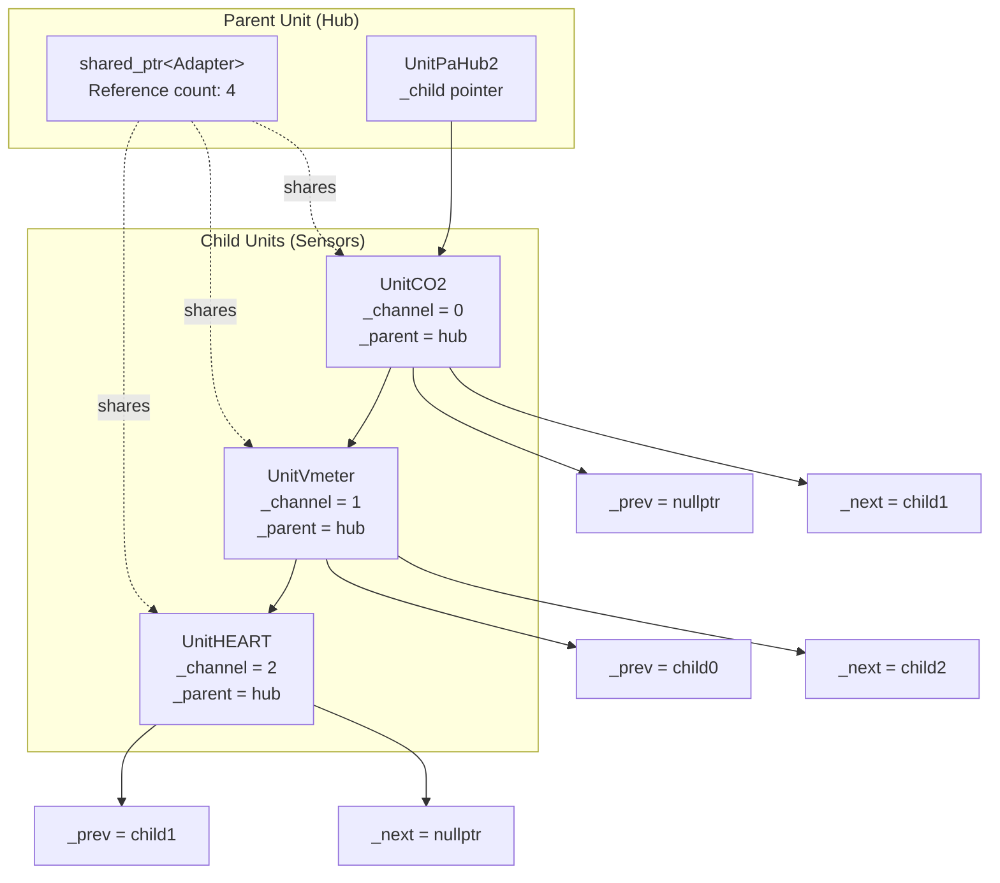
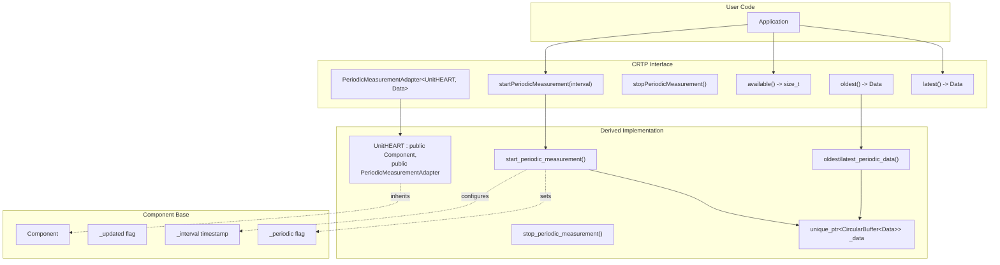

M5UnitUnified API Reference

# API Reference

<details>
<summary>Relevant source files</summary>

The following files were used as context for generating this wiki page:

- [library.json](library.json)
- [library.properties](library.properties)
- [src/M5UnitComponent.cpp](src/M5UnitComponent.cpp)
- [src/M5UnitComponent.hpp](src/M5UnitComponent.hpp)
- [src/M5UnitUnified.cpp](src/M5UnitUnified.cpp)
- [src/M5UnitUnified.hpp](src/M5UnitUnified.hpp)
- [src/m5_unit_component/adapter_base.hpp](src/m5_unit_component/adapter_base.hpp)
- [src/m5_unit_component/adapter_gpio_v1.hpp](src/m5_unit_component/adapter_gpio_v1.hpp)
- [src/m5_unit_component/adapter_i2c.cpp](src/m5_unit_component/adapter_i2c.cpp)
- [src/m5_unit_component/adapter_i2c.hpp](src/m5_unit_component/adapter_i2c.hpp)

</details>


This page provides a comprehensive overview of the M5UnitUnified library's public API. It documents the core classes, their relationships, and common usage patterns for integrating M5Stack sensor units into your applications.

For detailed method-level documentation, see:
- Component base class methods: [Component API](#9.1)
- UnitUnified manager methods: [UnitUnified API](#9.2)
- Communication adapter interfaces: [Adapter APIs](#9.3)

For implementation examples, see [Usage Patterns](#5).

---

## Namespace Organization

The M5UnitUnified library uses a hierarchical namespace structure to organize its classes and types:



**Primary namespaces:**
- `m5::unit` - Contains all component and manager classes
- `m5::unit::types` - Type aliases and enumerations
- `m5::unit::gpio` - GPIO-specific functionality
- `m5::hal` - Hardware abstraction layer (from M5HAL dependency)

Sources: [src/M5UnitComponent.hpp:25-27](), [src/M5UnitUnified.hpp:32-40]()

---

## Core Class Hierarchy

The library's architecture centers on three primary class hierarchies:



**Key relationships:**
- `Component` is the abstract base class for all sensor units
- `UnitUnified` manages multiple `Component` instances
- `Component` uses `Adapter` for protocol-agnostic communication
- Components can form parent-child hierarchies (hub topologies)
- `PeriodicMeasurementAdapter` is a CRTP interface for time-series data

Sources: [src/M5UnitComponent.hpp:35-588](), [src/M5UnitUnified.hpp:47-117](), [src/m5_unit_component/adapter_base.hpp:25-229](), [src/m5_unit_component/adapter_i2c.hpp:25-243]()

---

## Type System

The library defines specialized types for improved type safety and code clarity:

| Type | Definition | Purpose |
|------|-----------|---------|
| `types::uid_t` | `uint32_t` | Unique identifier for each unit type (e.g., `0x12345678`) |
| `types::attr_t` | `uint32_t` | Bitmask of unit capabilities (I2C/GPIO/UART access) |
| `types::category_t` | `enum` | Unit category classification (ENV, METER, SENSOR, etc.) |
| `types::elapsed_time_t` | `uint32_t` | Millisecond timestamps from system start |
| `gpio::Mode` | `enum` | GPIO pin mode (Input, Output, InputPullup, etc.) |

**Attribute bitmask flags:**
```cpp
namespace m5::unit::types::attribute {
    constexpr attr_t AccessI2C   = (1 << 0);  // Can communicate via I2C
    constexpr attr_t AccessGPIO  = (1 << 1);  // Can communicate via GPIO
    constexpr attr_t AccessUART  = (1 << 2);  // Can communicate via UART
    // Additional flags defined in types.hpp
}
```

**Usage example:**
```cpp
// Check if unit supports I2C communication
if (component.canAccessI2C()) {
    // Unit has AccessI2C attribute set
}
```

Sources: [src/m5_unit_component/types.hpp]()

---

## Component Configuration

Each `Component` instance can be configured through the `component_config_t` structure:



**Configuration pattern:**
```cpp
auto unit = UnitCO2();
auto cfg = unit.component_config();
cfg.clock = 400000;              // 400kHz I2C
cfg.stored_size = 10;            // Store 10 measurements
cfg.self_update = false;         // Manager calls update()
unit.component_config(cfg);
```

Sources: [src/M5UnitComponent.hpp:41-50](), [src/M5UnitComponent.hpp:83-92]()

---

## Error Handling

All communication operations return `m5::hal::error::error_t` enum values:



**Error handling pattern:**
```cpp
// Direct error check
auto err = component.writeWithTransaction(data, len);
if (err != m5::hal::error::error_t::OK) {
    M5_LIB_LOGE("Write failed: %d", (int)err);
}

// Boolean convenience methods
if (!component.writeRegister8(reg, value)) {
    // Operation failed
}
```

**Common error codes:**
- `OK` - Operation completed successfully
- `I2C_BUS_ERROR` - I2C NACK or timeout
- `INVALID_ARGUMENT` - Null pointer or invalid parameter
- `UNKNOWN_ERROR` - Default failure state

Sources: [src/M5UnitComponent.cpp:166-177](), [src/M5UnitComponent.cpp:192-202]()

---

## Static Member Pattern

Unit classes define three static members for identification and capabilities:



**Implementation via builder macro:**
```cpp
// In derived unit class header
class UnitCO2 : public Component {
    M5_UNIT_COMPONENT_HPP_BUILDER(UnitCO2, 0x62);
    // Expands to:
    // static constexpr uint8_t DEFAULT_ADDRESS{0x62};
    // static const types::uid_t uid;
    // static const types::attr_t attr;
    // static const char name[];
    // ... and virtual function overrides
};

// In derived unit class implementation
const types::uid_t UnitCO2::uid{0x87654321};
const types::attr_t UnitCO2::attr{types::attribute::AccessI2C};
const char UnitCO2::name[] = "UnitCO2";
```

Sources: [src/M5UnitComponent.hpp:52-58](), [src/M5UnitComponent.hpp:694-721]()

---

## Communication API Pattern

All three communication protocols follow a consistent transaction-based API:



**Common I2C operations:**
- `readWithTransaction(data, len)` - Read raw bytes
- `writeWithTransaction(data, len)` - Write raw bytes
- `readRegister8(reg, result, delay)` - Read 8-bit register
- `writeRegister8(reg, value)` - Write 8-bit register
- `readRegister16BE/LE(reg, result, delay)` - Read 16-bit register (big/little endian)
- `writeRegister16BE/LE(reg, value)` - Write 16-bit register

**Register templates:**
```cpp
// Supports both 8-bit and 16-bit register addresses
template <typename Reg>
bool readRegister(const Reg reg, uint8_t* rbuf, const size_t len, 
                  const uint32_t delayMillis, const bool stop = true);
```

Sources: [src/M5UnitComponent.hpp:348-440](), [src/M5UnitComponent.cpp:179-280]()

---

## Lifecycle Methods

Components follow a standard lifecycle managed by `UnitUnified`:

```mermaid
stateDiagram-v2
    [*] --> Constructed : new UnitXXX()
    
    Constructed --> Configured : component_config(cfg)
    Configured --> Assigned : UnitUnified::add()
    
    note right of Assigned
        Adapter created
        Parent/children linked
        _manager pointer set
    end note
    
    Assigned --> Initialized : UnitUnified::begin()
    
    note right of Initialized
        begin() called
        Hardware initialized
        _begun flag set
    end note
    
    Initialized --> Updating : UnitUnified::update()
    Updating --> Updating : update() loop
    
    note right of Updating
        Periodic: update() called by manager
        Self-update: update() called by FreeRTOS task
    end note
    
    Updating --> [*] : Destruction
```

**Required overrides:**
```cpp
class MyUnit : public Component {
public:
    // Initialize hardware, start measurements
    virtual bool begin() override {
        // Return true if successful
    }
    
    // Read sensor data, update internal state
    virtual void update(const bool force = false) override {
        // Set _updated flag when new data available
    }
};
```

**Lifecycle guarantees:**
- `begin()` called exactly once after assignment
- `update()` called repeatedly only if `begin()` returned true
- `update()` skipped for units with `self_update=true`

Sources: [src/M5UnitComponent.hpp:96-112](), [src/M5UnitUnified.cpp:124-144]()

---

## Parent-Child Relationships

Components support hierarchical topologies for hub-based configurations:



**API methods:**
- `add(Component& child, channel)` - Connect child to specific channel
- `hasParent()` - Check if unit has a parent
- `hasSiblings()` - Check if other units share the same parent
- `hasChildren()` - Check if unit has connected children
- `childrenSize()` - Count of connected children
- `existsChild(channel)` - Check if channel is occupied
- `child(channel)` - Get child at specific channel
- `selectChannel(channel)` - Recursively configure hub chain

**Usage pattern:**
```cpp
// Create hub and sensors
auto hub = UnitPaHub2();
auto co2 = UnitCO2();
auto vmeter = UnitVmeter();

// Connect sensors to hub channels
hub.add(co2, 0);
hub.add(vmeter, 1);

// Register only the hub - children registered automatically
Units.add(hub, Wire);
```

Sources: [src/M5UnitComponent.hpp:234-272](), [src/M5UnitComponent.cpp:62-123]()

---

## Periodic Measurement Interface

Units with time-series data inherit from `PeriodicMeasurementAdapter` (CRTP pattern):



**Required implementation:**
```cpp
class UnitHEART : public Component, 
                  public PeriodicMeasurementAdapter<UnitHEART, Data> {
    // Macro generates interface implementations
    M5_UNIT_COMPONENT_PERIODIC_MEASUREMENT_ADAPTER_HPP_BUILDER(UnitHEART, Data);
    
protected:
    // User implements these
    bool start_periodic_measurement();
    bool stop_periodic_measurement();
    Data oldest_periodic_data() const;
    Data latest_periodic_data() const;
    
    // Required data member
    std::unique_ptr<m5::container::CircularBuffer<Data>> _data{};
};
```

**Usage pattern:**
```cpp
unit.startPeriodicMeasurement();  // Begin collecting data

if (unit.updated()) {
    auto data = unit.latest();    // Get most recent reading
    // Process data...
}

size_t count = unit.available();  // Check buffer occupancy
```

Sources: [src/M5UnitComponent.hpp:590-687](), [src/M5UnitComponent.hpp:724-755]()

---

## Detailed API Documentation

For complete method signatures, parameters, and usage examples:

- **[Component API](#9.1)** - Full Component class reference including:
  - Lifecycle methods (`begin()`, `update()`)
  - Communication methods (I2C, GPIO, UART)
  - Property accessors
  - Parent-child management
  - Iterator interface

- **[UnitUnified API](#9.2)** - UnitUnified manager reference including:
  - Unit registration methods
  - Batch operations (`begin()`, `update()`)
  - Debugging utilities

- **[Adapter APIs](#9.3)** - Communication adapter reference including:
  - AdapterI2C (TwoWire and M5HAL implementations)
  - AdapterGPIO (RMT v1/v2 support)
  - AdapterUART (HardwareSerial interface)

Sources: [src/M5UnitComponent.hpp](), [src/M5UnitUnified.hpp](), [src/m5_unit_component/adapter_base.hpp](), [src/m5_unit_component/adapter_i2c.hpp]()