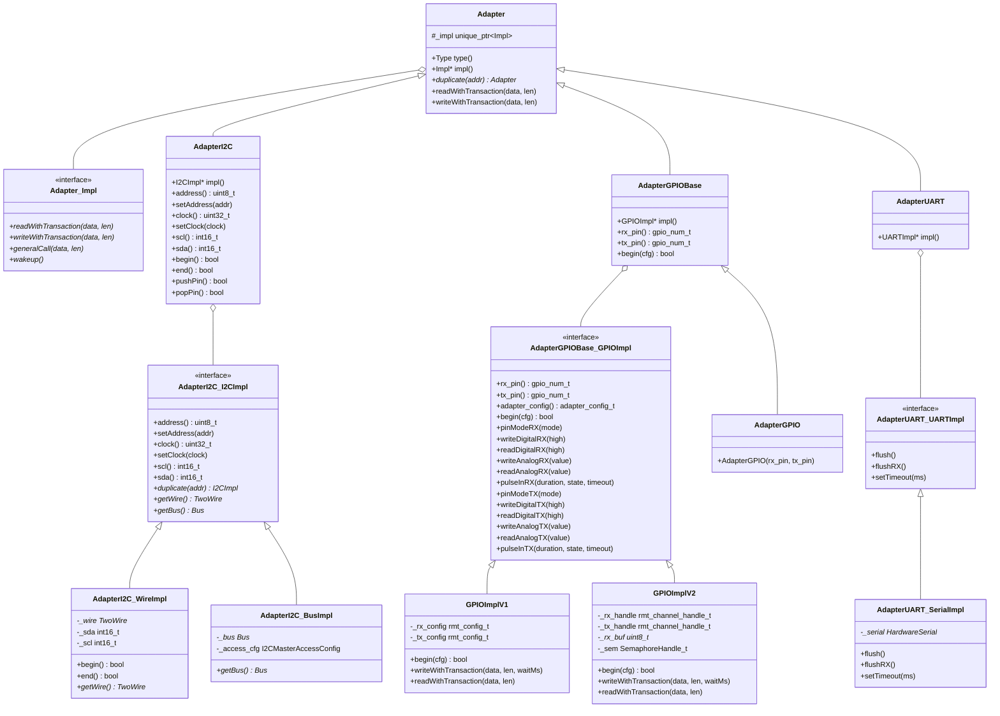
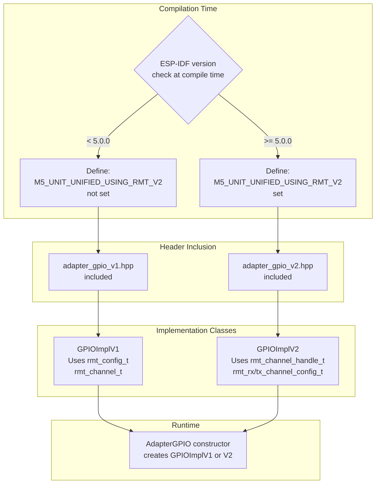
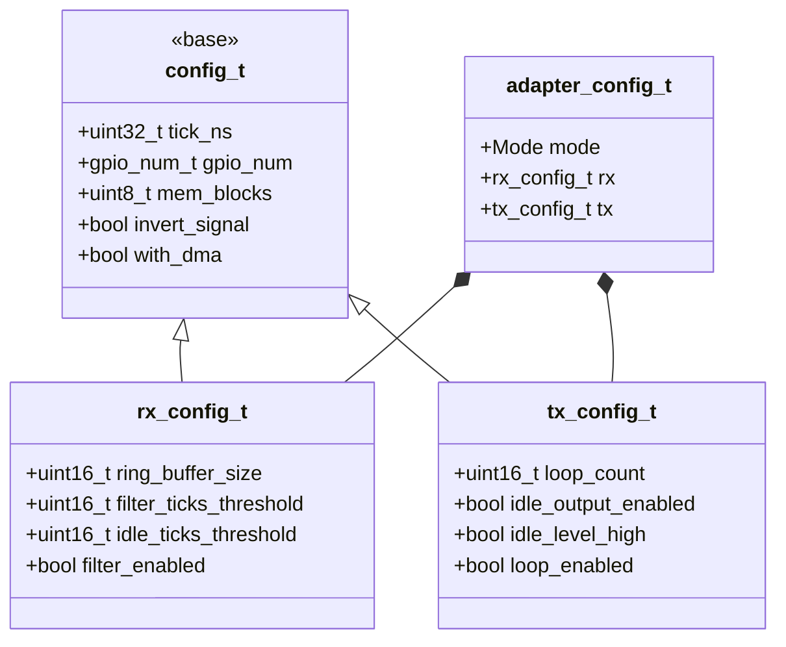
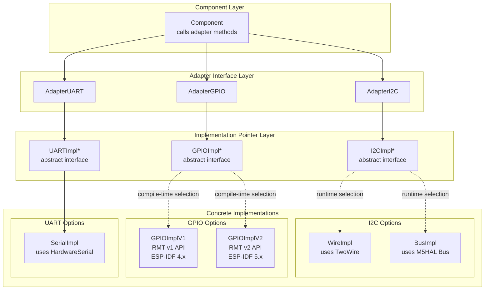
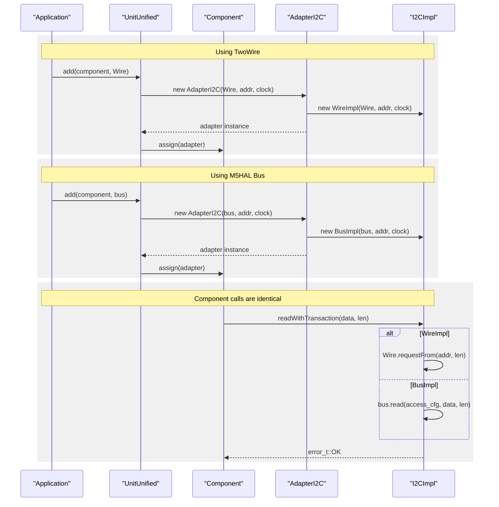

M5UnitUnified Adapter APIs

# Adapter APIs

<details>
<summary>Relevant source files</summary>

The following files were used as context for generating this wiki page:

- [library.json](library.json)
- [library.properties](library.properties)
- [src/googletest/test_helper.hpp](src/googletest/test_helper.hpp)
- [src/googletest/test_template.hpp](src/googletest/test_template.hpp)
- [src/m5_unit_component/adapter.cpp](src/m5_unit_component/adapter.cpp)
- [src/m5_unit_component/adapter.hpp](src/m5_unit_component/adapter.hpp)
- [src/m5_unit_component/adapter_gpio.cpp](src/m5_unit_component/adapter_gpio.cpp)
- [src/m5_unit_component/adapter_gpio.hpp](src/m5_unit_component/adapter_gpio.hpp)
- [src/m5_unit_component/adapter_gpio_v1.cpp](src/m5_unit_component/adapter_gpio_v1.cpp)
- [src/m5_unit_component/adapter_gpio_v2.cpp](src/m5_unit_component/adapter_gpio_v2.cpp)
- [src/m5_unit_component/adapter_gpio_v2.hpp](src/m5_unit_component/adapter_gpio_v2.hpp)
- [src/m5_unit_component/adapter_i2c.hpp](src/m5_unit_component/adapter_i2c.hpp)
- [src/m5_unit_component/adapter_uart.cpp](src/m5_unit_component/adapter_uart.cpp)
- [src/m5_unit_component/identify_functions.hpp](src/m5_unit_component/identify_functions.hpp)
- [src/m5_unit_component/types.hpp](src/m5_unit_component/types.hpp)

</details>


## Purpose and Scope

This page documents the complete API reference for adapter classes in M5UnitUnified. Adapters abstract communication protocols (I2C, GPIO/RMT, UART) and provide runtime polymorphism to support multiple implementations of each protocol. This enables Components to communicate with hardware through Arduino APIs (TwoWire, GPIO, HardwareSerial) or M5HAL APIs transparently.

For usage patterns with adapters, see [Usage Patterns](#5). For adapter design principles and parent-child hierarchies, see [Adapter Pattern](#3.3).

---

## Adapter Base Class

The `Adapter` class serves as the abstract base for all communication adapters. It uses the **Bridge pattern** with implementation pointers (`Impl` classes) to provide runtime polymorphism.

### Class Hierarchy



**Sources:** [src/m5_unit_component/adapter.hpp:1-24](), [src/m5_unit_component/adapter_i2c.hpp:1-247](), [src/m5_unit_component/adapter_gpio.hpp:1-164](), [src/m5_unit_component/adapter_uart.cpp:1-66]()

### Adapter Types

The `Adapter::Type` enumeration identifies the communication protocol:

| Type | Description | Enum Value |
|------|-------------|------------|
| `I2C` | I²C bus communication | Typically 0 |
| `GPIO` | GPIO and RMT peripheral access | Typically 1 |
| `UART` | UART serial communication | Typically 2 |

---

## AdapterI2C API

`AdapterI2C` abstracts I²C bus communication, supporting both Arduino's `TwoWire` and M5HAL's `Bus` interfaces.

### Construction

#### Arduino TwoWire Constructor
```cpp
AdapterI2C(TwoWire& wire, uint8_t addr, const uint32_t clock);
```

Creates an adapter using Arduino's `Wire` library.

**Parameters:**
- `wire`: Reference to `TwoWire` instance (e.g., `Wire`, `Wire1`)
- `addr`: I²C device address (7-bit)
- `clock`: Bus clock frequency in Hz (default: 100000)

#### M5HAL Bus Constructor
```cpp
AdapterI2C(m5::hal::bus::Bus* bus, const uint8_t addr, const uint32_t clock);
AdapterI2C(m5::hal::bus::Bus& bus, const uint8_t addr, const uint32_t clock);
```

Creates an adapter using M5HAL's bus abstraction.

**Parameters:**
- `bus`: Pointer or reference to M5HAL `Bus` instance
- `addr`: I²C device address (7-bit)
- `clock`: Bus clock frequency in Hz

**Sources:** [src/m5_unit_component/adapter_i2c.hpp:173-179]()

### Address and Clock Management

#### address()
```cpp
uint8_t address() const;
```

Returns the current I²C device address.

#### setAddress()
```cpp
void setAddress(const uint8_t addr);
```

Changes the I²C device address. Used when switching between devices on the same bus or when components need address scanning.

#### clock()
```cpp
uint32_t clock() const;
```

Returns the configured bus clock frequency in Hz.

#### setClock()
```cpp
void setClock(const uint32_t clock);
```

Changes the bus clock frequency. For `BusImpl`, updates `_access_cfg.freq` immediately.

**Sources:** [src/m5_unit_component/adapter_i2c.hpp:190-207]()

### Pin Information

#### sda()
```cpp
int16_t sda() const;
```

Returns the SDA pin number, or -1 if unavailable.

#### scl()
```cpp
int16_t scl() const;
```

Returns the SCL pin number, or -1 if unavailable.

**Note:** Pin numbers are only available for `WireImpl`. `BusImpl` returns -1.

**Sources:** [src/m5_unit_component/adapter_i2c.hpp:209-216]()

### Transaction Methods

#### readWithTransaction()
```cpp
m5::hal::error::error_t readWithTransaction(uint8_t* data, const size_t len);
```

Performs a complete I²C read transaction.

**Parameters:**
- `data`: Buffer to receive data
- `len`: Number of bytes to read

**Returns:** `m5::hal::error::error_t::OK` on success, error code otherwise

#### writeWithTransaction() - Data Only
```cpp
m5::hal::error::error_t writeWithTransaction(const uint8_t* data, const size_t len, 
                                             const uint32_t stop);
```

Writes data to the I²C device.

**Parameters:**
- `data`: Buffer containing data to write
- `len`: Number of bytes to write
- `stop`: 1 to send STOP condition, 0 to omit (for repeated START)

#### writeWithTransaction() - 8-bit Register
```cpp
m5::hal::error::error_t writeWithTransaction(const uint8_t reg, const uint8_t* data, 
                                             const size_t len, const uint32_t stop);
```

Writes data to a specific 8-bit register address.

**Parameters:**
- `reg`: 8-bit register address
- `data`: Buffer containing data to write
- `len`: Number of bytes to write
- `stop`: 1 to send STOP condition, 0 to omit

#### writeWithTransaction() - 16-bit Register
```cpp
m5::hal::error::error_t writeWithTransaction(const uint16_t reg, const uint8_t* data, 
                                             const size_t len, const uint32_t stop);
```

Writes data to a specific 16-bit register address (sent big-endian).

**Sources:** [src/m5_unit_component/adapter_i2c.hpp:118-125](), [src/m5_unit_component/adapter_i2c.hpp:153-160]()

### Special Operations

#### wakeup()
```cpp
m5::hal::error::error_t wakeup();
```

Sends I²C wake-up sequence to device. Some sensors require this before first communication.

#### generalCall()
```cpp
m5::hal::error::error_t generalCall(const uint8_t* data, const size_t len);
```

Sends a general call command (address 0x00) to all devices on the bus.

**Sources:** [src/m5_unit_component/adapter_i2c.hpp:126-127](), [src/m5_unit_component/adapter_i2c.hpp:161-162]()

### Lifecycle Management

#### begin()
```cpp
bool begin();
```

Initializes the I²C interface. For `WireImpl`, this is a no-op (Wire already initialized). Returns `true` on success.

#### end()
```cpp
bool end();
```

Terminates the I²C interface.

**Warning:** These are temporary APIs that will be improved when fully integrated with M5HAL.

**Sources:** [src/m5_unit_component/adapter_i2c.hpp:224-231]()

### Pin Backup (Temporary API)

#### pushPin()
```cpp
bool pushPin();
```

Backs up current GPIO register state for SDA/SCL pins. Used by units that temporarily reconfigure pins.

#### popPin()
```cpp
bool popPin();
```

Restores previously backed-up GPIO register state.

**Warning:** Functionality required for specific units. Will be improved with M5HAL integration.

**Sources:** [src/m5_unit_component/adapter_i2c.hpp:232-234]()

### Duplication

#### duplicate()
```cpp
Adapter* duplicate(const uint8_t addr);
```

Creates a new adapter instance sharing the same bus but with a different device address. Used by hub components to create per-channel adapters.

**Sources:** [src/m5_unit_component/adapter_i2c.hpp:218]()

### Implementation Access

#### impl()
```cpp
I2CImpl* impl();
const I2CImpl* impl() const;
```

Returns pointer to the underlying implementation (`WireImpl` or `BusImpl`).

#### getWire()
```cpp
TwoWire* getWire();
```

Returns the `TwoWire*` if using `WireImpl`, otherwise `nullptr`.

#### getBus()
```cpp
m5::hal::bus::Bus* getBus();
```

Returns the `Bus*` if using `BusImpl`, otherwise `nullptr`.

**Sources:** [src/m5_unit_component/adapter_i2c.hpp:181-188](), [src/m5_unit_component/adapter_i2c.hpp:85-92]()

---

## AdapterGPIO API

`AdapterGPIO` abstracts GPIO operations and RMT (Remote Control) peripheral access. It supports dual implementations based on ESP-IDF version: RMT v1 (ESP-IDF 4.x) and RMT v2 (ESP-IDF 5.x).

### Version Selection



**Sources:** [src/m5_unit_component/identify_functions.hpp:21-25](), [src/m5_unit_component/adapter.hpp:17-21]()

### Construction

```cpp
AdapterGPIO(const int8_t rx_pin, const int8_t tx_pin);
```

Creates a GPIO/RMT adapter with specified pins.

**Parameters:**
- `rx_pin`: GPIO pin for RX/input operations (-1 if unused)
- `tx_pin`: GPIO pin for TX/output operations (-1 if unused)

**Implementation:** Constructor delegates to either `GPIOImplV1` or `GPIOImplV2` based on compile-time selection.

**Sources:** [src/m5_unit_component/adapter_gpio_v1.cpp:299-301](), [src/m5_unit_component/adapter_gpio_v2.cpp:410-412]()

### Pin Access

#### rx_pin()
```cpp
gpio_num_t rx_pin() const;
```

Returns the RX/input pin number.

#### tx_pin()
```cpp
gpio_num_t tx_pin() const;
```

Returns the TX/output pin number.

**Sources:** [src/m5_unit_component/adapter_gpio.hpp:146-153]()

### Configuration

#### adapter_config_t Structure

The `gpio::adapter_config_t` structure provides unified configuration for both RMT v1 and v2:



**Configuration Fields:**

| Field | Type | Description |
|-------|------|-------------|
| `mode` | `gpio::Mode` | Operating mode: `RmtRX`, `RmtTX`, or `RmtRXTX` |
| `rx.tick_ns` | `uint32_t` | RMT tick resolution in nanoseconds |
| `rx.ring_buffer_size` | `uint16_t` | Ring buffer size for RX (v1 only) |
| `rx.filter_ticks_threshold` | `uint16_t` | Minimum valid pulse duration in ticks |
| `rx.idle_ticks_threshold` | `uint16_t` | RX idle threshold (ticks for v1, µs for v2) |
| `rx.filter_enabled` | `bool` | Enable input signal filtering |
| `rx.invert_signal` | `bool` | Invert RX logic level |
| `rx.with_dma` | `bool` | Use DMA for RX (v2 only) |
| `tx.tick_ns` | `uint32_t` | RMT tick resolution in nanoseconds |
| `tx.loop_count` | `uint16_t` | Number of loop iterations (v2 only) |
| `tx.idle_output_enabled` | `bool` | Enable output when idle |
| `tx.idle_level_high` | `bool` | Idle level HIGH if true, LOW otherwise |
| `tx.loop_enabled` | `bool` | Enable TX loop mode |
| `tx.invert_signal` | `bool` | Invert TX logic level |
| `tx.with_dma` | `bool` | Use DMA for TX (v2 only) |
| `tx/rx.mem_blocks` | `uint8_t` | Memory blocks (v1) or symbol blocks (v2) |

**Sources:** [src/m5_unit_component/types.hpp:80-110]()

#### begin()
```cpp
bool begin(const gpio::adapter_config_t& cfg);
```

Initializes the GPIO/RMT adapter with specified configuration.

**RMT v1 Initialization:**
1. Retrieves available RMT channel from static channel bitmap
2. Configures `rmt_config_t` for TX/RX
3. Calls `rmt_config()` and `rmt_driver_install()`
4. Starts RX channel if configured
5. Marks channel as in-use

**RMT v2 Initialization:**
1. Creates TX channel handle via `rmt_new_tx_channel()`
2. Creates RX channel handle via `rmt_new_rx_channel()`
3. Registers RX callback for received data
4. Enables channels with `rmt_enable()`
5. Kicks initial `rmt_receive()` for RX

**Returns:** `true` on success, `false` on failure

**Sources:** [src/m5_unit_component/adapter_gpio_v1.cpp:138-233](), [src/m5_unit_component/adapter_gpio_v2.cpp:198-298]()

### GPIO Operations

#### Pin Mode

```cpp
m5::hal::error::error_t pinModeRX(const gpio::Mode m);
m5::hal::error::error_t pinModeTX(const gpio::Mode m);
```

Configures pin mode for RX or TX pin.

**Supported Modes:**
- `gpio::Mode::Input` - Digital input
- `gpio::Mode::Output` - Digital output
- `gpio::Mode::InputPullup` - Input with internal pullup
- `gpio::Mode::InputPulldown` - Input with internal pulldown
- `gpio::Mode::OutputOpenDrain` - Open-drain output
- `gpio::Mode::Analog` - Analog mode (ADC)

**Sources:** [src/m5_unit_component/adapter_gpio.hpp:68-99](), [src/m5_unit_component/adapter_gpio.cpp:349-358]()

#### Digital I/O

```cpp
m5::hal::error::error_t writeDigitalRX(const bool high);
m5::hal::error::error_t readDigitalRX(bool& high);
m5::hal::error::error_t writeDigitalTX(const bool high);
m5::hal::error::error_t readDigitalTX(bool& high);
```

Performs digital read/write on RX or TX pins.

**Sources:** [src/m5_unit_component/adapter_gpio.cpp:360-371]()

#### Analog I/O

```cpp
m5::hal::error::error_t writeAnalogRX(const uint16_t value);
m5::hal::error::error_t readAnalogRX(uint16_t& value);
m5::hal::error::error_t writeAnalogTX(const uint16_t value);
m5::hal::error::error_t readAnalogTX(uint16_t& value);
```

Performs analog read/write (DAC/ADC) operations.

**Analog Write (DAC):**
- Only supported on GPIO 25 and 26 (ESP32)
- Output range: 0-255

**Analog Read (ADC):**
- Automatically determines ADC channel from GPIO number
- Supports ADC1 and ADC2 (where available)
- Returns raw ADC value (0-4095 for 12-bit resolution)
- Uses conditional compilation for ESP-IDF 4.x (`adc1_get_raw()`) vs 5.x (`adc_oneshot_read()`)

**Sources:** [src/m5_unit_component/adapter_gpio.cpp:373-461]()

#### Pulse Input

```cpp
m5::hal::error::error_t pulseInRX(uint32_t& duration, const int state, 
                                  const uint32_t timeout_us = 30000);
m5::hal::error::error_t pulseInTX(uint32_t& duration, const int state, 
                                  const uint32_t timeout_us = 30000);
```

Measures pulse duration (similar to Arduino's `pulseIn()`).

**Parameters:**
- `duration`: Output variable receiving pulse duration in microseconds
- `state`: Target pulse state (HIGH or LOW)
- `timeout_us`: Timeout in microseconds (default: 30ms)

**Returns:** `error_t::OK` on success, `error_t::TIMEOUT_ERROR` on timeout

**Sources:** [src/m5_unit_component/adapter_gpio.cpp:463-499]()

### RMT Operations

#### writeWithTransaction()
```cpp
m5::hal::error::error_t writeWithTransaction(const uint8_t* data, const size_t len, 
                                             const uint32_t waitMs);
```

Transmits RMT data.

**Parameters:**
- `data`: Buffer containing `rmt_item32_t` (v1) or `rmt_symbol_word_t` (v2) items
- `len`: Buffer length in bytes
- `waitMs`: Milliseconds to wait for transmission completion (0 = no wait)

**RMT v1 Implementation:**
- Calls `rmt_write_items()` with TX channel
- Optionally waits via `rmt_wait_tx_done()`

**RMT v2 Implementation:**
- Calls `rmt_transmit()` with copy encoder
- Optionally waits via `rmt_tx_wait_all_done()`

**Sources:** [src/m5_unit_component/adapter_gpio_v1.cpp:235-258](), [src/m5_unit_component/adapter_gpio_v2.cpp:300-321]()

#### readWithTransaction()
```cpp
m5::hal::error::error_t readWithTransaction(uint8_t* data, const size_t len);
```

Receives RMT data.

**Parameters:**
- `data`: Buffer to receive RMT items. First 2 bytes contain received length, followed by item data
- `len`: Buffer length in bytes (must be ≥ 4)

**RMT v1 Implementation:**
- Retrieves ringbuffer handle via `rmt_get_ringbuf_handle()`
- Reads from ringbuffer with 50ms timeout
- Stores received length in first 2 bytes of buffer

**RMT v2 Implementation:**
- Reads from internal buffer populated by RX callback
- Protected by semaphore for thread safety
- RX callback enqueues received data to FreeRTOS task

**Returns:** `error_t::OK` if data received, `error_t::TIMEOUT_ERROR` if no data available

**Sources:** [src/m5_unit_component/adapter_gpio_v1.cpp:260-293](), [src/m5_unit_component/adapter_gpio_v2.cpp:323-351]()

### Helper Functions

#### calculate_rmt_clk_div()
```cpp
uint8_t calculate_rmt_clk_div(const uint32_t apb_freq_hz, const uint32_t tick_ns);
```

Calculates RMT clock divider for v1 from desired tick resolution.

**Parameters:**
- `apb_freq_hz`: APB clock frequency (typically 80 MHz)
- `tick_ns`: Desired tick time in nanoseconds

**Returns:** Clock divider value (1-255)

**Sources:** [src/m5_unit_component/adapter_gpio.cpp:324-333]()

#### calculate_rmt_resolution_hz()
```cpp
uint32_t calculate_rmt_resolution_hz(const uint32_t apb_freq_hz, const uint32_t tick_ns);
```

Calculates RMT resolution in Hz for v2 from desired tick resolution.

**Parameters:**
- `apb_freq_hz`: APB clock frequency
- `tick_ns`: Desired tick time in nanoseconds

**Returns:** Resolution in Hz

**Sources:** [src/m5_unit_component/adapter_gpio.cpp:335-345]()

### RMT Item Types

#### m5_rmt_item_t Alias
```cpp
// RMT v1 (ESP-IDF 4.x)
using m5_rmt_item_t = rmt_item32_t;

// RMT v2 (ESP-IDF 5.x)
using m5_rmt_item_t = rmt_symbol_word_t;
```

Unified type alias for RMT data items across both API versions.

**Sources:** [src/m5_unit_component/types.hpp:112-117]()

---

## AdapterUART API

`AdapterUART` abstracts UART serial communication via Arduino's `HardwareSerial`.

### Construction

```cpp
AdapterUART(HardwareSerial& serial);
```

Creates a UART adapter using the specified serial port.

**Parameters:**
- `serial`: Reference to `HardwareSerial` instance (e.g., `Serial`, `Serial1`, `Serial2`)

**Sources:** [src/m5_unit_component/adapter_uart.cpp:58-61]()

### Buffer Management

#### flush()
```cpp
void flush();
```

Waits for outgoing serial data to be transmitted.

#### flushRX()
```cpp
void flushRX();
```

Discards all data in the RX buffer.

#### setTimeout()
```cpp
void setTimeout(const uint32_t ms);
```

Sets the timeout for read operations in milliseconds.

**Sources:** [src/m5_unit_component/adapter_uart.cpp:29-44]()

### Transaction Methods

#### readWithTransaction()
```cpp
m5::hal::error::error_t readWithTransaction(uint8_t* data, const size_t len);
```

Reads exactly `len` bytes from the serial port.

**Parameters:**
- `data`: Buffer to receive data
- `len`: Number of bytes to read

**Returns:** `error_t::OK` if all bytes received before timeout, `error_t::TIMEOUT_ERROR` otherwise

**Sources:** [src/m5_unit_component/adapter_uart.cpp:46-50]()

#### writeWithTransaction()
```cpp
m5::hal::error::error_t writeWithTransaction(const uint8_t* data, const size_t len, 
                                             const uint32_t unused);
```

Writes `len` bytes to the serial port.

**Parameters:**
- `data`: Buffer containing data to write
- `len`: Number of bytes to write
- `unused`: Ignored parameter (for API consistency)

**Returns:** `error_t::OK` if all bytes written successfully, `error_t::TIMEOUT_ERROR` otherwise

**Sources:** [src/m5_unit_component/adapter_uart.cpp:52-56]()

### Implementation Access

#### impl()
```cpp
UARTImpl* impl();
const UARTImpl* impl() const;
```

Returns pointer to the underlying `SerialImpl` implementation.

---

## Implementation Selection Pattern

### Dual Implementation Architecture



**Sources:** [src/m5_unit_component/adapter_i2c.hpp:27-97](), [src/m5_unit_component/adapter_gpio.hpp:40-134](), [src/m5_unit_component/adapter_uart.cpp:25-61]()

### Selection Mechanisms

| Adapter | Selection Type | Selection Mechanism |
|---------|----------------|---------------------|
| **AdapterI2C** | Runtime | Constructor argument: `TwoWire&` → `WireImpl`, `Bus*` → `BusImpl` |
| **AdapterGPIO** | Compile-time | Preprocessor macro `M5_UNIT_UNIFIED_USING_RMT_V2` based on ESP-IDF version |
| **AdapterUART** | Single implementation | Always uses `SerialImpl` with `HardwareSerial` |

### I2C Implementation Selection Example



**Sources:** [src/googletest/test_template.hpp:86-100]()

### GPIO Implementation Selection Example

The GPIO implementation is selected at **compile-time** via conditional compilation:

**Header Selection** [src/m5_unit_component/adapter.hpp:17-21]():
```cpp
#if defined(M5_UNIT_UNIFIED_USING_RMT_V2)
#include "adapter_gpio_v2.hpp"
#else
#include "adapter_gpio_v1.hpp"
#endif
```

**Constructor Implementation** varies by version:
- [src/m5_unit_component/adapter_gpio_v1.cpp:299-301]() creates `GPIOImplV1` for ESP-IDF 4.x
- [src/m5_unit_component/adapter_gpio_v2.cpp:410-412]() creates `GPIOImplV2` for ESP-IDF 5.x

**Version Detection** [src/m5_unit_component/identify_functions.hpp:21-25]():
```cpp
#if ESP_IDF_VERSION >= ESP_IDF_VERSION_VAL(5, 0, 0)
#define M5_UNIT_UNIFIED_USING_RMT_V2
#endif
```

---

## Error Handling

All transaction methods return `m5::hal::error::error_t` enum values:

| Error Code | Description |
|------------|-------------|
| `OK` | Operation completed successfully |
| `TIMEOUT_ERROR` | Operation timed out |
| `INVALID_ARGUMENT` | Invalid parameter provided |
| `UNKNOWN_ERROR` | Unspecified error occurred |
| `NOT_IMPLEMENTED` | Feature not yet implemented |

**Sources:** All adapter transaction methods throughout documentation

---

## Testing Support

The adapter APIs are designed to support comprehensive testing via GoogleTest framework:

### Test Base Classes

| Test Base Class | Purpose | Wire/Bus Support |
|-----------------|---------|------------------|
| `ComponentTestBase` | I2C component testing | Both `TwoWire` and M5HAL `Bus` |
| `GPIOComponentTestBase` | GPIO/RMT component testing | GPIO (M5HAL pending) |
| `UARTComponentTestBase` | UART component testing | `HardwareSerial` (M5HAL pending) |

Each test base class provides:
- Parameterized testing for dual implementations
- Automatic adapter creation and initialization
- `begin()` method wrapping UnitUnified setup
- `is_using_hal()` abstract method for implementation selection

**Sources:** [src/googletest/test_template.hpp:56-226]()