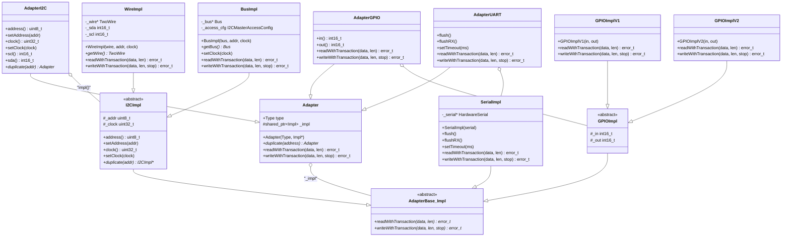
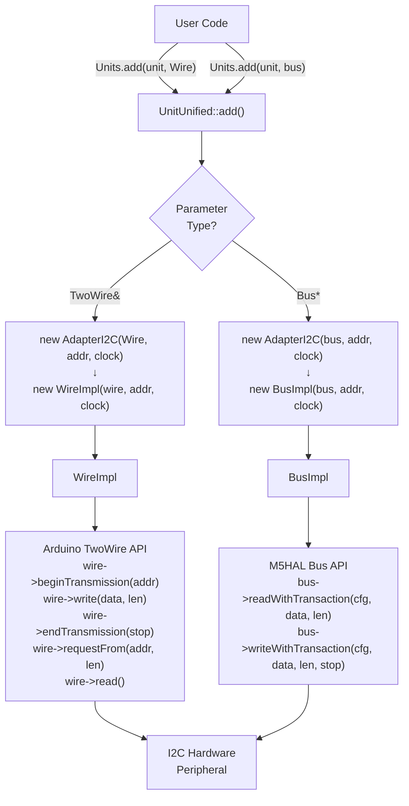
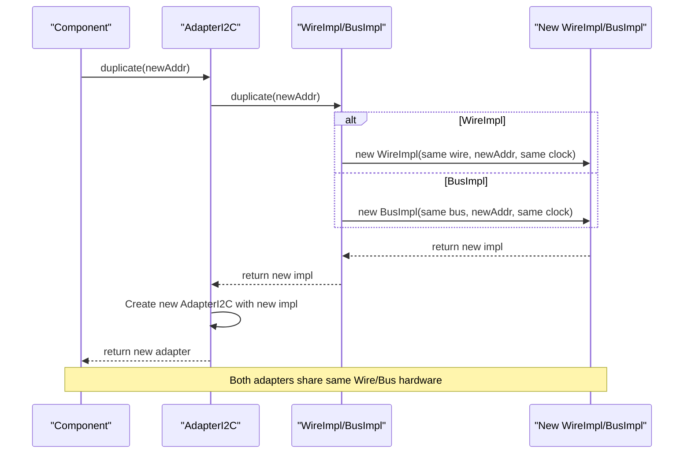
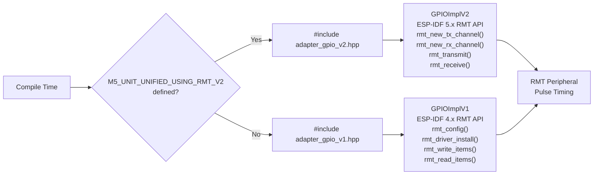
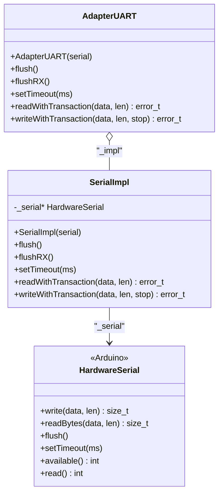
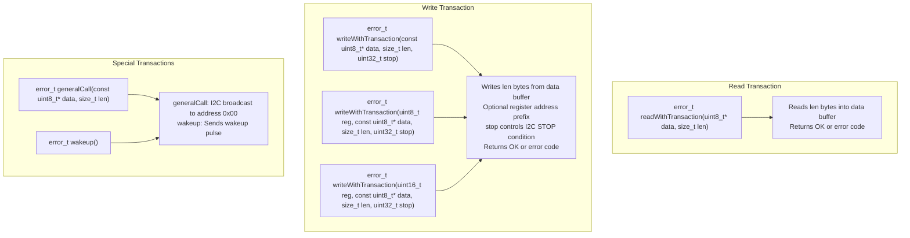
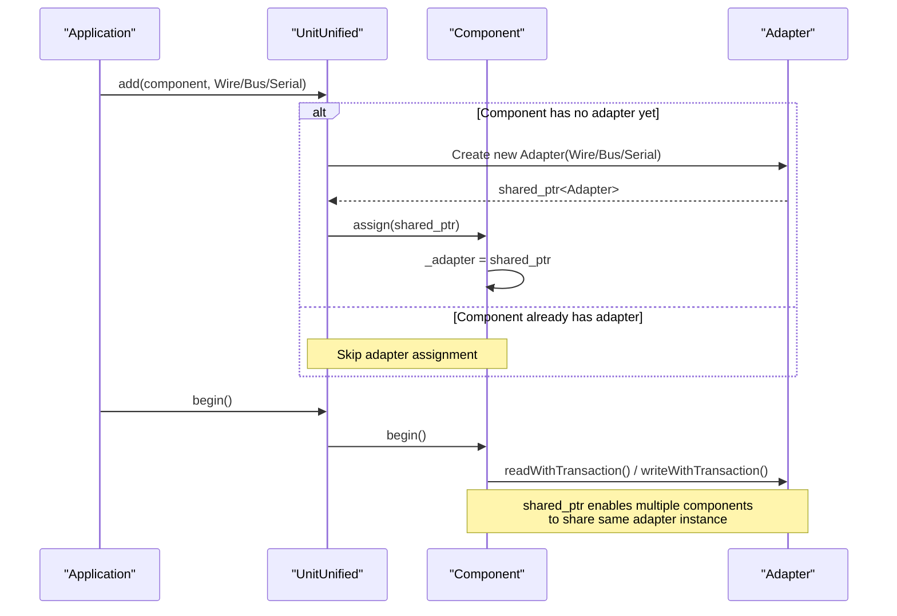
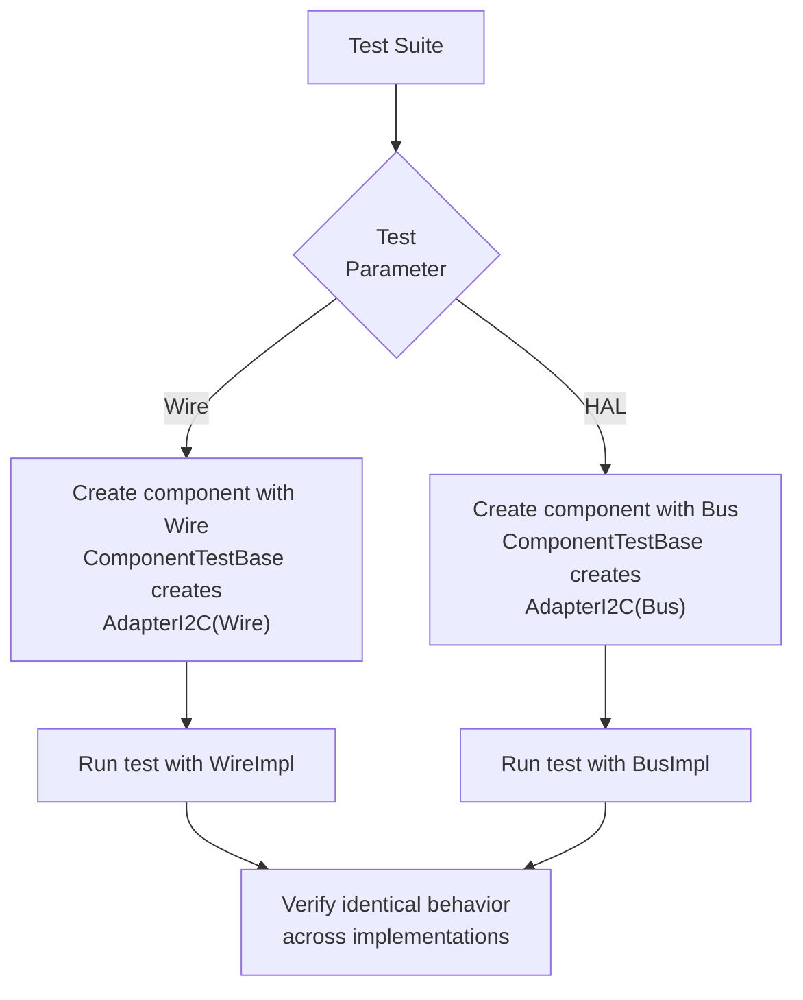

M5UnitUnified Adapter Pattern

# Adapter Pattern

Relevant source files

The following files were used as context for generating this wiki page:

- [library.json](library.json)
- [library.properties](library.properties)
- [src/googletest/test_helper.hpp](src/googletest/test_helper.hpp)
- [src/googletest/test_template.hpp](src/googletest/test_template.hpp)
- [src/m5_unit_component/adapter.cpp](src/m5_unit_component/adapter.cpp)
- [src/m5_unit_component/adapter.hpp](src/m5_unit_component/adapter.hpp)
- [src/m5_unit_component/adapter_i2c.hpp](src/m5_unit_component/adapter_i2c.hpp)
- [src/m5_unit_component/adapter_uart.cpp](src/m5_unit_component/adapter_uart.cpp)

## Purpose and Scope

This document explains the adapter pattern implementation in M5UnitUnified, which provides a unified interface for three communication protocols (I2C, GPIO/RMT, UART) while abstracting differences between Arduino and M5HAL APIs. The adapter layer enables components to communicate with hardware without knowing which underlying library (Arduino Wire, M5HAL Bus, HardwareSerial) is being used.

For information about how components use adapters, see [Component System](#3.1). For information about adapter sharing in hub topologies, see [Parent-Child Hierarchies](#3.4). For protocol-specific details, see [Communication Protocols](#4).

## Adapter Architecture Overview

The adapter pattern in M5UnitUnified uses a **pointer-to-implementation (pimpl)** idiom with runtime polymorphism. Each `Adapter` object contains a `std::shared_ptr<Adapter::Impl>` that points to a concrete implementation. This design allows:

1. **Runtime selection** between Arduino and M5HAL implementations
2. **Zero-cost abstraction** - no virtual calls in component code
3. **Adapter sharing** via `std::shared_ptr` among multiple components
4. **Implementation switching** without recompiling component code

### Adapter Class Hierarchy

**Sources:** [src/m5_unit_component/adapter_base.hpp](), [src/m5_unit_component/adapter_i2c.hpp:25-247](), [src/m5_unit_component/adapter_uart.hpp](), [src/m5_unit_component/adapter_gpio_v1.hpp](), [src/m5_unit_component/adapter_gpio_v2.hpp]()

## Adapter Type System

The `Adapter` base class defines three communication types via an enumeration:

| Type | Protocol | Use Case |
|------|----------|----------|
| `Adapter::Type::I2C` | I2C bus communication | Sensors with I2C interface (SCD40, SHT30, ADS1115, etc.) |
| `Adapter::Type::GPIO` | GPIO with RMT peripheral | Units requiring pulse timing (WS2812, DHT11/22, etc.) |
| `Adapter::Type::UART` | Serial UART communication | Units with serial interface (GPS, fingerprint readers, etc.) |

The type is stored in each `Adapter` instance and can be queried via the `type()` method. This allows components to verify they received the correct adapter type during initialization.

**Sources:** [src/m5_unit_component/adapter_base.hpp]()

## I2C Adapter Implementation Selection

The `AdapterI2C` class provides dual implementation paths that are selected at construction time based on the parameter type passed by the application.

### I2C Implementation Selection Logic

**Sources:** [src/m5_unit_component/adapter_i2c.hpp:101-136](), [src/m5_unit_component/adapter_i2c.hpp:139-171](), [src/m5_unit_component/adapter_i2c.hpp:174-179]()

### WireImpl: Arduino TwoWire Implementation

The `WireImpl` class wraps Arduino's `TwoWire` interface. It stores a pointer to the `TwoWire` instance and captures the SDA/SCL pin numbers during construction.

**Key Methods:**
- `WireImpl(TwoWire& wire, uint8_t addr, uint32_t clock)` - Constructor captures wire reference and pin numbers
- `readWithTransaction(uint8_t* data, size_t len)` - Performs `requestFrom()` and `read()` operations
- `writeWithTransaction(const uint8_t* data, size_t len, uint32_t stop)` - Performs `beginTransmission()`, `write()`, and `endTransmission()`
- `writeWithTransaction(uint8_t reg, ...)` - Overloads for register-based writes
- `duplicate(uint8_t addr)` - Creates new `WireImpl` with different address but same wire instance

**Implementation Details:**
The `writeWithTransaction()` methods use a helper function `write_with_transaction()` that handles the Arduino I2C transaction sequence. The `stop` parameter controls whether a STOP condition is sent, enabling repeated-start sequences.

**Sources:** [src/m5_unit_component/adapter_i2c.hpp:101-136](), [src/m5_unit_component/adapter_i2c.cpp]()

### BusImpl: M5HAL Bus Implementation

The `BusImpl` class wraps M5HAL's `Bus` interface, storing a pointer to the `Bus` and maintaining an `I2CMasterAccessConfig` structure for each transaction.

**Key Methods:**
- `BusImpl(m5::hal::bus::Bus* bus, uint8_t addr, uint32_t clock)` - Constructor initializes access configuration
- `setClock(uint32_t clock)` - Updates both `_clock` and `_access_cfg.freq`
- `readWithTransaction(uint8_t* data, size_t len)` - Calls `bus->readWithTransaction(cfg, data, len)`
- `writeWithTransaction(const uint8_t* data, size_t len, uint32_t stop)` - Calls `bus->writeWithTransaction(cfg, data, len, stop)`
- `duplicate(uint8_t addr)` - Creates new `BusImpl` with different address but same bus instance

**Implementation Details:**
The `_access_cfg` structure is populated with the device address and clock frequency during construction. Each transaction method passes this configuration to the underlying M5HAL Bus methods.

**Sources:** [src/m5_unit_component/adapter_i2c.hpp:139-171](), [src/m5_unit_component/adapter_i2c.cpp]()

### I2C Adapter Duplication Mechanism

Both implementations support the `duplicate(uint8_t addr)` method, which creates a new adapter instance sharing the same underlying hardware (Wire or Bus) but with a different I2C address. This is essential for components that need to communicate with multiple devices on the same bus or for hub devices that manage child components.

**Sources:** [src/m5_unit_component/adapter_i2c.hpp:80-83](), [src/m5_unit_component/adapter_i2c.cpp]()

## GPIO Adapter Implementation Selection

The `AdapterGPIO` class provides dual implementation paths selected at **compile time** based on the ESP-IDF version. The selection is controlled by conditional compilation directives in [src/m5_unit_component/adapter.hpp:17-21]().

### GPIO Version Detection and Selection

**Sources:** [src/m5_unit_component/adapter.hpp:17-21](), [src/m5_unit_component/adapter_gpio_v1.hpp](), [src/m5_unit_component/adapter_gpio_v2.hpp]()

### GPIO Implementation Characteristics

| Implementation | ESP-IDF Version | RMT API Style | Channel Management |
|----------------|-----------------|---------------|-------------------|
| `GPIOImplV1` | 4.x and earlier | Legacy driver API | Static channel allocation |
| `GPIOImplV2` | 5.x and later | New driver API | Dynamic handle-based allocation |

Both implementations provide the same interface to components:
- `readWithTransaction(uint8_t* data, size_t len)` - Read pulse timing data via RMT
- `writeWithTransaction(const uint8_t* data, size_t len, uint32_t stop)` - Write pulse timing data via RMT
- `in()` - Return input GPIO pin number
- `out()` - Return output GPIO pin number

For detailed information about RMT version handling, see [ESP-IDF Version Handling](#10.2).

**Sources:** [src/m5_unit_component/adapter_gpio_v1.hpp](), [src/m5_unit_component/adapter_gpio_v2.hpp]()

## UART Adapter Implementation

The `AdapterUART` class provides a single implementation path using Arduino's `HardwareSerial` interface through the `SerialImpl` class.

### SerialImpl: HardwareSerial Wrapper

**Key Methods:**
- `SerialImpl(HardwareSerial& serial)` - Constructor stores reference to serial instance
- `readWithTransaction(uint8_t* data, size_t len)` - Calls `serial->readBytes(data, len)` with timeout
- `writeWithTransaction(const uint8_t* data, size_t len, uint32_t stop)` - Calls `serial->write(data, len)` (stop parameter unused)
- `flush()` - Waits for transmission to complete via `serial->flush()`
- `flushRX()` - Discards all pending received data
- `setTimeout(uint32_t ms)` - Sets read timeout for blocking operations

**Implementation Details:**
The `readWithTransaction()` method returns `error_t::OK` if the expected number of bytes was read, or `error_t::TIMEOUT_ERROR` if fewer bytes were received. The `stop` parameter in `writeWithTransaction()` is ignored since UART has no equivalent to I2C STOP conditions.

**Sources:** [src/m5_unit_component/adapter_uart.hpp](), [src/m5_unit_component/adapter_uart.cpp:25-62]()

## Transaction-Based Communication Pattern

All adapter implementations follow a **transaction-based pattern** where read and write operations are atomic, self-contained operations. This design simplifies error handling and enables protocol-level abstractions.

### Transaction Method Signatures

**Sources:** [src/m5_unit_component/adapter_base.hpp](), [src/m5_unit_component/adapter_i2c.hpp:118-127]()

### Error Handling

All transaction methods return `m5::hal::error::error_t` values:

| Error Code | Meaning | Common Causes |
|------------|---------|---------------|
| `OK` | Transaction completed successfully | - |
| `TIMEOUT_ERROR` | Transaction timed out | Device not responding, incorrect address, bus conflict |
| `NACK_ERROR` | Device sent NACK | Invalid register address, device busy |
| `BUS_ERROR` | Bus error condition | SDA/SCL line stuck, electrical issue |
| `UNKNOWN_ERROR` | Unspecified error | Implementation-specific failure |

Components check the return value of transaction methods and handle errors appropriately, typically by setting their `_updated` flag to false and returning early from `update()`.

**Sources:** [src/m5_unit_component/adapter_base.hpp](), M5HAL library

## Adapter Lifecycle and Ownership

Adapters are managed through `std::shared_ptr<Adapter>` to enable sharing among multiple components, particularly in hub topologies where child components share their parent's adapter.

### Adapter Creation and Assignment Flow

**Sources:** [src/m5_unit_component/component.hpp](), [src/m5_unit_component/unit_unified.hpp]()

### Adapter Sharing in Parent-Child Relationships

When components form parent-child hierarchies (e.g., hub with attached sensors), all children receive a copy of the parent's `shared_ptr<Adapter>`. This ensures:

1. All components use the same underlying hardware interface
2. Reference counting prevents premature adapter destruction
3. Children can perform independent transactions without interfering with each other (assuming proper channel selection)

For details on how channel selection coordinates access, see [Parent-Child Hierarchies](#3.4).

**Sources:** [src/m5_unit_component/component.hpp](), [src/m5_unit_component/component.cpp]()

## Testing Adapter Implementations

The GoogleTest framework provides specialized base classes for testing components with different adapter types: `ComponentTestBase` for I2C, `GPIOComponentTestBase` for GPIO, and `UARTComponentTestBase` for UART.

### Parameterized Adapter Testing

The `ComponentTestBase::begin()` method checks the test parameter to determine whether to use `Wire` (Arduino) or `Bus` (M5HAL), enabling the same test to validate both implementation paths.

**Sources:** [src/googletest/test_template.hpp:86-100](), [src/googletest/test_template.hpp:142-161](), [src/googletest/test_template.hpp:203-213]()