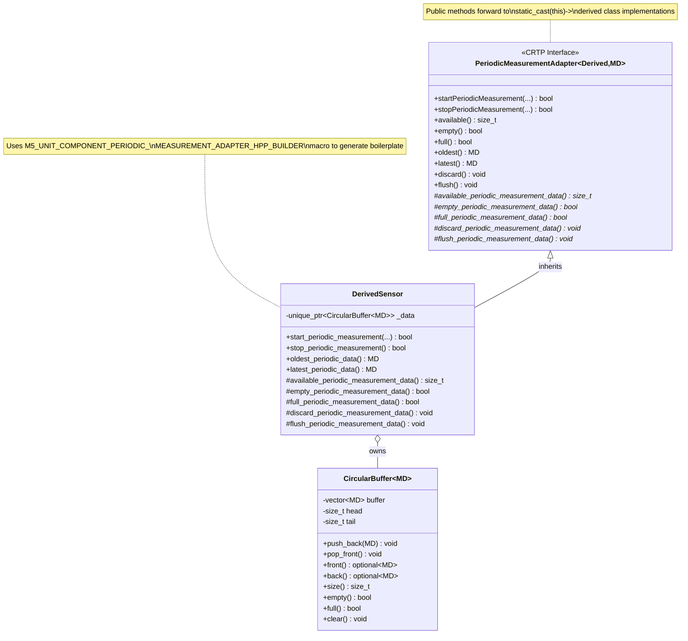
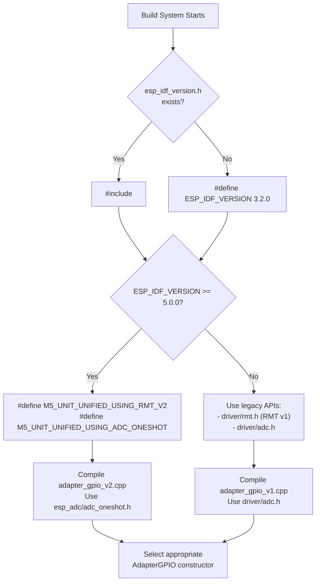
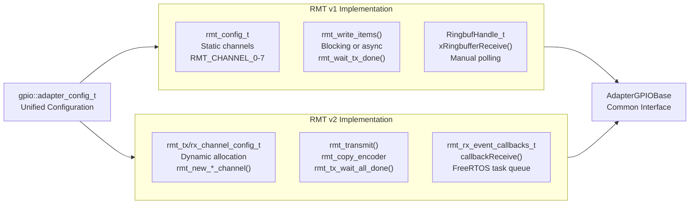

M5UnitUnified Advanced Topics

# Advanced Topics

<details>
<summary>Relevant source files</summary>

The following files were used as context for generating this wiki page:

- [src/M5UnitComponent.cpp](src/M5UnitComponent.cpp)
- [src/M5UnitComponent.hpp](src/M5UnitComponent.hpp)
- [src/M5UnitUnified.cpp](src/M5UnitUnified.cpp)
- [src/M5UnitUnified.hpp](src/M5UnitUnified.hpp)
- [src/m5_unit_component/adapter_base.hpp](src/m5_unit_component/adapter_base.hpp)
- [src/m5_unit_component/adapter_gpio.cpp](src/m5_unit_component/adapter_gpio.cpp)
- [src/m5_unit_component/adapter_gpio.hpp](src/m5_unit_component/adapter_gpio.hpp)
- [src/m5_unit_component/adapter_gpio_v1.cpp](src/m5_unit_component/adapter_gpio_v1.cpp)
- [src/m5_unit_component/adapter_gpio_v1.hpp](src/m5_unit_component/adapter_gpio_v1.hpp)
- [src/m5_unit_component/adapter_gpio_v2.cpp](src/m5_unit_component/adapter_gpio_v2.cpp)
- [src/m5_unit_component/adapter_gpio_v2.hpp](src/m5_unit_component/adapter_gpio_v2.hpp)
- [src/m5_unit_component/adapter_i2c.cpp](src/m5_unit_component/adapter_i2c.cpp)
- [src/m5_unit_component/identify_functions.hpp](src/m5_unit_component/identify_functions.hpp)
- [src/m5_unit_component/types.hpp](src/m5_unit_component/types.hpp)

</details>


This page covers specialized implementation techniques used within M5UnitUnified that enable advanced features. Topics include the CRTP-based periodic measurement pattern, ESP-IDF version compatibility handling, GPIO register backup mechanisms, and code generation macros. These topics are primarily relevant for library developers extending M5UnitUnified or debugging low-level issues.

For basic usage patterns, see [Usage Patterns](#5). For component implementation fundamentals, see [Component System](#3.1).

---

## 10.1 Periodic Measurement

The `PeriodicMeasurementAdapter` class provides a standardized interface for sensors that collect data at regular intervals. It uses the **Curiously Recurring Template Pattern (CRTP)** to enforce a consistent API while allowing derived classes to customize data storage and retrieval.

### CRTP Pattern Architecture



**Sources:** [src/M5UnitComponent.hpp:607-687]()

### Implementation Requirements

Components using `PeriodicMeasurementAdapter` must provide:

| Required Element | Description | Type |
|-----------------|-------------|------|
| `_data` member | Circular buffer for measurements | `std::unique_ptr<m5::container::CircularBuffer<MD>>` |
| `start_periodic_measurement()` | Begin data collection | Method returning `bool` |
| `stop_periodic_measurement()` | End data collection | Method returning `bool` |
| `oldest_periodic_data()` | Return oldest buffered sample | Method returning `MD` |
| `latest_periodic_data()` | Return newest buffered sample | Method returning `MD` |
| Pure virtual overrides | Implement 5 data access virtuals | Protected methods |

The template parameter `MD` represents the measurement data structure (e.g., `struct { float temp; float humi; }`).

### Configuration and Storage

Periodic measurement behavior is controlled through `Component::component_config_t`:

- **`stored_size`**: Maximum number of measurements retained in the circular buffer
- **`self_update`**: If `true`, component handles its own `update()` calls (typically via FreeRTOS task)

When `update()` is called (either by `UnitUnified::update()` or self-update task), the component populates the buffer and sets the `_updated` flag to indicate new data availability.

**Sources:** [src/M5UnitComponent.hpp:607-687](), [src/M5UnitComponent.hpp:41-50]()

### Builder Macro Usage

The `M5_UNIT_COMPONENT_PERIODIC_MEASUREMENT_ADAPTER_HPP_BUILDER` macro generates all required boilerplate implementations:

```cpp
// In derived class header
class UnitSCD40 : public Component, 
                  public PeriodicMeasurementAdapter<UnitSCD40, scd40_data_t> {
    M5_UNIT_COMPONENT_PERIODIC_MEASUREMENT_ADAPTER_HPP_BUILDER(UnitSCD40, scd40_data_t);
private:
    std::unique_ptr<m5::container::CircularBuffer<scd40_data_t>> _data{};
};
```

This macro expands to implementations of all pure virtual functions, delegating to `_data` methods:
- `available_periodic_measurement_data()` → `_data->size()`
- `empty_periodic_measurement_data()` → `_data->empty()`
- `oldest_periodic_data()` → `_data->front().value()`
- etc.

**Sources:** [src/M5UnitComponent.hpp:724-755]()

---

## 10.2 ESP-IDF Version Handling

M5UnitUnified supports multiple ESP-IDF versions by using conditional compilation to select appropriate API variants. This primarily affects RMT (Remote Control Transceiver) and ADC (Analog-to-Digital Converter) subsystems, which underwent significant API changes between ESP-IDF 4.x and 5.x.

### Version Detection Mechanism



**Sources:** [src/m5_unit_component/identify_functions.hpp:13-26]()

### RMT Version Selection

The RMT peripheral API changed fundamentally between versions:

| Aspect | RMT v1 (ESP-IDF ≤4.x) | RMT v2 (ESP-IDF ≥5.0) |
|--------|----------------------|----------------------|
| Header | `<driver/rmt.h>` | `<driver/rmt_tx.h>`, `<driver/rmt_rx.h>` |
| Channel Type | `rmt_channel_t` (enum) | `rmt_channel_handle_t` (opaque handle) |
| Configuration | `rmt_config_t` struct | Separate `rmt_tx_channel_config_t` / `rmt_rx_channel_config_t` |
| Data Type | `rmt_item32_t` | `rmt_symbol_word_t` |
| Initialization | `rmt_config()` + `rmt_driver_install()` | `rmt_new_tx_channel()` / `rmt_new_rx_channel()` |
| Transmission | `rmt_write_items()` + `rmt_wait_tx_done()` | `rmt_transmit()` + `rmt_tx_wait_all_done()` |
| Reception | Ringbuffer polling with `xRingbufferReceive()` | Callback-based with `rmt_rx_register_event_callbacks()` |

The library provides separate implementations:
- **`adapter_gpio_v1.cpp`**: Implements `GPIOImplV1` using RMT v1 APIs
- **`adapter_gpio_v2.cpp`**: Implements `GPIOImplV2` using RMT v2 APIs

At compile time, only one implementation is included based on `M5_UNIT_UNIFIED_USING_RMT_V2` definition.

**Sources:** [src/m5_unit_component/adapter_gpio_v1.cpp:13-306](), [src/m5_unit_component/adapter_gpio_v2.cpp:12-416](), [src/m5_unit_component/types.hpp:16-18]()

### Implementation Comparison



**Sources:** [src/m5_unit_component/types.hpp:80-110](), [src/m5_unit_component/adapter_gpio_v1.cpp:49-74](), [src/m5_unit_component/adapter_gpio_v2.cpp:23-71]()

### ADC API Selection

ADC configuration also differs between ESP-IDF versions:

**ESP-IDF 4.x (Legacy):**
```cpp
adc1_config_width(ADC_WIDTH_BIT_12);
adc1_config_channel_atten(channel, ADC_ATTEN_DB_12);
int value = adc1_get_raw(channel);
```

**ESP-IDF 5.x (Oneshot):**
```cpp
adc_oneshot_unit_init_cfg_t init_config = { .unit_id = ADC_UNIT_1, ... };
adc_oneshot_new_unit(&init_config, &adc_handle);
adc_oneshot_chan_cfg_t chan_config = { .atten = ADC_ATTEN_DB_12, ... };
adc_oneshot_config_channel(adc_handle, channel, &chan_config);
adc_oneshot_read(adc_handle, channel, &raw);
adc_oneshot_del_unit(adc_handle);
```

The library automatically selects the correct implementation at [src/m5_unit_component/adapter_gpio.cpp:392-461]() based on `M5_UNIT_UNIFIED_USING_ADC_ONESHOT`.

**Sources:** [src/m5_unit_component/adapter_gpio.cpp:14-20](), [src/m5_unit_component/adapter_gpio.cpp:392-461]()

### Conditional Compilation Guards

To prevent accidental mixing of RMT versions, the library includes compile-time checks:

```cpp
#if defined(M5_UNIT_UNIFIED_USING_RMT_V2) && defined(RMT_CHANNEL_0)
#error "RMT v1 is mixed in with RMT v2 even though RMT v2 is used"
#endif
```

This ensures that if RMT v2 is selected, no RMT v1 symbols (like `RMT_CHANNEL_0`) are present in the compilation unit.

**Sources:** [src/m5_unit_component/adapter_gpio_v1.cpp:307-309](), [src/m5_unit_component/adapter_gpio_v2.cpp:418-420]()

---

## 10.3 GPIO Pin Management

The library provides a `pin_backup_t` class for temporarily reconfiguring GPIO pins while preserving their original settings. This is essential for scenarios where a pin must be temporarily repurposed (e.g., I2C SDA/SCL pins used for bit-banging reset sequences).

### Use Case: I2C Pin Reconfiguration

When a sensor requires a specific reset sequence that cannot be performed via standard I2C commands, the library can:

1. **Backup** the current I2C pin configuration (SDA/SCL)
2. **Reconfigure** pins as GPIO outputs to drive reset signals
3. **Restore** original I2C pin matrix routing

This is implemented in `AdapterI2C` via `pin_backup_t` members `_backupSCL` and `_backupSDA`, with operations:

- `pushPin()`: Saves current pin configuration at [src/m5_unit_component/adapter_i2c.cpp:361-376]()
- `popPin()`: Restores saved configuration at [src/m5_unit_component/adapter_i2c.cpp:379-395]()

**Note:** This functionality is currently only implemented for Arduino-based builds (`#if defined(ARDUINO)`). The actual `pin_backup_t` class implementation is not present in the provided source files but is referenced in the `AdapterI2C` class.

**Sources:** [src/m5_unit_component/adapter_i2c.cpp:361-395]()

---

## 10.4 Builder Macros

M5UnitUnified uses preprocessor macros to automatically generate repetitive boilerplate code required by the component architecture. This reduces errors and ensures consistency across all unit implementations.

### Component Builder Macro

The `M5_UNIT_COMPONENT_HPP_BUILDER` macro generates static members and virtual function overrides required by every component:

```cpp
#define M5_UNIT_COMPONENT_HPP_BUILDER(cls, reg)                  \
public:                                                          \
    constexpr static uint8_t DEFAULT_ADDRESS{(reg)};             \
    static const types::uid_t uid;                               \
    static const types::attr_t attr;                             \
    static const char name[];                                    \
                                                                 \
    cls(const cls&) = delete;                                    \
    cls& operator=(const cls&) = delete;                         \
    cls(cls&&) noexcept = default;                               \
    cls& operator=(cls&&) noexcept = default;                    \
                                                                 \
protected:                                                       \
    inline virtual const char* unit_device_name() const override \
    { return name; }                                             \
    inline virtual types::uid_t unit_identifier() const override \
    { return uid; }                                              \
    inline virtual types::attr_t unit_attribute() const override \
    { return attr; }
```

**Usage Example:**

```cpp
class UnitSHT30 : public Component {
    M5_UNIT_COMPONENT_HPP_BUILDER(UnitSHT30, 0x44);
    // ... rest of implementation
};
```

This expands to:
- **`DEFAULT_ADDRESS`**: I2C address constant
- **Static members**: `uid`, `attr`, `name` (must be defined in .cpp file)
- **Copy/move semantics**: Deleted copy, defaulted move operations
- **Virtual overrides**: `unit_device_name()`, `unit_identifier()`, `unit_attribute()`

**Sources:** [src/M5UnitComponent.hpp:694-721]()

### Generated Code Obligations

Components using this macro must provide definitions in their `.cpp` file:

```cpp
// In UnitSHT30.cpp
const types::uid_t UnitSHT30::uid = 0x12345678;  // Unique 32-bit identifier
const types::attr_t UnitSHT30::attr = types::attribute::AccessI2C;
const char UnitSHT30::name[] = "UnitSHT30";
```

These static members enable:
- **Runtime type identification** via `component->identifier()`
- **Attribute checking** via `component->canAccessI2C()`
- **Debug output** via `component->deviceName()`

**Sources:** [src/M5UnitComponent.hpp:52-58](), [src/M5UnitComponent.cpp:20-22]()

### Periodic Measurement Builder Macro

For components implementing `PeriodicMeasurementAdapter`, a second macro generates the circular buffer interface:

```cpp
#define M5_UNIT_COMPONENT_PERIODIC_MEASUREMENT_ADAPTER_HPP_BUILDER(cls, md)    \
protected:                                                                     \
    friend class PeriodicMeasurementAdapter<cls, md>;                          \
                                                                               \
    inline md oldest_periodic_data() const                                     \
    { return !_data->empty() ? _data->front().value() : md{}; }                \
                                                                               \
    inline md latest_periodic_data() const                                     \
    { return !_data->empty() ? _data->back().value() : md{}; }                 \
                                                                               \
    inline virtual size_t available_periodic_measurement_data() const override \
    { return _data->size(); }                                                  \
                                                                               \
    inline virtual bool empty_periodic_measurement_data() const override       \
    { return _data->empty(); }                                                 \
                                                                               \
    inline virtual bool full_periodic_measurement_data() const override        \
    { return _data->full(); }                                                  \
                                                                               \
    inline virtual void discard_periodic_measurement_data() override           \
    { _data->pop_front(); }                                                    \
                                                                               \
    inline virtual void flush_periodic_measurement_data() override             \
    { _data->clear(); }
```

This macro assumes the component declares `std::unique_ptr<m5::container::CircularBuffer<md>> _data` and forwards all operations to it.

**Sources:** [src/M5UnitComponent.hpp:724-755]()

### Macro Benefits

| Aspect | Without Macro | With Macro |
|--------|--------------|------------|
| Lines of code | ~25 per component | 1 line |
| Consistency | Manual verification required | Guaranteed by macro |
| Maintenance | Update each component individually | Update macro once |
| Error risk | High (copy-paste mistakes) | Low (compiler-checked) |
| Readability | Cluttered with boilerplate | Clear intent visible |

**Sources:** [src/M5UnitComponent.hpp:694-757]()