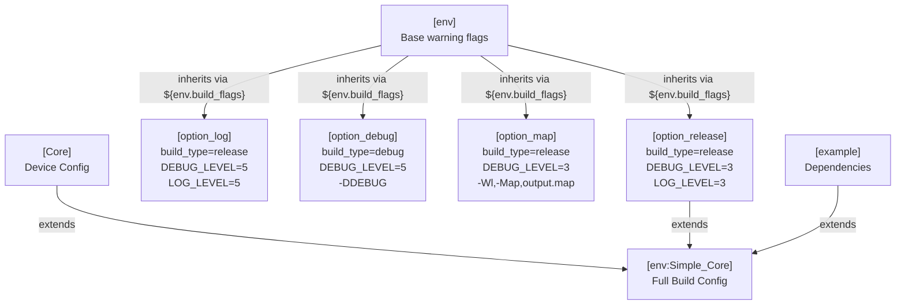
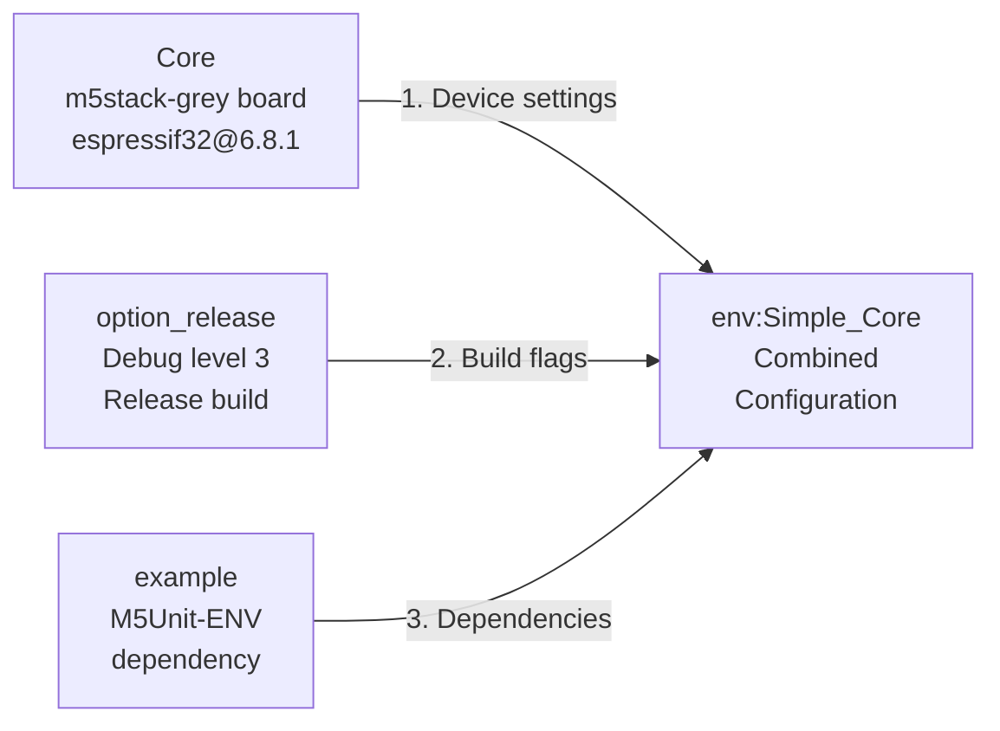
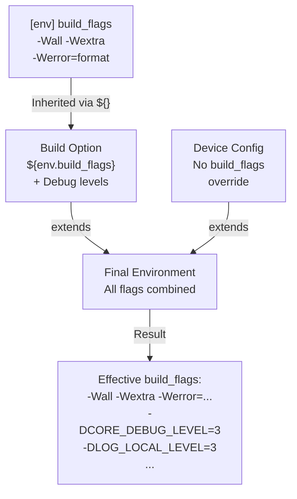

M5UnitUnified Build Options

# Build Options

<details>
<summary>Relevant source files</summary>

The following files were used as context for generating this wiki page:

- [README.ja.md](README.ja.md)
- [README.md](README.md)
- [platformio.ini](platformio.ini)

</details>


This page documents the four build option configurations available in the M5UnitUnified build system. These options control compiler optimization, debug symbols, and logging verbosity for different development scenarios.

For information about the overall PlatformIO configuration structure, see [PlatformIO Configuration](#6.1). For device-specific configurations that work with these build options, see [Supported Devices](#6.2).

## Overview

The M5UnitUnified build system provides four standardized build option configurations that can be combined with any device configuration. Each option section defines a specific set of compiler flags and debug levels optimized for different use cases:

| Option | Build Type | Debug Level | Primary Use Case |
|--------|------------|-------------|------------------|
| `option_release` | release | 3 (Warnings) | Production builds, minimal logging |
| `option_log` | release | 5 (Verbose) | Development with detailed logging |
| `option_debug` | debug | 5 (Verbose) | Interactive debugging with debugger |
| `option_map` | release | 3 (Warnings) | Memory analysis and optimization |

All options inherit base warning flags from the `[env]` section and extend them with configuration-specific settings.

**Sources:** [platformio.ini:126-156]()

## Build Option Inheritance Pattern



**Sources:** [platformio.ini:6-7,126-156,164-166]()

## Base Warning Flags

All build options inherit from the `[env]` section, which defines strict compiler warnings:

[platformio.ini:7]():
```ini
build_flags = -Wall -Wextra -Wreturn-local-addr -Werror=format -Werror=return-local-addr
```

| Flag | Purpose |
|------|---------|
| `-Wall` | Enable all standard warnings |
| `-Wextra` | Enable additional warnings not covered by -Wall |
| `-Wreturn-local-addr` | Warn about returning addresses of local variables |
| `-Werror=format` | Treat format string errors as compilation errors |
| `-Werror=return-local-addr` | Treat local address return as compilation error |

These flags are inherited by all build options via `${env.build_flags}` substitution.

**Sources:** [platformio.ini:6-7]()

## option_release

The `option_release` configuration is the default for production builds. It enables compiler optimizations while maintaining moderate logging for warning-level issues.

[platformio.ini:126-132]():
```ini
[option_release]
build_type=release
build_flags = ${env.build_flags}   
  -DCORE_DEBUG_LEVEL=3
  -DLOG_LOCAL_LEVEL=3
  -DAPP_LOG_LEVEL=3
  -DM5_LOG_LEVEL=3
```

### Configuration Details

| Setting | Value | Description |
|---------|-------|-------------|
| `build_type` | `release` | Enables -O2 optimization, strips debug symbols |
| `CORE_DEBUG_LEVEL` | `3` | ESP32 core warnings only |
| `LOG_LOCAL_LEVEL` | `3` | ESP-IDF log level: warnings |
| `APP_LOG_LEVEL` | `3` | Application log level: warnings |
| `M5_LOG_LEVEL` | `3` | M5Stack library log level: warnings |

### Debug Level Reference

| Level | Name | Output |
|-------|------|--------|
| 0 | None | No output |
| 1 | Error | Critical errors only |
| 2 | Warn | Warnings and errors |
| 3 | Info | Informational messages |
| 4 | Debug | Debug information |
| 5 | Verbose | All messages including trace |

### When to Use

- Final production builds
- Testing with realistic performance characteristics
- Minimal flash usage
- Battery-powered applications requiring optimization
- Most example builds (all `Simple_*`, `SelfUpdate_*`, `ComponentOnly_*`, `MultipleUnits_*` environments)

**Sources:** [platformio.ini:126-132,164-353]()

## option_log

The `option_log` configuration maintains release optimizations while enabling verbose logging for development and troubleshooting.

[platformio.ini:134-139]():
```ini
[option_log]
build_type=release
build_flags = ${env.build_flags} 
  -DCORE_DEBUG_LEVEL=5
  -DLOG_LOCAL_LEVEL=5
  -DAPP_LOG_LEVEL=5
```

### Configuration Details

| Setting | Value | Description |
|---------|-------|-------------|
| `build_type` | `release` | Maintains -O2 optimization |
| `CORE_DEBUG_LEVEL` | `5` | ESP32 core verbose logging |
| `LOG_LOCAL_LEVEL` | `5` | ESP-IDF verbose logging |
| `APP_LOG_LEVEL` | `5` | Application verbose logging |
| `M5_LOG_LEVEL` | Not set | Inherits default value |

### Key Differences from option_release

- **No `M5_LOG_LEVEL` override**: Allows M5Stack library logging at its default level
- **Verbose output**: Level 5 enables trace-level messages for detailed execution flow
- **Optimized code**: Unlike `option_debug`, maintains release optimizations

### When to Use

- Debugging issues that only occur with optimization enabled
- Analyzing component update timing and I2C transaction sequences
- Understanding adapter selection and channel switching behavior
- Troubleshooting hub topologies and parent-child communication
- Performance analysis while retaining detailed logs

**Sources:** [platformio.ini:134-139]()

## option_debug

The `option_debug` configuration provides full debug support with symbols, verbose logging, and the `DEBUG` preprocessor macro.

[platformio.ini:141-147]():
```ini
[option_debug]
build_type=debug
build_flags = ${env.build_flags} 
  -DCORE_DEBUG_LEVEL=5
  -DLOG_LOCAL_LEVEL=5
  -DAPP_LOG_LEVEL=5
  -DDEBUG
```

### Configuration Details

| Setting | Value | Description |
|---------|-------|-------------|
| `build_type` | `debug` | -Og optimization, retains debug symbols |
| `CORE_DEBUG_LEVEL` | `5` | ESP32 core verbose logging |
| `LOG_LOCAL_LEVEL` | `5` | ESP-IDF verbose logging |
| `APP_LOG_LEVEL` | `5` | Application verbose logging |
| `DEBUG` | Defined | Enables debug-only code blocks |

### Debug-Specific Features

The `-DDEBUG` macro enables conditional compilation blocks throughout the codebase:

```cpp
#ifdef DEBUG
    // Debug-only validation code
    // Additional assertions
    // Development-mode features
#endif
```

The `build_type=debug` setting changes compiler behavior:
- Uses `-Og` (optimize for debugging) instead of `-O2`
- Retains all debug symbols in binary
- Disables aggressive inlining that complicates debugging
- Preserves variable names and line number information

### When to Use

- Interactive debugging with JTAG/OpenOCD
- GDB debugging sessions
- Stepping through component initialization
- Inspecting adapter state and transaction buffers
- Debugging RMT timing issues in GPIO components
- Memory corruption investigation with debug assertions

**Sources:** [platformio.ini:141-147]()

## option_map

The `option_map` configuration generates linker memory maps for analyzing binary size and memory usage.

[platformio.ini:149-156]():
```ini
[option_map]
build_type=release
build_flags = ${env.build_flags} 
  -DCORE_DEBUG_LEVEL=3
  -DLOG_LOCAL_LEVEL=3
  -DAPP_LOG_LEVEL=3
  -DM5_LOG_LEVEL=0
  -Wl,-Map,output.map
```

### Configuration Details

| Setting | Value | Description |
|---------|-------|-------------|
| `build_type` | `release` | Optimized build |
| Debug levels | `3` | Warning level (same as `option_release`) |
| `M5_LOG_LEVEL` | `0` | Disables M5Stack library logging completely |
| `-Wl,-Map,output.map` | Linker flag | Generates memory map file |

### Memory Map Output

The `-Wl,-Map,output.map` flag instructs the linker to generate `output.map` containing:

```
Memory Configuration
  IRAM     : origin = 0x40080000, length = 0x00020000
  DRAM     : origin = 0x3ffb0000, length = 0x00050000
  FLASH    : origin = 0x400d0000, length = 0x00400000
  
Linker script and memory map
  .text section (code)
  .rodata section (read-only data)
  .data section (initialized data)
  .bss section (uninitialized data)
```

### When to Use

- Optimizing flash usage for devices with limited storage
- Identifying memory-hungry components or dependencies
- Analyzing symbol sizes to find optimization opportunities
- Validating that libraries are not included unnecessarily
- Comparing memory usage between different unit combinations
- Preparing for deployment on resource-constrained devices

### Analyzing the Map File

Common analysis patterns:

1. **Find largest symbols:**
   ```bash
   sort -k2 -n output.map | tail -20
   ```

2. **Sum section sizes:**
   ```bash
   grep "\.text" output.map | awk '{sum+=$2} END {print sum}'
   ```

3. **List included libraries:**
   ```bash
   grep "\.a(" output.map | cut -d'(' -f1 | sort -u
   ```

**Sources:** [platformio.ini:149-156]()

## Combining Options with Device Configurations

Build options combine with device configurations through PlatformIO's `extends` mechanism to create complete build environments.

### Combination Syntax

[platformio.ini:164-166]():
```ini
[env:Simple_Core]
extends=Core, option_release, example
build_src_filter = +<*> -<.git/> -<.svn/> +<../examples/Basic/Simple>
```

This creates a build environment that inherits from three sections:
1. **`Core`** - Device configuration (board type, platform, pins)
2. **`option_release`** - Build flags and debug levels
3. **`example`** - Library dependencies specific to examples

### Build Resolution Order



### Complete Configuration Matrix

The M5UnitUnified repository generates 70+ environments by combining:
- 14 device configurations (Core, Core2, CoreS3, Fire, etc.)
- 4 example types (Simple, SelfUpdate, ComponentOnly, MultipleUnits)
- 1 default build option (`option_release`)

| Example Type | Devices | Total Environments |
|--------------|---------|-------------------|
| Simple | 14 | 14 |
| SelfUpdate | 14 | 14 |
| ComponentOnly | 14 | 14 |
| MultipleUnits | 3 (Core, Core2, CoreS3) | 3 |

All use `option_release` by default, but can be modified to use other options.

**Sources:** [platformio.ini:159-353]()

## Build Flag Propagation



**Key Mechanisms:**

1. **Variable substitution**: `${env.build_flags}` expands to base warning flags
2. **Section extension**: `extends=Core, option_release` merges multiple sections
3. **Flag accumulation**: All `build_flags` entries are concatenated, not replaced

**Sources:** [platformio.ini:6-7,126-156,164-166]()

## Customizing Build Options

### Creating Custom Build Options

Users can define custom build option sections:

```ini
[option_custom]
build_type=release
build_flags = ${env.build_flags}
  -DCORE_DEBUG_LEVEL=4
  -DLOG_LOCAL_LEVEL=3
  -DAPP_LOG_LEVEL=5
  -DMY_CUSTOM_FLAG=1
```

Then reference in environment definitions:

```ini
[env:Custom_Core]
extends=Core, option_custom, example
build_src_filter = +<*> -<.git/> -<.svn/> +<../examples/Basic/Simple>
```

### Overriding Options in Environments

Individual environments can override specific flags:

```ini
[env:VerboseDebug_Core]
extends=Core, option_debug, example
build_flags = ${Core.build_flags} ${option_debug.build_flags}
  -DM5_LOG_LEVEL=5
build_src_filter = +<*> -<.git/> -<.svn/> +<../examples/Basic/Simple>
```

### Per-File Debug Levels

For targeted debugging, override levels in source files:

```cpp
#define LOG_LOCAL_LEVEL ESP_LOG_VERBOSE
#include <esp_log.h>
#include <M5Unified.h>

// This file now logs at VERBOSE level regardless of build option
```

**Sources:** [platformio.ini:126-166]()

## Build Option Reference Summary

| Flag Name | option_release | option_log | option_debug | option_map |
|-----------|----------------|------------|--------------|------------|
| `build_type` | release | release | debug | release |
| `CORE_DEBUG_LEVEL` | 3 | 5 | 5 | 3 |
| `LOG_LOCAL_LEVEL` | 3 | 5 | 5 | 3 |
| `APP_LOG_LEVEL` | 3 | 5 | 5 | 3 |
| `M5_LOG_LEVEL` | 3 | - | - | 0 |
| `-DDEBUG` | ✗ | ✗ | ✓ | ✗ |
| `-Wl,-Map` | ✗ | ✗ | ✗ | ✓ |
| **Optimization** | -O2 | -O2 | -Og | -O2 |
| **Debug Symbols** | Stripped | Stripped | Retained | Stripped |
| **Primary Use** | Production | Development | Interactive Debug | Memory Analysis |

**Sources:** [platformio.ini:126-156]()