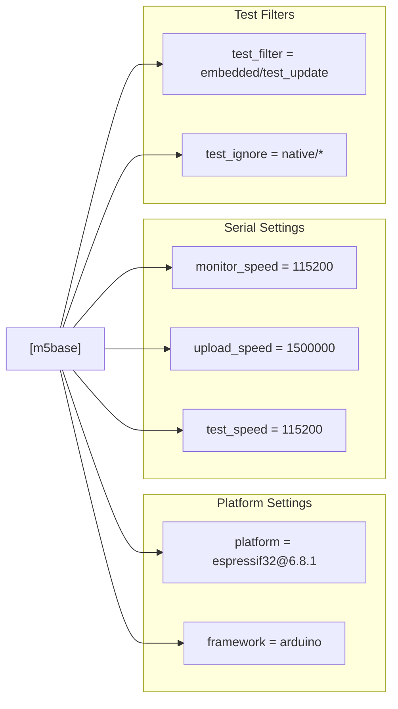
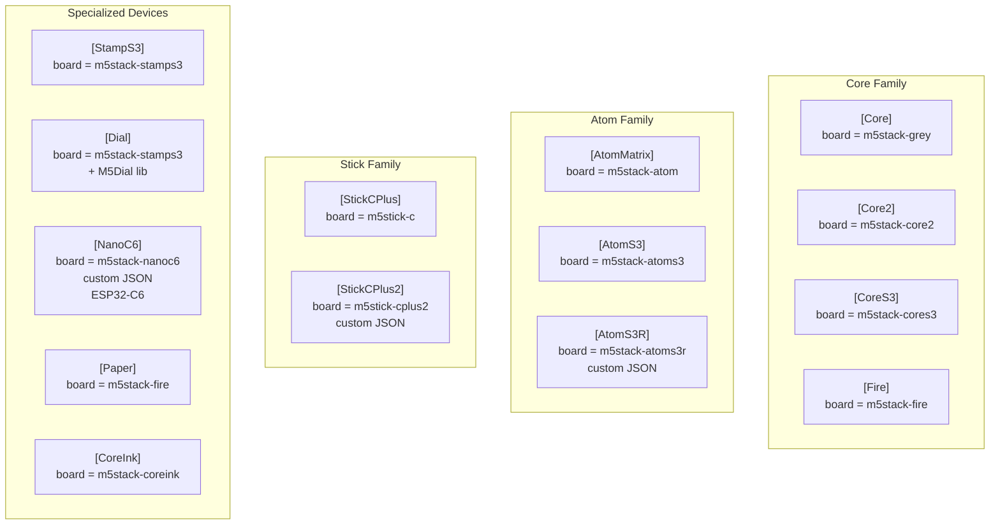
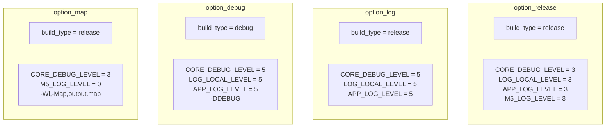
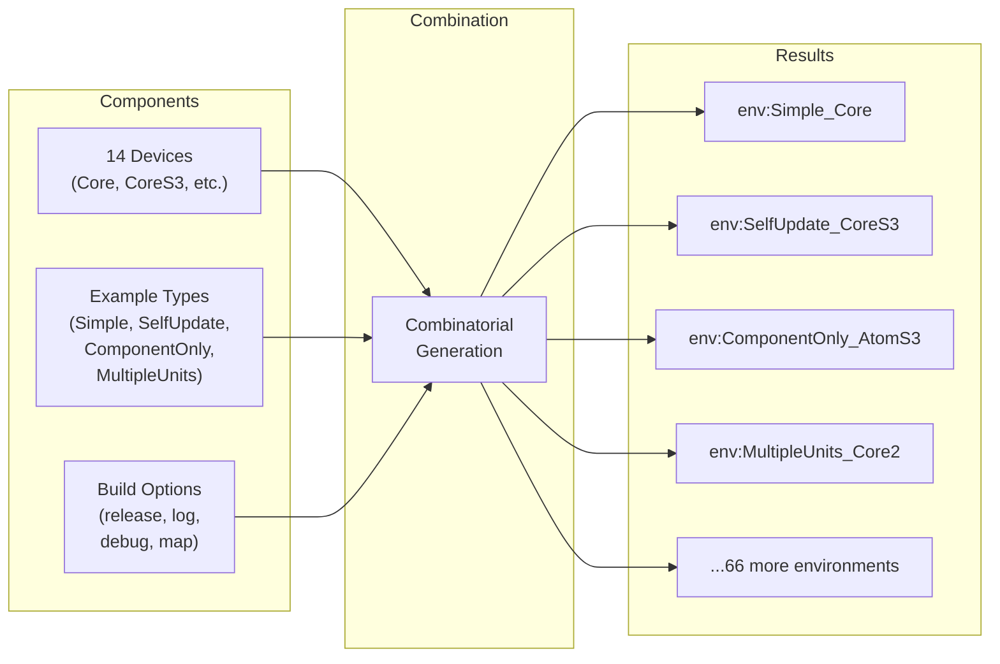
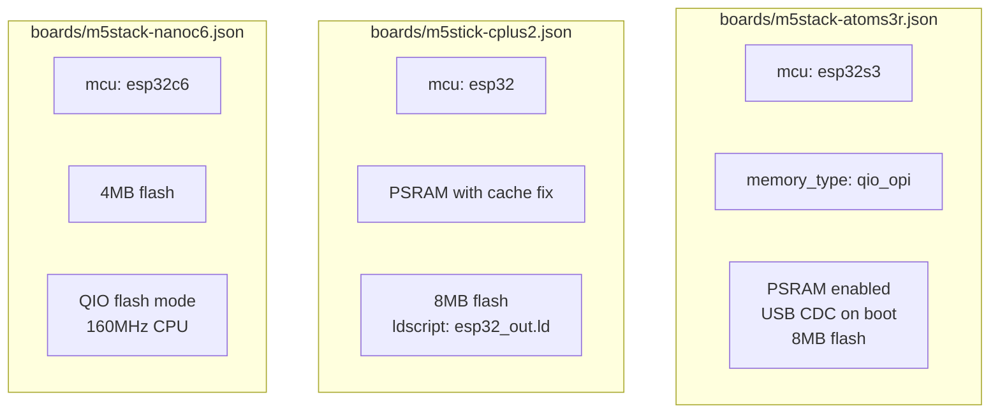
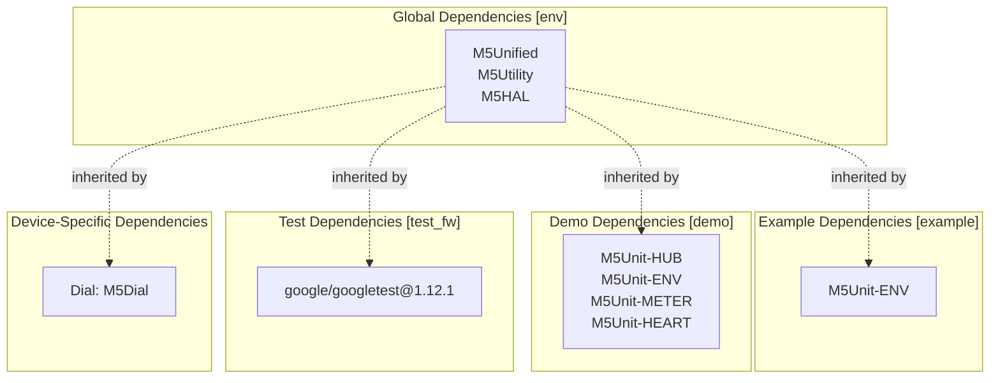
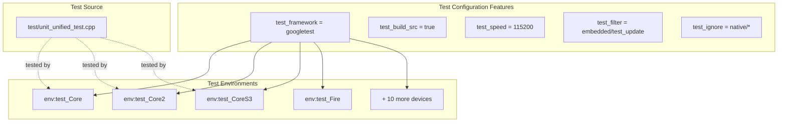
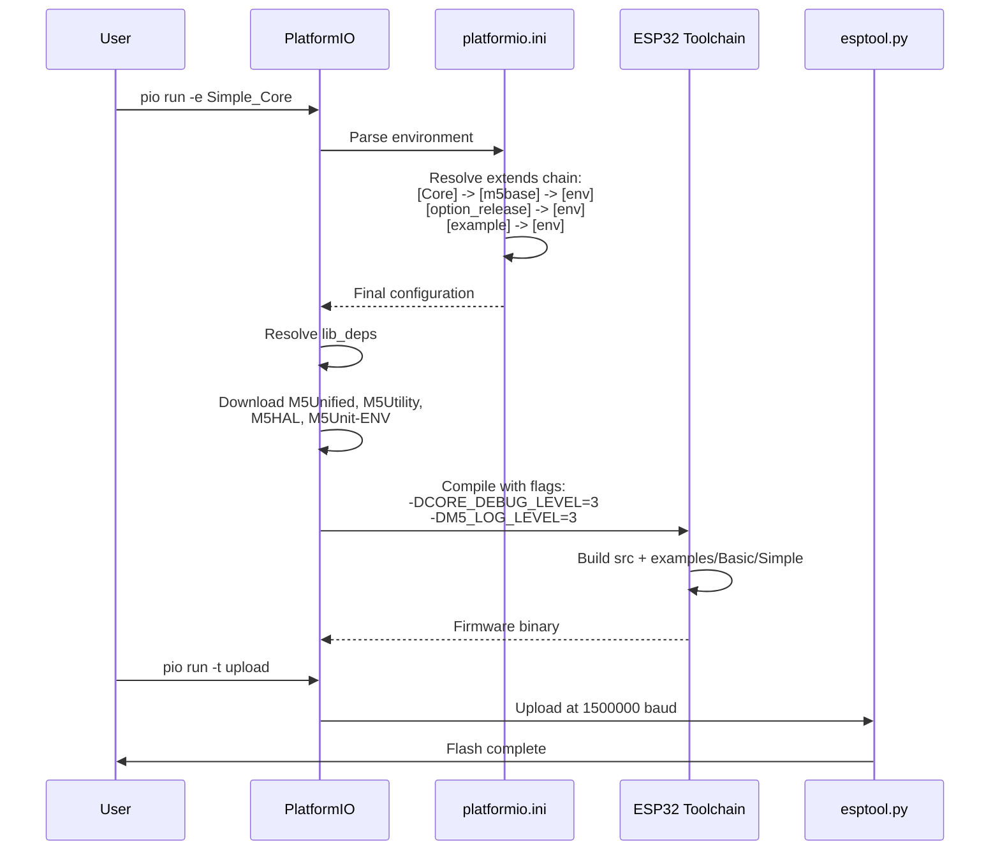

M5UnitUnified Build System

# Build System

<details>
<summary>Relevant source files</summary>

The following files were used as context for generating this wiki page:

- [README.ja.md](README.ja.md)
- [README.md](README.md)
- [pio_project/boards/m5stack-atoms3r.json](pio_project/boards/m5stack-atoms3r.json)
- [pio_project/boards/m5stack-nanoc6.json](pio_project/boards/m5stack-nanoc6.json)
- [pio_project/boards/m5stick-cplus2.json](pio_project/boards/m5stick-cplus2.json)
- [pio_project/platformio.ini](pio_project/platformio.ini)
- [pio_project/test/unit_unified_test.cpp](pio_project/test/unit_unified_test.cpp)
- [platformio.ini](platformio.ini)

</details>


## Purpose and Scope

This document describes the PlatformIO-based build system used by M5UnitUnified. The build system provides a comprehensive configuration matrix that generates 70+ build environments supporting 14 M5Stack devices with multiple examples and build options. The system uses a hierarchical inheritance pattern to minimize configuration duplication while maintaining flexibility for device-specific customization.

For information about using PlatformIO to build examples, see [Installation](#2.1). For details on the testing infrastructure that utilizes this build system, see [Testing](#7).

---

## Configuration Architecture

The build system is defined across two `platformio.ini` files serving different purposes:

1. **Root `platformio.ini`**: Defines example application builds for end users
2. **`pio_project/platformio.ini`**: Defines test environments for development and CI/CD

Both use the same hierarchical inheritance pattern to share configuration across devices.

```mermaid
graph TB
    ENV["[env]<br/>Global Settings"]
    M5BASE["[m5base]<br/>M5Stack Common"]
    
    subgraph "Device Configurations"
        CORE["[Core]"]
        CORE2["[Core2]"]
        CORES3["[CoreS3]"]
        FIRE["[Fire]"]
        STAMPS3["[StampS3]"]
        DIAL["[Dial]"]
        ATOMMX["[AtomMatrix]"]
        ATOMS3["[AtomS3]"]
        ATOMS3R["[AtomS3R]"]
        NANOC6["[NanoC6]"]
        STICKCP["[StickCPlus]"]
        STICKCP2["[StickCPlus2]"]
        PAPER["[Paper]"]
        COREINK["[CoreInk]"]
    end
    
    subgraph "Build Options"
        OPT_REL["[option_release]"]
        OPT_LOG["[option_log]"]
        OPT_DBG["[option_debug]"]
        OPT_MAP["[option_map]"]
    end
    
    subgraph "Example Categories"
        EX["[example]"]
        DEMO["[demo]"]
    end
    
    subgraph "Generated Environments"
        GEN1["[env:Simple_Core]"]
        GEN2["[env:SelfUpdate_CoreS3]"]
        GEN3["[env:MultipleUnits_Core2]"]
        GENN["70+ more..."]
    end
    
    ENV -.-> M5BASE
    M5BASE -.-> CORE
    M5BASE -.-> CORE2
    M5BASE -.-> CORES3
    M5BASE -.-> FIRE
    M5BASE -.-> STAMPS3
    M5BASE -.-> DIAL
    M5BASE -.-> ATOMMX
    M5BASE -.-> ATOMS3
    M5BASE -.-> ATOMS3R
    M5BASE -.-> NANOC6
    M5BASE -.-> STICKCP
    M5BASE -.-> STICKCP2
    M5BASE -.-> PAPER
    M5BASE -.-> COREINK
    
    ENV -.-> OPT_REL
    ENV -.-> OPT_LOG
    ENV -.-> OPT_DBG
    ENV -.-> OPT_MAP
    
    ENV -.-> EX
    ENV -.-> DEMO
    
    CORE --> GEN1
    CORES3 --> GEN2
    CORE2 --> GEN3
    OPT_REL --> GEN1
    OPT_REL --> GEN2
    OPT_REL --> GEN3
    EX --> GEN1
    EX --> GEN2
    DEMO --> GEN3
```



**Sources:** [platformio.ini:1-157]()

---

## Global Configuration

The `[env]` section defines settings inherited by all environments:

### Compiler Warnings

```ini
build_flags = -Wall -Wextra -Wreturn-local-addr -Werror=format -Werror=return-local-addr
```

These flags enforce strict C++ coding standards, treating format string errors and return-local-address issues as compile errors.

### Test Framework

```ini
test_framework = googletest
test_build_src = true
```

Configures GoogleTest as the unit testing framework and includes source files in test builds.

### Library Dependencies

```ini
lib_ldf_mode = deep
lib_deps=m5stack/M5Unified
  m5stack/M5Utility
  m5stack/M5HAL
```

The `deep` LDF mode enables recursive dependency scanning. The three core dependencies are:

| Library | Purpose |
|---------|---------|
| `M5Unified` | Device abstraction and pin mapping |
| `M5Utility` | Common utility functions |
| `M5HAL` | Hardware abstraction layer |

**Sources:** [platformio.ini:6-16]()

---

## M5Stack Base Configuration

The `[m5base]` section provides common settings for all M5Stack ESP32 devices:



### Key Configuration Values

| Setting | Value | Purpose |
|---------|-------|---------|
| `platform` | `espressif32@6.8.1` | ESP32 platform version (Arduino 2.0.4+ support) |
| `framework` | `arduino` | Arduino framework (ESP-IDF support planned) |
| `monitor_speed` | `115200` | Serial monitor baud rate |
| `upload_speed` | `1500000` | Flash upload speed (1.5 Mbps) |
| `test_speed` | `115200` | Test serial communication speed |
| `monitor_filters` | `esp32_exception_decoder, time` | Exception decoding and timestamps |

**Sources:** [platformio.ini:18-28]()

---

## Device Configurations

M5UnitUnified supports 14 M5Stack devices through dedicated configuration sections. Each device extends `[m5base]` and specifies its board type:



### Device Configuration Table

| Device | Board ID | Special Configuration |
|--------|----------|----------------------|
| **Core** | `m5stack-grey` | Standard M5Stack Core |
| **Core2** | `m5stack-core2` | Touch screen support |
| **CoreS3** | `m5stack-cores3` | ESP32-S3 with USB |
| **Fire** | `m5stack-fire` | Extended memory |
| **StampS3** | `m5stack-stamps3` | Includes Capsule, DinMeter variants |
| **Dial** | `m5stack-stamps3` | Extra dep: `m5stack/M5Dial` |
| **AtomMatrix** | `m5stack-atom` | 5×5 LED matrix |
| **AtomS3** | `m5stack-atoms3` | ESP32-S3 compact |
| **AtomS3R** | `m5stack-atoms3r` | Custom board JSON, PSRAM |
| **NanoC6** | `m5stack-nanoc6` | ESP32-C6, custom platform |
| **StickCPlus** | `m5stick-c` | Compact form factor |
| **StickCPlus2** | `m5stick-cplus2` | Custom board JSON, 8MB flash |
| **Paper** | `m5stack-fire` | E-paper display |
| **CoreInk** | `m5stack-coreink` | E-ink display |

### Special Case: NanoC6

The NanoC6 requires a custom platform package for ESP32-C6 support:

```ini
[NanoC6]
extends = m5base
board = m5stack-nanoc6
platform = https://github.com/platformio/platform-espressif32.git
platform_packages =
    platformio/framework-arduinoespressif32 @ https://github.com/espressif/arduino-esp32.git#3.0.7
    platformio/framework-arduinoespressif32-libs @ https://github.com/espressif/esp32-arduino-libs.git#idf-release/v5.1
board_build.partitions = default.csv
```

This configuration pulls Arduino-ESP32 3.0.7 with ESP-IDF 5.1 libraries for C6 chip support.

**Sources:** [platformio.ini:30-110](), [platformio.ini:80-89]()

---

## Build Options

Four build option sections provide different compilation configurations:



### Build Options Comparison

| Option | Build Type | Debug Level | Log Level | Special Flags | Use Case |
|--------|-----------|-------------|-----------|---------------|----------|
| **option_release** | `release` | 3 | 3 | `M5_LOG_LEVEL=3` | Production builds, moderate logging |
| **option_log** | `release` | 5 | 5 | None | Release with verbose logging |
| **option_debug** | `debug` | 5 | 5 | `-DDEBUG` | Development debugging |
| **option_map** | `release` | 3 | 0-3 | `-Wl,-Map,output.map` | Memory analysis |

### Debug Level Meanings

- **Level 0**: None (No logs)
- **Level 1**: Error
- **Level 2**: Warn
- **Level 3**: Info
- **Level 4**: Debug
- **Level 5**: Verbose

### Memory Map Generation

The `option_map` configuration generates `output.map` files for analyzing memory usage, symbol sizes, and section layouts. This is useful for optimizing flash and RAM usage.

**Sources:** [platformio.ini:125-157]()

---

## Environment Generation Pattern

The build system generates multiple environments by combining device configurations with example categories and build options:



### Environment Naming Convention

Environments follow the pattern: `env:{ExampleName}_{DeviceName}`

### Example Categories

**Basic Examples (`[example]` section):**

```ini
[example]
lib_deps=${env.lib_deps}
  m5stack/M5Unit-ENV
```

Adds M5Unit-ENV for basic sensor examples.

**Demo Examples (`[demo]` section):**

```ini
[demo]
lib_deps=${env.lib_deps}
  m5stack/M5Unit-HUB
  m5stack/M5Unit-ENV
  m5stack/M5Unit-METER
  m5stack/M5Unit-HEART
```

Adds multiple unit libraries for complex demonstrations.

### Environment Structure

Each generated environment extends three sections:

```ini
[env:Simple_Core]
extends=Core, option_release, example
build_src_filter = +<*> -<.git/> -<.svn/> +<../examples/Basic/Simple>
```

This pattern:
1. Inherits device configuration (`Core`)
2. Applies build options (`option_release`)
3. Includes example dependencies (`example`)
4. Filters source to specific example directory

### Complete Environment Matrix

| Example Type | Description | Device Count | Total Environments |
|--------------|-------------|--------------|-------------------|
| `Simple` | Basic sensor reading | 14 | 14 |
| `SelfUpdate` | FreeRTOS task updates | 14 | 14 |
| `ComponentOnly` | Direct component usage | 14 | 14 |
| `MultipleUnits` | Hub with multiple sensors | 3 (Core, Core2, CoreS3) | 3 |

**Total:** 45+ environments in example builds, plus test environments.

**Sources:** [platformio.ini:159-354]()

---

## Custom Board Definitions

Three devices require custom board JSON files due to platform-specific features or configurations not available in PlatformIO's default board database:



### AtomS3R Board Definition

File: `pio_project/boards/m5stack-atoms3r.json`

Key features:
- **MCU:** ESP32-S3
- **Flash:** 8MB with QIO OPI memory type
- **PSRAM:** Enabled with board flag
- **USB:** CDC on boot for serial communication
- **Build flags:** `-DARDUINO_M5STACK_ATOMS3R`, `-DBOARD_HAS_PSRAM`, `-DARDUINO_USB_MODE=1`, `-DARDUINO_USB_CDC_ON_BOOT=1`

```json
{
    "build": {
        "arduino": {
            "memory_type": "qio_opi",
            "ldscript": "esp32s3_out.ld",
            "partitions": "default_8MB.csv"
        },
        "mcu": "esp32s3",
        "f_cpu": "240000000L",
        ...
    }
}
```

**Sources:** [pio_project/boards/m5stack-atoms3r.json:1-42]()

### StickCPlus2 Board Definition

File: `pio_project/boards/m5stick-cplus2.json`

Key features:
- **MCU:** ESP32 (original)
- **Flash:** 8MB
- **PSRAM:** Enabled with ESP32 PSRAM cache issue workarounds
- **Workarounds:** `-mfix-esp32-psram-cache-issue`, `-mfix-esp32-psram-cache-strategy=memw`
- **Build flags:** `-DM5STACK_M5STICK_CPLUS2`, `-DBOARD_HAS_PSRAM`

These flags address known ESP32 PSRAM cache coherency issues.

**Sources:** [pio_project/boards/m5stick-cplus2.json:1-41]()

### NanoC6 Board Definition

File: `pio_project/boards/m5stack-nanoc6.json`

Key features:
- **MCU:** ESP32-C6 (RISC-V architecture)
- **Flash:** 4MB QIO mode
- **CPU:** 160MHz
- **Platform:** Requires custom platform packages (Arduino-ESP32 3.0.7)
- **Build flags:** `-DARDUINO_M5STACK_NANOC6`

The ESP32-C6 is M5Stack's first RISC-V device, requiring newer toolchain versions.

**Sources:** [pio_project/boards/m5stack-nanoc6.json:1-34]()

---

## Dependencies Management

The build system manages dependencies at multiple levels:



### Dependency Inheritance Pattern

Dependencies use variable substitution to inherit and extend:

```ini
[Core]
lib_deps = ${env.lib_deps}  # Inherits M5Unified, M5Utility, M5HAL

[example]
lib_deps=${env.lib_deps}    # Inherits global deps
  m5stack/M5Unit-ENV        # Adds ENV library

[demo]
lib_deps=${env.lib_deps}    # Inherits global deps
  m5stack/M5Unit-HUB        # Adds multiple libraries
  m5stack/M5Unit-ENV
  m5stack/M5Unit-METER
  m5stack/M5Unit-HEART
```

### Test Environment Dependencies

Test environments include GoogleTest:

```ini
[test_fw]
lib_deps = google/googletest@1.12.1

[env:test_Core]
extends=Core, option_release
lib_deps = ${Core.lib_deps} 
  ${test_fw.lib_deps}
```

This ensures GoogleTest is only included in test builds, not example builds.

**Sources:** [platformio.ini:159-354](), [pio_project/platformio.ini:188-274]()

---

## Test Configuration

The `pio_project` directory contains a separate PlatformIO configuration for unit testing:



### Test Framework Setup

```ini
[env]
test_framework = googletest
test_build_src = true
```

- **GoogleTest:** C++ unit testing framework
- **test_build_src:** Includes `src/` directory in test compilation

### Test Filters

```ini
[m5base]
test_filter= embedded/test_update
test_ignore= native/*
```

- **test_filter:** Only run tests in `embedded/test_update` directory
- **test_ignore:** Skip tests in `native/` directory (for SDL-based tests)

### Library Path Configuration

```ini
[env]
lib_extra_dirs = ./lib
 ../
```

This allows tests to use local M5UnitUnified sources instead of downloaded versions, enabling testing of uncommitted changes.

### Test Environment Example

```ini
[env:test_Core]
extends=Core, option_release
lib_deps = ${Core.lib_deps} 
  ${test_fw.lib_deps}
```

Each test environment extends a device configuration and adds GoogleTest dependencies.

**Sources:** [pio_project/platformio.ini:1-274](), [pio_project/test/unit_unified_test.cpp:1-169]()

---

## Build Environment Workflow

The following diagram illustrates how a build is executed:



### Build Commands

| Command | Purpose |
|---------|---------|
| `pio run -e Simple_Core` | Build Simple example for Core |
| `pio run -e Simple_Core -t upload` | Build and upload |
| `pio run -e Simple_Core -t monitor` | Build, upload, and open monitor |
| `pio test -e test_Core` | Run unit tests on Core |
| `pio run -l` | List all available environments |

**Sources:** [platformio.ini:1-354]()

---

## Summary

The M5UnitUnified build system provides:

1. **Hierarchical Configuration:** Four inheritance levels (env → m5base → device → environment)
2. **14 Device Support:** Complete M5Stack hardware family coverage
3. **4 Build Options:** Release, log, debug, and map configurations
4. **70+ Environments:** Comprehensive test matrix through combinatorial generation
5. **Custom Boards:** Extended support through JSON board definitions
6. **Flexible Dependencies:** Modular library inclusion at multiple levels
7. **Integrated Testing:** GoogleTest framework with per-device test environments

This architecture enables a single codebase to support the entire M5Stack ecosystem while maintaining build configuration simplicity through inheritance and composition patterns.