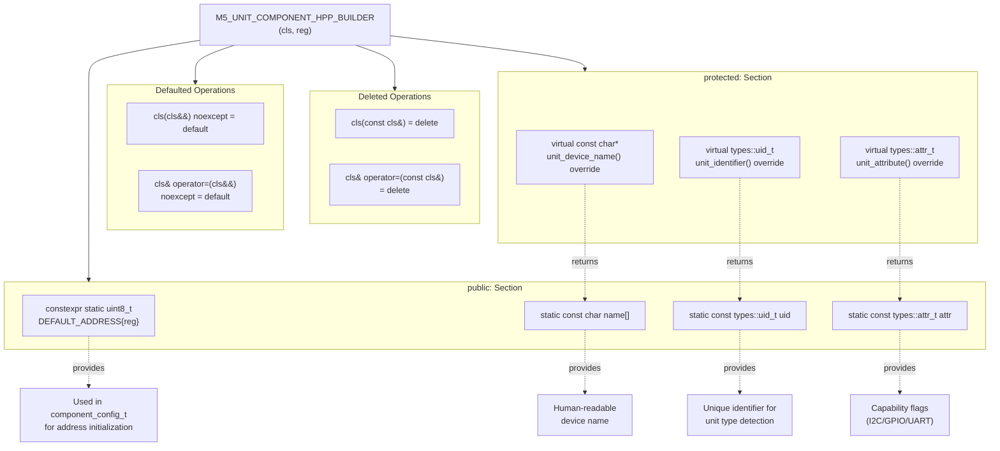
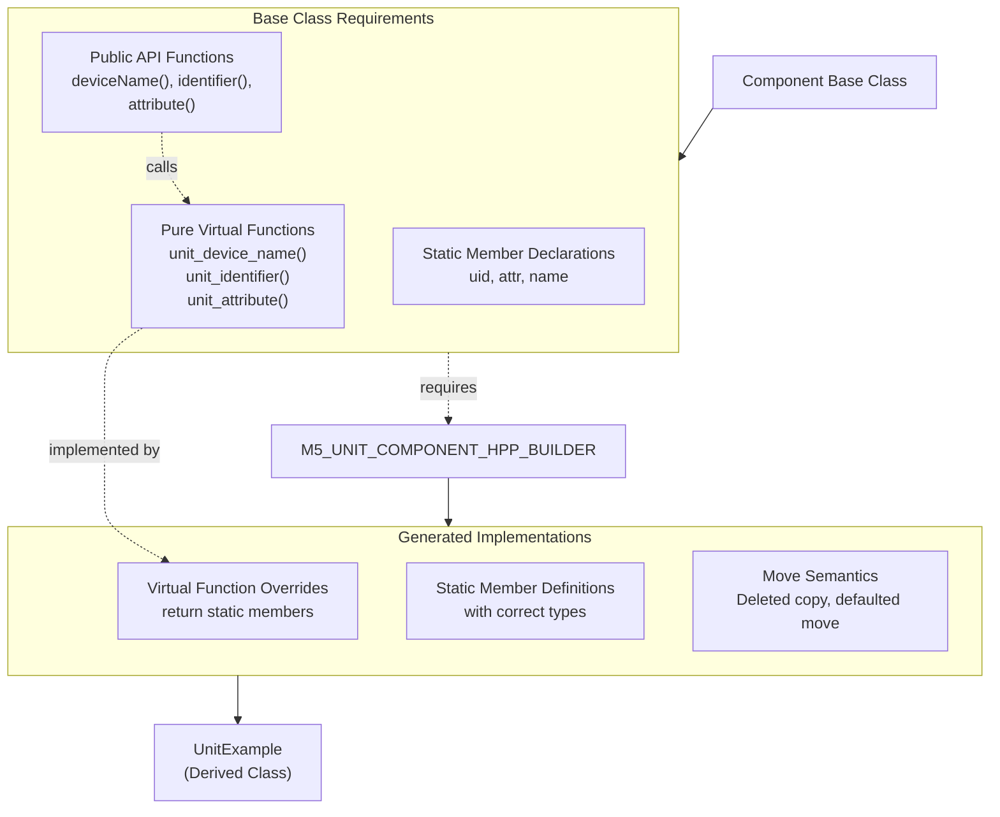
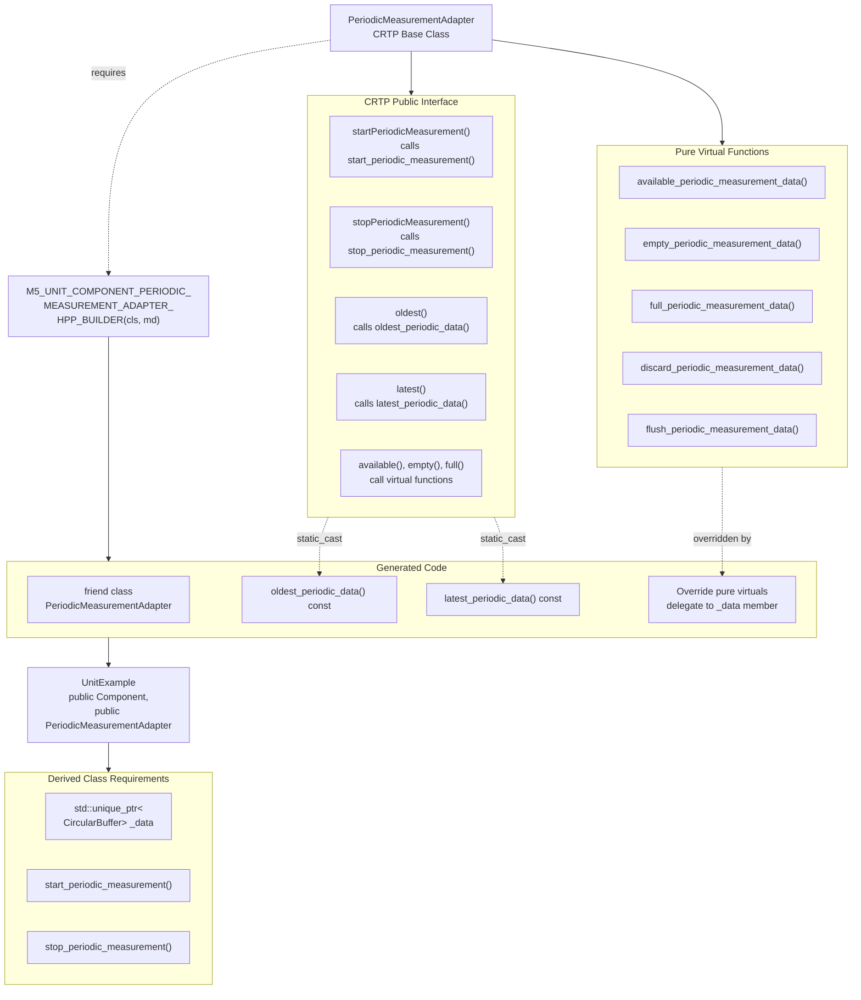
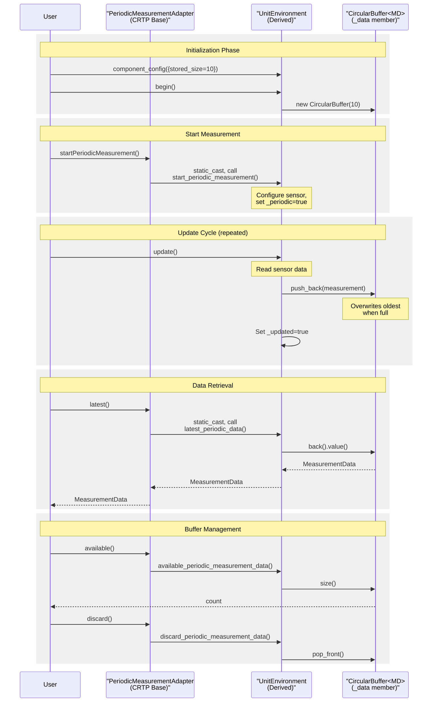
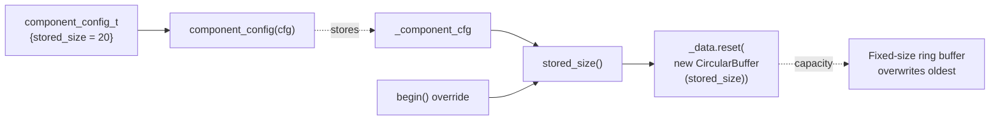

M5UnitUnified Builder Macros

# Builder Macros

<details>
<summary>Relevant source files</summary>

The following files were used as context for generating this wiki page:

- [src/M5UnitComponent.cpp](src/M5UnitComponent.cpp)
- [src/M5UnitComponent.hpp](src/M5UnitComponent.hpp)
- [src/M5UnitUnified.cpp](src/M5UnitUnified.cpp)
- [src/M5UnitUnified.hpp](src/M5UnitUnified.hpp)
- [src/m5_unit_component/adapter_base.hpp](src/m5_unit_component/adapter_base.hpp)
- [src/m5_unit_component/adapter_gpio_v1.hpp](src/m5_unit_component/adapter_gpio_v1.hpp)
- [src/m5_unit_component/adapter_i2c.cpp](src/m5_unit_component/adapter_i2c.cpp)

</details>


This document describes the preprocessor macros that generate boilerplate code for unit component classes derived from `Component` and `PeriodicMeasurementAdapter`. These macros significantly reduce repetitive code and enforce consistent implementation patterns across the 40+ unit types in the M5UnitUnified ecosystem.

For information about the Component base class architecture, see [Component System](#3.1). For details on periodic measurement functionality, see [Periodic Measurement](#10.1).

---

## Overview

The M5UnitUnified library defines two primary builder macros:

- **`M5_UNIT_COMPONENT_HPP_BUILDER`** - Generates static members, copy/move semantics, and virtual function overrides for classes deriving from `Component`
- **`M5_UNIT_COMPONENT_PERIODIC_MEASUREMENT_ADAPTER_HPP_BUILDER`** - Generates CRTP-required methods for classes using `PeriodicMeasurementAdapter`

These macros ensure that all unit implementations follow the same structural pattern and satisfy base class requirements without manually duplicating code in each derived class.

Sources: [src/M5UnitComponent.hpp:692-757]()

---

## M5_UNIT_COMPONENT_HPP_BUILDER Macro

### Purpose

This macro generates the essential boilerplate required by every class deriving from `Component`. It creates static members for device identification, enforces move-only semantics, and implements virtual functions that provide runtime polymorphism for device properties.

### Macro Definition

The macro is defined in [src/M5UnitComponent.hpp:694-721]():

```cpp
#define M5_UNIT_COMPONENT_HPP_BUILDER(cls, reg)
```

**Parameters:**
- `cls` - The derived class name
- `reg` - The default I2C address (as an 8-bit value)

### Generated Code Elements



Sources: [src/M5UnitComponent.hpp:694-721]()

### Generated Members Table

| Member | Type | Visibility | Purpose |
|--------|------|-----------|---------|
| `DEFAULT_ADDRESS` | `constexpr static uint8_t` | public | Default I2C address for the device |
| `uid` | `static const types::uid_t` | public | Unique identifier (32-bit hash) |
| `attr` | `static const types::attr_t` | public | Attribute flags (AccessI2C, AccessGPIO, etc.) |
| `name` | `static const char[]` | public | Device name string |
| Copy constructor | deleted | public | Prevents copying (move-only) |
| Copy assignment | deleted | public | Prevents copying (move-only) |
| Move constructor | defaulted | public | Enables efficient transfer |
| Move assignment | defaulted | public | Enables efficient transfer |
| `unit_device_name()` | virtual override | protected | Returns `name` |
| `unit_identifier()` | virtual override | protected | Returns `uid` |
| `unit_attribute()` | virtual override | protected | Returns `attr` |

Sources: [src/M5UnitComponent.hpp:694-721]()

### Usage Pattern

To use this macro in a derived unit class:

**Step 1: Declare the class with the macro**

```cpp
class UnitExample : public Component {
    // Place macro immediately after class declaration
    M5_UNIT_COMPONENT_HPP_BUILDER(UnitExample, 0x48);
    
public:
    explicit UnitExample(const uint8_t addr = DEFAULT_ADDRESS)
        : Component(addr) {}
    
    // Other member functions...
};
```

**Step 2: Define static members in the .cpp file**

```cpp
const types::uid_t UnitExample::uid{0x12345678};
const types::attr_t UnitExample::attr{types::attribute::AccessI2C};
const char UnitExample::name[] = "UnitExample";
```

Sources: [src/M5UnitComponent.hpp:694-721](), [src/M5UnitComponent.hpp:52-58]()

### Relationship with Component Base Class



The base class `Component` declares pure virtual functions [src/M5UnitComponent.hpp:514-516]() that must be overridden by derived classes. The macro generates these overrides, which simply return the static member values. The public API functions like `deviceName()` [src/M5UnitComponent.hpp:117-120]() delegate to these virtual functions, enabling polymorphic access to device information.

Sources: [src/M5UnitComponent.hpp:52-58](), [src/M5UnitComponent.hpp:514-520](), [src/M5UnitComponent.hpp:117-130]()

### Move-Only Semantics Enforcement

The macro explicitly deletes copy operations and defaults move operations [src/M5UnitComponent.hpp:701-707](). This enforces the library's design principle that components are non-copyable resources:

**Rationale:**
- Components manage hardware communication adapters (`std::shared_ptr<Adapter>`)
- Copying would create ambiguous ownership of hardware resources
- Components participate in parent-child linked lists with raw pointers
- Moving is safe as it transfers ownership and nullifies the source

The base class `Component` also declares move operations as default [src/M5UnitComponent.hpp:67-68](), and the macro ensures derived classes maintain this semantic.

Sources: [src/M5UnitComponent.hpp:60-76](), [src/M5UnitComponent.hpp:701-707]()

---

## M5_UNIT_COMPONENT_PERIODIC_MEASUREMENT_ADAPTER_HPP_BUILDER Macro

### Purpose

This macro generates the implementation details required by the CRTP pattern used in `PeriodicMeasurementAdapter`. It provides concrete implementations of pure virtual functions that manage the circular buffer of periodic measurement data stored in derived classes.

### Macro Definition

The macro is defined in [src/M5UnitComponent.hpp:724-755]():

```cpp
#define M5_UNIT_COMPONENT_PERIODIC_MEASUREMENT_ADAPTER_HPP_BUILDER(cls, md)
```

**Parameters:**
- `cls` - The derived class name
- `md` - The measurement data type (struct containing sensor readings)

### CRTP Architecture



The CRTP (Curiously Recurring Template Pattern) allows the base class `PeriodicMeasurementAdapter` to call methods in the derived class at compile-time through `static_cast<Derived*>(this)` [src/M5UnitComponent.hpp:622](), [src/M5UnitComponent.hpp:658](), [src/M5UnitComponent.hpp:662](). This achieves polymorphism without virtual function overhead.

Sources: [src/M5UnitComponent.hpp:607-687](), [src/M5UnitComponent.hpp:724-755]()

### Generated Code Elements

The macro generates implementations in the **protected** section [src/M5UnitComponent.hpp:725]():

| Generated Member | Purpose |
|-----------------|---------|
| `friend class PeriodicMeasurementAdapter<cls, md>` | Allows CRTP base to access protected members |
| `oldest_periodic_data() const` | Returns front element from `_data` buffer |
| `latest_periodic_data() const` | Returns back element from `_data` buffer |
| `available_periodic_measurement_data() override` | Returns `_data->size()` |
| `empty_periodic_measurement_data() override` | Returns `_data->empty()` |
| `full_periodic_measurement_data() override` | Returns `_data->full()` |
| `discard_periodic_measurement_data() override` | Calls `_data->pop_front()` |
| `flush_periodic_measurement_data() override` | Calls `_data->clear()` |

All generated functions delegate to a `_data` member that **must be declared** in the derived class as:

```cpp
std::unique_ptr<m5::container::CircularBuffer<MeasurementData>> _data;
```

Sources: [src/M5UnitComponent.hpp:724-755]()

### Usage Pattern

**Step 1: Define measurement data structure**

```cpp
struct MeasurementData {
    float temperature;
    float humidity;
    types::elapsed_time_t timestamp;
};
```

**Step 2: Declare class with multiple inheritance**

```cpp
class UnitEnvironment 
    : public Component
    , public PeriodicMeasurementAdapter<UnitEnvironment, MeasurementData>
{
    M5_UNIT_COMPONENT_HPP_BUILDER(UnitEnvironment, 0x44);
    M5_UNIT_COMPONENT_PERIODIC_MEASUREMENT_ADAPTER_HPP_BUILDER(
        UnitEnvironment, MeasurementData);

protected:
    // REQUIRED: Circular buffer for periodic data
    std::unique_ptr<m5::container::CircularBuffer<MeasurementData>> _data;

    // REQUIRED: Implement these functions
    bool start_periodic_measurement();
    bool stop_periodic_measurement();

public:
    explicit UnitEnvironment(const uint8_t addr = DEFAULT_ADDRESS)
        : Component(addr) {}
    
    bool begin() override {
        // Initialize buffer with stored_size from component_config
        _data.reset(new m5::container::CircularBuffer<MeasurementData>(
            stored_size()));
        return true;
    }
};
```

**Step 3: Use public interface from PeriodicMeasurementAdapter**

```cpp
UnitEnvironment env;
env.component_config({.stored_size = 10});
env.begin();

env.startPeriodicMeasurement();
// ... measurements accumulate in _data buffer ...

if (!env.empty()) {
    auto data = env.latest();
    Serial.printf("Temp: %.2f, Humidity: %.2f\n", 
                  data.temperature, data.humidity);
}

size_t count = env.available();  // How many measurements stored
env.discard();  // Remove oldest
env.flush();    // Clear all
```

Sources: [src/M5UnitComponent.hpp:607-687](), [src/M5UnitComponent.hpp:724-755]()

### Data Flow in Periodic Measurement



The macro-generated overrides provide type-safe access to the `_data` buffer. Empty buffer checks [src/M5UnitComponent.hpp:730](), [src/M5UnitComponent.hpp:734]() prevent undefined behavior when accessing `front()` or `back()`.

Sources: [src/M5UnitComponent.hpp:724-755]()

### Interaction with Component Lifecycle

The `stored_size` configuration parameter from `component_config_t` [src/M5UnitComponent.hpp:45]() determines the circular buffer capacity:



The derived class's `begin()` function should call `stored_size()` [src/M5UnitComponent.hpp:537-540]() to retrieve the configured buffer size when initializing `_data`.

Sources: [src/M5UnitComponent.hpp:41-50](), [src/M5UnitComponent.hpp:537-540]()

---

## Macro Expansion Examples

### Before and After Comparison

**Without Macros (Manual Implementation):**

```cpp
class UnitSCD40 : public Component {
public:
    constexpr static uint8_t DEFAULT_ADDRESS{0x62};
    static const types::uid_t uid;
    static const types::attr_t attr;
    static const char name[];
    
    UnitSCD40(const UnitSCD40&) = delete;
    UnitSCD40& operator=(const UnitSCD40&) = delete;
    UnitSCD40(UnitSCD40&&) noexcept = default;
    UnitSCD40& operator=(UnitSCD40&&) noexcept = default;

protected:
    inline virtual const char* unit_device_name() const override {
        return name;
    }
    inline virtual types::uid_t unit_identifier() const override {
        return uid;
    }
    inline virtual types::attr_t unit_attribute() const override {
        return attr;
    }
    
    // ... rest of class implementation ...
};
```

**With Macros (Compact Implementation):**

```cpp
class UnitSCD40 : public Component {
    M5_UNIT_COMPONENT_HPP_BUILDER(UnitSCD40, 0x62);

    // ... rest of class implementation ...
};
```

The macro reduces **21 lines** of boilerplate to a **single line**, maintaining identical functionality while preventing copy-paste errors across 40+ unit types.

Sources: [src/M5UnitComponent.hpp:694-721]()

### Full Example with Both Macros

```cpp
// Header file
class UnitCO2 
    : public Component
    , public PeriodicMeasurementAdapter<UnitCO2, CO2Data>
{
    M5_UNIT_COMPONENT_HPP_BUILDER(UnitCO2, 0x62);
    M5_UNIT_COMPONENT_PERIODIC_MEASUREMENT_ADAPTER_HPP_BUILDER(
        UnitCO2, CO2Data);

protected:
    std::unique_ptr<m5::container::CircularBuffer<CO2Data>> _data;
    
    bool start_periodic_measurement(uint16_t interval_ms);
    bool stop_periodic_measurement();

public:
    explicit UnitCO2(const uint8_t addr = DEFAULT_ADDRESS);
    
    bool begin() override;
    void update(const bool force = false) override;
};

// Implementation file
const types::uid_t UnitCO2::uid{0x9FA63A9F};  // Unique hash
const types::attr_t UnitCO2::attr{types::attribute::AccessI2C};
const char UnitCO2::name[] = "UnitCO2";
```

This compact declaration produces a fully-functional unit class with:
- Static device identification
- Move-only semantics
- Virtual function overrides
- Periodic measurement buffer management
- CRTP-based compile-time polymorphism

Sources: [src/M5UnitComponent.hpp:694-721](), [src/M5UnitComponent.hpp:724-755]()

---

## Design Rationale

### Why Preprocessor Macros?

The M5UnitUnified library chose preprocessor macros over alternatives for several reasons:

| Alternative | Limitation |
|------------|-----------|
| **Inheritance** | Cannot inject static members or control copy/move semantics of derived classes |
| **Templates** | Cannot generate different member names (`uid`, `attr`, `name`) or control visibility sections |
| **Code Generation** | Adds build complexity and requires external tooling |
| **Manual Copy-Paste** | Error-prone across 40+ unit types; difficult to maintain consistency |

Macros provide compile-time code injection that can:
- Declare static members with specific names and types
- Control access specifiers (public/protected sections)
- Delete and default special member functions
- Generate inline function implementations

The trade-off is reduced debugger visibility into macro-generated code, but this is acceptable for well-defined boilerplate patterns.

Sources: [src/M5UnitComponent.hpp:692-757]()

### Consistency Across Unit Ecosystem

The test validation suite [test/embedded/unit_unified_test.cpp]() verifies that all registered units properly define `DEFAULT_ADDRESS`, `uid`, `attr`, and `name` static members. Using macros ensures:

- **Uniform Structure**: All 40+ units follow identical patterns
- **Compiler Enforcement**: Missing implementations cause compile errors
- **Reduced Maintenance**: Updates to base requirements propagate automatically
- **Type Safety**: Virtual function signatures match exactly

Sources: [src/M5UnitComponent.hpp:692-757]()

---

## Common Pitfalls and Solutions

### Missing Static Member Definitions

**Problem:** Using the macro but forgetting to define static members in the .cpp file.

```cpp
// header.hpp - CORRECT
class UnitExample : public Component {
    M5_UNIT_COMPONENT_HPP_BUILDER(UnitExample, 0x48);
};

// impl.cpp - MISSING DEFINITIONS (linker error!)
// const types::uid_t UnitExample::uid{...};  // FORGOT THIS
// const types::attr_t UnitExample::attr{...}; // FORGOT THIS
// const char UnitExample::name[] = "...";     // FORGOT THIS
```

**Error:** Linker error: "undefined reference to `UnitExample::uid`"

**Solution:** Always define all three static members in the implementation file:

```cpp
// impl.cpp - CORRECT
const types::uid_t UnitExample::uid{0x12345678};
const types::attr_t UnitExample::attr{types::attribute::AccessI2C};
const char UnitExample::name[] = "UnitExample";
```

Sources: [src/M5UnitComponent.hpp:694-721]()

### Missing _data Member for Periodic Measurement

**Problem:** Using `M5_UNIT_COMPONENT_PERIODIC_MEASUREMENT_ADAPTER_HPP_BUILDER` without declaring the required `_data` member.

```cpp
class UnitSensor 
    : public Component
    , public PeriodicMeasurementAdapter<UnitSensor, SensorData>
{
    M5_UNIT_COMPONENT_PERIODIC_MEASUREMENT_ADAPTER_HPP_BUILDER(
        UnitSensor, SensorData);
    
    // MISSING: std::unique_ptr<m5::container::CircularBuffer<SensorData>> _data;
};
```

**Error:** Compile error: "`_data` was not declared in this scope"

**Solution:** Declare `_data` in the protected section [src/M5UnitComponent.hpp:602](). The comment at line 602 explicitly warns: "MUST ADD std::unique_ptr<m5::container::CircularBuffer<MD>> _data{} in Derived class".

Sources: [src/M5UnitComponent.hpp:602](), [src/M5UnitComponent.hpp:724-755]()

### Incorrect Macro Placement

**Problem:** Placing macros outside the class body or in wrong access sections.

```cpp
class UnitExample : public Component {
public:
    // ...
};

// WRONG: Macro outside class body
M5_UNIT_COMPONENT_HPP_BUILDER(UnitExample, 0x48);
```

**Solution:** Place macros immediately after the class declaration opening brace, before any other members:

```cpp
class UnitExample : public Component {
    M5_UNIT_COMPONENT_HPP_BUILDER(UnitExample, 0x48);  // CORRECT
public:
    // ...
};
```

The macro internally handles access specifier changes using `public:` and `protected:` labels [src/M5UnitComponent.hpp:695](), [src/M5UnitComponent.hpp:709]().

Sources: [src/M5UnitComponent.hpp:694-721]()

---

## Testing and Validation

### Component Validation Tests

The embedded test suite validates macro-generated members [test/embedded/unit_unified_test.cpp]():

**Checks Performed:**
1. `DEFAULT_ADDRESS` is constexpr and accessible
2. `uid` is unique across all registered units
3. `attr` correctly indicates protocol capabilities
4. `name` is non-empty and unique
5. Move operations work correctly (copy operations are deleted)

These tests ensure that all units using the builder macros conform to the required interface contracts.

Sources: [src/M5UnitComponent.hpp:694-721]()

### Macro Hygiene

The macros follow best practices for C++ preprocessor hygiene:

- **No semicolon after macro definition** - Users add the semicolon when using
- **No macro name conflicts** - Uses M5-specific prefix and descriptive names
- **No macro parameter side effects** - Parameters used as identifiers only
- **Protected section isolation** - Virtual overrides in protected prevent misuse

The `@cond 0` and `@endcond` markers [src/M5UnitComponent.hpp:693](), [src/M5UnitComponent.hpp:757]() hide macros from Doxygen documentation to reduce visual clutter while preserving generated documentation for derived classes.

Sources: [src/M5UnitComponent.hpp:692-757]()

---

## Summary

The builder macros provide essential infrastructure for the M5UnitUnified library:

| Macro | Purpose | Generated Elements |
|-------|---------|-------------------|
| `M5_UNIT_COMPONENT_HPP_BUILDER` | Core unit boilerplate | Static identification, move semantics, virtual overrides |
| `M5_UNIT_COMPONENT_PERIODIC_MEASUREMENT_ADAPTER_HPP_BUILDER` | Periodic measurement | CRTP implementations, buffer access methods |

**Key Benefits:**
- Reduces 20+ lines of boilerplate to 1-2 lines per unit
- Enforces consistent interface across 40+ unit types
- Prevents common implementation errors
- Simplifies maintenance and updates
- Enables compile-time polymorphism via CRTP

**Usage Requirements:**
- Place macros at the start of class body
- Define static members in .cpp file
- Declare `_data` buffer for periodic measurement units
- Initialize buffer in `begin()` using `stored_size()`

Sources: [src/M5UnitComponent.hpp:692-757]()