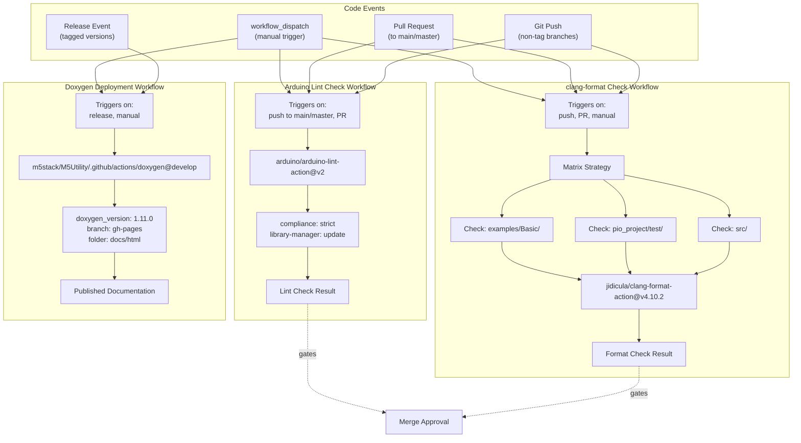
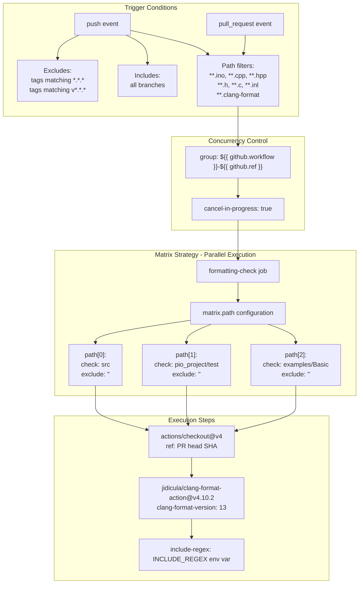
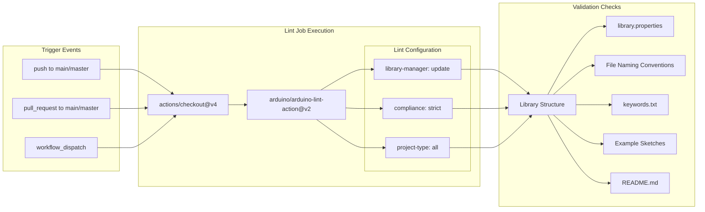
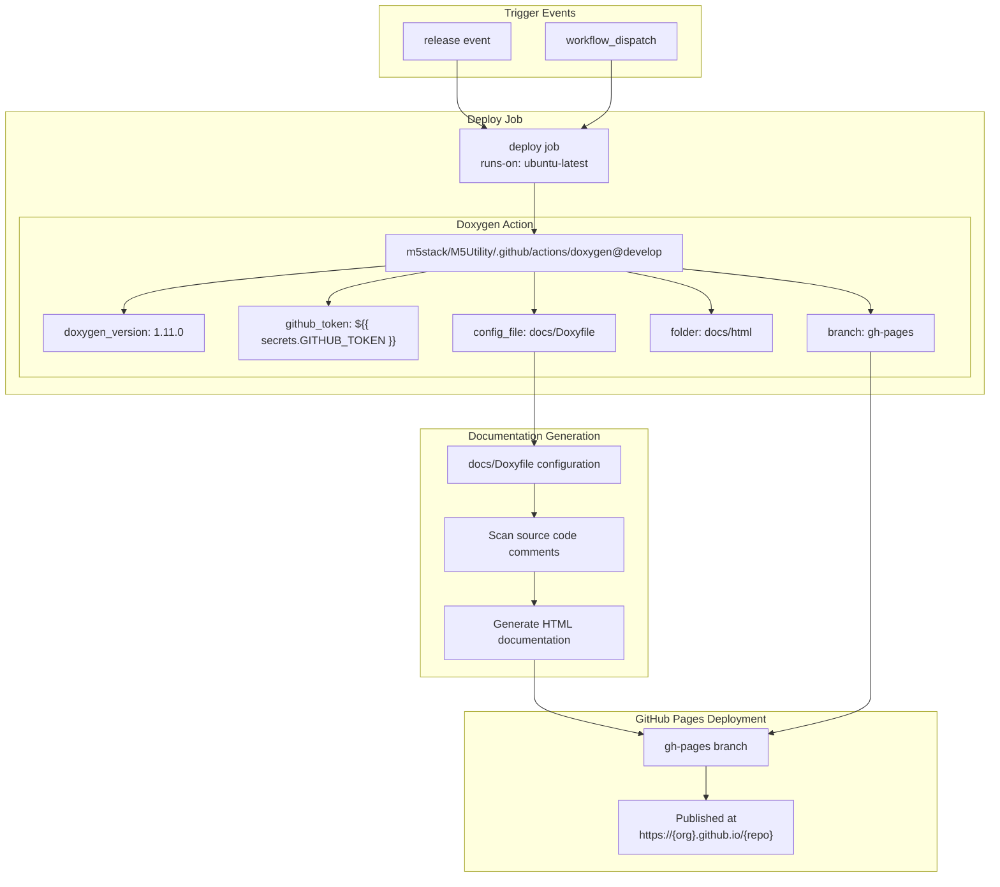
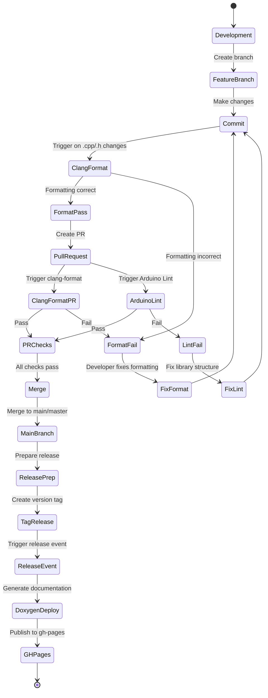

M5UnitUnified CI/CD Pipeline

# CI/CD Pipeline

<details>
<summary>Relevant source files</summary>

The following files were used as context for generating this wiki page:

- [.github/ISSUE_TEMPLATE/bug-report.yml](.github/ISSUE_TEMPLATE/bug-report.yml)
- [.github/workflows/Arduino-Lint-Check.yml](.github/workflows/Arduino-Lint-Check.yml)
- [.github/workflows/clang-format-check.yml](.github/workflows/clang-format-check.yml)
- [.github/workflows/doxygen-gh-pages.yml](.github/workflows/doxygen-gh-pages.yml)

</details>


## Purpose and Scope

This document describes the automated Continuous Integration and Continuous Deployment (CI/CD) infrastructure for M5UnitUnified. The CI/CD pipeline enforces code quality standards, validates library compliance, and automates documentation generation through GitHub Actions workflows. This page covers workflow definitions, trigger conditions, and integration with the development process.

For information about code formatting rules enforced by the pipeline, see [Code Standards](#8.2). For the contribution workflow that integrates with these checks, see [Contributing](#8.3).

---

## CI/CD Overview

The M5UnitUnified CI/CD pipeline consists of three primary GitHub Actions workflows that execute automatically on code changes:

| Workflow | File | Primary Function | Trigger Events |
|----------|------|------------------|----------------|
| `clang-format Check` | `.github/workflows/clang-format-check.yml` | Validates C/C++ code formatting | Push, Pull Request |
| `Arduino Lint Check` | `.github/workflows/Arduino-Lint-Check.yml` | Enforces Arduino library standards | Push to main/master, Pull Request |
| `Deploy Doxygen document on GitHub Pages` | `.github/workflows/doxygen-gh-pages.yml` | Generates and publishes API documentation | Release events, Manual dispatch |

**Sources:** [.github/workflows/clang-format-check.yml:1-70](), [.github/workflows/Arduino-Lint-Check.yml:1-28](), [.github/workflows/doxygen-gh-pages.yml:1-27]()

---

## Workflow Architecture



**Workflow Trigger and Execution Architecture**

This diagram shows how Git events trigger different CI/CD workflows and the data flow through each pipeline. The `clang-format Check` uses a matrix strategy to validate multiple directories in parallel, while `Arduino Lint Check` performs comprehensive library validation. Documentation deployment occurs only on release events or manual triggers.

**Sources:** [.github/workflows/clang-format-check.yml:6-32](), [.github/workflows/Arduino-Lint-Check.yml:2-7](), [.github/workflows/doxygen-gh-pages.yml:2]()

---

## clang-format Check Workflow

### Workflow Configuration

The `clang-format Check` workflow validates C/C++ code formatting against the project's `.clang-format` configuration file. It runs on every push and pull request that modifies source code files.



**clang-format Check Workflow Execution Flow**

**Sources:** [.github/workflows/clang-format-check.yml:1-70]()

### Environment Variables

The workflow defines a global environment variable for file pattern matching:

```yaml
env:
  INCLUDE_REGEX: ^.*\.((((c|C)(c|pp|xx|\+\+)?$)|((h|H)h?(pp|xx|\+\+)?$))|(inl|ino|pde|proto|cu))$
```

This regex pattern matches C/C++ source files with extensions: `.c`, `.C`, `.cc`, `.cpp`, `.cxx`, `.c++`, `.h`, `.H`, `.hh`, `.hpp`, `.hxx`, `.h++`, `.inl`, `.ino`, `.pde`, `.proto`, `.cu`.

**Sources:** [.github/workflows/clang-format-check.yml:3-4]()

### Trigger Configuration

The workflow triggers are configured with specific exclusions and inclusions:

| Trigger Type | Condition | Details |
|--------------|-----------|---------|
| **push** | Tags excluded | Ignores tags matching `*.*.*` or `v*.*.*` to prevent duplicate runs on releases |
| **push** | Branches included | All branches trigger the check |
| **push** | Path filters | Only runs when `.ino`, `.cpp`, `.hpp`, `.h`, `.c`, `.inl`, or `.clang-format` files change |
| **pull_request** | Path filters | Same file type filters as push |
| **workflow_dispatch** | Manual | Allows manual workflow execution from GitHub UI |

**Sources:** [.github/workflows/clang-format-check.yml:6-32]()

### Concurrency Control

The workflow implements concurrency control to cancel redundant runs:

```yaml
concurrency:
  group: ${{ github.workflow }}-${{ github.ref }}
  cancel-in-progress: true
```

This ensures that when new commits are pushed to the same branch, previous in-progress workflow runs are automatically cancelled, saving CI resources.

**Sources:** [.github/workflows/clang-format-check.yml:38-40]()

### Matrix Strategy

The `formatting-check` job uses a matrix strategy to check three directories in parallel:

| Matrix Entry | Directory | Exclude Pattern | Purpose |
|--------------|-----------|-----------------|---------|
| `matrix.path[0]` | `src` | None | Core library source code |
| `matrix.path[1]` | `pio_project/test` | None | Test source files |
| `matrix.path[2]` | `examples/Basic` | None | Example code |

Each matrix entry spawns an independent job that executes the formatting check on its designated path.

**Sources:** [.github/workflows/clang-format-check.yml:46-54]()

### Action Steps

The workflow executes two primary steps:

1. **Checkout** (`actions/checkout@v4`)
   - Checks out the repository code
   - For pull requests, uses the PR head SHA: `ref: ${{ github.event.pull_request.head.sha }}`
   - Ensures the check runs against the exact commit being reviewed

2. **clang-format Check** (`jidicula/clang-format-action@v4.10.2`)
   - Uses `clang-format` version 13
   - Checks the directory specified by `${{ matrix.path['check'] }}`
   - Applies exclude patterns from `${{ matrix.path['exclude'] }}`
   - Uses the `INCLUDE_REGEX` environment variable to filter files

**Sources:** [.github/workflows/clang-format-check.yml:56-68]()

---

## Arduino Lint Check Workflow

### Workflow Purpose

The `Arduino Lint Check` workflow validates that the library conforms to Arduino library specifications and best practices. It runs on pushes and pull requests to the `main` or `master` branches.



**Arduino Lint Validation Process**

**Sources:** [.github/workflows/Arduino-Lint-Check.yml:1-28]()

### Configuration Parameters

The workflow uses the `arduino/arduino-lint-action@v2` with strict compliance settings:

| Parameter | Value | Purpose |
|-----------|-------|---------|
| `library-manager` | `update` | Ensures library database is up-to-date before checking |
| `compliance` | `strict` | Enforces all Arduino library specification requirements |
| `project-type` | `all` | Validates all project types (library, sketch, platform) |

The `strict` compliance level enforces:
- Proper `library.properties` format and required fields
- Correct directory structure (`src/`, `examples/`, `keywords.txt`)
- Valid example sketch structure
- Proper file naming conventions
- README.md presence and format

**Sources:** [.github/workflows/Arduino-Lint-Check.yml:22-27]()

### Concurrency Management

Similar to the clang-format workflow, Arduino Lint implements concurrency control:

```yaml
concurrency:
  group: ${{ github.workflow }}-${{ github.ref }}
  cancel-in-progress: true
```

This prevents redundant checks when multiple commits are pushed rapidly to the same branch.

**Sources:** [.github/workflows/Arduino-Lint-Check.yml:13-15]()

---

## Doxygen Documentation Deployment

### Workflow Configuration

The `Deploy Doxygen document on GitHub Pages` workflow generates API documentation from source code comments and publishes it to GitHub Pages. It triggers only on release events or manual dispatch.



**Doxygen Documentation Generation and Deployment Pipeline**

**Sources:** [.github/workflows/doxygen-gh-pages.yml:1-27]()

### Action Configuration

The workflow uses a custom action from M5Utility with the following parameters:

| Parameter | Value | Purpose |
|-----------|-------|---------|
| `doxygen_version` | `1.11.0` | Specific Doxygen version for consistent output |
| `github_token` | `${{ secrets.GITHUB_TOKEN }}` | Authentication for pushing to gh-pages |
| `branch` | `gh-pages` | Target branch for documentation deployment |
| `folder` | `docs/html` | Output directory for generated HTML |
| `config_file` | `docs/Doxyfile` | Doxygen configuration file path |

**Sources:** [.github/workflows/doxygen-gh-pages.yml:18-26]()

### Trigger Strategy

The workflow deliberately excludes regular push and pull request events:

```yaml
on: [release, workflow_dispatch]
# branches:
#   - main
#   - master
```

This conservative trigger strategy ensures:
- Documentation updates only on official releases
- Prevents unnecessary documentation builds on every commit
- Allows manual documentation updates via `workflow_dispatch`
- Reduces CI resource usage

**Sources:** [.github/workflows/doxygen-gh-pages.yml:2-5]()

---

## Workflow Integration Map

The following diagram illustrates how the three workflows integrate with the development lifecycle:



**CI/CD Integration with Development Workflow**

This state diagram shows how CI/CD checks gate the development process. Code formatting is validated immediately on commits and again on pull requests. Arduino library compliance is checked only on pull requests to protected branches. Documentation generation occurs exclusively on release events, ensuring published docs correspond to tagged versions.

**Sources:** [.github/workflows/clang-format-check.yml:6-32](), [.github/workflows/Arduino-Lint-Check.yml:2-7](), [.github/workflows/doxygen-gh-pages.yml:2]()

---

## Concurrency and Resource Management

All three workflows implement identical concurrency control patterns:

```yaml
concurrency:
  group: ${{ github.workflow }}-${{ github.ref }}
  cancel-in-progress: true
```

### Concurrency Behavior

| Scenario | Behavior | Benefit |
|----------|----------|---------|
| Multiple commits pushed to same branch | Older runs cancelled, newest executes | Saves CI minutes |
| Multiple PRs from same branch | Each PR runs independently | Prevents cross-PR interference |
| Force push to branch | Previous run cancelled immediately | Quick feedback on latest code |
| Manual trigger during automatic run | Both execute independently | Allows debugging without disrupting automation |

The `group` key uses `${{ github.workflow }}-${{ github.ref }}`, creating separate concurrency groups for:
- Each workflow type (clang-format, lint, doxygen)
- Each branch/PR reference

**Sources:** [.github/workflows/clang-format-check.yml:38-40](), [.github/workflows/Arduino-Lint-Check.yml:13-15](), [.github/workflows/doxygen-gh-pages.yml:11-13]()

---

## File Path Filters

The `clang-format Check` workflow uses comprehensive path filters to minimize unnecessary runs:

### Monitored File Types

```yaml
paths:
  - '**.ino'    # Arduino sketches
  - '**.cpp'    # C++ source files
  - '**.hpp'    # C++ header files
  - '**.h'      # C/C++ header files
  - '**.c'      # C source files
  - '**.inl'    # Inline implementation files
  - '**clang-format-check.yml'  # Workflow file itself
  - '**.clang-format'           # Format configuration
```

### Filter Strategy

The path filter ensures the workflow:
- Triggers only when relevant source files change
- Ignores documentation updates, configuration changes (except `.clang-format`)
- Includes the workflow file itself to validate changes to CI configuration
- Reduces false positives from non-code commits

Changes to files like `README.md`, `platformio.ini`, or `library.properties` do not trigger formatting checks, as they are not subject to clang-format rules.

**Sources:** [.github/workflows/clang-format-check.yml:13-31]()

---

## Action Version Management

The workflows specify exact action versions for reproducibility:

| Action | Version | Location | Purpose |
|--------|---------|----------|---------|
| `actions/checkout` | `@v4` | All workflows | Repository checkout |
| `jidicula/clang-format-action` | `@v4.10.2` | clang-format workflow | Format validation |
| `arduino/arduino-lint-action` | `@v2` | Arduino Lint workflow | Library validation |
| `m5stack/M5Utility/.github/actions/doxygen` | `@develop` | Doxygen workflow | Documentation generation |

### Version Pinning Strategy

- **Major version pinning** (`@v4`, `@v2`): Used for stable GitHub Actions
- **Minor version pinning** (`@v4.10.2`): Used for clang-format to ensure consistent formatting rules
- **Branch pinning** (`@develop`): Used for M5Stack's custom Doxygen action, allowing updates without workflow changes

**Sources:** [.github/workflows/clang-format-check.yml:58-63](), [.github/workflows/Arduino-Lint-Check.yml:22-23](), [.github/workflows/doxygen-gh-pages.yml:20]()

---

## Shell Configuration

All workflows specify bash as the default shell:

```yaml
defaults:
  run:
    shell: bash
```

This ensures:
- Consistent command syntax across different runner operating systems
- Bash-specific features available in any inline scripts
- Predictable error handling and exit codes

**Sources:** [.github/workflows/clang-format-check.yml:34-36](), [.github/workflows/Arduino-Lint-Check.yml:9-11](), [.github/workflows/doxygen-gh-pages.yml:7-9]()

---

## Issue Template Integration

The repository includes a structured bug report template that integrates with the CI/CD quality assurance process:

```yaml
name: Bug report
description: Report a problem with the code in this repository.
labels:
  - "type: bug"
```

### Template Fields

| Field | Type | Required | Purpose |
|-------|------|----------|---------|
| `description` | textarea | Yes | Clear bug description |
| `reproduce` | textarea | Yes | Reproduction steps |
| `expected` | textarea | Yes | Expected behavior |
| `screenshots` | textarea | No | Visual evidence |
| `information` | textarea | No | Environment details (OS, IDE, version) |
| `additional` | textarea | No | Additional context |
| `checklist` | checkboxes | Yes | Issue tracker search, details completeness |

### Integration with CI/CD

The bug report template reinforces CI/CD quality by:
- Requiring environment information (OS, IDE version, repository version)
- Mandating search of existing issues before submission
- Providing structured reproduction steps for CI testing
- Directing general questions to community forums, keeping issues focused on defects

**Sources:** [.github/ISSUE_TEMPLATE/bug-report.yml:1-83]()

---

## Workflow Execution Summary

The following table summarizes when each workflow executes and what it validates:

| Workflow | Push | PR | Release | Manual | Validates |
|----------|------|----|---------|---------|-----------| 
| **clang-format Check** | ✓ (non-tag) | ✓ | ✗ | ✓ | Code formatting (src, test, examples) |
| **Arduino Lint Check** | ✓ (main/master only) | ✓ (to main/master) | ✗ | ✓ | Library structure and metadata |
| **Doxygen Deployment** | ✗ | ✗ | ✓ | ✓ | API documentation completeness |

### Workflow Dependencies

- **clang-format** and **Arduino Lint** must pass before PR merge is approved
- **Doxygen Deployment** is informational only, does not gate merges
- All three workflows can run concurrently without conflicts

**Sources:** [.github/workflows/clang-format-check.yml:6-32](), [.github/workflows/Arduino-Lint-Check.yml:2-7](), [.github/workflows/doxygen-gh-pages.yml:2]()