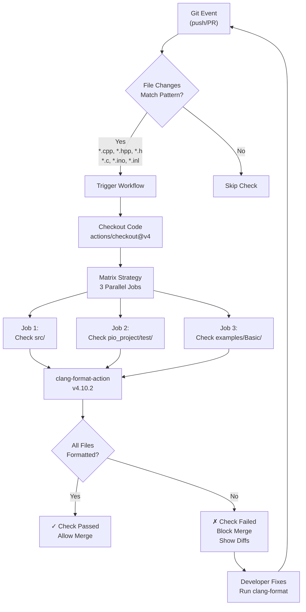
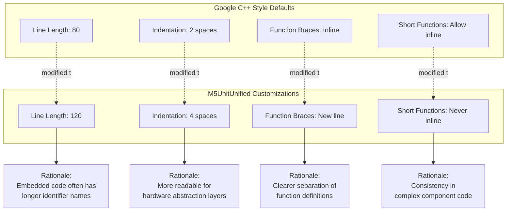
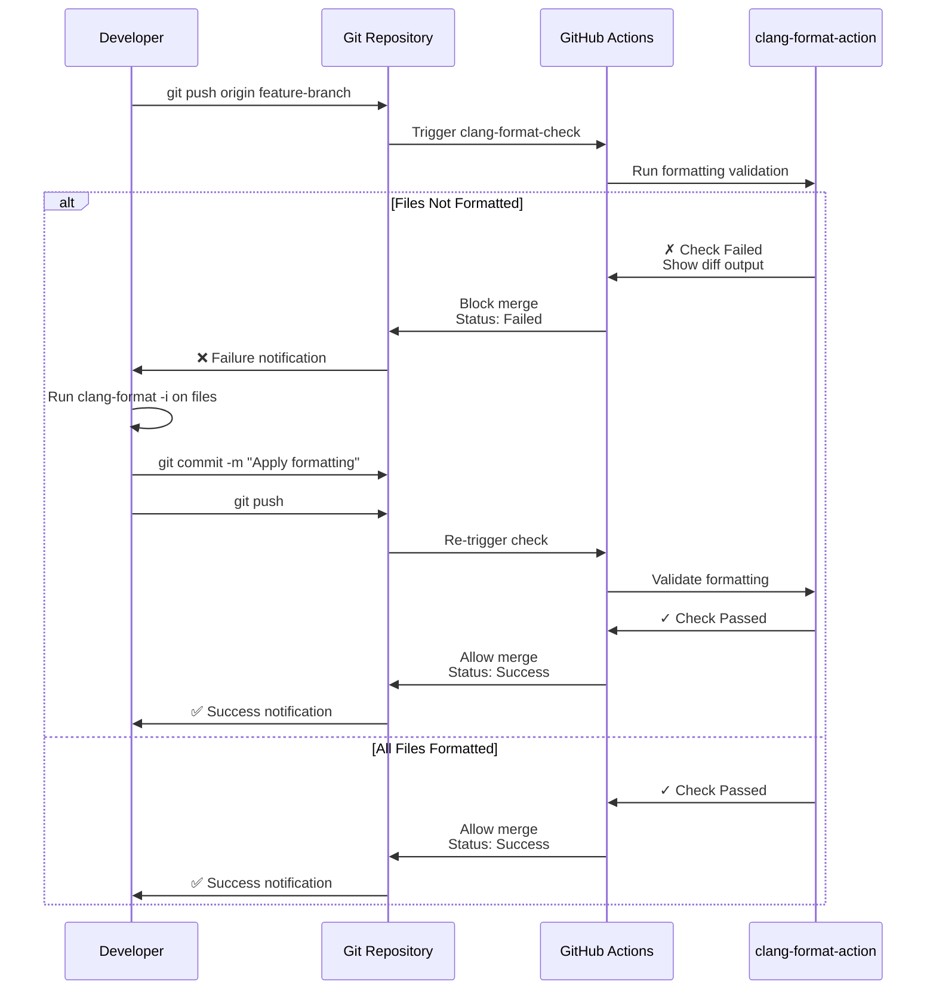

M5UnitUnified Code Standards

# Code Standards

<details>
<summary>Relevant source files</summary>

The following files were used as context for generating this wiki page:

- [.clang-format](.clang-format)
- [.github/ISSUE_TEMPLATE/bug-report.yml](.github/ISSUE_TEMPLATE/bug-report.yml)
- [.github/workflows/Arduino-Lint-Check.yml](.github/workflows/Arduino-Lint-Check.yml)
- [.github/workflows/clang-format-check.yml](.github/workflows/clang-format-check.yml)
- [.github/workflows/doxygen-gh-pages.yml](.github/workflows/doxygen-gh-pages.yml)

</details>


## Purpose and Scope

This page documents the code formatting rules, style guidelines, and automated enforcement mechanisms used in the M5UnitUnified project. It covers the `.clang-format` configuration, the CI/CD formatting checks, and the local development workflow for maintaining consistent code style.

For information about the broader CI/CD infrastructure (Arduino linting, Doxygen generation), see [CI/CD Pipeline](#8.1). For the complete contribution workflow including pull request processes, see [Contributing](#8.3).

---

## Formatting Configuration

The M5UnitUnified project uses **clang-format version 13** with a configuration based on the **Google C++ Style Guide** with project-specific customizations. All formatting rules are defined in [.clang-format:1-168]().

### Base Style and Key Customizations

The configuration begins with `BasedOnStyle: Google` and applies the following major customizations:

| Category | Setting | Value | Description |
|----------|---------|-------|-------------|
| **Line Length** | `ColumnLimit` | 120 | Maximum characters per line (Google default: 80) |
| **Indentation** | `IndentWidth` | 4 | Spaces per indentation level (Google default: 2) |
| **Indentation** | `AccessModifierOffset` | -4 | Outdent access modifiers by 4 spaces |
| **Braces** | `BreakBeforeBraces` | Custom | Function braces on new line, others inline |
| **Braces** | `AfterFunction` | true | Place opening brace of functions on new line |
| **Alignment** | `AlignConsecutiveMacros` | true | Vertically align consecutive macro definitions |
| **Alignment** | `AlignConsecutiveAssignments` | true | Vertically align consecutive assignments |
| **Functions** | `AllowShortFunctionsOnASingleLine` | false | Never collapse function bodies to single line |
| **Blocks** | `AllowShortBlocksOnASingleLine` | Never | Never collapse block structures to single line |
| **Pointers** | `PointerAlignment` | Left | Pointer/reference symbols attach to type (`int* ptr`) |
| **Includes** | `SortIncludes` | false | Do not automatically sort #include directives |

Sources: [.clang-format:1-168]()

### Brace Wrapping Rules

The `BraceWrapping` section [.clang-format:27-43]() defines Custom brace placement:

```yaml
BraceWrapping:
  AfterFunction: true      # Break after function definitions
  AfterClass: false        # Inline for classes
  AfterControlStatement: false  # Inline for if/while/for
  AfterEnum: false         # Inline for enums
  AfterStruct: false       # Inline for structs
  SplitEmptyFunction: true # Place braces on separate lines for empty functions
```

This results in formatting like:

```cpp
// Functions: brace on new line
void Component::begin()
{
    // implementation
}

// Classes/structs: inline braces
class UnitUnified {
    // members
};
```

Sources: [.clang-format:27-43]()

### Include Directive Grouping

The `IncludeCategories` configuration [.clang-format:69-82]() defines four priority groups:

```mermaid
graph TD
    A["Include Directives"] --> B["Priority 1<br/>System headers with .h<br/>&lt;*.h&gt;"]
    A --> C["Priority 2<br/>System headers without .h<br/>&lt;ext/*.h&gt;, &lt;*&gt;"]
    A --> D["Priority 3<br/>Local headers<br/>everything else"]
    
    B --> E["Example:<br/>&lt;stdint.h&gt;<br/>&lt;Wire.h&gt;"]
    C --> F["Example:<br/>&lt;vector&gt;<br/>&lt;memory&gt;<br/>&lt;ext/stdio_filebuf.h&gt;"]
    D --> G["Example:<br/>\"M5Unified.h\"<br/>\"m5_unit_component.hpp\""]
```

**Include Grouping Priorities**

Sources: [.clang-format:69-82]()

### Alignment and Spacing

Key alignment settings [.clang-format:6-11]() that differ from Google Style:

| Setting | Value | Effect |
|---------|-------|--------|
| `AlignConsecutiveMacros` | true | Align macro definitions vertically |
| `AlignConsecutiveAssignments` | true | Align assignment operators vertically |
| `AlignConsecutiveDeclarations` | false | Do not align variable declarations |
| `AlignTrailingComments` | true | Align trailing comments on consecutive lines |

Example of aligned macros and assignments:
```cpp
#define SENSOR_ADDR_DEFAULT  0x76
#define SENSOR_ADDR_ALT      0x77
#define BUFFER_SIZE          256

_address     = cfg.address;
_clockSpeed  = cfg.clock;
_initialized = false;
```

Sources: [.clang-format:6-11]()

---

## Automated Enforcement

### clang-format-check Workflow

The GitHub Actions workflow [.github/workflows/clang-format-check.yml:1-70]() automatically validates code formatting on every push and pull request. The workflow uses `jidicula/clang-format-action@v4.10.2` with clang-format version 13.



**clang-format Check Workflow Execution Flow**

Sources: [.github/workflows/clang-format-check.yml:1-70]()

### Trigger Conditions

The workflow triggers on [.github/workflows/clang-format-check.yml:6-32]():

**Push Events:**
- All branches except tags
- Ignores version tags (`*.*.*`, `v*.*.*`)

**Pull Request Events:**
- Against any branch

**File Patterns:**
- Only when C/C++ files change: `**.cpp`, `**.hpp`, `**.h`, `**.c`, `**.ino`, `**.inl`
- Or when configuration changes: `**.clang-format`, `**clang-format-check.yml`

**Manual Trigger:**
- `workflow_dispatch` for on-demand runs

Sources: [.github/workflows/clang-format-check.yml:6-32]()

### Parallel Check Strategy

The workflow uses a matrix strategy [.github/workflows/clang-format-check.yml:46-54]() to check three directories in parallel:

| Job Name | Check Path | Exclude Pattern | Description |
|----------|------------|-----------------|-------------|
| **Job 1** | `src` | _(none)_ | Core library source code |
| **Job 2** | `pio_project/test` | _(none)_ | GoogleTest unit tests |
| **Job 3** | `examples/Basic` | _(none)_ | Basic example applications |

Each job runs independently and must pass for the overall check to succeed.

Sources: [.github/workflows/clang-format-check.yml:46-54]()

### File Inclusion Regex

The `INCLUDE_REGEX` environment variable [.github/workflows/clang-format-check.yml:4]() defines which files are checked:

```regex
^.*\.((((c|C)(c|pp|xx|\+\+)?$)|((h|H)h?(pp|xx|\+\+)?$))|(inl|ino|pde|proto|cu))$
```

This matches:
- **C source:** `.c`, `.C`, `.cc`, `.cpp`, `.cxx`, `.c++`
- **C headers:** `.h`, `.H`, `.hh`, `.hpp`, `.hxx`, `.h++`
- **Arduino:** `.ino`, `.pde`
- **Other:** `.inl` (inline files), `.proto` (protocol buffers), `.cu` (CUDA)

Sources: [.github/workflows/clang-format-check.yml:4]()

### Concurrency Control

The workflow uses concurrency groups [.github/workflows/clang-format-check.yml:38-40]() to cancel in-progress runs:

```yaml
concurrency:
  group: ${{ github.workflow }}-${{ github.ref }}
  cancel-in-progress: true
```

This ensures that pushing new commits cancels any ongoing format checks for the same branch, reducing CI resource usage.

Sources: [.github/workflows/clang-format-check.yml:38-40]()

---

## Style Guidelines

### Google C++ Style Base

The M5UnitUnified project adopts the **Google C++ Style Guide** as its foundation, specified by `BasedOnStyle: Google` in [.clang-format:3](). This provides:

- Consistent naming conventions
- Clear guidelines for class structure
- Standard comment formatting
- Macro usage patterns

The full Google C++ Style Guide is available at: https://google.github.io/styleguide/cppguide.html

### Major Deviations from Google Style



**Key Style Deviations and Rationale**

Sources: [.clang-format:1-168]()

### Naming Conventions

The codebase follows these naming patterns (not enforced by clang-format but observable in the code):

| Entity Type | Pattern | Example |
|-------------|---------|---------|
| **Classes** | PascalCase | `UnitUnified`, `Component`, `AdapterI2C` |
| **Private Members** | _camelCase | `_address`, `_updated`, `_child` |
| **Public Methods** | camelCase | `begin()`, `update()`, `inPeriodic()` |
| **Constants** | UPPER_SNAKE_CASE | `DEFAULT_ADDRESS`, `BUFFER_SIZE` |
| **Macros** | UPPER_SNAKE_CASE | `M5_UNIT_COMPONENT_HPP_BUILDER` |
| **Namespaces** | lowercase | `m5`, `unit`, `types` |

### Macro Alignment Example

The `AlignConsecutiveMacros: true` setting [.clang-format:6]() produces vertically aligned macro definitions:

```cpp
// From component configuration patterns
#define PERIODIC_MEASUREMENT_UNIT_CONFIG_MEMBER storedSize
#define PERIODIC_MEASUREMENT_UNIT_CONFIG        stored_size

#define DEFAULT_STORED_SIZE 16
#define MAX_STORED_SIZE     256
#define MIN_STORED_SIZE     1
```

Sources: [.clang-format:6]()

---

## Local Development Workflow

### Running clang-format Locally

Developers should format their code before committing to avoid CI failures:

```bash
# Format a single file in-place
clang-format -i path/to/file.cpp

# Format all C++ files in src/ directory
find src/ -name "*.cpp" -o -name "*.hpp" | xargs clang-format -i

# Format all files in examples/
find examples/ -name "*.cpp" -o -name "*.ino" | xargs clang-format -i

# Check formatting without modifying (dry-run)
clang-format --dry-run --Werror path/to/file.cpp
```

### IDE Integration

Most IDEs support automatic clang-format integration:

**Visual Studio Code:**
- Install "C/C++" extension by Microsoft
- Set `"C_Cpp.clang_format_style": "file"` in settings
- Format on save: `"editor.formatOnSave": true`

**CLion/IntelliJ:**
- Settings → Editor → Code Style → C/C++
- Enable "Enable ClangFormat"
- Check "Format code on file save"

**Vim:**
- Use `vim-clang-format` plugin
- Map formatting to a key: `map <C-K> :pyf clang-format.py<cr>`

### Pre-commit Hooks

To enforce formatting before commits, create `.git/hooks/pre-commit`:

```bash
#!/bin/bash
# Format staged C/C++ files before commit
for file in $(git diff --cached --name-only --diff-filter=ACM | grep -E '\.(cpp|hpp|h|c|ino)$'); do
    clang-format -i "$file"
    git add "$file"
done
```

Make executable: `chmod +x .git/hooks/pre-commit`

---

## Format Check Failure Resolution



**Format Check Failure and Resolution Flow**

When a format check fails:

1. **Review the diff output** in the GitHub Actions log
2. **Identify unformatted files** from the error messages
3. **Run clang-format locally** on the affected files
4. **Commit and push** the formatting changes
5. **Wait for re-check** to confirm success

Sources: [.github/workflows/clang-format-check.yml:1-70]()

---

## Summary

The M5UnitUnified code standards ensure consistency across:

- **16+ unit library categories** with 40+ device implementations
- **70+ build environments** across 14 M5Stack devices
- **Multiple contributors** with diverse development environments

The automated enforcement through GitHub Actions ensures:
- ✓ Every pull request meets formatting standards
- ✓ No manual code review time spent on style issues  
- ✓ Consistent code appearance across the entire codebase
- ✓ Easy onboarding for new contributors with clear formatting rules

The configuration strikes a balance between Google's proven style guidelines and the specific needs of embedded hardware abstraction code, prioritizing readability and maintainability.

Sources: [.clang-format:1-168](), [.github/workflows/clang-format-check.yml:1-70]()