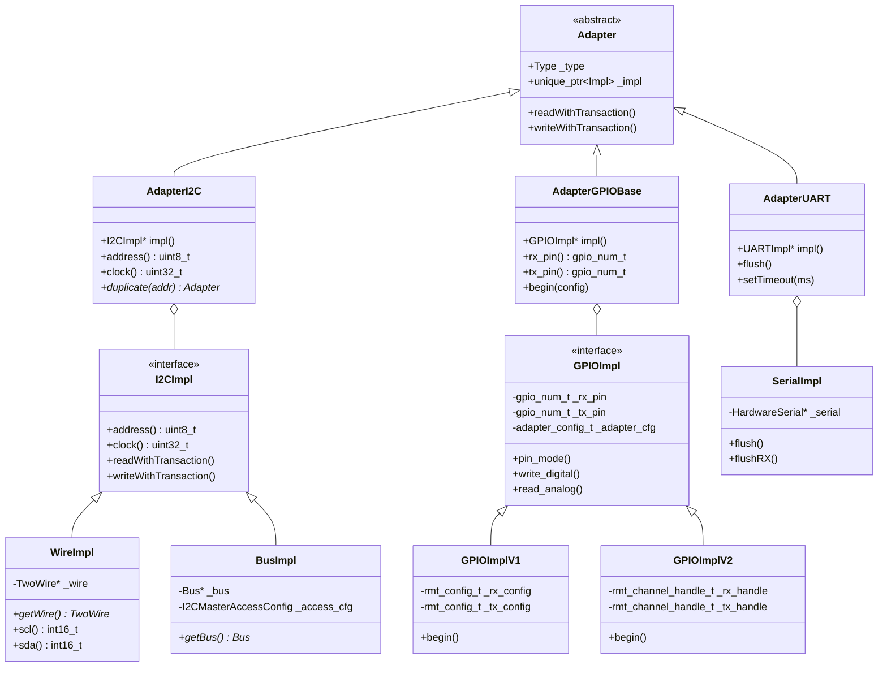
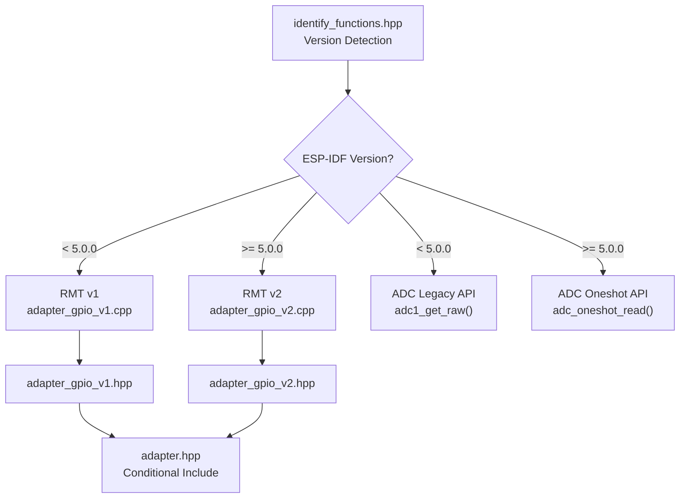
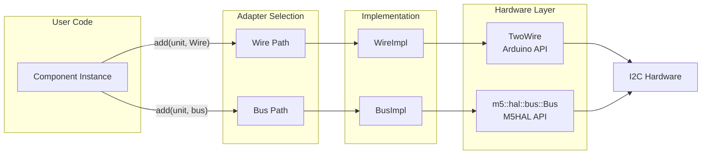
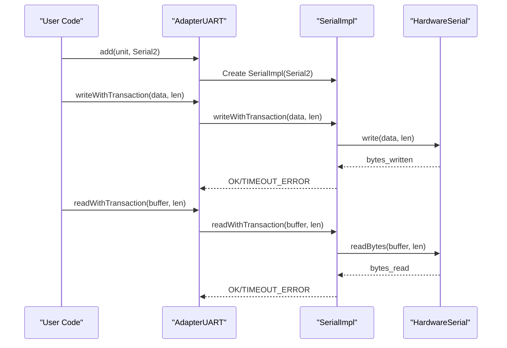
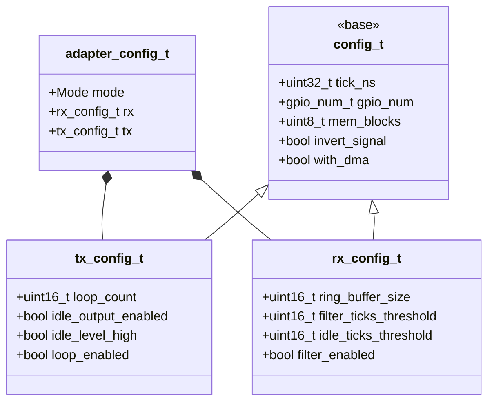
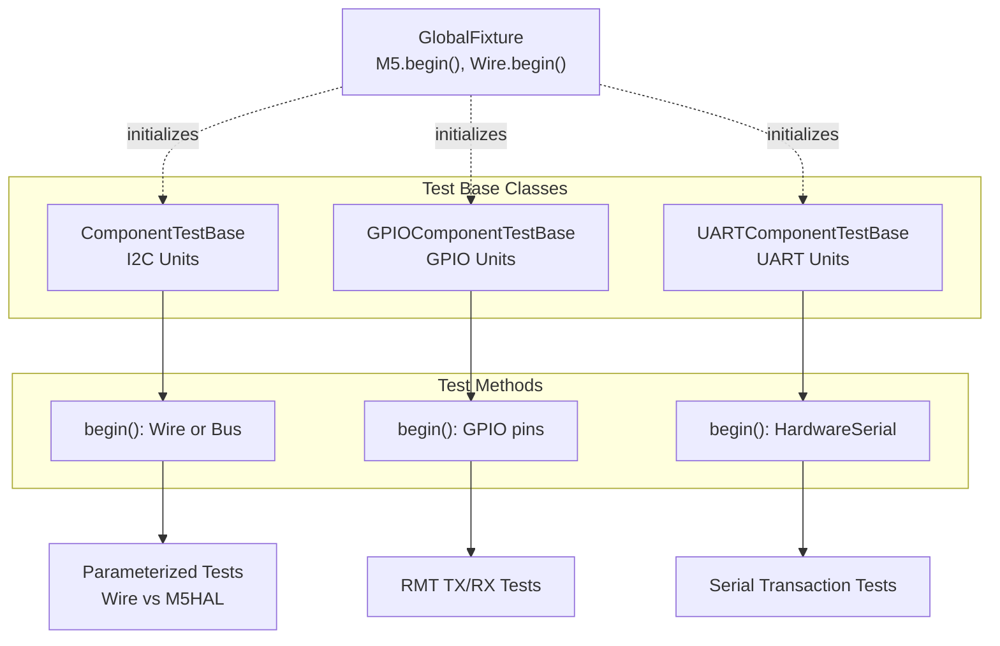
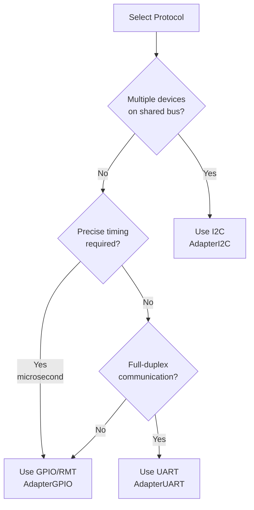

M5UnitUnified Communication Protocols

# Communication Protocols

<details>
<summary>Relevant source files</summary>

The following files were used as context for generating this wiki page:

- [library.json](library.json)
- [library.properties](library.properties)
- [src/googletest/test_helper.hpp](src/googletest/test_helper.hpp)
- [src/googletest/test_template.hpp](src/googletest/test_template.hpp)
- [src/m5_unit_component/adapter.cpp](src/m5_unit_component/adapter.cpp)
- [src/m5_unit_component/adapter.hpp](src/m5_unit_component/adapter.hpp)
- [src/m5_unit_component/adapter_gpio.cpp](src/m5_unit_component/adapter_gpio.cpp)
- [src/m5_unit_component/adapter_gpio.hpp](src/m5_unit_component/adapter_gpio.hpp)
- [src/m5_unit_component/adapter_gpio_v1.cpp](src/m5_unit_component/adapter_gpio_v1.cpp)
- [src/m5_unit_component/adapter_gpio_v2.cpp](src/m5_unit_component/adapter_gpio_v2.cpp)
- [src/m5_unit_component/adapter_gpio_v2.hpp](src/m5_unit_component/adapter_gpio_v2.hpp)
- [src/m5_unit_component/adapter_i2c.hpp](src/m5_unit_component/adapter_i2c.hpp)
- [src/m5_unit_component/adapter_uart.cpp](src/m5_unit_component/adapter_uart.cpp)
- [src/m5_unit_component/identify_functions.hpp](src/m5_unit_component/identify_functions.hpp)
- [src/m5_unit_component/types.hpp](src/m5_unit_component/types.hpp)

</details>


## Purpose and Scope

This page provides an overview of the three communication protocols supported by M5UnitUnified: I2C, GPIO/RMT, and UART. It explains the adapter abstraction layer that unifies these protocols, how components declare protocol support through attributes, and guidance on selecting the appropriate protocol for different sensors.

For detailed implementation specifics of each protocol, see:
- [I2C Communication](#4.1) for address management, clock configuration, and transaction patterns
- [GPIO and RMT](#4.2) for digital/analog operations and pulse timing
- [UART Communication](#4.3) for serial interface details

For information about the adapter pattern design, see [Adapter Pattern](#3.3).

---

## Protocol Overview

M5UnitUnified abstracts three hardware communication protocols through a unified adapter interface. Each protocol serves different sensor types and use cases:

| Protocol | Typical Use Cases | M5Stack Ports | Key Characteristics |
|----------|------------------|---------------|---------------------|
| **I2C** | Environmental sensors, ADCs, IMUs, displays | Port A (Grove) | Multi-device bus, address-based, 100-400kHz |
| **GPIO/RMT** | IR transmitters/receivers, pulse sensors, digital I/O | Port B, GPIO pins | Single/dual wire, precise timing control |
| **UART** | GPS modules, fingerprint sensors, serial devices | Port C (HY2.0) | Full-duplex, configurable baud rate |

Components declare protocol support using attribute bits defined in [src/m5_unit_component/types.hpp:44-50]():

```cpp
namespace attribute {
    constexpr attr_t AccessI2C  = 0x00000001;  // I2C Accessible Unit
    constexpr attr_t AccessGPIO = 0x00000002;  // GPIO Accessible Unit
    constexpr attr_t AccessUART = 0x00000004;  // UART Accessible Unit
}
```

**Sources:** [src/m5_unit_component/types.hpp:44-50](), [library.json:1-31]()

---

## Adapter Type System

### Adapter Hierarchy

The adapter system uses runtime polymorphism to support multiple implementations per protocol. The `Adapter` base class defines a common interface, while protocol-specific adapters extend it with specialized functionality.



**Diagram: Adapter class hierarchy showing protocol implementations**

**Sources:** [src/m5_unit_component/adapter_base.hpp](), [src/m5_unit_component/adapter_i2c.hpp:25-243](), [src/m5_unit_component/adapter_gpio.hpp:40-158](), [src/m5_unit_component/adapter_uart.hpp]()

---

## Implementation Selection

### Compile-Time Protocol Variant Selection

The library automatically selects implementation variants based on compile-time detection of ESP-IDF version and available features:



**Diagram: Conditional compilation for protocol implementations**

The version detection in [src/m5_unit_component/identify_functions.hpp:14-26]() defines preprocessor macros:

```cpp
#if ESP_IDF_VERSION >= ESP_IDF_VERSION_VAL(5, 0, 0)
#define M5_UNIT_UNIFIED_USING_RMT_V2
#define M5_UNIT_UNIFIED_USING_ADC_ONESHOT
#endif
```

These macros control conditional includes in [src/m5_unit_component/adapter.hpp:14-23]():

```cpp
#if defined(M5_UNIT_UNIFIED_USING_RMT_V2)
#include "adapter_gpio_v2.hpp"
#else
#include "adapter_gpio_v1.hpp"
#endif
```

**Sources:** [src/m5_unit_component/identify_functions.hpp:14-26](), [src/m5_unit_component/adapter.hpp:14-23](), [src/m5_unit_component/adapter_gpio_v1.cpp:13-18](), [src/m5_unit_component/adapter_gpio_v2.cpp:12-18]()

---

## Runtime Protocol Selection

### I2C Implementation Variants

Components using I2C can be assigned either Arduino's `TwoWire` or M5HAL's `Bus` interface at runtime:



**Diagram: Runtime selection between TwoWire and M5HAL Bus implementations**

The selection occurs in `UnitUnified::add()` calls:

```cpp
// Using Arduino TwoWire
Units.add(unit, Wire);  // Creates AdapterI2C with WireImpl

// Using M5HAL Bus
auto bus = m5::hal::bus::i2c::getBus(i2c_cfg);
Units.add(unit, bus.value());  // Creates AdapterI2C with BusImpl
```

**Sources:** [src/m5_unit_component/adapter_i2c.hpp:101-136](), [src/m5_unit_component/adapter_i2c.hpp:139-171](), [src/googletest/test_template.hpp:86-100]()

### GPIO Implementation Variants

GPIO adapters support both basic digital/analog operations and RMT peripheral access for precise pulse timing:

| Mode | Enum Value | RMT Usage | Typical Applications |
|------|------------|-----------|---------------------|
| `Input` | 0 | No | Button reading, sensor flags |
| `Output` | 1 | No | LED control, relay switching |
| `Analog` | 8 | No | ADC reading (temperature, light) |
| `RmtRX` | 0x80 | Yes | IR receiver, pulse counting |
| `RmtTX` | 0x81 | Yes | IR transmitter, WS2812 LEDs |
| `RmtRXTX` | 0x82 | Yes | DHT sensors, bidirectional pulse |

Mode definitions from [src/m5_unit_component/types.hpp:60-74]():

```cpp
enum class Mode : uint8_t {
    Input, Output, Pullup, InputPullup, Pulldown, InputPulldown,
    OpenDrain, OutputOpenDrain, Analog,
    RmtRX = 0x80, RmtTX, RmtRXTX,
};
```

**Sources:** [src/m5_unit_component/types.hpp:60-74](), [src/m5_unit_component/adapter_gpio.cpp:45-145]()

### UART Implementation

UART adapters wrap Arduino's `HardwareSerial` interface, providing transaction-based read/write methods:



**Diagram: UART transaction flow through adapter layers**

**Sources:** [src/m5_unit_component/adapter_uart.cpp:25-62](), [src/googletest/test_template.hpp:203-213]()

---

## Protocol Configuration

### I2C Configuration Parameters

I2C adapters store address and clock frequency, modifiable at runtime:

```cpp
// Construction
AdapterI2C adapter(Wire, 0x5C, 400000);  // addr=0x5C, clock=400kHz

// Runtime modification
adapter.setAddress(0x5D);     // Change target address
adapter.setClock(100000);     // Reduce to 100kHz
```

[src/m5_unit_component/adapter_i2c.hpp:36-53]() defines the parameters stored in `I2CImpl`:

```cpp
uint8_t _addr{};                    // I2C device address
uint32_t _clock{100 * 1000U};       // Clock frequency (default 100kHz)
```

**Sources:** [src/m5_unit_component/adapter_i2c.hpp:36-53](), [src/m5_unit_component/adapter_i2c.hpp:190-207]()

### GPIO/RMT Configuration Structure

GPIO adapters accept a unified configuration structure supporting both RMT v1 and v2:



**Diagram: GPIO/RMT configuration structure hierarchy**

From [src/m5_unit_component/types.hpp:80-110]():

```cpp
struct adapter_config_t {
    Mode mode{};        // RmtRX, RmtTX, or RmtRXTX
    rx_config_t rx{};   // RX-specific parameters
    tx_config_t tx{};   // TX-specific parameters
};
```

Key configuration fields:
- `tick_ns`: RMT tick resolution in nanoseconds (determines timing precision)
- `mem_blocks`: RMT memory allocation (v1: 1-8 blocks, v2: symbol buffer size)
- `filter_ticks_threshold`: Minimum valid pulse duration (noise filtering)
- `idle_ticks_threshold`: Timeout for end-of-transmission detection

**Sources:** [src/m5_unit_component/types.hpp:80-110](), [src/m5_unit_component/adapter_gpio.cpp:49-74]()

---

## Testing Infrastructure Protocol Support

The GoogleTest framework provides specialized base classes for each protocol:



**Diagram: Test infrastructure protocol support hierarchy**

From [src/googletest/test_template.hpp:33-54](), the global fixture initializes I2C:

```cpp
template <uint32_t FREQ, uint32_t WNUM = 0>
class GlobalFixture : public ::testing::Environment {
    void SetUp() override {
        auto pin_num_sda = M5.getPin(m5::pin_name_t::port_a_sda);
        auto pin_num_scl = M5.getPin(m5::pin_name_t::port_a_scl);
        w[WNUM]->begin(pin_num_sda, pin_num_scl, FREQ);
    }
};
```

Test base classes handle protocol-specific setup:

| Test Base Class | Protocol | Setup Method | Hardware Used |
|----------------|----------|--------------|---------------|
| `ComponentTestBase` | I2C | Wire.begin() or m5::hal::bus::i2c::getBus() | Port A (SDA/SCL) |
| `GPIOComponentTestBase` | GPIO/RMT | Units.add(unit, rx_pin, tx_pin) | Port B or Port A pins |
| `UARTComponentTestBase` | UART | Units.add(unit, Serial) | HardwareSerial instance |

**Sources:** [src/googletest/test_template.hpp:33-54](), [src/googletest/test_template.hpp:62-110](), [src/googletest/test_template.hpp:118-171](), [src/googletest/test_template.hpp:179-226]()

---

## Protocol Selection Guidelines

### Choosing the Appropriate Protocol

Decision matrix for protocol selection:



**Diagram: Protocol selection decision tree**

### Attribute-Based Protocol Identification

Components declare supported protocols using attribute bits. Applications can query these at runtime:

```cpp
// Check protocol support
if (unit.attribute() & types::attribute::AccessI2C) {
    // I2C protocol supported
}

if (unit.attribute() & types::attribute::AccessGPIO) {
    // GPIO/RMT protocol supported
}

if (unit.attribute() & types::attribute::AccessUART) {
    // UART protocol supported
}
```

Protocol attributes from [src/m5_unit_component/types.hpp:44-50]():

| Attribute Constant | Hex Value | Usage |
|-------------------|-----------|-------|
| `attribute::AccessI2C` | 0x00000001 | I2C-compatible units (most sensors) |
| `attribute::AccessGPIO` | 0x00000002 | GPIO/RMT units (IR, pulse sensors) |
| `attribute::AccessUART` | 0x00000004 | Serial units (GPS, fingerprint) |

**Sources:** [src/m5_unit_component/types.hpp:44-50](), [src/m5_unit_component/types.hpp:36-42]()