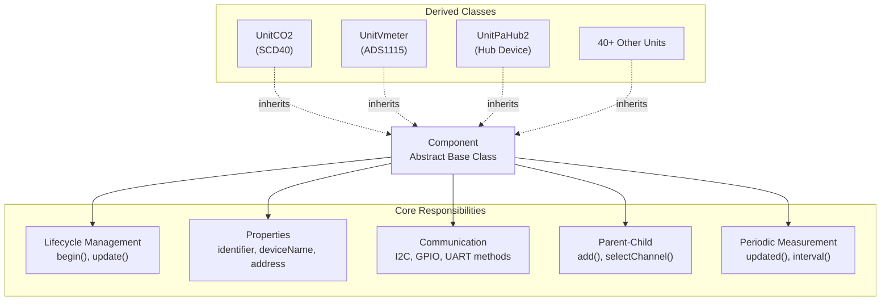
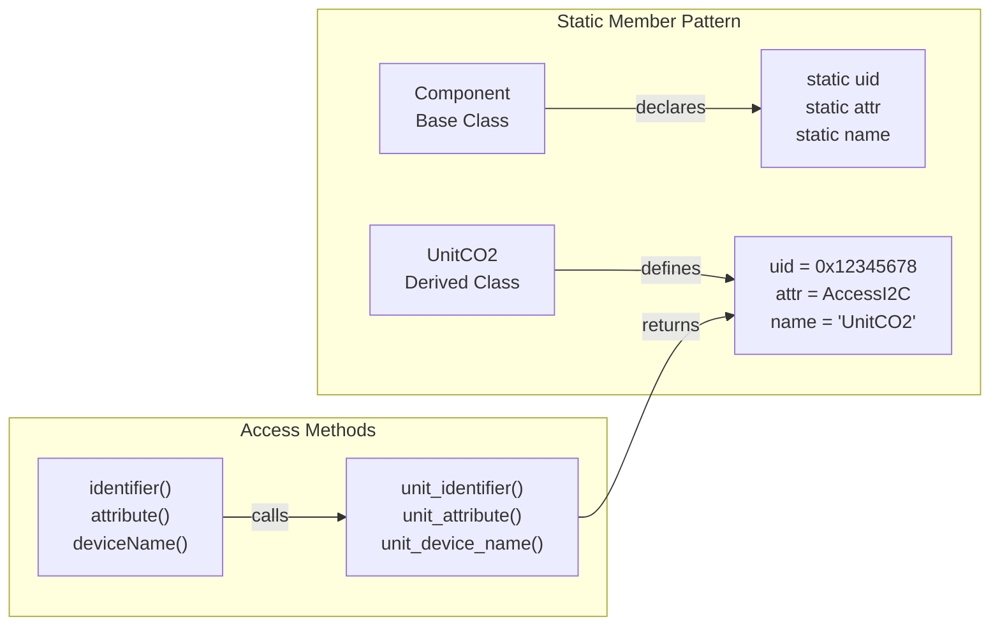
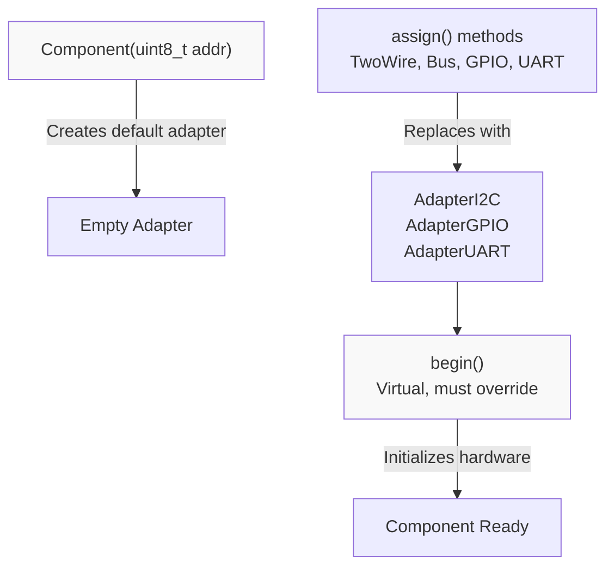
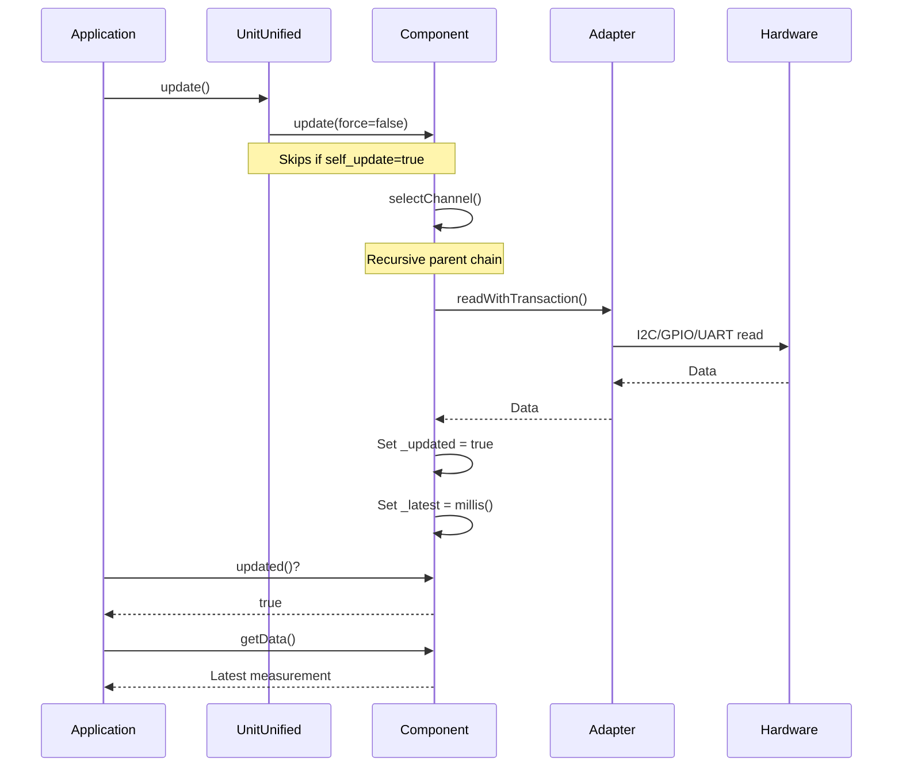
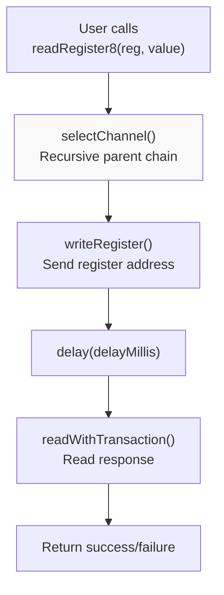
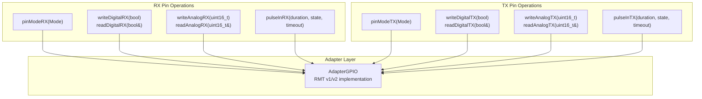
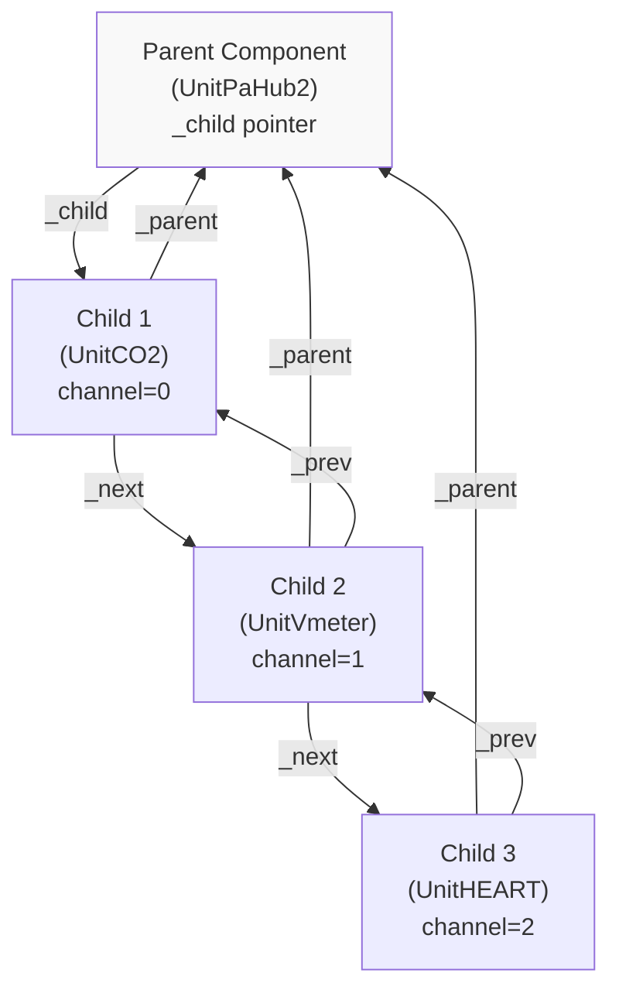
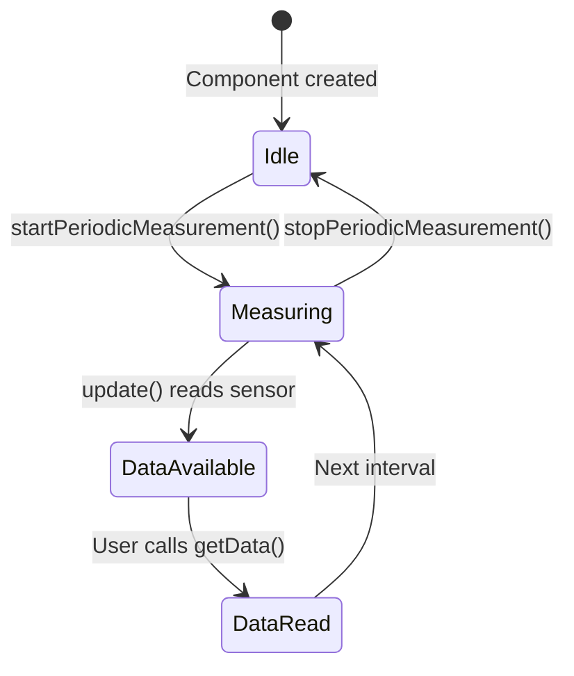
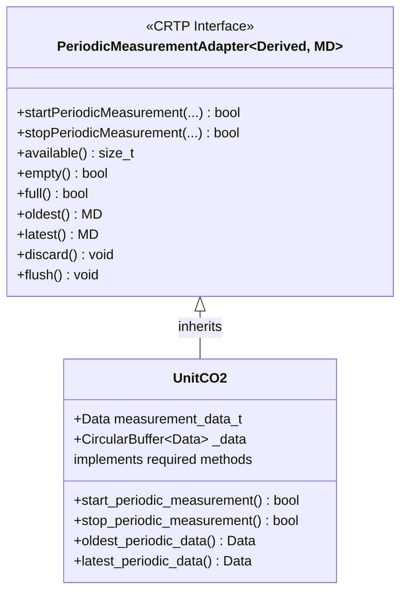

M5UnitUnified Component API

# Component API

<details>
<summary>Relevant source files</summary>

The following files were used as context for generating this wiki page:

- [src/M5UnitComponent.cpp](src/M5UnitComponent.cpp)
- [src/M5UnitComponent.hpp](src/M5UnitComponent.hpp)
- [src/M5UnitUnified.cpp](src/M5UnitUnified.cpp)
- [src/M5UnitUnified.hpp](src/M5UnitUnified.hpp)
- [src/m5_unit_component/adapter_base.hpp](src/m5_unit_component/adapter_base.hpp)
- [src/m5_unit_component/adapter_gpio_v1.hpp](src/m5_unit_component/adapter_gpio_v1.hpp)
- [src/m5_unit_component/adapter_i2c.cpp](src/m5_unit_component/adapter_i2c.cpp)

</details>


This document provides a complete reference for the `Component` base class, which is the foundation for all M5Stack unit implementations in the M5UnitUnified library. The Component class defines the standard interface, lifecycle, and communication patterns that all unit drivers must implement.

For information about managing multiple components, see [UnitUnified API](#9.2). For details on communication adapters, see [Adapter APIs](#9.3). For architectural context on how components interact with the system, see [Component System](#3.1).

---

## Component Class Overview

The `Component` class ([M5UnitComponent.hpp:35-588]()) is an abstract base class that provides:

- **Unified Interface**: Standard methods for initialization, updates, and data access
- **Communication Abstraction**: Protocol-agnostic I2C, GPIO, and UART operations
- **Hierarchy Support**: Parent-child relationships for hub devices
- **Periodic Measurement**: Time-series data buffering and update tracking
- **Adapter Management**: Shared communication adapters for efficient resource usage



**Sources:** [src/M5UnitComponent.hpp:35-588]()

---

## Static Members and Unit Identification

Every component derived from `Component` must define three static members that provide unique identification and capabilities:

| Static Member | Type | Purpose |
|---------------|------|---------|
| `uid` | `types::uid_t` | Unique 32-bit identifier for the unit type |
| `attr` | `types::attr_t` | Attribute flags (I2C/GPIO/UART capabilities) |
| `name` | `const char[]` | Human-readable device name string |
| `DEFAULT_ADDRESS` | `uint8_t` | Default I2C address (if applicable) |

**Definition Location:** [M5UnitComponent.hpp:52-58]()



**Implementation Pattern:**

Derived classes use the `M5_UNIT_COMPONENT_HPP_BUILDER` macro ([M5UnitComponent.hpp:694-721]()) to automatically generate:
- Static member declarations
- Move semantics (copy prohibited)
- Virtual method overrides that return static values

**Sources:** [src/M5UnitComponent.hpp:52-58](), [src/M5UnitComponent.hpp:694-721](), [src/M5UnitComponent.cpp:20-22]()

---

## Component Configuration

### component_config_t Structure

The `component_config_t` structure ([M5UnitComponent.hpp:41-50]()) controls component behavior:

| Field | Type | Default | Description |
|-------|------|---------|-------------|
| `clock` | `uint32_t` | 100000 | Communication clock speed (Hz) |
| `stored_size` | `uint32_t` | 1 | Circular buffer size for periodic measurements |
| `self_update` | `bool` | false | If true, user handles update() calls (e.g., FreeRTOS task) |
| `max_children` | `uint8_t` | 0 | Maximum child components (for hub devices) |

**Configuration Methods:**

```cpp
// Get current configuration
component_config_t cfg = component.component_config();

// Set new configuration (must be called before begin())
cfg.clock = 400000;           // 400kHz I2C
cfg.stored_size = 10;         // Buffer 10 measurements
cfg.self_update = true;       // Async updates
component.component_config(cfg);
```

**Sources:** [src/M5UnitComponent.hpp:41-50](), [src/M5UnitComponent.hpp:83-92]()

---

## Lifecycle Methods

### Constructor and Initialization



**Constructor:** ([M5UnitComponent.hpp:63](), [M5UnitComponent.cpp:24-26]())
```cpp
explicit Component(const uint8_t addr = 0x00);
```
- Creates component with I2C address (0 for GPIO/UART)
- Initializes empty adapter (replaced during registration)
- **Copy prohibited** - only move semantics allowed

**Assignment Methods:** ([M5UnitComponent.hpp:222-230](), [M5UnitComponent.cpp:125-155]())

| Method | Purpose | When Used |
|--------|---------|-----------|
| `assign(m5::hal::bus::Bus*)` | M5HAL bus assignment | M5Stack hardware with Bus API |
| `assign(TwoWire&)` | Arduino Wire assignment | Standard I2C units |
| `assign(int8_t rx, int8_t tx)` | GPIO pins | GPIO/RMT units (e.g., LED, sensors) |
| `assign(HardwareSerial&)` | UART assignment | Serial communication units |

**begin() Method:** ([M5UnitComponent.hpp:100-103]())
```cpp
virtual bool begin();
```
- Called by `UnitUnified::begin()` after registration
- Must be overridden by derived classes to initialize hardware
- Returns `true` on success, `false` on failure
- Default implementation returns `true` (no-op)

**Sources:** [src/M5UnitComponent.hpp:63](), [src/M5UnitComponent.hpp:100-103](), [src/M5UnitComponent.hpp:222-230](), [src/M5UnitComponent.cpp:24-26](), [src/M5UnitComponent.cpp:125-155]()

---

## Update Cycle

### update() Method



**Method Signature:** ([M5UnitComponent.hpp:108-112]())
```cpp
virtual void update(const bool force = false);
```

**Parameters:**
- `force`: If true, forces communication regardless of timing constraints
- Default implementation is no-op; derived classes override for actual measurement logic

**Update Behavior:**

The `UnitUnified` manager ([M5UnitUnified.cpp:136-144]()) calls `update()` on all registered components except those with `self_update=true`. Components with `self_update=true` typically run in FreeRTOS tasks.

**Periodic Measurement Tracking:**

After each successful update, components should set:
- `_updated = true` - Indicates new data available
- `_latest = millis()` - Timestamp of update
- `_interval` - Time between measurements (for periodic sensors)

**Sources:** [src/M5UnitComponent.hpp:108-112](), [src/M5UnitComponent.hpp:192-218](), [src/M5UnitUnified.cpp:136-144]()

---

## Property Accessors

### Component Identity and Status

| Method | Return Type | Description |
|--------|-------------|-------------|
| `deviceName()` | `const char*` | Device name string (e.g., "UnitCO2") |
| `identifier()` | `types::uid_t` | Unique 32-bit identifier |
| `attribute()` | `types::attr_t` | Capability flags (I2C/GPIO/UART) |
| `category()` | `types::category_t` | Unit category (default: None) |
| `order()` | `uint32_t` | Registration order (0 = not registered) |
| `channel()` | `int16_t` | Channel number if child of hub (-1 = none) |
| `address()` | `uint8_t` | I2C address (0 for GPIO/UART) |
| `isRegistered()` | `bool` | True if registered with UnitUnified |

**Definition:** [M5UnitComponent.hpp:114-181]()

### Attribute Checks

```cpp
bool canAccessI2C() const;   // True if unit supports I2C
bool canAccessGPIO() const;  // True if unit supports GPIO
bool canAccessUART() const;  // True if unit supports UART
```

**Implementation:** [M5UnitComponent.cpp:47-60]()

These methods check the `attr` flags against `attribute::AccessI2C`, `attribute::AccessGPIO`, and `attribute::AccessUART`.

### Adapter Access

```cpp
// Get raw adapter pointer
Adapter* adapter() const;

// Type-safe adapter casting
template<class T>
T* asAdapter(Adapter::Type t);
```

**Example Usage:**
```cpp
auto i2c = component.asAdapter<AdapterI2C>(Adapter::Type::I2C);
if (i2c) {
    uint8_t addr = i2c->address();
}
```

**Sources:** [src/M5UnitComponent.hpp:114-181](), [src/M5UnitComponent.cpp:47-60]()

---

## I2C Communication Methods

The Component class provides a comprehensive set of I2C transaction methods that automatically handle channel selection for hub topologies.

### Transaction Pattern



### Core Transaction Methods

**Read Operations:** ([M5UnitComponent.hpp:348-390]())

| Method | Description |
|--------|-------------|
| `readWithTransaction(uint8_t* data, size_t len)` | Read raw bytes from device |
| `readRegister(Reg reg, uint8_t* buf, size_t len, uint32_t delay, bool stop)` | Read from register with delay |
| `readRegister8(Reg reg, uint8_t& result, uint32_t delay, bool stop)` | Read single byte |
| `readRegister16BE(Reg reg, uint16_t& result, uint32_t delay, bool stop)` | Read 16-bit big-endian |
| `readRegister16LE(Reg reg, uint16_t& result, uint32_t delay, bool stop)` | Read 16-bit little-endian |
| `readRegister32BE(Reg reg, uint32_t& result, uint32_t delay, bool stop)` | Read 32-bit big-endian |
| `readRegister32LE(Reg reg, uint32_t& result, uint32_t delay, bool stop)` | Read 32-bit little-endian |

**Write Operations:** ([M5UnitComponent.hpp:392-440]())

| Method | Description |
|--------|-------------|
| `writeWithTransaction(const uint8_t* data, size_t len, uint32_t exparam)` | Write raw bytes |
| `writeWithTransaction(Reg reg, const uint8_t* data, size_t len, bool stop)` | Write to register |
| `writeRegister(Reg reg, const uint8_t* buf, size_t len, bool stop)` | Write to register |
| `writeRegister8(Reg reg, uint8_t value, bool stop)` | Write single byte |
| `writeRegister16BE(Reg reg, uint16_t value, bool stop)` | Write 16-bit big-endian |
| `writeRegister16LE(Reg reg, uint16_t value, bool stop)` | Write 16-bit little-endian |
| `writeRegister32BE(Reg reg, uint32_t value, bool stop)` | Write 32-bit big-endian |
| `writeRegister32LE(Reg reg, uint32_t value, bool stop)` | Write 32-bit little-endian |

**Template Parameters:**
- `Reg` can be `uint8_t` or `uint16_t` (register address width)
- Endianness methods handle byte order automatically

### Special Operations

**General Call:** ([M5UnitComponent.hpp:341](), [M5UnitComponent.cpp:282-285]())
```cpp
bool generalCall(const uint8_t* data, const size_t len);
```
Broadcasts data to address 0x00 (all devices on bus).

**Address Change:** ([M5UnitComponent.cpp:347-360]())
```cpp
bool changeAddress(const uint8_t addr);
```
Updates I2C address for devices that support dynamic addressing.

### Implementation Details

**Read Flow:** ([M5UnitComponent.cpp:192-202]())
1. `writeRegister()` sends register address
2. Optional delay for device processing
3. `readWithTransaction()` retrieves data
4. Returns success/failure

**Write Flow:** ([M5UnitComponent.cpp:173-177]())
1. `selectChannel()` configures hub path
2. Adapter performs I2C transaction
3. Returns error code from M5HAL

**Sources:** [src/M5UnitComponent.hpp:348-440](), [src/M5UnitComponent.cpp:166-280](), [src/M5UnitComponent.cpp:282-285](), [src/M5UnitComponent.cpp:347-360]()

---

## GPIO Operations

The Component class provides methods for GPIO operations on RX and TX pins, primarily used by units connected via GPIO instead of I2C.

### Pin Operation Categories



### RX Pin Methods

**Declaration:** [M5UnitComponent.hpp:443-448]()  
**Implementation:** [M5UnitComponent.cpp:287-315]()

| Method | Return | Description |
|--------|--------|-------------|
| `pinModeRX(gpio::Mode m)` | `bool` | Configure pin mode (input/output/etc.) |
| `writeDigitalRX(bool high)` | `bool` | Write digital HIGH/LOW |
| `readDigitalRX(bool& high)` | `bool` | Read digital state |
| `writeAnalogRX(uint16_t v)` | `bool` | Write PWM/DAC value |
| `readAnalogRX(uint16_t& v)` | `bool` | Read ADC value |
| `pulseInRX(uint32_t& duration, int state, uint32_t timeout_us)` | `bool` | Measure pulse duration |

### TX Pin Methods

**Declaration:** [M5UnitComponent.hpp:450-455]()  
**Implementation:** [M5UnitComponent.cpp:317-345]()

| Method | Return | Description |
|--------|--------|-------------|
| `pinModeTX(gpio::Mode m)` | `bool` | Configure pin mode |
| `writeDigitalTX(bool high)` | `bool` | Write digital HIGH/LOW |
| `readDigitalTX(bool& high)` | `bool` | Read digital state |
| `writeAnalogTX(uint16_t v)` | `bool` | Write PWM/DAC value |
| `readAnalogTX(uint16_t& v)` | `bool` | Read ADC value |
| `pulseInTX(uint32_t& duration, int state, uint32_t timeout_us)` | `bool` | Measure pulse duration |

**All methods return:**
- `true` on success
- `false` on failure

**Sources:** [src/M5UnitComponent.hpp:443-455](), [src/M5UnitComponent.cpp:287-345]()

---

## Parent-Child Hierarchy

Components can form parent-child relationships to represent hub topologies where one device (hub) connects multiple child devices through channels.

### Hierarchy Structure



### Hierarchy Methods

**Query Methods:** ([M5UnitComponent.hpp:235-272]())

| Method | Return | Description |
|--------|--------|-------------|
| `hasParent()` | `bool` | True if connected to a hub |
| `hasSiblings()` | `bool` | True if other devices share same parent |
| `hasChildren()` | `bool` | True if hub with connected devices |
| `childrenSize()` | `size_t` | Number of child devices |
| `existsChild(uint8_t ch)` | `bool` | Check if channel occupied |
| `parent()` | `Component*` | Get parent component |
| `child(uint8_t ch)` | `Component*` | Get child at channel |

**Relationship Management:** ([M5UnitComponent.hpp:269-272](), [M5UnitComponent.cpp:62-123]())

```cpp
bool add(Component& c, const int16_t channel);
```
Connects component `c` to `this` hub at specified `channel`:
- Validates `max_children` not exceeded
- Checks channel not already occupied
- Ensures neither parent nor child already registered
- Adds child to linked list
- Sets child's `_channel` and `_parent` pointers

**Channel Selection:** ([M5UnitComponent.hpp:271](), [M5UnitComponent.cpp:157-164]())

```cpp
bool selectChannel(const uint8_t ch);
```
Recursively selects channel path from child to root:
1. If component has parent, recursively call `parent->selectChannel(this->channel())`
2. Call virtual `select_channel(ch)` on this component (hub implements multiplexer control)
3. Returns true if entire chain successful

### Child Iteration

**Iterator Pattern:** ([M5UnitComponent.hpp:275-338]())

```cpp
// Forward iterator through children
for (auto it = parent.childBegin(); it != parent.childEnd(); ++it) {
    Component& child = *it;
    // Process child
}
```

The iterator follows the `_next` pointer chain to traverse all children.

**Sources:** [src/M5UnitComponent.hpp:235-272](), [src/M5UnitComponent.hpp:275-338](), [src/M5UnitComponent.cpp:28-123](), [src/M5UnitComponent.cpp:157-164]()

---

## Periodic Measurement Tracking

Components that perform periodic measurements (e.g., temperature sensors updating every second) use built-in tracking for efficient polling.

### Measurement State



### Tracking Properties

**Status Methods:** ([M5UnitComponent.hpp:192-218]())

| Method | Return Type | Description |
|--------|-------------|-------------|
| `inPeriodic()` | `bool` | True if periodic measurement active |
| `updated()` | `bool` | True if new data available since last check |
| `updatedMillis()` | `types::elapsed_time_t` | Timestamp of last update (ms) |
| `interval()` | `types::elapsed_time_t` | Time between measurements (ms) |

### Update Pattern

**Component Implementation:**
1. In `update()`, read sensor data
2. Set `_updated = true` to signal new data
3. Set `_latest = millis()` for timestamp
4. Store data in circular buffer (if using PeriodicMeasurementAdapter)

**Application Usage:**
```cpp
void loop() {
    Units.update();  // Polls all components
    
    if (sensor.updated()) {
        auto data = sensor.latest();  // Get new measurement
        // Process data
    }
}
```

### Protected Members

**Member Variables:** ([M5UnitComponent.hpp:566-569]())

| Member | Type | Purpose |
|--------|------|---------|
| `_latest` | `types::elapsed_time_t` | Last update timestamp |
| `_interval` | `types::elapsed_time_t` | Measurement interval |
| `_periodic` | `bool` | Periodic mode active flag |
| `_updated` | `bool` | New data flag |

**Virtual Method:** ([M5UnitComponent.hpp:521-524]())
```cpp
virtual bool in_periodic() const { return _periodic; }
```
Override to customize periodic measurement detection.

**Sources:** [src/M5UnitComponent.hpp:192-218](), [src/M5UnitComponent.hpp:521-524](), [src/M5UnitComponent.hpp:566-569]()

---

## PeriodicMeasurementAdapter CRTP

The `PeriodicMeasurementAdapter` template class ([M5UnitComponent.hpp:607-687]()) provides a standardized interface for components that accumulate periodic measurement data in circular buffers.

### CRTP Pattern



### Required Implementation

**Derived Class Must Provide:**

1. **Data Type:** `MD` - Measurement data structure
2. **Storage:** `std::unique_ptr<m5::container::CircularBuffer<MD>> _data{}`
3. **Methods to implement:**
   - `MD oldest_periodic_data() const`
   - `MD latest_periodic_data() const`
   - `bool start_periodic_measurement(...)`
   - `bool stop_periodic_measurement()`
   - Virtual pure methods from base (available, empty, full, discard, flush)

### Public Interface

**Lifecycle:** ([M5UnitComponent.hpp:618-636]())

| Method | Description |
|--------|-------------|
| `startPeriodicMeasurement(...)` | Start periodic measurement (variadic args) |
| `stopPeriodicMeasurement(...)` | Stop periodic measurement (variadic args) |

**Data Access:** ([M5UnitComponent.hpp:640-675]())

| Method | Return | Description |
|--------|--------|-------------|
| `available()` | `size_t` | Number of stored measurements |
| `empty()` | `bool` | True if no data buffered |
| `full()` | `bool` | True if buffer at capacity |
| `oldest()` | `MD` | Retrieve oldest buffered data |
| `latest()` | `MD` | Retrieve latest buffered data |
| `discard()` | `void` | Remove oldest data point |
| `flush()` | `void` | Clear all buffered data |

### Helper Macro

**M5_UNIT_COMPONENT_PERIODIC_MEASUREMENT_ADAPTER_HPP_BUILDER:** ([M5UnitComponent.hpp:724-755]())

```cpp
M5_UNIT_COMPONENT_PERIODIC_MEASUREMENT_ADAPTER_HPP_BUILDER(UnitCO2, Data)
```

Generates boilerplate implementations of:
- `oldest_periodic_data()` / `latest_periodic_data()` - Return front/back from `_data` buffer
- `available_periodic_measurement_data()` - Return `_data->size()`
- `empty_periodic_measurement_data()` - Return `_data->empty()`
- `full_periodic_measurement_data()` - Return `_data->full()`
- `discard_periodic_measurement_data()` - Call `_data->pop_front()`
- `flush_periodic_measurement_data()` - Call `_data->clear()`

**Sources:** [src/M5UnitComponent.hpp:607-687](), [src/M5UnitComponent.hpp:724-755]()

---

## Builder Macros

### M5_UNIT_COMPONENT_HPP_BUILDER

**Definition:** [M5UnitComponent.hpp:694-721]()

This macro generates standard boilerplate for derived component classes:

```cpp
M5_UNIT_COMPONENT_HPP_BUILDER(UnitCO2, 0x62)
```

**Generated Code:**

| Element | Generated |
|---------|-----------|
| `DEFAULT_ADDRESS` | `constexpr static uint8_t DEFAULT_ADDRESS{0x62}` |
| Static members | `static const types::uid_t uid;`<br/>`static const types::attr_t attr;`<br/>`static const char name[];` |
| Copy prohibition | `UnitCO2(const UnitCO2&) = delete;`<br/>`UnitCO2& operator=(const UnitCO2&) = delete;` |
| Move semantics | `UnitCO2(UnitCO2&&) noexcept = default;`<br/>`UnitCO2& operator=(UnitCO2&&) noexcept = default;` |
| Virtual overrides | `virtual const char* unit_device_name() const override { return name; }`<br/>`virtual types::uid_t unit_identifier() const override { return uid; }`<br/>`virtual types::attr_t unit_attribute() const override { return attr; }` |

**Usage Pattern:**

```cpp
class UnitCO2 : public Component {
    M5_UNIT_COMPONENT_HPP_BUILDER(UnitCO2, 0x62)
    
public:
    UnitCO2(uint8_t addr = DEFAULT_ADDRESS) : Component(addr) {}
    // ... rest of implementation
};
```

**Benefits:**
- Eliminates repetitive declarations
- Ensures consistent implementation pattern
- Enforces move-only semantics (prevents accidental copies)
- Automatically implements identifier methods

**Sources:** [src/M5UnitComponent.hpp:694-721]()

---

## Debug Information

### debugInfo() Method

**Declaration:** [M5UnitComponent.hpp:344]()  
**Implementation:** [M5UnitComponent.cpp:362-381]()

```cpp
virtual std::string debugInfo() const;
```

Returns formatted string containing:
- Device name
- Unique identifier (hex)
- Adapter information:
  - I2C: Address, shared pointer count
  - GPIO: RX/TX pin numbers, shared pointer count
  - Other: Type, shared pointer count
- Channel number
- Parent status
- Children count / max children

**Example Output:**
```
[UnitCO2]:ID{0x12345678}:0xABCDEF00:2 ADDR:62 CH:0 parent:1 children:0/0
```

**Format Components:**
- `[UnitCO2]` - Device name
- `ID{0x12345678}` - Unique identifier
- `0xABCDEF00:2` - Adapter pointer and use count
- `ADDR:62` - I2C address
- `CH:0` - Channel number (-1 if none)
- `parent:1` - Has parent (0/1)
- `children:0/0` - Current/max children

**Sources:** [src/M5UnitComponent.hpp:344](), [src/M5UnitComponent.cpp:362-381]()

---

## Member Access Control

### Public Members

- **Lifecycle:** `begin()`, `update()`
- **Properties:** All getter methods
- **Communication:** All I2C, GPIO, UART methods
- **Hierarchy:** All parent-child management methods
- **Periodic:** All measurement tracking methods

### Protected Members

**Virtual Methods for Override:** ([M5UnitComponent.hpp:514-535]())

| Method | Purpose |
|--------|---------|
| `unit_device_name()` | Return device name (pure virtual) |
| `unit_identifier()` | Return unique ID (pure virtual) |
| `unit_attribute()` | Return attribute flags (pure virtual) |
| `unit_category()` | Return category (default: None) |
| `in_periodic()` | Check periodic mode (default: return `_periodic`) |
| `ensure_adapter(uint8_t ch)` | Return adapter for child at channel (for hub sharing) |
| `select_channel(uint8_t ch)` | Implement channel selection (for hubs) |

**Helper Methods:**
- `stored_size()` - Get configured buffer size
- `add_child(Component*)` - Internal child addition
- `changeAddress(uint8_t)` - Change I2C address dynamically

**Data Members:** ([M5UnitComponent.hpp:566-569]())
- `_latest`, `_interval`, `_periodic`, `_updated` - Periodic tracking

### Private Members

**State Variables:** ([M5UnitComponent.hpp:572-586]())

| Member | Type | Purpose |
|--------|------|---------|
| `_manager` | `UnitUnified*` | Managing UnitUnified instance |
| `_adapter` | `std::shared_ptr<Adapter>` | Communication adapter |
| `_order` | `uint32_t` | Registration order number |
| `_component_cfg` | `component_config_t` | Configuration settings |
| `_channel` | `int16_t` | Channel number (-1 = none) |
| `_addr` | `uint8_t` | I2C address |
| `_begun` | `bool` | begin() called successfully |
| `_parent`, `_next`, `_prev`, `_child` | `Component*` | Hierarchy pointers |

**Friend Class:** `UnitUnified` has private access for registration management.

**Sources:** [src/M5UnitComponent.hpp:514-586]()

---

## Copy and Move Semantics

### Copy Prohibition

**Rationale:** Components manage unique hardware resources (I2C addresses, GPIO pins) that cannot be safely copied. The adapter's `std::shared_ptr` allows sharing but the Component itself must not be duplicated.

**Enforcement:** ([M5UnitComponent.hpp:65-76]())
```cpp
Component(const Component&) = delete;
Component& operator=(const Component&) = delete;
```

### Move Semantics

**Allowance:** Components support move operations for container storage and efficient transfers:

```cpp
Component(Component&&) noexcept = default;
Component& operator=(Component&&) noexcept = default;
```

**Use Cases:**
- Storing components in `std::vector`
- Transferring ownership between scopes
- Building component hierarchies dynamically

**Note:** The `M5_UNIT_COMPONENT_HPP_BUILDER` macro ([M5UnitComponent.hpp:694-721]()) automatically generates these declarations for derived classes.

**Sources:** [src/M5UnitComponent.hpp:65-76](), [src/M5UnitComponent.hpp:694-721]()

---

## Template Instantiation

The Component class uses template methods for register operations with compile-time type safety. Explicit instantiation ensures all combinations are available at link time.

**Instantiated Templates:** ([M5UnitComponent.cpp:384-405]())

### Read Operations

- `readRegister<uint8_t>` / `readRegister<uint16_t>`
- `readRegister8<uint8_t>` / `readRegister8<uint16_t>`
- `read_register16E<uint8_t>` / `read_register16E<uint16_t>`
- `read_register32E<uint8_t>` / `read_register32E<uint16_t>`

### Write Operations

- `writeRegister<uint8_t>` / `writeRegister<uint16_t>`
- `writeRegister8<uint8_t>` / `writeRegister8<uint16_t>`
- `write_register16E<uint8_t>` / `write_register16E<uint16_t>`
- `write_register32E<uint8_t>` / `write_register32E<uint16_t>`
- `writeWithTransaction<uint8_t>` / `writeWithTransaction<uint16_t>`

**Template Constraints:**
- `Reg` must be integral, unsigned, and 1 or 2 bytes
- Enforced via `std::enable_if` at compile time

**Sources:** [src/M5UnitComponent.cpp:384-405]()