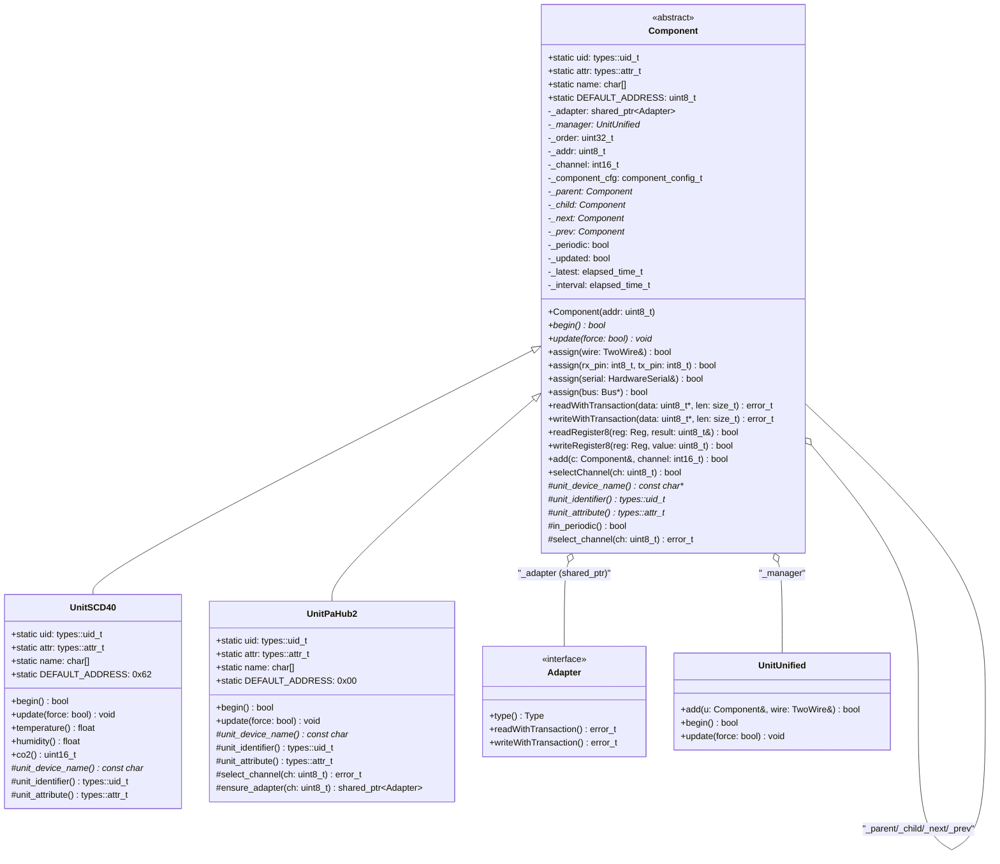
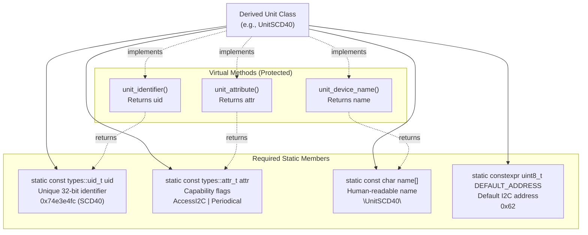
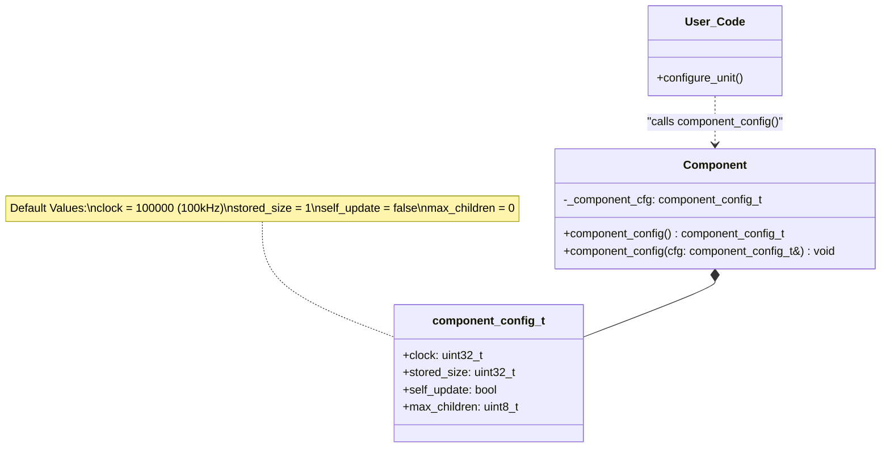
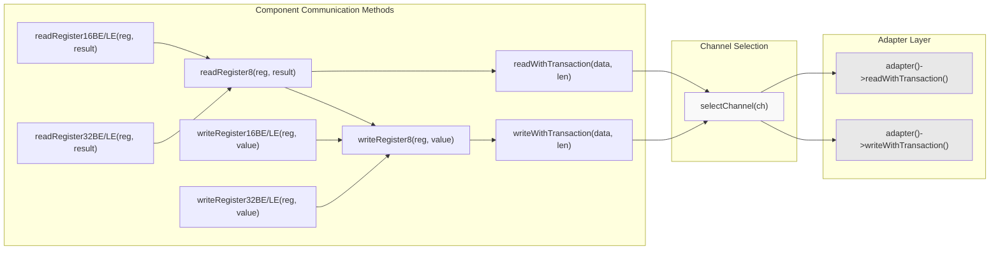
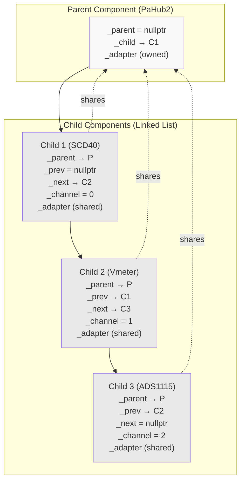
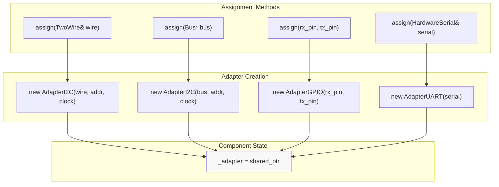
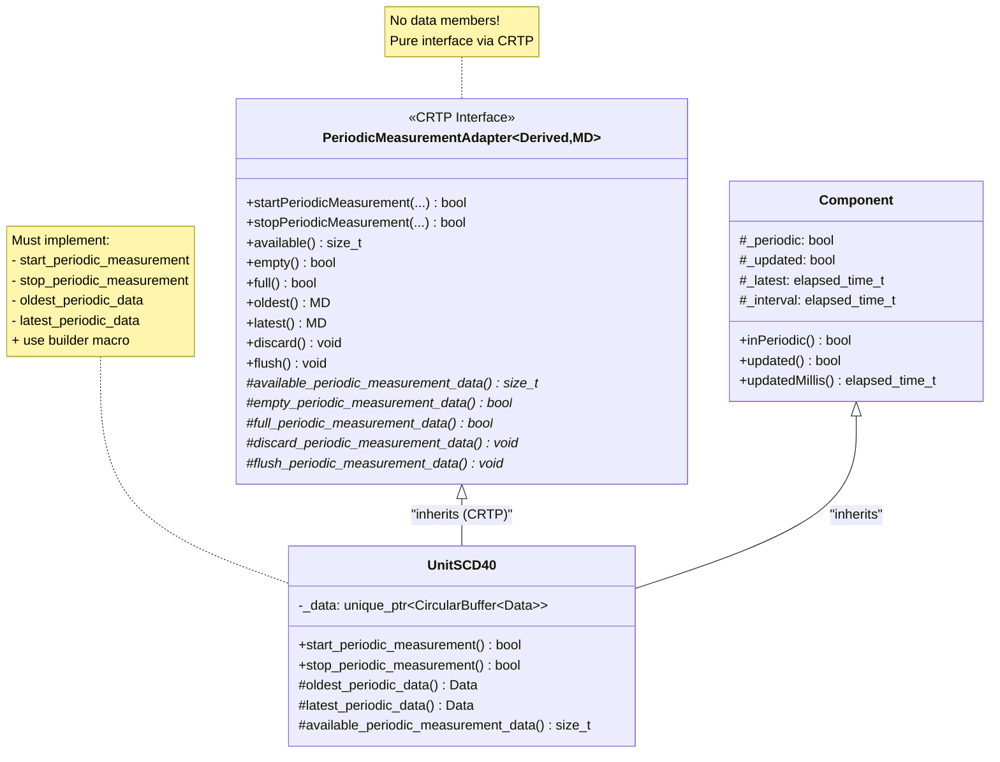

M5UnitUnified Component System

# Component System

<details>
<summary>Relevant source files</summary>

The following files were used as context for generating this wiki page:

- [src/M5UnitComponent.cpp](src/M5UnitComponent.cpp)
- [src/M5UnitComponent.hpp](src/M5UnitComponent.hpp)
- [src/M5UnitUnified.cpp](src/M5UnitUnified.cpp)
- [src/M5UnitUnified.hpp](src/M5UnitUnified.hpp)
- [src/m5_unit_component/adapter_base.hpp](src/m5_unit_component/adapter_base.hpp)
- [src/m5_unit_component/adapter_gpio_v1.hpp](src/m5_unit_component/adapter_gpio_v1.hpp)
- [src/m5_unit_component/adapter_i2c.cpp](src/m5_unit_component/adapter_i2c.cpp)

</details>


## Purpose and Scope

This document provides a comprehensive overview of the `Component` base class, which serves as the foundation for all M5Stack unit devices in the M5UnitUnified library. The Component system defines the lifecycle, configuration, properties, and communication interfaces that all sensor and peripheral units must implement. This page covers the class structure, required static members, lifecycle methods, configuration options, and the CRTP-based periodic measurement interface.

For information about how components are registered and managed by the system, see [UnitUnified Manager](#3.2). For communication protocol implementations, see [Adapter Pattern](#3.3). For hierarchical device topologies using hubs, see [Parent-Child Hierarchies](#3.4).

## Component Class Structure

The `Component` class ([src/M5UnitComponent.hpp:35-588]()) is an abstract base class that provides a unified interface for all M5Stack unit devices. Every sensor or peripheral in the ecosystem derives from this class and inherits its lifecycle management, communication infrastructure, and hierarchical organization capabilities.



**Sources:** [src/M5UnitComponent.hpp:35-588](), [src/M5UnitComponent.cpp:24-26]()

### Class Members Summary

| Category | Members | Purpose |
|----------|---------|---------|
| **Static** | `uid`, `attr`, `name`, `DEFAULT_ADDRESS` | Device identification and default configuration |
| **Communication** | `_adapter`, `_addr`, `_channel` | Protocol abstraction and addressing |
| **Lifecycle** | `_manager`, `_order`, `_begun` | Registration and initialization tracking |
| **Configuration** | `_component_cfg` | Runtime configuration parameters |
| **Hierarchy** | `_parent`, `_child`, `_next`, `_prev` | Parent-child device tree structure |
| **Periodic** | `_periodic`, `_updated`, `_latest`, `_interval` | Time-based measurement state |

**Sources:** [src/M5UnitComponent.hpp:565-586]()

## Static Member Requirements

Every derived class **must** define four static members to uniquely identify the device type and specify its capabilities. These members are validated at compile-time by the test suite.



**Sources:** [src/M5UnitComponent.hpp:52-58](), [src/M5UnitComponent.hpp:694-721]()

### Static Member Definitions

#### Unique Identifier (uid)

The `uid` is a 32-bit hash that uniquely identifies the device type across the entire M5Stack ecosystem. It prevents configuration conflicts when multiple unit types are connected.

```cpp
// Example from a derived class
static const types::uid_t uid{0x74e3e4fc};  // Computed hash for UnitSCD40
```

**Sources:** [src/M5UnitComponent.hpp:55]()

#### Attributes (attr)

The `attr` bitmask specifies device capabilities using flags from `types::attribute`:

| Flag | Value | Meaning |
|------|-------|---------|
| `AccessI2C` | 0x01 | Device communicates via I2C |
| `AccessGPIO` | 0x02 | Device communicates via GPIO/RMT |
| `AccessUART` | 0x04 | Device communicates via UART |
| `Periodical` | 0x08 | Device supports periodic measurements |

**Sources:** [src/M5UnitComponent.hpp:56](), [src/M5UnitComponent.cpp:47-60]()

#### Device Name

A human-readable string identifying the device type, used in debugging and logging.

```cpp
static const char name[]{"UnitSCD40"};
```

**Sources:** [src/M5UnitComponent.hpp:57](), [src/M5UnitComponent.cpp:20]()

#### Default Address

For I2C devices, this specifies the factory-default address (typically defined via `M5_UNIT_COMPONENT_HPP_BUILDER` macro).

**Sources:** [src/M5UnitComponent.hpp:696]()

## Lifecycle Methods

Components follow a two-phase initialization pattern: registration via `UnitUnified::add()`, followed by `begin()` to initialize hardware, and continuous operation via `update()`.

```mermaid
stateDiagram-v2
    [*] --> Unregistered: "new Component()"
    
    Unregistered --> Registered: "UnitUnified::add()<br/>assigns _manager<br/>assigns _adapter<br/>sets _order"
    
    Registered --> Begun: "Component::begin()<br/>hardware initialization<br/>sets _begun flag"
    
    Begun --> Updating: "Component::update()<br/>periodic calls"
    
    Updating --> Updating: "repeated calls<br/>reads sensors<br/>updates _updated flag<br/>stores _latest timestamp"
    
    Updating --> [*]: "program end"
    
    note right of Registered
        Configuration via
        component_config_t
        must happen before begin()
    end note
    
    note right of Updating
        update() skipped if
        self_update == true
    end note
```

**Sources:** [src/M5UnitComponent.hpp:100-112](), [src/M5UnitUnified.cpp:124-144]()

### begin() Method

The `begin()` method ([src/M5UnitComponent.hpp:100-103]()) is called once during initialization to set up the hardware and configure the device. Derived classes must override this to perform device-specific initialization.

**Default Implementation:**
```cpp
virtual bool begin() {
    return true;  // Base class does nothing
}
```

**Typical Override Pattern:**
1. Call parent `begin()` if needed
2. Verify device presence (e.g., read WHO_AM_I register)
3. Write configuration registers
4. Initialize internal state (e.g., allocate circular buffers)
5. Return success/failure

**Sources:** [src/M5UnitComponent.hpp:100-103](), [src/M5UnitUnified.cpp:124-134]()

### update() Method

The `update()` method ([src/M5UnitComponent.hpp:108-112]()) is called periodically to read sensor data and update internal state. It supports both polled and self-update patterns.

**Parameters:**
- `force` (bool): When true, forces an immediate update even if interval hasn't elapsed

**Typical Override Pattern:**
1. Check if sufficient time has elapsed since last update
2. Call `selectChannel()` for hierarchical devices
3. Read sensor data via `readWithTransaction()` or `readRegister*()`
4. Process and store data
5. Set `_updated = true` and record `_latest` timestamp

**Sources:** [src/M5UnitComponent.hpp:108-112](), [src/M5UnitUnified.cpp:136-144]()

## Configuration System

Components are configured via the `component_config_t` structure, which provides runtime settings that affect behavior across all device types.



**Sources:** [src/M5UnitComponent.hpp:41-50](), [src/M5UnitComponent.hpp:83-92]()

### Configuration Parameters

#### clock

Communication bus clock speed in Hz. For I2C devices, this is the SCL frequency (default: 100 kHz).

```cpp
auto cfg = unit.component_config();
cfg.clock = 400000;  // Set to 400 kHz for faster communication
unit.component_config(cfg);
```

**Sources:** [src/M5UnitComponent.hpp:43](), [src/M5UnitComponent.cpp:128](), [src/adapter_i2c.cpp:65-72]()

#### stored_size

Maximum number of periodic measurement samples to store in the circular buffer. Applies to devices using `PeriodicMeasurementAdapter`.

**Sources:** [src/M5UnitComponent.hpp:45](), [src/M5UnitComponent.hpp:537-540]()

#### self_update

When `true`, the component manages its own update cycle (e.g., via FreeRTOS task) and is skipped by `UnitUnified::update()`. See [Self-Update Pattern](#5.3) for details.

**Sources:** [src/M5UnitComponent.hpp:47](), [src/M5UnitUnified.cpp:140]()

#### max_children

Maximum number of child components that can be connected to this device (for hub units like PaHub2). Must be set before calling `add()` to connect children.

**Sources:** [src/M5UnitComponent.hpp:49](), [src/M5UnitComponent.cpp:64-67]()

## Properties and State

The Component class exposes numerous properties for querying device state and configuration.

| Property | Type | Description | Accessor |
|----------|------|-------------|----------|
| Device Name | `const char*` | Human-readable identifier | `deviceName()` |
| Identifier | `types::uid_t` | 32-bit unique hash | `identifier()` |
| Attribute | `types::attr_t` | Capability flags | `attribute()` |
| Category | `types::category_t` | Device category enum | `category()` |
| Order | `uint32_t` | Registration sequence number | `order()` |
| Channel | `int16_t` | Parent connection channel (-1 if none) | `channel()` |
| Registered | `bool` | Is managed by UnitUnified? | `isRegistered()` |
| Address | `uint8_t` | I2C address | `address()` |
| Adapter | `Adapter*` | Communication adapter | `adapter()` |

**Sources:** [src/M5UnitComponent.hpp:116-181]()

### Attribute Checking

Convenience methods check device capabilities via bitwise operations on the `attr` field:

```cpp
bool canAccessI2C() const;   // attribute() & attribute::AccessI2C
bool canAccessGPIO() const;  // attribute() & attribute::AccessGPIO
bool canAccessUART() const;  // attribute() & attribute::AccessUART
```

**Sources:** [src/M5UnitComponent.hpp:185-188](), [src/M5UnitComponent.cpp:47-60]()

### Periodic Measurement State

For devices supporting periodic measurements (e.g., continuous sensor sampling):

```cpp
bool inPeriodic() const;              // Is periodic measurement active?
bool updated() const;                  // Has new data arrived since last check?
types::elapsed_time_t updatedMillis(); // Timestamp of last update
types::elapsed_time_t interval();      // Measurement interval in ms
```

**Sources:** [src/M5UnitComponent.hpp:192-218](), [src/M5UnitComponent.hpp:565-569]()

## Communication Methods

Component provides a unified interface for reading/writing data regardless of the underlying protocol (I2C, GPIO, or UART). All communication routes through the assigned `Adapter`.



**Sources:** [src/M5UnitComponent.hpp:348-456](), [src/M5UnitComponent.cpp:166-280]()

### Transaction Methods

Core read/write methods that delegate to the adapter after selecting the appropriate channel:

#### readWithTransaction

```cpp
error_t readWithTransaction(uint8_t* data, const size_t len);
```

Reads `len` bytes into `data` buffer. Automatically calls `selectChannel()` before communication.

**Sources:** [src/M5UnitComponent.hpp:348](), [src/M5UnitComponent.cpp:166-171]()

#### writeWithTransaction

```cpp
error_t writeWithTransaction(const uint8_t* data, const size_t len, const uint32_t exparam = 1);
error_t writeWithTransaction(const uint8_t reg, const uint8_t* data, const size_t len, const bool stop = true);
error_t writeWithTransaction(const uint16_t reg, const uint8_t* data, const size_t len, const bool stop = true);
```

Writes data with optional register prefix. The `stop` parameter controls I2C stop condition generation.

**Sources:** [src/M5UnitComponent.hpp:392-398](), [src/M5UnitComponent.cpp:173-187]()

### Register Access Helpers

Convenience methods for common register operations with automatic endianness handling:

#### 8-bit Operations

```cpp
bool readRegister8(const Reg reg, uint8_t& result, const uint32_t delayMillis = 0, const bool stop = true);
bool writeRegister8(const Reg reg, const uint8_t value, const bool stop = true);
```

**Sources:** [src/M5UnitComponent.hpp:358](), [src/M5UnitComponent.cpp:207-210](), [src/M5UnitComponent.cpp:253-256]()

#### 16-bit Operations

```cpp
bool readRegister16BE(const Reg reg, uint16_t& result, ...);   // Big-endian
bool readRegister16LE(const Reg reg, uint16_t& result, ...);   // Little-endian
bool writeRegister16BE(const Reg reg, const uint16_t value, ...);
bool writeRegister16LE(const Reg reg, const uint16_t value, ...);
```

**Sources:** [src/M5UnitComponent.hpp:363-424](), [src/M5UnitComponent.cpp:215-267]()

#### 32-bit Operations

Similar to 16-bit operations with 32-bit data types and endianness variants.

**Sources:** [src/M5UnitComponent.hpp:379-440](), [src/M5UnitComponent.cpp:229-280]()

### GPIO Methods

For GPIO/RMT-based devices, Component provides digital and analog I/O methods:

| Method | Purpose |
|--------|---------|
| `pinModeRX(Mode)`, `pinModeTX(Mode)` | Configure pin direction |
| `writeDigitalRX(bool)`, `writeDigitalTX(bool)` | Write digital levels |
| `readDigitalRX(bool&)`, `readDigitalTX(bool&)` | Read digital levels |
| `writeAnalogRX(uint16_t)`, `writeAnalogTX(uint16_t)` | Write PWM/DAC values |
| `readAnalogRX(uint16_t&)`, `readAnalogTX(uint16_t&)` | Read ADC values |
| `pulseInRX(...)`, `pulseInTX(...)` | Measure pulse duration |

**Sources:** [src/M5UnitComponent.hpp:443-456](), [src/M5UnitComponent.cpp:287-345]()

## Parent-Child Hierarchies

Components support tree structures for hub-based topologies, where a parent device (e.g., PaHub2) multiplexes access to child sensors via channel selection.



**Sources:** [src/M5UnitComponent.hpp:234-272](), [src/M5UnitComponent.cpp:62-123]()

### Hierarchy Management Methods

#### Relationship Queries

```cpp
bool hasParent() const;      // Is this component connected to a parent?
bool hasSiblings() const;    // Are there other children of the same parent?
bool hasChildren() const;    // Does this component have child devices?
size_t childrenSize() const; // Number of direct children
bool existsChild(const uint8_t ch) const; // Is channel occupied?
```

**Sources:** [src/M5UnitComponent.hpp:236-253](), [src/M5UnitComponent.cpp:28-45]()

#### Adding Children

```cpp
bool add(Component& c, const int16_t channel);
```

Connects component `c` as a child on the specified channel. This must be called **before** the parent is registered with `UnitUnified`. Validation checks:
- Parent's `max_children` not exceeded
- Channel not already occupied
- Neither parent nor child already registered

**Sources:** [src/M5UnitComponent.hpp:269](), [src/M5UnitComponent.cpp:62-87]()

#### Channel Selection

```cpp
bool selectChannel(const uint8_t ch);
```

Recursively traverses the parent chain, calling each parent's `select_channel()` implementation before performing communication. This ensures all multiplexers in the hierarchy are configured correctly.

**Example Flow:**
```
Sensor::update()
  → selectChannel(own_channel)
    → parent->selectChannel(own_channel)
      → grandparent->selectChannel(parent_channel)
      → grandparent->select_channel(parent_channel)  // Configure HW
    → parent->select_channel(own_channel)             // Configure HW
  → readWithTransaction(...)                          // Perform I/O
```

**Sources:** [src/M5UnitComponent.hpp:271](), [src/M5UnitComponent.cpp:157-164]()

#### Child Iteration

Components provide iterators for traversing children:

```cpp
child_iterator childBegin();
child_iterator childEnd();

// Usage
for (auto it = parent.childBegin(); it != parent.childEnd(); ++it) {
    it->update();
}
```

**Sources:** [src/M5UnitComponent.hpp:276-337]()

### Adapter Sharing Mechanism

When a child is added to a parent, the parent's `ensure_adapter()` virtual method is called to provide a shared adapter instance. The default implementation returns the parent's own adapter, but hub devices can override this to create channel-specific adapters.

```cpp
// Default behavior - share parent's adapter
virtual std::shared_ptr<Adapter> ensure_adapter(const uint8_t ch) {
    return _adapter;
}

// Hub override - might duplicate adapter with channel info
virtual std::shared_ptr<Adapter> ensure_adapter(const uint8_t ch) override {
    // Custom logic for creating channel-specific adapter
}
```

**Sources:** [src/M5UnitComponent.hpp:526-529](), [src/M5UnitUnified.cpp:111]()

## Bus Assignment

Before initialization, components must be assigned a communication interface. The `assign()` methods create and store the appropriate `Adapter` subclass.



**Sources:** [src/M5UnitComponent.hpp:222-230](), [src/M5UnitComponent.cpp:125-155]()

### Assignment Method Details

#### I2C Assignment (TwoWire)

```cpp
bool assign(TwoWire& wire);
```

Creates an `AdapterI2C` wrapping the Arduino `TwoWire` interface. Only succeeds if `canAccessI2C()` returns true and `_addr` is non-zero.

**Sources:** [src/M5UnitComponent.hpp:225](), [src/M5UnitComponent.cpp:133-139]()

#### I2C Assignment (M5HAL)

```cpp
bool assign(m5::hal::bus::Bus* bus);
```

Creates an `AdapterI2C` wrapping the M5HAL `Bus` interface. Preferred for M5Unified-based applications.

**Sources:** [src/M5UnitComponent.hpp:223](), [src/M5UnitComponent.cpp:125-131]()

#### GPIO Assignment

```cpp
bool assign(const int8_t rx_pin, const int8_t tx_pin);
```

Creates an `AdapterGPIO` for pin-based communication. Only succeeds if `canAccessGPIO()` returns true.

**Sources:** [src/M5UnitComponent.hpp:227](), [src/M5UnitComponent.cpp:141-147]()

#### UART Assignment

```cpp
bool assign(HardwareSerial& serial);
```

Creates an `AdapterUART` wrapping the Arduino `HardwareSerial` interface. Only succeeds if `canAccessUART()` returns true.

**Sources:** [src/M5UnitComponent.hpp:229](), [src/M5UnitComponent.cpp:149-155]()

## Helper Macros

The library provides preprocessor macros to reduce boilerplate when implementing derived unit classes.

### M5_UNIT_COMPONENT_HPP_BUILDER

This macro generates the required static members and overrides for `unit_device_name()`, `unit_identifier()`, and `unit_attribute()`.

```cpp
// Usage in derived class header
class UnitSCD40 : public Component {
    M5_UNIT_COMPONENT_HPP_BUILDER(UnitSCD40, 0x62);
    
    // Macro expands to:
    // public:
    //     static constexpr uint8_t DEFAULT_ADDRESS{0x62};
    //     static const types::uid_t uid;
    //     static const types::attr_t attr;
    //     static const char name[];
    //     
    //     UnitSCD40(const UnitSCD40&) = delete;
    //     UnitSCD40& operator=(const UnitSCD40&) = delete;
    //     UnitSCD40(UnitSCD40&&) noexcept = default;
    //     UnitSCD40& operator=(UnitSCD40&&) noexcept = default;
    // 
    // protected:
    //     virtual const char* unit_device_name() const override { return name; }
    //     virtual types::uid_t unit_identifier() const override { return uid; }
    //     virtual types::attr_t unit_attribute() const override { return attr; }
};
```

**Sources:** [src/M5UnitComponent.hpp:694-721]()

### M5_UNIT_COMPONENT_PERIODIC_MEASUREMENT_ADAPTER_HPP_BUILDER

For devices using `PeriodicMeasurementAdapter`, this macro implements the required pure virtual methods and helper functions.

```cpp
// Usage in derived class header
class UnitSCD40 : public Component, public PeriodicMeasurementAdapter<UnitSCD40, Data> {
    M5_UNIT_COMPONENT_PERIODIC_MEASUREMENT_ADAPTER_HPP_BUILDER(UnitSCD40, Data);
    
    // Macro expands to:
    // protected:
    //     friend class PeriodicMeasurementAdapter<UnitSCD40, Data>;
    //     
    //     Data oldest_periodic_data() const { return _data->front().value(); }
    //     Data latest_periodic_data() const { return _data->back().value(); }
    //     size_t available_periodic_measurement_data() const override { return _data->size(); }
    //     bool empty_periodic_measurement_data() const override { return _data->empty(); }
    //     bool full_periodic_measurement_data() const override { return _data->full(); }
    //     void discard_periodic_measurement_data() override { _data->pop_front(); }
    //     void flush_periodic_measurement_data() override { _data->clear(); }
private:
    std::unique_ptr<m5::container::CircularBuffer<Data>> _data;
};
```

**Sources:** [src/M5UnitComponent.hpp:724-755]()

## PeriodicMeasurementAdapter Interface

The `PeriodicMeasurementAdapter` ([src/M5UnitComponent.hpp:607-687]()) is a CRTP (Curiously Recurring Template Pattern) interface that provides a standard API for devices supporting continuous, time-based measurements.



**Sources:** [src/M5UnitComponent.hpp:607-687]()

### CRTP Pattern

The interface uses static polymorphism (no virtual functions) to avoid vtable overhead. Derived classes must:

1. Inherit from both `Component` and `PeriodicMeasurementAdapter<Derived, DataType>`
2. Implement `start_periodic_measurement()` and `stop_periodic_measurement()` methods
3. Implement `oldest_periodic_data()` and `latest_periodic_data()` methods
4. Declare a `std::unique_ptr<CircularBuffer<DataType>> _data` member
5. Use `M5_UNIT_COMPONENT_PERIODIC_MEASUREMENT_ADAPTER_HPP_BUILDER` macro

**Sources:** [src/M5UnitComponent.hpp:607-622](), [src/M5UnitComponent.hpp:724-755]()

### Public Interface Methods

| Method | Description |
|--------|-------------|
| `startPeriodicMeasurement(...)` | Begin continuous measurements (forwards to derived class) |
| `stopPeriodicMeasurement(...)` | Stop continuous measurements (forwards to derived class) |
| `available()` | Number of samples in buffer |
| `empty()` | Is buffer empty? |
| `full()` | Is buffer full? |
| `oldest()` | Retrieve oldest sample (front of buffer) |
| `latest()` | Retrieve newest sample (back of buffer) |
| `discard()` | Remove oldest sample |
| `flush()` | Clear all samples |

**Sources:** [src/M5UnitComponent.hpp:619-675]()

### Data Storage

Periodic measurement data is stored in a `CircularBuffer` owned by the derived class. The buffer size is determined by `component_config_t::stored_size`. When full, new data overwrites the oldest sample.

**Sources:** [src/M5UnitComponent.hpp:602](), [src/M5UnitComponent.hpp:724-755]()

## Summary

The Component system provides a comprehensive foundation for implementing M5Stack unit devices with:

- **Standardized lifecycle** via `begin()` and `update()` virtual methods
- **Flexible configuration** through `component_config_t` structure
- **Protocol abstraction** via Adapter pattern for I2C, GPIO, and UART
- **Hierarchical organization** for hub-based topologies with channel selection
- **Periodic measurement support** through CRTP-based interface
- **Boilerplate reduction** via preprocessor macros
- **Type safety** with static member requirements validated at compile-time

All concrete unit implementations in the M5Stack ecosystem derive from this base class, ensuring consistent behavior and interoperability across the library.

**Sources:** [src/M5UnitComponent.hpp:35-588](), [src/M5UnitComponent.cpp:1-409]()