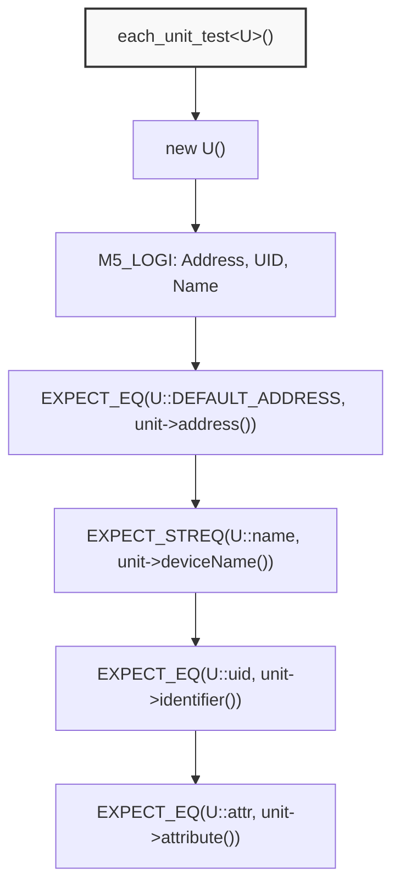
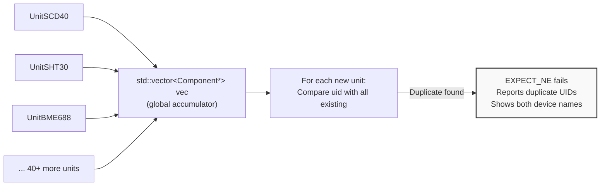
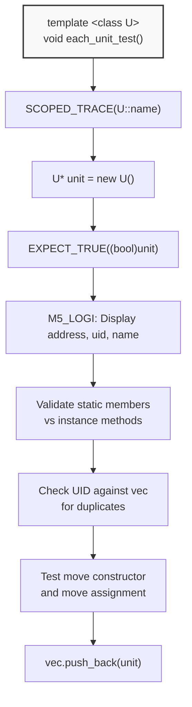
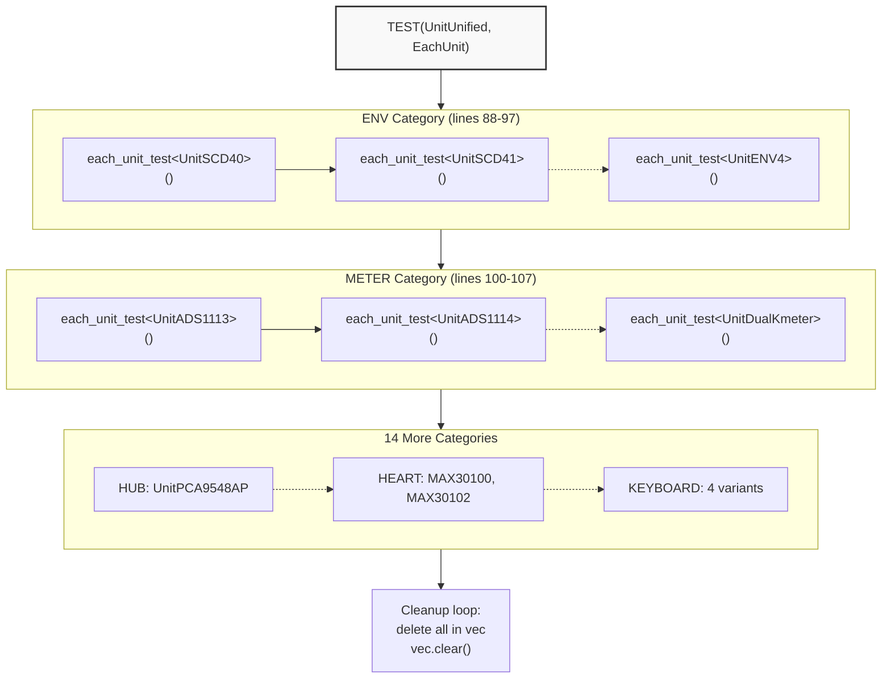
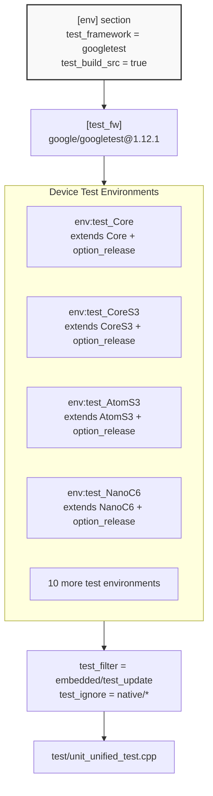
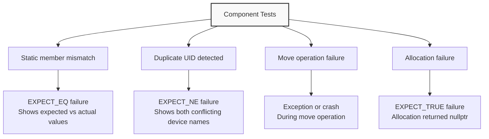

M5UnitUnified Component Validation Tests

# Component Validation Tests

<details>
<summary>Relevant source files</summary>

The following files were used as context for generating this wiki page:

- [pio_project/boards/m5stack-atoms3r.json](pio_project/boards/m5stack-atoms3r.json)
- [pio_project/boards/m5stack-nanoc6.json](pio_project/boards/m5stack-nanoc6.json)
- [pio_project/boards/m5stick-cplus2.json](pio_project/boards/m5stick-cplus2.json)
- [pio_project/platformio.ini](pio_project/platformio.ini)
- [pio_project/test/unit_unified_test.cpp](pio_project/test/unit_unified_test.cpp)

</details>


## Purpose and Scope

This page documents the component validation test suite implemented in [pio_project/test/unit_unified_test.cpp](). This test validates fundamental invariants across all M5UnitUnified components: static member consistency, unique identifier (UID) collision detection, and move semantics correctness. These tests ensure that every component in the ecosystem can be safely registered with `UnitUnified` without configuration conflicts.

For information about the GoogleTest framework setup and base test classes, see [Test Framework](#7.1). For guidance on writing component-specific tests, see [Writing Unit Tests](#7.2).

**Sources:** [pio_project/test/unit_unified_test.cpp:1-169]()

---

## Static Member Validation

Every component class derived from `Component` must expose four static members that provide compile-time metadata. The `each_unit_test` template function validates that these static members match the values returned by corresponding instance methods:

| Static Member | Instance Method | Purpose |
|---------------|----------------|---------|
| `DEFAULT_ADDRESS` | `address()` | I2C address (0 for non-I2C units) |
| `name` | `deviceName()` | Human-readable unit name |
| `uid` | `identifier()` | 32-bit unique identifier |
| `attr` | `attribute()` | Component attributes bitfield |

This validation catches several potential errors:
- **Builder macro failures**: If the builder macro (see [Builder Macros](#10.4)) generates incorrect static members
- **Constructor errors**: If the component constructor fails to initialize base class properly
- **Inconsistent metadata**: If manual implementations diverge from static declarations



**Validation Flow Diagram**: Each unit type passes through four consistency checks comparing static members to instance values.

**Sources:** [pio_project/test/unit_unified_test.cpp:48-80]()

---

## Unique Identifier System

### UID Purpose and Collision Prevention

The `uid` field is a 32-bit hash uniquely identifying each component type. The `UnitUnified` manager uses UIDs to differentiate units when multiple instances of different types share the same I2C address or when building hierarchical topologies (see [Parent-Child Hierarchies](#3.4)).

The test maintains a global vector `vec` accumulating all instantiated components and validates that no two units share the same UID:



**UID Collision Detection**: The test checks each new component against all previously tested components to ensure system-wide uniqueness.

The collision check at [pio_project/test/unit_unified_test.cpp:64-67]() reports both conflicting device names when a duplicate is found:

```cpp
for (auto&& e : vec) {
    EXPECT_NE(unit->identifier(), e->identifier()) 
        << unit->deviceName() << " / " << e->deviceName();
}
```

This is critical because UID collisions would cause `UnitUnified` to misidentify components during operations like channel selection or adapter sharing.

**Sources:** [pio_project/test/unit_unified_test.cpp:46-80]()

---

## Move Semantics Validation

Components must support move operations to enable efficient registration with `UnitUnified` and transfer between containers. The test validates both move constructor and move assignment:

```mermaid
sequenceDiagram
    participant Test as each_unit_test&lt;U&gt;
    participant Tmp as U tmp
    participant MC as U mc
    participant MC2 as U mc2
    
    rect rgb(245, 245, 245)
        Note over Test,MC2: Move Constructor Test
        Test->>Tmp: Default construct
        Test->>MC: U mc(std::move(tmp))
        Note over Tmp: tmp is now in moved-from state
    end
    
    rect rgb(245, 245, 245)
        Note over Test,MC2: Move Assignment Test
        Test->>MC2: Default construct
        Test->>MC2: mc2 = std::move(mc)
        Note over MC: mc is now in moved-from state
    end
    
    rect rgb(245, 245, 245)
        Note over Test,MC2: Automatic Cleanup
        Note over Test,MC2: All objects destroyed at scope exit<br/>Validates destructor safety
    end
```

**Move Semantics Validation Flow**: Tests verify both move operations complete without errors and that moved-from objects can be safely destroyed.

The test block at [pio_project/test/unit_unified_test.cpp:69-77]() creates temporary objects specifically to exercise move operations:

- **Move constructor test**: `U mc(std::move(tmp))` transfers ownership from `tmp` to `mc`
- **Move assignment test**: `mc2 = std::move(mc)` transfers ownership from `mc` to `mc2`
- **Implicit validation**: All objects are destroyed at scope exit, ensuring moved-from objects are in valid states

This prevents subtle bugs like double-deletion of adapter shared pointers or corrupted linked list pointers in parent-child hierarchies.

**Sources:** [pio_project/test/unit_unified_test.cpp:69-77]()

---

## Test Template Structure

### The `each_unit_test` Function

The core validation logic is implemented as a template function that accepts any component type:



**Template Function Flow**: `each_unit_test<U>()` executes a standardized validation sequence for any component type.

The function uses `SCOPED_TRACE(U::name)` to ensure that test failures clearly identify which component failed, even when multiple assertions fail in sequence.

**Sources:** [pio_project/test/unit_unified_test.cpp:48-80]()

### Test Execution Pattern

The main test function `TEST(UnitUnified, EachUnit)` calls `each_unit_test` for every supported component type:

```cpp
TEST(UnitUnified, EachUnit)
{
    // ENV category
    each_unit_test<m5::unit::UnitSCD40>();
    each_unit_test<m5::unit::UnitSCD41>();
    // ... 40+ more units ...
    
    // Cleanup
    for (auto&& e : vec) {
        delete e;
    }
    vec.clear();
}
```

This pattern enables comprehensive testing with minimal code duplication—adding a new component requires only one additional line.

**Sources:** [pio_project/test/unit_unified_test.cpp:85-169]()

---

## Tested Components

The test validates 47 component types across 16 categories. This table shows the complete test coverage:

| Category | Component Classes | Count |
|----------|------------------|-------|
| **ENV** | `UnitSCD40`, `UnitSCD41`, `UnitSHT30`, `UnitQMP6988`, `UnitENV3`, `UnitBME688`, `UnitSGP30`, `UnitSHT40`, `UnitBMP280`, `UnitENV4` | 10 |
| **METER** | `UnitADS1113`, `UnitADS1114`, `UnitADS1115`, `UnitEEPROM`, `UnitAmeter`, `UnitVmeter`, `UnitKmeterISO`, `UnitDualKmeter` | 8 |
| **HUB** | `UnitPCA9548AP` | 1 |
| **GESTURE** | `UnitPAJ7620U2` | 1 |
| **HEART** | `UnitMAX30100`, `UnitMAX30102` | 2 |
| **TOF** | `UnitVL53L0X`, `UnitVL53L1X` | 2 |
| **WEIGHT** | `UnitWeightI2C`, `UnitMiniScales` | 2 |
| **ANADIG** | `UnitMCP4725`, `UnitGP8413`, `UnitADS11XX`, `UnitADS1110`, `UnitADS1100` | 5 |
| **COLOR** | `UnitTCS34725` | 1 |
| **THERMO** | `UnitMLX90614`, `UnitMLX90614BAA`, `UnitNCIR2` | 3 |
| **DISTANCE** | `UnitRCWL9620` | 1 |
| **EXTIO** | `UnitExtIO2` | 1 |
| **INFRARED** | `UnitSTHS34PF80` | 1 |
| **CRYPTO** | `UnitATECC608B`, `UnitATECC608B_TNGTLS` | 2 |
| **RFID** | `UnitMFRC522`, `UnitWS1850S` | 2 |
| **KEYBOARD** | `UnitKeyboard`, `UnitKeyboardBitwise`, `UnitCardKB`, `UnitFacesQWERTY` | 4 |

**Total Validated Components**: 47 distinct unit types

### Category-Specific Validation



**Test Organization**: Components are tested by category, with cleanup after all validations complete.

**Sources:** [pio_project/test/unit_unified_test.cpp:85-169]()

---

## Test Execution Environment

### PlatformIO Integration

The component validation test runs on all 14 supported M5Stack devices via PlatformIO test environments. Each environment is configured in [pio_project/platformio.ini]():



**Test Environment Configuration**: GoogleTest framework is configured globally and applied to 14 device-specific test targets.

### Key Configuration Details

- **Test framework**: GoogleTest 1.12.1 ([pio_project/platformio.ini:10-11]())
- **Build source with tests**: `test_build_src = true` ensures library sources are compiled ([pio_project/platformio.ini:11]())
- **Test filter**: `test_filter = embedded/test_update` limits execution to embedded tests ([pio_project/platformio.ini:50]())
- **Library dependencies**: All 16 M5Unit libraries are included ([pio_project/platformio.ini:18-36]())

### Running the Tests

Execute component validation tests using PlatformIO CLI:

```bash
# Run on specific device
pio test -e test_CoreS3

# Run on all devices
pio test

# Run with verbose output
pio test -v -e test_Core
```

The test output shows each component's address, UID, and name via the `M5_LOGI` statement at [pio_project/test/unit_unified_test.cpp:56]().

**Sources:** [pio_project/platformio.ini:7-274](), [pio_project/platformio.ini:188-189](), [pio_project/platformio.ini:205-273]()

---

## Custom Board Support

Three M5Stack boards require custom JSON configuration files for testing:

### AtomS3R Configuration

[pio_project/boards/m5stack-atoms3r.json]() defines ESP32-S3 with 8MB flash and PSRAM:

| Property | Value |
|----------|-------|
| MCU | `esp32s3` |
| Flash Size | 8MB |
| Memory Type | `qio_opi` |
| USB CDC | Enabled on boot |
| Build Flags | `-DARDUINO_M5STACK_ATOMS3R`, `-DBOARD_HAS_PSRAM` |

### StickCPlus2 Configuration

[pio_project/boards/m5stick-cplus2.json]() defines ESP32 with 8MB flash:

| Property | Value |
|----------|-------|
| MCU | `esp32` |
| Flash Size | 8MB |
| Partitions | `default_8MB.csv` |
| PSRAM | Enabled with cache fix strategy |
| Build Flags | `-DM5STACK_M5STICK_CPLUS2`, `-DBOARD_HAS_PSRAM` |

### NanoC6 Configuration

[pio_project/boards/m5stack-nanoc6.json]() defines ESP32-C6 (RISC-V architecture):

| Property | Value |
|----------|-------|
| MCU | `esp32c6` |
| Flash Size | 4MB |
| Flash Mode | `qio` |
| Build Flags | `-DARDUINO_M5STACK_NANOC6` |

The NanoC6 environment uses a custom platform package to support the ESP32-C6 chip family ([pio_project/platformio.ini:108-118]()):

```ini
[NanoC6]
board = m5stack-nanoc6
platform = https://github.com/platformio/platform-espressif32.git
platform_packages =
    platformio/framework-arduinoespressif32 @ https://github.com/espressif/arduino-esp32.git#3.0.7
    platformio/framework-arduinoespressif32-libs @ https://github.com/espressif/esp32-arduino-libs.git#idf-release/v5.1
lib_ignore = ${env.lib_ignore}
  bsec2
```

**Sources:** [pio_project/boards/m5stack-atoms3r.json:1-42](), [pio_project/boards/m5stick-cplus2.json:1-41](), [pio_project/boards/m5stack-nanoc6.json:1-34](), [pio_project/platformio.ini:108-118]()

---

## Test Output and Diagnostics

### Success Output Format

When all validations pass, the test produces output showing each component's metadata:

```
[==========] Running 1 test from 1 test suite.
[----------] Global test environment set-up.
[----------] 1 test from UnitUnified
[ RUN      ] UnitUnified.EachUnit
>>61H 0F8C4061 [SCD40]
>>61H 0F8C4162 [SCD41]
>>44H 44303348 [SHT30]
...
>>00H 52434338 [RCWL9620]
>>20H 4F584532 [ExtIO2]
>>5AH 50463830 [STHS34PF80]
[ PASSED   ] UnitUnified.EachUnit (123 ms)
[----------] 1 test from UnitUnified (123 ms total)
```

The log format `>>ADDRESS UID [NAME]` shows:
- Hexadecimal I2C address (00H for non-I2C)
- 32-bit UID in hexadecimal
- Component name string

### Failure Scenarios



**Failure Detection Patterns**: Different validation failures produce specific diagnostic output to aid debugging.

Example duplicate UID failure output:
```
test/unit_unified_test.cpp:66: Failure
Expected: (unit->identifier()) != (e->identifier()), actual: 0x12345678 vs 0x12345678
UnitNewSensor / UnitExistingSensor
```

**Sources:** [pio_project/test/unit_unified_test.cpp:56-80]()

---

## Integration with CI/CD

While the component validation test runs locally via PlatformIO, the CI/CD pipeline documented in [CI/CD Pipeline](#8.1) validates code quality before these tests execute. The test serves as a final check that:

1. **Builder macros** (see [Builder Macros](#10.4)) correctly generate static members
2. **Component constructors** properly initialize base classes
3. **UID generation** produces unique identifiers across the ecosystem
4. **Move semantics** work correctly for efficient component management

The test acts as a safeguard against breaking changes that would cause runtime failures when components are registered with `UnitUnified` (see [UnitUnified Manager](#3.2)).

**Sources:** [pio_project/test/unit_unified_test.cpp:1-169]()