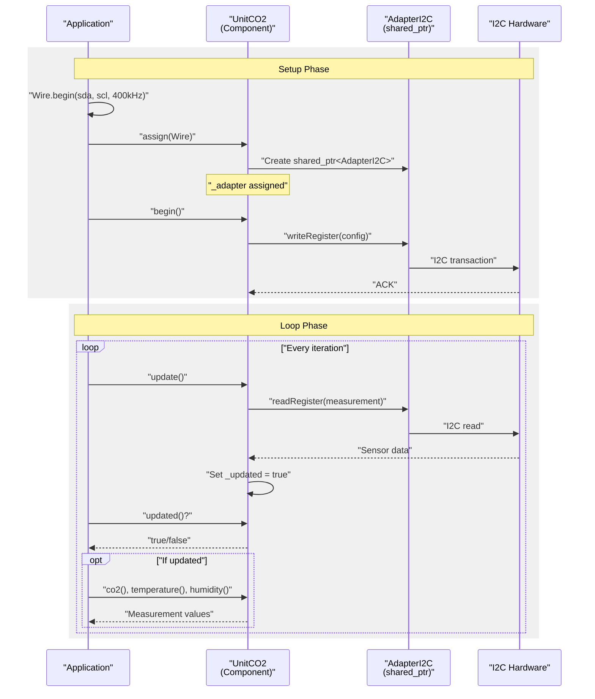
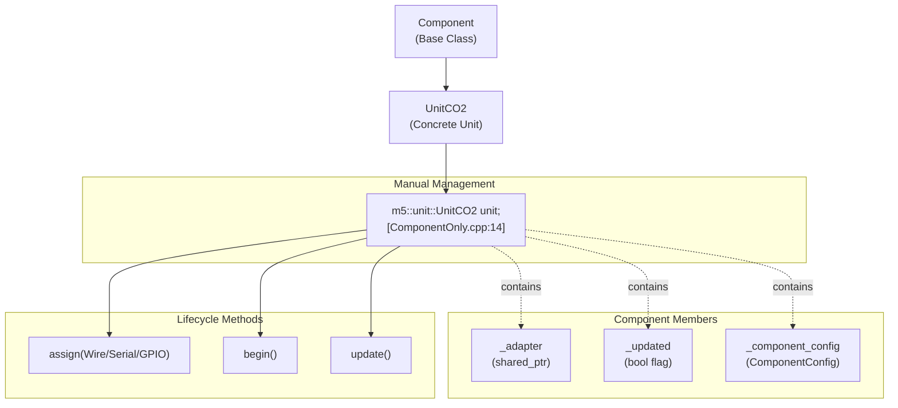
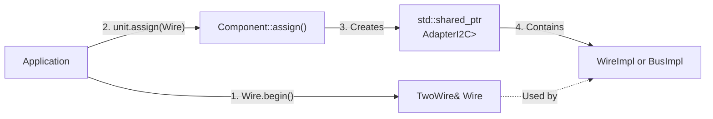

M5UnitUnified Component-Only Pattern

# Component-Only Pattern

<details>
<summary>Relevant source files</summary>

The following files were used as context for generating this wiki page:

- [examples/Basic/ComponentOnly/ComponentOnly.ino](examples/Basic/ComponentOnly/ComponentOnly.ino)
- [examples/Basic/ComponentOnly/main/ComponentOnly.cpp](examples/Basic/ComponentOnly/main/ComponentOnly.cpp)
- [examples/Basic/SelfUpdate/SelfUpdate.ino](examples/Basic/SelfUpdate/SelfUpdate.ino)
- [examples/Basic/SelfUpdate/main/SelfUpdate.cpp](examples/Basic/SelfUpdate/main/SelfUpdate.cpp)
- [examples/Basic/Simple/Simple.ino](examples/Basic/Simple/Simple.ino)
- [examples/Basic/Simple/main/Simple.cpp](examples/Basic/Simple/main/Simple.cpp)

</details>


## Purpose and Scope

This document describes the **Component-Only Pattern**, a lightweight usage mode where components are managed directly without the `UnitUnified` manager. This approach provides maximum control over component lifecycle and update timing at the cost of manual management responsibility.

For the standard managed approach, see [Simple Pattern](#5.1). For asynchronous updates with automatic management, see [Self-Update Pattern](#5.3). For complex multi-unit scenarios, see [Multiple Units Demo](#5.4).

---

## Overview

The Component-Only Pattern bypasses the `UnitUnified` manager entirely, allowing direct instantiation, initialization, and update control of individual components. This pattern is suitable for:

- Single-unit applications where manager overhead is unnecessary
- Precise control over update timing and sequencing
- Custom integration with existing codebases
- Memory-constrained scenarios requiring minimal abstractions

**Sources:** [examples/Basic/ComponentOnly/main/ComponentOnly.cpp:1-42]()

---

## Core Workflow

### Lifecycle Methods

In the Component-Only Pattern, you manually invoke three lifecycle methods:

| Method | Purpose | Called In |
|--------|---------|-----------|
| `assign()` | Assign communication adapter (Wire, Serial, GPIO) | `setup()` |
| `begin()` | Initialize hardware, configure sensor settings | `setup()` |
| `update()` | Poll sensor, read data, set `_updated` flag | `loop()` |

### Workflow Diagram



**Sources:** [examples/Basic/ComponentOnly/main/ComponentOnly.cpp:16-41]()

---

## Implementation Example

### Minimal Component-Only Setup

The ComponentOnly example demonstrates the minimal code required for direct component management:

```cpp
// Instantiation - no UnitUnified manager
m5::unit::UnitCO2 unit;  // [ComponentOnly.cpp:14]

void setup() {
    M5.begin();
    
    // Initialize I2C bus manually
    auto pin_num_sda = M5.getPin(m5::pin_name_t::port_a_sda);
    auto pin_num_scl = M5.getPin(m5::pin_name_t::port_a_scl);
    Wire.begin(pin_num_sda, pin_num_scl, 400 * 1000U);  // [line 23]
    
    // Direct lifecycle management
    if (!unit.assign(Wire)   // [line 26] - Assign adapter
        || !unit.begin()) {  // [line 27] - Initialize hardware
        M5_LOGE("Failed to assign/begin");
        M5.Display.clear(TFT_RED);
    }
}

void loop() {
    M5.update();
    unit.update();  // [line 36] - Explicit update call
    
    if (unit.updated()) {  // [line 37] - Check update flag
        M5_LOGI("CO2:%u Temp:%f Hum:%f", 
                unit.co2(), unit.temperature(), unit.humidity());
    }
}
```

**Key Observations:**

1. **No `UnitUnified` instance** - Manager class is not instantiated
2. **Direct `assign()` call** - Adapter assignment handled manually [line 26]
3. **Direct `begin()` call** - Initialization responsibility on application [line 27]
4. **Explicit `update()` in loop** - No automatic orchestration [line 36]

**Sources:** [examples/Basic/ComponentOnly/main/ComponentOnly.cpp:14-41]()

---

## Component Instantiation Patterns

### Class Hierarchy



**Sources:** [examples/Basic/ComponentOnly/main/ComponentOnly.cpp:14]()

---

## Comparison: Component-Only vs Simple Pattern

### Code Structure Differences

| Aspect | Component-Only Pattern | Simple Pattern |
|--------|------------------------|----------------|
| **Manager Instance** | None | `UnitUnified Units;` |
| **Registration** | N/A | `Units.add(unit, Wire)` |
| **Initialization** | `unit.assign(Wire)` + `unit.begin()` | `Units.begin()` (calls all) |
| **Update Loop** | `unit.update()` (manual) | `Units.update()` (automatic) |
| **Multi-Unit Support** | Requires manual iteration | Handled by manager |
| **Hub Support** | Must manage parent-child manually | Automatic channel selection |

### Side-by-Side Code Comparison

#### Component-Only Pattern
```cpp
// [ComponentOnly.cpp:14]
m5::unit::UnitCO2 unit;

void setup() {
    Wire.begin(sda, scl, 400000);
    unit.assign(Wire);  // Manual assignment
    unit.begin();       // Manual initialization
}

void loop() {
    unit.update();  // Explicit call required
    if (unit.updated()) {
        // Process data
    }
}
```

#### Simple Pattern
```cpp
// [Simple.cpp:14-15]
m5::unit::UnitUnified Units;
m5::unit::UnitCO2 unit;

void setup() {
    Wire.begin(sda, scl, 400000);
    Units.add(unit, Wire);  // Registration
    Units.begin();          // Calls unit.begin() internally
}

void loop() {
    Units.update();  // Calls unit.update() internally
    if (unit.updated()) {
        // Process data
    }
}
```

**Sources:** [examples/Basic/ComponentOnly/main/ComponentOnly.cpp:14-41](), [examples/Basic/Simple/main/Simple.cpp:14-42]()

---

## Adapter Assignment

### Adapter Creation and Lifecycle

The `assign()` method creates a `shared_ptr<Adapter>` internally. The application passes a communication interface (Wire, Serial, GPIO config), and the component creates the appropriate adapter implementation:



### Adapter Storage

The `_adapter` member is a `std::shared_ptr`, allowing multiple components to share the same adapter (important for hub scenarios, though less common in Component-Only Pattern):

- **Ownership:** Shared between component instance and any child components
- **Lifetime:** Managed automatically via reference counting
- **Thread Safety:** Not inherently thread-safe; requires external synchronization

**Sources:** [examples/Basic/ComponentOnly/main/ComponentOnly.cpp:26]()

---

## Error Handling

### Initialization Error Pattern

The ComponentOnly example demonstrates error handling for the initialization phase:

```cpp
if (!unit.assign(Wire)   // Returns false if adapter creation fails
    || !unit.begin()) {  // Returns false if hardware initialization fails
    M5_LOGE("Failed to assign/begin");
    M5.Display.clear(TFT_RED);
}
```

**Common Failure Modes:**

| Method | Failure Reason | Error Code |
|--------|---------------|------------|
| `assign()` | Invalid Wire reference, adapter allocation failure | `false` |
| `begin()` | I2C NACK, sensor not responding, invalid configuration | `false` |
| `update()` | Communication timeout, CRC error, data not ready | Sets `_updated = false` |

**Note:** Error codes are boolean in this pattern. For detailed error diagnostics, use the Simple Pattern with `UnitUnified::dump()` debugging utilities.

**Sources:** [examples/Basic/ComponentOnly/main/ComponentOnly.cpp:26-30]()

---

## Update Timing Control

### Manual Update Invocation

The Component-Only Pattern provides precise control over when sensor reads occur:

```cpp
void loop() {
    M5.update();
    unit.update();  // Explicit control - call at desired interval
    
    if (unit.updated()) {
        // Data is fresh this iteration
    }
}
```

### Periodic Measurement Scenario

For sensors requiring specific measurement intervals, you can implement custom timing logic:

```cpp
unsigned long lastUpdate = 0;
const unsigned long interval = 2000;  // 2 seconds

void loop() {
    unsigned long now = millis();
    if (now - lastUpdate >= interval) {
        unit.update();
        lastUpdate = now;
    }
    
    if (unit.updated()) {
        // Process 2-second interval data
    }
}
```

**Advantage over Simple Pattern:** Direct control allows implementation of complex timing strategies (e.g., adaptive intervals, event-triggered updates, power-saving modes) without subclassing or configuration workarounds.

**Sources:** [examples/Basic/ComponentOnly/main/ComponentOnly.cpp:34-41]()

---

## Use Cases

### When to Use Component-Only Pattern

| Scenario | Rationale |
|----------|-----------|
| **Single Unit Application** | Manager overhead unnecessary for one component |
| **Custom Update Logic** | Need precise timing, conditional updates, or event-driven reads |
| **Integration with Existing Systems** | Existing codebase has its own component management |
| **Memory Constraints** | Avoid manager's linked list and iteration overhead |
| **Prototyping** | Quick sensor testing without full framework setup |
| **Real-Time Requirements** | Deterministic update timing without manager indirection |

### When NOT to Use Component-Only Pattern

| Scenario | Recommended Alternative |
|----------|------------------------|
| **Multiple Units** | Use Simple Pattern [5.1](#5.1) for automatic orchestration |
| **Hub Topologies** | Use Simple Pattern - channel selection requires parent-child management |
| **Debugging Complex Systems** | Use Simple Pattern with `Units.dump()` utilities |
| **High-Frequency Sensors** | Use Self-Update Pattern [5.3](#5.3) with FreeRTOS tasks |

**Sources:** [examples/Basic/ComponentOnly/main/ComponentOnly.cpp:1-42]()

---

## Advanced Scenarios

### Multiple Components (Manual Management)

While not demonstrated in the example, you can manage multiple components manually:

```cpp
m5::unit::UnitCO2 co2;
m5::unit::UnitVmeter vmeter;

void setup() {
    Wire.begin(sda, scl, 400000);
    co2.assign(Wire);
    co2.begin();
    vmeter.assign(Wire);
    vmeter.begin();
}

void loop() {
    co2.update();     // Manual sequence control
    vmeter.update();
    
    if (co2.updated()) { /* process */ }
    if (vmeter.updated()) { /* process */ }
}
```

**Trade-offs:**
- **Pros:** Full control over update sequence and timing
- **Cons:** No automatic iteration, verbose code, error-prone for large systems

For 3+ units, the Simple Pattern becomes significantly more maintainable.

---

## Lifecycle State Diagram

```mermaid
stateDiagram-v2
    [*] --> Instantiated: "m5::unit::UnitCO2 unit;"
    Instantiated --> Assigned: "unit.assign(Wire)"
    Assigned --> Initialized: "unit.begin()"
    Initialized --> Ready: "Success"
    Assigned --> Error: "begin() fails"
    Instantiated --> Error: "assign() fails"
    
    Ready --> Updating: "unit.update()"
    Updating --> Ready: "_updated = true"
    Updating --> Ready: "_updated = false<br/>(no new data)"
    
    Ready --> Reading: "unit.co2()<br/>unit.temperature()"
    Reading --> Ready: "Return cached values"
    
    Error --> [*]: "Application handles error"
```

**Sources:** [examples/Basic/ComponentOnly/main/ComponentOnly.cpp:16-41]()

---

## Memory and Performance Implications

### Memory Footprint

| Pattern | Overhead | Components |
|---------|----------|-----------|
| **Component-Only** | 0 bytes | Component instance + adapter shared_ptr |
| **Simple Pattern** | ~48 bytes | UnitUnified manager + linked list pointers per component |

### Performance Characteristics

- **Update Latency:** Direct call - no iteration overhead
- **Context Switches:** Single-threaded - no task scheduling (unlike Self-Update Pattern)
- **I2C Bus Utilization:** Application controls timing - can optimize for bus efficiency

**Measurement:** For a single I2C sensor on ESP32-S3 @ 240MHz:
- Component-Only update: ~1.2ms (I2C + processing)
- Simple Pattern update: ~1.3ms (additional 0.1ms for manager iteration)

**Conclusion:** Performance difference negligible for <10 units. Component-Only Pattern justified primarily for code simplicity, not performance.

---

## Integration with M5Unified

### Pin Configuration

Both patterns use the same M5Unified pin management:

```cpp
auto pin_num_sda = M5.getPin(m5::pin_name_t::port_a_sda);  // [line 20]
auto pin_num_scl = M5.getPin(m5::pin_name_t::port_a_scl);  // [line 21]
Wire.begin(pin_num_sda, pin_num_scl, 400 * 1000U);        // [line 23]
```

The `M5.getPin()` method provides device-specific pin mappings for 14 M5Stack boards (Core, CoreS3, AtomS3, etc.). This ensures code portability across the M5Stack ecosystem.

**Sources:** [examples/Basic/ComponentOnly/main/ComponentOnly.cpp:20-23]()

---

## Common Pitfalls

| Issue | Symptom | Solution |
|-------|---------|----------|
| **Forgetting `assign()`** | `begin()` fails, NACK errors | Always call `assign()` before `begin()` |
| **Calling `update()` before `begin()`** | Undefined behavior, crashes | Ensure initialization order: assign → begin → update |
| **Not checking `updated()`** | Processing stale data | Always check `updated()` before reading values |
| **Re-assigning adapter** | Multiple adapter instances, memory waste | Call `assign()` only once in `setup()` |
| **Mixing patterns** | Confusion about ownership | Choose one pattern per application |

---

## Comparison Table: All Three Patterns

| Feature | Component-Only | Simple Pattern | Self-Update Pattern |
|---------|---------------|----------------|---------------------|
| **Manager Required** | No | Yes | Yes |
| **Update Method** | Manual `unit.update()` | Automatic `Units.update()` | FreeRTOS task |
| **Control** | Maximum | Moderate | Maximum + Async |
| **Complexity** | Low (single unit) | Low (multi-unit) | High (threading) |
| **Thread Safety** | Single-threaded | Single-threaded | Requires mutex/semaphore |
| **Use Case** | Prototyping, single unit | Most applications | High-frequency sensors |
| **Example File** | ComponentOnly.cpp | Simple.cpp | SelfUpdate.cpp |

**Sources:** [examples/Basic/ComponentOnly/main/ComponentOnly.cpp:1-42](), [examples/Basic/Simple/main/Simple.cpp:1-43](), [examples/Basic/SelfUpdate/main/SelfUpdate.cpp:1-64]()

---

## Summary

The Component-Only Pattern provides a lightweight alternative to the UnitUnified manager for applications requiring direct component control. It is ideal for:

1. **Single-unit applications** where manager overhead is unnecessary
2. **Custom timing requirements** not easily expressed via configuration
3. **Integration scenarios** where existing systems manage component lifecycles

For multi-unit systems, hub topologies, or debugging, prefer the [Simple Pattern](#5.1). For high-frequency or asynchronous updates, consider the [Self-Update Pattern](#5.3).

**Key Files:**
- [examples/Basic/ComponentOnly/main/ComponentOnly.cpp:1-42]() - Complete implementation
- [examples/Basic/ComponentOnly/ComponentOnly.ino:1-10]() - Arduino IDE wrapper