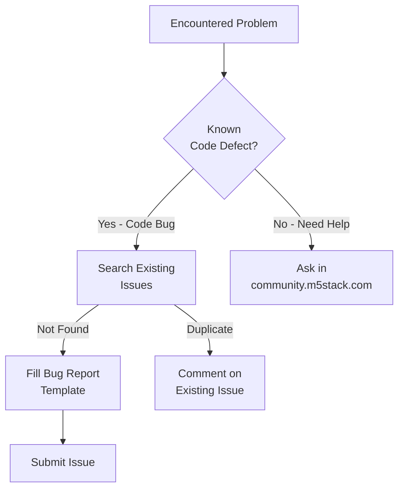
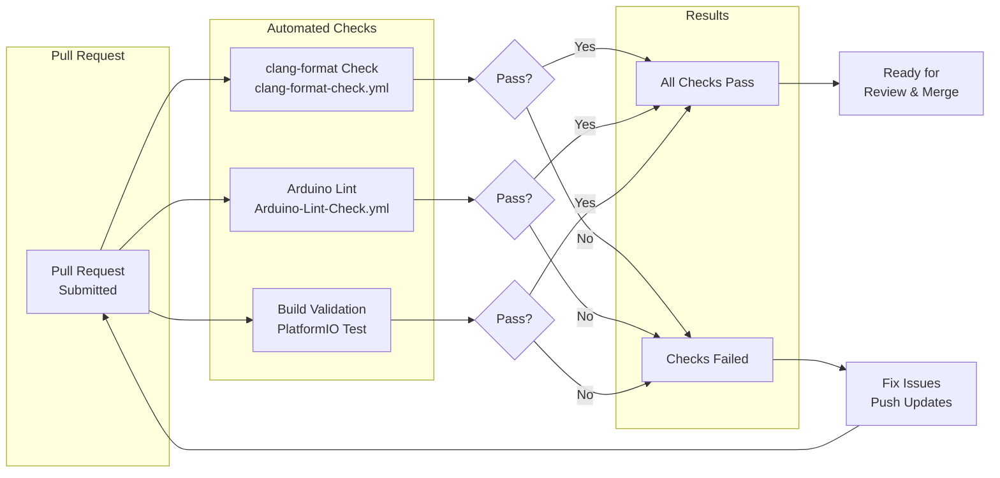
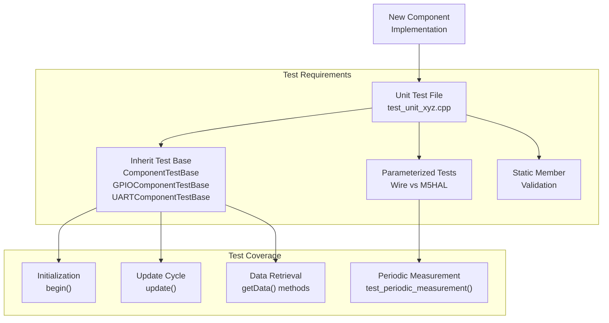
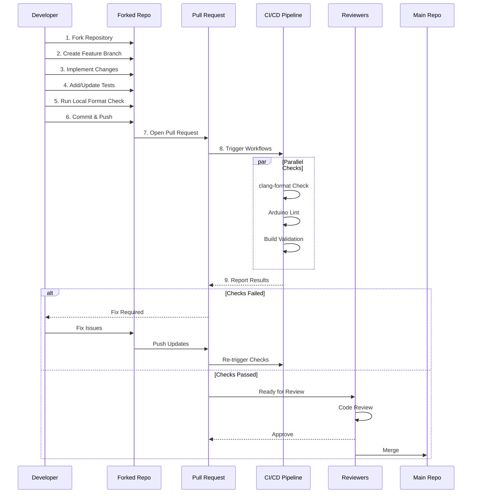

M5UnitUnified Contributing

# Contributing

<details>
<summary>Relevant source files</summary>

The following files were used as context for generating this wiki page:

- [.github/ISSUE_TEMPLATE/bug-report.yml](.github/ISSUE_TEMPLATE/bug-report.yml)
- [.github/workflows/Arduino-Lint-Check.yml](.github/workflows/Arduino-Lint-Check.yml)
- [.github/workflows/clang-format-check.yml](.github/workflows/clang-format-check.yml)
- [.github/workflows/doxygen-gh-pages.yml](.github/workflows/doxygen-gh-pages.yml)

</details>


This page describes the process for contributing to the M5UnitUnified project, including bug reporting, feature requests, pull request workflow, and automated quality checks. For information about the CI/CD pipeline architecture, see [CI/CD Pipeline](#8.1). For code formatting and style requirements, see [Code Standards](#8.2). For test creation guidelines, see [Writing Unit Tests](#7.2).

## Purpose and Scope

This guide covers:
- Bug reporting using GitHub issue templates
- Feature request and enhancement proposals
- Pull request submission process
- Automated quality checks that must pass before merge
- Testing requirements for new components
- Documentation expectations

---

## Bug Reporting

The project uses structured bug report templates to ensure consistent and actionable issue reports.

### Bug Report Template Structure

The bug report form is defined in [.github/ISSUE_TEMPLATE/bug-report.yml:1-83]() and includes the following required fields:

| Field | Purpose | Required |
|-------|---------|----------|
| `description` | Clear description of the bug | Yes |
| `reproduce` | Specific steps to reproduce the issue | Yes |
| `expected` | Expected behavior after following steps | Yes |
| `screenshots` | Visual aids for the problem | No |
| `information` | Environment details (OS, IDE, version) | No |
| `additional` | Any other relevant context | No |
| `checklist` | Verification that previous issues were searched | Yes |

### Bug Report Checklist

Before submitting a bug report, contributors must confirm:
1. Search performed in [issue tracker](https://github.com/m5stack/M5UnitUnified/issues)
2. Report contains all necessary details for reproduction

### Community Support vs Bug Reports

The template emphasizes [.github/ISSUE_TEMPLATE/bug-report.yml:13-16]():
- **GitHub Issues**: For known defects in the code
- **Community Forums**: For troubleshooting and project questions
- **M5Stack Forum**: https://community.m5stack.com for support



**Diagram: Bug Reporting Decision Flow**

Sources: [.github/ISSUE_TEMPLATE/bug-report.yml:1-83]()

---

## Pull Request Workflow

### Prerequisites

Before submitting a pull request:

1. **Fork and Clone**: Fork the repository and clone your fork locally
2. **Branch Creation**: Create a feature branch from `main` or `master`
3. **Code Standards**: Ensure code follows formatting rules (see [Code Standards](#8.2))
4. **Testing**: Add or update tests for new functionality (see [Writing Unit Tests](#7.2))
5. **Documentation**: Update relevant documentation and examples

### Automated Quality Checks

All pull requests trigger three automated workflows that must pass before merge:



**Diagram: Pull Request Validation Pipeline**

Sources: [.github/workflows/clang-format-check.yml:1-70](), [.github/workflows/Arduino-Lint-Check.yml:1-28]()

### Check 1: clang-format Validation

The `clang-format-check.yml` workflow validates code formatting across multiple directories.

**Trigger Conditions** [.github/workflows/clang-format-check.yml:6-32]():
- Push to any branch (excluding release tags)
- Pull requests
- Manual workflow dispatch

**Checked Paths** [.github/workflows/clang-format-check.yml:48-54]():
```yaml
matrix:
  path:
    - check: 'src'
    - check: 'pio_project/test'
    - check: 'examples/Basic'
```

**File Pattern** [.github/workflows/clang-format-check.yml:4]():
```regex
^.*\.((((c|C)(c|pp|xx|\+\+)?$)|((h|H)h?(pp|xx|\+\+)?$))|(inl|ino|pde|proto|cu))$
```

This includes: `.c`, `.cpp`, `.h`, `.hpp`, `.ino`, `.inl`, `.cc`, `.cxx`, `.hh`, `.hxx`

**Configuration**:
- Uses `clang-format` version 13
- Style defined in `.clang-format` file (see [Code Standards](#8.2))
- Runs via `jidicula/clang-format-action@v4.10.2`

### Check 2: Arduino Lint

The `Arduino-Lint-Check.yml` workflow validates Arduino library compliance.

**Trigger Conditions** [.github/workflows/Arduino-Lint-Check.yml:2-7]():
- Push to `master` or `main` branches
- Pull requests targeting `master` or `main`
- Manual workflow dispatch

**Configuration** [.github/workflows/Arduino-Lint-Check.yml:23-27]():
```yaml
library-manager: update
compliance: strict
project-type: all
```

The `strict` compliance level enforces all Arduino library specifications, including:
- Valid `library.properties` file
- Proper directory structure
- Correct dependency declarations
- Valid examples

### Check 3: Build Validation

Pull requests must successfully build across all supported device configurations. The build system is described in detail in [PlatformIO Configuration](#6.1) and [Supported Devices](#6.2).

**Build Matrix**:
- 14 M5Stack device configurations
- Multiple example applications (Simple, SelfUpdate, ComponentOnly, MultipleUnits)
- Various build options (release, log, debug)

Sources: [.github/workflows/clang-format-check.yml:1-70](), [.github/workflows/Arduino-Lint-Check.yml:1-28]()

---

## Contributing New Components

When adding support for a new M5Stack unit, follow these requirements:

### Required Implementations

1. **Component Class**: Inherit from `Component` base class
2. **Static Members**: Define using `M5_UNIT_COMPONENT_HPP_BUILDER` macro (see [Builder Macros](#10.4))
3. **Adapter Assignment**: Implement `assignAdapter()` method
4. **Lifecycle Methods**: Implement `begin()` and `update()`
5. **Unique Identifier**: Ensure `uid()` is unique across all units

### Required Tests

New components must include tests in `pio_project/test/` directory:



**Diagram: New Component Test Requirements**

### Validation Test

All new components must pass the validation in `unit_unified_test.cpp` (see [Component Validation Tests](#7.3)):

| Validation | Check | Purpose |
|------------|-------|---------|
| `HaveDefaultAddress` | `DEFAULT_ADDRESS` defined | I2C address constant exists |
| `HaveUID` | `uid()` returns valid value | Unique identifier present |
| `NameIsNotEmpty` | `name()` non-empty | Human-readable name exists |
| `UIDIsUnique` | No duplicate `uid()` | Prevents configuration conflicts |
| `CheckAttribute` | `attr()` returns valid flags | Component attributes defined |

### Example Structure

Place examples in `examples/` directory following existing patterns:

```
examples/
├── Basic/
│   ├── Simple/              # Basic usage with UnitUnified
│   ├── SelfUpdate/          # FreeRTOS task pattern
│   └── ComponentOnly/       # Direct component usage
└── MultipleUnits/           # Complex multi-sensor demo
```

Sources: [.github/workflows/clang-format-check.yml:48-54]()

---

## Documentation Requirements

### Code Documentation

All public APIs must include Doxygen comments:
- Class descriptions with `@brief`
- Parameter documentation with `@param`
- Return value documentation with `@return`
- Usage examples with `@code` blocks

### Example Documentation

Each example must include:
- Header comment explaining purpose
- Hardware connection diagram or description
- Expected output description
- Dependencies and version requirements

### Doxygen Generation

Documentation is automatically generated and deployed via [.github/workflows/doxygen-gh-pages.yml:1-27]():

**Trigger**: Release events and manual dispatch

**Configuration**:
- Doxygen version: 1.11.0
- Config file: `docs/Doxyfile`
- Output: `docs/html/`
- Deployment: `gh-pages` branch

Sources: [.github/workflows/doxygen-gh-pages.yml:1-27]()

---

## Contribution Workflow Summary



**Diagram: Complete Contribution Workflow**

### Workflow Steps

1. **Fork**: Create personal fork of `m5stack/M5UnitUnified`
2. **Branch**: Create feature branch (`feature/xyz` or `fix/abc`)
3. **Implement**: Make changes following [Code Standards](#8.2)
4. **Test**: Add tests following [Writing Unit Tests](#7.2)
5. **Format**: Run `clang-format` locally before pushing
6. **Commit**: Use clear commit messages describing changes
7. **PR**: Open pull request with detailed description
8. **CI**: Wait for automated checks to complete
9. **Review**: Address reviewer feedback
10. **Merge**: Maintainers merge after approval

Sources: [.github/workflows/clang-format-check.yml:1-70](), [.github/workflows/Arduino-Lint-Check.yml:1-28]()

---

## Testing Before Submission

### Local Testing Commands

**Format Check**:
```bash
# Install clang-format 13
clang-format -i src/**/*.{cpp,hpp,h}
clang-format -i examples/**/*.{ino,cpp,hpp,h}
clang-format -i pio_project/test/**/*.{cpp,hpp,h}
```

**Build Test**:
```bash
# Using PlatformIO
pio run -e Simple_Core
pio run -e MultipleUnits_CoreS3
# Or build all environments
pio run
```

**Unit Tests**:
```bash
# Run embedded tests
pio test -e unit_unified_test
```

### Pre-Submission Checklist

- [ ] Code follows `.clang-format` style
- [ ] All new functions have Doxygen comments
- [ ] Tests added for new functionality
- [ ] Examples updated if API changed
- [ ] `library.properties` updated if dependencies added
- [ ] README updated if necessary
- [ ] Local build succeeds for target devices
- [ ] Commit messages are descriptive

Sources: [.github/workflows/clang-format-check.yml:4](), [.github/workflows/clang-format-check.yml:48-54]()

---

## Feature Requests and Enhancements

For feature requests or enhancement proposals:

1. **Search Existing Issues**: Check if feature already requested
2. **Open Discussion**: Create issue with `enhancement` label
3. **Describe Use Case**: Explain problem being solved
4. **Propose Implementation**: Outline potential approach
5. **Consider Scope**: Ensure feature aligns with library goals

Feature requests should focus on:
- Support for new M5Stack units
- Improved communication protocol support
- Enhanced debugging capabilities
- Performance optimizations
- Better error handling

---

## Getting Help

Resources for contributors:

| Resource | Purpose | URL |
|----------|---------|-----|
| GitHub Issues | Bug reports, feature requests | `github.com/m5stack/M5UnitUnified/issues` |
| M5Stack Community | General support, troubleshooting | `community.m5stack.com` |
| API Documentation | Generated Doxygen docs | `m5stack.github.io/M5UnitUnified` |
| Examples | Usage patterns | `examples/` directory |
| Test Suite | Reference implementations | `pio_project/test/` directory |

Sources: [.github/ISSUE_TEMPLATE/bug-report.yml:13-16]()