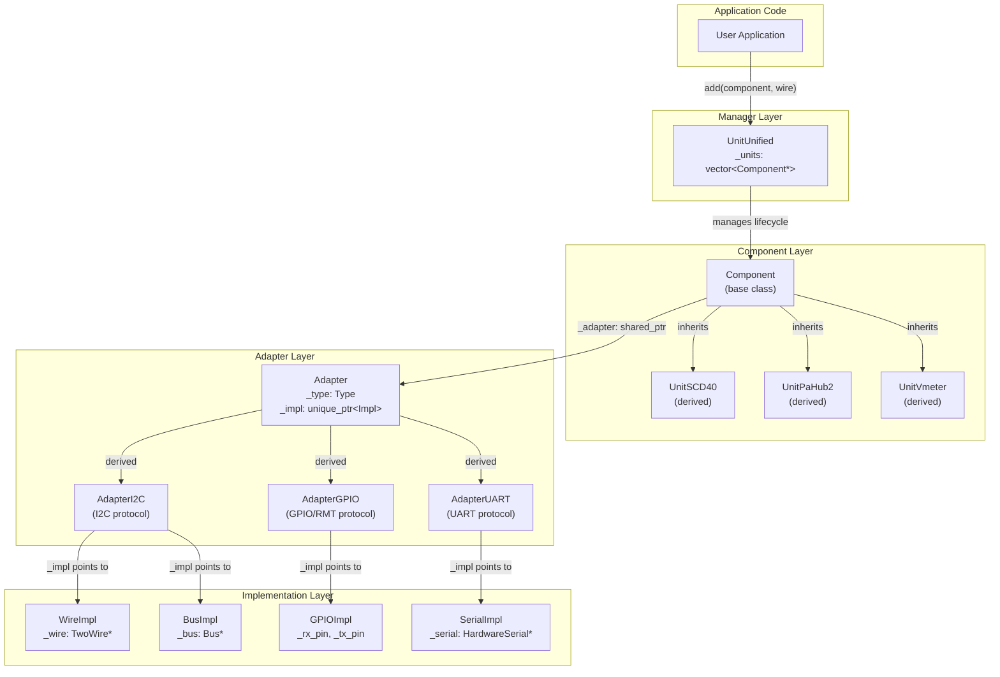
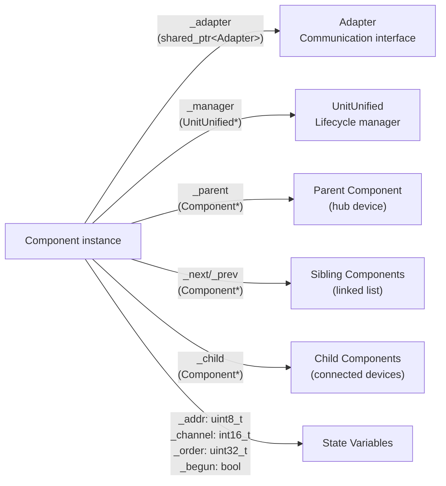
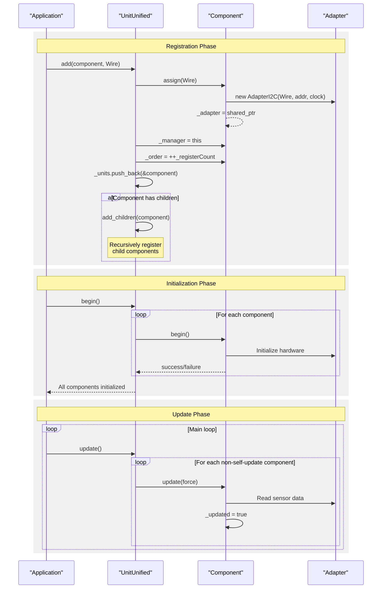
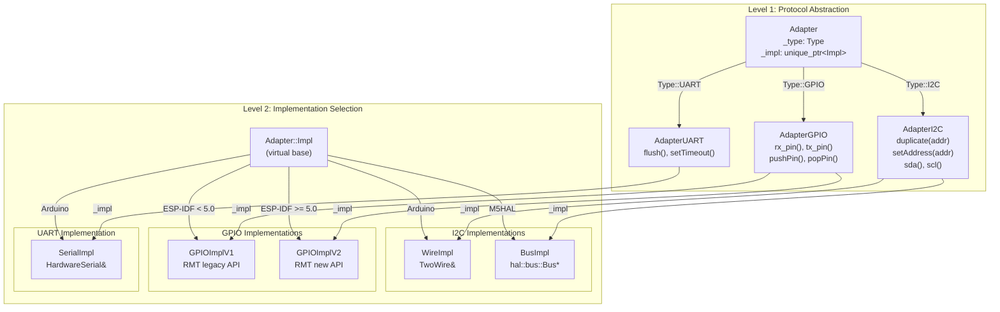
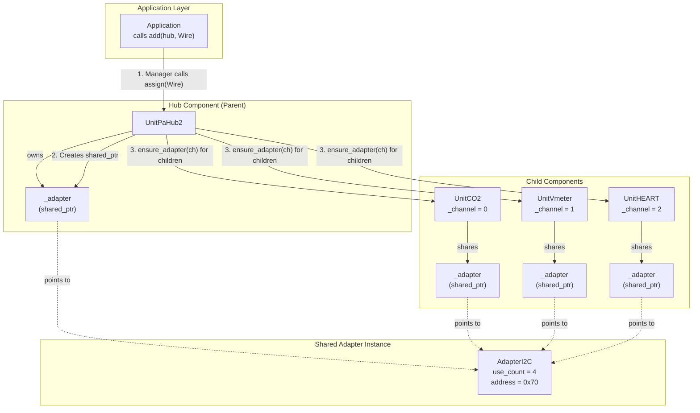
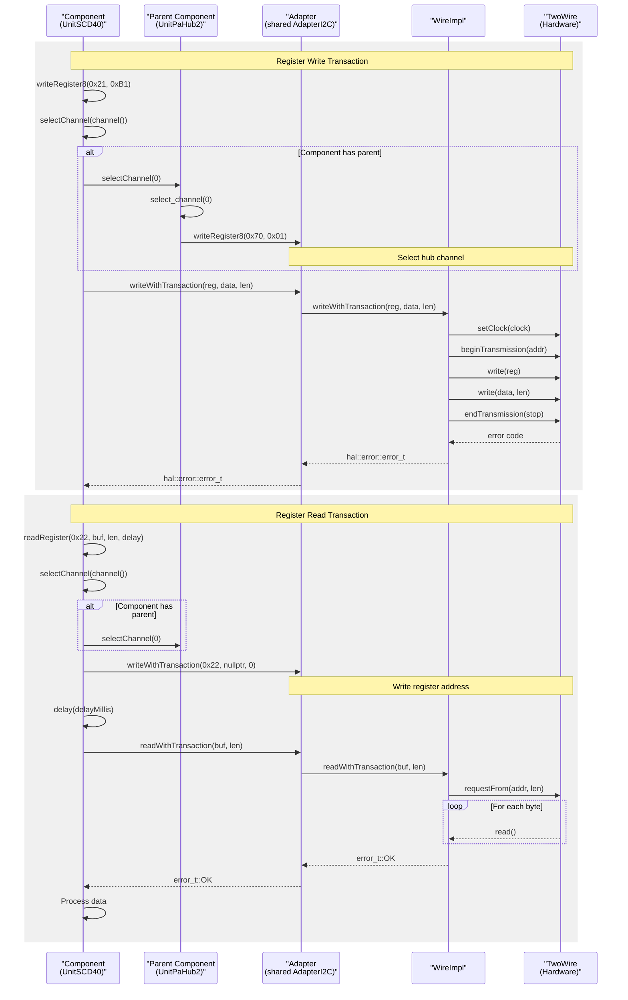

M5UnitUnified Core Architecture

# Core Architecture

<details>
<summary>Relevant source files</summary>

The following files were used as context for generating this wiki page:

- [src/M5UnitComponent.cpp](src/M5UnitComponent.cpp)
- [src/M5UnitComponent.hpp](src/M5UnitComponent.hpp)
- [src/M5UnitUnified.cpp](src/M5UnitUnified.cpp)
- [src/M5UnitUnified.hpp](src/M5UnitUnified.hpp)
- [src/googletest/test_helper.hpp](src/googletest/test_helper.hpp)
- [src/googletest/test_template.hpp](src/googletest/test_template.hpp)
- [src/m5_unit_component/adapter.cpp](src/m5_unit_component/adapter.cpp)
- [src/m5_unit_component/adapter.hpp](src/m5_unit_component/adapter.hpp)
- [src/m5_unit_component/adapter_base.hpp](src/m5_unit_component/adapter_base.hpp)
- [src/m5_unit_component/adapter_gpio_v1.hpp](src/m5_unit_component/adapter_gpio_v1.hpp)
- [src/m5_unit_component/adapter_i2c.cpp](src/m5_unit_component/adapter_i2c.cpp)
- [src/m5_unit_component/adapter_uart.cpp](src/m5_unit_component/adapter_uart.cpp)

</details>


## Purpose and Scope

This document describes the fundamental architectural patterns and core classes of the M5UnitUnified library. It covers the three primary abstractions that enable unified handling of diverse M5Stack sensor units:

1. **Component System** - Base class providing lifecycle management and communication methods for all units
2. **UnitUnified Manager** - Orchestrates registration, initialization, and updates across multiple components
3. **Adapter Pattern** - Abstracts I2C, GPIO, and UART communication protocols with runtime polymorphism
4. **Parent-Child Hierarchies** - Enables hub topologies where sensors connect through multiplexer devices

For detailed information about each subsystem, see:
- Component lifecycle and properties → [Component System](#3.1)
- Manager registration and orchestration → [UnitUnified Manager](#3.2)
- Protocol abstraction and implementations → [Adapter Pattern](#3.3)
- Hub devices and channel selection → [Parent-Child Hierarchies](#3.4)

---

## Architectural Overview

The M5UnitUnified architecture separates concerns into three layers:

**Application Layer**: User code instantiates unit components and registers them with the `UnitUnified` manager.

**Component Layer**: The `Component` base class ([src/M5UnitComponent.hpp:35-588]()) provides a unified interface that all M5Stack units inherit. Each component owns a `std::shared_ptr<Adapter>` for communication.

**Adapter Layer**: The `Adapter` hierarchy ([src/m5_unit_component/adapter_base.hpp:25-229]()) abstracts hardware communication through runtime polymorphism, supporting multiple implementations per protocol (e.g., Arduino `TwoWire` vs M5HAL `Bus` for I2C).

### Core Class Relationships



**Sources**: [src/M5UnitComponent.hpp:35-588](), [src/M5UnitUnified.hpp:47-117](), [src/m5_unit_component/adapter_base.hpp:25-229]()

---

## Component Base Class

The `Component` class ([src/M5UnitComponent.hpp:35-588]()) is the foundation of the architecture. All M5Stack units derive from this class and implement three critical methods:

| Method | Purpose | Default Implementation |
|--------|---------|----------------------|
| `begin()` | Initialize hardware | Returns `true` |
| `update(bool force)` | Read sensor data | Empty (no-op) |
| `unit_device_name()` | Return device name | Pure virtual |

### Key Member Variables



**Sources**: [src/M5UnitComponent.hpp:571-586](), [src/M5UnitComponent.cpp:24-26]()

The `_adapter` uses `std::shared_ptr` to enable efficient sharing between parent and child components in hub topologies (see [Parent-Child Hierarchies](#3.4)).

### Static Member Pattern

Each derived component must define three static members using the `M5_UNIT_COMPONENT_HPP_BUILDER` macro ([src/M5UnitComponent.hpp:694-721]()):

```cpp
static const types::uid_t uid;        // Unique 32-bit identifier
static const types::attr_t attr;      // Capability bitmask
static const char name[];             // Human-readable name
constexpr static uint8_t DEFAULT_ADDRESS;  // I2C address
```

These enable runtime type identification and configuration validation without RTTI.

**Sources**: [src/M5UnitComponent.hpp:52-58](), [src/M5UnitComponent.hpp:694-721]()

---

## UnitUnified Manager

The `UnitUnified` class ([src/M5UnitUnified.hpp:47-117]()) orchestrates the lifecycle of multiple components through a `std::vector<Component*>` container ([src/M5UnitUnified.hpp:113]()).

### Manager Responsibilities



**Sources**: [src/M5UnitUnified.cpp:18-96](), [src/M5UnitUnified.cpp:124-134](), [src/M5UnitUnified.cpp:136-144]()

### Registration Order Tracking

The manager assigns each component a unique `_order` value using a static counter ([src/M5UnitUnified.cpp:16]()):

```cpp
static uint32_t _registerCount{0};  // Global registration counter
```

This enables deterministic update ordering and debugging. The order is assigned during `add()` ([src/M5UnitUnified.cpp:33](), [src/M5UnitUnified.cpp:52]()).

**Sources**: [src/M5UnitUnified.hpp:116](), [src/M5UnitUnified.cpp:16](), [src/M5UnitUnified.cpp:33]()

---

## Adapter Pattern Implementation

The adapter pattern uses **runtime polymorphism** with a two-level hierarchy:

1. **Adapter subclasses** (`AdapterI2C`, `AdapterGPIO`, `AdapterUART`) define protocol-specific interfaces
2. **Impl subclasses** (`WireImpl`, `BusImpl`, `GPIOImpl`, `SerialImpl`) implement hardware-specific logic

### Two-Level Polymorphism



**Sources**: [src/m5_unit_component/adapter_base.hpp:25-229](), [src/m5_unit_component/adapter_i2c.hpp](), [src/m5_unit_component/adapter_gpio_v1.hpp](), [src/m5_unit_component/adapter_uart.hpp]()

### Implementation Selection

The correct implementation is selected at compile-time or runtime:

| Adapter | Selection Mechanism | Source Files |
|---------|-------------------|--------------|
| **I2C** | Constructor argument (TwoWire vs Bus) | [adapter_i2c.cpp:323-345]() |
| **GPIO** | Preprocessor macro `M5_UNIT_UNIFIED_USING_RMT_V2` | [adapter.hpp:17-21]() |
| **UART** | Constructor argument (HardwareSerial) | [adapter_uart.cpp:58-61]() |

The `Adapter::Type` enum ([src/m5_unit_component/adapter_base.hpp:27-33]()) enables runtime type checking via `Component::asAdapter<T>()` ([src/M5UnitComponent.hpp:165-180]()).

**Sources**: [src/m5_unit_component/adapter.hpp:17-21](), [src/m5_unit_component/adapter_base.hpp:27-33](), [src/m5_unit_component/adapter_i2c.cpp:323-345]()

---

## Shared Ownership Model

Components in parent-child relationships share a single `Adapter` instance through `std::shared_ptr` to avoid duplicate I2C transactions and bus contention.

### Adapter Sharing Mechanism



**Sources**: [src/M5UnitComponent.hpp:573](), [src/M5UnitUnified.cpp:99-122]()

### Shared Adapter Lifecycle

When `UnitUnified::add()` is called with a parent component:

1. Parent's `assign()` creates the `Adapter` as a `std::shared_ptr` ([src/M5UnitComponent.cpp:125-131]())
2. Manager calls `add_children()` to recursively register children ([src/M5UnitUnified.cpp:99-122]())
3. For each child, parent's `ensure_adapter(ch)` returns the same `shared_ptr` ([src/M5UnitComponent.hpp:526-529]())
4. Child's `_adapter` shares ownership of the same instance ([src/M5UnitUnified.cpp:111]())

The `use_count()` can be inspected for debugging via `Component::debugInfo()` ([src/M5UnitComponent.cpp:367-368]()).

**Sources**: [src/M5UnitComponent.cpp:125-131](), [src/M5UnitUnified.cpp:99-122](), [src/M5UnitComponent.hpp:526-529]()

---

## Communication Flow

All component communication routes through the adapter layer, enabling protocol abstraction and channel multiplexing.

### Transaction Pattern



**Sources**: [src/M5UnitComponent.cpp:192-202](), [src/M5UnitComponent.cpp:166-171](), [src/M5UnitComponent.cpp:157-164](), [src/m5_unit_component/adapter_i2c.cpp:87-98]()

### Channel Selection Recursion

The `selectChannel()` method ([src/M5UnitComponent.cpp:157-164]()) implements recursive traversal up the parent chain. This ensures all intermediate hubs configure their multiplexers before communication:

```cpp
bool Component::selectChannel(const uint8_t ch) {
    bool ret{true};
    if (hasParent()) {
        ret = _parent->selectChannel(channel());  // Recurse up
    }
    return ret && (select_channel(ch) == m5::hal::error::error_t::OK);
}
```

For hub devices like `UnitPaHub2`, the `select_channel()` virtual method ([src/M5UnitComponent.hpp:532-535]()) writes to the hub's control register to activate the specified channel.

**Sources**: [src/M5UnitComponent.cpp:157-164](), [src/M5UnitComponent.hpp:532-535]()

---

## Configuration and Lifecycle

Component behavior is controlled through `component_config_t` ([src/M5UnitComponent.hpp:41-50]()).

### Configuration Structure

| Field | Type | Default | Purpose |
|-------|------|---------|---------|
| `clock` | `uint32_t` | 100000 | I2C clock frequency (Hz) |
| `stored_size` | `uint32_t` | 1 | Circular buffer size for periodic measurements |
| `self_update` | `bool` | `false` | Enable asynchronous updates via FreeRTOS tasks |
| `max_children` | `uint8_t` | 0 | Maximum number of child components (for hubs) |

**Sources**: [src/M5UnitComponent.hpp:41-50]()

### Lifecycle State Machine

```mermaid
stateDiagram-v2
    [*] --> Unregistered: Component constructed
    
    Unregistered --> Registered: UnitUnified::add()<br/>assign adapter<br/>set _manager
    
    Registered --> Initialized: UnitUnified::begin()<br/>Component::begin()<br/>_begun = true
    
    Initialized --> Updating: UnitUnified::update()
    Updating --> Initialized: update() completes<br/>_updated flag set
    
    Initialized --> SelfUpdating: self_update = true<br/>FreeRTOS task created
    SelfUpdating --> SelfUpdating: Task calls update()
    
    note right of Unregistered
        _manager = nullptr
        _adapter = empty/default
        _order = 0
    end note
    
    note right of Registered
        _manager != nullptr
        _adapter assigned
        _order = registerCount
    end note
    
    note right of Initialized
        _begun = true
        Hardware initialized
    end note
```

**Sources**: [src/M5UnitComponent.hpp:571-579](), [src/M5UnitUnified.cpp:18-39](), [src/M5UnitUnified.cpp:124-134]()

The `_begun` flag ([src/M5UnitComponent.hpp:579]()) prevents multiple initialization. The manager only calls `update()` on components with `_begun == true` and `self_update == false` ([src/M5UnitUnified.cpp:140-141]()).

---

## Testing Infrastructure Integration

The architecture provides three test base classes ([src/googletest/test_template.hpp:56-226]()) that mirror the adapter hierarchy:

| Test Base Class | Protocol | Template Parameters |
|----------------|----------|-------------------|
| `ComponentTestBase<U, TP>` | I2C | Unit type, Parameter type |
| `GPIOComponentTestBase<U, TP>` | GPIO/RMT | Unit type, Parameter type |
| `UARTComponentTestBase<U, TP>` | UART | Unit type, Parameter type |

Each test class instantiates a `UnitUnified` manager and calls lifecycle methods in proper sequence ([src/googletest/test_template.hpp:86-100]()):

```cpp
virtual bool begin() {
    if (is_using_hal()) {
        // M5HAL path
        return Units.add(*unit, i2c_bus) && Units.begin();
    }
    // Arduino path
    return Units.add(*unit, Wire) && Units.begin();
}
```

The `test_periodic_measurement()` helper ([src/googletest/test_helper.hpp:23-74]()) validates that sensor update intervals match specifications, ensuring the architecture maintains precise timing for time-series data.

**Sources**: [src/googletest/test_template.hpp:56-226](), [src/googletest/test_helper.hpp:23-74]()

---

## Summary

The M5UnitUnified core architecture achieves protocol abstraction and lifecycle management through three key patterns:

1. **Component inheritance hierarchy** provides a unified interface for 40+ sensor types
2. **Adapter pattern with dual polymorphism** supports multiple hardware interfaces per protocol
3. **Shared ownership via std::shared_ptr** enables efficient hub topologies without bus contention

These patterns enable the library to support diverse M5Stack hardware (14 board types) while maintaining a consistent programming model across all communication protocols.

For implementation details, see:
- Component methods and properties → [Component System](#3.1)
- Manager orchestration logic → [UnitUnified Manager](#3.2)
- Protocol-specific adapters → [Adapter Pattern](#3.3)
- Hub device patterns → [Parent-Child Hierarchies](#3.4)