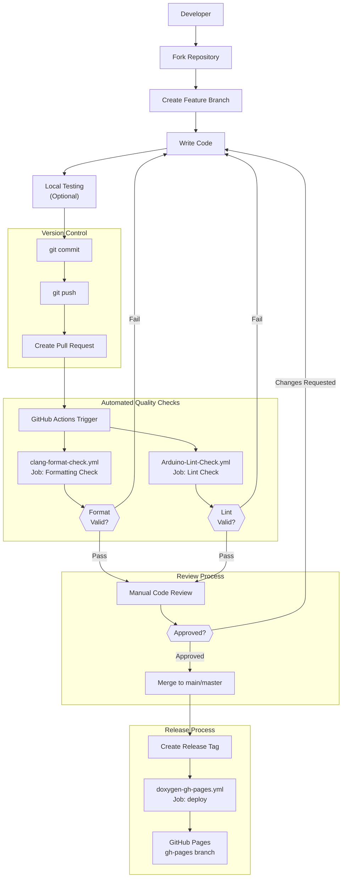
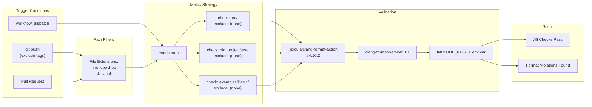
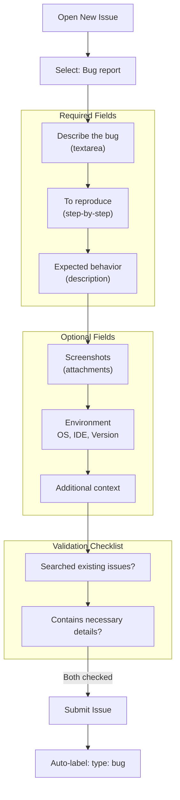

M5UnitUnified Development Guide

# Development Guide

Relevant source files

The following files were used as context for generating this wiki page:

- [.clang-format](.clang-format)
- [.github/ISSUE_TEMPLATE/bug-report.yml](.github/ISSUE_TEMPLATE/bug-report.yml)
- [.github/workflows/Arduino-Lint-Check.yml](.github/workflows/Arduino-Lint-Check.yml)
- [.github/workflows/clang-format-check.yml](.github/workflows/clang-format-check.yml)
- [.github/workflows/doxygen-gh-pages.yml](.github/workflows/doxygen-gh-pages.yml)

This document provides an overview of the development practices, quality assurance infrastructure, and contribution workflow for the M5UnitUnified library. It is intended for developers who wish to contribute code, report bugs, or understand the project's development standards.

For detailed information on specific aspects:
- **CI/CD Pipeline**: See [CI/CD Pipeline](#8.1) for workflow details, triggers, and automated checks
- **Code Standards**: See [Code Standards](#8.2) for formatting rules and style guidelines
- **Contributing**: See [Contributing](#8.3) for bug reporting, feature requests, and pull request process

## Overview

The M5UnitUnified project maintains code quality through automated workflows that enforce formatting standards, validate library compliance, and generate documentation. The development infrastructure includes three GitHub Actions workflows, a `.clang-format` configuration based on Google C++ Style Guide, and structured issue templates for bug reporting.

All contributions undergo automated validation before merging. The system checks C/C++ code formatting across `src/`, `examples/`, and `test/` directories, validates Arduino library compliance at the "strict" level, and deploys API documentation on release events.

## Development Workflow

The following diagram illustrates the complete development and quality assurance process from code contribution to deployment:

**Development Contribution and Validation Flow**

**Sources**: [.github/workflows/clang-format-check.yml](), [.github/workflows/Arduino-Lint-Check.yml](), [.github/workflows/doxygen-gh-pages.yml]()

## Quality Assurance Infrastructure

The project employs three automated workflows that execute on specific triggers. Each workflow validates a different aspect of code quality:

| Workflow | File | Trigger Events | Purpose | Validation Scope |
|----------|------|----------------|---------|------------------|
| **clang-format Check** | `.github/workflows/clang-format-check.yml` | Push (non-tag), Pull Request, Manual | Code formatting consistency | `src/`, `pio_project/test/`, `examples/Basic/` |
| **Arduino Lint Check** | `.github/workflows/Arduino-Lint-Check.yml` | Push to main/master, Pull Request, Manual | Arduino library compliance | Entire library structure |
| **Doxygen Documentation** | `.github/workflows/doxygen-gh-pages.yml` | Release events, Manual | API documentation generation | `docs/Doxyfile` configuration |

### Workflow Execution Details

**clang-format Check Workflow Architecture**

**Sources**: [.github/workflows/clang-format-check.yml:1-69]()

The `clang-format-check.yml` workflow uses a matrix strategy to check three directory trees independently. Each matrix entry specifies a `check` path and optional `exclude` regex. The workflow leverages the `jidicula/clang-format-action` with clang-format version 13, applying the `.clang-format` configuration located at the repository root.

**Key Configuration Parameters**:
- **Include Regex** (line 4): `^.*\.((((c|C)(c|pp|xx|\+\+)?$)|((h|H)h?(pp|xx|\+\+)?$))|(inl|ino|pde|proto|cu))$` matches C/C++ source files
- **Concurrency Control** (lines 38-40): Cancels in-progress runs when new commits are pushed to the same branch
- **Matrix Paths** (lines 48-54): Three separate checks for source, test, and example code

### Arduino Library Compliance

The `Arduino-Lint-Check.yml` workflow validates that the library structure conforms to Arduino library specification 1.5 format. It executes on pushes and pull requests targeting the `main` or `master` branches.

**Compliance Configuration**:
- **Compliance Level** (line 26): `strict` - enforces all Arduino library requirements
- **Library Manager** (line 25): `update` - checks compatibility with Arduino Library Manager
- **Project Type** (line 27): `all` - validates all aspects of library structure

**Sources**: [.github/workflows/Arduino-Lint-Check.yml:1-28]()

### Documentation Generation

The `doxygen-gh-pages.yml` workflow generates API documentation using Doxygen 1.11.0 and deploys it to the `gh-pages` branch. This workflow only triggers on release events or manual dispatch.

**Documentation Pipeline**:
1. **Action**: `m5stack/M5Utility/.github/actions/doxygen@develop` (line 20) - shared action from M5Utility repository
2. **Doxygen Version**: 1.11.0 (line 22)
3. **Configuration**: `docs/Doxyfile` (line 26)
4. **Deployment Target**: `gh-pages` branch (line 24)
5. **Output Location**: `docs/html/` (line 25)

**Sources**: [.github/workflows/doxygen-gh-pages.yml:1-27]()

## Code Formatting Configuration

The `.clang-format` file defines formatting rules based on Google C++ Style Guide with project-specific customizations. Key deviations from the Google standard include:

| Setting | Value | Purpose |
|---------|-------|---------|
| `BasedOnStyle` | `Google` | Foundation style guide |
| `ColumnLimit` | `120` | Maximum line width |
| `IndentWidth` | `4` | Spaces per indentation level |
| `AllowShortFunctionsOnASingleLine` | `false` | Forces function bodies on separate lines |
| `BreakBeforeBraces` | `Custom` | Custom brace placement rules |
| `BraceWrapping.AfterFunction` | `true` | Function opening brace on new line |
| `AlignConsecutiveMacros` | `true` | Aligns macro definitions |
| `AlignConsecutiveAssignments` | `true` | Aligns assignment operators |
| `PointerAlignment` | `Left` | `int* ptr` style |
| `SortIncludes` | `false` | Preserves include order |

**Include Grouping Strategy** (lines 69-82):
The configuration defines four priority groups for include directives:
1. Priority 1: C standard headers (`<*.h>`)
2. Priority 2: C++ extension headers and standard library (`<ext/*.h>`, `<*`)
3. Priority 3: Project headers (all others)

**Sources**: [.clang-format:1-167]()

## Issue Reporting Template

The project provides a structured bug report template that guides users through providing necessary information for effective issue resolution. The template follows GitHub's issue forms syntax.

**Bug Report Template Structure**

**Sources**: [.github/ISSUE_TEMPLATE/bug-report.yml:1-83]()

**Template Fields**:

1. **Markdown Guidance** (lines 11-16): Directs users to community forums for troubleshooting rather than GitHub issues for general questions
2. **Bug Description** (lines 18-23): Required field with clear, concise bug description
3. **Reproduction Steps** (lines 25-35): Required structured steps to reproduce the issue
4. **Expected Behavior** (lines 37-42): Required explanation of correct behavior
5. **Environment Information** (lines 51-65): Optional but structured template for OS, IDE version, and library version
6. **Validation Checklist** (lines 74-82): Requires confirmation that existing issues were searched and report is complete

The template automatically applies the `type: bug` label to new issues (line 9).

## Development Environment Setup

Contributors typically work with the following tools and dependencies:

**Required Tools**:
- **clang-format 13**: For code formatting validation and automatic formatting
- **PlatformIO**: For building and testing across 14+ device configurations
- **Git**: Version control with branch-based workflow

**Optional Tools**:
- **Arduino IDE 1.8.19+**: Alternative development environment
- **Doxygen 1.11.0**: Local documentation generation

**Development Dependencies**:
The project requires several M5Stack libraries as dependencies (managed via PlatformIO or Arduino Library Manager):
- `M5Unified`
- `M5Utility`
- `M5HAL`
- 16+ M5Unit libraries (ENV, METER, HUB, HEART, etc.)

For comprehensive build configuration details, see [Build System](#6). For testing infrastructure, see [Testing](#7).

## Contribution Areas

Typical contribution scenarios include:

1. **New Unit Support**: Implementing new Component subclasses for additional M5Stack sensors (see [Component System](#3.1))
2. **Adapter Enhancements**: Extending communication protocol support or adding new implementations (see [Adapter Pattern](#3.3))
3. **Bug Fixes**: Addressing issues in existing component implementations or core infrastructure
4. **Documentation**: Improving inline documentation, examples, or wiki content
5. **Test Coverage**: Adding or enhancing unit tests for components (see [Writing Unit Tests](#7.2))

Each contribution type flows through the same quality assurance pipeline described above, ensuring consistent code quality across the entire codebase.