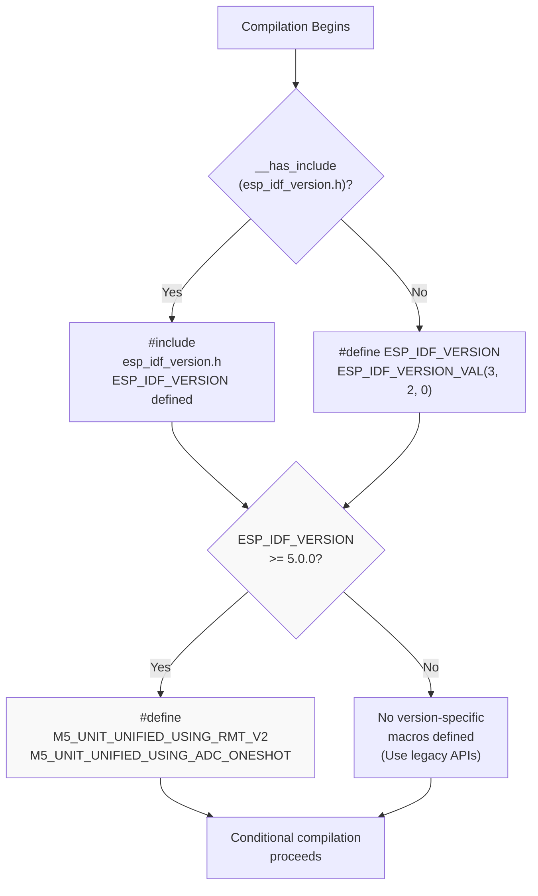
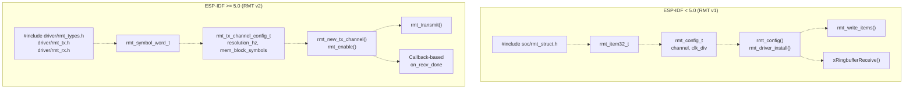
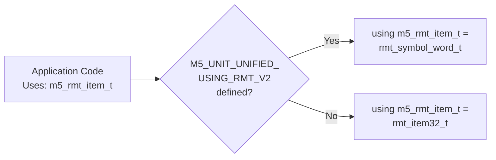
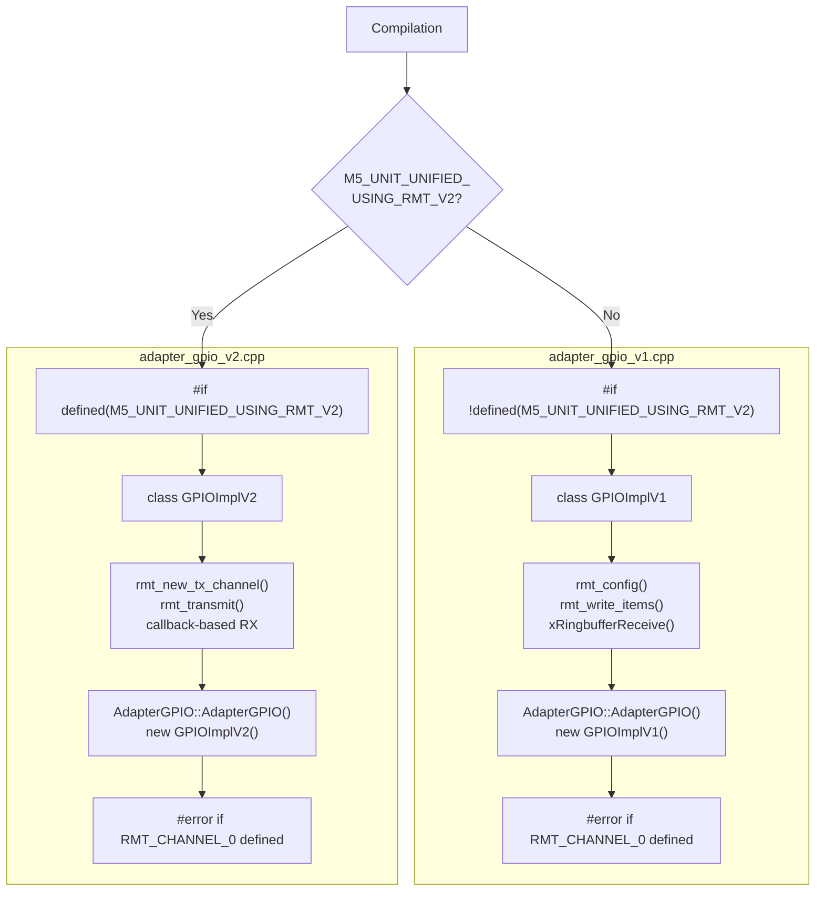
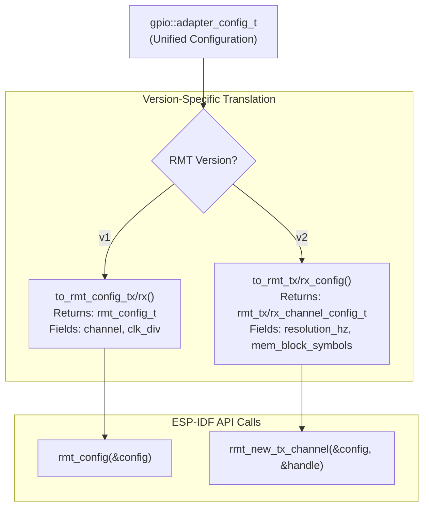
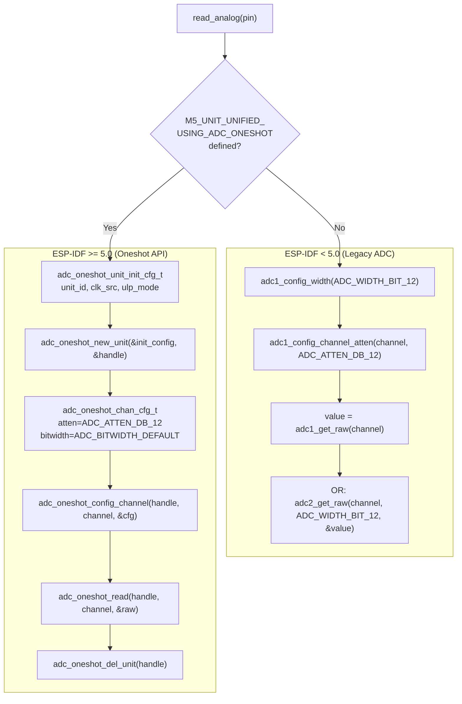
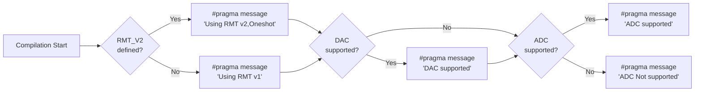
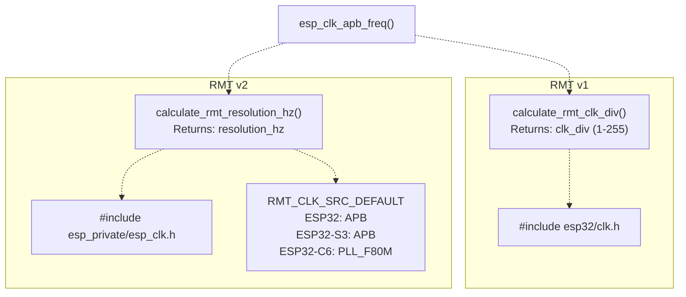

M5UnitUnified ESP-IDF Version Handling

# ESP-IDF Version Handling

<details>
<summary>Relevant source files</summary>

The following files were used as context for generating this wiki page:

- [src/m5_unit_component/adapter_gpio.cpp](src/m5_unit_component/adapter_gpio.cpp)
- [src/m5_unit_component/adapter_gpio.hpp](src/m5_unit_component/adapter_gpio.hpp)
- [src/m5_unit_component/adapter_gpio_v1.cpp](src/m5_unit_component/adapter_gpio_v1.cpp)
- [src/m5_unit_component/adapter_gpio_v2.cpp](src/m5_unit_component/adapter_gpio_v2.cpp)
- [src/m5_unit_component/adapter_gpio_v2.hpp](src/m5_unit_component/adapter_gpio_v2.hpp)
- [src/m5_unit_component/identify_functions.hpp](src/m5_unit_component/identify_functions.hpp)
- [src/m5_unit_component/types.hpp](src/m5_unit_component/types.hpp)

</details>


## Purpose and Scope

This document describes how M5UnitUnified maintains compatibility across different ESP-IDF versions, focusing on conditional compilation strategies for hardware peripherals. The library supports ESP-IDF versions from 3.2.0 through 5.x, automatically selecting appropriate APIs for the RMT peripheral and ADC subsystem based on the detected ESP-IDF version.

For information about the GPIO adapter implementations themselves, see [GPIO and RMT](#4.2). For build configuration details, see [Build System](#6).

---

## Version Detection System

The library uses a centralized version detection mechanism in `identify_functions.hpp` to determine which ESP-IDF APIs are available at compile time.

### Detection Mechanism

The version detection logic checks for the presence of `esp_idf_version.h` and extracts the version number:

**Version Detection Flow:**



**Sources:** [src/m5_unit_component/identify_functions.hpp:13-26]()

### Version Macros

The library defines two primary feature detection macros:

| Macro | ESP-IDF Version | Purpose |
|-------|----------------|---------|
| `M5_UNIT_UNIFIED_USING_RMT_V2` | ≥ 5.0.0 | Enables RMT v2 API usage |
| `M5_UNIT_UNIFIED_USING_ADC_ONESHOT` | ≥ 5.0.0 | Enables ADC oneshot API |

These macros control conditional compilation throughout the GPIO adapter implementation, ensuring that the appropriate API is used for each ESP-IDF version.

**Sources:** [src/m5_unit_component/identify_functions.hpp:21-25]()

---

## RMT Peripheral Version Handling

The Remote Control Transceiver (RMT) peripheral underwent a major API redesign in ESP-IDF 5.0. M5UnitUnified supports both the legacy (v1) and modern (v2) APIs through dual implementations.

### API Differences



**Sources:** [src/m5_unit_component/types.hpp:16-20](), [src/m5_unit_component/types.hpp:113-117]()

### Type Aliasing Strategy

The `m5_rmt_item_t` alias provides a unified interface across versions:



Both `rmt_symbol_word_t` and `rmt_item32_t` share the same memory layout with four fields: `duration0`, `level0`, `duration1`, `level1`. This structural compatibility allows the same high-level code to work with both versions through type aliasing.

**Sources:** [src/m5_unit_component/types.hpp:113-117]()

### Implementation Selection

The library maintains separate implementation files that are conditionally compiled:

**Compilation Units:**



The `AdapterGPIO` constructor is defined in exactly one compilation unit based on the version macro. Each implementation file includes error-checking preprocessor directives to detect accidental mixing of v1 and v2 APIs:

- **v1 check:** [src/m5_unit_component/adapter_gpio_v1.cpp:307-309]()
- **v2 check:** [src/m5_unit_component/adapter_gpio_v2.cpp:418-420]()

**Sources:** [src/m5_unit_component/adapter_gpio_v1.cpp:13](), [src/m5_unit_component/adapter_gpio_v2.cpp:12]()

### Configuration Translation

The library uses a unified `adapter_config_t` structure that works across both RMT versions. Internal translation functions convert this to version-specific configuration structures:

**Configuration Flow:**



Key translation functions:
- **v1:** `to_rmt_config_tx()`, `to_rmt_config_rx()` [src/m5_unit_component/adapter_gpio_v1.cpp:49-74]()
- **v2:** `to_rmt_tx_config()`, `to_rmt_rx_config()` [src/m5_unit_component/adapter_gpio_v2.cpp:23-47]()

**Sources:** [src/m5_unit_component/types.hpp:80-110](), [src/m5_unit_component/adapter_gpio_v1.cpp:49-74](), [src/m5_unit_component/adapter_gpio_v2.cpp:23-47]()

---

## ADC API Handling

ESP-IDF 5.0 introduced the oneshot ADC API, replacing the legacy ADC1/ADC2 functions. The library conditionally compiles the appropriate ADC code path based on `M5_UNIT_UNIFIED_USING_ADC_ONESHOT`.

### ADC API Comparison

**Version-Specific Implementations:**



**Sources:** [src/m5_unit_component/adapter_gpio.cpp:391-461]()

### ADC Implementation Details

The legacy API uses global configuration:

```cpp
// ESP-IDF 4.x
adc1_config_width(ADC_WIDTH_BIT_12);
adc1_config_channel_atten(channel, ADC_ATTEN_DB_12);
value = adc1_get_raw(channel);
```

The oneshot API requires handle management and explicit cleanup:

```cpp
// ESP-IDF 5.x
adc_oneshot_unit_handle_t adc_handle{};
adc_oneshot_unit_init_cfg_t init_config = {
    .unit_id = unit,
    .clk_src = ADC_RTC_CLK_SRC_DEFAULT,  // or ADC_DIGI_CLK_SRC_DEFAULT for C6
    .ulp_mode = ADC_ULP_MODE_DISABLE
};
adc_oneshot_new_unit(&init_config, &adc_handle);
// ... configure channel, read value ...
adc_oneshot_del_unit(adc_handle);
```

The library handles clock source selection for ESP32-C6, which requires `ADC_DIGI_CLK_SRC_DEFAULT` instead of `ADC_RTC_CLK_SRC_DEFAULT`:

**Sources:** [src/m5_unit_component/adapter_gpio.cpp:406-438](), [src/m5_unit_component/adapter_gpio.cpp:440-460]()

### GPIO-to-ADC Channel Mapping

The library maintains chip-specific lookup tables to map GPIO pin numbers to ADC channels:

| Target | GPIO Range | ADC Units | Table Size |
|--------|-----------|-----------|------------|
| ESP32 | 0-39 | ADC1 (0-9), ADC2 (10-19) | 40 entries |
| ESP32-S2/S3 | 0-20 | ADC1 (0-9), ADC2 (10-19) | 21 entries |
| ESP32-C3/C2 | 0-5 | ADC1 (0-4), ADC2 (10) | 6 entries |
| ESP32-C6/H2 | 0-6 | ADC1 (0-6) | 7 entries |
| ESP32-P4 | 16-23, 49-54 | ADC1 (0-7), ADC2 (10-15) | 55 entries |

The `gpio_to_adc_channel()` function uses these tables to translate pin numbers to ADC channel indices, with values ≥10 indicating ADC2 channels (ESP-IDF 4.x only).

**Sources:** [src/m5_unit_component/adapter_gpio.cpp:147-305]()

---

## Compatibility Patterns

The library employs several patterns to maintain compatibility across ESP-IDF versions while keeping code maintainable.

### Preprocessor Pragma Messages

Compilation messages inform developers which version paths are being taken:



**Example output during compilation:**
```
Using RMT v2,Oneshot
DAC supported
ADC supported
```

**Sources:** [src/m5_unit_component/adapter_gpio.cpp:14-40]()

### Peripheral Capability Detection

The library uses SOC capability macros to detect hardware features:

| Macro | Purpose | Example |
|-------|---------|---------|
| `SOC_DAC_SUPPORTED` | DAC peripheral availability | ESP32 has DAC, ESP32-C6 does not |
| `SOC_ADC_SUPPORTED` | ADC peripheral availability | All targets support ADC |
| `SOC_ADC_PERIPH_NUM` | Number of ADC units | ESP32 has 2, ESP32-C6 has 1 |
| `SOC_RMT_MEM_WORDS_PER_CHANNEL` | RMT memory block size | Varies by chip |

**Sources:** [src/m5_unit_component/adapter_gpio.cpp:22-40](), [src/m5_unit_component/adapter_gpio.cpp:399-404](), [src/m5_unit_component/adapter_gpio_v2.cpp:15]()

### Clock Source Selection

ESP-IDF version and target-specific clock source handling:



The v1 implementation includes `<esp32/clk.h>` for `esp_clk_apb_freq()`, while v2 uses `<esp_private/esp_clk.h>`. Clock source defaults vary by chip but are abstracted through `RMT_CLK_SRC_DEFAULT`.

**Sources:** [src/m5_unit_component/adapter_gpio_v1.cpp:15-16](), [src/m5_unit_component/adapter_gpio_v2.cpp:14](), [src/m5_unit_component/adapter_gpio.cpp:324-345]()

### Error Detection Guards

Both v1 and v2 implementations include cross-contamination detection:

```cpp
#if defined(M5_UNIT_UNIFIED_USING_RMT_V2) && defined(RMT_CHANNEL_0)
#error "RMT v1 is mixed in with RMT v2 even though RMT v2 is used"
#endif
```

The `RMT_CHANNEL_0` macro is defined in RMT v1 headers (`soc/rmt_struct.h`) but not in v2 headers. This preprocessor check catches accidental inclusion of v1 headers when compiling v2 code, preventing subtle bugs from API mismatches.

**Sources:** [src/m5_unit_component/adapter_gpio_v1.cpp:307-309](), [src/m5_unit_component/adapter_gpio_v2.cpp:418-420]()

---

## Platform-Specific Considerations

### ESP32-C6 ADC Clock Source

ESP32-C6 requires special handling for ADC clock source selection:

```cpp
#if defined(CONFIG_IDF_TARGET_ESP32C6)
    adc_oneshot_unit_init_cfg_t init_config = {
        .unit_id = unit,
        .clk_src = ADC_DIGI_CLK_SRC_DEFAULT,  // Not ADC_RTC_CLK_SRC_DEFAULT
        .ulp_mode = ADC_ULP_MODE_DISABLE
    };
#else
    adc_oneshot_unit_init_cfg_t init_config = {
        .unit_id = unit,
        .clk_src = ADC_RTC_CLK_SRC_DEFAULT,
        .ulp_mode = ADC_ULP_MODE_DISABLE
    };
#endif
```

**Sources:** [src/m5_unit_component/adapter_gpio.cpp:412-418]()

### ESP32-P4 Hysteresis Control

ESP32-P4 introduces additional GPIO configuration fields:

```cpp
#if defined(CONFIG_IDF_TARGET_ESP32P4)
    .hys_ctrl_mode = GPIO_HYS_SOFT_ENABLE,
#endif
```

These fields are conditionally included in all `gpio_config_t` structures to maintain compatibility with P4 targets.

**Sources:** [src/m5_unit_component/adapter_gpio.cpp:53-120]()

### RMT v2 Version-Gated Features

ESP-IDF 5.3.0 and 5.4.0 introduced additional configuration flags:

```cpp
#if ESP_IDF_VERSION >= ESP_IDF_VERSION_VAL(5, 3, 0)
    out.flags.en_partial_rx = 0;
#endif

#if ESP_IDF_VERSION >= ESP_IDF_VERSION_VAL(5, 4, 0)
    M5_LIB_LOGI("allow_pd : %u", cfg.flags.allow_pd);
#endif
```

The library gracefully handles these additions by conditionally accessing fields only when available.

**Sources:** [src/m5_unit_component/adapter_gpio_v2.cpp:67-69](), [src/m5_unit_component/adapter_gpio_v2.cpp:84-86](), [src/m5_unit_component/adapter_gpio_v2.cpp:100-102](), [src/m5_unit_component/adapter_gpio_v2.cpp:119-121]()

---

## Summary Table

| Feature | ESP-IDF < 5.0 | ESP-IDF ≥ 5.0 | Detection Macro |
|---------|--------------|---------------|-----------------|
| RMT API | v1 (channel-based) | v2 (handle-based) | `M5_UNIT_UNIFIED_USING_RMT_V2` |
| RMT Item Type | `rmt_item32_t` | `rmt_symbol_word_t` | Aliased as `m5_rmt_item_t` |
| RMT Configuration | `rmt_config_t` | `rmt_tx/rx_channel_config_t` | Version-specific translation |
| ADC API | `adc1_get_raw()` | `adc_oneshot_read()` | `M5_UNIT_UNIFIED_USING_ADC_ONESHOT` |
| Clock Access | `<esp32/clk.h>` | `<esp_private/esp_clk.h>` | Include path differs |
| Implementation File | `adapter_gpio_v1.cpp` | `adapter_gpio_v2.cpp` | One compiled per version |

**Sources:** All sections above