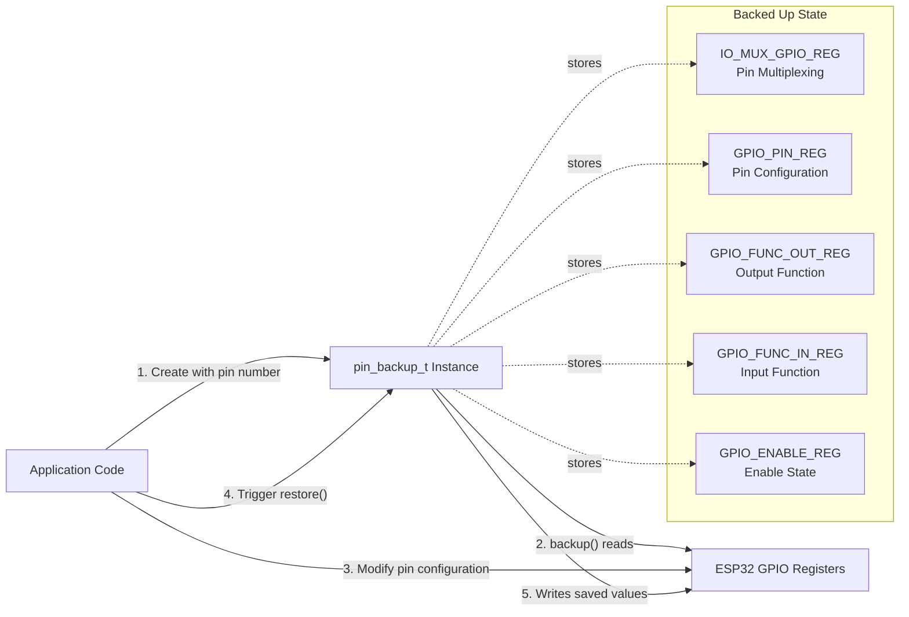
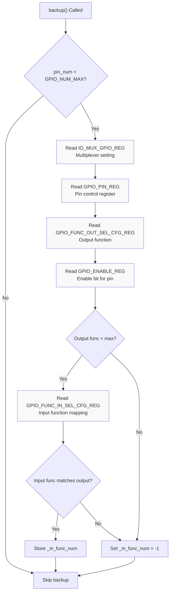
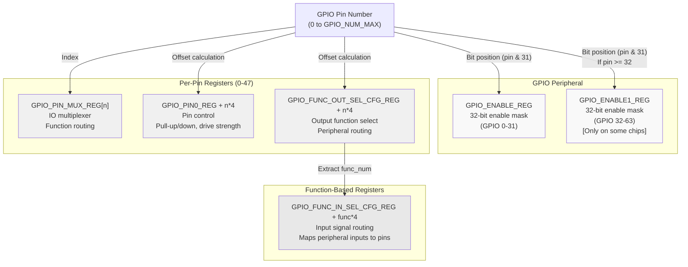

M5UnitUnified GPIO Pin Management

# GPIO Pin Management

<details>
<summary>Relevant source files</summary>

The following files were used as context for generating this wiki page:

- [src/m5_unit_component/pin.cpp](src/m5_unit_component/pin.cpp)
- [src/m5_unit_component/pin.hpp](src/m5_unit_component/pin.hpp)

</details>


## Purpose and Scope

This page documents the **GPIO pin backup and restoration mechanism** provided by the `pin_backup_t` class. This utility enables temporary reconfiguration of ESP32 GPIO pins while preserving their original hardware register state for subsequent restoration. The class is essential for scenarios where communication adapters or peripheral operations must temporarily modify pin functions without disrupting the pin's primary configuration.

For information about GPIO communication protocols using the RMT peripheral, see [GPIO and RMT](#4.2). For ESP-IDF version compatibility patterns, see [ESP-IDF Version Handling](#10.2).

---

## Overview

The `pin_backup_t` class provides a RAII-style mechanism for GPIO pin state preservation on ESP32 platforms. Located in [src/m5_unit_component/pin.hpp]() and [src/m5_unit_component/pin.cpp](), this utility originated from the M5GFX library and is intended for eventual migration to M5HAL.

**Namespace**: `m5::unit::gpio`

**Key Characteristics**:
- **Automatic Backup**: Constructor triggers immediate register capture when valid pin number provided
- **Register-Level Access**: Directly reads/writes ESP-IDF GPIO hardware registers
- **Comprehensive State**: Captures pin multiplexing, function selection, enable state, and direction
- **Platform Conditional**: Excludes ESP32-P4 due to architectural differences



**Diagram: pin_backup_t Lifecycle and Register Capture**

Sources: [src/m5_unit_component/pin.hpp:20-42](), [src/m5_unit_component/pin.cpp:22-27]()

---

## Use Cases

### Temporary Protocol Switching

Adapters may need to temporarily reconfigure pins for alternative protocols:

| Scenario | Initial State | Temporary Use | Restored State |
|----------|---------------|---------------|----------------|
| I2C to GPIO | Pin configured for I2C SDA | Read digital input for detection | Return to I2C SDA |
| UART pin testing | Pin assigned to UART TX | Measure signal level via ADC | Restore UART TX function |
| RMT reconfiguration | Pin driving WS2812 LEDs | Use as general GPIO output | Return to RMT control |

### Hub Channel Selection

Parent components (e.g., PaHub2) may multiplex GPIO pins for channel switching before restoring bus configuration. This allows hub selection logic to operate without permanently affecting shared pin states.

### Peripheral Conflict Resolution

When multiple peripherals share pins through multiplexing, `pin_backup_t` prevents configuration conflicts by ensuring each operation restores the previous state.

Sources: [src/m5_unit_component/pin.hpp:7-9]()

---

## Implementation Details

### Register Backup Process

The `backup()` method captures five critical register values from ESP32 GPIO hardware:



**Diagram: backup() Register Capture Flow**

**Register Mapping**:

| Private Member | ESP-IDF Register | Purpose | Address Calculation |
|----------------|------------------|---------|---------------------|
| `_io_mux_gpio_reg` | `GPIO_PIN_MUX_REG[pin_num]` | IO multiplexer configuration | Direct array index |
| `_gpio_pin_reg` | `GPIO_PIN0_REG + (pin_num * 4)` | Pin-specific control bits | Offset by 4 bytes per pin |
| `_gpio_func_out_reg` | `GPIO_FUNC0_OUT_SEL_CFG_REG + (pin_num * 4)` | Output function selection | Offset by 4 bytes per pin |
| `_gpio_func_in_reg` | `GPIO_FUNC0_IN_SEL_CFG_REG + (func_num * 4)` | Input function routing | Based on output function number |
| `_gpio_enable` | `GPIO_ENABLE_REG` or `GPIO_ENABLE1_REG` | Output enable bit | Single bit in 32-bit register |
| `_in_func_num` | Extracted from `_gpio_func_out_reg` | Function index for input mapping | Computed value, not direct register |

Sources: [src/m5_unit_component/pin.cpp:29-59]()

### Register Restoration Process

The `restore()` method reverses the backup operation, writing stored values back to hardware registers in a specific order:

**Restoration Sequence**:
1. **Input Function** (if valid): `GPIO.func_in_sel_cfg[_in_func_num].val = _gpio_func_in_reg` [pin.cpp:66-69]()
2. **IO Multiplexer**: `GPIO_PIN_MUX_REG[_pin_num] = _io_mux_gpio_reg` [pin.cpp:79]()
3. **Pin Control**: `GPIO_PIN0_REG + (pin_num * 4) = _gpio_pin_reg` [pin.cpp:80]()
4. **Output Function**: `GPIO_FUNC0_OUT_SEL_CFG_REG + (pin_num * 4) = _gpio_func_out_reg` [pin.cpp:81]()
5. **Enable State**: Modify `GPIO_ENABLE_REG` bit mask [pin.cpp:89-97]()

**Critical Implementation Note**: The enable state uses bit masking rather than direct assignment to avoid affecting other pins sharing the same 32-bit enable register.

```cpp
// From pin.cpp:89-97
uint32_t pin_mask = 1 << (pin_num & 31);
uint32_t val      = *gpio_enable_reg;
if (_gpio_enable) {
    val |= pin_mask;   // Set bit for enable
} else {
    val &= ~pin_mask;  // Clear bit for disable
}
*gpio_enable_reg = val;
```

Sources: [src/m5_unit_component/pin.cpp:61-102]()

### ESP32 GPIO Register Architecture

The ESP32 GPIO peripheral uses a multi-level register hierarchy for pin configuration:



**Diagram: ESP32 GPIO Register Organization**

Sources: [src/m5_unit_component/pin.cpp:34-43](), [src/m5_unit_component/pin.cpp:83-87]()

---

## API Reference

### Class Definition

```cpp
namespace m5::unit::gpio {
    class pin_backup_t {
    public:
        explicit pin_backup_t(int pin_num = -1);
        void setPin(int pin_num);
        int8_t getPin(void) const;
        void backup(void);
        void restore(void);
    };
}
```

### Constructor

**Signature**: `explicit pin_backup_t(int pin_num = -1)`

**Behavior**:
- Stores `pin_num` as `_pin_num` (cast to `gpio_num_t`)
- Automatically calls `backup()` if `pin_num >= 0`
- Default parameter `-1` creates uninitialized instance requiring `setPin()` call

**Example**:
```cpp
// Immediate backup on construction
pin_backup_t backup(GPIO_NUM_21);

// Deferred initialization
pin_backup_t backup_later;
backup_later.setPin(GPIO_NUM_22);
backup_later.backup();
```

Sources: [src/m5_unit_component/pin.cpp:22-27]()

### Member Functions

| Method | Parameters | Return Type | Description |
|--------|------------|-------------|-------------|
| `setPin()` | `int pin_num` | `void` | Updates `_pin_num` without triggering backup |
| `getPin()` | None | `int8_t` | Returns currently stored pin number |
| `backup()` | None | `void` | Captures current GPIO register state for `_pin_num` |
| `restore()` | None | `void` | Writes saved register values back to hardware |

**Thread Safety**: This class is **not thread-safe**. Register access is not protected by mutexes. If multiple tasks modify the same pin, external synchronization is required.

Sources: [src/m5_unit_component/pin.hpp:23-32]()

### Private Member Variables

```cpp
private:
    uint32_t _io_mux_gpio_reg{};      // IO multiplexer register value
    uint32_t _gpio_pin_reg{};         // Pin control register value
    uint32_t _gpio_func_out_reg{};    // Output function selection
    uint32_t _gpio_func_in_reg{};     // Input function selection
    int16_t _in_func_num{-1};         // Function index (-1 if invalid)
    int8_t _pin_num{-1};              // GPIO_NUM_NC (-1) indicates unset
    bool _gpio_enable{};              // Output enable state
```

Sources: [src/m5_unit_component/pin.hpp:34-42]()

---

## Platform Compatibility

### Supported Platforms

The `pin_backup_t` class supports most ESP32 variants through conditional compilation:

| Platform | Support Status | Notes |
|----------|----------------|-------|
| ESP32 (original) | ✅ Full support | Uses `GPIO_ENABLE_REG` only |
| ESP32-S2 | ✅ Full support | Uses `GPIO_ENABLE_REG` only |
| ESP32-C3 | ✅ Full support | Uses `GPIO_ENABLE_REG` only |
| ESP32-S3 | ✅ Full support | Requires `GPIO_ENABLE_REG` and `GPIO_ENABLE1_REG` |
| ESP32-C6 | ✅ Full support | Single enable register |
| ESP32-H2 | ✅ Full support | Single enable register |
| **ESP32-P4** | ❌ Not supported | Excluded via `#if !defined(CONFIG_IDF_TARGET_ESP32P4)` |

### Platform-Specific Code

**GPIO Enable Register Selection**:

The code handles chips with extended GPIO ranges (>32 pins) by checking for `GPIO_ENABLE1_REG` definition:

```cpp
// From pin.cpp:38-43 (backup)
#if defined(GPIO_ENABLE1_REG)
    _gpio_enable = (bool)((*reinterpret_cast<uint32_t*>(
        ((pin_num & 32) ? GPIO_ENABLE1_REG : GPIO_ENABLE_REG)) &
        (1U << (pin_num & 31))) != 0);
#else
    _gpio_enable = (bool)((*reinterpret_cast<uint32_t*>(GPIO_ENABLE_REG) & 
        (1U << (pin_num & 31))) != 0);
#endif
```

The bit mask `(pin_num & 32)` selects the appropriate register:
- Pins 0-31: Use `GPIO_ENABLE_REG`
- Pins 32-63: Use `GPIO_ENABLE1_REG` (if defined)

**ESP32-P4 Exclusion**:

Both `backup()` and `restore()` contain preprocessor guards:
```cpp
#if !defined(CONFIG_IDF_TARGET_ESP32P4)
    // ... implementation ...
#else
#pragma message "ESP32P4 was not support"
#endif
```

Sources: [src/m5_unit_component/pin.cpp:31-58](), [src/m5_unit_component/pin.cpp:63-101]()

---

## Usage Example

### Basic Backup and Restore Pattern

```cpp
#include <m5_unit_component/pin.hpp>

void temporaryPinReconfiguration(int pin) {
    // Create backup (automatically captures current state)
    m5::unit::gpio::pin_backup_t backup(pin);
    
    // Modify pin for temporary operation
    pinMode(pin, OUTPUT);
    digitalWrite(pin, HIGH);
    delay(100);
    
    // Restore original configuration
    backup.restore();
}
```

### Deferred Initialization Pattern

```cpp
m5::unit::gpio::pin_backup_t backup;  // Default: pin = -1

void setupWithRuntimePin(int detected_pin) {
    backup.setPin(detected_pin);
    backup.backup();  // Manual backup call required
    
    // ... perform operations ...
    
    backup.restore();
}
```

### Integration with Adapter Classes

While not directly used in the current adapter implementations, `pin_backup_t` provides infrastructure for future adapter enhancements:

```cpp
// Hypothetical adapter usage
class AdapterGPIOWithRestore : public AdapterGPIO {
private:
    m5::unit::gpio::pin_backup_t _pin_state;
    
public:
    bool begin() override {
        _pin_state.setPin(_cfg.pin_sda);
        _pin_state.backup();
        return configureGPIO();
    }
    
    void end() override {
        _pin_state.restore();
    }
};
```

Sources: [src/m5_unit_component/pin.hpp:1-47]()

---

## Future Development

According to inline comments, this utility is planned for migration to the M5HAL library in a future release:

> @todo Will be transferred to M5HAL in the future

This migration will centralize GPIO management utilities across the M5Stack ecosystem, potentially adding features such as:
- Thread-safe register access with mutex protection
- Support for additional ESP32 variants (including P4)
- Extended register backup (ADC, DAC, LEDC configurations)
- Integration with M5HAL's unified pin mapping system

Sources: [src/m5_unit_component/pin.hpp:9](), [src/m5_unit_component/pin.cpp:9]()