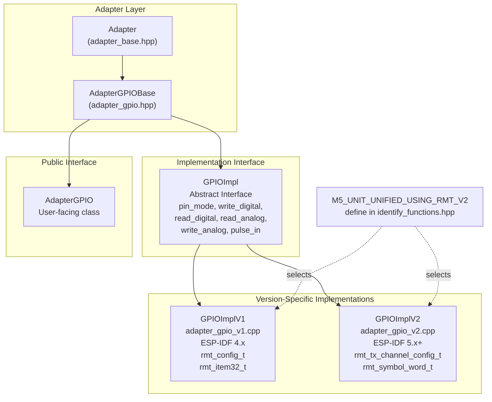
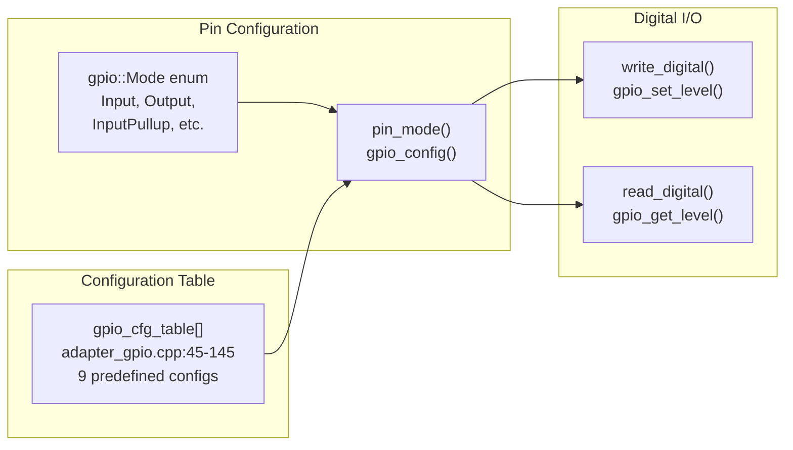
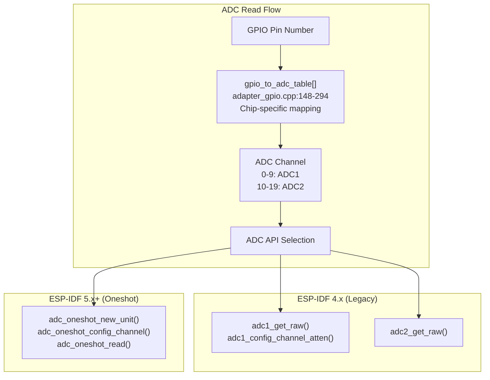
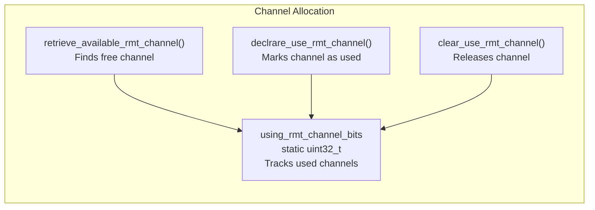
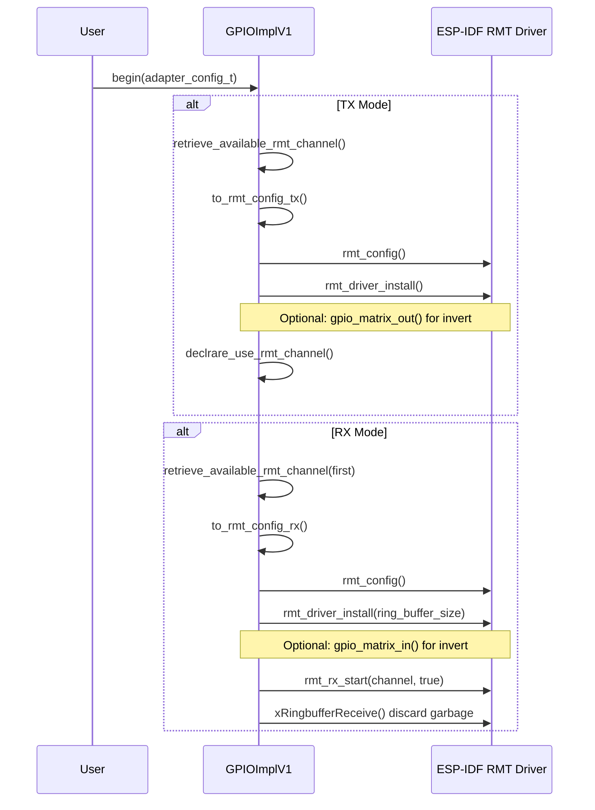
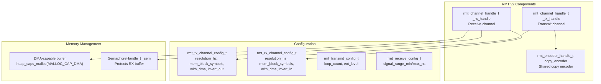
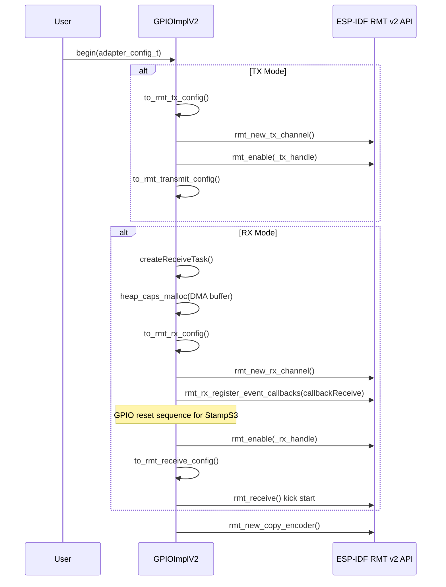
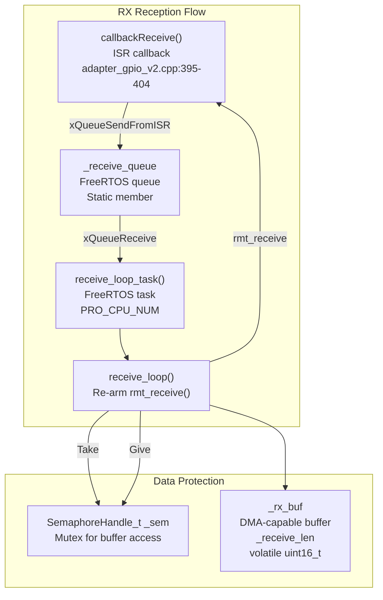

M5UnitUnified GPIO and RMT

# GPIO and RMT

<details>
<summary>Relevant source files</summary>

The following files were used as context for generating this wiki page:

- [src/m5_unit_component/adapter_gpio.cpp](src/m5_unit_component/adapter_gpio.cpp)
- [src/m5_unit_component/adapter_gpio.hpp](src/m5_unit_component/adapter_gpio.hpp)
- [src/m5_unit_component/adapter_gpio_v1.cpp](src/m5_unit_component/adapter_gpio_v1.cpp)
- [src/m5_unit_component/adapter_gpio_v2.cpp](src/m5_unit_component/adapter_gpio_v2.cpp)
- [src/m5_unit_component/adapter_gpio_v2.hpp](src/m5_unit_component/adapter_gpio_v2.hpp)
- [src/m5_unit_component/identify_functions.hpp](src/m5_unit_component/identify_functions.hpp)
- [src/m5_unit_component/types.hpp](src/m5_unit_component/types.hpp)

</details>


## Purpose and Scope

This page covers the `AdapterGPIO` implementation, which provides unified access to GPIO operations and the RMT (Remote Control) peripheral across different ESP-IDF versions. The adapter supports digital I/O, analog read/write, pulse timing, and precise signal transmission/reception using ESP32's RMT hardware.

For I2C communication, see [I2C Communication](#4.1). For UART communication, see [UART Communication](#4.3). For the general adapter pattern architecture, see [Adapter Pattern](#3.3).

## Architecture Overview

The GPIO adapter uses a version-specific implementation pattern, automatically selecting between RMT v1 (ESP-IDF 4.x) and RMT v2 (ESP-IDF 5.x+) based on compile-time detection.

### Class Hierarchy



**Sources:** [src/m5_unit_component/adapter_gpio.hpp:41-158](), [src/m5_unit_component/adapter_gpio_v1.cpp:117-297](), [src/m5_unit_component/adapter_gpio_v2.cpp:140-196]()

## ESP-IDF Version Detection

The library automatically detects the ESP-IDF version and selects the appropriate RMT implementation at compile time.

### Version Detection Logic

| Define | Condition | RMT Version | ADC API |
|--------|-----------|-------------|---------|
| `M5_UNIT_UNIFIED_USING_RMT_V2` | ESP-IDF ≥ 5.0.0 | RMT v2 | Oneshot |
| Not defined | ESP-IDF < 5.0.0 | RMT v1 | Legacy |

The detection occurs in [src/m5_unit_component/identify_functions.hpp:22-25]():

```cpp
#if ESP_IDF_VERSION >= ESP_IDF_VERSION_VAL(5, 0, 0)
#define M5_UNIT_UNIFIED_USING_RMT_V2
#define M5_UNIT_UNIFIED_USING_ADC_ONESHOT
#endif
```

### Conditional Compilation

The implementation files use conditional compilation to include only the relevant version:

- **RMT v1**: [src/m5_unit_component/adapter_gpio_v1.cpp:13-306]() compiles when `M5_UNIT_UNIFIED_USING_RMT_V2` is not defined
- **RMT v2**: [src/m5_unit_component/adapter_gpio_v2.cpp:12-416]() compiles when `M5_UNIT_UNIFIED_USING_RMT_V2` is defined

**Sources:** [src/m5_unit_component/identify_functions.hpp:13-27](), [src/m5_unit_component/adapter_gpio_v1.cpp:13](), [src/m5_unit_component/adapter_gpio_v2.cpp:12]()

## GPIO Operations

The `AdapterGPIOBase::GPIOImpl` class provides fundamental GPIO operations that work across all ESP32 variants.

### Digital Operations



### Pin Mode Configuration

The adapter uses a pre-configured table of `gpio_config_t` structures for different pin modes. Each mode is mapped to a specific configuration:

| Mode | GPIO Mode | Pull-up | Pull-down |
|------|-----------|---------|-----------|
| `Input` | `GPIO_MODE_INPUT` | Disabled | Disabled |
| `Output` | `GPIO_MODE_OUTPUT` | Disabled | Disabled |
| `InputPullup` | `GPIO_MODE_INPUT` | Enabled | Disabled |
| `InputPulldown` | `GPIO_MODE_INPUT` | Disabled | Enabled |
| `OpenDrain` | `GPIO_MODE_OUTPUT_OD` | Enabled | Disabled |
| `OutputOpenDrain` | `GPIO_MODE_OUTPUT_OD` | Disabled | Disabled |
| `Analog` | `GPIO_MODE_DISABLE` | Disabled | Disabled |

The `pin_mode()` function at [src/m5_unit_component/adapter_gpio.cpp:349-358]() applies these configurations.

**Sources:** [src/m5_unit_component/adapter_gpio.cpp:44-145](), [src/m5_unit_component/types.hpp:60-74](), [src/m5_unit_component/adapter_gpio.cpp:349-358]()

### Analog Operations

The adapter provides ADC (Analog-to-Digital Converter) and DAC (Digital-to-Analog Converter) operations with automatic channel mapping.

#### ADC Channel Mapping

Each ESP32 variant has different GPIO-to-ADC channel mappings. The adapter uses lookup tables to convert GPIO numbers to ADC channels:



Example ADC mappings for ESP32:
- GPIO 36-39: ADC1 channels 0-3
- GPIO 32-35: ADC1 channels 4-7
- GPIO 0, 2, 4, 12-15, 25-27: ADC2 channels

The `read_analog()` implementation at [src/m5_unit_component/adapter_gpio.cpp:391-461]() handles both ESP-IDF 4.x and 5.x APIs.

#### DAC Output

DAC is only supported on GPIO 25 and 26 (ESP32 only). The `write_analog()` function at [src/m5_unit_component/adapter_gpio.cpp:373-389]() outputs an 8-bit value (0-255).

**Sources:** [src/m5_unit_component/adapter_gpio.cpp:148-294](), [src/m5_unit_component/adapter_gpio.cpp:298-305](), [src/m5_unit_component/adapter_gpio.cpp:391-461](), [src/m5_unit_component/adapter_gpio.cpp:373-389]()

### Pulse Timing

The `pulse_in()` function at [src/m5_unit_component/adapter_gpio.cpp:463-499]() measures pulse duration using `esp_timer_get_time()` for microsecond precision:

1. Wait for any previous pulse to end
2. Wait for the pulse to start (specified state)
3. Measure time until pulse ends
4. Return duration in microseconds

This is useful for sensors like ultrasonic distance sensors that communicate via pulse width.

**Sources:** [src/m5_unit_component/adapter_gpio.cpp:463-499]()

## RMT Peripheral

The RMT (Remote Control) peripheral enables precise transmission and reception of pulse-coded signals, commonly used for protocols like WS2812 (NeoPixel), infrared remotes, and RF433.

### RMT Item Structures

The basic unit of RMT data differs between versions:

| Version | Type | Members |
|---------|------|---------|
| RMT v1 | `rmt_item32_t` | `duration0`, `level0`, `duration1`, `level1` |
| RMT v2 | `rmt_symbol_word_t` | `duration0`, `level0`, `duration1`, `level1` |

Both represent two pulse edges in a single 32-bit word. The type alias `m5::unit::gpio::m5_rmt_item_t` at [src/m5_unit_component/types.hpp:113-117]() automatically selects the correct type.

**Sources:** [src/m5_unit_component/types.hpp:113-117]()

## Configuration

The `gpio::adapter_config_t` structure at [src/m5_unit_component/types.hpp:80-110]() provides unified configuration for both RMT versions.

### Configuration Structure

```mermaid
graph TB
    subgraph "adapter_config_t"
        Mode["mode: gpio::Mode<br/>RmtRX, RmtTX, RmtRXTX"]
        RXConfig["rx: rx_config_t"]
        TXConfig["tx: tx_config_t"]
    end
    
    subgraph "Common config_t Members"
        TickNS["tick_ns: uint32_t<br/>RMT resolution"]
        GPIO["gpio_num: gpio_num_t<br/>Pin assignment"]
        MemBlocks["mem_blocks: uint8_t<br/>Buffer size"]
        Invert["invert_signal: bool<br/>Logic inversion"]
        DMA["with_dma: bool<br/>(v2 only)"]
    end
    
    subgraph "TX-Specific"
        LoopCount["loop_count: uint16_t"]
        IdleOutput["idle_output_enabled: bool"]
        IdleLevel["idle_level_high: bool"]
        LoopEn["loop_enabled: bool"]
    end
    
    subgraph "RX-Specific"
        RingBuffer["ring_buffer_size: uint16_t<br/>(v1 only)"]
        FilterTicks["filter_ticks_threshold: uint16_t"]
        IdleTicks["idle_ticks_threshold: uint16_t"]
        FilterEn["filter_enabled: bool"]
    end
    
    Mode --> RXConfig
    Mode --> TXConfig
    RXConfig --> TickNS
    RXConfig --> GPIO
    RXConfig --> MemBlocks
    TXConfig --> TickNS
    TXConfig --> GPIO
    TXConfig --> MemBlocks
    
    TXConfig --> LoopCount
    TXConfig --> IdleOutput
    TXConfig --> IdleLevel
    TXConfig --> LoopEn
    
    RXConfig --> RingBuffer
    RXConfig --> FilterTicks
    RXConfig --> IdleTicks
    RXConfig --> FilterEn
```



### Timing Resolution Calculation

The adapter provides helper functions to calculate timing parameters:

**For RMT v1** ([src/m5_unit_component/adapter_gpio.cpp:324-333]()):
```cpp
uint8_t calculate_rmt_clk_div(uint32_t apb_freq_hz, uint32_t tick_ns)
```
Calculates the clock divider (1-255) that produces the desired tick duration.

**For RMT v2** ([src/m5_unit_component/adapter_gpio.cpp:335-345]()):
```cpp
uint32_t calculate_rmt_resolution_hz(uint32_t apb_freq_hz, uint32_t tick_ns)
```
Calculates the resolution frequency that produces the desired tick duration.

**Sources:** [src/m5_unit_component/types.hpp:80-110](), [src/m5_unit_component/adapter_gpio.cpp:324-345]()

## RMT v1 Implementation (ESP-IDF 4.x)

### Channel Management

RMT v1 uses static channel allocation tracked by a bitmap at [src/m5_unit_component/adapter_gpio_v1.cpp:21-47]():



Some ESP32 variants have channel restrictions:
- **ESP32S3**: RX channels 4-7 only
- **ESP32C6**: RX channels 2-3 only
- **ESP32**: Any channel 0-7 for RX/TX

**Sources:** [src/m5_unit_component/adapter_gpio_v1.cpp:21-47](), [src/m5_unit_component/adapter_gpio_v1.cpp:178-184]()

### Initialization Flow



**Sources:** [src/m5_unit_component/adapter_gpio_v1.cpp:138-233]()

### TX/RX Operations

**Transmit** ([src/m5_unit_component/adapter_gpio_v1.cpp:235-258]()):
- Uses `rmt_write_items()` to send `rmt_item32_t` array
- Optionally calls `rmt_wait_tx_done()` if `waitMs` is specified

**Receive** ([src/m5_unit_component/adapter_gpio_v1.cpp:260-293]()):
- Uses `rmt_get_ringbuf_handle()` to access FreeRTOS ring buffer
- Calls `xRingbufferReceive()` with 50ms timeout
- Returns received length in first 2 bytes, followed by `rmt_item32_t` data

**Sources:** [src/m5_unit_component/adapter_gpio_v1.cpp:235-293]()

## RMT v2 Implementation (ESP-IDF 5.x+)

### Architecture

RMT v2 uses a handle-based API with separate TX and RX channel types:



**Sources:** [src/m5_unit_component/adapter_gpio_v2.cpp:179-196]()

### Initialization Flow



**Sources:** [src/m5_unit_component/adapter_gpio_v2.cpp:198-298]()

### Asynchronous RX with Callbacks

RMT v2 uses an interrupt-driven callback system:



1. `callbackReceive()` ISR is triggered when RX completes
2. ISR posts to `_receive_queue` with received length
3. Static task `receive_loop_task()` wakes up
4. Takes semaphore, updates `_receive_len`, re-arms `rmt_receive()`
5. `readWithTransaction()` reads from buffer under semaphore protection

**Sources:** [src/m5_unit_component/adapter_gpio_v2.cpp:353-404](), [src/m5_unit_component/adapter_gpio_v2.cpp:377-393]()

### TX/RX Operations

**Transmit** ([src/m5_unit_component/adapter_gpio_v2.cpp:300-321]()):
- Uses `rmt_transmit()` with copy encoder
- Data is `rmt_symbol_word_t` array
- Optionally calls `rmt_tx_wait_all_done()` if `waitMs` is specified

**Receive** ([src/m5_unit_component/adapter_gpio_v2.cpp:323-351]()):
- Takes semaphore to protect buffer access
- Copies `_receive_len` bytes from `_rx_buf` to user buffer
- Returns received length in first 2 bytes, followed by `rmt_symbol_word_t` data

**Sources:** [src/m5_unit_component/adapter_gpio_v2.cpp:300-351]()

## Device Compatibility

The following table summarizes RMT version compatibility across M5Stack devices (from [src/m5_unit_component/adapter_gpio_v2.cpp:422-443]()):

| Device | RMT v1 | RMT v2 |
|--------|--------|--------|
| Core | OK | OK |
| Core2 | OK | OK |
| CoreS3 | OK | OK |
| Dial | OK | OK |
| AtomS3 | OK | OK |
| AtomS3R | OK | OK |
| StickCPlus | OK | OK |
| StickCPlus2 | OK | OK |
| StampS3 | OK | OK |
| NanoC6 | — | OK |
| DinMeter | OK | OK |
| CoreINK | OK | OK |
| Paper | OK | OK |
| Fire | OK | OK |
| AtomMatrix | OK | OK |

NanoC6 only supports RMT v2 as it uses ESP32-C6 with ESP-IDF 5.x.

**Sources:** [src/m5_unit_component/adapter_gpio_v2.cpp:422-446]()

## Usage Example

Typical usage pattern for GPIO adapter with RMT:

```cpp
// Create adapter with RX and TX pins
AdapterGPIO adapter(rx_pin, tx_pin);

// Configure for RMT TX
gpio::adapter_config_t cfg{};
cfg.mode = gpio::Mode::RmtTX;
cfg.tx.tick_ns = 1000;  // 1 microsecond ticks
cfg.tx.mem_blocks = 1;
cfg.tx.idle_output_enabled = true;
cfg.tx.idle_level_high = false;

// Initialize
adapter.begin(cfg);

// Transmit RMT items
gpio::m5_rmt_item_t items[10];
// ... populate items ...
adapter.writeWithTransaction((uint8_t*)items, sizeof(items), 100);
```

**Sources:** [src/m5_unit_component/adapter_gpio.hpp:154-157](), [src/m5_unit_component/types.hpp:80-110]()