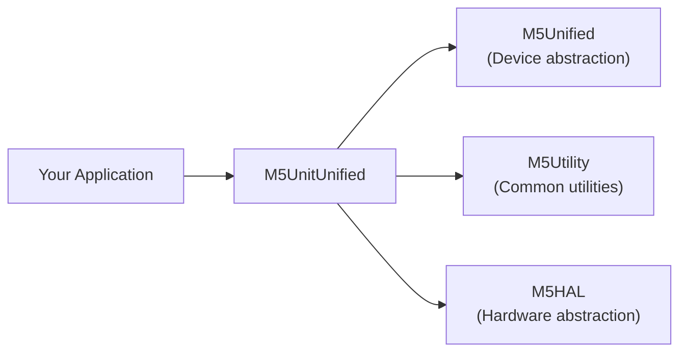
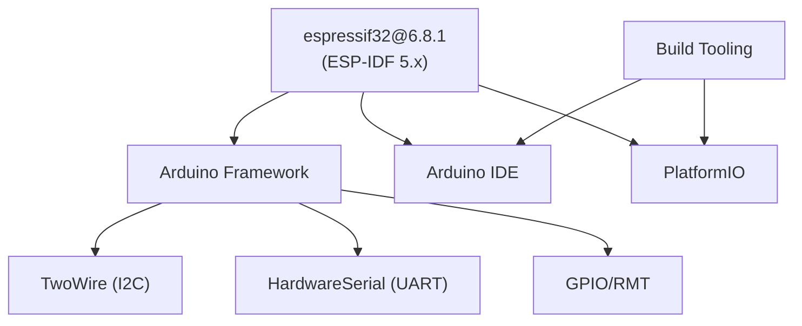
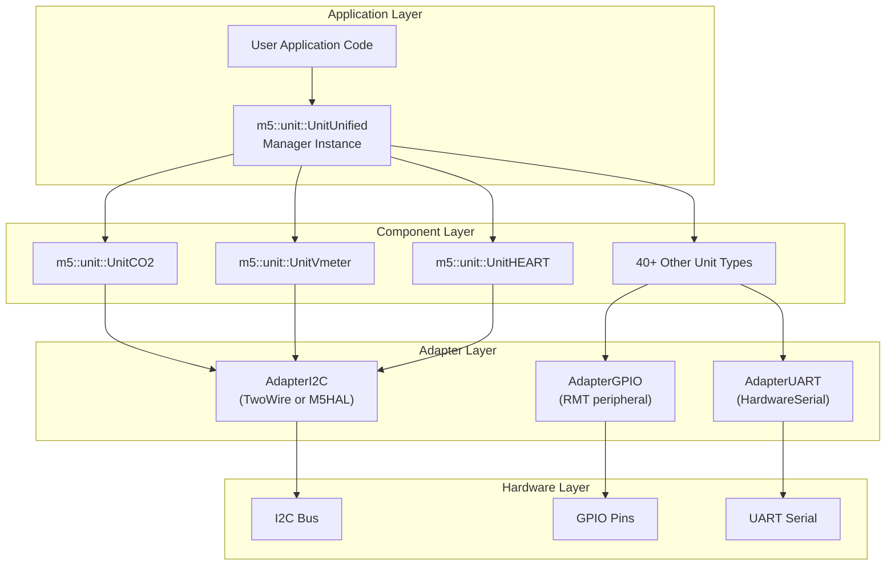
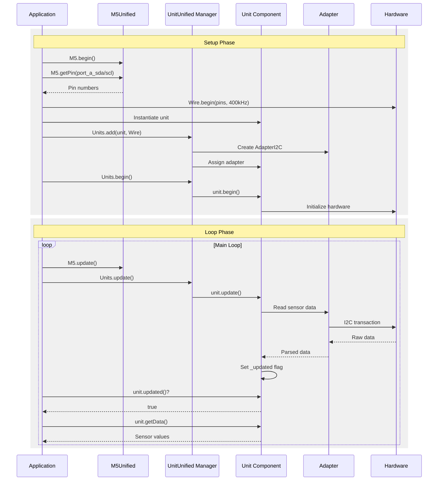
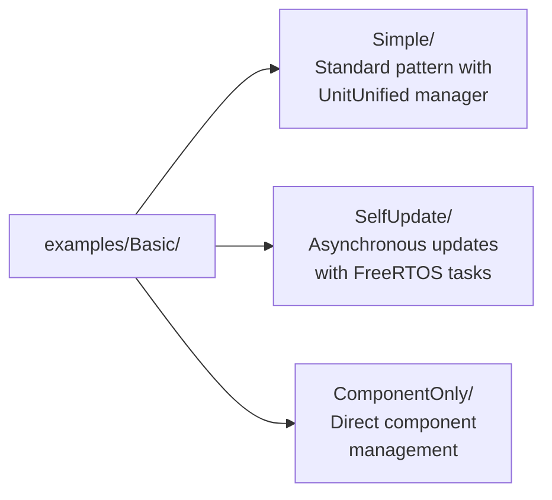

M5UnitUnified Getting Started

# Getting Started

<details>
<summary>Relevant source files</summary>

The following files were used as context for generating this wiki page:

- [README.ja.md](README.ja.md)
- [README.md](README.md)
- [library.json](library.json)
- [library.properties](library.properties)
- [platformio.ini](platformio.ini)
- [src/m5_unit_component/adapter_i2c.hpp](src/m5_unit_component/adapter_i2c.hpp)

</details>


This page provides an introduction to using M5UnitUnified and covers the essential prerequisites, concepts, and workflow patterns. For detailed installation instructions, see [Installation](#2.1). For a complete walkthrough of your first program, see [Quick Start Example](#2.2).

## Purpose and Scope

M5UnitUnified provides a unified interface for connecting and managing M5Stack sensor units. This page introduces the core concepts, installation requirements, and basic usage patterns needed to begin working with the library. For information about the underlying architecture, see [Core Architecture](#3). For advanced usage patterns, see [Usage Patterns](#5).

## Prerequisites

### Hardware Requirements

M5UnitUnified supports **14 M5Stack device families**:

| Device Family | Example Models | Communication Ports |
|---------------|----------------|---------------------|
| Core Series | Core, Core2, CoreS3 | Port A (I2C), Port B (GPIO), Port C (UART) |
| Atom Series | AtomMatrix, AtomS3, AtomS3R | Port A (I2C/GPIO) |
| Stick Series | StickCPlus, StickCPlus2 | Port A (I2C/GPIO) |
| Specialized | Fire, Dial, StampS3, NanoC6, Paper, CoreInk | Varies by model |

Each device provides GPIO-based ports that can be used for I2C, GPIO, or UART communication with M5Stack units.

**Sources:** [platformio.ini:30-110](), [README.md:183-194]()

### Software Dependencies

M5UnitUnified requires three core libraries:



**Core Dependencies:**
- **M5Unified**: Provides device abstraction and pin mapping via `M5.getPin()`
- **M5Utility**: Common utility functions used across M5Stack libraries  
- **M5HAL**: Hardware abstraction layer for I2C bus operations

**Unit-Specific Libraries:**
In addition to the core dependencies, you must install the specific unit library you want to use (e.g., `M5Unit-ENV`, `M5Unit-HEART`, `M5Unit-HUB`). Each unit library depends on M5UnitUnified, so dependencies are resolved automatically.

**Sources:** [library.json:13-16](), [platformio.ini:13-15](), [README.md:28-43]()

### Supported Platforms



- **Platform**: ESP32 family (espressif32)
- **Framework**: Arduino (ESP-IDF support planned for future)
- **Build Systems**: Arduino IDE or PlatformIO
- **Minimum ESP-IDF**: Version 5.x for full feature support

**Sources:** [library.json:18-23](), [platformio.ini:26-28](), [library.properties:9]()

## Core Concepts

### The Three-Layer Architecture

M5UnitUnified uses a three-layer pattern to abstract sensor communication:



**Layer Responsibilities:**

1. **UnitUnified Manager (`m5::unit::UnitUnified`)**: Registers units, orchestrates initialization, and coordinates periodic updates
2. **Component Layer**: Individual unit classes that inherit from `m5::unit::Component`, providing sensor-specific APIs
3. **Adapter Layer**: Communication protocol abstraction supporting I2C, GPIO, and UART

**Sources:** [README.md:11-26](), [platformio.ini:6-15]()

### Communication Protocol Support

M5UnitUnified supports three communication protocols:

| Protocol | Adapter Class | Implementation Options | Typical Use Cases |
|----------|---------------|------------------------|-------------------|
| **I2C** | `AdapterI2C` | Arduino `TwoWire` or M5HAL `Bus` | Environmental sensors, displays, most units |
| **GPIO** | `AdapterGPIO` | ESP-IDF RMT peripheral (v1 or v2) | Pressure sensors, simple digital units |
| **UART** | `AdapterUART` | Arduino `HardwareSerial` | Fingerprint readers, serial-based units |

The adapter layer automatically selects the appropriate implementation based on the initialization parameters provided.

**Sources:** [src/m5_unit_component/adapter_i2c.hpp:25-243](), [README.md:188-193]()

## Installation Overview

### Quick Installation

**Arduino IDE:**
```
Library Manager → Search for your unit (e.g., "M5Unit-ENV") → Install
```
Dependencies (`M5UnitUnified`, `M5Utility`, `M5HAL`) are installed automatically.

**PlatformIO:**
```ini
[env:myproject]
lib_deps = m5stack/M5Unit-ENV
```
Add the unit library to `lib_deps`; dependency resolution is automatic.

For detailed instructions including manual installation and troubleshooting, see [Installation](#2.1).

**Sources:** [README.md:28-43](), [README.ja.md:29-44]()

## Basic Workflow

### Standard Usage Pattern

The typical M5UnitUnified workflow follows this sequence:



**Key Methods:**

1. **Initialization**: `Units.add(component, communication_interface)` registers a unit with its communication adapter
2. **Startup**: `Units.begin()` initializes all registered units
3. **Update Loop**: `Units.update()` polls all units for new data
4. **Data Retrieval**: `unit.updated()` checks for new data, then unit-specific getters retrieve values

**Sources:** [README.md:49-84](), [README.ja.md:51-86]()

### Code Structure Template

Every M5UnitUnified program follows this basic structure:

```cpp
#include <M5Unified.h>
#include <M5UnitUnified.h>
#include <M5UnitUnifiedXXX.h>  // Replace XXX with your unit

m5::unit::UnitUnified Units;
m5::unit::UnitXXX unit;        // Replace XXX with your unit type

void setup() {
    // 1. Initialize M5Stack device
    M5.begin();
    
    // 2. Get pin numbers from M5Unified
    auto pin_num_sda = M5.getPin(m5::pin_name_t::port_a_sda);
    auto pin_num_scl = M5.getPin(m5::pin_name_t::port_a_scl);
    
    // 3. Initialize communication interface
    Wire.begin(pin_num_sda, pin_num_scl, 400000U);
    
    // 4. Register and initialize unit
    Units.add(unit, Wire);
    Units.begin();
}

void loop() {
    // 5. Update M5 and units
    M5.update();
    Units.update();
    
    // 6. Check for new data and retrieve it
    if (unit.updated()) {
        // Process sensor data
    }
}
```

**Critical Steps Explained:**

| Step | Purpose | Key APIs |
|------|---------|----------|
| 1 | Initialize M5Stack hardware, display, buttons | `M5.begin()` |
| 2 | Retrieve GPIO pin numbers for the communication port | `M5.getPin()` |
| 3 | Initialize communication interface with pin configuration | `Wire.begin()`, `Serial.begin()` |
| 4 | Register component with manager and initialize hardware | `Units.add()`, `Units.begin()` |
| 5 | Poll for new sensor data | `Units.update()` |
| 6 | Check update flag and retrieve data | `unit.updated()`, unit-specific getters |

**Sources:** [README.md:52-84](), [examples/Basic/Simple]()

## Communication Interface Setup

### I2C Communication (Most Common)

```cpp
// Get pins for Port A (standard I2C port)
auto pin_num_sda = M5.getPin(m5::pin_name_t::port_a_sda);
auto pin_num_scl = M5.getPin(m5::pin_name_t::port_a_scl);

// Initialize Wire at 400kHz
Wire.begin(pin_num_sda, pin_num_scl, 400000U);

// Add I2C unit
Units.add(unit, Wire);
```

The `Wire` object is shared among all I2C units on the same bus. The adapter automatically manages I2C addressing and transactions.

**Sources:** [README.md:63-68](), [src/m5_unit_component/adapter_i2c.hpp:100-136]()

### GPIO Communication

```cpp
// Get GPIO pins for Port B
auto pin_num_in  = M5.getPin(m5::pin_name_t::port_b_in);
auto pin_num_out = M5.getPin(m5::pin_name_t::port_b_out);

// Add GPIO unit (no Wire.begin needed)
Units.add(unit, pin_num_in, pin_num_out);
```

GPIO units communicate via digital signals and the RMT peripheral. No separate initialization of a bus is required.

**Sources:** [README.md:86-126](), [README.ja.md:88-128]()

### UART Communication

```cpp
// Get UART pins for Port C
auto pin_num_in  = M5.getPin(m5::pin_name_t::port_c_rxd);
auto pin_num_out = M5.getPin(m5::pin_name_t::port_c_txd);

// Initialize hardware serial
Serial2.begin(19200, SERIAL_8N1, pin_num_in, pin_num_out);

// Add UART unit
Units.add(unit, Serial2);
```

UART parameters (baud rate, data bits, parity) vary by unit. Consult the specific unit's documentation.

**Sources:** [README.md:128-176](), [README.ja.md:130-178]()

## Next Steps

### Complete Example Walkthrough

For a detailed, line-by-line explanation of a working program, see [Quick Start Example](#2.2). This tutorial walks through reading temperature and CO2 data from an environmental sensor.

### Understanding the Architecture

To understand how the manager, components, and adapters work together, see:
- [Core Architecture](#3) - Overview of the design patterns
- [Component System](#3.1) - Lifecycle methods and properties
- [UnitUnified Manager](#3.2) - Registration and update orchestration
- [Adapter Pattern](#3.3) - Communication abstraction details

### Exploring Usage Patterns

M5UnitUnified supports multiple usage patterns:
- [Simple Pattern](#5.1) - Standard usage with automatic updates (shown above)
- [Component-Only Pattern](#5.2) - Direct component management without the manager
- [Self-Update Pattern](#5.3) - Asynchronous updates using FreeRTOS tasks
- [Multiple Units Demo](#5.4) - Complex multi-sensor systems with PaHub2

### Example Programs

The repository includes example programs in [examples/Basic]():



Each example is configured for all 14 supported devices in [platformio.ini:164-332]().

**Sources:** [README.md:196-199](), [platformio.ini:159-332]()

### Supported Units

M5UnitUnified supports **40+ unit types** across **16+ categories**. For a complete list of supported units and their specific APIs, see the [Wiki](https://github.com/m5stack/M5UnitUnified/wiki/).

**Sources:** [README.md:194](), [README.ja.md:198]()