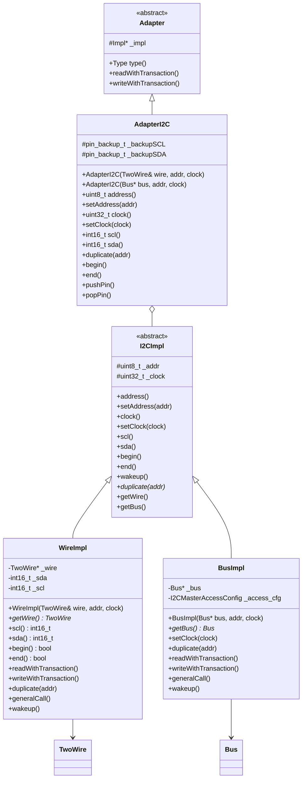
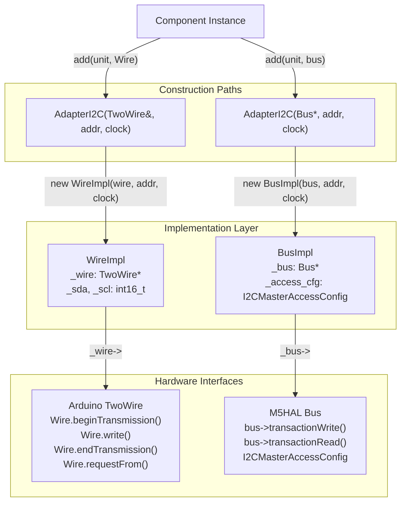
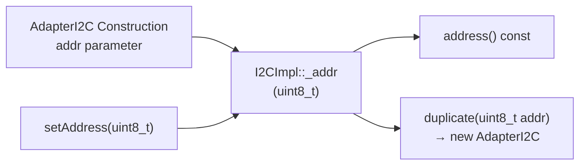
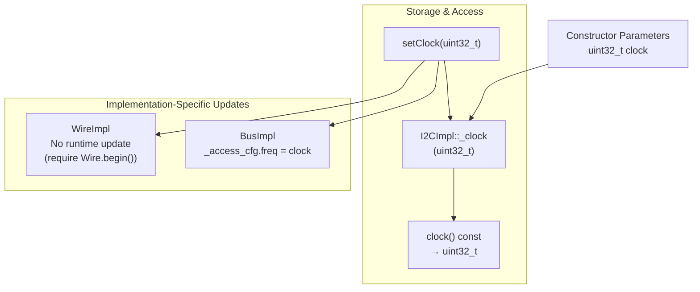
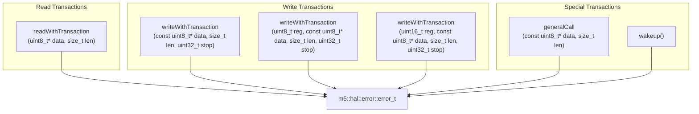
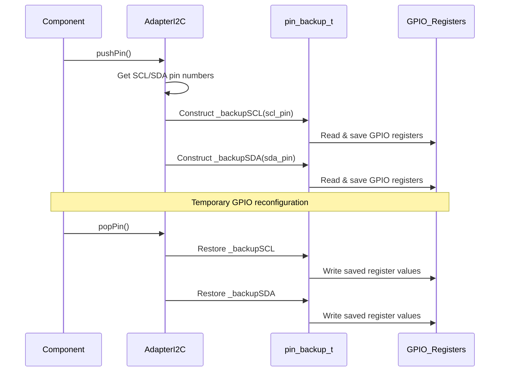
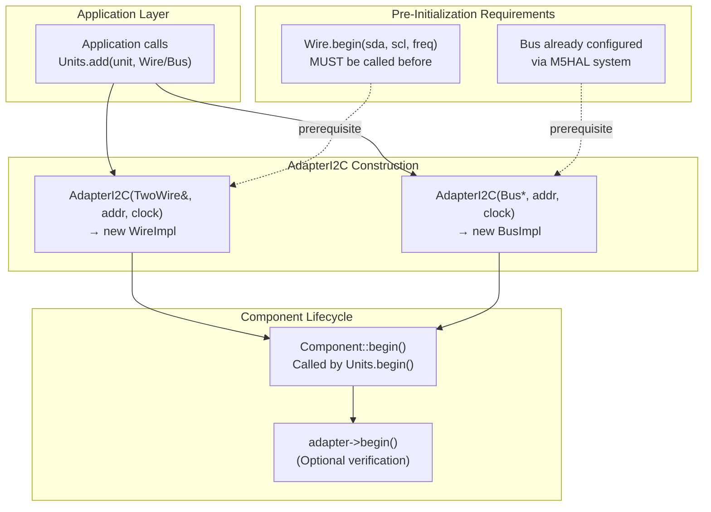
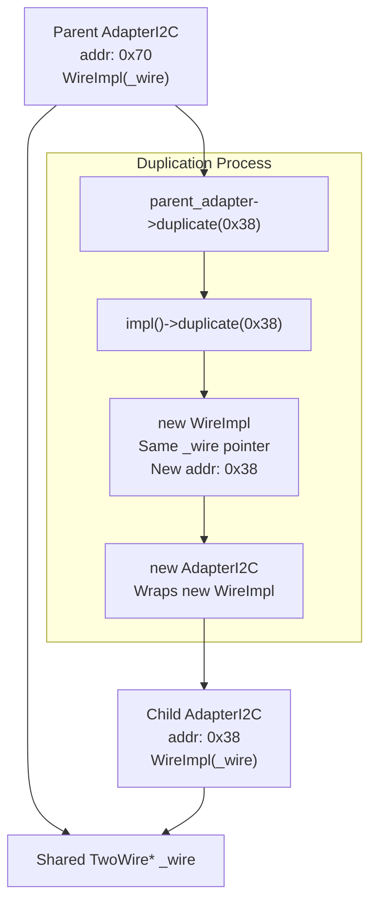

M5UnitUnified I2C Communication

# I2C Communication

<details>
<summary>Relevant source files</summary>

The following files were used as context for generating this wiki page:

- [library.json](library.json)
- [library.properties](library.properties)
- [src/googletest/test_helper.hpp](src/googletest/test_helper.hpp)
- [src/googletest/test_template.hpp](src/googletest/test_template.hpp)
- [src/m5_unit_component/adapter.cpp](src/m5_unit_component/adapter.cpp)
- [src/m5_unit_component/adapter.hpp](src/m5_unit_component/adapter.hpp)
- [src/m5_unit_component/adapter_i2c.hpp](src/m5_unit_component/adapter_i2c.hpp)
- [src/m5_unit_component/adapter_uart.cpp](src/m5_unit_component/adapter_uart.cpp)

</details>


## Purpose and Scope

This document describes the I2C communication implementation in M5UnitUnified through the `AdapterI2C` class. It covers the dual-implementation pattern that abstracts Arduino's `TwoWire` and M5HAL's `Bus` interfaces, address and clock configuration, transaction methods, and pin management features. 

For information about the broader adapter pattern and how adapters integrate with components, see [Adapter Pattern](#3.3). For GPIO/RMT and UART communication, see [GPIO and RMT](#4.2) and [UART Communication](#4.3) respectively.

**Sources:** [src/m5_unit_component/adapter_i2c.hpp:1-247]()

## Architecture Overview

The `AdapterI2C` class implements I2C communication through a three-layer hierarchy that enables runtime polymorphism between Arduino and M5HAL backends.



**Sources:** [src/m5_unit_component/adapter_i2c.hpp:25-247](), [src/m5_unit_component/adapter_base.hpp]()

## Dual Implementation Pattern

The `AdapterI2C` class supports two backend implementations selected at construction time. This design allows the same component code to work with either Arduino's `TwoWire` or M5HAL's `Bus` interface without modification.

### Implementation Selection Flow



**Sources:** [src/m5_unit_component/adapter_i2c.hpp:101-171](), [src/googletest/test_template.hpp:86-100]()

### WireImpl: Arduino TwoWire Backend

`WireImpl` wraps Arduino's `TwoWire` class and maintains SDA/SCL pin numbers for potential reconfiguration.

| Member | Type | Purpose |
|--------|------|---------|
| `_wire` | `TwoWire*` | Pointer to Arduino Wire object |
| `_sda` | `int16_t` | SDA pin number |
| `_scl` | `int16_t` | SCL pin number |
| `_addr` | `uint8_t` | I2C device address (7-bit) |
| `_clock` | `uint32_t` | Bus clock frequency (Hz) |

**Transaction Pattern:**
```
beginTransmission(addr) → write(data) → endTransmission(stop)
requestFrom(addr, len) → read(data)
```

**Sources:** [src/m5_unit_component/adapter_i2c.hpp:101-137]()

### BusImpl: M5HAL Bus Backend

`BusImpl` wraps M5HAL's `Bus` interface, using the `I2CMasterAccessConfig` structure for transaction configuration.

| Member | Type | Purpose |
|--------|------|---------|
| `_bus` | `m5::hal::bus::Bus*` | Pointer to M5HAL bus object |
| `_access_cfg` | `I2CMasterAccessConfig` | Configuration for I2C transactions |
| `_addr` | `uint8_t` | I2C device address (7-bit) |
| `_clock` | `uint32_t` | Bus clock frequency (Hz) |

**Transaction Pattern:**
```
I2CMasterAccessConfig cfg{addr, freq, ...}
bus->transactionWrite(cfg, data, len)
bus->transactionRead(cfg, data, len)
```

The `_access_cfg` structure is pre-configured during construction and updated when clock frequency changes via `setClock()`.

**Sources:** [src/m5_unit_component/adapter_i2c.hpp:139-171]()

## Address Management

I2C device addresses are managed through the `I2CImpl` base class and can be modified at runtime or duplicated for multi-device scenarios.

### Address Configuration



**Key Methods:**

- `uint8_t address() const` - Returns current 7-bit I2C address [src/m5_unit_component/adapter_i2c.hpp:36-39]()
- `void setAddress(uint8_t addr)` - Changes device address [src/m5_unit_component/adapter_i2c.hpp:40-43]()
- `Adapter* duplicate(uint8_t addr)` - Creates new adapter instance with different address [src/m5_unit_component/adapter_i2c.hpp:218]()

### Address Usage in Transactions

Addresses are applied differently depending on implementation:

| Implementation | Address Application Point |
|----------------|---------------------------|
| **WireImpl** | `Wire.beginTransmission(_addr)` before each transaction |
| **BusImpl** | `_access_cfg.addr_or_filenum = addr` in configuration structure |

**Sources:** [src/m5_unit_component/adapter_i2c.hpp:27-97]()

## Clock Configuration

The I2C bus clock frequency can be configured at construction or modified at runtime. Default is 100 kHz.

### Clock Frequency Management



**Typical Clock Values:**

| Speed Mode | Frequency | Common Usage |
|------------|-----------|--------------|
| Standard | 100 kHz | Legacy sensors, low-speed devices |
| Fast | 400 kHz | Most M5Stack units (default in examples) |
| Fast Plus | 1 MHz | High-speed sensors |

**Sources:** [src/m5_unit_component/adapter_i2c.hpp:45-53](), [src/m5_unit_component/adapter_i2c.hpp:147-151](), [src/googletest/test_template.hpp:52]()

## Transaction Methods

The `AdapterI2C` class provides multiple transaction patterns for reading and writing I2C data, inherited from the base `Adapter` class and implemented by `WireImpl` and `BusImpl`.

### Transaction Method Variants



### Read Transaction Pattern

**Method Signature:**
```cpp
m5::hal::error::error_t readWithTransaction(uint8_t* data, const size_t len)
```

**WireImpl Implementation:**
1. `Wire.requestFrom(_addr, len, true)` - Request data with STOP condition
2. `Wire.readBytes(data, len)` - Read received bytes
3. Return `OK` if all bytes received, otherwise `TIMEOUT_ERROR`

**BusImpl Implementation:**
1. Configure `_access_cfg` with device address and frequency
2. `_bus->transactionRead(_access_cfg, data, len, timeout)` - Single transaction call
3. Return result directly from M5HAL

**Sources:** [src/m5_unit_component/adapter_i2c.hpp:118](), [src/m5_unit_component/adapter_i2c.hpp:153]()

### Write Transaction Patterns

The `AdapterI2C` class supports three write patterns:

#### 1. Data-Only Write
```cpp
writeWithTransaction(const uint8_t* data, size_t len, uint32_t stop)
```
Writes raw data bytes without a register address.

#### 2. 8-bit Register Write
```cpp
writeWithTransaction(uint8_t reg, const uint8_t* data, size_t len, uint32_t stop)
```
Writes register address (1 byte) followed by data bytes.

#### 3. 16-bit Register Write
```cpp
writeWithTransaction(uint16_t reg, const uint8_t* data, size_t len, uint32_t stop)
```
Writes register address (2 bytes, MSB first) followed by data bytes.

**Stop Condition Parameter:**
- `0` - Do not send STOP (for repeated start)
- Non-zero - Send STOP after transaction

**Sources:** [src/m5_unit_component/adapter_i2c.hpp:119-124](), [src/m5_unit_component/adapter_i2c.hpp:154-160]()

### Special Transaction Methods

#### General Call
```cpp
m5::hal::error::error_t generalCall(const uint8_t* data, const size_t len)
```
Broadcasts data to all devices on the bus using the I2C general call address (0x00).

#### Wakeup
```cpp
m5::hal::error::error_t wakeup()
```
Sends a wakeup signal to the device. Implementation varies:
- **WireImpl**: Writes single 0x00 byte without STOP
- **BusImpl**: Uses M5HAL's wakeup transaction

**Sources:** [src/m5_unit_component/adapter_i2c.hpp:126-127](), [src/m5_unit_component/adapter_i2c.hpp:161-162]()

## Pin Management

The `AdapterI2C` class includes temporary pin backup and restore functionality for scenarios requiring GPIO reconfiguration during I2C operations.

### Pin Backup Mechanism



**Members:**
- `gpio::pin_backup_t _backupSCL{-1}` - Stores SCL pin configuration
- `gpio::pin_backup_t _backupSDA{-1}` - Stores SDA pin configuration

**Methods:**
- `bool pushPin()` - Backs up current pin configuration [src/m5_unit_component/adapter_i2c.hpp:232]()
- `bool popPin()` - Restores backed-up pin configuration [src/m5_unit_component/adapter_i2c.hpp:233]()

The `pin_backup_t` class captures GPIO register state and restores it on destruction or explicit restore. This is useful for units that temporarily reconfigure pins for non-I2C operations.

**Sources:** [src/m5_unit_component/adapter_i2c.hpp:232-243](), [src/m5_unit_component/pin.hpp]()

## Initialization and Lifecycle

The `AdapterI2C` initialization differs between implementations and requires coordination with the underlying communication interface.

### Initialization Flow



### WireImpl Initialization

**Prerequisites:**
- `Wire.begin(sda_pin, scl_pin, frequency)` must be called **before** creating `AdapterI2C`
- Typically done in application setup after `M5.begin()`

**Example from Test Framework:**
```cpp
// From test_template.hpp:40-52
auto pin_num_sda = M5.getPin(m5::pin_name_t::port_a_sda);
auto pin_num_scl = M5.getPin(m5::pin_name_t::port_a_scl);
TwoWire* w[2] = {&Wire, &Wire1};
w[WNUM]->begin(pin_num_sda, pin_num_scl, FREQ);

// Later: AdapterI2C created
Units.add(*unit, Wire);  // Creates WireImpl internally
```

**Sources:** [src/googletest/test_template.hpp:38-53]()

### BusImpl Initialization

**Prerequisites:**
- M5HAL bus must be configured via `m5::hal::bus::i2c::getBus(I2CBusConfig)`
- Bus configuration includes SDA/SCL pins, frequency, and other parameters

**Example from Test Framework:**
```cpp
// From test_template.hpp:90-96
m5::hal::bus::I2CBusConfig i2c_cfg;
i2c_cfg.pin_sda = m5::hal::gpio::getPin(pin_num_sda);
i2c_cfg.pin_scl = m5::hal::gpio::getPin(pin_num_scl);
auto i2c_bus = m5::hal::bus::i2c::getBus(i2c_cfg);

// AdapterI2C created with bus
Units.add(*unit, i2c_bus.value());  // Creates BusImpl internally
```

**Sources:** [src/googletest/test_template.hpp:88-96]()

## Adapter Duplication

The `duplicate()` method creates a new `AdapterI2C` instance sharing the same communication interface but with a different device address. This is essential for hub components managing multiple child devices.



**Method Signature:**
```cpp
Adapter* duplicate(const uint8_t addr) override
```

**Implementation Details:**
- **WireImpl**: Creates new `WireImpl` with same `_wire` pointer, new address [src/m5_unit_component/adapter_i2c.hpp:125]()
- **BusImpl**: Creates new `BusImpl` with same `_bus` pointer, new address [src/m5_unit_component/adapter_i2c.hpp:152]()
- Both implementations share the underlying communication interface
- Each duplicate maintains independent address, clock settings, and pin backups

**Use Case:**
Hub components (e.g., PaHub2) create duplicates for each child sensor connected to different I2C addresses or hub channels.

**Sources:** [src/m5_unit_component/adapter_i2c.hpp:80-83](), [src/m5_unit_component/adapter_i2c.hpp:125](), [src/m5_unit_component/adapter_i2c.hpp:152](), [src/m5_unit_component/adapter_i2c.hpp:218]()

## Error Handling

All transaction methods return `m5::hal::error::error_t` enum values for consistent error reporting across implementations.

### Common Error Codes

| Error Code | Value | Meaning |
|------------|-------|---------|
| `OK` | 0 | Transaction successful |
| `TIMEOUT_ERROR` | - | Device did not respond (NACK) |
| `BUSY_ERROR` | - | Bus is busy |
| `INVALID_ARG_ERROR` | - | Invalid parameter |
| `UNKNOWN_ERROR` | - | Unspecified error |

### Implementation-Specific Behavior

**WireImpl Error Detection:**
- Uses `Wire.endTransmission()` return value:
  - `0` = success → `OK`
  - `1` = data too long → `INVALID_ARG_ERROR`
  - `2` = NACK on address → `TIMEOUT_ERROR`
  - `3` = NACK on data → `TIMEOUT_ERROR`
  - `4` = other error → `UNKNOWN_ERROR`
  
**BusImpl Error Detection:**
- Directly returns M5HAL transaction result
- M5HAL provides more detailed error classification

**Sources:** [src/m5_unit_component/adapter_i2c.hpp:118-127](), [src/m5_unit_component/adapter_i2c.hpp:153-162]()

## Usage Examples

### Basic Usage with Arduino Wire

```cpp
// Application setup (typical example pattern)
#include <M5Unified.h>
#include <M5UnitUnified.h>
#include <M5UnitUnifiedENV.h>

void setup() {
    M5.begin();
    
    // Initialize Wire with M5Stack port pins
    auto pin_sda = M5.getPin(m5::pin_name_t::port_a_sda);
    auto pin_scl = M5.getPin(m5::pin_name_t::port_a_scl);
    Wire.begin(pin_sda, pin_scl, 400000U);  // 400 kHz
    
    // Create component - AdapterI2C(WireImpl) created internally
    auto unit = new m5::unit::UnitSCD40();
    Units.add(*unit, Wire);  // WireImpl with Wire reference
    Units.begin();
}
```

### Usage with M5HAL Bus

```cpp
// Using M5HAL bus backend
#include <M5Unified.h>
#include <M5UnitUnified.h>
#include <M5HAL.hpp>

void setup() {
    M5.begin();
    
    // Configure M5HAL I2C bus
    auto pin_sda = M5.getPin(m5::pin_name_t::port_a_sda);
    auto pin_scl = M5.getPin(m5::pin_name_t::port_a_scl);
    
    m5::hal::bus::I2CBusConfig cfg;
    cfg.pin_sda = m5::hal::gpio::getPin(pin_sda);
    cfg.pin_scl = m5::hal::gpio::getPin(pin_scl);
    cfg.freq_hz = 400000;
    
    auto bus = m5::hal::bus::i2c::getBus(cfg);
    
    // Create component - AdapterI2C(BusImpl) created internally
    auto unit = new m5::unit::UnitSCD40();
    Units.add(*unit, bus.value());  // BusImpl with Bus pointer
    Units.begin();
}
```

### Runtime Address Change

```cpp
// Changing device address at runtime
auto adapter = static_cast<m5::unit::AdapterI2C*>(unit->adapter());
adapter->setAddress(0x62);  // Change from default to alternate address

// Reading/writing still uses new address
unit->update();
```

### Clock Frequency Adjustment

```cpp
// Adjusting clock speed for specific device
auto adapter = static_cast<m5::unit::AdapterI2C*>(unit->adapter());
adapter->setClock(100000U);  // Reduce to 100 kHz for sensitive device

// Note: WireImpl requires Wire.begin() to be called again
// BusImpl updates _access_cfg.freq automatically
```

**Sources:** [src/googletest/test_template.hpp:86-100](), [src/m5_unit_component/adapter_i2c.hpp:174-179]()