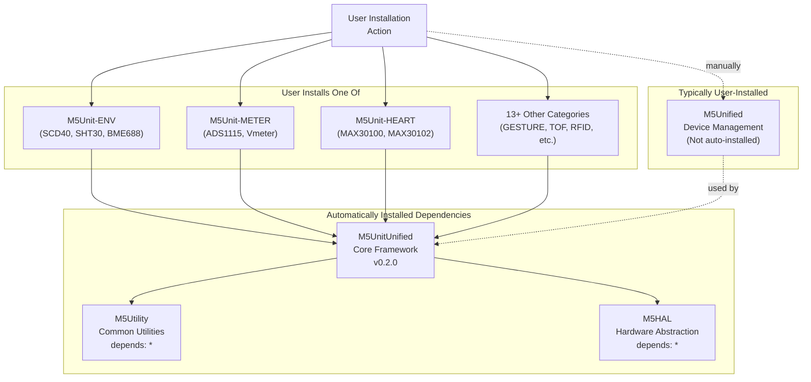
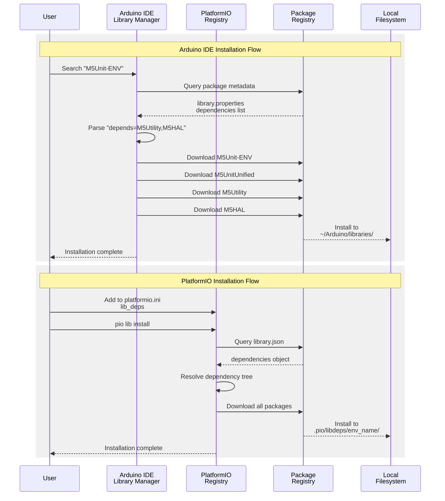

M5UnitUnified Installation

# Installation

<details>
<summary>Relevant source files</summary>

The following files were used as context for generating this wiki page:

- [README.ja.md](README.ja.md)
- [README.md](README.md)
- [library.json](library.json)
- [library.properties](library.properties)
- [platformio.ini](platformio.ini)
- [src/m5_unit_component/adapter_i2c.hpp](src/m5_unit_component/adapter_i2c.hpp)

</details>


## Purpose and Scope

This page provides detailed instructions for installing the M5UnitUnified library and its dependencies via Arduino IDE and PlatformIO. After installation, you can use any of the 40+ supported M5Stack unit types through a unified interface.

For usage examples after installation, see [Quick Start Example](#2.2). For build configuration details when developing with PlatformIO, see [PlatformIO Configuration](#6.1).

---

## System Requirements

M5UnitUnified has the following requirements:

| Requirement | Specification |
|-------------|---------------|
| **Platform** | ESP32 (Espressif32) |
| **Framework** | Arduino |
| **Architecture** | `esp32` |
| **Toolchain** | ESP32 Arduino Core (espressif32@6.8.1 recommended) |
| **Hardware** | Any M5Stack device (14 officially supported boards) |

**Supported M5Stack Devices**: Core, Core2, CoreS3, Fire, AtomMatrix, AtomS3, AtomS3R, StickCPlus, StickCPlus2, StampS3, Dial, NanoC6, Paper, CoreInk. See [Supported Devices](#6.2) for detailed board configurations.

**Sources**: [library.json:18-23](), [library.properties:9](), [platformio.ini:26-28]()

---

## Installation Methods

### Method 1: Arduino IDE Library Manager

The M5UnitUnified library is registered in the Arduino Library Manager registry. Installation automatically resolves all dependencies.

**Installation Steps**:

1. Open Arduino IDE
2. Navigate to **Sketch → Include Library → Manage Libraries**
3. Search for the specific unit library you need (e.g., `M5Unit-ENV`, `M5Unit-METER`, `M5Unit-GESTURE`)
4. Click **Install**
5. Dependent libraries (`M5UnitUnified`, `M5Utility`, `M5HAL`) are automatically downloaded

**Why Install a Specific Unit Library?**  
M5UnitUnified itself is a core framework. Individual sensor libraries (e.g., `M5Unit-ENV` for environmental sensors, `M5Unit-HEART` for heart rate monitors) depend on M5UnitUnified and will install it automatically.

**Direct Installation of Core Library**:
```
Search: "M5UnitUnified"
Install: M5UnitUnified by M5Stack (v0.2.0)
```

This installs the core framework but you'll still need specific unit libraries for actual sensors.

**Sources**: [README.md:28-35](), [library.properties:1-11]()

---

### Method 2: PlatformIO

For PlatformIO projects, add the required unit libraries to `platformio.ini`. The dependency resolver automatically fetches M5UnitUnified and related libraries.

**Basic Configuration**:
```ini
[env:my_m5stack_project]
platform = espressif32@6.8.1
board = m5stack-cores3
framework = arduino
lib_deps = 
    m5stack/M5Unified
    m5stack/M5Unit-ENV     ; Example: Environmental sensors
    m5stack/M5Unit-METER   ; Example: Meter/voltage sensors
```

**Minimal Configuration** (Core Library Only):
```ini
[env:minimal]
platform = espressif32
board = m5stack-cores3
framework = arduino
lib_deps = 
    m5stack/M5UnitUnified
    m5stack/M5Utility
    m5stack/M5HAL
```

The PlatformIO registry resolves dependencies declared in `library.json`:

**Sources**: [README.md:37-42](), [library.json:13-16](), [platformio.ini:13-15]()

---

## Dependency Tree

The following diagram shows the automatic dependency resolution when installing any M5Unit library:



**Dependency Specifications**:

| Library | Declares Dependencies | Version Constraint |
|---------|----------------------|-------------------|
| `M5UnitUnified` | `M5Utility`, `M5HAL` | `*` (any version) |
| `M5Unit-ENV` (example) | `M5UnitUnified` | `*` (any version) |
| User application | `M5Unified` | Must install separately |

**Note**: `M5Unified` is **not** an automatic dependency of M5UnitUnified, but is required by almost all applications for device initialization and pin management. It must be explicitly included in `lib_deps`.

**Sources**: [library.json:13-16](), [platformio.ini:13-15](), [README.md:54-68]()

---

## Installation Flow Comparison



**Key Differences**:

| Aspect | Arduino IDE | PlatformIO |
|--------|-------------|------------|
| **Metadata File** | `library.properties` | `library.json` |
| **Dependency Key** | `depends=` | `dependencies{}` |
| **Install Location** | `~/Arduino/libraries/` | `.pio/libdeps/{env_name}/` |
| **Version Control** | Via GUI selection | Via `@version` in `lib_deps` |
| **Environment Isolation** | Global shared libraries | Per-environment libraries |

**Sources**: [library.properties:11](), [library.json:13-16](), [platformio.ini:13-15]()

---

## Post-Installation Directory Structure

After successful installation, the library files are organized as follows:

### Arduino IDE Structure
```
~/Arduino/libraries/
├── M5UnitUnified/
│   ├── src/
│   │   ├── M5UnitUnified.h          # Main include file
│   │   ├── m5_unit_unified/          # Core classes
│   │   │   ├── UnitUnified.hpp       # Manager class
│   │   │   └── ...
│   │   └── m5_unit_component/        # Component system
│   │       ├── Component.hpp         # Base component class
│   │       ├── adapter_base.hpp      # Adapter abstraction
│   │       ├── adapter_i2c.hpp       # I2C adapter
│   │       ├── adapter_gpio.hpp      # GPIO adapter
│   │       └── adapter_uart.hpp      # UART adapter
│   ├── examples/
│   │   └── Basic/
│   │       ├── Simple/
│   │       ├── SelfUpdate/
│   │       └── ComponentOnly/
│   ├── library.properties
│   └── README.md
├── M5Utility/
├── M5HAL/
└── M5Unit-ENV/  # (If installed)
```

### PlatformIO Structure
```
project_root/
├── platformio.ini
├── src/
│   └── main.cpp
└── .pio/
    └── libdeps/
        └── env_name/
            ├── M5UnitUnified/
            ├── M5Utility/
            ├── M5HAL/
            └── M5Unit-ENV/
```

**Sources**: [library.json:24](), [library.properties:10]()

---

## Verification

### Verify Installation via Code Compilation

Create a minimal test file to verify the installation:

**Arduino IDE**: File → New, paste the following:
```cpp
#include <M5Unified.h>
#include <M5UnitUnified.h>

void setup() {
    M5.begin();
}

void loop() {
}
```

**PlatformIO**: Create `src/main.cpp`:
```cpp
#include <M5Unified.h>
#include <M5UnitUnified.h>

void setup() {
    M5.begin();
}

void loop() {
}
```

**Expected Result**: Code compiles without errors. If compilation fails with `M5UnitUnified.h: No such file or directory`, the installation was unsuccessful.

### Verify Dependency Versions

**Arduino IDE**:
1. Sketch → Include Library → Manage Libraries
2. Search "M5UnitUnified"
3. Verify version shows `0.2.0` or later
4. Check that `M5Utility` and `M5HAL` appear in installed libraries

**PlatformIO**:
```bash
pio pkg list
```

Expected output should include:
```
M5UnitUnified @ 0.2.0
M5Utility @ x.x.x
M5HAL @ x.x.x
```

**Sources**: [library.json:17](), [library.properties:2]()

---

## Common Installation Issues

### Issue: Missing M5Unified

**Symptom**: Compilation error `M5Unified.h: No such file or directory`

**Cause**: `M5Unified` is not an automatic dependency and must be installed separately.

**Solution**:
- **Arduino IDE**: Install `M5Unified` from Library Manager
- **PlatformIO**: Add to `lib_deps`:
  ```ini
  lib_deps = 
      m5stack/M5Unified
      m5stack/M5Unit-ENV
  ```

### Issue: Conflicting Wire Library

**Symptom**: Compilation warnings about multiple `Wire` definitions

**Cause**: Platform-specific Wire implementations conflict.

**Solution**: Ensure you're using `espressif32` platform version 6.8.1 as specified in the reference configuration.

**Sources**: [platformio.ini:26](), [README.md:54-68]()

### Issue: NanoC6 Platform Not Found

**Symptom**: `Unknown board ID: m5stack-nanoc6`

**Cause**: NanoC6 requires custom board definition and newer ESP-IDF 5.1.

**Solution**: Install from git repository as shown in [platformio.ini:80-88](). See [Supported Devices](#6.2) for full NanoC6 configuration.

**Sources**: [platformio.ini:80-88]()

---

## Next Steps

After successful installation:

1. **Test with a simple example**: See [Quick Start Example](#2.2) for a complete working program
2. **Explore usage patterns**: See [Usage Patterns](#5) for different integration approaches
3. **Configure for specific devices**: See [Supported Devices](#6.2) for board-specific setup
4. **Add specific unit support**: Install additional `M5Unit-*` libraries for sensors you'll use

**Available Unit Categories** (each requires separate library installation):
- ENV (Environmental sensors: CO2, temperature, humidity)
- METER (Voltage/current measurement)
- HEART (Heart rate monitoring)
- TOF (Time-of-flight distance)
- GESTURE (Gesture recognition)
- RFID, KEYBOARD, COLOR, WEIGHT, and 8+ more

**Sources**: [README.md:45-84](), [platformio.ini:159-162](), [platformio.ini:335-341]()