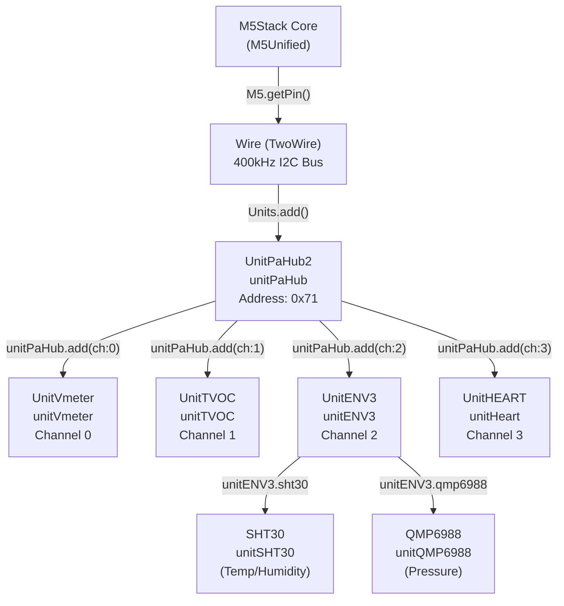
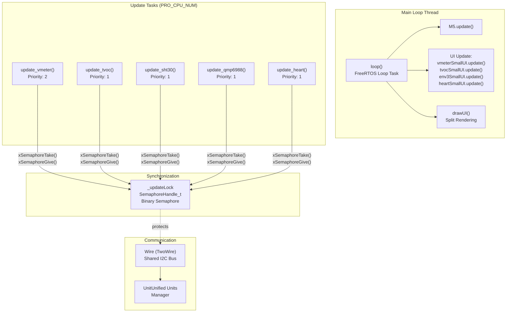
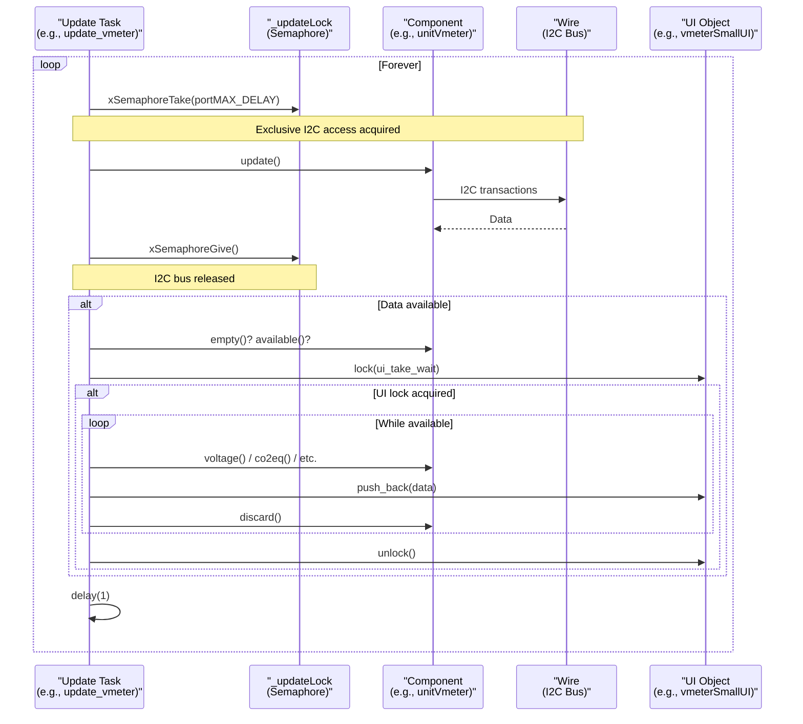
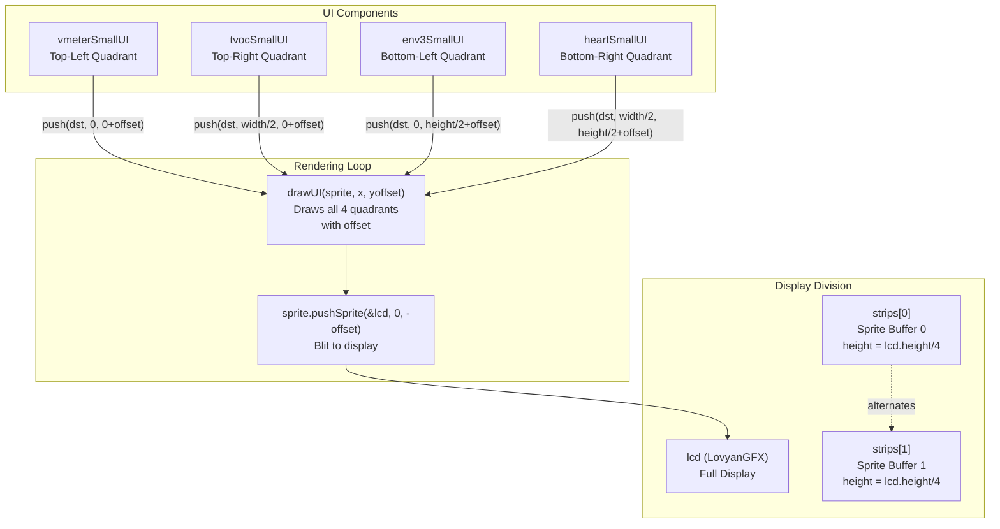
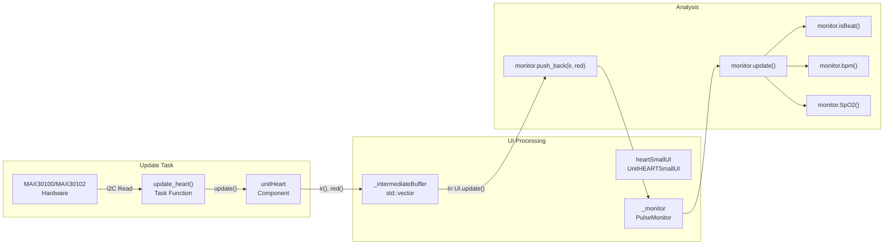
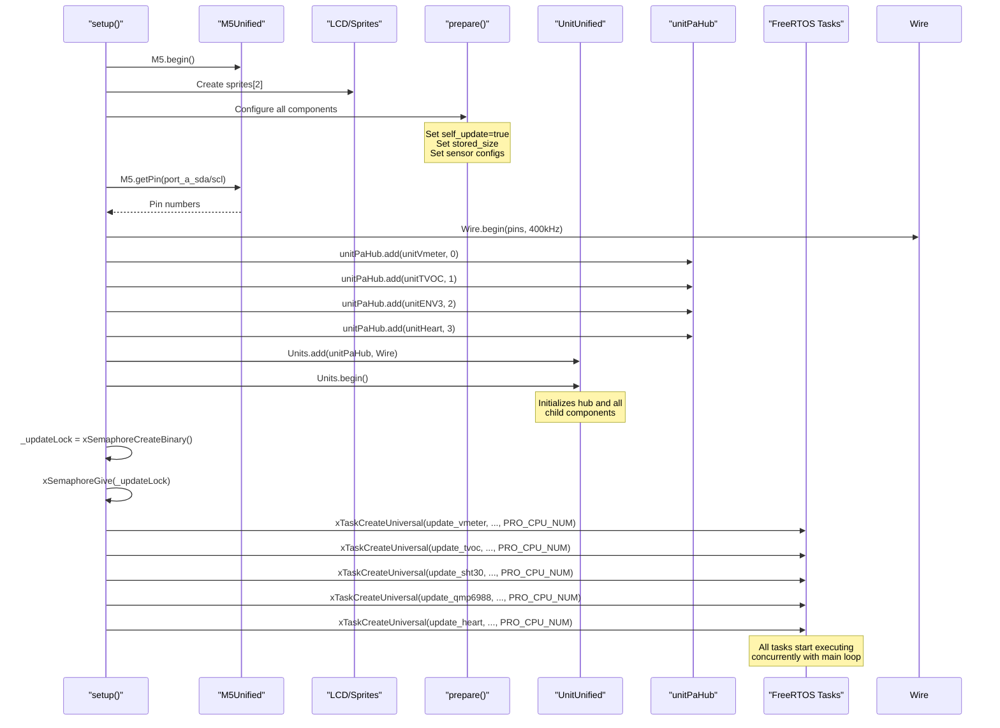

M5UnitUnified Multiple Units Demo

# Multiple Units Demo

<details>
<summary>Relevant source files</summary>

The following files were used as context for generating this wiki page:

- [examples/demo/MultipleUnits/main/MultipleUnits.cpp](examples/demo/MultipleUnits/main/MultipleUnits.cpp)
- [examples/demo/MultipleUnits/src/ui/ui_UnitHEART.cpp](examples/demo/MultipleUnits/src/ui/ui_UnitHEART.cpp)
- [examples/demo/MultipleUnits/src/ui/ui_UnitHEART.hpp](examples/demo/MultipleUnits/src/ui/ui_UnitHEART.hpp)

</details>


## Purpose and Scope

This page documents the **MultipleUnits** demonstration application, which showcases advanced usage patterns of M5UnitUnified with multiple sensor units connected through a hub. This example demonstrates concurrent sensor updates using FreeRTOS tasks, semaphore-based synchronization, circular buffer management, and split-screen UI rendering.

For basic usage with a single unit, see [Simple Pattern](#5.1). For self-update configuration without multiple units, see [Self-Update Pattern](#5.3). For hub topology concepts, see [Parent-Child Hierarchies](#3.4).

**Sources:** [examples/demo/MultipleUnits/main/MultipleUnits.cpp:1-16]()

---

## Hardware Configuration

The demo requires the following hardware setup:

| Component | Model | Connection | Purpose |
|-----------|-------|------------|---------|
| Core | Any M5Stack Core with LCD | - | Main controller and display |
| Hub | UnitPaHub2 (0x71) | Port A (I2C) | I2C multiplexer for 4 channels |
| Channel 0 | UnitVmeter | PaHub2 Ch 0 | Voltage measurement (ADS1115) |
| Channel 1 | UnitTVOC | PaHub2 Ch 1 | TVOC/CO2 sensor (SGP30) |
| Channel 2 | UnitENV3 | PaHub2 Ch 2 | Temperature/Humidity/Pressure (SHT30, QMP6988) |
| Channel 3 | UnitHEART | PaHub2 Ch 3 | Heart rate/SpO2 sensor (MAX30100/MAX30102) |

**Important:** The PaHub2 default address is 0x70, but this demo uses 0x71 to avoid conflicts. The register must be changed physically on the hardware (see [M5Stack PaHub2 documentation](https://docs.m5stack.com/en/unit/pahub2)).



**Sources:** [examples/demo/MultipleUnits/main/MultipleUnits.cpp:9-15](), [examples/demo/MultipleUnits/main/MultipleUnits.cpp:44-52](), [examples/demo/MultipleUnits/main/MultipleUnits.cpp:356-373]()

---

## System Architecture

### Component and Task Organization

The demo creates a separate FreeRTOS task for each sensor (or sub-sensor), allowing concurrent updates without blocking the main loop. All tasks share a single I2C bus protected by a binary semaphore.



**Sources:** [examples/demo/MultipleUnits/main/MultipleUnits.cpp:59-60](), [examples/demo/MultipleUnits/main/MultipleUnits.cpp:386-392](), [examples/demo/MultipleUnits/main/MultipleUnits.cpp:395-432]()

### Self-Update Configuration

Each component is configured with `self_update = true`, which prevents `UnitUnified::update()` from automatically calling their `update()` methods. Instead, dedicated tasks handle updates independently.

| Component | Stored Size | Update Rate | Configuration Lines |
|-----------|-------------|-------------|---------------------|
| `unitVmeter` | 64 samples | 64 mps (ADS111x::Rate64) | [65-76]() |
| `unitTVOC` | 10 samples | 10 mps (interval: 100ms) | [78-88]() |
| `unitSHT30` | 10 samples | 10 mps (MPS::Ten) | [91-100]() |
| `unitQMP6988` | 16 samples | ~16 mps (Standby::Time50ms) | [102-112]() |
| `unitHeart` | 160 samples | Depends on MAX30100 config | [115-119]() |

**Configuration Pattern:**
```cpp
// Set self_update and stored_size
auto ccfg = unitVmeter.component_config();
ccfg.self_update = true;  // Don't auto-update in Units.update()
ccfg.stored_size = 64;    // Circular buffer capacity
unitVmeter.component_config(ccfg);

// Set sensor-specific parameters
auto cfg = unitVmeter.config();
cfg.rate = m5::unit::ads111x::Sampling::Rate64;
unitVmeter.config(cfg);
```

**Sources:** [examples/demo/MultipleUnits/main/MultipleUnits.cpp:62-127]()

---

## Concurrency and Synchronization

### Semaphore-Based I2C Protection

Since all sensors share the same I2C bus (`Wire`), a binary semaphore (`_updateLock`) ensures mutual exclusion during sensor updates. Each task follows this pattern:



**Sources:** [examples/demo/MultipleUnits/main/MultipleUnits.cpp:130-165](), [examples/demo/MultipleUnits/main/MultipleUnits.cpp:386-387]()

### UI Lock Mechanism

UI objects have their own lock mechanism (inherited from `UnitUIBase`) to prevent race conditions when passing data from update tasks to the main rendering thread:

```cpp
if (vmeterSmallUI.lock(ui_take_wait)) {  // ui_take_wait = 0 (non-blocking)
    // Transfer data to UI's intermediate buffer
    while (unitVmeter.available()) {
        vmeterSmallUI.push_back(unitVmeter.voltage());
        unitVmeter.discard();  // Remove oldest from circular buffer
    }
    vmeterSmallUI.unlock();
}
```

If the UI is locked (main thread is rendering), the task skips data transfer and continues. This prevents blocking the update task.

**Sources:** [examples/demo/MultipleUnits/main/MultipleUnits.cpp:60](), [examples/demo/MultipleUnits/main/MultipleUnits.cpp:143-151]()

---

## Data Flow Architecture

### Circular Buffer and Intermediate Storage

The system uses a two-stage buffering approach:

1. **Component Circular Buffer**: Stores sensor readings in the component itself (configured via `stored_size`)
2. **UI Intermediate Buffer**: Temporary storage in UI objects to decouple update tasks from rendering

```mermaid
graph LR
    subgraph "Update Task"
        Sensor["Sensor Hardware"]
        UpdateFunc["update()<br/>(in task)"]
        CircBuffer["Component<br/>Circular Buffer<br/>(stored_size)"]
    end
    
    subgraph "Data Transfer"
        AvailCheck["available()<br/>discard()"]
        GetData["voltage()<br/>co2eq()<br/>temperature()"]
    end
    
    subgraph "UI Object"
        IntermBuffer["_intermediateBuffer<br/>std::vector<Data>"]
        UILock["lock()/unlock()"]
    end
    
    subgraph "Main Loop"
        UIUpdate["UI.update()"]
        Process["Process buffered data"]
        UIRender["UI.push(dst, x, y)"]
    end
    
    Sensor -->|"I2C Read"| UpdateFunc
    UpdateFunc -->|"New data"| CircBuffer
    CircBuffer -->|"oldest()"| AvailCheck
    AvailCheck -->|"If available"| GetData
    GetData -->|"Through lock"| UILock
    UILock -->|"push_back()"| IntermBuffer
    IntermBuffer -->|"Called by main loop"| UIUpdate
    UIUpdate --> Process
    Process --> UIRender
```



**Example: UnitVmeter Data Flow**

1. **Task side** [examples/demo/MultipleUnits/main/MultipleUnits.cpp:136-151]():
   ```cpp
   xSemaphoreTake(_updateLock, portMAX_DELAY);
   unitVmeter.update();  // Stores in circular buffer
   xSemaphoreGive(_updateLock);
   
   if (!unitVmeter.empty()) {
       if (vmeterSmallUI.lock(ui_take_wait)) {
           while (unitVmeter.available()) {
               vmeterSmallUI.push_back(unitVmeter.voltage());
               unitVmeter.discard();
           }
           vmeterSmallUI.unlock();
       }
   }
   ```

2. **Main loop side** [examples/demo/MultipleUnits/main/MultipleUnits.cpp:416-419]():
   ```cpp
   vmeterSmallUI.update();  // Processes _intermediateBuffer
   // ... later ...
   vmeterSmallUI.push(&lcd, x, y);  // Renders to screen
   ```

**Sources:** [examples/demo/MultipleUnits/main/MultipleUnits.cpp:66-69](), [examples/demo/MultipleUnits/main/MultipleUnits.cpp:143-151](), [examples/demo/MultipleUnits/src/ui/ui_UnitHEART.hpp:48-51]()

---

## UI Rendering System

### Split-Screen Sprite Rendering

The demo uses a split-screen rendering technique with double-buffered sprites to handle large displays efficiently:



**Rendering Algorithm** [examples/demo/MultipleUnits/main/MultipleUnits.cpp:421-431]():

```cpp
static uint32_t current{};
int32_t offset{};
uint32_t cnt{SPLIT_NUM};  // SPLIT_NUM = 4
while (cnt--) {
    auto& spr = strips[current];
    spr.clear();
    drawUI(spr, 0, offset);           // Draw with vertical offset
    spr.pushSprite(&lcd, 0, -offset); // Blit with negative offset
    current ^= 1;                     // Alternate buffers
    offset -= strip_height;           // Move down
}
```

This technique:
- Reduces memory usage (only 1/4 of screen height in sprites)
- Enables smooth rendering without flicker (double buffering)
- Allows PSRAM-free operation on devices with limited SRAM

**Sources:** [examples/demo/MultipleUnits/main/MultipleUnits.cpp:39-42](), [examples/demo/MultipleUnits/main/MultipleUnits.cpp:345-352](), [examples/demo/MultipleUnits/main/MultipleUnits.cpp:421-431]()

### UI Component Layout

Each UI component occupies one quadrant of the display:

| Component | Position | Content | File |
|-----------|----------|---------|------|
| `vmeterSmallUI` | (0, 0) | Voltage plot, current reading | [ui_UnitVmeter.hpp]() |
| `tvocSmallUI` | (width/2, 0) | CO2eq/TVOC plots, readings | [ui_UnitTVOC.hpp]() |
| `env3SmallUI` | (0, height/2) | Temperature/Humidity/Pressure | [ui_UnitENV3.hpp]() |
| `heartSmallUI` | (width/2, height/2) | IR/SpO2 plots, BPM, heart icon | [ui_UnitHEART.hpp]() |

**Sources:** [examples/demo/MultipleUnits/main/MultipleUnits.cpp:330-336](), [examples/demo/MultipleUnits/main/MultipleUnits.cpp:54-57]()

---

## Heart Rate Monitor Integration

The `UnitHEART` component uses a specialized `PulseMonitor` class for real-time heart rate and SpO2 calculation. This demonstrates advanced sensor data processing:



**Key Methods** [examples/demo/MultipleUnits/src/ui/ui_UnitHEART.cpp:52-74]():

- `monitor.push_back(ir, red)`: Feed raw IR/Red LED data
- `monitor.update()`: Process data for beat detection
- `monitor.isBeat()`: Returns true on heartbeat detection
- `monitor.bpm()`: Current beats per minute
- `monitor.SpO2()`: Blood oxygen saturation percentage
- `monitor.latestIR()`: Filtered IR signal for plotting

The `PulseMonitor` is configured with the sensor's sampling rate [examples/demo/MultipleUnits/main/MultipleUnits.cpp:126]():
```cpp
heartSmallUI.monitor().setSamplingRate(
    m5::unit::max30100::getSamplingRate(unitHeart.config().sampling_rate)
);
```

**Sources:** [examples/demo/MultipleUnits/src/ui/ui_UnitHEART.hpp:24-27](), [examples/demo/MultipleUnits/src/ui/ui_UnitHEART.hpp:43-46](), [examples/demo/MultipleUnits/src/ui/ui_UnitHEART.cpp:46-74](), [examples/demo/MultipleUnits/main/MultipleUnits.cpp:126]()

---

## Setup and Initialization Sequence



**Initialization Steps** [examples/demo/MultipleUnits/main/MultipleUnits.cpp:339-393]():

1. **M5 and LCD Setup** (lines 341-352): Initialize M5Unified, create sprites
2. **Component Configuration** (line 354): Call `prepare()` to configure all units
3. **I2C Bus Setup** (lines 356-359): Get pins from M5Unified, initialize Wire at 400kHz
4. **Hub and Unit Registration** (lines 361-367): Add children to hub, add hub to manager, call `Units.begin()`
5. **Synchronization Setup** (lines 386-387): Create binary semaphore for I2C protection
6. **Task Creation** (lines 388-392): Launch 5 FreeRTOS tasks on PRO_CPU_NUM

**Sources:** [examples/demo/MultipleUnits/main/MultipleUnits.cpp:339-393]()

---

## Key Implementation Details

### TVOC Initialization Delay

The SGP30 sensor (UnitTVOC) requires a 15-second initialization period before periodic measurements can begin. The task handles this explicitly [examples/demo/MultipleUnits/main/MultipleUnits.cpp:173-183]():

```cpp
// Waiting for SGP30 to start periodic measurement (15sec)
for (;;) {
    if (unitTVOC.canMeasurePeriodic()) {
        break;
    }
    xSemaphoreTake(_updateLock, portMAX_DELAY);
    unitTVOC.update();
    xSemaphoreGive(_updateLock);
    m5::utility::delay(1000);
}
```

### Task Priority Assignment

Tasks are assigned different priorities based on their update rates [examples/demo/MultipleUnits/main/MultipleUnits.cpp:388-392]():

- **Priority 2**: `update_vmeter` (64 mps - highest rate)
- **Priority 1**: All other tasks (1-16 mps)

This ensures the high-frequency voltage measurements receive preferential scheduling.

### Data Retrieval Patterns

The demo demonstrates two data retrieval patterns:

**Pattern 1: Process all available data** (Vmeter, TVOC, Heart):
```cpp
while (unitVmeter.available()) {
    vmeterSmallUI.push_back(unitVmeter.voltage());
    unitVmeter.discard();  // Remove oldest
}
```

**Pattern 2: Get latest and flush** (SHT30, QMP6988):
```cpp
auto latest = unitSHT30.latest();  // Get most recent
env3SmallUI.sht30_push_back(latest.temperature(), latest.humidity());
unitSHT30.flush();  // Discard all buffered data
```

The second pattern is used for sensors where only the latest reading matters (temperature/pressure), while the first is used when all samples are valuable (voltage waveform, heart rate signal).

**Sources:** [examples/demo/MultipleUnits/main/MultipleUnits.cpp:143-151](), [examples/demo/MultipleUnits/main/MultipleUnits.cpp:232-239]()

---

## Performance Monitoring

Each task logs its update frequency every second [examples/demo/MultipleUnits/main/MultipleUnits.cpp:156-163]():

```cpp
++fcnt;  // Frame counter
auto now = m5::utility::millis();
if (now >= start_at + 1000) {
    mps = fcnt;  // Measurements per second
    M5_LOGD("Vmeter:%u (%u)", mps, mcnt);
    fcnt = mcnt = 0;
    start_at = now;
}
```

The main loop also tracks rendering FPS [examples/demo/MultipleUnits/main/MultipleUnits.cpp:397-407]():

```cpp
++fpsCnt;
if (now >= start_at + 1000) {
    fps = fpsCnt;
    M5_LOGD("FPS:%u", fps);
    fpsCnt = 0;
    start_at = now;
}
```

This allows developers to verify:
- Each sensor's actual update rate matches configuration
- Rendering performance remains smooth
- Total system throughput

**Sources:** [examples/demo/MultipleUnits/main/MultipleUnits.cpp:132-163](), [examples/demo/MultipleUnits/main/MultipleUnits.cpp:397-407]()

---

## Required Libraries

The demo includes headers for multiple M5Unit libraries:

```cpp
#include <M5UnitUnified.h>       // Core framework
#include <M5UnitUnifiedHUB.h>    // UnitPaHub2
#include <M5UnitUnifiedENV.h>    // UnitENV3, UnitTVOC
#include <M5UnitUnifiedMETER.h>  // UnitVmeter
#include <M5UnitUnifiedHEART.h>  // UnitHEART
```

All dependencies are managed through the PlatformIO configuration (see [PlatformIO Configuration](#6.1) for details on library dependency management).

**Sources:** [examples/demo/MultipleUnits/main/MultipleUnits.cpp:17-22]()