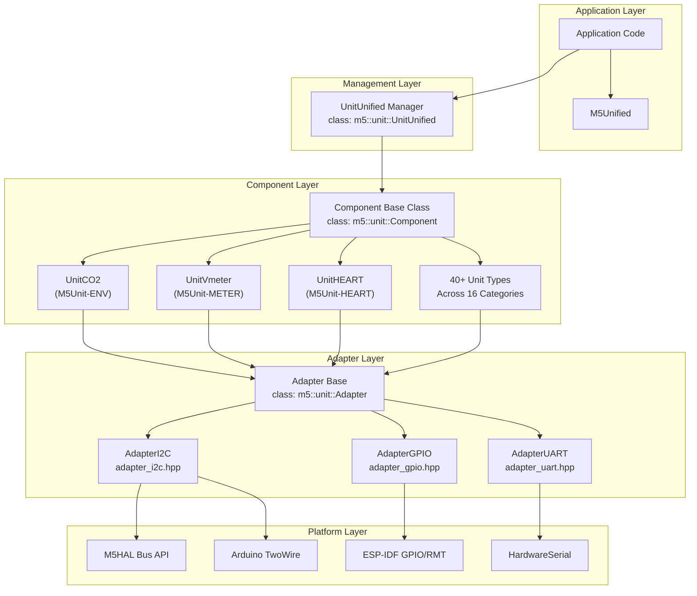
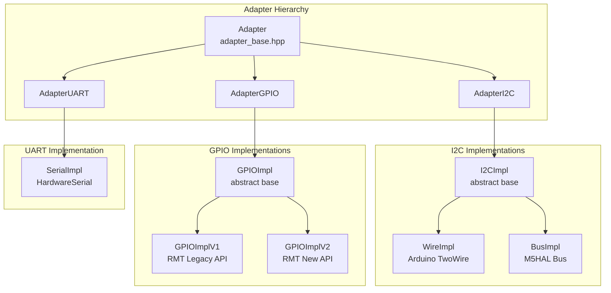
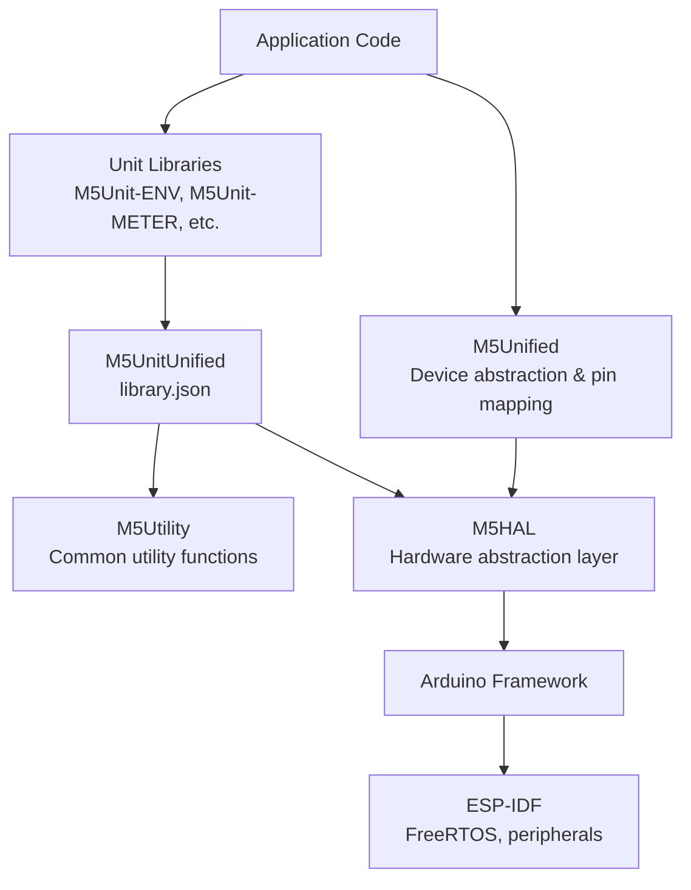

M5UnitUnified Overview

# Overview

Relevant source files

The following files were used as context for generating this wiki page:

- [README.ja.md](README.ja.md)
- [README.md](README.md)
- [library.json](library.json)
- [library.properties](library.properties)
- [platformio.ini](platformio.ini)
- [src/m5_unit_component/adapter_i2c.hpp](src/m5_unit_component/adapter_i2c.hpp)

This document introduces M5UnitUnified, a library for unified management of M5Stack sensor and peripheral units. It covers the library's purpose, core architecture, and key features. For installation instructions, see [Getting Started](#2). For detailed architecture patterns, see [Core Architecture](#3). For specific communication protocol details, see [Communication Protocols](#4).

## Purpose and Scope

M5UnitUnified provides a unified interface for managing diverse M5Stack peripheral units across different communication protocols. The library addresses three fundamental challenges in the M5Stack ecosystem:

- **API Fragmentation**: Each unit library historically used different API designs and naming conventions
- **Communication Inconsistency**: Units required different initialization patterns and communication abstractions
- **License Heterogeneity**: External libraries used mixed licensing schemes

M5UnitUnified standardizes these aspects through a component-based architecture with protocol-agnostic adapters, enabling applications to handle multiple units through a consistent interface. All code is released under the MIT license.

**Sources:** [README.md:1-26](), [library.json:1-31](), [library.properties:1-11]()

## System Architecture

The library implements a three-layer architecture consisting of management, component, and adapter layers:

**Sources:** [README.md:11-26](), [platformio.ini:1-28](), [src/m5_unit_component/adapter_i2c.hpp:1-247]()

## Key Features

### Unified Lifecycle Management

The `m5::unit::UnitUnified` manager class orchestrates the complete lifecycle of registered units:

| Phase | Method | Description |
|-------|--------|-------------|
| Registration | `add(Component&, ...)` | Attach unit components to the manager with their communication adapters |
| Initialization | `begin()` | Initialize all registered units and verify communication |
| Update | `update()` | Poll all units for new measurements based on their update intervals |
| Debugging | `dump()`, `dumpFormat()` | Output diagnostic information about registered units |

The manager automatically handles update orchestration, allowing applications to call a single `Units.update()` instead of managing individual unit polling loops.

**Sources:** [README.md:49-83]()

### Component-Based Unit Abstraction

All unit classes inherit from `m5::unit::Component`, providing standardized interfaces:

- **Lifecycle Methods**: `begin()`, `update()`, `updated()`
- **Identification**: Static `uid()`, `name()`, `attr()` members for unit metadata
- **Configuration**: `component_config()` for runtime behavior control
- **Communication**: Protocol-agnostic adapter access via `adapter()`

This inheritance enables polymorphic handling of diverse sensor types through a common base interface.

**Sources:** [README.md:14-21]()

### Protocol-Agnostic Adapters

The adapter pattern abstracts communication protocols through implementation classes:

This design enables runtime selection between Arduino and M5HAL backends, and automatic version detection for ESP-IDF peripheral APIs (e.g., RMT v1 vs v2).

**Sources:** [src/m5_unit_component/adapter_i2c.hpp:22-247](), [README.md:188-192]()

## Communication Protocol Support

M5UnitUnified supports three communication protocols with dual implementation paths where applicable:

| Protocol | Adapter Class | Implementations | Primary Use Cases |
|----------|--------------|-----------------|-------------------|
| I2C | `AdapterI2C` | `WireImpl` (Arduino TwoWire) `BusImpl` (M5HAL Bus) | Environmental sensors, displays, IMUs, ADCs |
| GPIO | `AdapterGPIO` | `GPIOImplV1` (RMT Legacy) `GPIOImplV2` (RMT New) | Digital I/O, PWM, pulse timing sensors |
| UART | `AdapterUART` | `SerialImpl` (HardwareSerial) | Fingerprint readers, GPS modules, serial devices |

The I2C adapter supports both 7-bit addressing and clock configuration. GPIO adapters automatically select the appropriate RMT API version based on ESP-IDF version at compile time. See [Communication Protocols](#4) for implementation details.

**Sources:** [README.md:188-192](), [src/m5_unit_component/adapter_i2c.hpp:100-171]()

## Supported Unit Categories

The library provides unified interfaces for 40+ individual unit types across 16 categories:

- **Environmental**: SCD40, SHT30, BME688, DLight, TVOC (M5Unit-ENV)
- **Measurement**: ADS1115, Vmeter, Ammeter, KMeter (M5Unit-METER)
- **Hub**: PaHub2 for I2C multiplexing (M5Unit-HUB)
- **Biometric**: MAX30100, MAX30102 heart rate/SpO2 (M5Unit-HEART)
- **Gesture Recognition**: PAJ7620U2 (M5Unit-GESTURE)
- **Distance/ToF**: VL53L0X, VL53L1X (M5Unit-TOF)
- **Additional Categories**: WEIGHT, COLOR, THERMO, RFID, KEYBOARD, FINGER, TUBE, and more

Each unit category is distributed as a separate library (e.g., `M5Unit-ENV`, `M5Unit-METER`) with dependencies automatically resolved through library managers.

**Sources:** [README.md:194](), [platformio.ini:13-16](), [platformio.ini:160-340]()

## Platform and Framework Support

### Target Platforms

- **Framework**: Arduino
- **Platform**: ESP32 (espressif32)
- **ESP-IDF**: Versions 5.x and 6.x with conditional compilation for peripheral API changes

### Supported M5Stack Devices

The library supports 14 M5Stack device families through PlatformIO build configurations:

| Device Family | Board Configurations | Notes |
|--------------|---------------------|-------|
| M5Stack Core | Core, Core2, CoreS3 | Full-featured development boards |
| M5Atom | AtomMatrix, AtomS3, AtomS3R | Compact form factor |
| M5StickC | StickCPlus, StickCPlus2 | Portable stick format |
| Specialized | Fire, Dial, Paper, CoreInk, StampS3, NanoC6 | Domain-specific devices |

Custom board definitions for AtomS3R and NanoC6 are provided in `boards/*.json` files. The NanoC6 requires ESP32-C6 platform packages.

**Sources:** [platformio.ini:30-110](), [library.properties:9](), [README.md:183-186]()

## Dependency Stack

Dependencies are declared in [library.json:13-16]() and automatically resolved by Arduino Library Manager or PlatformIO. The library requires:

- `M5Utility`: Common helper functions and macros
- `M5HAL`: Hardware abstraction for I2C bus operations
- `M5Unified`: Device detection and pin configuration (application-level dependency)

**Sources:** [library.json:13-16](), [platformio.ini:13-15]()

## Development Status

**Current Version**: 0.2.0 (Alpha Release)

The library is in active alpha development with the following characteristics:

- **API Stability**: Core interfaces are established but may undergo breaking changes
- **Unit Coverage**: 40+ unit types implemented with ongoing additions
- **Testing**: GoogleTest framework with embedded hardware validation
- **Documentation**: Doxygen-generated API reference published at https://m5stack.github.io/M5UnitUnified/

Users should anticipate potential API changes and report issues or feature requests through the GitHub repository. See [Contributing](#8.3) for participation guidelines.

**Sources:** [library.json:17](), [README.md:8-9](), [README.md:200-217]()

## Usage Patterns

M5UnitUnified supports three operational patterns:

1. **Standard Pattern**: Units managed by `UnitUnified` with automatic update orchestration (see [Simple Pattern](#5.1))
2. **Component-Only Pattern**: Direct component management without manager overhead (see [Component-Only Pattern](#5.2))
3. **Self-Update Pattern**: Asynchronous updates via FreeRTOS tasks for high-frequency sensors (see [Self-Update Pattern](#5.3))

For complete examples demonstrating these patterns with multiple units and hub configurations, see [Multiple Units Demo](#5.4).

**Sources:** [README.md:45-180]()

## Build Infrastructure

The project uses PlatformIO with a hierarchical configuration generating 70+ build environments through combinatorial matrix expansion:

- **Base Configuration**: `[env]` and `[m5base]` sections define global settings
- **Device Configurations**: 14 board-specific sections inherit from `[m5base]`
- **Build Options**: Release, log, debug, and map configurations
- **Example Environments**: Cross-product of devices, examples, and build options

This architecture enables comprehensive cross-device validation. See [Build System](#6) for configuration details.

**Sources:** [platformio.ini:1-354]()