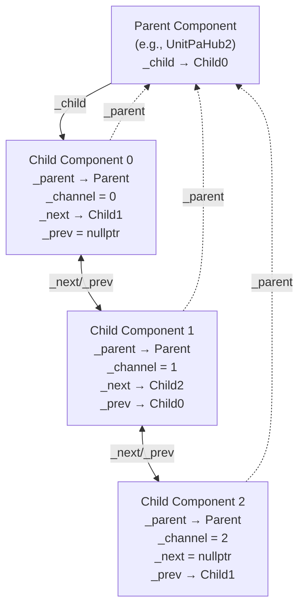
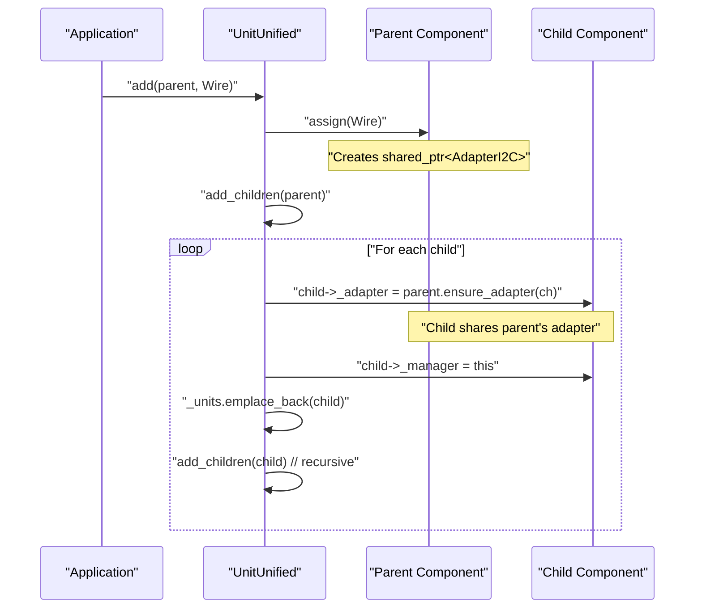
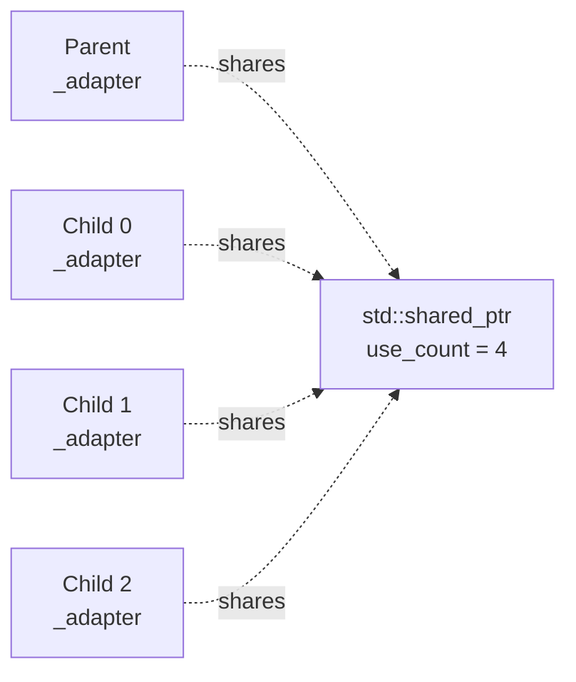
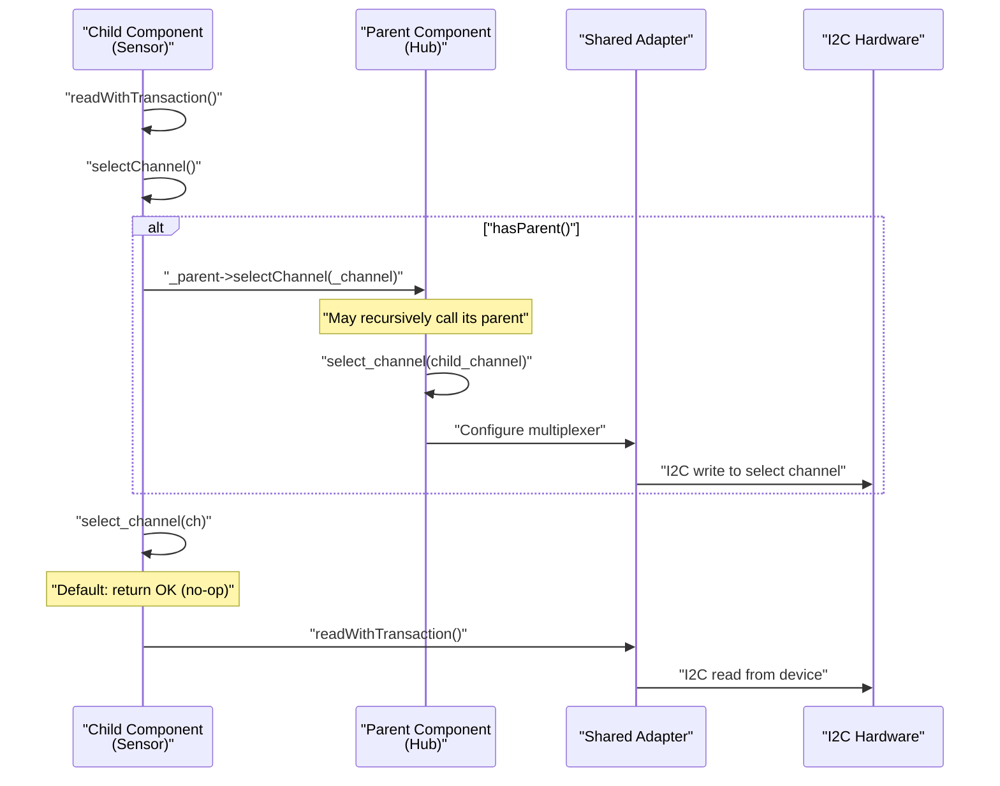
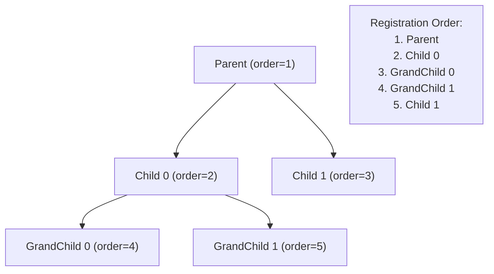
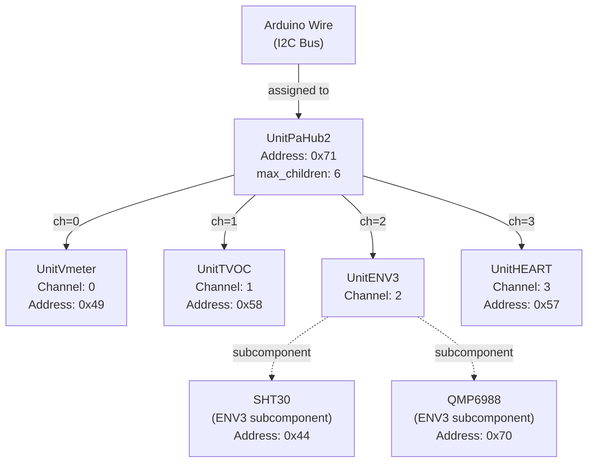

M5UnitUnified Parent-Child Hierarchies

# Parent-Child Hierarchies

<details>
<summary>Relevant source files</summary>

The following files were used as context for generating this wiki page:

- [examples/demo/MultipleUnits/main/MultipleUnits.cpp](examples/demo/MultipleUnits/main/MultipleUnits.cpp)
- [examples/demo/MultipleUnits/src/ui/ui_UnitHEART.cpp](examples/demo/MultipleUnits/src/ui/ui_UnitHEART.cpp)
- [examples/demo/MultipleUnits/src/ui/ui_UnitHEART.hpp](examples/demo/MultipleUnits/src/ui/ui_UnitHEART.hpp)
- [src/M5UnitComponent.cpp](src/M5UnitComponent.cpp)
- [src/M5UnitComponent.hpp](src/M5UnitComponent.hpp)
- [src/M5UnitUnified.cpp](src/M5UnitUnified.cpp)
- [src/M5UnitUnified.hpp](src/M5UnitUnified.hpp)
- [src/m5_unit_component/adapter_base.hpp](src/m5_unit_component/adapter_base.hpp)
- [src/m5_unit_component/adapter_gpio_v1.hpp](src/m5_unit_component/adapter_gpio_v1.hpp)
- [src/m5_unit_component/adapter_i2c.cpp](src/m5_unit_component/adapter_i2c.cpp)

</details>


This document explains how M5UnitUnified enables hub topologies where one device (parent) connects multiple child devices through channel multiplexing. This architecture allows efficient bus sharing and supports multi-level device trees such as sensor → hub → hub → M5Stack.

For information about the Component base class itself, see [Component System](#3.1). For adapter implementation details, see [Adapter Pattern](#3.3). For registration and lifecycle management, see [UnitUnified Manager](#3.2).

## Overview

Parent-child hierarchies enable **hub devices** (such as PaHub2) to connect multiple units to a single communication bus. Each child is assigned to a specific channel on the parent hub, and all children share the parent's adapter instance. When a child needs to communicate, the system recursively selects the appropriate channels through the entire parent chain before performing I/O operations.

**Sources:** [src/M5UnitComponent.hpp:233-272](), [src/M5UnitComponent.cpp:62-111]()

## Linked List Structure

### Component Relationship Pointers

The `Component` class maintains four raw pointers that form a doubly-linked list structure for parent-child relationships:

| Pointer | Type | Purpose |
|---------|------|---------|
| `_parent` | `Component*` | Points to the parent component (hub) |
| `_child` | `Component*` | Points to the first child in the linked list |
| `_next` | `Component*` | Points to the next sibling |
| `_prev` | `Component*` | Points to the previous sibling |

Additionally, each component stores a `_channel` member (type `int16_t`) indicating which channel it occupies on its parent hub. Valid channels are `[0...]`, and `-1` indicates no parent connection.

**Sources:** [src/M5UnitComponent.hpp:581-586]()

### Hierarchical Structure Diagram



**Sources:** [src/M5UnitComponent.hpp:581-586](), [src/M5UnitComponent.cpp:89-111]()

### Query Methods

The Component class provides several methods to inspect the hierarchy:

```cpp
bool hasParent() const;        // Returns true if _parent != nullptr
bool hasSiblings() const;      // Returns true if _prev or _next exist
bool hasChildren() const;      // Returns true if _child != nullptr
size_t childrenSize() const;   // Counts children by iterating the linked list
bool existsChild(uint8_t ch);  // Checks if a child exists at channel ch
Component* child(uint8_t ch);  // Returns child at specified channel
```

**Sources:** [src/M5UnitComponent.hpp:236-267](), [src/M5UnitComponent.cpp:28-123]()

## Adapter Sharing

### Shared Adapter Mechanism

Children do not create their own adapters. Instead, they share their parent's adapter via `std::shared_ptr<Adapter>`. This design:
- Reduces memory usage (one adapter serves multiple units)
- Ensures all children use the same communication configuration
- Enables proper reference counting and lifetime management

The sharing mechanism uses the virtual `ensure_adapter()` method:

```cpp
// Component base class default implementation
virtual std::shared_ptr<Adapter> ensure_adapter(const uint8_t ch)
{
    return _adapter;  // By default, offer my adapter for sharing
}
```

Hub implementations can override this to provide channel-specific adapters or validate channel numbers.

**Sources:** [src/M5UnitComponent.hpp:526-529](), [src/M5UnitUnified.cpp:99-122]()

### Adapter Sharing During Registration

When `UnitUnified::add()` is called on a parent component, the manager recursively processes all children:



**Sources:** [src/M5UnitUnified.cpp:99-122]()

### Reference Counting Example

When a parent has three children, the adapter's reference count becomes 4 (1 parent + 3 children):



**Sources:** [src/M5UnitUnified.cpp:111-112]()

## Channel Selection

### Recursive Selection Mechanism

Before any communication operation, the child must ensure its channel (and all ancestor channels) are selected. The `selectChannel()` method implements this recursively:

```cpp
bool Component::selectChannel(const uint8_t ch)
{
    bool ret{true};
    if (hasParent()) {
        ret = _parent->selectChannel(channel());  // Recursive call up the chain
    }
    return ret && (select_channel(ch) == m5::hal::error::error_t::OK);
}
```

This ensures that for a deeply nested hierarchy (e.g., Sensor → Hub2 → Hub1 → Core), all intermediate channels are properly configured.

**Sources:** [src/M5UnitComponent.cpp:157-164]()

### Channel Selection Flow



**Sources:** [src/M5UnitComponent.cpp:157-177](), [src/M5UnitComponent.hpp:532-535]()

### Virtual select_channel() Hook

Hub implementations override the virtual `select_channel()` method to configure their multiplexer:

```cpp
// In hub implementation (e.g., UnitPaHub2)
virtual m5::hal::error::error_t select_channel(const uint8_t ch) override
{
    // Write to hub register to select channel ch
    return writeRegister8(CONTROL_REGISTER, 1 << ch) 
           ? m5::hal::error::error_t::OK 
           : m5::hal::error::error_t::I2C_BUS_ERROR;
}
```

The base `Component` class provides a default no-op implementation that simply returns `OK`.

**Sources:** [src/M5UnitComponent.hpp:532-535]()

## Adding Children to Parents

### The add() Method

Components use the `add()` method to establish parent-child relationships **before** registration with `UnitUnified`:

```cpp
bool Component::add(Component& c, const int16_t ch)
```

This method performs validation and calls the private `add_child()` helper:

**Validation Checks:**

| Check | Condition | Error Message |
|-------|-----------|---------------|
| Child limit | `childrenSize() >= max_children` | "Can't connect any more" |
| Channel occupied | `existsChild(ch)` | "Already connected an other unit at channel:X" |
| Parent registered | `isRegistered()` | "Parent already registered with UnitUnified" |
| Child registered | `c.isRegistered()` | "Children already registered with UnitUnified" |

**Sources:** [src/M5UnitComponent.cpp:62-87]()

### Adding Children Implementation

The `add_child()` method appends to the linked list:

```cpp
bool Component::add_child(Component* c)
{
    // Validation: child must be clean (no existing relationships)
    if (!c || c->_parent || c->_prev || c->_next) {
        return false;
    }
    
    // Add to tail
    if (!_child) {
        _child = c;  // First child
    } else {
        auto last = _child;
        while (last->_next) {
            last = last->_next;
        }
        last->_next = c;
        c->_prev = last;
    }
    
    c->_parent = this;
    return true;
}
```

**Sources:** [src/M5UnitComponent.cpp:89-111]()

### Max Children Configuration

The maximum number of children is specified in `component_config_t`:

```cpp
struct component_config_t {
    uint8_t max_children{0};  // Maximum number of units that can be connected
    // ... other fields
};
```

Hub implementations must set this appropriately in their configuration or constructor.

**Sources:** [src/M5UnitComponent.hpp:41-50]()

## UnitUnified Registration

### Recursive Registration Process

When a parent component is added to `UnitUnified`, the manager recursively registers all children:

```cpp
bool UnitUnified::add_children(Component& u)
{
    auto it = u.childBegin();
    while (it != u.childEnd()) {
        auto ch = it->channel();
        
        // Set manager and share adapter
        it->_manager = this;
        it->_adapter = u.ensure_adapter(ch);
        it->_order = ++_registerCount;
        _units.emplace_back(&*it);
        
        // Recursively add grandchildren
        if (!add_children(*it)) {
            return false;
        }
        ++it;
    }
    return true;
}
```

**Sources:** [src/M5UnitUnified.cpp:99-122]()

### Registration Order

Components are registered in a depth-first order:



The `_order` field tracks registration sequence and is used by `UnitUnified::update()` to process units in the correct order.

**Sources:** [src/M5UnitUnified.cpp:33-34](), [src/M5UnitUnified.cpp:111-113]()

### Child Iterator

Components provide forward iterators to traverse children:

```cpp
child_iterator childBegin() noexcept;
child_iterator childEnd() noexcept;
```

The iterator implementation uses the `_next` pointer to traverse the linked list:

```cpp
template <typename T>
class iterator {
    // ...
    iterator& operator++() {
        _ptr = _ptr ? _ptr->_next : nullptr;
        return *this;
    }
};
```

**Sources:** [src/M5UnitComponent.hpp:275-337]()

## Practical Example: PaHub2 with Multiple Units

### Connection Topology

The MultipleUnits example demonstrates a complete parent-child hierarchy:



**Sources:** [examples/demo/MultipleUnits/main/MultipleUnits.cpp:44-52]()

### Code Example

```cpp
// Create components
UnitPaHub2 unitPaHub{0x71};
UnitVmeter unitVmeter;
UnitTVOC unitTVOC;
UnitENV3 unitENV3;
UnitHEART unitHeart;

// Establish parent-child relationships
unitPaHub.add(unitVmeter, 0);  // Vmeter on channel 0
unitPaHub.add(unitTVOC, 1);    // TVOC on channel 1
unitPaHub.add(unitENV3, 2);    // ENV3 on channel 2
unitPaHub.add(unitHeart, 3);   // HEART on channel 3

// Register with UnitUnified (will recursively add all children)
UnitUnified Units;
Units.add(unitPaHub, Wire);
Units.begin();
```

**Sources:** [examples/demo/MultipleUnits/main/MultipleUnits.cpp:361-366]()

### Communication Flow Example

When `unitVmeter.update()` is called:

1. `unitVmeter` calls `selectChannel()` internally
2. Since `hasParent()` is true, it calls `_parent->selectChannel(0)`
3. `unitPaHub` writes to its control register to select channel 0
4. The I2C multiplexer routes subsequent traffic to channel 0
5. `unitVmeter` performs I2C read/write operations through the shared adapter
6. The adapter directs traffic to address `0x49` via the selected channel

**Sources:** [src/M5UnitComponent.cpp:166-177]()

## Multi-Level Hierarchies

### Nested Hub Support

The architecture supports arbitrary nesting depth. For example:

```
Core (I2C Bus)
  └─ Hub1 (PaHub2)
      ├─ Sensor1 (ch=0)
      ├─ Hub2 (PaHub2, ch=1)
      │   ├─ Sensor2 (ch=0)
      │   └─ Sensor3 (ch=1)
      └─ Sensor4 (ch=2)
```

When `Sensor2` communicates:
1. Calls `selectChannel()` → Hub2.selectChannel(0) → Hub1.selectChannel(1) → Core (no parent)
2. Hub1 selects channel 1 (activating Hub2)
3. Hub2 selects channel 0 (activating Sensor2)
4. Sensor2 performs I/O operation

**Sources:** [src/M5UnitComponent.cpp:157-164]()

### Memory and Performance Considerations

**Memory:**
- Each adapter is shared, not duplicated
- Linked list uses raw pointers (8 bytes × 4 per component)
- All children share the same `std::shared_ptr`, increasing only the control block reference count

**Performance:**
- Channel selection requires O(depth) operations before each I/O
- Hub devices cache their selected channel to avoid redundant writes
- Recursive call overhead is minimal for typical depths (1-3 levels)

**Sources:** [src/M5UnitComponent.hpp:573](), [src/M5UnitUnified.cpp:111]()

## Debug Information

The `debugInfo()` method displays the hierarchy recursively:

```cpp
std::string UnitUnified::debugInfo() const
{
    std::string s = "M5UnitUnified: N units\n";
    for (auto&& u : _units) {
        if (!u->hasParent()) {
            s += make_unit_info(u, 0);  // Only print top-level units
        }
    }
    return s;
}

// Recursive helper
std::string make_unit_info(const Component* u, const uint8_t indent) const
{
    std::string s = format("%*c%s\n", indent * 4, ' ', u->debugInfo());
    
    if (u->hasChildren()) {
        s += make_unit_info(u->_child, indent + 1);
    }
    if (u->_next) {
        s += make_unit_info(u->_next, indent);
    }
    return s;
}
```

Output shows indented hierarchy with adapter details and reference counts.

**Sources:** [src/M5UnitUnified.cpp:146-166](), [src/M5UnitComponent.cpp:362-381]()