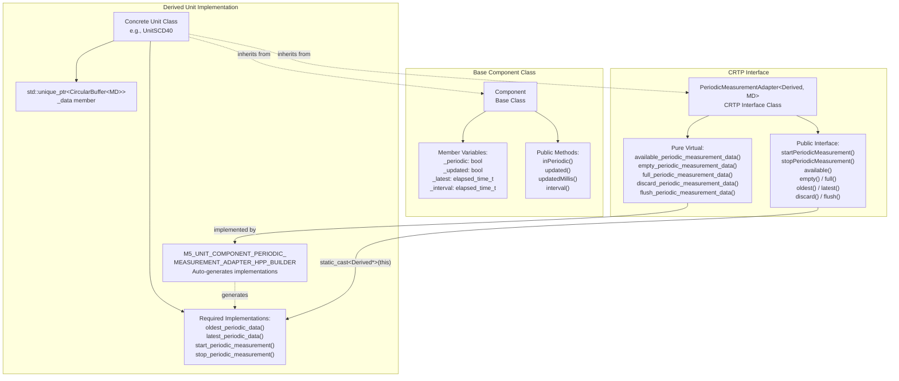
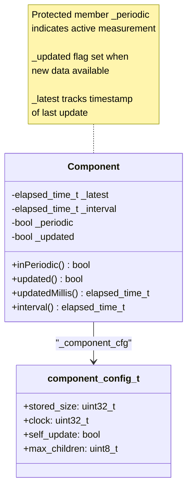
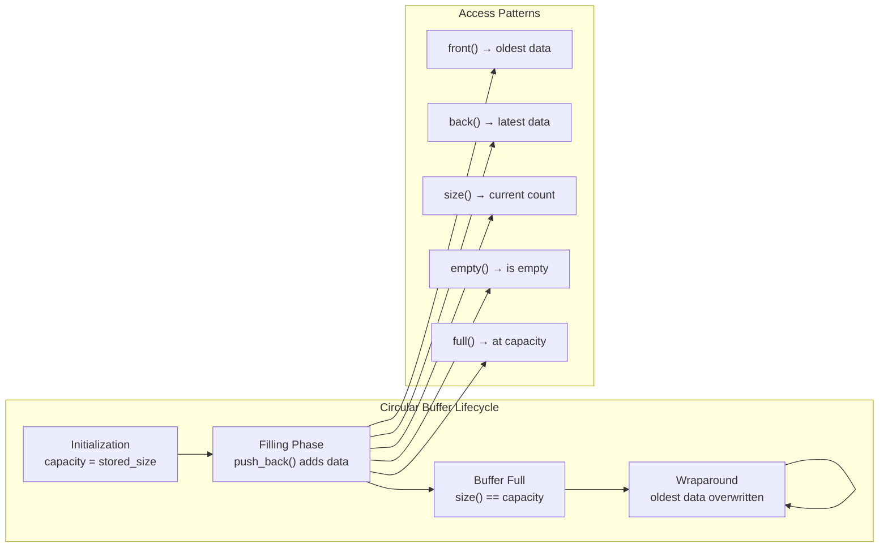
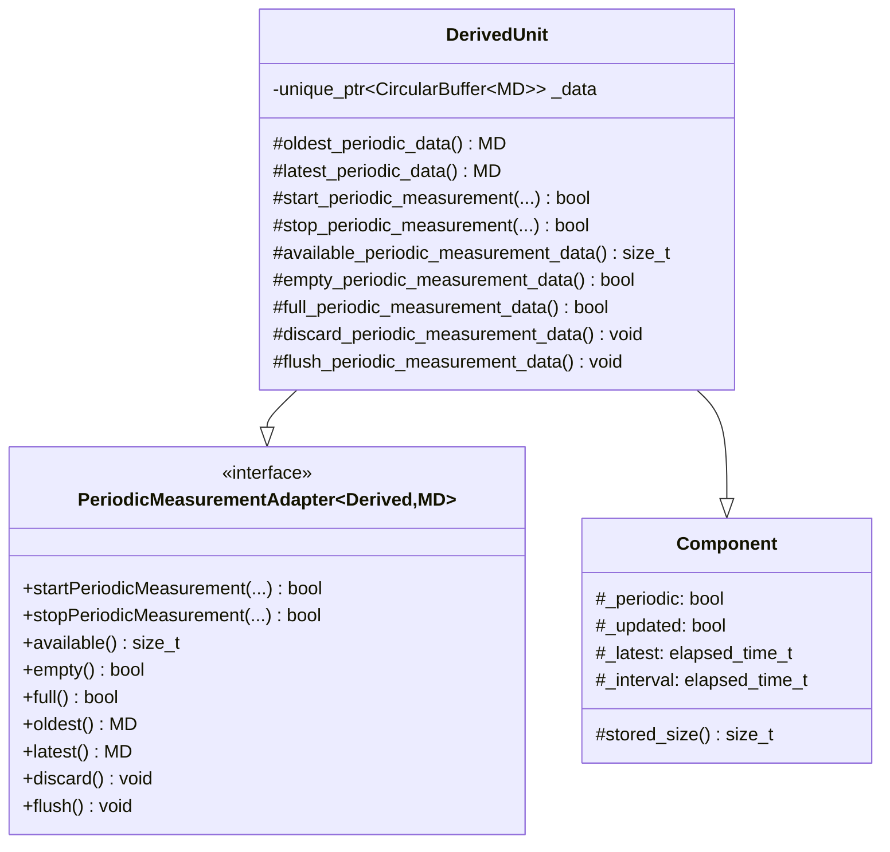
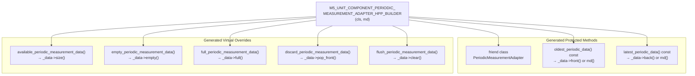
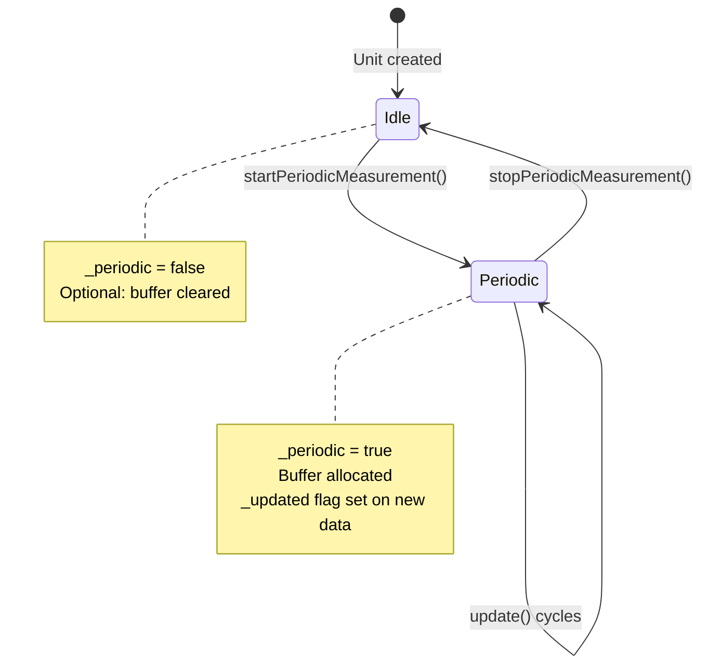
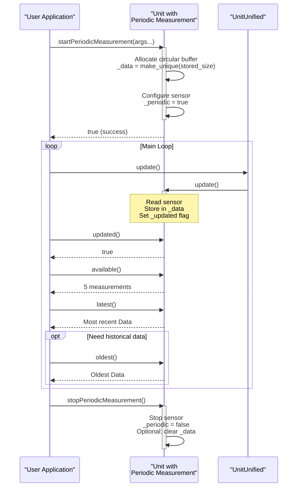
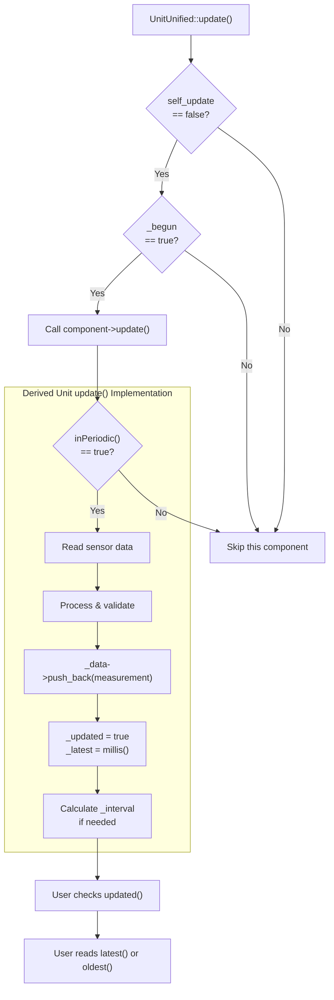

M5UnitUnified Periodic Measurement

# Periodic Measurement

<details>
<summary>Relevant source files</summary>

The following files were used as context for generating this wiki page:

- [src/M5UnitComponent.cpp](src/M5UnitComponent.cpp)
- [src/M5UnitComponent.hpp](src/M5UnitComponent.hpp)
- [src/M5UnitUnified.cpp](src/M5UnitUnified.cpp)
- [src/M5UnitUnified.hpp](src/M5UnitUnified.hpp)
- [src/m5_unit_component/adapter_base.hpp](src/m5_unit_component/adapter_base.hpp)
- [src/m5_unit_component/adapter_gpio_v1.hpp](src/m5_unit_component/adapter_gpio_v1.hpp)
- [src/m5_unit_component/adapter_i2c.cpp](src/m5_unit_component/adapter_i2c.cpp)

</details>


## Purpose and Scope

The Periodic Measurement system provides a standardized interface for M5Stack units that collect time-series sensor data at regular intervals. This system uses a CRTP (Curiously Recurring Template Pattern) adapter to enable efficient storage and retrieval of accumulated measurement data through a circular buffer mechanism. Units that implement this interface can store multiple readings and provide access to both the oldest and most recent measurements.

For information about the broader component lifecycle and update mechanisms, see [Component System](#3.1). For details on self-updating components that use FreeRTOS tasks, see [Self-Update Pattern](#5.3).

## Architecture Overview

The Periodic Measurement system consists of three primary components working together:



**Sources:** [src/M5UnitComponent.hpp:35-688]()

### CRTP Pattern Implementation

The `PeriodicMeasurementAdapter` uses the Curiously Recurring Template Pattern, where the derived class passes itself as a template parameter. This enables static polymorphism without the overhead of virtual function calls for the primary interface methods:

| Template Parameter | Purpose | Example |
|-------------------|---------|---------|
| `Derived` | The concrete unit class implementing periodic measurement | `UnitSCD40` |
| `MD` | The measurement data structure type | `Data` (unit-specific struct) |

The pattern works through compile-time type casting:

```mermaid
sequenceDiagram
    participant User as "User Code"
    participant PMA as "PeriodicMeasurementAdapter<br/>&lt;UnitSCD40, Data&gt;"
    participant Derived as "UnitSCD40<br/>(Derived Class)"
    participant Buffer as "CircularBuffer<br/>&lt;Data&gt;"
    
    User->>PMA: latest()
    Note over PMA: Public interface method
    PMA->>PMA: static_cast<Derived*>(this)
    PMA->>Derived: latest_periodic_data()
    Note over Derived: Non-virtual method<br/>in derived class
    Derived->>Buffer: _data->back()
    Buffer-->>Derived: optional<Data>
    Derived-->>PMA: Data or Data{}
    PMA-->>User: Data
```

**Sources:** [src/M5UnitComponent.hpp:607-687]()

## Component Integration

The `Component` base class provides core infrastructure for tracking periodic measurement state:

### State Variables

The following member variables track periodic measurement status:



| Variable | Type | Purpose |
|----------|------|---------|
| `_periodic` | `bool` | Indicates whether the unit is currently in periodic measurement mode |
| `_updated` | `bool` | Flag set when new measurement data is available after `update()` call |
| `_latest` | `elapsed_time_t` | Milliseconds timestamp when measurement data was last updated |
| `_interval` | `elapsed_time_t` | Configured interval between measurements (in milliseconds) |

**Sources:** [src/M5UnitComponent.hpp:41-50, 190-218, 565-569]()

### Configuration

The `component_config_t::stored_size` field specifies the maximum number of measurement data points to store in the circular buffer:

```cpp
struct component_config_t {
    uint32_t stored_size{1};  // Maximum number of periodic measurement data to be stored
    // ... other fields
};
```

This value is accessed via the protected `stored_size()` method and determines the circular buffer capacity during initialization.

**Sources:** [src/M5UnitComponent.hpp:41-50, 537-540]()

## Circular Buffer Storage

The periodic measurement system relies on `m5::container::CircularBuffer<MD>` to efficiently store time-series data:



### Buffer Operations

| Method | Description | Returns |
|--------|-------------|---------|
| `push_back(data)` | Add new measurement, overwriting oldest if full | void |
| `front()` | Access oldest measurement | `optional<MD>` |
| `back()` | Access newest measurement | `optional<MD>` |
| `pop_front()` | Remove oldest measurement | void |
| `clear()` | Remove all measurements | void |
| `size()` | Current number of stored measurements | `size_t` |
| `empty()` | Check if buffer has no data | `bool` |
| `full()` | Check if buffer is at capacity | `bool` |

**Sources:** [src/M5UnitComponent.hpp:724-755]()

### Data Flow During Update

```mermaid
sequenceDiagram
    participant Manager as "UnitUnified<br/>Manager"
    participant Unit as "Derived Unit<br/>with Periodic"
    participant Sensor as "Physical<br/>Sensor"
    participant Buffer as "CircularBuffer<br/>&lt;MD&gt;"
    
    Manager->>Unit: update()
    activate Unit
    
    alt Periodic measurement active
        Unit->>Sensor: Read sensor data
        Sensor-->>Unit: Raw measurement
        
        Unit->>Unit: Parse & validate data
        
        Unit->>Buffer: _data->push_back(measurement)
        
        alt Buffer not full
            Buffer->>Buffer: Append to end
        else Buffer full
            Buffer->>Buffer: Overwrite oldest
            Note over Buffer: FIFO behavior:<br/>oldest data lost
        end
        
        Unit->>Unit: _updated = true<br/>_latest = millis()
        
    end
    
    deactivate Unit
    
    Note over Manager,Buffer: User can now call updated(),<br/>latest(), oldest(), etc.
```

**Sources:** [src/M5UnitComponent.hpp:607-687, 724-755]()

## Implementation Requirements

To implement periodic measurement in a derived unit class, the following elements are required:

### Required Class Members



### 1. Circular Buffer Member

The derived class **must** declare a circular buffer member:

```cpp
std::unique_ptr<m5::container::CircularBuffer<MD>> _data{};
```

This member stores the accumulated measurement data and must be initialized with capacity equal to `stored_size()`.

**Sources:** [src/M5UnitComponent.hpp:602]()

### 2. Non-Virtual Required Methods

The following methods must be implemented as **non-virtual** functions (called via static_cast):

| Method Signature | Required Behavior |
|-----------------|-------------------|
| `MD oldest_periodic_data() const` | Return oldest measurement from `_data->front()`, or default `MD{}` if empty |
| `MD latest_periodic_data() const` | Return newest measurement from `_data->back()`, or default `MD{}` if empty |
| `bool start_periodic_measurement(...)` | Initialize sensor for periodic mode, allocate buffer, set `_periodic = true` |
| `bool stop_periodic_measurement(...)` | Stop periodic mode, optionally clear buffer, set `_periodic = false` |

**Sources:** [src/M5UnitComponent.hpp:598-601]()

### 3. Pure Virtual Implementations

The following pure virtual methods from `PeriodicMeasurementAdapter` must be implemented:

| Method | Implementation |
|--------|---------------|
| `available_periodic_measurement_data()` | Return `_data->size()` |
| `empty_periodic_measurement_data()` | Return `_data->empty()` |
| `full_periodic_measurement_data()` | Return `_data->full()` |
| `discard_periodic_measurement_data()` | Call `_data->pop_front()` |
| `flush_periodic_measurement_data()` | Call `_data->clear()` |

**Sources:** [src/M5UnitComponent.hpp:681-686]()

## Builder Macro

The `M5_UNIT_COMPONENT_PERIODIC_MEASUREMENT_ADAPTER_HPP_BUILDER` macro automatically generates all required boilerplate implementations:

### Macro Usage

```cpp
class UnitSCD40 : public Component,
                  public PeriodicMeasurementAdapter<UnitSCD40, UnitSCD40::Data> {
    M5_UNIT_COMPONENT_HPP_BUILDER(UnitSCD40, 0x62);
    M5_UNIT_COMPONENT_PERIODIC_MEASUREMENT_ADAPTER_HPP_BUILDER(UnitSCD40, Data);

    // ... rest of class
private:
    std::unique_ptr<m5::container::CircularBuffer<Data>> _data{};
};
```

### Generated Code

The macro expands to:



| Macro Parameter | Description |
|----------------|-------------|
| `cls` | The derived class name (e.g., `UnitSCD40`) |
| `md` | The measurement data type (e.g., `Data`) |

The macro handles all circular buffer operations safely, checking for null/empty conditions and returning default-constructed `MD{}` when no data is available.

**Sources:** [src/M5UnitComponent.hpp:724-755]()

## Public Interface Usage

The `PeriodicMeasurementAdapter` provides a clean public interface for users:

### Starting and Stopping Measurement



### Data Access Methods

| Method | Return Type | Description | When to Use |
|--------|-------------|-------------|-------------|
| `available()` | `size_t` | Number of stored measurements | Check before iterating through data |
| `empty()` | `bool` | True if no measurements stored | Validate before accessing data |
| `full()` | `bool` | True if buffer at capacity | Determine if wraparound occurring |
| `oldest()` | `MD` | Retrieve oldest measurement | Get historical data |
| `latest()` | `MD` | Retrieve newest measurement | Get most recent reading |
| `discard()` | `void` | Remove oldest measurement | Manually manage buffer |
| `flush()` | `void` | Clear all measurements | Reset accumulated data |

**Sources:** [src/M5UnitComponent.hpp:611-675]()

### Typical Usage Pattern



**Sources:** [src/M5UnitComponent.hpp:607-687]()

## Integration with Component Update Cycle

The periodic measurement system integrates seamlessly with the standard `Component::update()` lifecycle:

### Update Flow



### Flag Management

The `_updated` flag follows this lifecycle:

1. **Set to `true`**: When `update()` successfully stores new measurement data
2. **Checked by user**: Via `updated()` method to determine if new data is available
3. **Cleared**: Automatically by the next `update()` call or manually by user

This allows efficient polling: users can check `updated()` once per loop and only process data when new measurements are available.

**Sources:** [src/M5UnitComponent.hpp:108-111, 192-201](), [src/M5UnitUnified.cpp:136-144]()

## Time Tracking

The system maintains accurate timing information:

| Field | Type | Purpose |
|-------|------|---------|
| `_latest` | `elapsed_time_t` | Timestamp (ms since boot) when data was last updated |
| `_interval` | `elapsed_time_t` | Configured interval between measurements (ms) |

These are accessible via:
- `updatedMillis()` - Returns `_latest` for synchronization
- `interval()` - Returns `_interval` for timing validation

**Sources:** [src/M5UnitComponent.hpp:202-217, 567]()

## Best Practices

### Buffer Sizing

Choose `stored_size` based on:
- **Memory constraints**: Each `MD` object occupies memory
- **Data retention needs**: How far back historical data is required
- **Update frequency**: Higher frequency may need larger buffers

### Error Handling

When accessing data:
```cpp
if (!unit.empty()) {
    auto data = unit.latest();
    // Use data
} else {
    // No data available yet
}
```

### Performance Considerations

- CRTP provides **zero runtime overhead** for interface methods
- Circular buffer operations are **O(1)** for push/pop/access
- No dynamic allocation during measurement (buffer pre-allocated)

**Sources:** [src/M5UnitComponent.hpp:607-755]()