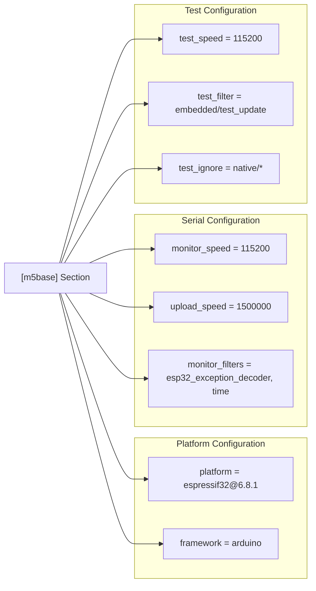
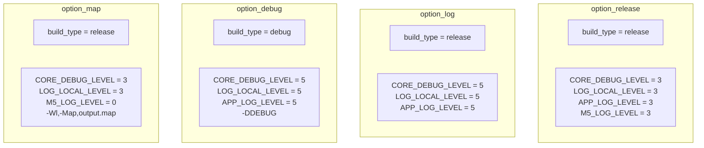
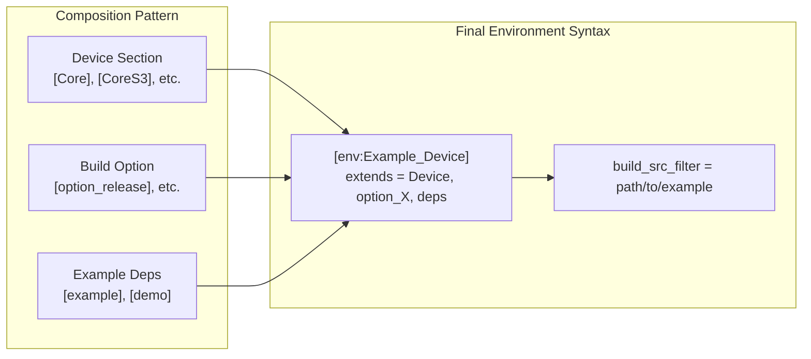
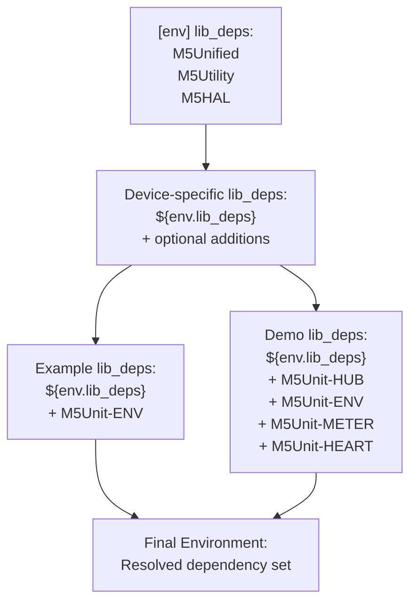

M5UnitUnified PlatformIO Configuration

# PlatformIO Configuration

<details>
<summary>Relevant source files</summary>

The following files were used as context for generating this wiki page:

- [README.ja.md](README.ja.md)
- [README.md](README.md)
- [platformio.ini](platformio.ini)

</details>


This document explains the structure of the `platformio.ini` configuration file, which defines the build environments, dependency management, and compilation settings for M5UnitUnified. The configuration uses a hierarchical inheritance pattern to generate 70+ build environments from reusable configuration sections.

For information about the specific M5Stack devices supported by each configuration, see [Supported Devices](#6.2). For details on the build flag options (release, log, debug, map), see [Build Options](#6.3).

## Configuration File Structure

The `platformio.ini` file is located at the repository root and organizes build configurations into reusable sections that are composed through PlatformIO's `extends` mechanism.

```mermaid
graph TB
    subgraph "Base Configuration Sections"
        ENV["[env]<br/>Global Settings"]
        M5BASE["[m5base]<br/>M5Stack Common"]
        ENV --> M5BASE
    end
    
    subgraph "Device Configuration Sections"
        CORE["[Core]"]
        CORE2["[Core2]"]
        CORES3["[CoreS3]"]
        FIRE["[Fire]"]
        STAMPS3["[StampS3]"]
        DIAL["[Dial]"]
        ATOM["[AtomMatrix]"]
        ATOMS3["[AtomS3]"]
        ATOMS3R["[AtomS3R]"]
        NANOC6["[NanoC6]"]
        STICK["[StickCPlus]"]
        STICK2["[StickCPlus2]"]
        PAPER["[Paper]"]
        COREINK["[CoreInk]"]
        
        M5BASE --> CORE
        M5BASE --> CORE2
        M5BASE --> CORES3
        M5BASE --> FIRE
        M5BASE --> STAMPS3
        M5BASE --> DIAL
        M5BASE --> ATOM
        M5BASE --> ATOMS3
        M5BASE --> ATOMS3R
        M5BASE --> NANOC6
        M5BASE --> STICK
        M5BASE --> STICK2
        M5BASE --> PAPER
        M5BASE --> COREINK
    end
    
    subgraph "Build Option Sections"
        OPT_REL["[option_release]"]
        OPT_LOG["[option_log]"]
        OPT_DBG["[option_debug]"]
        OPT_MAP["[option_map]"]
    end
    
    subgraph "Example Dependency Sections"
        EXAMPLE["[example]<br/>M5Unit-ENV"]
        DEMO["[demo]<br/>HUB,ENV,METER,HEART"]
    end
    
    subgraph "Final Build Environments"
        ENV1["[env:Simple_Core]<br/>extends=Core,option_release,example"]
        ENV2["[env:MultipleUnits_CoreS3]<br/>extends=CoreS3,option_release,demo"]
        ENV3["[env:SelfUpdate_AtomS3]<br/>extends=AtomS3,option_release,example"]
        ENVN["...70+ total environments"]
    end
    
    CORE -.-> ENV1
    OPT_REL -.-> ENV1
    EXAMPLE -.-> ENV1
    
    CORES3 -.-> ENV2
    OPT_REL -.-> ENV2
    DEMO -.-> ENV2
    
    ATOMS3 -.-> ENV3
    OPT_REL -.-> ENV3
    EXAMPLE -.-> ENV3
```



**Sources:** [platformio.ini:1-354]()

## Global Environment Section

The `[env]` section defines settings inherited by all build environments. This section establishes compiler warnings, test framework, and core library dependencies.

| Parameter | Value | Purpose |
|-----------|-------|---------|
| `build_flags` | `-Wall -Wextra -Wreturn-local-addr -Werror=format -Werror=return-local-addr` | Strict compiler warnings |
| `test_framework` | `googletest` | Unit testing framework |
| `test_build_src` | `true` | Include source in test builds |
| `lib_ldf_mode` | `deep` | Deep library dependency scanning |
| `lib_deps` | `m5stack/M5Unified`, `m5stack/M5Utility`, `m5stack/M5HAL` | Core M5Stack dependencies |

**Sources:** [platformio.ini:6-15]()

## M5Stack Base Configuration

The `[m5base]` section extends `[env]` and provides common settings for all M5Stack devices. All device-specific sections inherit from this base.



The platform version `espressif32@6.8.1` corresponds to ESP-IDF version and determines available hardware APIs (e.g., RMT v2 support). This version was selected to match Arduino-ESP32 2.0.4+ which changed the `Wire` interface behavior.

**Sources:** [platformio.ini:18-28]()

## Device Configuration Sections

Each M5Stack device has a dedicated configuration section that specifies the board identifier. These sections extend `[m5base]` and may add device-specific dependencies.

### Standard Device Sections

```ini
[Core]
extends = m5base
board = m5stack-grey
lib_deps = ${env.lib_deps}

[Core2]
extends = m5base
board = m5stack-core2
lib_deps = ${env.lib_deps}

[CoreS3]
extends = m5base
board = m5stack-cores3
lib_deps = ${env.lib_deps}
```

**Sources:** [platformio.ini:30-45]()

### Device with Additional Dependencies

The `[Dial]` section demonstrates adding device-specific libraries:

```ini
[Dial]
extends = m5base
board = m5stack-stamps3
lib_deps = ${env.lib_deps}
  m5stack/M5Dial
```

**Sources:** [platformio.ini:58-62]()

### Custom Board Definitions

Some devices require custom board JSON files not present in the standard PlatformIO registry:

| Device | Board Value | Custom JSON Path |
|--------|-------------|------------------|
| AtomS3R | `m5stack-atoms3r` | `./boards/m5stack-atoms3r.json` |
| NanoC6 | `m5stack-nanoc6` | `./boards/m5stack-nanoc6.json` |
| StickCPlus2 | `m5stick-cplus2` | `./boards/m5stick-cplus2.json` |

**Sources:** [platformio.ini:75-100]()

### ESP32-C6 Platform Configuration

The `[NanoC6]` section requires a specialized platform configuration for the ESP32-C6 chip:

```ini
[NanoC6]
extends = m5base
board = m5stack-nanoc6
platform = https://github.com/platformio/platform-espressif32.git
platform_packages =
	platformio/framework-arduinoespressif32 @ https://github.com/espressif/arduino-esp32.git#3.0.7
	platformio/framework-arduinoespressif32-libs @ https://github.com/espressif/esp32-arduino-libs.git#idf-release/v5.1
board_build.partitions = default.csv
lib_deps = ${env.lib_deps}
```

This configuration uses the bleeding-edge platform and framework versions directly from Git repositories to support the newer ESP32-C6 architecture.

**Sources:** [platformio.ini:81-89]()

## Build Option Sections

Build option sections define compilation flags for different build profiles. These sections reference `${env.build_flags}` to inherit base warnings while adding profile-specific settings.



The debug level values control ESP-IDF logging verbosity:
- **Level 3**: Warnings and errors only
- **Level 5**: Verbose logging including debug messages

The `[option_map]` profile generates a linker map file (`output.map`) for memory analysis while disabling M5-specific logging.

**Sources:** [platformio.ini:126-156]()

## Example Dependency Sections

Example sections define additional library dependencies required by specific example programs.

### Basic Example Dependencies

```ini
[example]
lib_deps=${env.lib_deps}
  m5stack/M5Unit-ENV
```

The `[example]` section adds `M5Unit-ENV` for environmental sensor support used in Simple, SelfUpdate, and ComponentOnly examples.

**Sources:** [platformio.ini:159-161]()

### Demo Application Dependencies

```ini
[demo]
lib_deps=${env.lib_deps}
  m5stack/M5Unit-HUB
  m5stack/M5Unit-ENV
  m5stack/M5Unit-METER
  m5stack/M5Unit-HEART
```

The `[demo]` section includes multiple unit libraries required for the MultipleUnits demonstration, which showcases hub topology and concurrent sensor updates.

**Sources:** [platformio.ini:335-340]()

## Environment Composition

Final build environments combine device configurations, build options, and example dependencies using the `extends` directive. Each environment also specifies source file filtering to compile only the relevant example.



### Example: Simple Pattern Environments

The Simple example is built for all 14 devices:

```ini
[env:Simple_Core]
extends=Core, option_release, example
build_src_filter = +<*> -<.git/> -<.svn/> +<../examples/Basic/Simple>

[env:Simple_CoreS3]
extends=CoreS3, option_release, example
build_src_filter = +<*> -<.git/> -<.svn/> +<../examples/Basic/Simple>

[env:Simple_NanoC6]
extends=NanoC6, option_release, example
build_src_filter = +<*> -<.git/> -<.svn/> +<../examples/Basic/Simple>
```

**Sources:** [platformio.ini:164-218]()

### Example: MultipleUnits Demo Environments

The MultipleUnits demo requires the `[demo]` dependencies and is configured for Core family devices:

```ini
[env:MultipleUnits_Core]
extends=Core, option_release, demo
build_src_filter = +<*> -<.git/> -<.svn/> +<../examples/demo/MultipleUnits>

[env:MultipleUnits_Core2]
extends=Core2, option_release, demo
build_src_filter = +<*> -<.git/> -<.svn/> +<../examples/demo/MultipleUnits>

[env:MultipleUnits_CoreS3]
extends=CoreS3, option_release, demo
build_src_filter = +<*> -<.git/> -<.svn/> +<../examples/demo/MultipleUnits>
```

**Sources:** [platformio.ini:342-352]()

## Dependency Management

The configuration uses PlatformIO's library dependency resolution with `lib_ldf_mode = deep` to automatically download transitive dependencies.

### Dependency Inheritance Chain



The `${env.lib_deps}` variable reference ensures all environments include core M5Stack libraries. Additional dependencies are specified in device or example sections as needed.

**Sources:** [platformio.ini:13-15](), [platformio.ini:35](), [platformio.ini:160-161](), [platformio.ini:336-340]()

## Build Source Filtering

Each environment uses `build_src_filter` to specify which source files to compile. The filter syntax uses `+<path>` for inclusion and `-<path>` for exclusion.

### Filter Pattern Syntax

| Pattern | Meaning |
|---------|---------|
| `+<*>` | Include all files by default |
| `-<.git/>` | Exclude git directory |
| `-<.svn/>` | Exclude SVN directory |
| `+<../examples/Basic/Simple>` | Include specific example directory |

This pattern ensures that only one example program is compiled per environment, preventing linker conflicts from multiple `setup()` and `loop()` definitions.

**Sources:** [platformio.ini:166]()

## Native Testing Configuration

The `[sdl]` section provides configuration for native (non-embedded) testing using SDL2 for hardware simulation:

```ini
[sdl]
build_flags = -O3 -xc++ -std=c++14 -lSDL2 
  -arch arm64                                ; for arm mac
  -I"/usr/local/include/SDL2"                ; for intel mac homebrew SDL2
  -L"/usr/local/lib"                         ; for intel mac homebrew SDL2
  -I"${sysenv.HOMEBREW_PREFIX}/include/SDL2" ; for arm mac homebrew SDL2
  -L"${sysenv.HOMEBREW_PREFIX}/lib"          ; for arm mac homebrew SDL2
platform = native
test_filter= native/*
test_ignore= embedded/*
lib_deps = ${env.lib_deps}
```

This configuration:
- Uses `platform = native` to compile for the host system
- Links against SDL2 for graphics/input simulation
- Filters to run only tests in `native/*` directory
- Supports both Intel and ARM macOS architectures

**Sources:** [platformio.ini:112-122]()

## Configuration Variable Reference

The following table summarizes key configuration variables that can be referenced in `platformio.ini`:

| Variable | Scope | Example Usage |
|----------|-------|---------------|
| `${env.lib_deps}` | Global | Inherit base library dependencies |
| `${env.build_flags}` | Global | Inherit base compiler flags |
| `${sysenv.HOMEBREW_PREFIX}` | System | Reference system environment variables |

These variables enable configuration reuse and avoid duplication across the 70+ build environments.

**Sources:** [platformio.ini:7](), [platformio.ini:13-15](), [platformio.ini:117-118]()