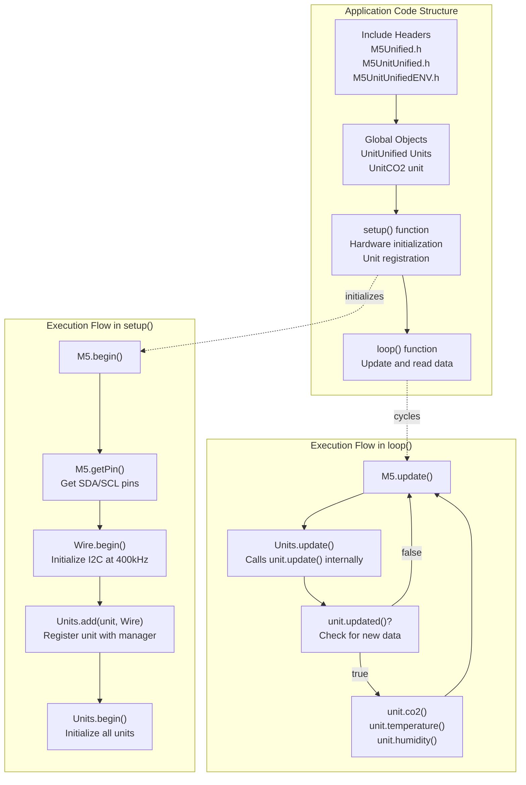
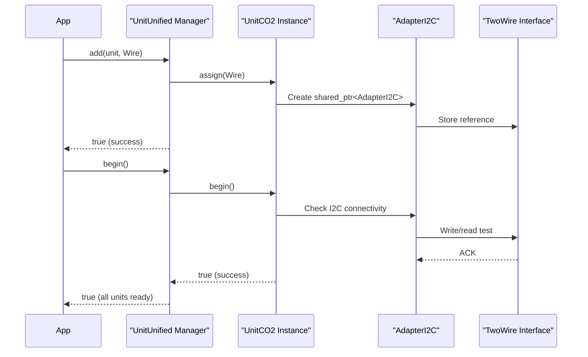
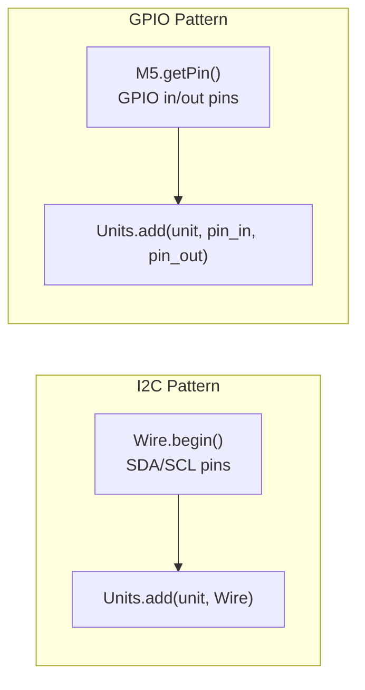
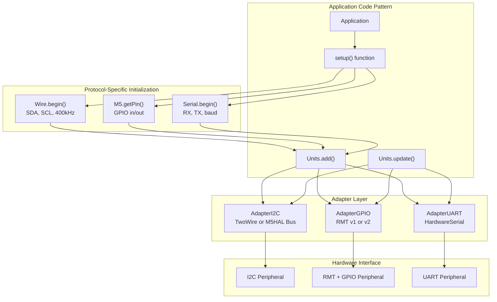

M5UnitUnified Quick Start Example

# Quick Start Example

<details>
<summary>Relevant source files</summary>

The following files were used as context for generating this wiki page:

- [README.ja.md](README.ja.md)
- [README.md](README.md)
- [examples/Basic/ComponentOnly/ComponentOnly.ino](examples/Basic/ComponentOnly/ComponentOnly.ino)
- [examples/Basic/ComponentOnly/main/ComponentOnly.cpp](examples/Basic/ComponentOnly/main/ComponentOnly.cpp)
- [examples/Basic/SelfUpdate/SelfUpdate.ino](examples/Basic/SelfUpdate/SelfUpdate.ino)
- [examples/Basic/SelfUpdate/main/SelfUpdate.cpp](examples/Basic/SelfUpdate/main/SelfUpdate.cpp)
- [examples/Basic/Simple/Simple.ino](examples/Basic/Simple/Simple.ino)
- [examples/Basic/Simple/main/Simple.cpp](examples/Basic/Simple/main/Simple.cpp)
- [platformio.ini](platformio.ini)

</details>


This page provides a step-by-step walkthrough of the simplest example code for using M5UnitUnified. It demonstrates the standard usage pattern where the `UnitUnified` manager handles unit lifecycle and updates automatically.

For alternative usage patterns, see [Component-Only Pattern](#5.2) and [Self-Update Pattern](#5.3). For details on the architecture behind these examples, see [Core Architecture](#3).

## Overview

The standard M5UnitUnified pattern follows this structure:

1. Initialize M5Unified and configure hardware peripherals (I2C/GPIO/UART)
2. Create unit instances and add them to the `UnitUnified` manager
3. Call `Units.begin()` to initialize all units
4. In the main loop, call `Units.update()` to poll sensors
5. Check `unit.updated()` and retrieve measurements

This pattern works for all 40+ supported unit types across I2C, GPIO, and UART communication protocols.

**Sources:** [examples/Basic/Simple/main/Simple.cpp:1-42](), [README.md:49-84]()

## The Simple Example: I2C Unit

The most common example uses an I2C sensor (UnitCO2) connected via the TwoWire interface:

### Complete Example Code



**Sources:** [examples/Basic/Simple/main/Simple.cpp:1-42]()

### Step-by-Step Code Explanation

#### 1. Include Required Headers

[examples/Basic/Simple/main/Simple.cpp:10-12]()

```cpp
#include <M5Unified.h>
#include <M5UnitUnified.h>
#include <M5UnitUnifiedENV.h>  // *1 Include the header of the unit to be used
```

- `M5Unified.h`: Provides the `M5` object for hardware abstraction and pin mapping
- `M5UnitUnified.h`: Provides the `UnitUnified` manager class
- `M5UnitUnifiedENV.h`: Contains the specific unit class (`UnitCO2` in this example)

For other units, replace the third include with the appropriate unit library header (e.g., `M5UnitUnifiedHEART.h`, `M5UnitUnifiedMETER.h`).

**Sources:** [examples/Basic/Simple/main/Simple.cpp:10-12](), [README.md:54-56]()

#### 2. Create Global Objects

[examples/Basic/Simple/main/Simple.cpp:14-15]()

```cpp
m5::unit::UnitUnified Units;
m5::unit::UnitCO2 unit;  // *2 Instance of the unit
```

- `Units`: The manager instance that handles lifecycle for all registered units
- `unit`: The specific sensor instance (change class name for different units)

These objects are typically declared globally for simplicity, though they can be managed differently based on application needs.

**Sources:** [examples/Basic/Simple/main/Simple.cpp:14-15](), [README.md:58-59]()

#### 3. Hardware Initialization in setup()

[examples/Basic/Simple/main/Simple.cpp:19-24]()

```cpp
M5.begin();

auto pin_num_sda = M5.getPin(m5::pin_name_t::port_a_sda);
auto pin_num_scl = M5.getPin(m5::pin_name_t::port_a_scl);
M5_LOGI("getPin: SDA:%u SCL:%u", pin_num_sda, pin_num_scl);
Wire.begin(pin_num_sda, pin_num_scl, 400 * 1000U);
```

| Line | Purpose |
|------|---------|
| `M5.begin()` | Initializes M5Unified system, detects device type, configures pins |
| `M5.getPin()` | Retrieves device-specific pin numbers for Port A SDA/SCL |
| `Wire.begin()` | Initializes Arduino TwoWire I2C interface at 400kHz |

The `M5.getPin()` calls use the M5Unified pin abstraction system, which automatically maps logical port names to physical GPIO numbers based on the detected device (Core, CoreS3, AtomS3, etc.).

**Sources:** [examples/Basic/Simple/main/Simple.cpp:19-24](), [README.md:62-68]()

#### 4. Unit Registration

[examples/Basic/Simple/main/Simple.cpp:27-28]()

```cpp
if (!Units.add(unit, Wire)  // Add unit to UnitUnified manager
    || !Units.begin()) {    // Begin each unit
```



The `Units.add()` method performs these operations:
1. Creates an `AdapterI2C` wrapper around the `Wire` object
2. Assigns the adapter to the unit via `unit.assign()`
3. Registers the unit in the manager's internal linked list

The `Units.begin()` method:
1. Calls `begin()` on each registered unit
2. Each unit performs its own initialization (e.g., reading sensor configuration)
3. Returns `true` only if all units initialize successfully

**Sources:** [examples/Basic/Simple/main/Simple.cpp:27-28](), [README.md:70-72]()

#### 5. Main Loop: Update and Read

[examples/Basic/Simple/main/Simple.cpp:36-41]()

```cpp
void loop()
{
    M5.update();
    Units.update();
    if (unit.updated()) {
        // *3 Obtaining unit-specific measurements
        M5_LOGI("CO2:%u Temp:%f Hum:%f", unit.co2(), unit.temperature(), unit.humidity());
    }
}
```

| Method | Behavior |
|--------|----------|
| `M5.update()` | Updates M5Unified system state (buttons, display, etc.) |
| `Units.update()` | Calls `update()` on each registered unit that doesn't have self-update enabled |
| `unit.updated()` | Returns `true` if new data is available since last check, sets internal flag to `false` |
| `unit.co2()`, etc. | Retrieve cached measurement values from the last `update()` |

The `Units.update()` method iterates through all registered units and calls their `update()` methods. Each unit's `update()` performs these steps:
1. Select the appropriate I2C channel (if using hubs)
2. Read sensor data via I2C transactions
3. Parse and cache the data
4. Set the `_updated` flag to `true`

**Sources:** [examples/Basic/Simple/main/Simple.cpp:34-42](), [README.md:76-83]()

## GPIO Unit Example

For units using GPIO/RMT communication (e.g., UnitTubePressure), the pattern is similar with these differences:

[README.md:87-126]()

### Key Differences



| Aspect | I2C Example | GPIO Example |
|--------|-------------|--------------|
| **Header** | `M5UnitUnifiedENV.h` | `M5UnitUnifiedTUBE.h` |
| **Initialization** | `Wire.begin(sda, scl, freq)` | `M5.getPin(port_b_in/out)` |
| **Registration** | `Units.add(unit, Wire)` | `Units.add(unit, pin_in, pin_out)` |
| **Adapter Created** | `AdapterI2C` | `AdapterGPIO` (uses RMT peripheral) |
| **Update Mechanism** | I2C read transactions | RMT pulse timing measurement |

The GPIO pattern retrieves two pin numbers and passes them directly to `Units.add()`, which creates an `AdapterGPIO` internally. See [GPIO and RMT](#4.2) for details on the RMT peripheral implementation.

**Sources:** [README.md:87-126]()

## UART Unit Example

For units using serial communication (e.g., UnitFinger), the pattern requires serial port configuration:

[README.md:129-175]()

### Key Differences

| Aspect | I2C Example | UART Example |
|--------|-------------|--------------|
| **Header** | `M5UnitUnifiedENV.h` | `M5UnitUnifiedFINGER.h` |
| **Initialization** | `Wire.begin(sda, scl, freq)` | `Serial2.begin(19200, SERIAL_8N1, rx, tx)` |
| **Registration** | `Units.add(unit, Wire)` | `Units.add(unit, Serial2)` |
| **Adapter Created** | `AdapterI2C` | `AdapterUART` |
| **Port Selection** | Port A (SDA/SCL) | Port C (RXD/TXD) with fallback to Port A |

The UART pattern requires:
1. Selecting an available `HardwareSerial` port (`Serial1` or `Serial2`)
2. Configuring baud rate and pins with `Serial.begin()`
3. Passing the serial reference to `Units.add()`

Each unit may require different serial parameters (baud rate, parity, stop bits).

**Sources:** [README.md:129-175]()

## Communication Protocol Summary

The following diagram shows how the example code adapts to different communication types:



All three patterns share the same core structure:
1. Hardware initialization creates the communication interface
2. `Units.add()` wraps the interface in an appropriate adapter
3. `Units.update()` transparently uses the adapter for communication

For detailed information on each adapter implementation, see [Communication Protocols](#4).

**Sources:** [README.md:49-175](), [examples/Basic/Simple/main/Simple.cpp:1-42]()

## Build and Run

To build and run the Simple example for different M5Stack devices:

### PlatformIO

The repository includes pre-configured environments for 14 device types:

```ini
[env:Simple_Core]
extends=Core, option_release, example

[env:Simple_CoreS3]
extends=CoreS3, option_release, example

[env:Simple_AtomS3]
extends=AtomS3, option_release, example
```

Build for a specific device:
```bash
pio run -e Simple_CoreS3
```

Upload:
```bash
pio run -e Simple_CoreS3 --target upload
```

The `[example]` section defines common dependencies:
- `m5stack/M5Unified`
- `m5stack/M5Utility`
- `m5stack/M5HAL`
- `m5stack/M5Unit-ENV` (provides UnitCO2)

**Sources:** [platformio.ini:159-218]()

### Arduino IDE

1. Install required libraries via Library Manager:
   - M5Unified
   - M5UnitUnified
   - M5Unit-ENV (or the specific unit library you need)
2. Open `examples/Basic/Simple/Simple.ino`
3. Select your M5Stack board from Tools → Board menu
4. Compile and upload

**Sources:** [README.md:28-43](), [examples/Basic/Simple/Simple.ino:1-10]()

## Next Steps

After understanding this basic example:

- Explore [Component-Only Pattern](#5.2) for direct unit management without the manager
- Learn about [Self-Update Pattern](#5.3) for asynchronous updates with FreeRTOS tasks
- Review [Multiple Units Demo](#5.4) for complex multi-sensor applications
- Study [UnitUnified Manager](#3.2) for advanced manager features
- Understand [Adapter Pattern](#3.3) for communication abstraction details

**Sources:** [README.md:178-181]()