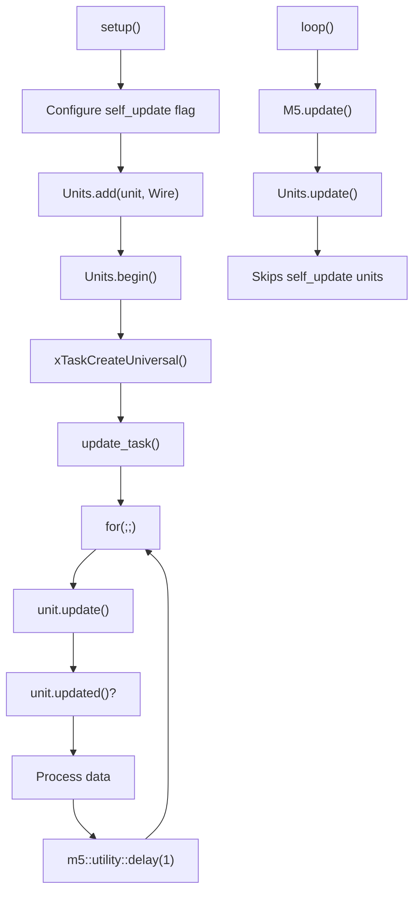
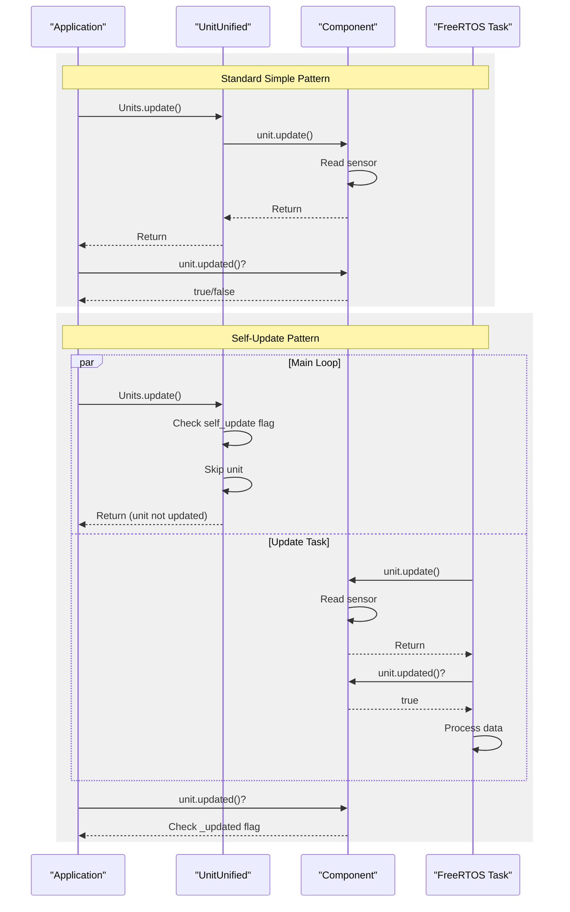
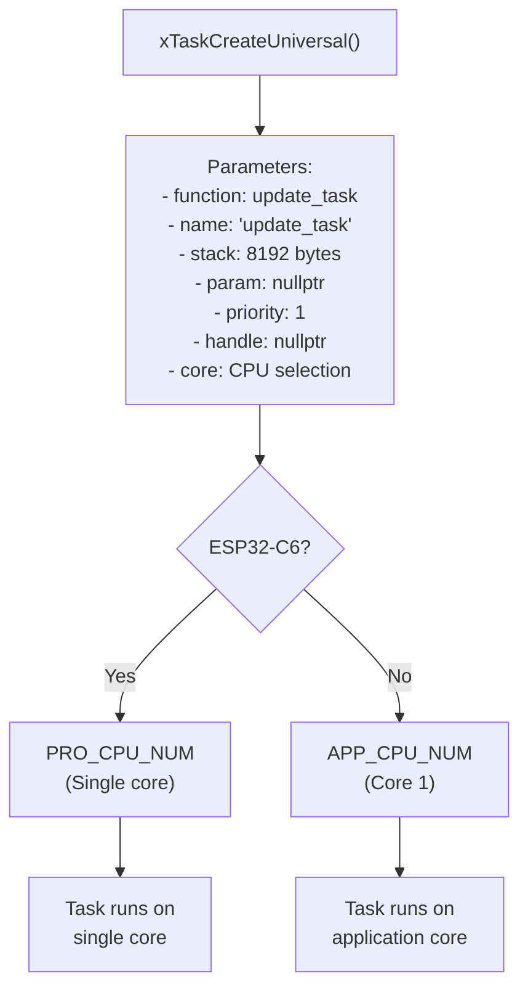
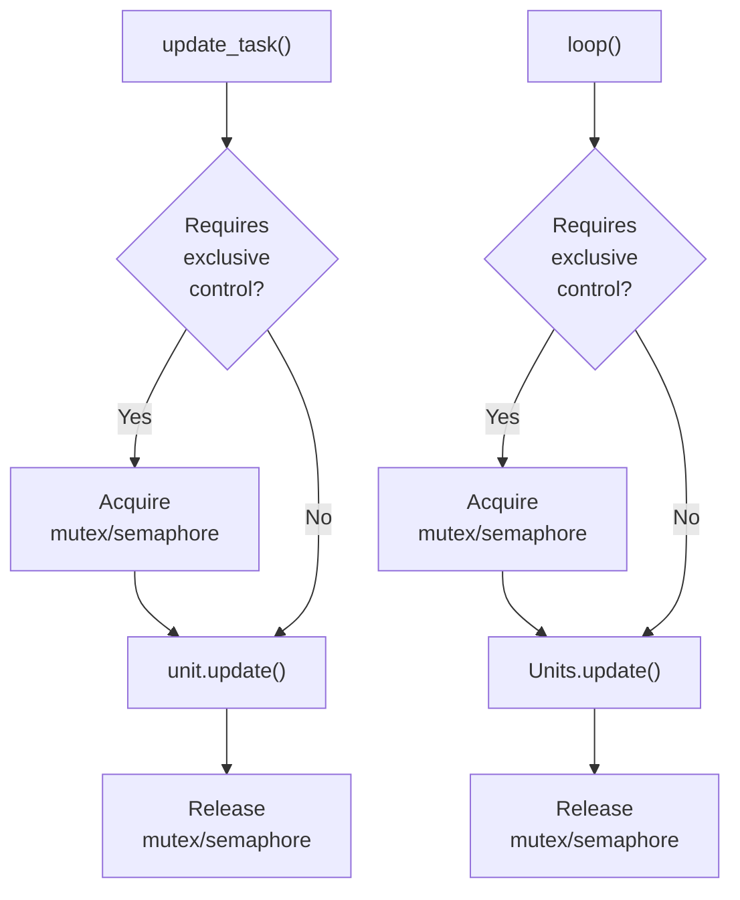
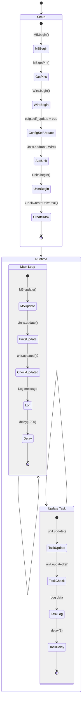
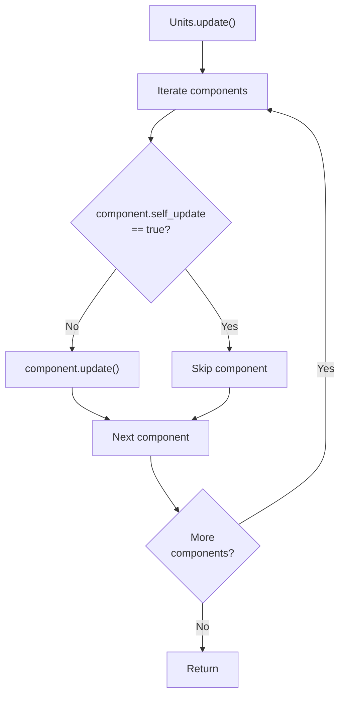

M5UnitUnified Self-Update Pattern

# Self-Update Pattern

<details>
<summary>Relevant source files</summary>

The following files were used as context for generating this wiki page:

- [examples/Basic/ComponentOnly/ComponentOnly.ino](examples/Basic/ComponentOnly/ComponentOnly.ino)
- [examples/Basic/ComponentOnly/main/ComponentOnly.cpp](examples/Basic/ComponentOnly/main/ComponentOnly.cpp)
- [examples/Basic/SelfUpdate/SelfUpdate.ino](examples/Basic/SelfUpdate/SelfUpdate.ino)
- [examples/Basic/SelfUpdate/main/SelfUpdate.cpp](examples/Basic/SelfUpdate/main/SelfUpdate.cpp)
- [examples/Basic/Simple/Simple.ino](examples/Basic/Simple/Simple.ino)
- [examples/Basic/Simple/main/Simple.cpp](examples/Basic/Simple/main/Simple.cpp)

</details>


## Purpose and Scope

This document describes the self-update pattern in M5UnitUnified, where components handle their own updates in dedicated FreeRTOS tasks rather than being updated by the `UnitUnified` manager. This pattern enables asynchronous, high-frequency sensor updates without blocking the main loop, making it suitable for time-sensitive sensors like heart rate monitors or high-speed data acquisition units.

For the standard synchronous update pattern, see [Simple Pattern](#5.1). For direct component management without the `UnitUnified` manager, see [Component-Only Pattern](#5.2).

## Overview

The self-update pattern allows individual components to update themselves in separate FreeRTOS tasks while still being registered with the `UnitUnified` manager. When a component's `self_update` flag is set to `true`, the manager's `update()` method skips that component, delegating update responsibility to user-created tasks.

**Key characteristics:**
- Components run in dedicated FreeRTOS tasks
- Updates occur independently of main loop timing
- `UnitUnified::update()` automatically skips self-updating components
- Requires explicit task creation and management
- Supports concurrent updates of multiple sensors

**When to use this pattern:**
- High-frequency sensors requiring update rates faster than main loop
- Time-critical measurements (heart rate, pulse oximetry)
- Avoiding blocking delays in main application logic
- Multiple sensors with different update intervals

Sources: [examples/Basic/SelfUpdate/main/SelfUpdate.cpp:1-64]()

## Configuration and Setup

### Component Configuration

The self-update behavior is controlled by the `component_config_t` structure's `self_update` boolean field. This configuration must be set before adding the component to the `UnitUnified` manager.


**Configuration sequence:**
1. Retrieve component configuration: `auto ccfg = unit.component_config();`
2. Enable self-update: `ccfg.self_update = true;`
3. Apply configuration: `unit.component_config(ccfg);`
4. Register with manager: `Units.add(unit, Wire);`

Sources: [examples/Basic/SelfUpdate/main/SelfUpdate.cpp:38-40]()

### Task Creation

The self-update pattern requires creating a FreeRTOS task that continuously calls the component's `update()` method. The task function typically runs an infinite loop checking for new data.



**Task implementation pattern:**
```cpp
void update_task(void*) {
    for (;;) {
        unit.update();           // Manual update call
        if (unit.updated()) {
            // Process sensor data
        }
        m5::utility::delay(1);   // Yield to other tasks
    }
}
```

Sources: [examples/Basic/SelfUpdate/main/SelfUpdate.cpp:16-27](), [examples/Basic/SelfUpdate/main/SelfUpdate.cpp:49-54]()

## Update Flow Comparison

The following diagram illustrates how the self-update pattern differs from the standard simple pattern in terms of control flow.



**Key differences:**

| Aspect | Simple Pattern | Self-Update Pattern |
|--------|---------------|---------------------|
| Update caller | `UnitUnified::update()` | User-created FreeRTOS task |
| Update timing | Main loop iteration | Independent task scheduling |
| Blocking behavior | Blocks main loop during sensor read | Non-blocking in main loop |
| Task management | None required | `xTaskCreateUniversal()` required |
| Manager involvement | Calls `update()` on all units | Skips self-update units |

Sources: [examples/Basic/Simple/main/Simple.cpp:34-42](), [examples/Basic/SelfUpdate/main/SelfUpdate.cpp:57-63]()

## Task Creation Details

### CPU Core Selection

The `xTaskCreateUniversal()` function allows specifying which CPU core runs the task. ESP32 dual-core chips have different core assignments than single-core variants like ESP32-C6.



**Core selection pattern:**
```cpp
xTaskCreateUniversal(update_task, "update_task", 8192, nullptr, 1, nullptr,
#if defined(CONFIG_IDF_TARGET_ESP32C6)
                     PRO_CPU_NUM);   // Single-core ESP32-C6
#else
                     APP_CPU_NUM);   // Dual-core ESP32
#endif
```

| Parameter | Value | Description |
|-----------|-------|-------------|
| `function` | `update_task` | Task entry point |
| `name` | `"update_task"` | Task name for debugging |
| `stack` | `8192` | Stack size in bytes |
| `param` | `nullptr` | User parameter (unused) |
| `priority` | `1` | Task priority (lower = lower priority) |
| `handle` | `nullptr` | Task handle (not stored) |
| `core` | `APP_CPU_NUM` / `PRO_CPU_NUM` | CPU core assignment |

Sources: [examples/Basic/SelfUpdate/main/SelfUpdate.cpp:49-54]()

### Task Priority Considerations

Priority `1` is relatively low in the FreeRTOS priority scheme. This ensures the update task doesn't starve other system tasks but still runs regularly. For time-critical applications, increase the priority value.

**Typical priority hierarchy:**
- `0`: Idle task
- `1`: Low-priority background tasks (sensor updates)
- `2-10`: Application tasks
- `10+`: High-priority real-time tasks

## Thread Safety and Synchronization

### Shared Resource Access

When multiple tasks access the same communication bus (e.g., I2C via `Wire`), synchronization is required to prevent concurrent access. The example code includes a comment highlighting this consideration.



**Synchronization requirements:**
- **Same bus, multiple tasks**: Use mutex or semaphore to protect `Wire` access
- **Different buses**: No synchronization needed
- **Self-update only unit**: No synchronization needed if no other tasks access bus
- **Multiple self-update units**: Protect shared adapter access

**Example synchronization pattern:**
```cpp
SemaphoreHandle_t wire_mutex;

void update_task(void*) {
    for (;;) {
        if (xSemaphoreTake(wire_mutex, portMAX_DELAY)) {
            unit.update();
            xSemaphoreGive(wire_mutex);
        }
        if (unit.updated()) {
            // Process data
        }
    }
}
```

Sources: [examples/Basic/SelfUpdate/main/SelfUpdate.cpp:19]()

## Complete Implementation Example

The following diagram shows the complete flow from setup to runtime for the self-update pattern.



**Code structure mapping:**

| Code Section | File Location | Purpose |
|--------------|---------------|---------|
| `setup()` | [SelfUpdate.cpp:29-55]() | Initialize M5, Wire, configure self-update, create task |
| `loop()` | [SelfUpdate.cpp:57-63]() | Main loop that calls `Units.update()` |
| `update_task()` | [SelfUpdate.cpp:16-27]() | FreeRTOS task for sensor updates |
| `component_config()` | [SelfUpdate.cpp:38-40]() | Self-update flag configuration |
| `xTaskCreateUniversal()` | [SelfUpdate.cpp:49-54]() | Task creation with core selection |

Sources: [examples/Basic/SelfUpdate/main/SelfUpdate.cpp:1-64]()

## Manager Behavior with Self-Update Units

When `UnitUnified::update()` is called, it iterates through all registered components and checks their `self_update` configuration. Components with this flag enabled are skipped.



This automatic skipping behavior means:
- No need to manually manage which units to update
- Self-update units remain registered for debugging and introspection
- The `updated()` flag still works correctly across tasks
- Manager's lifecycle methods (`begin()`, etc.) still apply to all units

Sources: [examples/Basic/SelfUpdate/main/SelfUpdate.cpp:60]()

## Use Cases

### High-Frequency Sensor Monitoring

Sensors requiring updates at rates exceeding the main loop frequency:

**Example: Heart rate sensor at 100Hz**
```cpp
void heart_rate_task(void*) {
    for (;;) {
        unit.update();
        if (unit.updated()) {
            process_heartbeat(unit.bpm(), unit.spo2());
        }
        vTaskDelay(pdMS_TO_TICKS(10));  // 100Hz update rate
    }
}
```

### Multiple Independent Update Rates

Different sensors requiring different update frequencies:

| Sensor | Update Rate | Pattern |
|--------|-------------|---------|
| CO2 sensor | 1Hz (low frequency) | Standard `Units.update()` |
| Temperature | 1Hz | Standard `Units.update()` |
| Heart rate | 100Hz | Self-update task |
| Accelerometer | 200Hz | Self-update task |

### Non-Blocking Data Acquisition

Prevents slow sensors from blocking UI rendering or other time-sensitive operations:

```cpp
void loop() {
    M5.update();
    Units.update();        // Fast, skips self-update units
    update_display();      // Render UI at 60fps
    handle_button_input(); // Responsive input
}

// Slow sensor runs independently
void slow_sensor_task(void*) {
    for (;;) {
        unit.update();     // May take 100ms+
        vTaskDelay(pdMS_TO_TICKS(1000));
    }
}
```

Sources: [examples/Basic/SelfUpdate/main/SelfUpdate.cpp:1-64]()

## Comparison Summary

### Self-Update vs Simple Pattern

| Feature | Self-Update | Simple |
|---------|-------------|--------|
| Update location | FreeRTOS task | `Units.update()` |
| Task creation | Required | Not needed |
| Main loop blocking | Non-blocking | May block |
| Update frequency | Independent | Tied to loop rate |
| Complexity | Higher | Lower |
| Thread safety | Must consider | Not applicable |
| Best for | High-frequency, time-critical | Standard sensors |

### Self-Update vs Component-Only Pattern

| Feature | Self-Update | Component-Only |
|---------|-------------|----------------|
| Manager usage | Uses `UnitUnified` | No manager |
| Manager benefits | Debugging, introspection | None |
| Task requirement | Required | Optional |
| Update control | Task + skip flag | Fully manual |
| Best for | Async updates with manager benefits | Maximum control |

Sources: [examples/Basic/SelfUpdate/main/SelfUpdate.cpp:1-64](), [examples/Basic/Simple/main/Simple.cpp:1-43](), [examples/Basic/ComponentOnly/main/ComponentOnly.cpp:1-42]()