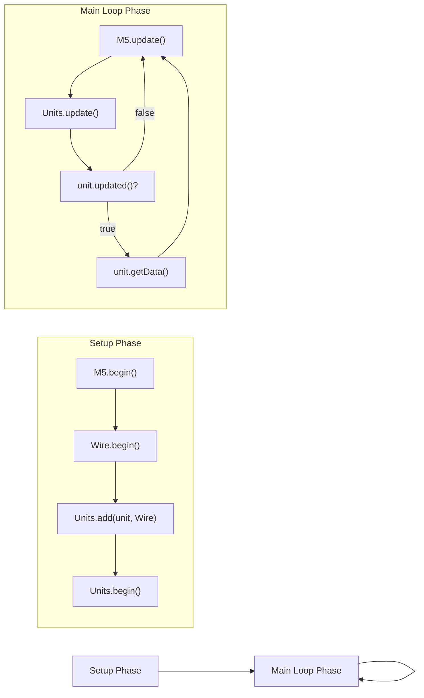
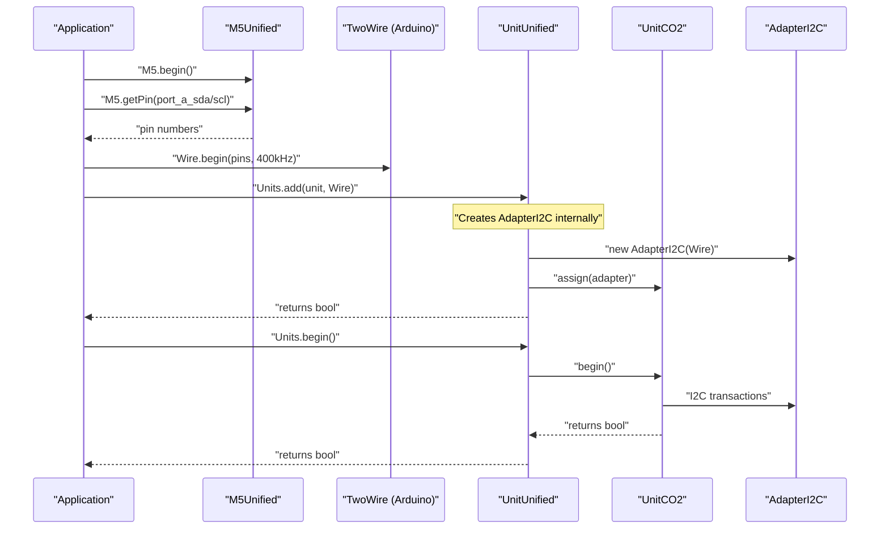
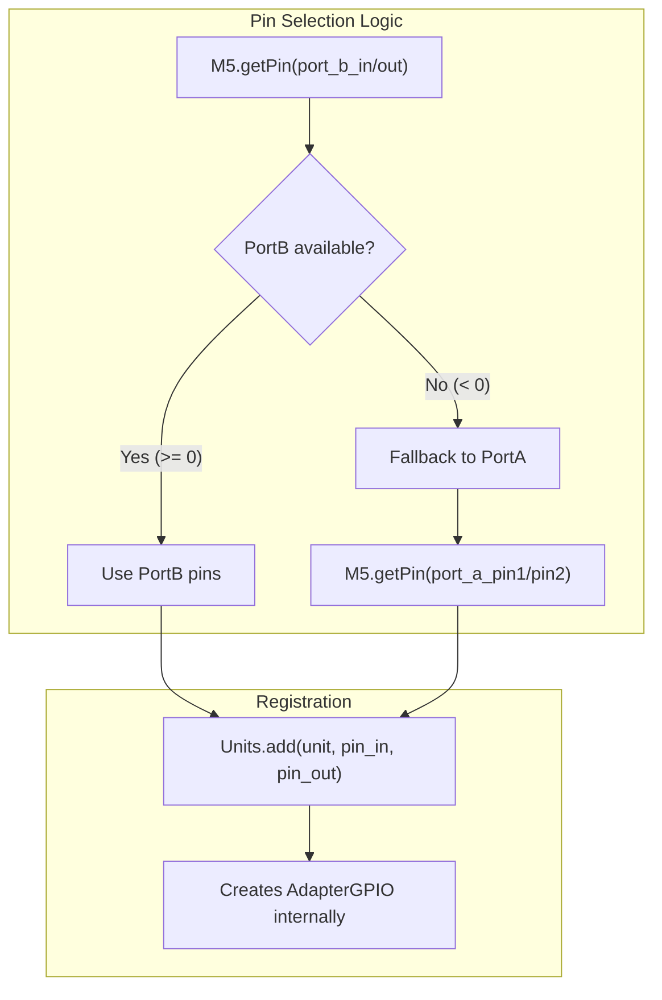
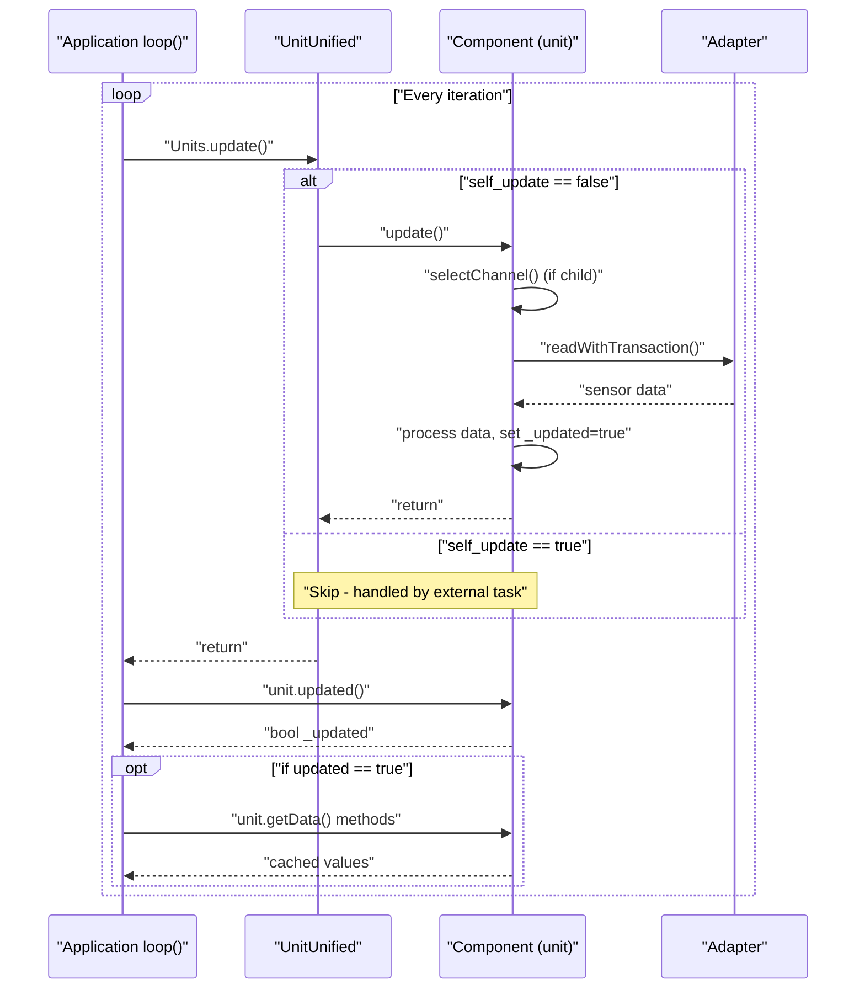
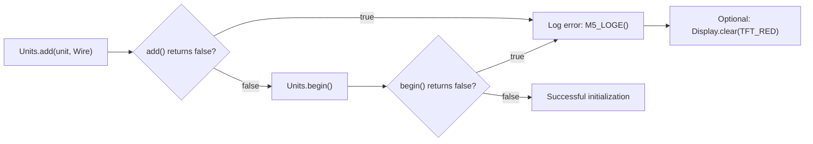
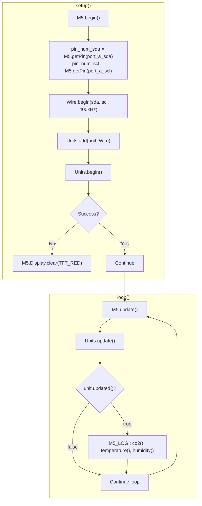
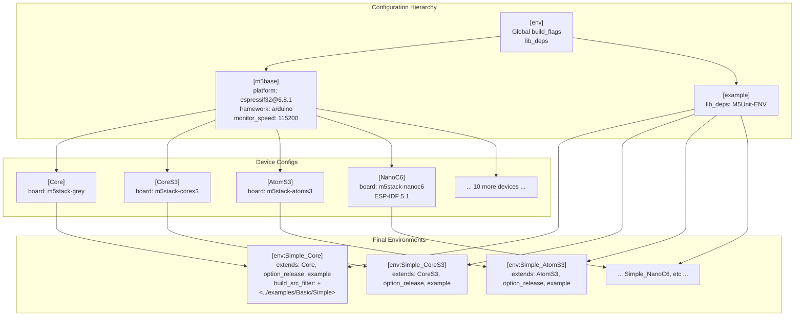

M5UnitUnified Simple Pattern

# Simple Pattern

<details>
<summary>Relevant source files</summary>

The following files were used as context for generating this wiki page:

- [README.ja.md](README.ja.md)
- [README.md](README.md)
- [examples/Basic/ComponentOnly/ComponentOnly.ino](examples/Basic/ComponentOnly/ComponentOnly.ino)
- [examples/Basic/ComponentOnly/main/ComponentOnly.cpp](examples/Basic/ComponentOnly/main/ComponentOnly.cpp)
- [examples/Basic/SelfUpdate/SelfUpdate.ino](examples/Basic/SelfUpdate/SelfUpdate.ino)
- [examples/Basic/SelfUpdate/main/SelfUpdate.cpp](examples/Basic/SelfUpdate/main/SelfUpdate.cpp)
- [examples/Basic/Simple/Simple.ino](examples/Basic/Simple/Simple.ino)
- [examples/Basic/Simple/main/Simple.cpp](examples/Basic/Simple/main/Simple.cpp)
- [platformio.ini](platformio.ini)

</details>


## Purpose and Scope

The Simple Pattern is the **standard, recommended usage pattern** for M5UnitUnified. In this pattern, the `UnitUnified` manager class orchestrates all unit lifecycle operations: registration, initialization, and periodic updates. Application code simply adds units to the manager, then calls `Units.update()` in the main loop. The manager automatically polls each registered unit and sets their `_updated` flags when new data is available.

For alternative patterns, see:
- [Component-Only Pattern](#5.2) - Direct component management without the manager
- [Self-Update Pattern](#5.3) - Asynchronous updates using FreeRTOS tasks
- [Multiple Units Demo](#5.4) - Complex multi-unit configurations with hubs

**Sources**: [examples/Basic/Simple/main/Simple.cpp:1-42](), [README.md:49-83]()

---

## Pattern Overview

The Simple Pattern follows a three-phase lifecycle:



**Sources**: [examples/Basic/Simple/main/Simple.cpp:17-42]()

---

## Core Components and Their Roles

| Component | Class/Type | Role |
|-----------|-----------|------|
| **Manager** | `m5::unit::UnitUnified` | Orchestrates lifecycle for all registered units |
| **Unit Instance** | `m5::unit::UnitCO2` (example) | Concrete unit implementation inheriting from `Component` |
| **Communication** | `TwoWire` / `HardwareSerial` / GPIO pins | Provides hardware interface to manager |
| **Adapter** | `AdapterI2C` / `AdapterGPIO` / `AdapterUART` | Created internally by manager during `add()` |

The manager maintains a linked list of `Component*` pointers and iterates through them during `Units.update()`, calling each component's `update()` method.

**Sources**: [examples/Basic/Simple/main/Simple.cpp:14-15](), [README.md:58-59]()

---

## Basic I2C Unit Implementation

### Initialization Sequence



**Sources**: [examples/Basic/Simple/main/Simple.cpp:21-31](), [README.md:64-73]()

### Code Example Walkthrough

The canonical Simple Pattern implementation from [examples/Basic/Simple/main/Simple.cpp:1-42]():

```cpp
// Global instances
m5::unit::UnitUnified Units;
m5::unit::UnitCO2 unit;
```

**Setup Phase**:
- Lines 21-23: Retrieve SDA/SCL pins using `M5.getPin()` with `port_a_sda` / `port_a_scl` constants
- Line 24: Initialize `Wire` at 400kHz with explicit pins
- Line 27: `Units.add(unit, Wire)` - Registers unit with manager, internally creates `AdapterI2C`
- Line 28: `Units.begin()` - Calls `begin()` on all registered units

**Main Loop**:
- Line 36: `M5.update()` - Updates M5Unified state (buttons, display, etc.)
- Line 37: `Units.update()` - Manager calls `update()` on each registered unit
- Line 38: `unit.updated()` - Check if new data available (reads `_updated` flag)
- Line 40: Access unit-specific data methods: `unit.co2()`, `unit.temperature()`, `unit.humidity()`

**Sources**: [examples/Basic/Simple/main/Simple.cpp:14-42]()

---

## Communication Protocol Variations

### I2C (Wire) Pattern

The standard pattern for I2C units using Arduino's `TwoWire` interface:

| Step | Code | Purpose |
|------|------|---------|
| Pin retrieval | `M5.getPin(m5::pin_name_t::port_a_sda)` | Get hardware-specific pin numbers |
| Bus init | `Wire.begin(sda, scl, 400000U)` | Initialize I2C at 400kHz |
| Registration | `Units.add(unit, Wire)` | Create `AdapterI2C`, register unit |

**Sources**: [README.md:51-83](), [examples/Basic/Simple/main/Simple.cpp:21-24]()

### GPIO Pattern

For units requiring GPIO/RMT communication (e.g., UnitTubePressure):



Key differences from I2C pattern:
- Uses `port_b_in` / `port_b_out` (preferred) or `port_a_pin1` / `port_a_pin2` (fallback)
- Calls `Units.add(unit, pin_in, pin_out)` instead of passing `Wire`
- Manager creates `AdapterGPIO` internally

**Sources**: [README.md:86-126]()

### UART (Serial) Pattern

For units requiring serial communication:

| Step | Code | Purpose |
|------|------|---------|
| Pin retrieval | `M5.getPin(port_c_rxd/txd)` | Get UART pins (PortC preferred) |
| Serial selection | `Serial2` / `Serial1` based on `SOC_UART_NUM` | Choose available UART peripheral |
| Serial init | `s.begin(19200, SERIAL_8N1, rx, tx)` | Unit-specific baud rate and format |
| Registration | `Units.add(unit, s)` | Create `AdapterUART`, register unit |

**Note**: Baud rate and serial format vary by unit type. See individual unit documentation.

**Sources**: [README.md:128-176]()

---

## Update Loop Mechanism

### Polling and Data Availability



**Sources**: [examples/Basic/Simple/main/Simple.cpp:34-42]()

### Update Timing and Interval

The `Component` base class includes an `_interval` field controlling update frequency:

- **Default**: Each unit defines its own optimal polling interval
- **Manager behavior**: `Units.update()` checks elapsed time since last update
- **Skipping**: If insufficient time has passed, `update()` returns early without hardware communication
- **updated() flag**: Set to `true` only when new data is actually retrieved and processed

This automatic throttling prevents excessive I2C/GPIO/UART traffic and ensures predictable update rates.

**Sources**: [README.md:76-83]()

---

## Error Handling

### Initialization Failure Detection



Common failure scenarios:
- `add()` fails: Invalid adapter (null Wire/Serial), memory allocation failure
- `begin()` fails: Unit not responding on I2C bus, GPIO initialization error, UART communication timeout

**Recommended practice**: Check both return values and handle failures appropriately (display error, halt execution, retry logic).

**Sources**: [examples/Basic/Simple/main/Simple.cpp:27-31]()

---

## Complete I2C Example (UnitCO2)

The complete flow from [examples/Basic/Simple/main/Simple.cpp:1-42]():



**Sources**: [examples/Basic/Simple/main/Simple.cpp:1-42]()

---

## Build Configuration

### PlatformIO Environment Structure

The Simple example is built across 14 device configurations using inheritance:



The `[example]` section at [platformio.ini:159-161]() adds `M5Unit-ENV` dependency for UnitCO2. Each final environment (e.g., `[env:Simple_Core]` at [platformio.ini:164-166]()) combines:
- Device config (board type, platform)
- Build options (`option_release` for debug levels)
- Example-specific dependencies
- Source filter pointing to `examples/Basic/Simple`

**Sources**: [platformio.ini:159-218]()

---

## Key Advantages of Simple Pattern

| Advantage | Description |
|-----------|-------------|
| **Centralized lifecycle** | Single `Units.begin()` and `Units.update()` manage all units |
| **Automatic throttling** | Manager respects each unit's `_interval` for optimal polling |
| **Consistent API** | Same pattern works for I2C, GPIO, and UART units |
| **Error detection** | Boolean return values from `add()` and `begin()` enable early failure detection |
| **Minimal boilerplate** | No manual adapter creation or update scheduling required |

---

## Comparison with Other Patterns

| Aspect | Simple Pattern | Component-Only | Self-Update |
|--------|----------------|----------------|-------------|
| **Manager usage** | Required | None | Required (for registration) |
| **Update location** | `Units.update()` in main loop | Manual `unit.update()` in main loop | FreeRTOS task calls `unit.update()` |
| **Complexity** | Lowest | Medium | Highest |
| **Best for** | Standard sensors, straightforward polling | Direct hardware control, custom timing | High-frequency sensors, concurrent operations |

For details on alternative patterns, see:
- [Component-Only Pattern](#5.2) - Manual lifecycle management
- [Self-Update Pattern](#5.3) - Asynchronous task-based updates

**Sources**: [examples/Basic/Simple/main/Simple.cpp:1-42](), [examples/Basic/ComponentOnly/main/ComponentOnly.cpp:1-42](), [examples/Basic/SelfUpdate/main/SelfUpdate.cpp:1-64]()

---

## When to Use Simple Pattern

**Use Simple Pattern when:**
- ✅ Adding standard M5Stack units with typical polling requirements
- ✅ Update frequency matches main loop iteration rate (100-1000 Hz)
- ✅ Centralized lifecycle management is acceptable
- ✅ No special timing or concurrency requirements exist

**Consider alternatives when:**
- ❌ Need sub-millisecond timing precision → Use Component-Only with custom loop
- ❌ Sensor requires high-frequency updates (>1kHz) → Use Self-Update with FreeRTOS task
- ❌ Complex parent-child hierarchies with custom channel selection → See Multiple Units Demo
- ❌ Direct hardware register access needed → Use Component-Only without manager

**Sources**: [README.md:49-83](), [README.md:178-180]()