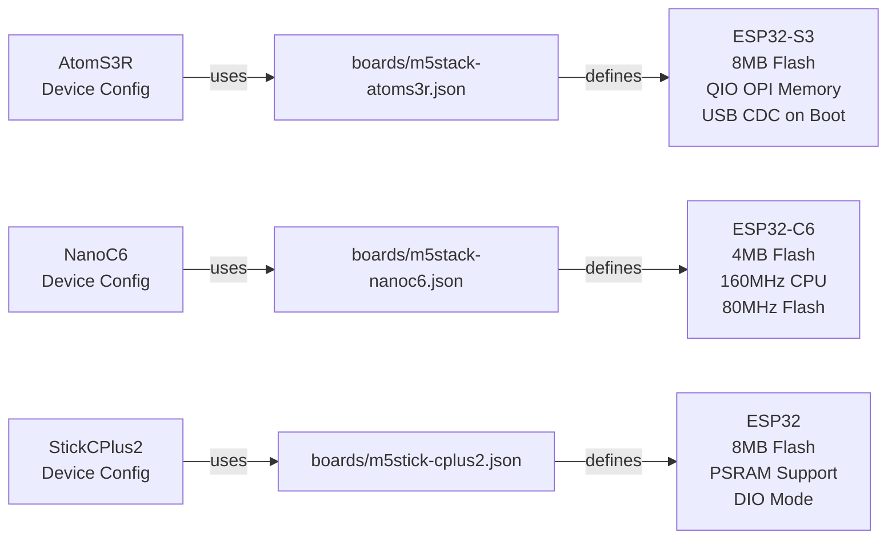
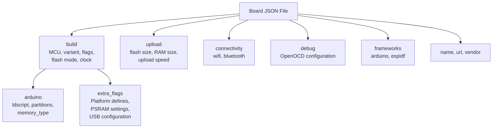
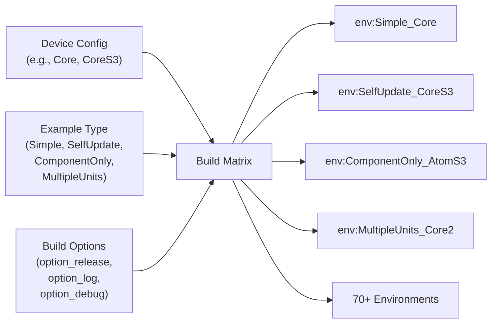

M5UnitUnified Supported Devices

# Supported Devices

<details>
<summary>Relevant source files</summary>

The following files were used as context for generating this wiki page:

- [README.ja.md](README.ja.md)
- [README.md](README.md)
- [pio_project/boards/m5stack-atoms3r.json](pio_project/boards/m5stack-atoms3r.json)
- [pio_project/boards/m5stack-nanoc6.json](pio_project/boards/m5stack-nanoc6.json)
- [pio_project/boards/m5stick-cplus2.json](pio_project/boards/m5stick-cplus2.json)
- [pio_project/platformio.ini](pio_project/platformio.ini)
- [pio_project/test/unit_unified_test.cpp](pio_project/test/unit_unified_test.cpp)
- [platformio.ini](platformio.ini)

</details>


This page documents the 14 M5Stack board configurations supported by M5UnitUnified, their PlatformIO board identifiers, and custom board definitions. For information about build options and compilation flags, see [Build Options](#6.3). For the overall PlatformIO configuration structure, see [PlatformIO Configuration](#6.1).

## Overview

M5UnitUnified supports 14 M5Stack devices spanning four product families: Core, Atom, Stick, and specialized devices. Each device configuration inherits from the `[m5base]` section in `platformio.ini` and specifies a PlatformIO board identifier. Three devices (AtomS3R, NanoC6, StickCPlus2) require custom board JSON files located in `boards/`.

## Device Family Structure

```mermaid
graph TB
    subgraph "Core Family"
        Core["Core<br/>m5stack-grey"]
        Core2["Core2<br/>m5stack-core2"]
        CoreS3["CoreS3<br/>m5stack-cores3"]
        Fire["Fire<br/>m5stack-fire"]
    end
    
    subgraph "Atom Family"
        AtomMatrix["AtomMatrix<br/>m5stack-atom"]
        AtomS3["AtomS3<br/>m5stack-atoms3"]
        AtomS3R["AtomS3R<br/>m5stack-atoms3r<br/>(Custom JSON)"]
    end
    
    subgraph "Stick Family"
        StickCPlus["StickCPlus<br/>m5stick-c"]
        StickCPlus2["StickCPlus2<br/>m5stick-cplus2<br/>(Custom JSON)"]
    end
    
    subgraph "Specialized Devices"
        StampS3["StampS3<br/>m5stack-stamps3<br/>(Capsule, DinMeter)"]
        Dial["Dial<br/>m5stack-stamps3<br/>+ M5Dial library"]
        NanoC6["NanoC6<br/>m5stack-nanoc6<br/>(Custom JSON)<br/>(ESP32-C6 platform)"]
        Paper["Paper<br/>m5stack-fire"]
        CoreInk["CoreInk<br/>m5stack-coreink"]
    end
    
    M5BASE["[m5base]<br/>Common Settings<br/>espressif32@6.8.1<br/>Arduino framework"] -.inherits.-> Core
    M5BASE -.inherits.-> Core2
    M5BASE -.inherits.-> CoreS3
    M5BASE -.inherits.-> Fire
    M5BASE -.inherits.-> AtomMatrix
    M5BASE -.inherits.-> AtomS3
    M5BASE -.inherits.-> AtomS3R
    M5BASE -.inherits.-> StickCPlus
    M5BASE -.inherits.-> StickCPlus2
    M5BASE -.inherits.-> StampS3
    M5BASE -.inherits.-> Dial
    M5BASE -.inherits.-> NanoC6
    M5BASE -.inherits.-> Paper
    M5BASE -.inherits.-> CoreInk
```



**Sources:** [platformio.ini:30-110](), [pio_project/platformio.ini:57-139]()

## Device Configuration Table

| Device | PlatformIO Section | Board Identifier | MCU Type | Custom JSON | Special Requirements |
|--------|-------------------|------------------|----------|-------------|---------------------|
| **Core** | `[Core]` | `m5stack-grey` | ESP32 | No | - |
| **Core2** | `[Core2]` | `m5stack-core2` | ESP32 | No | - |
| **CoreS3** | `[CoreS3]` | `m5stack-cores3` | ESP32-S3 | No | - |
| **Fire** | `[Fire]` | `m5stack-fire` | ESP32 | No | - |
| **AtomMatrix** | `[AtomMatrix]` | `m5stack-atom` | ESP32 | No | - |
| **AtomS3** | `[AtomS3]` | `m5stack-atoms3` | ESP32-S3 | No | - |
| **AtomS3R** | `[AtomS3R]` | `m5stack-atoms3r` | ESP32-S3 | **Yes** | Custom board definition |
| **NanoC6** | `[NanoC6]` | `m5stack-nanoc6` | **ESP32-C6** | **Yes** | ESP-IDF 5.1, Arduino 3.0.7 |
| **StickCPlus** | `[StickCPlus]` | `m5stick-c` | ESP32 | No | - |
| **StickCPlus2** | `[StickCPlus2]` | `m5stick-cplus2` | ESP32 | **Yes** | Custom board definition |
| **StampS3** | `[StampS3]` | `m5stack-stamps3` | ESP32-S3 | No | Includes M5Capsule, DinMeter |
| **Dial** | `[Dial]` | `m5stack-stamps3` | ESP32-S3 | No | Requires `M5Dial` library |
| **Paper** | `[Paper]` | `m5stack-fire` | ESP32 | No | Uses Fire board definition |
| **CoreInk** | `[CoreInk]` | `m5stack-coreink` | ESP32 | No | - |

**Sources:** [platformio.ini:30-110](), [pio_project/platformio.ini:57-139]()

## Standard Device Configurations

Standard device configurations inherit from `[m5base]` and specify only the `board` identifier and `lib_deps`:

```ini
[Core]
extends = m5base
board = m5stack-grey
lib_deps = ${env.lib_deps}

[Core2]
extends = m5base
board = m5stack-core2
lib_deps = ${env.lib_deps}

[CoreS3]
extends = m5base
board = m5stack-cores3
lib_deps = ${env.lib_deps}
```

The `[m5base]` section provides common settings for all devices:
- **Platform:** `espressif32 @6.8.1` (ESP32 Arduino Core 2.0.4+)
- **Framework:** Arduino
- **Monitor Speed:** 115200 baud
- **Upload Speed:** 1500000 baud
- **Test Framework:** GoogleTest

**Sources:** [platformio.ini:18-28](), [platformio.ini:30-45](), [pio_project/platformio.ini:45-55]()

## Devices with Special Library Dependencies

### Dial

The Dial device extends `StampS3` configuration but adds the `M5Dial` library dependency:

```ini
[Dial]
extends = m5base
board = m5stack-stamps3
lib_deps = ${env.lib_deps}
  m5stack/M5Dial
```

**Sources:** [platformio.ini:58-62]()

### StampS3

StampS3 configuration includes M5Capsule and DinMeter devices, which share the same base hardware:

```ini
[StampS3]
;include M5Capsule, DinMeter
extends = m5base
board = m5stack-stamps3
lib_deps = ${env.lib_deps}
```

**Sources:** [platformio.ini:52-56]()

## Custom Board Configurations

Three devices require custom board JSON files to define hardware specifications not available in standard PlatformIO board definitions.

### Device to Board JSON Mapping



**Sources:** [pio_project/boards/m5stack-atoms3r.json:1-42](), [pio_project/boards/m5stack-nanoc6.json:1-34](), [pio_project/boards/m5stick-cplus2.json:1-41]()

### AtomS3R Board Definition

The AtomS3R board JSON defines an ESP32-S3 device with 8MB flash and PSRAM support:

**Key Configuration Properties:**
- **MCU:** `esp32s3` with QIO OPI memory access mode
- **Flash Size:** 8MB with `default_8MB.csv` partitions
- **Build Flags:**
  - `ARDUINO_M5STACK_ATOMS3R`
  - `BOARD_HAS_PSRAM`
  - `ARDUINO_USB_CDC_ON_BOOT=1` (USB Serial enabled at boot)
- **Clock:** 240MHz CPU, 80MHz Flash

**Sources:** [pio_project/boards/m5stack-atoms3r.json:1-42]()

### NanoC6 Board Definition and Platform Requirements

NanoC6 is the only device using the **ESP32-C6** chip, requiring special platform configuration:

**Platform Configuration:**
```ini
[NanoC6]
extends = m5base
board = m5stack-nanoc6
platform = https://github.com/platformio/platform-espressif32.git
platform_packages =
    platformio/framework-arduinoespressif32 @ https://github.com/espressif/arduino-esp32.git#3.0.7
    platformio/framework-arduinoespressif32-libs @ https://github.com/espressif/esp32-arduino-libs.git#idf-release/v5.1
board_build.partitions = default.csv
lib_deps = ${env.lib_deps}
```

**Board JSON Properties:**
- **MCU:** `esp32c6` (RISC-V architecture)
- **Flash Size:** 4MB
- **Clock:** 160MHz CPU, 80MHz Flash
- **Connectivity:** WiFi only (no Bluetooth Classic, BLE supported)
- **Build Flags:** `ARDUINO_M5STACK_NANOC6`

**Platform Requirements:**
- Uses Git-based platform instead of versioned release
- Requires Arduino-ESP32 3.0.7 with ESP-IDF 5.1 libraries
- Different from standard `espressif32 @6.8.1` platform used by other devices

**Sources:** [platformio.ini:81-89](), [pio_project/boards/m5stack-nanoc6.json:1-34]()

### StickCPlus2 Board Definition

StickCPlus2 defines an ESP32 device with 8MB flash and PSRAM:

**Key Configuration Properties:**
- **MCU:** `esp32` with PSRAM cache issue fixes
- **Flash Size:** 8MB with `default_8MB.csv` partitions
- **Build Flags:**
  - `M5STACK_M5STICK_CPLUS2`
  - `BOARD_HAS_PSRAM`
  - `-mfix-esp32-psram-cache-issue` (hardware workaround)
  - `-mfix-esp32-psram-cache-strategy=memw`
- **Flash Mode:** DIO (not QIO like other devices)
- **Upload Speed:** 1500000 baud

**Sources:** [pio_project/boards/m5stick-cplus2.json:1-41]()

## Board JSON File Structure

All custom board JSON files follow this structure:



**Common Elements:**
- **build.mcu:** Chip type (`esp32`, `esp32s3`, `esp32c6`)
- **build.variant:** Board variant for pin mapping
- **build.extra_flags:** Preprocessor defines and compiler flags
- **build.arduino.partitions:** Flash partition table
- **upload.flash_size:** Total flash memory available
- **upload.maximum_ram_size:** SRAM size (typically 327680 bytes)

**Sources:** [pio_project/boards/m5stack-atoms3r.json:2-37](), [pio_project/boards/m5stack-nanoc6.json:2-30](), [pio_project/boards/m5stick-cplus2.json:2-37]()

## Build Environment Generation

Each device configuration combines with example types to generate specific build environments:



Example environment definition combining device and example:
```ini
[env:Simple_CoreS3]
extends=CoreS3, option_release, example
build_src_filter = +<*> -<.git/> -<.svn/> +<../examples/Basic/Simple>
```

This pattern generates **70+ build environments** covering all device/example combinations.

**Sources:** [platformio.ini:164-218](), [platformio.ini:221-275](), [platformio.ini:278-332](), [platformio.ini:342-352]()

## Device Testing Configuration

Each device has a corresponding test environment that extends the device configuration with GoogleTest:

```ini
[env:test_Core]
extends=Core, option_release
lib_deps = ${Core.lib_deps} 
  ${test_fw.lib_deps}

[env:test_CoreS3]
extends=CoreS3, option_release
lib_deps = ${CoreS3.lib_deps} 
  ${test_fw.lib_deps}

[env:test_NanoC6]
extends=NanoC6, option_release
lib_deps = ${NanoC6.lib_deps}
  ${test_fw.lib_deps}
```

The `test_fw` section defines GoogleTest dependencies:
```ini
[test_fw]
lib_deps = google/googletest@1.12.1
```

All devices support the same test suite defined in `test/unit_unified_test.cpp`, which validates component interfaces across all supported units.

**Sources:** [pio_project/platformio.ini:188-274](), [pio_project/test/unit_unified_test.cpp:1-170]()

## Device Selection Guidelines

| Use Case | Recommended Devices | Rationale |
|----------|-------------------|-----------|
| **Full-featured development** | Core, Core2, CoreS3 | Large displays, extensive I/O, standard form factor |
| **Compact projects** | AtomMatrix, AtomS3, AtomS3R | Small size, LED matrix display, GPIO access |
| **Portable/battery applications** | StickCPlus, StickCPlus2 | Built-in battery, compact design |
| **ESP32-C6 requirements** | NanoC6 | WiFi 6, BLE 5.3, IEEE 802.15.4 support |
| **Custom embedded systems** | StampS3, Paper, CoreInk | Specialized displays, embedded integration |
| **UI-intensive applications** | Dial, CoreS3 | Rotary encoder (Dial), large touchscreen (CoreS3) |

**Sources:** [README.md:182-194]()