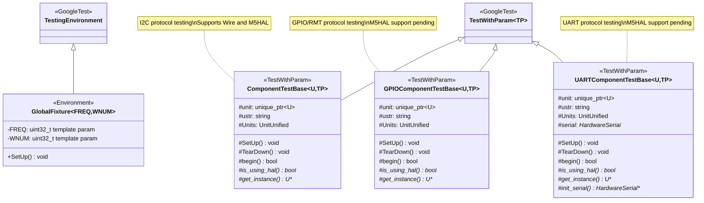
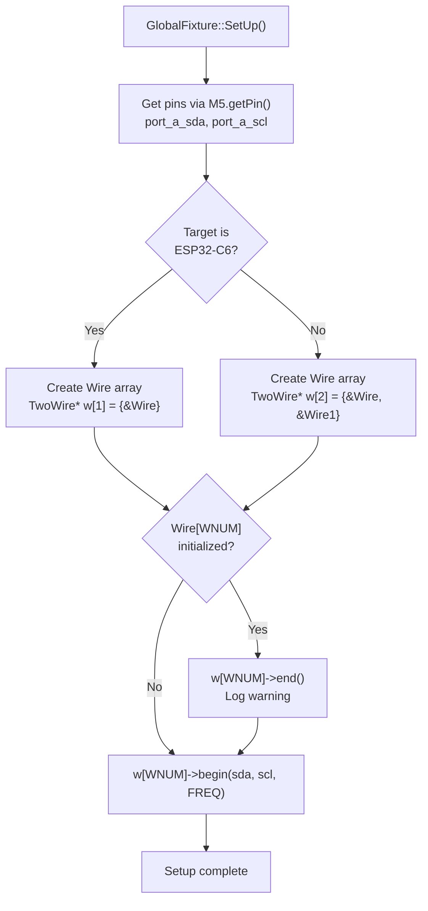
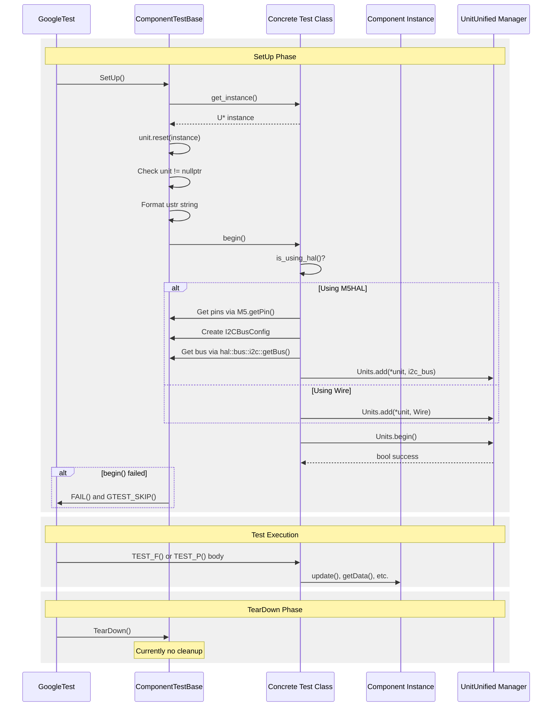
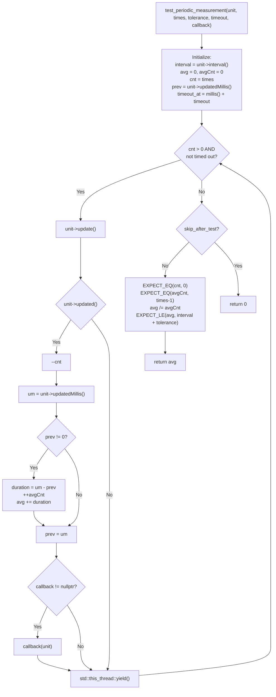
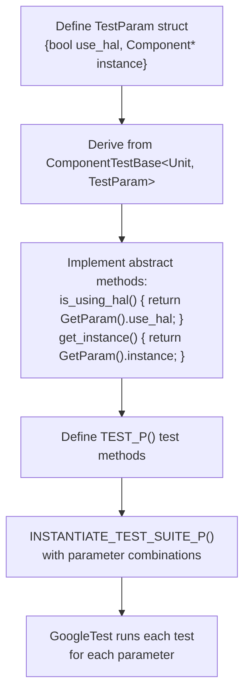

M5UnitUnified Test Framework

# Test Framework

<details>
<summary>Relevant source files</summary>

The following files were used as context for generating this wiki page:

- [src/googletest/test_helper.hpp](src/googletest/test_helper.hpp)
- [src/googletest/test_template.hpp](src/googletest/test_template.hpp)
- [src/m5_unit_component/adapter.cpp](src/m5_unit_component/adapter.cpp)
- [src/m5_unit_component/adapter.hpp](src/m5_unit_component/adapter.hpp)
- [src/m5_unit_component/adapter_uart.cpp](src/m5_unit_component/adapter_uart.cpp)

</details>


## Purpose and Scope

This document describes the GoogleTest-based testing infrastructure provided by M5UnitUnified for validating Component implementations. The framework includes environment setup fixtures, base test classes for the three communication protocols (I2C, GPIO, UART), and helper functions for timing validation.

For information on writing tests for specific components, see [Writing Unit Tests](#7.2). For details on the static validation test suite, see [Component Validation Tests](#7.3).

## Overview

The test framework is built on GoogleTest and provides a standardized approach to testing Component-derived classes across multiple adapter implementations. The framework supports:

- **Global environment setup** via `GlobalFixture` for I2C bus initialization
- **Protocol-specific base classes** that handle component lifecycle and adapter configuration
- **Parameterized testing** to validate components with both Arduino (Wire) and M5HAL adapters
- **Timing validation** helpers for periodic measurement sensors
- **Automatic test skipping** when hardware is not available

**Sources:** [src/googletest/test_template.hpp:1-231](), [src/googletest/test_helper.hpp:1-89]()

## Test Framework Class Hierarchy



**Sources:** [src/googletest/test_template.hpp:28-54](), [src/googletest/test_template.hpp:57-110](), [src/googletest/test_template.hpp:113-171](), [src/googletest/test_template.hpp:174-226]()

## GlobalFixture: Environment Setup

The `GlobalFixture` template class configures the test environment before any tests run. It initializes the I2C bus with the specified frequency and Wire instance number.

### Template Parameters

| Parameter | Type | Description |
|-----------|------|-------------|
| `FREQ` | `uint32_t` | I2C bus frequency in Hz (typically 400000) |
| `WNUM` | `uint32_t` | Wire instance number (0 for Wire, 1 for Wire1, default: 0) |

### Initialization Sequence

The `SetUp()` method performs the following operations:

1. **Pin Retrieval**: Gets SDA/SCL pin numbers from M5Unified using `M5.getPin(port_a_sda)` and `M5.getPin(port_a_scl)`
2. **Wire Array Setup**: Creates array of TwoWire pointers (1 element for ESP32-C6, 2 for other targets)
3. **Existing Bus Check**: If the specified Wire instance is already initialized, terminates it with `end()` and logs a warning
4. **Bus Initialization**: Calls `Wire.begin(pin_num_sda, pin_num_scl, FREQ)` with the retrieved pins

### Platform-Specific Behavior



**Sources:** [src/googletest/test_template.hpp:33-54]()

## ComponentTestBase: I2C Testing

The `ComponentTestBase` class provides a standardized test fixture for I2C-based components. It manages component lifecycle, adapter configuration, and supports both Arduino Wire and M5HAL Bus implementations.

### Template Parameters

| Parameter | Type | Constraint | Description |
|-----------|------|------------|-------------|
| `U` | typename | `std::is_base_of<Component, U>` | Component-derived class under test |
| `TP` | typename | - | Parameterized test type (used by `is_using_hal()` and `get_instance()`) |

### Test Lifecycle



### Abstract Methods

Derived test classes must implement two pure virtual methods:

| Method | Return Type | Purpose |
|--------|-------------|---------|
| `is_using_hal()` | `bool` | Returns true if M5HAL adapter should be used, false for Wire |
| `get_instance()` | `U*` | Returns a new instance of the component under test |

### Member Variables

| Variable | Type | Purpose |
|----------|------|---------|
| `unit` | `std::unique_ptr<U>` | Managed pointer to component instance |
| `ustr` | `std::string` | Formatted string with device name and adapter type (for logging) |
| `Units` | `m5::unit::UnitUnified` | Manager instance for component registration |

**Sources:** [src/googletest/test_template.hpp:57-110]()

## GPIOComponentTestBase: GPIO/RMT Testing

The `GPIOComponentTestBase` class provides test infrastructure for GPIO-based components that use the RMT peripheral for pulse timing. It follows the same pattern as `ComponentTestBase` but configures GPIO pins instead of I2C buses.

### Pin Selection Logic

The `begin()` method uses the following pin selection strategy:

1. **Primary Option**: Attempts to use Port B GPIO pins via `M5.getPin(port_b_in)` and `M5.getPin(port_b_out)`
2. **Fallback Option**: If Port B is unavailable (returns negative values), terminates Wire and uses Port A pins via `M5.getPin(port_a_pin1)` and `M5.getPin(port_a_pin2)`
3. **Logging**: Logs the selected pin numbers for debugging

### Current Limitations

The M5HAL implementation for GPIO is not yet complete. When `is_using_hal()` returns true, `begin()` returns false:

```cpp
// [src/googletest/test_template.hpp:154-157]()
if (is_using_hal()) {
    // Using M5HAL
    // TODO Not yet
    return false;
}
```

For Arduino GPIO mode, the component is registered with `Units.add(*unit, pin_num_gpio_in, pin_num_gpio_out)`.

**Sources:** [src/googletest/test_template.hpp:113-171]()

## UARTComponentTestBase: UART Testing

The `UARTComponentTestBase` class provides test infrastructure for UART-based components using `HardwareSerial` interfaces.

### Additional Abstract Method

In addition to `is_using_hal()` and `get_instance()`, UART tests must implement:

| Method | Return Type | Purpose |
|--------|-------------|---------|
| `init_serial()` | `HardwareSerial*` | Returns a pointer to the initialized serial port to use |

### Member Variables

The class includes an additional member for serial port management:

| Variable | Type | Purpose |
|----------|------|---------|
| `serial` | `HardwareSerial*` | Pointer to the serial port returned by `init_serial()` |

### Current Limitations

Similar to GPIO, the M5HAL implementation for UART is not yet complete. When `is_using_hal()` returns true, `begin()` returns false.

For Arduino Serial mode, the component is registered with `Units.add(*unit, *serial)`.

**Sources:** [src/googletest/test_template.hpp:174-226]()

## Test Helper Functions

### test_periodic_measurement: Timing Validation

The `test_periodic_measurement()` helper validates that periodic measurement sensors update at their configured intervals with acceptable timing accuracy.



### Function Overloads

The helper provides three overloaded versions with progressively fewer parameters:

#### Full Parameter Version

```cpp
// [src/googletest/test_helper.hpp:22-65]()
uint32_t test_periodic_measurement(U* unit, 
                                   const uint32_t times, 
                                   const uint32_t tolerance,
                                   const uint32_t timeout_duration, 
                                   void (*callback)(U*), 
                                   const bool skip_after_test)
```

| Parameter | Type | Purpose |
|-----------|------|---------|
| `unit` | `U*` | Pointer to component under test |
| `times` | `uint32_t` | Number of updates to measure |
| `tolerance` | `uint32_t` | Acceptable timing deviation in milliseconds |
| `timeout_duration` | `uint32_t` | Maximum time to wait for all updates |
| `callback` | `void (*)(U*)` | Optional function to call after each update |
| `skip_after_test` | `bool` | If true, skip EXPECT assertions and return 0 |

#### Default Timeout Version

```cpp
// [src/googletest/test_helper.hpp:67-74]()
uint32_t test_periodic_measurement(U* unit, 
                                   const uint32_t times = 8, 
                                   const uint32_t tolerance = 1,
                                   void (*callback)(U*) = nullptr, 
                                   const bool skip_after_test = false)
```

This version calculates timeout automatically: `timeout_duration = (unit->interval() * 2) * times`

#### Minimal Parameter Version

```cpp
// [src/googletest/test_helper.hpp:76-83]()
uint32_t test_periodic_measurement(U* unit, 
                                   const uint32_t times = 8, 
                                   void (*callback)(U*) = nullptr,
                                   const bool skip_after_test = false)
```

This version uses default tolerance of 1 ms and automatic timeout calculation.

### Validation Logic

When `skip_after_test` is false, the function validates:

1. **Complete Execution**: `EXPECT_EQ(cnt, 0U)` - All requested updates completed
2. **Interval Count**: `EXPECT_EQ(avgCnt, times - 1)` - Correct number of intervals measured (first update has no previous timestamp)
3. **Average Timing**: `EXPECT_LE(avg, interval + tolerance)` - Average update interval is within tolerance

The function returns the average measured interval (or 0 if skipping validation).

**Sources:** [src/googletest/test_helper.hpp:1-89]()

## Parameterized Testing Support

The template parameter `TP` in the base classes enables parameterized testing, allowing a single test definition to run with multiple configurations (e.g., Wire vs M5HAL, different component variants).

### Integration with GoogleTest

The base classes inherit from `::testing::TestWithParam<TP>`, which provides:

- `GetParam()` method to retrieve the current parameter value in test methods
- `INSTANTIATE_TEST_SUITE_P` macro support for defining parameter sets
- Automatic test name generation based on parameter values

### Typical Usage Pattern



The derived test class accesses parameter values through `GetParam()` and uses them in the abstract method implementations to control which adapter is used and which component instance is created.

**Sources:** [src/googletest/test_template.hpp:57-110]()

## Usage Example Pattern

Here is the typical pattern for creating a test class using the framework:

```cpp
// Define parameter structure
struct CO2TestParam {
    bool use_hal;
    uint8_t address;
};

// Derive from ComponentTestBase
class UnitCO2Test : public m5::unit::googletest::ComponentTestBase<m5::unit::UnitCO2, CO2TestParam> {
protected:
    bool is_using_hal() const override {
        return GetParam().use_hal;
    }
    
    m5::unit::UnitCO2* get_instance() override {
        return new m5::unit::UnitCO2(GetParam().address);
    }
};

// Define parameterized test
TEST_P(UnitCO2Test, ReadTemperature) {
    test_periodic_measurement(unit.get(), 5);
    EXPECT_TRUE(unit->inRange());
}

// Instantiate with parameters
INSTANTIATE_TEST_SUITE_P(
    CO2Tests,
    UnitCO2Test,
    ::testing::Values(
        CO2TestParam{false, 0x62},  // Wire adapter
        CO2TestParam{true,  0x62}   // M5HAL adapter
    )
);
```

This pattern allows comprehensive validation across multiple adapter implementations with minimal code duplication.

**Sources:** [src/googletest/test_template.hpp:57-110](), [src/googletest/test_helper.hpp:22-74]()