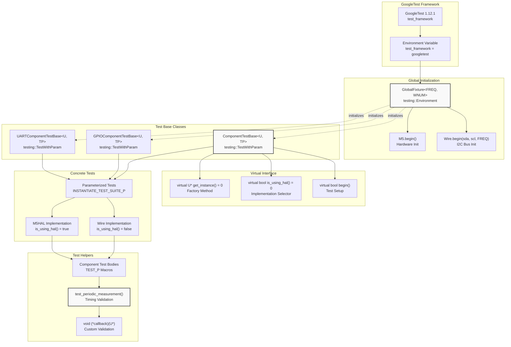
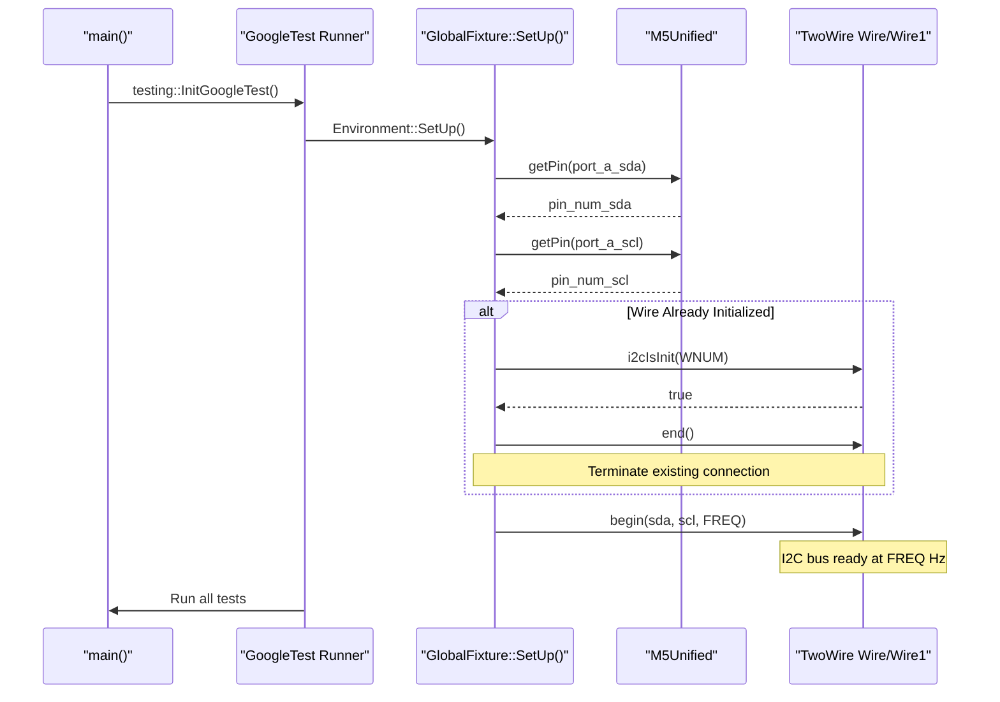
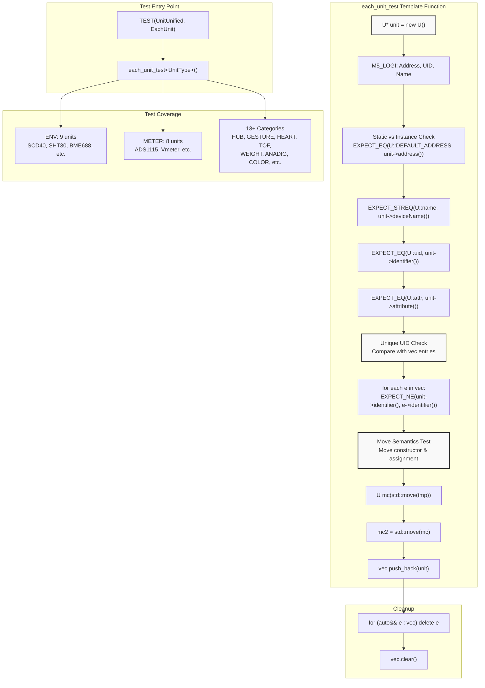

M5UnitUnified Testing

# Testing

<details>
<summary>Relevant source files</summary>

The following files were used as context for generating this wiki page:

- [pio_project/boards/m5stack-atoms3r.json](pio_project/boards/m5stack-atoms3r.json)
- [pio_project/boards/m5stack-nanoc6.json](pio_project/boards/m5stack-nanoc6.json)
- [pio_project/boards/m5stick-cplus2.json](pio_project/boards/m5stick-cplus2.json)
- [pio_project/platformio.ini](pio_project/platformio.ini)
- [pio_project/test/unit_unified_test.cpp](pio_project/test/unit_unified_test.cpp)
- [src/googletest/test_helper.hpp](src/googletest/test_helper.hpp)
- [src/googletest/test_template.hpp](src/googletest/test_template.hpp)
- [src/m5_unit_component/adapter.cpp](src/m5_unit_component/adapter.cpp)
- [src/m5_unit_component/adapter.hpp](src/m5_unit_component/adapter.hpp)
- [src/m5_unit_component/adapter_uart.cpp](src/m5_unit_component/adapter_uart.cpp)

</details>


## Purpose and Scope

This page documents the testing infrastructure for M5UnitUnified, including the GoogleTest framework setup, test base classes, component validation tests, and CI/CD integration. It covers how to run existing tests and write new tests for additional unit components.

For information about build system configuration, see [Build System](#6). For CI/CD pipeline details including code standards enforcement, see [CI/CD Pipeline](#8.1).

---

## Testing Architecture Overview

M5UnitUnified uses a multi-layered testing approach:

1. **GoogleTest Framework** - Provides test fixtures and assertions for embedded testing
2. **Test Base Classes** - Abstract templates supporting I2C, GPIO, and UART components with dual implementations (Arduino/M5HAL)
3. **Component Validation** - Static member validation ensuring unique identifiers and consistent interfaces
4. **Timing Validation** - Helper functions verifying sensor update intervals match specifications
5. **Cross-Device Testing** - PlatformIO environments testing on 14 M5Stack hardware platforms

**Test Framework Architecture**



**Sources:** [src/googletest/test_template.hpp:1-231](), [src/googletest/test_helper.hpp:1-89](), [pio_project/platformio.ini:10-11]()

---

## Test Framework Components

### GlobalFixture: I2C Bus Initialization

The `GlobalFixture` template class initializes the I2C bus before any tests run. It is a GoogleTest environment that ensures hardware is ready for component testing.

**Template Parameters:**
- `FREQ` - I2C bus frequency (typically 400000 Hz)
- `WNUM` - TwoWire instance number (0 or 1, defaults to 0)

**Key Functions:**
- `SetUp()` - Retrieves pin numbers from M5Unified, terminates existing I2C if already initialized, and starts Wire at specified frequency

**GlobalFixture Implementation Flow**



**Sources:** [src/googletest/test_template.hpp:28-54]()

**Example Usage:**
```cpp
// Register global fixture for 400kHz I2C on Wire (instance 0)
testing::AddGlobalTestEnvironment(
    new m5::unit::googletest::GlobalFixture<400000, 0>()
);
```

### ComponentTestBase: I2C Component Testing

The `ComponentTestBase` template class provides a parameterized test fixture for I2C-based components, supporting both Arduino `TwoWire` and M5HAL `Bus` implementations.

**Template Parameters:**
- `U` - Component class (must derive from `m5::unit::Component`)
- `TP` - Parameter type for `INSTANTIATE_TEST_SUITE_P` (typically a tuple or enum)

**Virtual Methods to Implement:**
- `bool is_using_hal() const` - Returns `true` to use M5HAL, `false` for Arduino Wire
- `U* get_instance()` - Factory method returning a new component instance

**Member Variables:**
- `std::unique_ptr<U> unit` - Managed component instance
- `std::string ustr` - Formatted string with component name and implementation type
- `m5::unit::UnitUnified Units` - Manager instance for component lifecycle

**Test Lifecycle:**

| Phase | Method | Actions |
|-------|--------|---------|
| Setup | `SetUp()` | Calls `get_instance()`, creates `ustr`, calls `begin()`, adds unit to `Units` |
| Begin | `begin()` | Routes to M5HAL or Wire path based on `is_using_hal()`, calls `Units.add()` and `Units.begin()` |
| Test | Test body | Accesses `unit` pointer, calls component methods, performs assertions |
| Teardown | `TearDown()` | Currently empty (cleanup handled by destructors) |

**Sources:** [src/googletest/test_template.hpp:57-110]()

### GPIOComponentTestBase: GPIO Component Testing

Similar structure to `ComponentTestBase` but for GPIO-based components using `AdapterGPIO`. The `begin()` method retrieves Port B pins (or falls back to Port A if unavailable) and calls `Units.add(*unit, pin_in, pin_out)`.

**Key Differences:**
- Retrieves GPIO pins: `port_b_in`, `port_b_out` (or `port_a_pin1`, `port_a_pin2`)
- M5HAL support marked as "TODO Not yet" 
- Formatted string uses "GPIO" instead of "Wire"

**Sources:** [src/googletest/test_template.hpp:113-171]()

### UARTComponentTestBase: UART Component Testing

Template class for serial-based components. Requires implementing `init_serial()` to return a configured `HardwareSerial*` pointer.

**Additional Virtual Method:**
- `HardwareSerial* init_serial()` - Initialize and return serial port instance

**Additional Member:**
- `HardwareSerial* serial` - Pointer to serial instance used by component

**Sources:** [src/googletest/test_template.hpp:174-226]()

---

## Writing Component Tests

### Parameterized Test Pattern

The test framework uses GoogleTest's parameterized testing to run the same test body with different implementations (Wire vs M5HAL) and configurations.

**Parameterized Test Structure**

```mermaid
graph TB
    subgraph "Test Definition"
        CLASS["Test Class<br/>MyComponentTest : ComponentTestBase"]
        GET_INST["U* get_instance() override<br/>return new UnitMyComponent()"]
        IS_HAL["bool is_using_hal() override<br/>return GetParam() == HAL"]
        
        CLASS --> GET_INST
        CLASS --> IS_HAL
    end
    
    subgraph "Test Bodies"
        TEST1["TEST_P(MyComponentTest, BasicRead)<br/>ASSERT_TRUE(unit->begin())"]
        TEST2["TEST_P(MyComponentTest, PeriodicUpdate)<br/>test_periodic_measurement(unit.get())"]
        TEST3["TEST_P(MyComponentTest, DataValidation)<br/>Validate sensor readings"]
    end
    
    subgraph "Parameterization"
        ENUM["enum Implementation { WIRE, HAL }"]
        INSTANTIATE["INSTANTIATE_TEST_SUITE_P<br/>AllImplementations"]
        VALUES["testing::Values(WIRE, HAL)"]
        
        ENUM --> INSTANTIATE
        VALUES --> INSTANTIATE
    end
    
    subgraph "Test Execution"
        RUN1["MyComponentTest/BasicRead/WIRE"]
        RUN2["MyComponentTest/BasicRead/HAL"]
        RUN3["MyComponentTest/PeriodicUpdate/WIRE"]
        RUN4["MyComponentTest/PeriodicUpdate/HAL"]
        RUN5["MyComponentTest/DataValidation/WIRE"]
        RUN6["MyComponentTest/DataValidation/HAL"]
    end
    
    CLASS --> TEST1
    CLASS --> TEST2
    CLASS --> TEST3
    
    INSTANTIATE --> RUN1
    INSTANTIATE --> RUN2
    INSTANTIATE --> RUN3
    INSTANTIATE --> RUN4
    INSTANTIATE --> RUN5
    INSTANTIATE --> RUN6
    
    style CLASS fill:#f9f9f9,stroke:#333,stroke-width:2px
    style INSTANTIATE fill:#f9f9f9,stroke:#333,stroke-width:2px
```



**Sources:** [src/googletest/test_template.hpp:62-110]()

**Example Test Implementation:**

```cpp
// Define parameter type
enum Implementation { WIRE, HAL };

// Create test class
class MySensorTest : public m5::unit::googletest::ComponentTestBase<
    m5::unit::UnitMySensor, Implementation> {
protected:
    m5::unit::UnitMySensor* get_instance() override {
        return new m5::unit::UnitMySensor();
    }
    
    bool is_using_hal() const override {
        return GetParam() == HAL;
    }
};

// Define test cases
TEST_P(MySensorTest, ReadTemperature) {
    ASSERT_TRUE(unit->inTransaction());
    
    m5::unit::googletest::test_periodic_measurement(
        unit.get(), 5, 2, [](auto* u) {
            float temp = u->temperature();
            EXPECT_GE(temp, -40.0f);
            EXPECT_LE(temp, 85.0f);
        });
}

// Instantiate with both implementations
INSTANTIATE_TEST_SUITE_P(
    AllImplementations,
    MySensorTest,
    testing::Values(WIRE, HAL)
);
```

### Timing Validation with test_periodic_measurement

The `test_periodic_measurement()` helper validates that components update at their specified intervals. It repeatedly calls `unit->update()` and measures the time between `updated()` flags.

**Function Signatures:**

```cpp
// Full signature with all parameters
template <class U>
uint32_t test_periodic_measurement(
    U* unit,                     // Component to test
    const uint32_t times,        // Number of measurements
    const uint32_t tolerance,    // Allowed deviation (ms)
    const uint32_t timeout_duration, // Total timeout (ms)
    void (*callback)(U*),        // Optional validation callback
    const bool skip_after_test   // Skip assertions if true
);

// Convenience overloads
test_periodic_measurement(unit, times, tolerance, callback, skip);
test_periodic_measurement(unit, times, callback, skip);
```

**Behavior:**
1. Retrieves component's `interval()` setting
2. Loops calling `update()` until `times` updates occur or timeout
3. Tracks time between updates using `updatedMillis()`
4. Calculates average interval duration
5. Calls optional `callback` for each update (for custom validation)
6. Asserts average interval ≤ `interval + tolerance` (unless `skip_after_test`)

**Sources:** [src/googletest/test_helper.hpp:22-84]()

**Example with Callback:**

```cpp
TEST_P(MySensorTest, PeriodicMeasurement) {
    // Validate 8 measurements with 1ms tolerance
    auto avg = m5::unit::googletest::test_periodic_measurement(
        unit.get(), 8, 1,
        [](m5::unit::UnitMySensor* u) {
            // Validate each measurement
            EXPECT_TRUE(u->updated());
            EXPECT_NE(u->temperature(), 0.0f);
        }
    );
    
    // avg now contains the measured average interval
    M5_LOGI("Average interval: %u ms", avg);
}
```

---

## Component Validation Tests

The file [pio_project/test/unit_unified_test.cpp:1-170]() contains a comprehensive validation suite that tests static interface consistency across all 40+ unit types.

### Validation Test Flow

**Component Validation Process**



**Sources:** [pio_project/test/unit_unified_test.cpp:36-169]()

### Validation Checks

The `each_unit_test<U>()` template function performs the following validations:

| Check | Purpose | Assertion |
|-------|---------|-----------|
| **Instance Creation** | Component can be instantiated | `EXPECT_TRUE((bool)unit)` |
| **Static Address Match** | Class and instance return same address | `EXPECT_EQ(U::DEFAULT_ADDRESS, unit->address())` |
| **Name Match** | Class and instance return same name | `EXPECT_STREQ(U::name, unit->deviceName())` |
| **UID Match** | Class and instance return same identifier | `EXPECT_EQ(U::uid, unit->identifier())` |
| **Attribute Match** | Class and instance return same attributes | `EXPECT_EQ(U::attr, unit->attribute())` |
| **Unique UID** | No duplicate identifiers across all units | `EXPECT_NE(unit->identifier(), e->identifier())` |
| **Move Constructor** | Component supports move construction | `U mc(std::move(tmp))` compiles and runs |
| **Move Assignment** | Component supports move assignment | `mc2 = std::move(mc)` compiles and runs |

**Sources:** [pio_project/test/unit_unified_test.cpp:48-80]()

### Tested Unit Categories

The test validates all components from 16 categories:

**Unit Categories Tested:**

- **ENV** (9 units): `UnitSCD40`, `UnitSCD41`, `UnitSHT30`, `UnitQMP6988`, `UnitENV3`, `UnitBME688`, `UnitSGP30`, `UnitSHT40`, `UnitBMP280`, `UnitENV4`
- **METER** (8 units): `UnitADS1113`, `UnitADS1114`, `UnitADS1115`, `UnitEEPROM`, `UnitAmeter`, `UnitVmeter`, `UnitKmeterISO`, `UnitDualKmeter`
- **HUB** (1 unit): `UnitPCA9548AP`
- **GESTURE** (1 unit): `UnitPAJ7620U2`
- **HEART** (2 units): `UnitMAX30100`, `UnitMAX30102`
- **TOF** (2 units): `UnitVL53L0X`, `UnitVL53L1X`
- **WEIGHT** (2 units): `UnitWeightI2C`, `UnitMiniScales`
- **ANADIG** (5 units): `UnitMCP4725`, `UnitGP8413`, `UnitADS11XX`, `UnitADS1110`, `UnitADS1100`
- **COLOR** (1 unit): `UnitTCS34725`
- **THERMO** (3 units): `UnitMLX90614`, `UnitMLX90614BAA`, `UnitNCIR2`
- **DISTANCE** (1 unit): `UnitRCWL9620`
- **EXTIO** (1 unit): `UnitExtIO2`
- **INFRARED** (1 unit): `UnitSTHS34PF80`
- **CRYPTO** (2 units): `UnitATECC608B`, `UnitATECC608B_TNGTLS`
- **RFID** (2 units): `UnitMFRC522`, `UnitWS1850S`
- **KEYBOARD** (4 units): `UnitKeyboard`, `UnitKeyboardBitwise`, `UnitCardKB`, `UnitFacesQWERTY`

**Sources:** [pio_project/test/unit_unified_test.cpp:87-163]()

---

## Running Tests

### PlatformIO Test Configuration

Tests are configured in [pio_project/platformio.ini:1-274](). The test framework is specified globally and inherited by all test environments.

**Global Test Settings:**

```ini
[env]
test_framework = googletest
test_build_src = true
```

**Test-Specific Base Configuration:**

```ini
[m5base]
test_speed = 115200
test_filter = embedded/test_update
test_ignore = native/*
```

**Test Framework Dependency:**

```ini
[test_fw]
lib_deps = google/googletest@1.12.1
```

**Sources:** [pio_project/platformio.ini:10-11](), [pio_project/platformio.ini:49-51](), [pio_project/platformio.ini:188-189]()

### Test Environment Matrix

M5UnitUnified provides test environments for 14 M5Stack devices. Each environment extends the base configuration and adds GoogleTest as a dependency.

**Test Environment Structure:**

| Environment | Board | Extends | GoogleTest |
|-------------|-------|---------|------------|
| `env:test_Core` | m5stack-grey | Core, option_release | ✓ |
| `env:test_Core2` | m5stack-core2 | Core2, option_release | ✓ |
| `env:test_CoreS3` | m5stack-cores3 | CoreS3, option_release | ✓ |
| `env:test_Fire` | m5stack-fire | Fire, option_release | ✓ |
| `env:test_StampS3` | m5stack-stamps3 | StampS3, option_release | ✓ |
| `env:test_Dial` | m5stack-stamps3 | Dial, option_release | ✓ |
| `env:test_AtomMatrix` | m5stack-atom | AtomMatrix, option_release | ✓ |
| `env:test_AtomS3` | m5stack-atoms3 | AtomS3, option_release | ✓ |
| `env:test_AtomS3R` | m5stack-atoms3r | AtomS3R, option_release | ✓ |
| `env:test_NanoC6` | m5stack-nanoc6 | NanoC6, option_release | ✓ |
| `env:test_StickCPlus` | m5stick-c | StickCPlus, option_release | ✓ |
| `env:test_StickCPlus2` | m5stick-cplus2 | StickCPlus2, option_release | ✓ |
| `env:test_Paper` | m5stack-fire | Paper, option_release | ✓ |
| `env:test_CoreInk` | m5stack-coreink | CoreInk, option_release | ✓ |

**Sources:** [pio_project/platformio.ini:205-273]()

### Running Tests via PlatformIO

**Run all tests on a specific device:**
```bash
pio test -e test_CoreS3
```

**Run all tests on all devices:**
```bash
pio test
```

**Run with verbose output:**
```bash
pio test -e test_AtomS3 -v
```

**Filter specific tests:**
```bash
pio test -e test_Core --filter="*/EachUnit/*"
```

**Upload and monitor:**
```bash
pio test -e test_Core2 --upload-port /dev/ttyUSB0
```

### Test Output

Tests produce GoogleTest-formatted output with test results, assertions, and timing information:

```
[----------] 1 test from UnitUnified
[ RUN      ] UnitUnified.EachUnit
[       OK ] UnitUnified.EachUnit (125 ms)
[----------] 1 test from UnitUnified (125 ms total)

[==========] 1 test from 1 test suite ran. (125 ms total)
[  PASSED  ] 1 test.
```

---

## CI/CD Integration

Testing is integrated into the GitHub Actions workflow alongside code formatting and linting checks. See [CI/CD Pipeline](#8.1) for complete CI/CD documentation.

**Test-Related CI Actions:**

| Workflow | Trigger | Purpose |
|----------|---------|---------|
| clang-format | Push, PR | Validates C++ formatting in `src/`, `examples/`, `test/` |
| Arduino Lint | Push, PR | Validates library structure compliance |
| Doxygen | Release | Generates API documentation from test annotations |

The test code itself follows the same formatting standards enforced by `.clang-format` and is included in the clang-format check workflow.

**Sources:** [pio_project/platformio.ini:1-274]()

---

## Test Directory Structure

```
pio_project/
├── test/
│   ├── unit_unified_test.cpp       # Component validation tests
│   └── embedded/
│       └── test_update/            # Filtered by test_filter
└── platformio.ini                  # Test configuration

src/
└── googletest/
    ├── test_template.hpp            # GlobalFixture, base classes
    └── test_helper.hpp              # test_periodic_measurement()
```

**Key Files:**

- **[pio_project/test/unit_unified_test.cpp:1-170]()** - Main test suite validating all 40+ component types
- **[src/googletest/test_template.hpp:1-231]()** - Test framework with GlobalFixture and base classes
- **[src/googletest/test_helper.hpp:1-89]()** - Helper functions for periodic measurement testing
- **[pio_project/platformio.ini:10-11]()** - GoogleTest framework configuration
- **[pio_project/platformio.ini:188-189]()** - Test framework dependency specification

**Sources:** [pio_project/test/unit_unified_test.cpp:1-9](), [src/googletest/test_template.hpp:1-11](), [src/googletest/test_helper.hpp:1-10]()