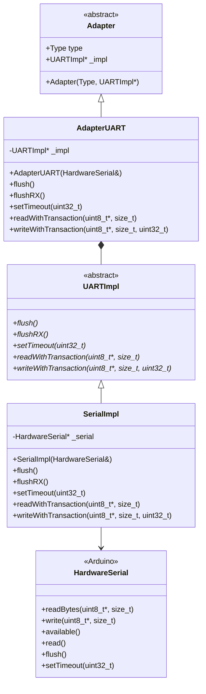
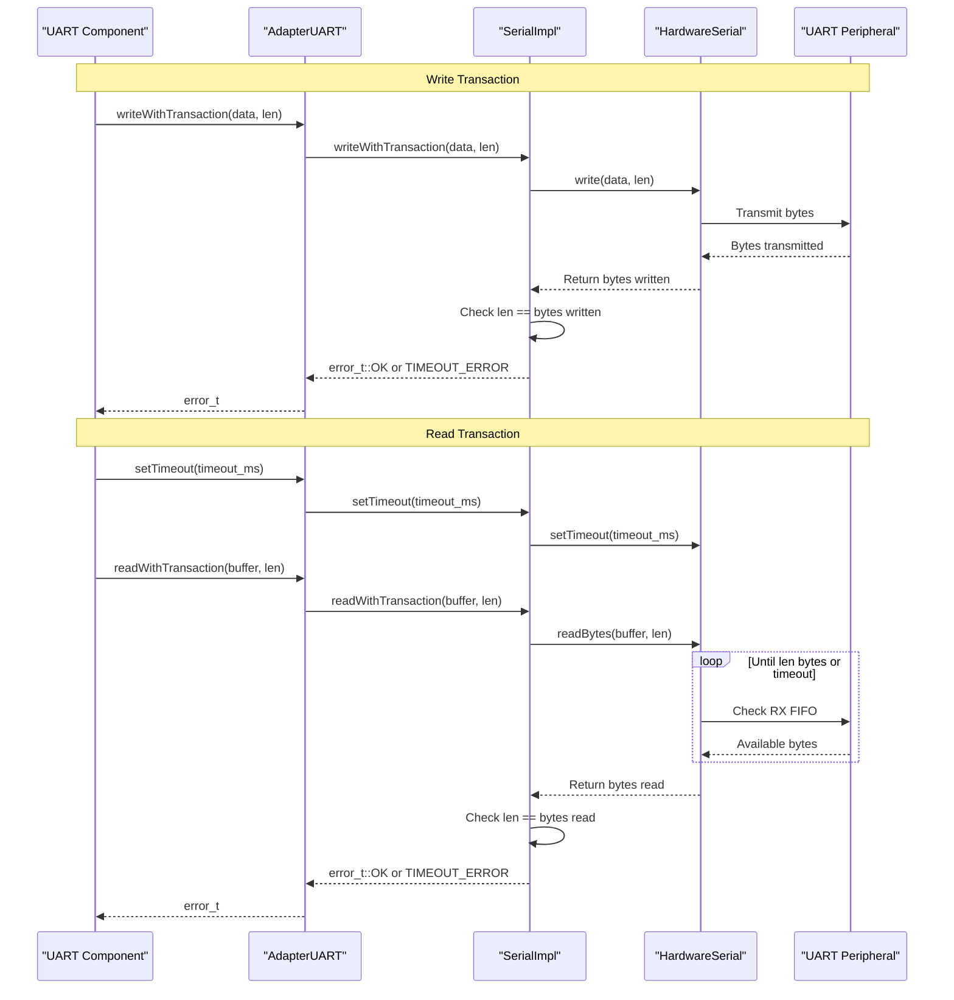
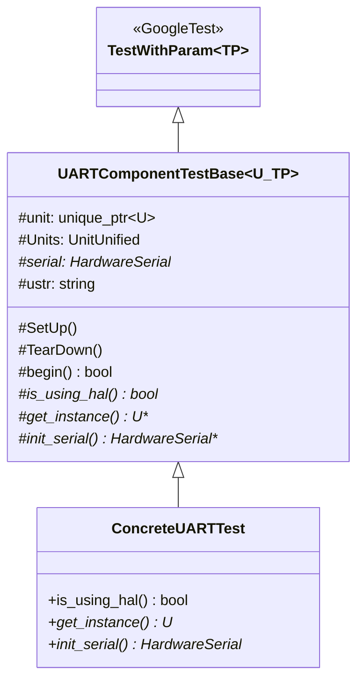
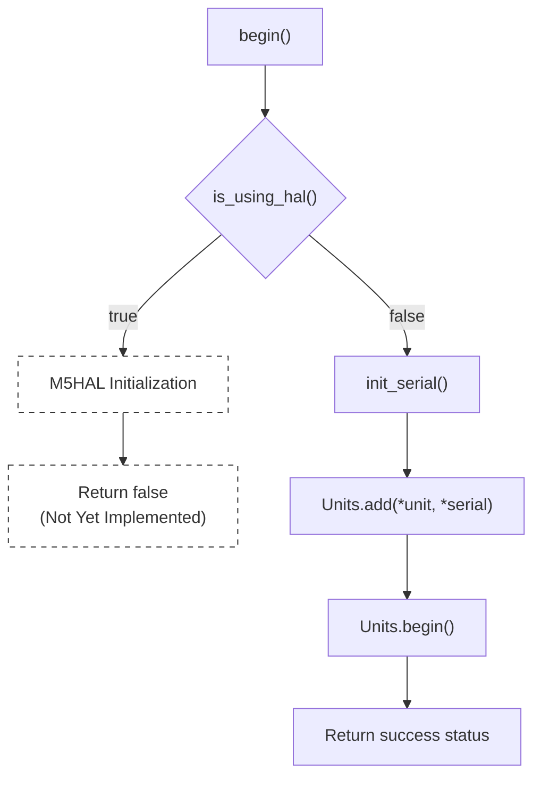

M5UnitUnified UART Communication

# UART Communication

<details>
<summary>Relevant source files</summary>

The following files were used as context for generating this wiki page:

- [src/googletest/test_helper.hpp](src/googletest/test_helper.hpp)
- [src/googletest/test_template.hpp](src/googletest/test_template.hpp)
- [src/m5_unit_component/adapter.cpp](src/m5_unit_component/adapter.cpp)
- [src/m5_unit_component/adapter.hpp](src/m5_unit_component/adapter.hpp)
- [src/m5_unit_component/adapter_uart.cpp](src/m5_unit_component/adapter_uart.cpp)

</details>


## Purpose and Scope

This document describes the UART communication adapter implementation in M5UnitUnified. It covers the `AdapterUART` class, which provides a unified interface for serial communication with M5Stack units that use UART protocol.

For information about other communication protocols, see [I2C Communication](#4.1) and [GPIO and RMT](#4.2). For overall adapter architecture concepts, see [Adapter Pattern](#3.3).

---

## Architecture Overview

`AdapterUART` implements the adapter pattern to provide a consistent interface for UART-based units. Currently, it wraps Arduino's `HardwareSerial` class directly. Future versions will support M5HAL's serial interface.

### Class Hierarchy



**Sources:** [src/m5_unit_component/adapter_uart.cpp:1-66](), [src/m5_unit_component/adapter.hpp:1-25]()

The adapter implements a two-level abstraction:
1. **AdapterUART**: Public interface conforming to the adapter pattern
2. **UARTImpl**: Abstract implementation layer
3. **SerialImpl**: Concrete implementation wrapping `HardwareSerial`

This structure allows future implementations (e.g., M5HAL-based or SoftwareSerial) to be added without changing the public API.

---

## SerialImpl Implementation

### Constructor and Member

The `SerialImpl` class stores a pointer to a `HardwareSerial` instance provided during construction:

| Member | Type | Description |
|--------|------|-------------|
| `_serial` | `HardwareSerial*` | Pointer to Arduino serial port |

**Sources:** [src/m5_unit_component/adapter_uart.cpp:25-27]()

### Transaction Methods

#### readWithTransaction()

```cpp
m5::hal::error::error_t readWithTransaction(uint8_t* data, const size_t len)
```

Reads exactly `len` bytes from the serial port. Returns `m5::hal::error::error_t::OK` if successful, `m5::hal::error::error_t::TIMEOUT_ERROR` if the timeout expires before reading all bytes.

**Implementation:** Wraps `HardwareSerial::readBytes()` which blocks until either:
- All requested bytes are read
- The timeout (set via `setTimeout()`) expires

**Sources:** [src/m5_unit_component/adapter_uart.cpp:46-50]()

#### writeWithTransaction()

```cpp
m5::hal::error::error_t writeWithTransaction(const uint8_t* data, const size_t len, const uint32_t)
```

Writes `len` bytes to the serial port. The third parameter is currently unused. Returns `m5::hal::error::error_t::OK` if all bytes were written, `m5::hal::error::error_t::TIMEOUT_ERROR` otherwise.

**Implementation:** Wraps `HardwareSerial::write()` and verifies that the number of bytes written matches the request.

**Sources:** [src/m5_unit_component/adapter_uart.cpp:52-56]()

### Utility Methods

#### setTimeout()

```cpp
void setTimeout(const uint32_t ms)
```

Configures the timeout for blocking read operations. Directly forwards to `HardwareSerial::setTimeout()`.

**Sources:** [src/m5_unit_component/adapter_uart.cpp:41-44]()

#### flush()

```cpp
void flush()
```

Blocks until the transmission buffer is empty. This ensures all outgoing data has been physically transmitted before returning. Wraps `HardwareSerial::flush()`.

**Sources:** [src/m5_unit_component/adapter_uart.cpp:29-32]()

#### flushRX()

```cpp
void flushRX()
```

Clears the receive buffer by discarding all available data. Useful for clearing stale data before starting a new transaction.

**Implementation:** Loops while `available()` returns true, calling `read()` to discard each byte.

**Sources:** [src/m5_unit_component/adapter_uart.cpp:34-39]()

---

## Communication Flow



**Sources:** [src/m5_unit_component/adapter_uart.cpp:41-56]()

The transaction methods provide blocking I/O with timeout protection:
- **Write**: Non-blocking write with verification
- **Read**: Blocking read with configurable timeout
- **Error Handling**: Consistent error codes (`error_t::OK` or `error_t::TIMEOUT_ERROR`)

---

## Using AdapterUART

### Creating an Adapter Instance

The `AdapterUART` constructor requires a reference to an initialized `HardwareSerial` object:

```cpp
AdapterUART(HardwareSerial& serial)
```

**Example Pattern:**
```cpp
// Typical initialization sequence (pseudocode)
HardwareSerial* serial = &Serial2;
serial->begin(115200, SERIAL_8N1, rx_pin, tx_pin);

AdapterUART adapter(*serial);
```

The adapter stores an internal `SerialImpl` instance that wraps the provided serial port.

**Sources:** [src/m5_unit_component/adapter_uart.cpp:58-61]()

### Integration with UnitUnified Manager

Components using UART are registered with the `UnitUnified` manager by passing the serial port:

```cpp
bool UnitUnified::add(Component& component, HardwareSerial& serial)
```

The manager internally creates an `AdapterUART` and assigns it to the component via `std::shared_ptr`, enabling adapter sharing between components on the same serial port.

**Sources:** Referenced in [src/googletest/test_template.hpp:212]()

### Direct Component Usage

Components can also use `AdapterUART` directly without the `UnitUnified` manager (Component-Only Pattern, see [Component-Only Pattern](#5.2)):

```cpp
// Pseudocode example
MyUARTComponent unit;
auto adapter = std::make_shared<AdapterUART>(Serial2);
unit.assign(adapter);
unit.begin();
```

---

## Transaction Method Details

### Error Codes

Both transaction methods return `m5::hal::error::error_t` values:

| Error Code | Meaning | When Returned |
|------------|---------|---------------|
| `error_t::OK` | Success | All requested bytes were transferred |
| `error_t::TIMEOUT_ERROR` | Timeout or incomplete transfer | Fewer bytes transferred than requested |

**Sources:** [src/m5_unit_component/adapter_uart.cpp:46-56]()

### Timeout Behavior

The `readWithTransaction()` method respects the timeout set via `setTimeout()`. The Arduino `readBytes()` function:
- Blocks until `len` bytes are available
- Returns early if timeout expires
- Returns the actual number of bytes read

The `SerialImpl` wrapper treats a partial read as a timeout error.

**Sources:** [src/m5_unit_component/adapter_uart.cpp:46-50]()

### Write Behavior

The `writeWithTransaction()` method is non-blocking in terms of hardware transmission but verifies completeness:
- `HardwareSerial::write()` buffers data and returns immediately
- The return value indicates how many bytes were accepted into the buffer
- If buffer is full, fewer bytes may be written than requested

Use `flush()` after writing to ensure physical transmission is complete.

**Sources:** [src/m5_unit_component/adapter_uart.cpp:52-56]()

---

## Buffer Management

### Receive Buffer Clearing

Use `flushRX()` to discard stale data in the receive buffer:

```cpp
adapter.flushRX();  // Clear any pending data
adapter.writeWithTransaction(command, cmd_len);
adapter.setTimeout(100);
adapter.readWithTransaction(response, resp_len);
```

This is particularly important for command-response protocols where:
- Previous responses may still be in the buffer
- Unsolicited messages may arrive
- Buffer overflow may have occurred

**Sources:** [src/m5_unit_component/adapter_uart.cpp:34-39]()

### Transmit Buffer Flushing

Use `flush()` to wait for complete transmission:

```cpp
adapter.writeWithTransaction(data, len);
adapter.flush();  // Wait for hardware transmission
// Now safe to power down or reconfigure
```

This is critical when:
- Entering low-power modes
- Reconfiguring the serial port
- Ensuring data integrity before critical operations

**Sources:** [src/m5_unit_component/adapter_uart.cpp:29-32]()

---

## Testing UART Components

### UARTComponentTestBase Class

The GoogleTest framework provides `UARTComponentTestBase` for testing UART-based components:



**Sources:** [src/googletest/test_template.hpp:173-226]()

### Test Setup Process

The `UARTComponentTestBase::begin()` method initializes components for testing:



**Sources:** [src/googletest/test_template.hpp:203-213]()

### Required Virtual Methods

Test classes must implement three pure virtual methods:

| Method | Return Type | Purpose |
|--------|-------------|---------|
| `is_using_hal()` | `bool` | Return `false` for HardwareSerial, `true` for M5HAL (not yet supported) |
| `get_instance()` | `U*` | Create and return a new component instance |
| `init_serial()` | `HardwareSerial*` | Initialize and return the serial port to use |

**Sources:** [src/googletest/test_template.hpp:215-220]()

### Current Limitations

The test framework's M5HAL support for UART is marked as "TODO Not yet":

```cpp
if (is_using_hal()) {
    // Using M5HAL
    // TODO Not yet
    return false;
}
```

All UART component tests currently use the direct `HardwareSerial` path.

**Sources:** [src/googletest/test_template.hpp:205-209]()

---

## Implementation Notes

### M5HAL Integration Status

The `AdapterUART` currently only supports Arduino's `HardwareSerial`:
- **Implemented**: `SerialImpl` wrapping `HardwareSerial`
- **Future**: M5HAL serial implementation (not yet available)

The architecture is designed to accommodate M5HAL once available, following the same pattern as `AdapterI2C` which supports both Wire and M5HAL Bus.

**Sources:** [src/m5_unit_component/adapter_uart.cpp:8-10](), [src/googletest/test_template.hpp:205-209]()

### Comparison with Other Adapters

| Feature | AdapterI2C | AdapterGPIO | AdapterUART |
|---------|------------|-------------|-------------|
| Arduino Support | ✅ Wire | ✅ GPIO/RMT | ✅ HardwareSerial |
| M5HAL Support | ✅ Bus | ❌ Not yet | ❌ Not yet |
| Transaction Methods | ✅ | ✅ | ✅ |
| Error Handling | ✅ | ✅ | ✅ |
| Test Framework | ✅ | ✅ | ✅ |

**Sources:** [src/m5_unit_component/adapter.hpp:1-25](), [src/googletest/test_template.hpp:1-231]()

### Header Organization

The UART adapter is included via the main adapter header with conditional compilation:

```cpp
// adapter.hpp structure
#include "adapter_base.hpp"
#include "adapter_i2c.hpp"
#if defined(M5_UNIT_UNIFIED_USING_RMT_V2)
#include "adapter_gpio_v2.hpp"
#else
#include "adapter_gpio_v1.hpp"
#endif
#include "adapter_uart.hpp"
```

UART support is unconditional (unlike GPIO which has version selection) since `HardwareSerial` is consistently available in the Arduino framework.

**Sources:** [src/m5_unit_component/adapter.hpp:14-22]()

---

## Summary

`AdapterUART` provides a consistent interface for UART-based M5Stack units:

**Key Classes:**
- `AdapterUART`: Public adapter interface
- `UARTImpl`: Abstract implementation layer
- `SerialImpl`: Concrete HardwareSerial wrapper

**Transaction Methods:**
- `readWithTransaction()`: Blocking read with timeout
- `writeWithTransaction()`: Verified write operation

**Utility Methods:**
- `setTimeout()`: Configure read timeout
- `flush()`: Wait for transmission complete
- `flushRX()`: Clear receive buffer

**Testing:**
- `UARTComponentTestBase`: GoogleTest base class for UART components
- Parameterized test support
- Future M5HAL integration planned

For examples of UART component usage, see [Component-Only Pattern](#5.2) and [Simple Pattern](#5.1). For general adapter concepts, see [Adapter Pattern](#3.3).